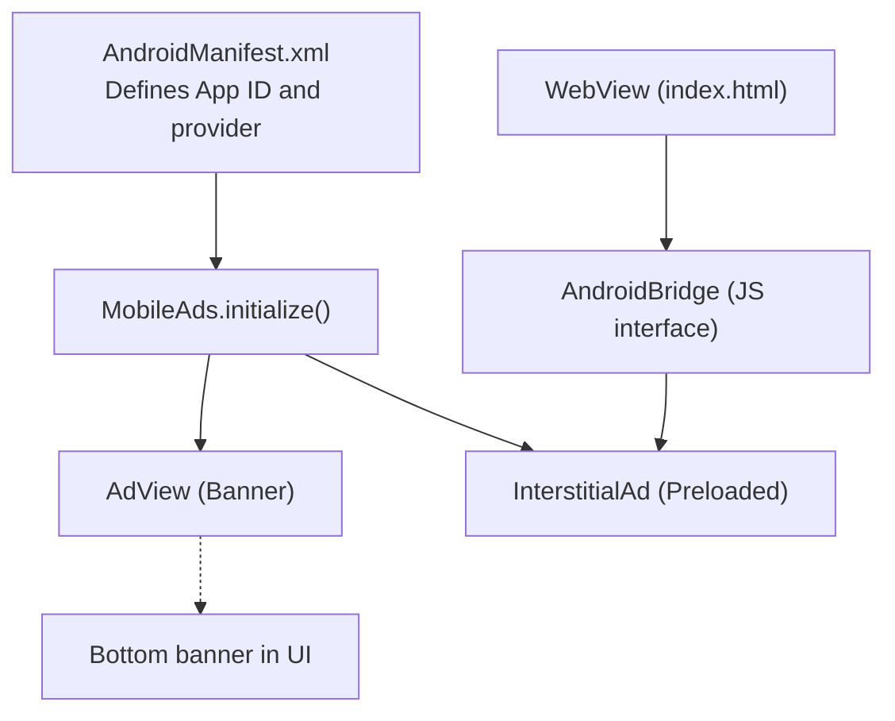
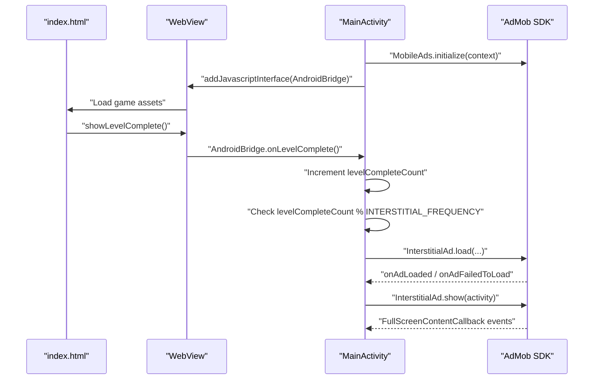
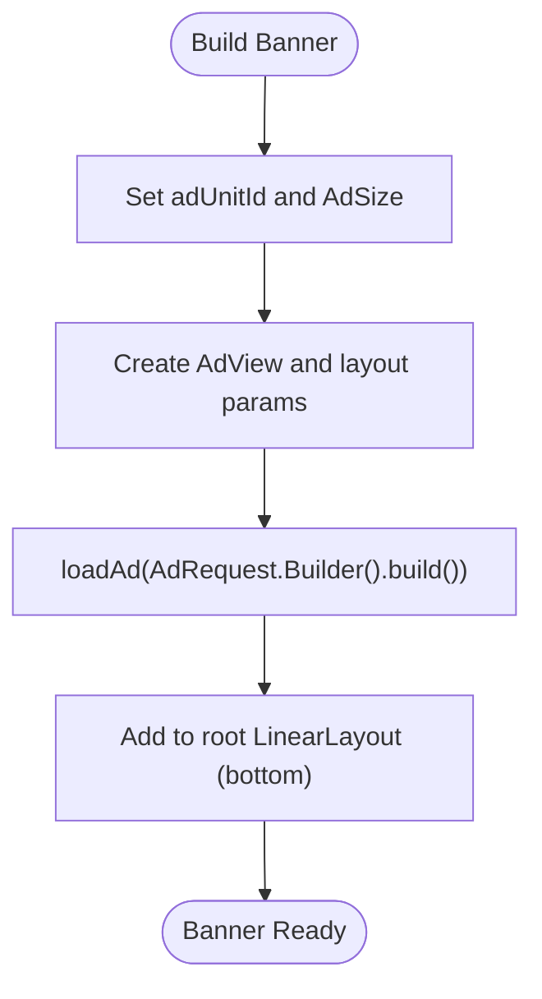
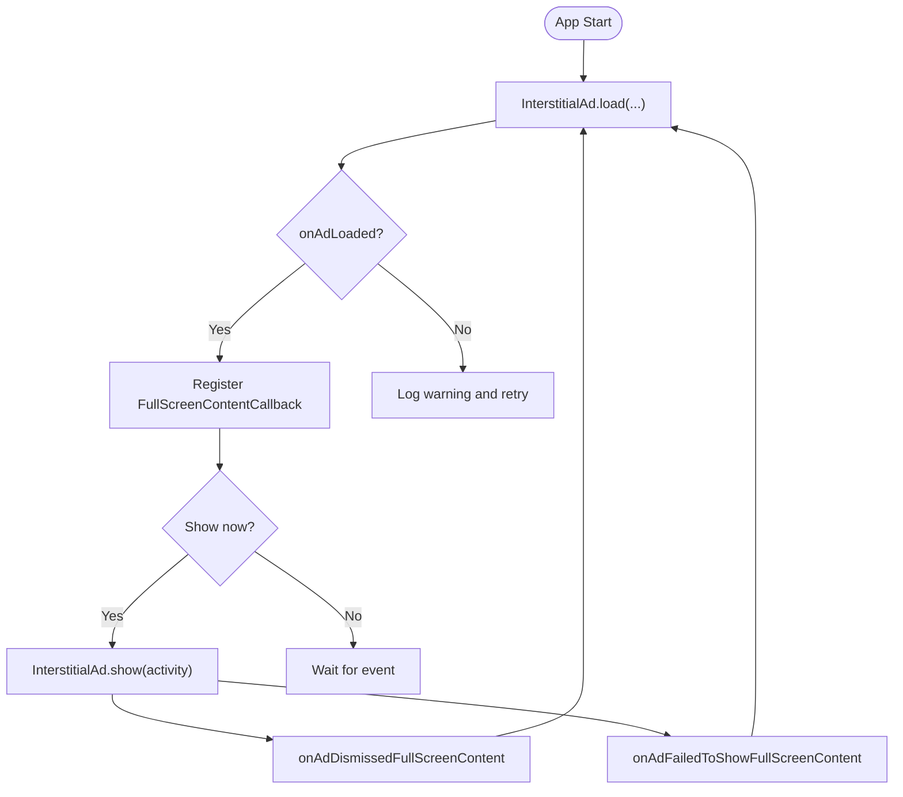
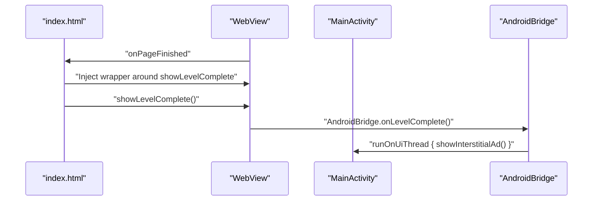
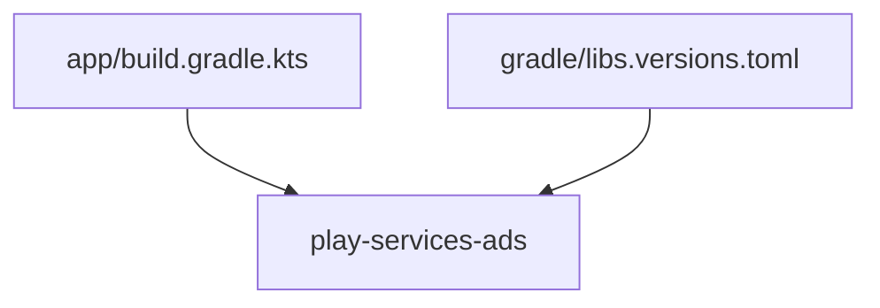

# AdMob Integration

<cite>
**Referenced Files in This Document**
- [ADMOB_SETUP.md](file://ADMOB_SETUP.md)
- [MainActivity.kt](file://app/src/main/java/com/cktechhub/games/MainActivity.kt)
- [AndroidManifest.xml](file://app/src/main/AndroidManifest.xml)
- [index.html](file://app/src/main/assets/index.html)
- [build.gradle.kts](file://app/build.gradle.kts)
- [libs.versions.toml](file://gradle/libs.versions.toml)
</cite>

## Table of Contents
1. [Introduction](#introduction)
2. [Project Structure](#project-structure)
3. [Core Components](#core-components)
4. [Architecture Overview](#architecture-overview)
5. [Detailed Component Analysis](#detailed-component-analysis)
6. [Dependency Analysis](#dependency-analysis)
7. [Performance Considerations](#performance-considerations)
8. [Troubleshooting Guide](#troubleshooting-guide)
9. [Conclusion](#conclusion)
10. [Appendices](#appendices)

## Introduction
This document explains the AdMob integration for monetizing the game. It covers banner ad placement, interstitial ad management, and monetization strategy implementation. It documents the JavaScript bridge that triggers ads from game completion events, ad frequency control, and production ID migration from test IDs. Implementation details include AdMob SDK initialization, banner ad configuration, interstitial ad preloading, and ad callback handling. Configuration options for ad units, frequency settings, and testing procedures are included, along with practical examples, error handling strategies, performance optimization, and best practices for policy compliance.

## Project Structure
The AdMob integration spans Android and web assets:
- Android manifest defines the AdMob App ID and provider.
- MainActivity initializes the AdMob SDK, builds the WebView, injects a JavaScript bridge, loads banner and interstitial ads, and manages lifecycle.
- The game’s HTML/CSS/JS runs inside the WebView and notifies the Android layer upon level completion.

**Diagram sources**
- [AndroidManifest.xml:20-48](file://app/src/main/AndroidManifest.xml#L20-L48)
- [MainActivity.kt:80-82](file://app/src/main/java/com/cktechhub/games/MainActivity.kt#L80-L82)
- [MainActivity.kt:265-277](file://app/src/main/java/com/cktechhub/games/MainActivity.kt#L265-L277)
- [MainActivity.kt:370-409](file://app/src/main/java/com/cktechhub/games/MainActivity.kt#L370-L409)
- [MainActivity.kt:191-192](file://app/src/main/java/com/cktechhub/games/MainActivity.kt#L191-L192)
- [index.html:853-881](file://app/src/main/assets/index.html#L853-L881)

**Section sources**
- [AndroidManifest.xml:1-51](file://app/src/main/AndroidManifest.xml#L1-L51)
- [MainActivity.kt:42-135](file://app/src/main/java/com/cktechhub/games/MainActivity.kt#L42-L135)
- [index.html:1-1094](file://app/src/main/assets/index.html#L1-L1094)

## Core Components
- AdMob SDK Initialization: Initializes the SDK and sets an internal flag when ready.
- Banner Ad: Configured with a fixed size and placed at the bottom of the screen.
- Interstitial Ad: Preloaded on app start and shown on a configurable frequency of level completions.
- JavaScript Bridge: Exposes a native interface to the WebView to receive game events and trigger interstitial ads.
- Frequency Control: Tracks level completions and shows interstitials every N completions.

Key implementation references:
- SDK initialization and flags: [MainActivity.kt:80-82](file://app/src/main/java/com/cktechhub/games/MainActivity.kt#L80-L82)
- Banner creation and load: [MainActivity.kt:265-277](file://app/src/main/java/com/cktechhub/games/MainActivity.kt#L265-L277)
- Interstitial preloading and callbacks: [MainActivity.kt:370-409](file://app/src/main/java/com/cktechhub/games/MainActivity.kt#L370-L409)
- JavaScript bridge injection and event handling: [MainActivity.kt:191-192](file://app/src/main/java/com/cktechhub/games/MainActivity.kt#L191-L192), [MainActivity.kt:428-439](file://app/src/main/java/com/cktechhub/games/MainActivity.kt#L428-L439)
- Frequency constant and logic: [MainActivity.kt:54-60](file://app/src/main/java/com/cktechhub/games/MainActivity.kt#L54-L60), [MainActivity.kt:431-438](file://app/src/main/java/com/cktechhub/games/MainActivity.kt#L431-L438)

**Section sources**
- [MainActivity.kt:54-60](file://app/src/main/java/com/cktechhub/games/MainActivity.kt#L54-L60)
- [MainActivity.kt:265-277](file://app/src/main/java/com/cktechhub/games/MainActivity.kt#L265-L277)
- [MainActivity.kt:370-409](file://app/src/main/java/com/cktechhub/games/MainActivity.kt#L370-L409)
- [MainActivity.kt:428-439](file://app/src/main/java/com/cktechhub/games/MainActivity.kt#L428-L439)

## Architecture Overview
The integration follows a clear separation of concerns:
- Android layer handles SDK initialization, ad lifecycle, and UI composition.
- WebView layer runs the game logic and communicates with Android via a JavaScript interface.
- AdMob SDK manages ad requests and rendering.

**Diagram sources**
- [MainActivity.kt:80-82](file://app/src/main/java/com/cktechhub/games/MainActivity.kt#L80-L82)
- [MainActivity.kt:191-192](file://app/src/main/java/com/cktechhub/games/MainActivity.kt#L191-L192)
- [MainActivity.kt:428-439](file://app/src/main/java/com/cktechhub/games/MainActivity.kt#L428-L439)
- [MainActivity.kt:370-409](file://app/src/main/java/com/cktechhub/games/MainActivity.kt#L370-L409)
- [index.html:853-881](file://app/src/main/assets/index.html#L853-L881)

## Detailed Component Analysis

### Banner Ad Placement
- Configuration: The banner is configured with a fixed size and centered horizontally at the bottom of the screen.
- Placement: Created during activity setup and added to the root vertical layout.
- Request: Loaded immediately after creation with a basic ad request.

Implementation highlights:
- Banner creation and load: [MainActivity.kt:265-277](file://app/src/main/java/com/cktechhub/games/MainActivity.kt#L265-L277)
- Layout composition: [MainActivity.kt:95-127](file://app/src/main/java/com/cktechhub/games/MainActivity.kt#L95-L127)

**Diagram sources**
- [MainActivity.kt:265-277](file://app/src/main/java/com/cktechhub/games/MainActivity.kt#L265-L277)
- [MainActivity.kt:95-127](file://app/src/main/java/com/cktechhub/games/MainActivity.kt#L95-L127)

**Section sources**
- [MainActivity.kt:265-277](file://app/src/main/java/com/cktechhub/games/MainActivity.kt#L265-L277)
- [MainActivity.kt:95-127](file://app/src/main/java/com/cktechhub/games/MainActivity.kt#L95-L127)

### Interstitial Ad Management
- Preloading: Interstitial is preloaded on app start and reloaded after dismissal or failure.
- Callbacks: Dismissal and failure trigger immediate preloading to maintain availability.
- Show logic: Shown only when an ad is ready; otherwise logs and preloads.

Implementation highlights:
- Preload and callbacks: [MainActivity.kt:370-409](file://app/src/main/java/com/cktechhub/games/MainActivity.kt#L370-L409)
- Show logic: [MainActivity.kt:402-409](file://app/src/main/java/com/cktechhub/games/MainActivity.kt#L402-L409)

**Diagram sources**
- [MainActivity.kt:370-409](file://app/src/main/java/com/cktechhub/games/MainActivity.kt#L370-L409)

**Section sources**
- [MainActivity.kt:370-409](file://app/src/main/java/com/cktechhub/games/MainActivity.kt#L370-L409)
- [MainActivity.kt:402-409](file://app/src/main/java/com/cktechhub/games/MainActivity.kt#L402-L409)

### JavaScript Bridge and Game Event Triggers
- Injection: A JavaScript interface named AndroidBridge is injected into the WebView.
- Hooking: On page finished, the game’s showLevelComplete is wrapped to call AndroidBridge.onLevelComplete.
- Trigger: onLevelComplete increments a counter and shows an interstitial based on frequency.

Implementation highlights:
- Bridge injection: [MainActivity.kt:191-192](file://app/src/main/java/com/cktechhub/games/MainActivity.kt#L191-L192)
- Event hooking: [MainActivity.kt:214-228](file://app/src/main/java/com/cktechhub/games/MainActivity.kt#L214-L228)
- Event handler: [MainActivity.kt:428-439](file://app/src/main/java/com/cktechhub/games/MainActivity.kt#L428-L439)
- Game completion overlay: [index.html:853-881](file://app/src/main/assets/index.html#L853-L881)

**Diagram sources**
- [MainActivity.kt:214-228](file://app/src/main/java/com/cktechhub/games/MainActivity.kt#L214-L228)
- [MainActivity.kt:428-439](file://app/src/main/java/com/cktechhub/games/MainActivity.kt#L428-L439)
- [index.html:853-881](file://app/src/main/assets/index.html#L853-L881)

**Section sources**
- [MainActivity.kt:191-192](file://app/src/main/java/com/cktechhub/games/MainActivity.kt#L191-L192)
- [MainActivity.kt:214-228](file://app/src/main/java/com/cktechhub/games/MainActivity.kt#L214-L228)
- [MainActivity.kt:428-439](file://app/src/main/java/com/cktechhub/games/MainActivity.kt#L428-L439)
- [index.html:853-881](file://app/src/main/assets/index.html#L853-L881)

### AdMob SDK Initialization and Configuration
- App ID: Defined in the Android manifest meta-data.
- Provider: Declared to support ad initialization.
- Delay measurement init: Disabled to avoid initialization timeouts.

Implementation highlights:
- App ID and provider: [AndroidManifest.xml:20-48](file://app/src/main/AndroidManifest.xml#L20-L48)
- SDK initialize call: [MainActivity.kt:80-82](file://app/src/main/java/com/cktechhub/games/MainActivity.kt#L80-L82)

**Section sources**
- [AndroidManifest.xml:20-48](file://app/src/main/AndroidManifest.xml#L20-L48)
- [MainActivity.kt:80-82](file://app/src/main/java/com/cktechhub/games/MainActivity.kt#L80-L82)

### Configuration Options and Migration to Production IDs
- AdMob App ID: Located in AndroidManifest.xml.
- Banner and Interstitial Unit IDs: Located in MainActivity.kt constants.
- Frequency control: Controlled by INTERSTITIAL_FREQUENCY constant.
- Migration steps: Replace test IDs with production IDs and rebuild.

Implementation highlights:
- IDs and frequency: [MainActivity.kt:54-60](file://app/src/main/java/com/cktechhub/games/MainActivity.kt#L54-L60)
- Migration guide: [ADMOB_SETUP.md:13-62](file://ADMOB_SETUP.md#L13-L62)
- Frequency options: [ADMOB_SETUP.md:80-93](file://ADMOB_SETUP.md#L80-L93)

**Section sources**
- [MainActivity.kt:54-60](file://app/src/main/java/com/cktechhub/games/MainActivity.kt#L54-L60)
- [ADMOB_SETUP.md:13-62](file://ADMOB_SETUP.md#L13-L62)
- [ADMOB_SETUP.md:80-93](file://ADMOB_SETUP.md#L80-L93)

## Dependency Analysis
External dependencies relevant to AdMob:
- Play Services Ads library is declared in Gradle.
- Version pinning is managed via libs.versions.toml.

**Diagram sources**
- [build.gradle.kts:39](file://app/build.gradle.kts#L39)
- [libs.versions.toml:21](file://gradle/libs.versions.toml#L21)

**Section sources**
- [build.gradle.kts:34-43](file://app/build.gradle.kts#L34-L43)
- [libs.versions.toml:1-28](file://gradle/libs.versions.toml#L1-L28)

## Performance Considerations
- Preloading interstitials: Keeps ads ready to minimize latency on triggers.
- Lifecycle handling: Resuming/pausing banner and WebView ensures smooth performance and battery usage.
- Network checks: Ensures the app does not attempt to load ads without connectivity.
- WebView optimization: Disables unnecessary features and sets caching appropriately.

Practical tips:
- Keep interstitial preloading enabled to reduce perceived latency.
- Avoid heavy animations during ad transitions to prevent frame drops.
- Monitor ad load failures and retry with exponential backoff patterns if extending the implementation.

[No sources needed since this section provides general guidance]

## Troubleshooting Guide
Common issues and resolutions:
- Ad loading failures:
  - Symptoms: Logs indicate interstitial failed to load; ad not shown.
  - Resolution: Verify network connectivity, ensure IDs are correct, and confirm ad units are active in the console.
  - Reference: [MainActivity.kt:394-397](file://app/src/main/java/com/cktechhub/games/MainActivity.kt#L394-L397)
- Frequency optimization:
  - Symptoms: Too frequent or too infrequent interstitials.
  - Resolution: Adjust INTERSTITIAL_FREQUENCY constant to balance engagement and user experience.
  - Reference: [MainActivity.kt:58-60](file://app/src/main/java/com/cktechhub/games/MainActivity.kt#L58-L60)
- Compliance with AdMob policies:
  - Ensure test IDs are replaced with production IDs before release.
  - Reference: [ADMOB_SETUP.md:96-103](file://ADMOB_SETUP.md#L96-L103)
- Testing procedures:
  - Use real devices for testing; emulators may not render ads reliably.
  - Allow time for ad units to become active after creation in the console.
  - Reference: [ADMOB_SETUP.md:102-103](file://ADMOB_SETUP.md#L102-L103)

**Section sources**
- [MainActivity.kt:394-397](file://app/src/main/java/com/cktechhub/games/MainActivity.kt#L394-L397)
- [MainActivity.kt:58-60](file://app/src/main/java/com/cktechhub/games/MainActivity.kt#L58-L60)
- [ADMOB_SETUP.md:96-103](file://ADMOB_SETUP.md#L96-L103)
- [ADMOB_SETUP.md:102-103](file://ADMOB_SETUP.md#L102-L103)

## Conclusion
The AdMob integration combines a robust Android layer with a seamless JavaScript bridge to deliver timely interstitial advertisements triggered by game events. Banner ads are placed consistently at the bottom of the screen, while interstitials are preloaded and shown according to a configurable frequency. By replacing test IDs with production IDs and following the documented configuration steps, developers can implement a reliable monetization strategy aligned with AdMob policies.

[No sources needed since this section summarizes without analyzing specific files]

## Appendices

### Practical Integration Patterns
- Banner ad placement:
  - Configure adUnitId and AdSize, then load and attach to the UI.
  - Reference: [MainActivity.kt:265-277](file://app/src/main/java/com/cktechhub/games/MainActivity.kt#L265-L277)
- Interstitial preloading:
  - Load on app start and register FullScreenContentCallback to preload after dismissal/failure.
  - Reference: [MainActivity.kt:370-409](file://app/src/main/java/com/cktechhub/games/MainActivity.kt#L370-L409)
- Triggering from game completion:
  - Inject AndroidBridge, wrap showLevelComplete, and increment frequency counter.
  - Reference: [MainActivity.kt:214-228](file://app/src/main/java/com/cktechhub/games/MainActivity.kt#L214-L228), [MainActivity.kt:428-439](file://app/src/main/java/com/cktechhub/games/MainActivity.kt#L428-L439)

### Monetization Strategy Recommendations
- Frequency tuning: Start with moderate frequency and iterate based on retention and engagement metrics.
- Ad quality: Ensure ads are relevant and non-intrusive; avoid interrupting core gameplay moments excessively.
- Policy compliance: Never release with test IDs; verify ad units are active and approved.

[No sources needed since this section provides general guidance]