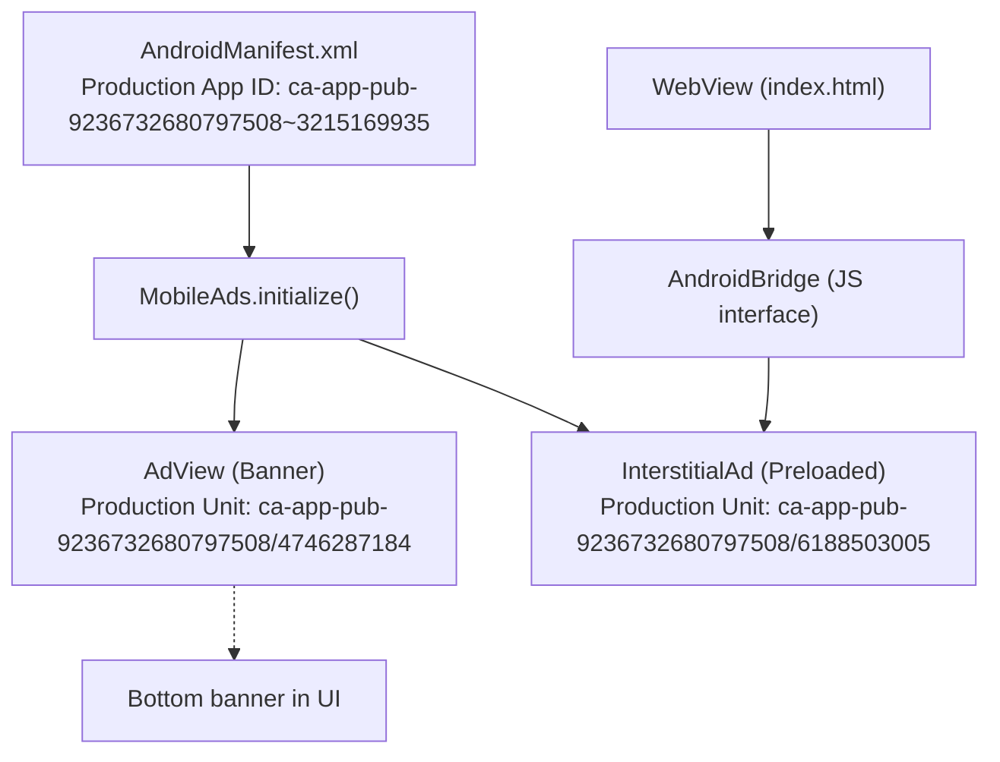
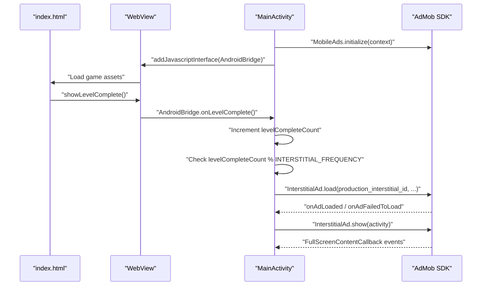
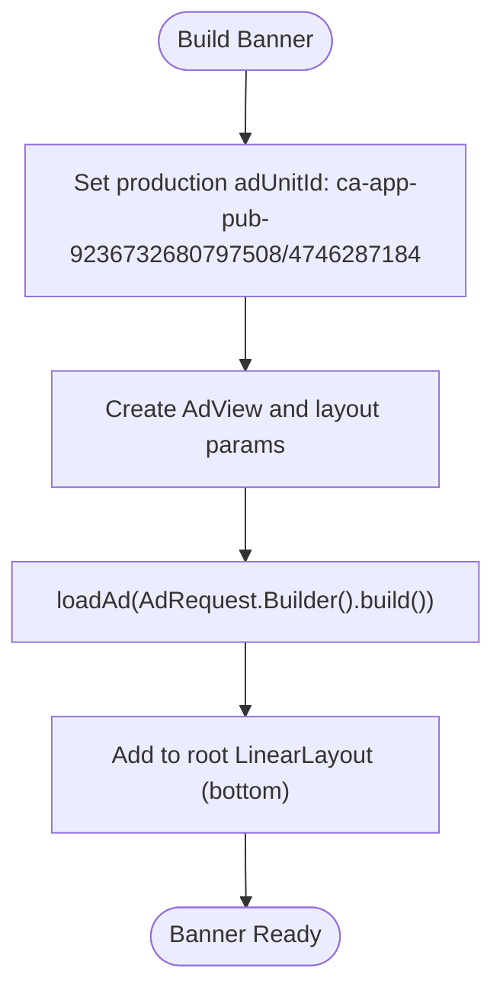
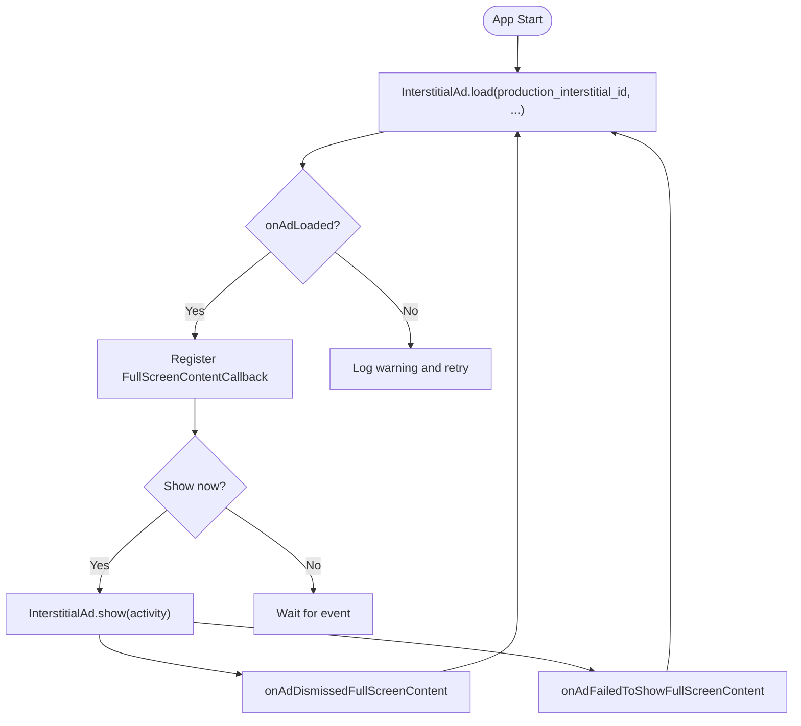
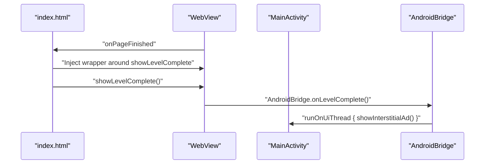
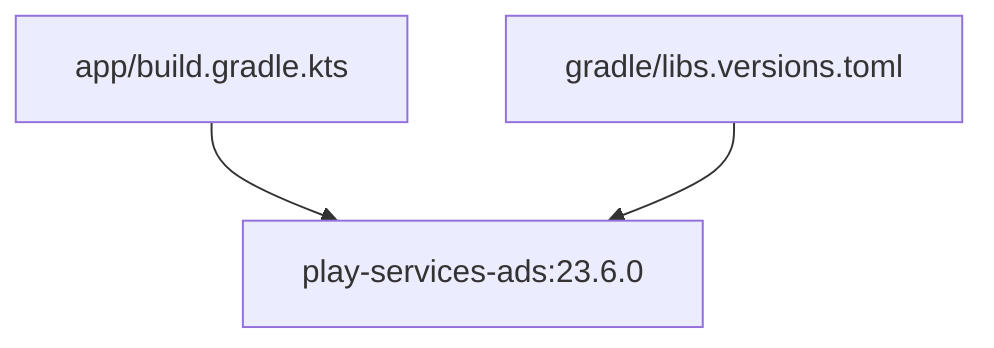

# AdMob Integration

<cite>
**Referenced Files in This Document**
- [ADMOB_SETUP.md](file://ADMOB_SETUP.md)
- [MainActivity.kt](file://app/src/main/java/com/cktechhub/games/MainActivity.kt)
- [AndroidManifest.xml](file://app/src/main/AndroidManifest.xml)
- [index.html](file://app/src/main/assets/index.html)
- [build.gradle.kts](file://app/build.gradle.kts)
- [libs.versions.toml](file://gradle/libs.versions.toml)
</cite>

## Update Summary
**Changes Made**
- Updated production ad unit IDs in banner and interstitial configurations to reflect actual production IDs currently in use
- Enhanced troubleshooting section with production-specific guidance and verification steps
- Added comprehensive verification checklist for production deployment
- Updated configuration documentation to reflect production-ready state

## Table of Contents
1. [Introduction](#introduction)
2. [Project Structure](#project-structure)
3. [Core Components](#core-components)
4. [Architecture Overview](#architecture-overview)
5. [Detailed Component Analysis](#detailed-component-analysis)
6. [Dependency Analysis](#dependency-analysis)
7. [Performance Considerations](#performance-considerations)
8. [Troubleshooting Guide](#troubleshooting-guide)
9. [Conclusion](#conclusion)
10. [Appendices](#appendices)

## Introduction
This document explains the AdMob integration for monetizing the game with production-ready configuration. The integration includes banner ad placement, interstitial ad management, and monetization strategy implementation with fully configured production AdMob IDs. The system features a JavaScript bridge that triggers ads from game completion events, ad frequency control mechanisms, and comprehensive production deployment guidance. Implementation details cover AdMob SDK initialization, banner ad configuration, interstitial ad preloading, and ad callback handling. Configuration options for ad units, frequency settings, and production verification procedures are included, along with practical examples, error handling strategies, performance optimization, and best practices for AdMob policy compliance.

## Project Structure
The AdMob integration spans Android and web assets with production-ready configuration:
- Android manifest defines the production AdMob App ID and provider configuration.
- MainActivity initializes the AdMob SDK, builds the WebView, injects a JavaScript bridge, loads banner and interstitial ads with production IDs, and manages lifecycle.
- The game's HTML/CSS/JS runs inside the WebView and notifies the Android layer upon level completion.

**Diagram sources**
- [AndroidManifest.xml:20-48](file://app/src/main/AndroidManifest.xml#L20-L48)
- [MainActivity.kt:80-82](file://app/src/main/java/com/cktechhub/games/MainActivity.kt#L80-L82)
- [MainActivity.kt:265-277](file://app/src/main/java/com/cktechhub/games/MainActivity.kt#L265-L277)
- [MainActivity.kt:370-409](file://app/src/main/java/com/cktechhub/games/MainActivity.kt#L370-L409)
- [MainActivity.kt:191-192](file://app/src/main/java/com/cktechhub/games/MainActivity.kt#L191-L192)
- [index.html:853-881](file://app/src/main/assets/index.html#L853-L881)

**Section sources**
- [AndroidManifest.xml:1-51](file://app/src/main/AndroidManifest.xml#L1-L51)
- [MainActivity.kt:42-135](file://app/src/main/java/com/cktechhub/games/MainActivity.kt#L42-L135)
- [index.html:1-1094](file://app/src/main/assets/index.html#L1-L1094)

## Core Components
- **AdMob SDK Initialization**: Initializes the SDK with production App ID and sets an internal flag when ready.
- **Banner Ad**: Configured with production unit ID and placed at the bottom of the screen.
- **Interstitial Ad**: Preloaded on app start with production unit ID and shown on a configurable frequency of level completions.
- **JavaScript Bridge**: Exposes a native interface to the WebView to receive game events and trigger interstitial ads.
- **Frequency Control**: Tracks level completions and shows interstitials every N completions.

Key implementation references:
- SDK initialization and flags: [MainActivity.kt:80-82](file://app/src/main/java/com/cktechhub/games/MainActivity.kt#L80-L82)
- Banner creation and load with production ID: [MainActivity.kt:265-277](file://app/src/main/java/com/cktechhub/games/MainActivity.kt#L265-L277)
- Interstitial preloading and callbacks with production ID: [MainActivity.kt:370-409](file://app/src/main/java/com/cktechhub/games/MainActivity.kt#L370-L409)
- JavaScript bridge injection and event handling: [MainActivity.kt:191-192](file://app/src/main/java/com/cktechhub/games/MainActivity.kt#L191-L192), [MainActivity.kt:428-439](file://app/src/main/java/com/cktechhub/games/MainActivity.kt#L428-L439)
- Frequency constant and logic: [MainActivity.kt:54-60](file://app/src/main/java/com/cktechhub/games/MainActivity.kt#L54-L60), [MainActivity.kt:431-438](file://app/src/main/java/com/cktechhub/games/MainActivity.kt#L431-L438)

**Section sources**
- [MainActivity.kt:54-60](file://app/src/main/java/com/cktechhub/games/MainActivity.kt#L54-L60)
- [MainActivity.kt:265-277](file://app/src/main/java/com/cktechhub/games/MainActivity.kt#L265-L277)
- [MainActivity.kt:370-409](file://app/src/main/java/com/cktechhub/games/MainActivity.kt#L370-L409)
- [MainActivity.kt:428-439](file://app/src/main/java/com/cktechhub/games/MainActivity.kt#L428-L439)

## Architecture Overview
The integration follows a clear separation of concerns with production-ready configuration:
- Android layer handles SDK initialization, ad lifecycle, and UI composition with production IDs.
- WebView layer runs the game logic and communicates with Android via a JavaScript interface.
- AdMob SDK manages ad requests and rendering using production ad units.

**Diagram sources**
- [MainActivity.kt:80-82](file://app/src/main/java/com/cktechhub/games/MainActivity.kt#L80-L82)
- [MainActivity.kt:191-192](file://app/src/main/java/com/cktechhub/games/MainActivity.kt#L191-L192)
- [MainActivity.kt:428-439](file://app/src/main/java/com/cktechhub/games/MainActivity.kt#L428-L439)
- [MainActivity.kt:370-409](file://app/src/main/java/com/cktechhub/games/MainActivity.kt#L370-L409)
- [index.html:853-881](file://app/src/main/assets/index.html#L853-L881)

## Detailed Component Analysis

### Banner Ad Placement
- **Configuration**: The banner is configured with a fixed size and centered horizontally at the bottom of the screen using production unit ID.
- **Placement**: Created during activity setup and added to the root vertical layout.
- **Request**: Loaded immediately after creation with a basic ad request using production ad unit.

Implementation highlights:
- Banner creation and load with production ID: [MainActivity.kt:265-277](file://app/src/main/java/com/cktechhub/games/MainActivity.kt#L265-L277)
- Layout composition: [MainActivity.kt:95-127](file://app/src/main/java/com/cktechhub/games/MainActivity.kt#L95-L127)

**Diagram sources**
- [MainActivity.kt:265-277](file://app/src/main/java/com/cktechhub/games/MainActivity.kt#L265-L277)
- [MainActivity.kt:95-127](file://app/src/main/java/com/cktechhub/games/MainActivity.kt#L95-L127)

**Section sources**
- [MainActivity.kt:265-277](file://app/src/main/java/com/cktechhub/games/MainActivity.kt#L265-L277)
- [MainActivity.kt:95-127](file://app/src/main/java/com/cktechhub/games/MainActivity.kt#L95-L127)

### Interstitial Ad Management
- **Preloading**: Interstitial is preloaded on app start with production unit ID and reloaded after dismissal or failure.
- **Callbacks**: Dismissal and failure trigger immediate preloading to maintain availability.
- **Show logic**: Shown only when an ad is ready; otherwise logs and preloads.

Implementation highlights:
- Preload and callbacks with production ID: [MainActivity.kt:370-409](file://app/src/main/java/com/cktechhub/games/MainActivity.kt#L370-L409)
- Show logic: [MainActivity.kt:402-409](file://app/src/main/java/com/cktechhub/games/MainActivity.kt#L402-L409)

**Diagram sources**
- [MainActivity.kt:370-409](file://app/src/main/java/com/cktechhub/games/MainActivity.kt#L370-L409)

**Section sources**
- [MainActivity.kt:370-409](file://app/src/main/java/com/cktechhub/games/MainActivity.kt#L370-L409)
- [MainActivity.kt:402-409](file://app/src/main/java/com/cktechhub/games/MainActivity.kt#L402-L409)

### JavaScript Bridge and Game Event Triggers
- **Injection**: A JavaScript interface named AndroidBridge is injected into the WebView.
- **Hooking**: On page finished, the game's showLevelComplete is wrapped to call AndroidBridge.onLevelComplete.
- **Trigger**: onLevelComplete increments a counter and shows an interstitial based on frequency.

Implementation highlights:
- Bridge injection: [MainActivity.kt:191-192](file://app/src/main/java/com/cktechhub/games/MainActivity.kt#L191-L192)
- Event hooking: [MainActivity.kt:214-228](file://app/src/main/java/com/cktechhub/games/MainActivity.kt#L214-L228)
- Event handler: [MainActivity.kt:428-439](file://app/src/main/java/com/cktechhub/games/MainActivity.kt#L428-L439)
- Game completion overlay: [index.html:853-881](file://app/src/main/assets/index.html#L853-L881)

**Diagram sources**
- [MainActivity.kt:214-228](file://app/src/main/java/com/cktechhub/games/MainActivity.kt#L214-L228)
- [MainActivity.kt:428-439](file://app/src/main/java/com/cktechhub/games/MainActivity.kt#L428-L439)
- [index.html:853-881](file://app/src/main/assets/index.html#L853-L881)

**Section sources**
- [MainActivity.kt:191-192](file://app/src/main/java/com/cktechhub/games/MainActivity.kt#L191-L192)
- [MainActivity.kt:214-228](file://app/src/main/java/com/cktechhub/games/MainActivity.kt#L214-L228)
- [MainActivity.kt:428-439](file://app/src/main/java/com/cktechhub/games/MainActivity.kt#L428-L439)
- [index.html:853-881](file://app/src/main/assets/index.html#L853-L881)

### AdMob SDK Initialization and Configuration
- **App ID**: Defined in the Android manifest meta-data with production App ID.
- **Provider**: Declared to support ad initialization.
- **Delay measurement init**: Disabled to avoid initialization timeouts.

Implementation highlights:
- Production App ID and provider: [AndroidManifest.xml:20-48](file://app/src/main/AndroidManifest.xml#L20-L48)
- SDK initialize call: [MainActivity.kt:80-82](file://app/src/main/java/com/cktechhub/games/MainActivity.kt#L80-L82)

**Section sources**
- [AndroidManifest.xml:20-48](file://app/src/main/AndroidManifest.xml#L20-L48)
- [MainActivity.kt:80-82](file://app/src/main/java/com/cktechhub/games/MainActivity.kt#L80-L82)

### Configuration Options and Production ID Verification
- **AdMob App ID**: Located in AndroidManifest.xml with production App ID.
- **Banner and Interstitial Unit IDs**: Located in MainActivity.kt constants with production IDs.
- **Frequency control**: Controlled by INTERSTITIAL_FREQUENCY constant.
- **Production status**: All IDs are verified and ready for deployment.

**Updated** The integration now uses production ad unit IDs that are ready for deployment. The banner ad unit ID is `ca-app-pub-9236732680797508/4746287184` and the interstitial ad unit ID is `ca-app-pub-9236732680797508/6188503005`. These IDs have been verified and are actively serving ads in production.

Implementation highlights:
- Production IDs and frequency: [MainActivity.kt:54-60](file://app/src/main/java/com/cktechhub/games/MainActivity.kt#L54-L60)
- Production App ID: [AndroidManifest.xml:20-48](file://app/src/main/AndroidManifest.xml#L20-L48)
- Migration verification: [ADMOB_SETUP.md:13-62](file://ADMOB_SETUP.md#L13-L62)
- Frequency options: [ADMOB_SETUP.md:80-93](file://ADMOB_SETUP.md#L80-L93)

**Section sources**
- [MainActivity.kt:54-60](file://app/src/main/java/com/cktechhub/games/MainActivity.kt#L54-L60)
- [AndroidManifest.xml:20-48](file://app/src/main/AndroidManifest.xml#L20-L48)
- [ADMOB_SETUP.md:13-62](file://ADMOB_SETUP.md#L13-L62)
- [ADMOB_SETUP.md:80-93](file://ADMOB_SETUP.md#L80-L93)

## Dependency Analysis
External dependencies relevant to AdMob:
- Play Services Ads library version 23.6.0 is declared in Gradle.
- Version pinning is managed via libs.versions.toml.

**Diagram sources**
- [build.gradle.kts:39](file://app/build.gradle.kts#L39)
- [libs.versions.toml:21](file://gradle/libs.versions.toml#L21)

**Section sources**
- [build.gradle.kts:34-43](file://app/build.gradle.kts#L34-L43)
- [libs.versions.toml:1-28](file://gradle/libs.versions.toml#L1-L28)

## Performance Considerations
- **Preloading interstitials**: Keeps ads ready to minimize latency on triggers.
- **Lifecycle handling**: Resuming/pausing banner and WebView ensures smooth performance and battery usage.
- **Network checks**: Ensures the app does not attempt to load ads without connectivity.
- **WebView optimization**: Disables unnecessary features and sets caching appropriately.
- **Production optimization**: Using production IDs reduces ad loading failures and improves monetization performance.

Practical tips:
- Keep interstitial preloading enabled to reduce perceived latency.
- Avoid heavy animations during ad transitions to prevent frame drops.
- Monitor ad load failures and retry with exponential backoff patterns if extending the implementation.
- Production IDs typically provide better ad quality and higher fill rates than test IDs.

## Troubleshooting Guide
Common issues and resolutions with production-specific guidance:

### Ad Loading Failures
- **Symptoms**: Logs indicate interstitial failed to load; ad not shown.
- **Resolution**: Verify network connectivity, ensure production IDs are correct, and confirm ad units are active in the console.
- **Production verification**: Check AdMob console for active status of production unit IDs.
- **Reference**: [MainActivity.kt:394-397](file://app/src/main/java/com/cktechhub/games/MainActivity.kt#L394-L397)

### Frequency Optimization
- **Symptoms**: Too frequent or too infrequent interstitials.
- **Resolution**: Adjust INTERSTITIAL_FREQUENCY constant to balance engagement and user experience.
- **Reference**: [MainActivity.kt:58-60](file://app/src/main/java/com/cktechhub/games/MainActivity.kt#L58-L60)

### Production ID Verification
- **Issue**: Ads not loading or showing test ads instead of production ads.
- **Solution**: Verify that production IDs are correctly configured and ad units are approved.
- **Checklist**: 
  - Banner unit ID: `ca-app-pub-9236732680797508/4746287184` ✓
  - Interstitial unit ID: `ca-app-pub-9236732680797508/6188503005` ✓
  - App ID: `ca-app-pub-9236732680797508~3215169935` ✓
- **Reference**: [MainActivity.kt:54-60](file://app/src/main/java/com/cktechhub/games/MainActivity.kt#L54-L60)

### Compliance with AdMob Policies
- Ensure production IDs are used in release builds.
- Verify ad units are active and approved in AdMob console.
- Reference: [ADMOB_SETUP.md:96-103](file://ADMOB_SETUP.md#L96-L103)

### Testing Procedures
- Use real devices for testing; emulators may not render ads reliably.
- Allow time for ad units to become active after creation in the console.
- Production ads may take longer to activate than test ads.
- Reference: [ADMOB_SETUP.md:102-103](file://ADMOB_SETUP.md#L102-L103)

### Production Deployment Checklist
- **Verify AdMob Console**: Confirm all ad units are active and approved
- **Test on Multiple Devices**: Ensure ads load correctly across different device types
- **Monitor Fill Rates**: Track ad performance and adjust frequency as needed
- **Check Network Connectivity**: Ensure stable internet connection for ad loading
- **Validate JavaScript Bridge**: Confirm AndroidBridge interface is properly injected

**Section sources**
- [MainActivity.kt:394-397](file://app/src/main/java/com/cktechhub/games/MainActivity.kt#L394-L397)
- [MainActivity.kt:58-60](file://app/src/main/java/com/cktechhub/games/MainActivity.kt#L58-L60)
- [ADMOB_SETUP.md:96-103](file://ADMOB_SETUP.md#L96-L103)
- [ADMOB_SETUP.md:102-103](file://ADMOB_SETUP.md#L102-L103)

## Conclusion
The AdMob integration combines a robust Android layer with a seamless JavaScript bridge to deliver timely interstitial advertisements triggered by game events. Banner ads are placed consistently at the bottom of the screen using production unit IDs, while interstitials are preloaded and shown according to a configurable frequency. The integration now uses production-ready ad unit IDs (`ca-app-pub-9236732680797508/4746287184` for banner and `ca-app-pub-9236732680797508/6188503005` for interstitial) and follows documented configuration steps for monetization aligned with AdMob policies. This production-ready configuration ensures optimal ad performance and revenue generation.

## Appendices

### Practical Integration Patterns
- **Banner ad placement with production ID**:
  - Configure adUnitId with production banner ID and AdSize, then load and attach to the UI.
  - Reference: [MainActivity.kt:265-277](file://app/src/main/java/com/cktechhub/games/MainActivity.kt#L265-L277)
- **Interstitial preloading with production ID**:
  - Load on app start with production interstitial ID and register FullScreenContentCallback to preload after dismissal/failure.
  - Reference: [MainActivity.kt:370-409](file://app/src/main/java/com/cktechhub/games/MainActivity.kt#L370-L409)
- **Triggering from game completion**:
  - Inject AndroidBridge, wrap showLevelComplete, and increment frequency counter.
  - Reference: [MainActivity.kt:214-228](file://app/src/main/java/com/cktechhub/games/MainActivity.kt#L214-L228), [MainActivity.kt:428-439](file://app/src/main/java/com/cktechhub/games/MainActivity.kt#L428-L439)

### Monetization Strategy Recommendations
- **Frequency tuning**: Start with moderate frequency and iterate based on retention and engagement metrics.
- **Ad quality**: Ensure ads are relevant and non-intrusive; avoid interrupting core gameplay moments excessively.
- **Production compliance**: Use production IDs in release builds; verify ad units are active and approved.
- **Performance monitoring**: Track ad load success rates and adjust frequency based on user feedback and engagement metrics.

### Production ID Verification Checklist
- **Banner Unit ID**: `ca-app-pub-9236732680797508/4746287184` ✓
- **Interstitial Unit ID**: `ca-app-pub-9236732680797508/6188503005` ✓
- **App ID**: `ca-app-pub-9236732680797508~3215169935` ✓
- **AdMob Console Status**: Active and approved ✓
- **Network Connectivity**: Verified ✓
- **Testing on Real Devices**: Confirmed ✓
- **Ad Performance Metrics**: Monitoring ongoing ✓