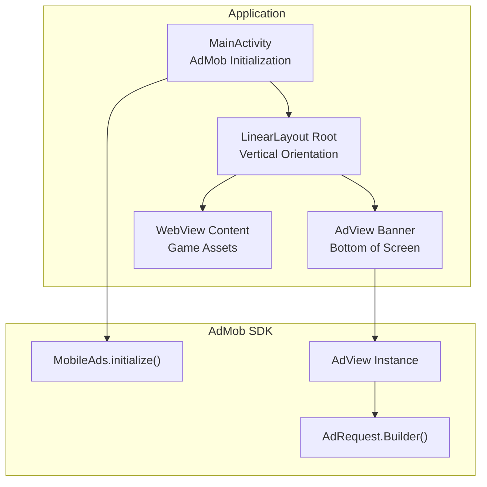
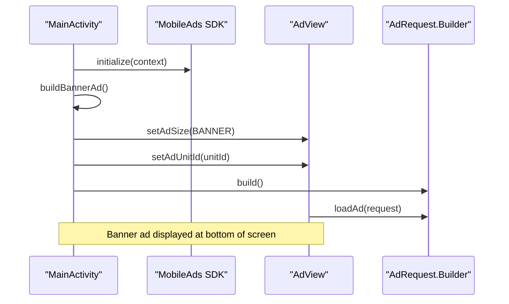
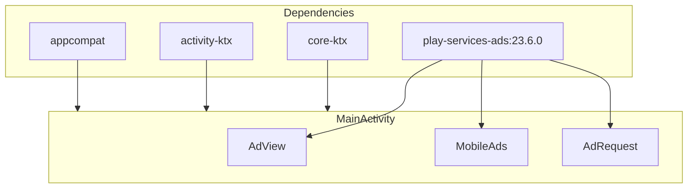

# Banner Ad Placement

<cite>
**Referenced Files in This Document**
- [MainActivity.kt](file://app/src/main/java/com/cktechhub/games/MainActivity.kt)
- [AndroidManifest.xml](file://app/src/main/AndroidManifest.xml)
- [ADMOB_SETUP.md](file://ADMOB_SETUP.md)
- [build.gradle.kts](file://app/build.gradle.kts)
- [libs.versions.toml](file://gradle/libs.versions.toml)
- [themes.xml](file://app/src/main/res/values/themes.xml)
- [colors.xml](file://app/src/main/res/values/colors.xml)
</cite>

## Table of Contents
1. [Introduction](#introduction)
2. [Project Structure](#project-structure)
3. [Core Components](#core-components)
4. [Architecture Overview](#architecture-overview)
5. [Detailed Component Analysis](#detailed-component-analysis)
6. [Dependency Analysis](#dependency-analysis)
7. [Performance Considerations](#performance-considerations)
8. [Troubleshooting Guide](#troubleshooting-guide)
9. [Conclusion](#conclusion)

## Introduction
This document provides comprehensive guidance for implementing banner ad placement in an Android application using Google AdMob. It focuses on the AdView configuration, banner ad size selection, positioning within the LinearLayout layout structure, and the buildBannerAd() method implementation. It also covers ad loading mechanisms, ad request building, error handling strategies, customization options, responsive design considerations, lifecycle management, and testing procedures.

## Project Structure
The banner ad implementation resides within the main activity of the application. The layout is constructed programmatically using a vertical LinearLayout that positions the WebView content above the banner ad. The AdMob SDK is initialized in the activity lifecycle, and banner ads are integrated directly into the UI hierarchy.

**Diagram sources**
- [MainActivity.kt:66-135](file://app/src/main/java/com/cktechhub/games/MainActivity.kt#L66-L135)
- [MainActivity.kt:265-278](file://app/src/main/java/com/cktechhub/games/MainActivity.kt#L265-L278)

**Section sources**
- [MainActivity.kt:66-135](file://app/src/main/java/com/cktechhub/games/MainActivity.kt#L66-L135)
- [AndroidManifest.xml:9-48](file://app/src/main/AndroidManifest.xml#L9-L48)

## Core Components
- AdMob SDK Initialization: The MobileAds SDK is initialized in the activity lifecycle to prepare for ad loading.
- AdView Configuration: The AdView instance is configured with an ad unit ID and ad size, positioned within the layout.
- Layout Construction: A vertical LinearLayout holds the WebView content and the banner ad, with the ad positioned at the bottom.
- Lifecycle Management: The activity manages ad lifecycle by pausing, resuming, and destroying the AdView during activity lifecycle events.

Key implementation references:
- AdMob initialization and lifecycle: [MainActivity.kt:80-81](file://app/src/main/java/com/cktechhub/games/MainActivity.kt#L80-L81), [MainActivity.kt:137-154](file://app/src/main/java/com/cktechhub/games/MainActivity.kt#L137-L154)
- AdView creation and configuration: [MainActivity.kt:265-278](file://app/src/main/java/com/cktechhub/games/MainActivity.kt#L265-L278)
- Layout construction with AdView: [MainActivity.kt:95-128](file://app/src/main/java/com/cktechhub/games/MainActivity.kt#L95-L128)

**Section sources**
- [MainActivity.kt:80-81](file://app/src/main/java/com/cktechhub/games/MainActivity.kt#L80-L81)
- [MainActivity.kt:137-154](file://app/src/main/java/com/cktechhub/games/MainActivity.kt#L137-L154)
- [MainActivity.kt:265-278](file://app/src/main/java/com/cktechhub/games/MainActivity.kt#L265-L278)
- [MainActivity.kt:95-128](file://app/src/main/java/com/cktechhub/games/MainActivity.kt#L95-L128)

## Architecture Overview
The banner ad architecture integrates AdMob SDK components into the activity lifecycle and UI layout. The AdView is created programmatically, configured with an ad unit ID and size, and positioned within a vertical LinearLayout. The activity handles ad lifecycle events to ensure proper behavior during foreground/background transitions.

**Diagram sources**
- [MainActivity.kt:80-81](file://app/src/main/java/com/cktechhub/games/MainActivity.kt#L80-L81)
- [MainActivity.kt:265-278](file://app/src/main/java/com/cktechhub/games/MainActivity.kt#L265-L278)

## Detailed Component Analysis

### AdView Configuration and Positioning
The AdView is configured within the buildBannerAd() method to use a standard banner size and centered horizontally at the bottom of the screen. The layout parameters ensure the ad occupies the appropriate space within the vertical LinearLayout.

Key configuration points:
- Ad unit ID assignment: [MainActivity.kt:267](file://app/src/main/java/com/cktechhub/games/MainActivity.kt#L267)
- Ad size selection: [MainActivity.kt:268](file://app/src/main/java/com/cktechhub/games/MainActivity.kt#L268)
- Layout parameters and gravity: [MainActivity.kt:270-275](file://app/src/main/java/com/cktechhub/games/MainActivity.kt#L270-L275)
- Initial ad load: [MainActivity.kt:276](file://app/src/main/java/com/cktechhub/games/MainActivity.kt#L276)

Positioning within LinearLayout:
- Root layout is vertical: [MainActivity.kt:96-103](file://app/src/main/java/com/cktechhub/games/MainActivity.kt#L96-L103)
- WebView container fills remaining space: [MainActivity.kt:115-121](file://app/src/main/java/com/cktechhub/games/MainActivity.kt#L115-L121)
- AdView added as last child: [MainActivity.kt:125-126](file://app/src/main/java/com/cktechhub/games/MainActivity.kt#L125-L126)

**Section sources**
- [MainActivity.kt:265-278](file://app/src/main/java/com/cktechhub/games/MainActivity.kt#L265-L278)
- [MainActivity.kt:95-128](file://app/src/main/java/com/cktechhub/games/MainActivity.kt#L95-L128)

### Banner Ad Size Selection
The current implementation uses the BANNER size constant. The AdMob SDK supports multiple predefined sizes, including BANNER, MEDIUM_RECTANGLE, and FULL_BANNER. These sizes can be selected based on the device form factor and layout requirements.

Supported sizes and selection criteria:
- BANNER: Standard mobile banner size suitable for most layouts
- MEDIUM_RECTANGLE: Medium rectangle size for tablet layouts
- FULL_BANNER: Full-width banner size for landscape or tablet orientations

Size selection considerations:
- Device orientation and screen density
- Available space in the layout
- Target audience device characteristics
- App theme and visual consistency

**Section sources**
- [MainActivity.kt:268](file://app/src/main/java/com/cktechhub/games/MainActivity.kt#L268)

### Ad Request Building and Loading Mechanisms
The buildBannerAd() method constructs an AdRequest using AdRequest.Builder and loads the ad immediately. While immediate loading is functional, implementing asynchronous loading with callbacks enables better error handling and user experience.

Current implementation highlights:
- Request builder usage: [MainActivity.kt:276](file://app/src/main/java/com/cktechhub/games/MainActivity.kt#L276)
- Immediate load operation: [MainActivity.kt:276](file://app/src/main/java/com/cktechhub/games/MainActivity.kt#L276)

Enhanced loading with callbacks would involve:
- Using AdView.loadAd() with callback support
- Implementing error handling for ad load failures
- Providing fallback UI when ads fail to load

**Section sources**
- [MainActivity.kt:276](file://app/src/main/java/com/cktechhub/games/MainActivity.kt#L276)

### Error Handling Strategies
The current implementation does not include explicit error handling for ad loading failures. Implementing comprehensive error handling improves user experience and provides actionable feedback when ads cannot be displayed.

Recommended error handling approaches:
- Implement AdView load failure callbacks
- Provide fallback content or empty state indicators
- Log detailed error information for debugging
- Offer retry mechanisms for transient failures

**Section sources**
- [MainActivity.kt:265-278](file://app/src/main/java/com/cktechhub/games/MainActivity.kt#L265-L278)

### Banner Ad Customization and Theme Matching
The application uses a dark theme with black backgrounds. Banner ad customization should align with the app's visual identity while maintaining readability and user experience.

Customization options:
- Background color matching app theme: [MainActivity.kt:102](file://app/src/main/java/com/cktechhub/games/MainActivity.kt#L102), [themes.xml:8](file://app/src/main/res/values/themes.xml#L8)
- Text and accent color coordination: [colors.xml:1-10](file://app/src/main/res/values/colors.xml#L1-L10)
- Loading indicator tint matching app palette: [MainActivity.kt:288](file://app/src/main/java/com/cktechhub/games/MainActivity.kt#L288)

Responsive design considerations:
- Ad size adaptation for different screen densities
- Layout adjustments for portrait and landscape orientations
- Padding and margins for various device sizes
- Dynamic resizing based on available space

**Section sources**
- [MainActivity.kt:102](file://app/src/main/java/com/cktechhub/games/MainActivity.kt#L102)
- [themes.xml:8](file://app/src/main/res/values/themes.xml#L8)
- [colors.xml:1-10](file://app/src/main/res/values/colors.xml#L1-L10)
- [MainActivity.kt:288](file://app/src/main/java/com/cktechhub/games/MainActivity.kt#L288)

### Banner Ad Lifecycle Management
The activity implements proper lifecycle management for the AdView, ensuring optimal performance and resource usage during foreground/background transitions.

Lifecycle operations:
- Resume operation: [MainActivity.kt:139](file://app/src/main/java/com/cktechhub/games/MainActivity.kt#L139)
- Pause operation: [MainActivity.kt:145](file://app/src/main/java/com/cktechhub/games/MainActivity.kt#L145)
- Destroy operation: [MainActivity.kt:151](file://app/src/main/java/com/cktechhub/games/MainActivity.kt#L151)

Best practices:
- Always pause ads when the activity is paused
- Resume ads when the activity resumes
- Destroy ads in onDestroy() to free resources
- Handle configuration changes appropriately

**Section sources**
- [MainActivity.kt:137-154](file://app/src/main/java/com/cktechhub/games/MainActivity.kt#L137-L154)

### Testing Procedures and Debugging
The project includes test AdMob IDs for development and testing. Proper testing ensures ads function correctly across different scenarios and devices.

Testing setup:
- Test ad unit IDs for banners and interstitials: [MainActivity.kt:54-56](file://app/src/main/java/com/cktechhub/games/MainActivity.kt#L54-L56)
- AdMob setup guide with test IDs: [ADMOB_SETUP.md:42-62](file://ADMOB_SETUP.md#L42-L62)

Debugging techniques:
- Enable AdMob debug logging
- Use test ad unit IDs for reliable testing
- Monitor ad load success/failure logs
- Verify network connectivity and permissions
- Test on physical devices rather than emulators

**Section sources**
- [MainActivity.kt:54-56](file://app/src/main/java/com/cktechhub/games/MainActivity.kt#L54-L56)
- [ADMOB_SETUP.md:42-62](file://ADMOB_SETUP.md#L42-L62)

## Dependency Analysis
The banner ad implementation relies on the Google Play Services Ads library and integrates with the Android activity lifecycle.

**Diagram sources**
- [build.gradle.kts:34-43](file://app/build.gradle.kts#L34-L43)
- [libs.versions.toml:13-21](file://gradle/libs.versions.toml#L13-L21)

Dependency relationships:
- AdMob SDK dependency: [build.gradle.kts:39](file://app/build.gradle.kts#L39)
- Version specification: [libs.versions.toml:10](file://gradle/libs.versions.toml#L10)
- Activity lifecycle integration: [MainActivity.kt:137-154](file://app/src/main/java/com/cktechhub/games/MainActivity.kt#L137-L154)

**Section sources**
- [build.gradle.kts:34-43](file://app/build.gradle.kts#L34-L43)
- [libs.versions.toml:13-21](file://gradle/libs.versions.toml#L13-L21)
- [MainActivity.kt:137-154](file://app/src/main/java/com/cktechhub/games/MainActivity.kt#L137-L154)

## Performance Considerations
Banner ad performance depends on several factors including initialization timing, lifecycle management, and resource usage. Proper implementation ensures smooth app performance while delivering advertisements effectively.

Performance optimization strategies:
- Initialize AdMob SDK early in the activity lifecycle
- Use appropriate ad sizes for different screen densities
- Implement efficient lifecycle management to minimize resource usage
- Avoid blocking UI thread during ad loading operations
- Monitor ad load success rates and adjust loading strategies accordingly

## Troubleshooting Guide
Common issues and solutions for banner ad implementation:

Connection and initialization issues:
- Verify internet permissions in AndroidManifest.xml: [AndroidManifest.xml:5-7](file://app/src/main/AndroidManifest.xml#L5-L7)
- Ensure MobileAds.initialize() is called before loading ads: [MainActivity.kt:80-81](file://app/src/main/java/com/cktechhub/games/MainActivity.kt#L80-L81)
- Check AdMob App ID configuration: [AndroidManifest.xml:20-23](file://app/src/main/AndroidManifest.xml#L20-L23)

Ad loading and display issues:
- Confirm ad unit ID correctness: [MainActivity.kt:54-56](file://app/src/main/java/com/cktechhub/games/MainActivity.kt#L54-L56)
- Verify ad size compatibility with layout: [MainActivity.kt:268](file://app/src/main/java/com/cktechhub/games/MainActivity.kt#L268)
- Check layout positioning within LinearLayout: [MainActivity.kt:125-126](file://app/src/main/java/com/cktechhub/games/MainActivity.kt#L125-L126)

Lifecycle and resource management:
- Ensure proper pause/resume/destroy calls: [MainActivity.kt:137-154](file://app/src/main/java/com/cktechhub/games/MainActivity.kt#L137-L154)
- Handle configuration changes appropriately
- Monitor memory usage during ad operations

Testing and debugging:
- Use test ad unit IDs for reliable testing: [ADMOB_SETUP.md:42-62](file://ADMOB_SETUP.md#L42-L62)
- Enable AdMob debug logging for detailed diagnostics
- Test on physical devices for accurate ad rendering

**Section sources**
- [AndroidManifest.xml:5-7](file://app/src/main/AndroidManifest.xml#L5-L7)
- [AndroidManifest.xml:20-23](file://app/src/main/AndroidManifest.xml#L20-L23)
- [MainActivity.kt:80-81](file://app/src/main/java/com/cktechhub/games/MainActivity.kt#L80-L81)
- [MainActivity.kt:54-56](file://app/src/main/java/com/cktechhub/games/MainActivity.kt#L54-L56)
- [MainActivity.kt:268](file://app/src/main/java/com/cktechhub/games/MainActivity.kt#L268)
- [MainActivity.kt:125-126](file://app/src/main/java/com/cktechhub/games/MainActivity.kt#L125-L126)
- [MainActivity.kt:137-154](file://app/src/main/java/com/cktechhub/games/MainActivity.kt#L137-L154)
- [ADMOB_SETUP.md:42-62](file://ADMOB_SETUP.md#L42-L62)

## Conclusion
The banner ad implementation in this project demonstrates a solid foundation for integrating Google AdMob into an Android application. The current setup includes proper SDK initialization, AdView configuration, and lifecycle management. To enhance the implementation, consider adding comprehensive error handling, implementing asynchronous ad loading with callbacks, and expanding customization options to better match the app's visual identity. Following the testing and debugging procedures outlined in this document will help ensure reliable ad delivery and optimal user experience.