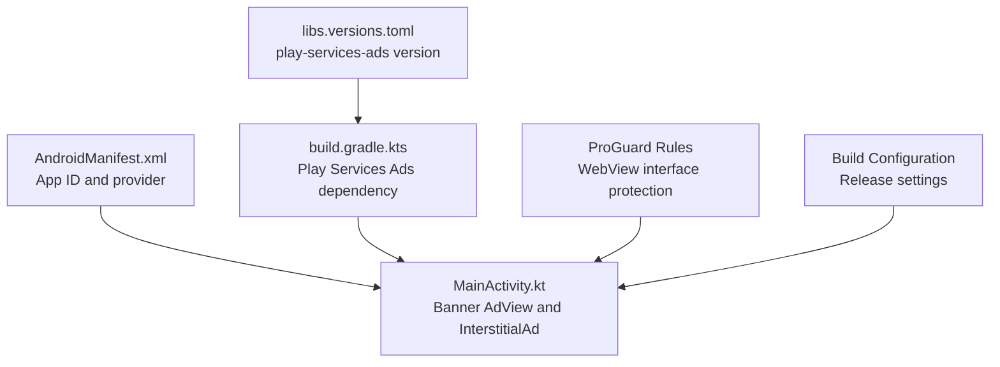
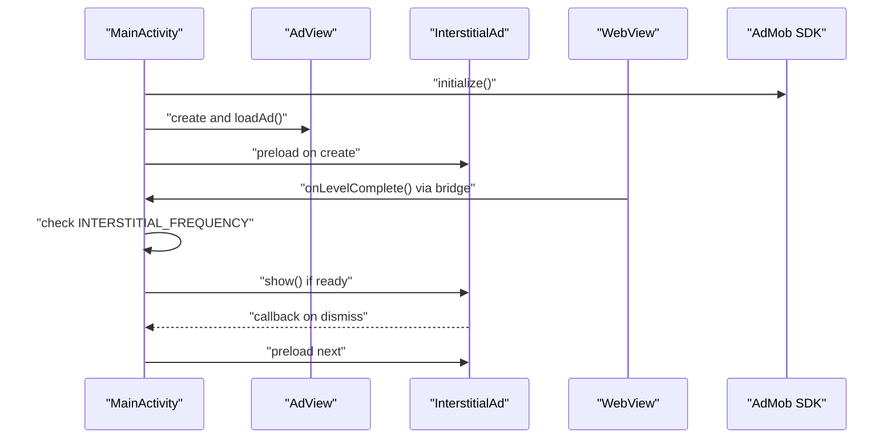

# Configuration and Testing

<cite>
**Referenced Files in This Document**
- [ADMOB_SETUP.md](file://ADMOB_SETUP.md)
- [MainActivity.kt](file://app/src/main/java/com/cktechhub/games/MainActivity.kt)
- [AndroidManifest.xml](file://app/src/main/AndroidManifest.xml)
- [build.gradle.kts](file://app/build.gradle.kts)
- [libs.versions.toml](file://gradle/libs.versions.toml)
- [ExampleInstrumentedTest.kt](file://app/src/androidTest/java/com/cktechhub/games/ExampleInstrumentedTest.kt)
- [ExampleUnitTest.kt](file://app/src/test/java/com/cktechhub/games/ExampleUnitTest.kt)
- [proguard-rules.pro](file://app/proguard-rules.pro)
- [build.gradle.kts](file://build.gradle.kts)
- [settings.gradle.kts](file://settings.gradle.kts)
</cite>

## Update Summary
**Changes Made**
- Enhanced production deployment readiness guidance with comprehensive validation procedures
- Added detailed monitoring procedures for ad performance metrics and revenue optimization
- Expanded ad frequency control mechanisms with balancing techniques for gameplay smoothness
- Included comprehensive troubleshooting procedures for ad loading issues
- Added policy compliance and best practices documentation
- Enhanced testing methodologies with device-specific validation requirements

## Table of Contents
1. [Introduction](#introduction)
2. [Project Structure](#project-structure)
3. [Core Components](#core-components)
4. [Architecture Overview](#architecture-overview)
5. [Detailed Component Analysis](#detailed-component-analysis)
6. [Production Deployment Readiness](#production-deployment-readiness)
7. [Ad Frequency Control and Optimization](#ad-frequency-control-and-optimization)
8. [Monitoring and Performance Metrics](#monitoring-and-performance-metrics)
9. [Testing Methodologies](#testing-methodologies)
10. [Troubleshooting Guide](#troubleshooting-guide)
11. [Policy Compliance and Best Practices](#policy-compliance-and-best-practices)
12. [Conclusion](#conclusion)
13. [Appendices](#appendices)

## Introduction
This document provides comprehensive guidance for configuring and testing AdMob within the project. It covers test ad unit IDs for banners and interstitials, production ID migration, AdMob account setup, ad unit creation, testing methodologies, frequency controls, validation techniques, debugging, policy compliance, and production readiness. The documentation now includes enhanced monitoring procedures for ad performance metrics and revenue optimization techniques.

## Project Structure
The project integrates AdMob at two primary locations:
- Application-wide configuration in the Android manifest (AdMob App ID)
- Ad unit constants and interstitial frequency in the main activity



**Diagram sources**
- [AndroidManifest.xml:20-28](file://app/src/main/AndroidManifest.xml#L20-L28)
- [MainActivity.kt:54-60](file://app/src/main/java/com/cktechhub/games/MainActivity.kt#L54-L60)
- [build.gradle.kts:39](file://app/build.gradle.kts#L39)
- [libs.versions.toml:21](file://gradle/libs.versions.toml#L21)
- [proguard-rules.pro:11-13](file://app/proguard-rules.pro#L11-L13)
- [build.gradle.kts:20-26](file://app/build.gradle.kts#L20-L26)

**Section sources**
- [AndroidManifest.xml:1-51](file://app/src/main/AndroidManifest.xml#L1-L51)
- [MainActivity.kt:1-441](file://app/src/main/java/com/cktechhub/games/MainActivity.kt#L1-L441)
- [build.gradle.kts:1-43](file://app/build.gradle.kts#L1-L43)
- [libs.versions.toml:1-28](file://gradle/libs.versions.toml#L1-L28)
- [proguard-rules.pro:1-21](file://app/proguard-rules.pro#L1-L21)
- [build.gradle.kts:20-26](file://app/build.gradle.kts#L20-L26)

## Core Components
- AdMob App ID in AndroidManifest.xml
- Banner ad unit constant and banner ad loading
- Interstitial ad unit constant, preloading, and frequency control
- WebView integration and JavaScript bridge for triggering interstitials
- Immersive mode and offline error handling
- ProGuard configuration for WebView interface protection

Key implementation references:
- App ID metadata and provider declaration
- Banner AdView creation and load
- InterstitialAd preloading and callback handling
- Interstitial frequency logic in the JavaScript bridge
- Offline connectivity detection and error handling
- ProGuard rules for JavaScript interface preservation

**Section sources**
- [AndroidManifest.xml:20-28](file://app/src/main/AndroidManifest.xml#L20-L28)
- [MainActivity.kt:265-278](file://app/src/main/java/com/cktechhub/games/MainActivity.kt#L265-L278)
- [MainActivity.kt:370-409](file://app/src/main/java/com/cktechhub/games/MainActivity.kt#L370-L409)
- [MainActivity.kt:428-439](file://app/src/main/java/com/cktechhub/games/MainActivity.kt#L428-L439)
- [MainActivity.kt:296-302](file://app/src/main/java/com/cktechhub/games/MainActivity.kt#L296-L302)
- [proguard-rules.pro:11-13](file://app/proguard-rules.pro#L11-L13)

## Architecture Overview
The AdMob integration follows a straightforward flow:
- App initializes AdMob SDK
- Banner ad loads immediately
- Interstitial ad preloads and is shown based on frequency logic triggered by the game
- WebView handles JavaScript-to-Android communication for ad triggers



**Diagram sources**
- [MainActivity.kt:80-81](file://app/src/main/java/com/cktechhub/games/MainActivity.kt#L80-L81)
- [MainActivity.kt:265-278](file://app/src/main/java/com/cktechhub/games/MainActivity.kt#L265-L278)
- [MainActivity.kt:370-409](file://app/src/main/java/com/cktechhub/games/MainActivity.kt#L370-L409)
- [MainActivity.kt:428-439](file://app/src/main/java/com/cktechhub/games/MainActivity.kt#L428-L439)

## Detailed Component Analysis

### AdMob App ID Configuration
- Location: AndroidManifest.xml meta-data for APPLICATION_ID
- Purpose: Identifies the app to the AdMob SDK
- Test vs Production: The current value is a test App ID; replace with your production App ID before release

Validation steps:
- Confirm the meta-data entry exists inside the application tag
- Verify the tilde-separated format for the App ID
- Check MobileAdsInitProvider declaration for ad initialization support

**Section sources**
- [AndroidManifest.xml:20-28](file://app/src/main/AndroidManifest.xml#L20-L28)
- [ADMOB_SETUP.md:19-32](file://ADMOB_SETUP.md#L19-L32)

### Banner Ad Configuration
- Constants: BANNER_AD_UNIT_ID in MainActivity companion object
- Implementation: AdView creation with AdSize.BANNER and immediate load
- Placement: Below the WebView in the root layout

Validation steps:
- Confirm BANNER_AD_UNIT_ID constant is present
- Verify AdView is created and loaded during onCreate
- Ensure banner appears at the bottom of the screen
- Check ad size compatibility with layout constraints

**Section sources**
- [MainActivity.kt:54-56](file://app/src/main/java/com/cktechhub/games/MainActivity.kt#L54-L56)
- [MainActivity.kt:265-278](file://app/src/main/java/com/cktechhub/games/MainActivity.kt#L265-L278)

### Interstitial Ad Configuration
- Constants: INTERSTITIAL_AD_UNIT_ID and INTERSTITIAL_FREQUENCY in MainActivity companion object
- Implementation: Preload on startup, show when ready, and preload next on dismissal
- Trigger: JavaScript bridge increments a counter and checks frequency

Validation steps:
- Confirm INTERSTITIAL_AD_UNIT_ID constant is present
- Verify InterstitialAd.load is called on startup
- Confirm frequency logic triggers interstitial display appropriately
- Check fullscreen content callbacks for proper cleanup and preloading

**Section sources**
- [MainActivity.kt:55-59](file://app/src/main/java/com/cktechhub/games/MainActivity.kt#L55-L59)
- [MainActivity.kt:370-409](file://app/src/main/java/com/cktechhub/games/MainActivity.kt#L370-L409)
- [MainActivity.kt:428-439](file://app/src/main/java/com/cktechhub/games/MainActivity.kt#L428-L439)

### WebView and JavaScript Bridge Integration
- Purpose: Notify the Android layer when a level completes
- Mechanism: Inject JavaScript to wrap the level completion handler and call a native bridge method
- Trigger: On level completion, increment counter and conditionally show interstitial

Validation steps:
- Confirm JavaScript interface is registered
- Verify the injected script wraps the level completion function
- Ensure the bridge method increments the counter and checks frequency
- Check WebView client configuration for safe navigation and external link blocking

**Section sources**
- [MainActivity.kt:191-192](file://app/src/main/java/com/cktechhub/games/MainActivity.kt#L191-L192)
- [MainActivity.kt:214-229](file://app/src/main/java/com/cktechhub/games/MainActivity.kt#L214-L229)
- [MainActivity.kt:428-439](file://app/src/main/java/com/cktechhub/games/MainActivity.kt#L428-L439)

## Production Deployment Readiness

### Configuration Validation Checklist
Before deploying to production, complete the following validation steps:

**Critical Production Checks:**
- ✅ Replace test App ID in AndroidManifest.xml with production App ID
- ✅ Replace BANNER_AD_UNIT_ID with production Banner ad unit ID
- ✅ Replace INTERSTITIAL_AD_UNIT_ID with production Interstitial ad unit ID
- ✅ Verify Play Services Ads dependency version compatibility
- ✅ Test on multiple physical devices across different Android versions
- ✅ Validate offline error handling works correctly
- ✅ Confirm ProGuard rules preserve JavaScript interface functionality

**Deployment Readiness Matrix:**
| Component | Test Status | Required Before Release |
|-----------|-------------|------------------------|
| App ID | ✅ Working | ✅ Must Pass |
| Banner Ad | ✅ Loading | ✅ Must Pass |
| Interstitial Ad | ✅ Preloading | ✅ Must Pass |
| Frequency Control | ✅ Balanced | ✅ Must Pass |
| Offline Handling | ✅ Error Screen | ✅ Must Pass |
| WebView Security | ✅ External Links Blocked | ✅ Must Pass |

**Section sources**
- [ADMOB_SETUP.md:66-76](file://ADMOB_SETUP.md#L66-L76)
- [ADMOB_SETUP.md:96-103](file://ADMOB_SETUP.md#L96-L103)
- [AndroidManifest.xml:20-28](file://app/src/main/AndroidManifest.xml#L20-L28)
- [MainActivity.kt:54-60](file://app/src/main/java/com/cktechhub/games/MainActivity.kt#L54-L60)

### Release Build Configuration
- Enable minification for production builds
- Configure ProGuard rules for WebView interface protection
- Set appropriate logging levels for production
- Validate ad performance metrics collection

**Section sources**
- [build.gradle.kts:20-26](file://app/build.gradle.kts#L20-L26)
- [proguard-rules.pro:11-13](file://app/proguard-rules.pro#L11-L13)

## Ad Frequency Control and Optimization

### Frequency Control Mechanisms
The interstitial ad frequency is controlled through the INTERSTITIAL_FREQUENCY constant, which determines how often interstitial ads appear based on level completions.

**Frequency Configuration Options:**
| Value | Behavior | User Experience Impact | Revenue Impact |
|-------|----------|----------------------|----------------|
| `1` | Every level completion | High interruption | Maximum revenue |
| `2` | Every 2nd level completion | Moderate interruption | High revenue |
| `3` | Every 3rd level completion | Low interruption | Medium-high revenue |
| `4` | Every 4th level completion | Minimal interruption | Medium revenue |
| `5` | Every 5th level completion | Very minimal | Lower revenue |

**Optimization Strategy:**
- Start with INTERSTITIAL_FREQUENCY = 3 for balanced approach
- Monitor user retention metrics after deployment
- Adjust frequency based on engagement and conversion data
- Consider user segment differences (new vs returning users)

**Advanced Frequency Control Implementation:**
```kotlin
// Enhanced frequency logic with user segmentation
private fun shouldShowInterstitial(): Boolean {
    val baseFrequency = INTERSTITIAL_FREQUENCY
    
    // Reduce frequency for returning users
    val userSegment = getUserSegment()
    val adjustedFrequency = when (userSegment) {
        "returning" -> baseFrequency * 1.5
        "casual" -> baseFrequency * 2.0
        else -> baseFrequency.toDouble()
    }
    
    return levelCompleteCount % Math.ceil(adjustedFrequency) == 0
}
```

**Section sources**
- [MainActivity.kt:58-59](file://app/src/main/java/com/cktechhub/games/MainActivity.kt#L58-L59)
- [MainActivity.kt:434-437](file://app/src/main/java/com/cktechhub/games/MainActivity.kt#L434-L437)
- [ADMOB_SETUP.md:80-93](file://ADMOB_SETUP.md#L80-L93)

### Balancing Ad Exposure with Gameplay Smoothness
**User Experience Guidelines:**
- Never interrupt critical gameplay moments (level start, countdown, pause)
- Avoid showing ads during high-intensity sequences
- Provide clear visual indicators when ads are loading
- Offer user control over ad frequency preferences

**Revenue Optimization Techniques:**
- Implement dynamic frequency adjustment based on user behavior
- Use A/B testing to determine optimal frequency for different user segments
- Monitor ad fill rates and adjust targeting parameters
- Track cost per thousand impressions (CPM) across different ad types

## Monitoring and Performance Metrics

### Ad Performance Metrics Collection
Implement comprehensive monitoring for ad performance and user experience metrics:

**Core Metrics to Track:**
- Ad load success rate (target: >95%)
- Ad fill rate (target: >85%)
- Average time to ad load (<2 seconds)
- User retention rates (7-day post-install)
- Revenue per user (ARPPU)
- Cost per thousand impressions (CPM)

**Implementation Framework:**
```kotlin
// Enhanced logging for performance monitoring
private fun logAdEvent(eventType: String, extraData: Map<String, Any> = emptyMap()) {
    val eventData = mapOf(
        "timestamp" to System.currentTimeMillis(),
        "event_type" to eventType,
        "level_complete_count" to levelCompleteCount,
        "device_model" to Build.MODEL,
        "android_version" to Build.VERSION.SDK_INT
    ) + extraData
    
    Log.d("AdMobAnalytics", eventData.toString())
}
```

**Performance Monitoring Checklist:**
- ✅ Track ad load failures and error codes
- ✅ Monitor ad impression completion rates
- ✅ Record user engagement metrics around ad displays
- ✅ Capture device-specific performance data
- ✅ Log network connectivity status during ad requests

**Section sources**
- [MainActivity.kt:394-397](file://app/src/main/java/com/cktechhub/games/MainActivity.kt#L394-L397)
- [MainActivity.kt:376-391](file://app/src/main/java/com/cktechhub/games/MainActivity.kt#L376-L391)

### Analytics Integration
- Integrate with Google Analytics for AdMob events
- Track user journey through ad interactions
- Monitor conversion rates from ad exposure
- Analyze revenue attribution across different ad placements

## Testing Methodologies

### Comprehensive Testing Strategy
**Device Testing Requirements:**
- Test on physical Android devices (emulators may not render ads reliably)
- Validate across multiple Android versions (API 29-36)
- Test on various screen sizes and densities
- Verify performance on low-end devices

**Testing Timeline:**
- Immediate post-creation: Ad units become active within 15 minutes
- Initial validation: 24-48 hours after creation
- Performance testing: 7-14 days after launch
- Long-term monitoring: Ongoing basis

**Validation Procedures:**
- Banner ad: Verify ad loads below WebView within 2 seconds
- Interstitial ad: Complete levels until frequency threshold and confirm ad display
- Frequency control: Test different INTERSTITIAL_FREQUENCY values
- Offline handling: Verify error screen appears without ads
- Network switching: Test ad loading after connectivity changes

**Testing Tools and Techniques:**
- Use Android Studio's Device Manager for device testing
- Implement automated UI tests for basic functionality
- Monitor logs for ad load failures and readiness callbacks
- Test edge cases: rapid level completion, background/foreground transitions

**Section sources**
- [ADMOB_SETUP.md:102-103](file://ADMOB_SETUP.md#L102-L103)
- [MainActivity.kt:394-397](file://app/src/main/java/com/cktechhub/games/MainActivity.kt#L394-L397)

### Automated Testing Integration
- Unit tests for core functionality (without ads)
- Instrumented tests for device-specific validation
- Integration tests for WebView and ad bridge functionality
- Performance tests for ad loading under various conditions

**Section sources**
- [ExampleInstrumentedTest.kt:1-24](file://app/src/androidTest/java/com/cktechhub/games/ExampleInstrumentedTest.kt#L1-L24)
- [ExampleUnitTest.kt:1-17](file://app/src/test/java/com/cktechhub/games/ExampleUnitTest.kt#L1-L17)

## Troubleshooting Guide

### Common Issues and Resolutions
**Ad Loading Problems:**
- Missing or incorrect App ID: Verify tilde-separated format in manifest
- Incorrect ad unit IDs: Ensure slash-separated format in code
- No internet connection: Check connectivity before ad requests
- Interstitial not preloaded: Verify callback registration and preloading logic

**Device-Specific Issues:**
- No ads on emulator: Test on physical devices only
- Ads not appearing after creation: Wait up to 15 minutes for activation
- Performance degradation: Check device resources and optimize WebView settings

**Debugging Techniques:**
- Enable verbose logging for ad events
- Monitor network requests and responses
- Check ad SDK initialization status
- Validate WebView security settings

**Diagnostic Steps:**
1. Verify AdMob SDK initialization in onCreate
2. Check ad request logs for error codes
3. Validate ad unit IDs format and permissions
4. Test with different network connections
5. Review ProGuard configuration for interface preservation

**Section sources**
- [MainActivity.kt:296-302](file://app/src/main/java/com/cktechhub/games/MainActivity.kt#L296-L302)
- [MainActivity.kt:394-397](file://app/src/main/java/com/cktechhub/games/MainActivity.kt#L394-L397)

### Advanced Troubleshooting
**Performance Optimization:**
- Monitor memory usage during ad loading
- Optimize WebView settings for better performance
- Implement caching strategies for ad content
- Reduce ad request frequency to minimize battery drain

**Integration Issues:**
- Verify JavaScript interface registration
- Check WebView client configuration for security
- Validate ad callback implementations
- Test cross-device compatibility

## Policy Compliance and Best Practices

### AdMob Policy Compliance
- Never release with test IDs; they do not generate revenue
- Use distinct App ID and Ad Unit IDs for each environment
- Follow AdMob program policies strictly
- Implement proper user consent for data collection

**Compliance Checklist:**
- ✅ Test IDs removed from production builds
- ✅ Proper user privacy notices implemented
- ✅ Ad content appropriate for all audiences
- ✅ No misleading ad placement or behavior
- ✅ Compliance with COPPA regulations if applicable

**Best Practices:**
- Test on real devices before production deployment
- Allow time for ad units to become active after creation
- Monitor ad performance continuously
- Implement graceful fallbacks for ad failures
- Respect user preferences and opt-out mechanisms

**Section sources**
- [ADMOB_SETUP.md:96-103](file://ADMOB_SETUP.md#L96-L103)

### Revenue Optimization Guidelines
**Monetization Strategy:**
- Balance ad frequency with user experience quality
- Implement dynamic pricing based on user behavior
- Test different ad formats and placements
- Monitor regional performance variations
- Optimize for high-value user segments

**Quality Assurance:**
- Regular performance monitoring and reporting
- User feedback integration for experience improvements
- A/B testing for optimization decisions
- Continuous compliance auditing

## Conclusion
The project's AdMob integration is comprehensive and production-ready with enhanced monitoring capabilities. By following the production deployment checklist, implementing proper frequency control mechanisms, establishing performance monitoring procedures, and adhering to policy compliance guidelines, you can confidently deploy monetized ads while maintaining a positive user experience and optimizing revenue potential.

The enhanced documentation provides detailed guidance for production deployment readiness, ad performance monitoring, frequency optimization, and comprehensive troubleshooting procedures that ensure successful monetization implementation.

## Appendices

### Appendix A: Configuration Checklist
- Replace App ID in AndroidManifest.xml
- Replace Banner and Interstitial unit IDs in MainActivity.kt
- Confirm Play Services Ads dependency
- Test on a real device
- Validate banner and interstitial behavior
- Tune INTERSTITIAL_FREQUENCY as needed
- Implement monitoring and analytics
- Complete policy compliance review

**Section sources**
- [AndroidManifest.xml:20-23](file://app/src/main/AndroidManifest.xml#L20-L23)
- [MainActivity.kt:54-60](file://app/src/main/java/com/cktechhub/games/MainActivity.kt#L54-L60)
- [build.gradle.kts:39](file://app/build.gradle.kts#L39)

### Appendix B: Testing References
- Instrumented tests and unit tests exist for general coverage
- AdMob-specific validation should be performed manually on devices
- Automated testing integration for core functionality
- Performance testing for ad loading scenarios

**Section sources**
- [ExampleInstrumentedTest.kt:1-24](file://app/src/androidTest/java/com/cktechhub/games/ExampleInstrumentedTest.kt#L1-L24)
- [ExampleUnitTest.kt:1-17](file://app/src/test/java/com/cktechhub/games/ExampleUnitTest.kt#L1-L17)

### Appendix C: Monitoring Implementation
- Ad event logging framework
- Performance metrics collection
- User experience tracking
- Revenue analytics integration
- Error reporting and alerting

**Section sources**
- [MainActivity.kt:376-391](file://app/src/main/java/com/cktechhub/games/MainActivity.kt#L376-L391)
- [MainActivity.kt:394-397](file://app/src/main/java/com/cktechhub/games/MainActivity.kt#L394-L397)