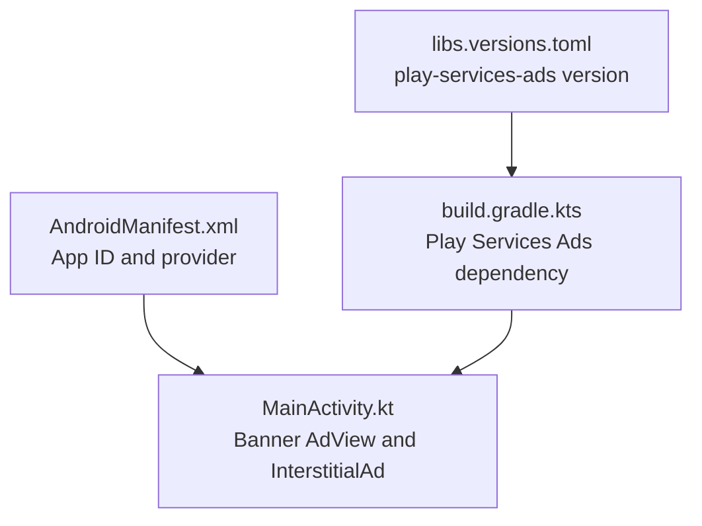
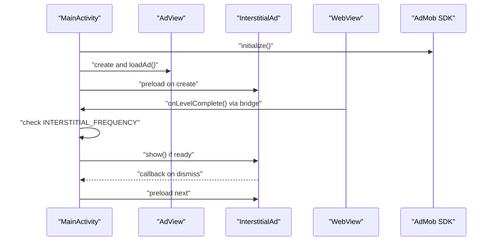
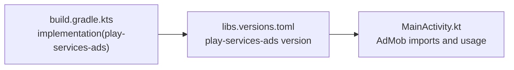

# Configuration and Testing

<cite>
**Referenced Files in This Document**
- [ADMOB_SETUP.md](file://ADMOB_SETUP.md)
- [MainActivity.kt](file://app/src/main/java/com/cktechhub/games/MainActivity.kt)
- [AndroidManifest.xml](file://app/src/main/AndroidManifest.xml)
- [build.gradle.kts](file://app/build.gradle.kts)
- [libs.versions.toml](file://gradle/libs.versions.toml)
- [ExampleInstrumentedTest.kt](file://app/src/androidTest/java/com/cktechhub/games/ExampleInstrumentedTest.kt)
- [ExampleUnitTest.kt](file://app/src/test/java/com/cktechhub/games/ExampleUnitTest.kt)
</cite>

## Table of Contents
1. [Introduction](#introduction)
2. [Project Structure](#project-structure)
3. [Core Components](#core-components)
4. [Architecture Overview](#architecture-overview)
5. [Detailed Component Analysis](#detailed-component-analysis)
6. [Dependency Analysis](#dependency-analysis)
7. [Performance Considerations](#performance-considerations)
8. [Troubleshooting Guide](#troubleshooting-guide)
9. [Conclusion](#conclusion)
10. [Appendices](#appendices)

## Introduction
This document provides comprehensive guidance for configuring and testing AdMob within the project. It covers test ad unit IDs for banners and interstitials, production ID migration, AdMob account setup, ad unit creation, testing methodologies, frequency controls, validation techniques, debugging, policy compliance, and production readiness.

## Project Structure
The project integrates AdMob at two primary locations:
- Application-wide configuration in the Android manifest (AdMob App ID)
- Ad unit constants and interstitial frequency in the main activity

**Diagram sources**
- [AndroidManifest.xml:20-28](file://app/src/main/AndroidManifest.xml#L20-L28)
- [MainActivity.kt:54-60](file://app/src/main/java/com/cktechhub/games/MainActivity.kt#L54-L60)
- [build.gradle.kts:39](file://app/build.gradle.kts#L39)
- [libs.versions.toml:21](file://gradle/libs.versions.toml#L21)

**Section sources**
- [AndroidManifest.xml:1-51](file://app/src/main/AndroidManifest.xml#L1-L51)
- [MainActivity.kt:1-441](file://app/src/main/java/com/cktechhub/games/MainActivity.kt#L1-L441)
- [build.gradle.kts:1-43](file://app/build.gradle.kts#L1-L43)
- [libs.versions.toml:1-28](file://gradle/libs.versions.toml#L1-L28)

## Core Components
- AdMob App ID in AndroidManifest.xml
- Banner ad unit constant and banner ad loading
- Interstitial ad unit constant, preloading, and frequency control
- WebView integration and JavaScript bridge for triggering interstitials

Key implementation references:
- App ID metadata and provider declaration
- Banner AdView creation and load
- InterstitialAd preloading and callback handling
- Interstitial frequency logic in the JavaScript bridge

**Section sources**
- [AndroidManifest.xml:20-28](file://app/src/main/AndroidManifest.xml#L20-L28)
- [MainActivity.kt:265-278](file://app/src/main/java/com/cktechhub/games/MainActivity.kt#L265-L278)
- [MainActivity.kt:370-409](file://app/src/main/java/com/cktechhub/games/MainActivity.kt#L370-L409)
- [MainActivity.kt:428-439](file://app/src/main/java/com/cktechhub/games/MainActivity.kt#L428-L439)

## Architecture Overview
The AdMob integration follows a straightforward flow:
- App initializes AdMob SDK
- Banner ad loads immediately
- Interstitial ad preloads and is shown based on frequency logic triggered by the game

**Diagram sources**
- [MainActivity.kt:80-81](file://app/src/main/java/com/cktechhub/games/MainActivity.kt#L80-L81)
- [MainActivity.kt:265-278](file://app/src/main/java/com/cktechhub/games/MainActivity.kt#L265-L278)
- [MainActivity.kt:370-409](file://app/src/main/java/com/cktechhub/games/MainActivity.kt#L370-L409)
- [MainActivity.kt:428-439](file://app/src/main/java/com/cktechhub/games/MainActivity.kt#L428-L439)

## Detailed Component Analysis

### AdMob App ID Configuration
- Location: AndroidManifest.xml meta-data for APPLICATION_ID
- Purpose: Identifies the app to the AdMob SDK
- Test vs Production: The current value is a test App ID; replace with your production App ID before release

Validation steps:
- Confirm the meta-data entry exists inside the application tag
- Verify the tilde-separated format for the App ID

**Section sources**
- [AndroidManifest.xml:20-23](file://app/src/main/AndroidManifest.xml#L20-L23)
- [ADMOB_SETUP.md:19-32](file://ADMOB_SETUP.md#L19-L32)

### Banner Ad Configuration
- Constants: BANNER_AD_UNIT_ID in MainActivity companion object
- Implementation: AdView creation with AdSize.BANNER and immediate load
- Placement: Below the WebView in the root layout

Validation steps:
- Confirm BANNER_AD_UNIT_ID constant is present
- Verify AdView is created and loaded during onCreate
- Ensure banner appears at the bottom of the screen

**Section sources**
- [MainActivity.kt:54-56](file://app/src/main/java/com/cktechhub/games/MainActivity.kt#L54-L56)
- [MainActivity.kt:265-278](file://app/src/main/java/com/cktechhub/games/MainActivity.kt#L265-L278)

### Interstitial Ad Configuration
- Constants: INTERSTITIAL_AD_UNIT_ID and INTERSTITIAL_FREQUENCY in MainActivity companion object
- Implementation: Preload on startup, show when ready, and preload next on dismissal
- Trigger: JavaScript bridge increments a counter and checks frequency

Validation steps:
- Confirm INTERSTITIAL_AD_UNIT_ID constant is present
- Verify InterstitialAd.load is called on startup
- Confirm frequency logic triggers interstitial display appropriately

**Section sources**
- [MainActivity.kt:55-59](file://app/src/main/java/com/cktechhub/games/MainActivity.kt#L55-L59)
- [MainActivity.kt:370-409](file://app/src/main/java/com/cktechhub/games/MainActivity.kt#L370-L409)
- [MainActivity.kt:428-439](file://app/src/main/java/com/cktechhub/games/MainActivity.kt#L428-L439)

### WebView and JavaScript Bridge Integration
- Purpose: Notify the Android layer when a level completes
- Mechanism: Inject JavaScript to wrap the level completion handler and call a native bridge method
- Trigger: On level completion, increment counter and conditionally show interstitial

Validation steps:
- Confirm JavaScript interface is registered
- Verify the injected script wraps the level completion function
- Ensure the bridge method increments the counter and checks frequency

**Section sources**
- [MainActivity.kt:191-192](file://app/src/main/java/com/cktechhub/games/MainActivity.kt#L191-L192)
- [MainActivity.kt:214-229](file://app/src/main/java/com/cktechhub/games/MainActivity.kt#L214-L229)
- [MainActivity.kt:428-439](file://app/src/main/java/com/cktechhub/games/MainActivity.kt#L428-L439)

### AdMob Account Setup and Production Migration
- Steps:
  - Create an app in the AdMob console
  - Obtain the App ID (tilde-separated)
  - Create Banner and Interstitial ad units
  - Replace test IDs with production IDs in the two locations
- Validation checklist:
  - App ID in AndroidManifest.xml
  - Banner and Interstitial unit IDs in MainActivity.kt
  - Rebuild and test on a real device

**Section sources**
- [ADMOB_SETUP.md:66-76](file://ADMOB_SETUP.md#L66-L76)
- [ADMOB_SETUP.md:96-103](file://ADMOB_SETUP.md#L96-L103)

### Testing Methodologies
- Device testing: Use a physical Android device; emulators may not render ads reliably
- Timing: Ad units may take up to 15 minutes to start serving after creation
- Validation:
  - Banner: Observe banner loading below the WebView
  - Interstitial: Complete levels until the frequency threshold and confirm ad display
  - Logs: Use logs for ad load failures and readiness

**Section sources**
- [ADMOB_SETUP.md:102-103](file://ADMOB_SETUP.md#L102-L103)
- [MainActivity.kt:394-397](file://app/src/main/java/com/cktechhub/games/MainActivity.kt#L394-L397)

### Interstitial Frequency Control
- Configuration: INTERSTITIAL_FREQUENCY constant determines how often interstitials appear
- Behavior: Shown every N level completions based on modulo arithmetic
- Tuning: Adjust the constant to balance user experience and monetization

**Section sources**
- [MainActivity.kt:58-59](file://app/src/main/java/com/cktechhub/games/MainActivity.kt#L58-L59)
- [MainActivity.kt:434-437](file://app/src/main/java/com/cktechhub/games/MainActivity.kt#L434-L437)
- [ADMOB_SETUP.md:80-93](file://ADMOB_SETUP.md#L80-L93)

### Practical Configuration Validation
- App ID validation:
  - Confirm APPLICATION_ID meta-data in AndroidManifest.xml
  - Ensure provider declaration is present
- Ad unit validation:
  - Confirm BANNER_AD_UNIT_ID and INTERSTITIAL_AD_UNIT_ID constants
  - Verify banner loads and interstitial preloads
- Frequency validation:
  - Complete N levels and confirm ad display
  - Adjust INTERSTITIAL_FREQUENCY and retest

**Section sources**
- [AndroidManifest.xml:20-28](file://app/src/main/AndroidManifest.xml#L20-L28)
- [MainActivity.kt:54-60](file://app/src/main/java/com/cktechhub/games/MainActivity.kt#L54-L60)
- [MainActivity.kt:265-278](file://app/src/main/java/com/cktechhub/games/MainActivity.kt#L265-L278)
- [MainActivity.kt:370-409](file://app/src/main/java/com/cktechhub/games/MainActivity.kt#L370-L409)

### Debugging Ad Loading Issues
- Common causes:
  - Missing or incorrect App ID
  - Incorrect ad unit IDs
  - No internet connection
  - Interstitial not preloaded or failed to load
- Diagnostic steps:
  - Check logs for ad load failure messages
  - Verify internet availability before ad requests
  - Confirm interstitial callbacks and preloading logic

**Section sources**
- [MainActivity.kt:296-302](file://app/src/main/java/com/cktechhub/games/MainActivity.kt#L296-L302)
- [MainActivity.kt:394-397](file://app/src/main/java/com/cktechhub/games/MainActivity.kt#L394-L397)

### Policy Compliance and Best Practices
- Never release with test IDs; they do not generate revenue
- Use distinct App ID and Ad Unit IDs
- Test on real devices before production
- Allow time for ad units to become active after creation

**Section sources**
- [ADMOB_SETUP.md:96-103](file://ADMOB_SETUP.md#L96-L103)

## Dependency Analysis
AdMob relies on the Play Services Ads library. The dependency is declared in Gradle and resolved via libs.versions.toml.

**Diagram sources**
- [build.gradle.kts:39](file://app/build.gradle.kts#L39)
- [libs.versions.toml:21](file://gradle/libs.versions.toml#L21)
- [MainActivity.kt:32-40](file://app/src/main/java/com/cktechhub/games/MainActivity.kt#L32-L40)

**Section sources**
- [build.gradle.kts:34-43](file://app/build.gradle.kts#L34-L43)
- [libs.versions.toml:13-21](file://gradle/libs.versions.toml#L13-L21)

## Performance Considerations
- Preload interstitials to reduce latency
- Avoid excessive frequency that disrupts gameplay
- Ensure banner ad sizes match the intended layout
- Minimize unnecessary ad requests when offline

## Troubleshooting Guide
Common issues and resolutions:
- No ads on emulator: Test on a physical device
- Ads not appearing after creation: Wait up to 15 minutes for activation
- Interstitial not showing: Verify frequency logic and preloading callbacks
- Offline behavior: The app blocks ads when no internet is available

**Section sources**
- [ADMOB_SETUP.md:102-103](file://ADMOB_SETUP.md#L102-L103)
- [MainActivity.kt:296-302](file://app/src/main/java/com/cktechhub/games/MainActivity.kt#L296-L302)
- [MainActivity.kt:370-409](file://app/src/main/java/com/cktechhub/games/MainActivity.kt#L370-L409)

## Conclusion
The project’s AdMob integration is straightforward and well-structured. By replacing test IDs with production IDs, validating configuration in both the manifest and main activity, and following the testing and policy guidelines, you can confidently deploy monetized ads while maintaining a positive user experience.

## Appendices

### Appendix A: Configuration Checklist
- Replace App ID in AndroidManifest.xml
- Replace Banner and Interstitial unit IDs in MainActivity.kt
- Confirm Play Services Ads dependency
- Test on a real device
- Validate banner and interstitial behavior
- Tune INTERSTITIAL_FREQUENCY as needed

**Section sources**
- [AndroidManifest.xml:20-23](file://app/src/main/AndroidManifest.xml#L20-L23)
- [MainActivity.kt:54-60](file://app/src/main/java/com/cktechhub/games/MainActivity.kt#L54-L60)
- [build.gradle.kts:39](file://app/build.gradle.kts#L39)

### Appendix B: Testing References
- Instrumented tests and unit tests exist for general coverage
- AdMob-specific validation should be performed manually on a device

**Section sources**
- [ExampleInstrumentedTest.kt:1-24](file://app/src/androidTest/java/com/cktechhub/games/ExampleInstrumentedTest.kt#L1-L24)
- [ExampleUnitTest.kt:1-17](file://app/src/test/java/com/cktechhub/games/ExampleUnitTest.kt#L1-L17)