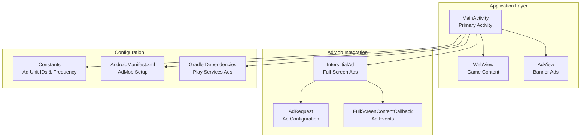
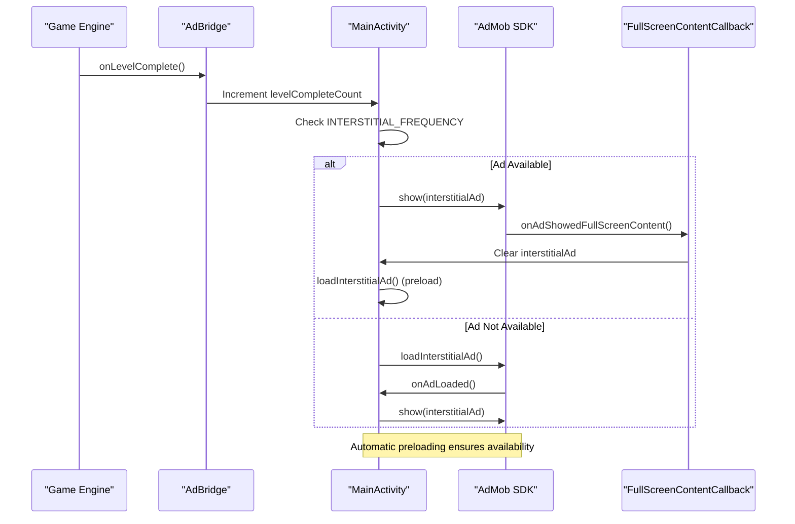
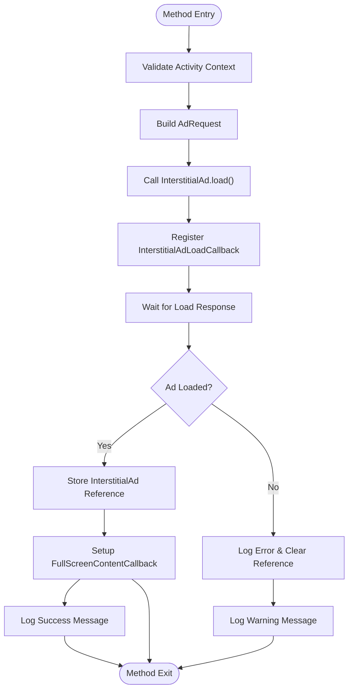
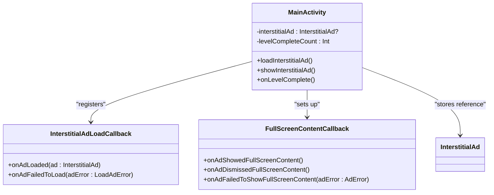
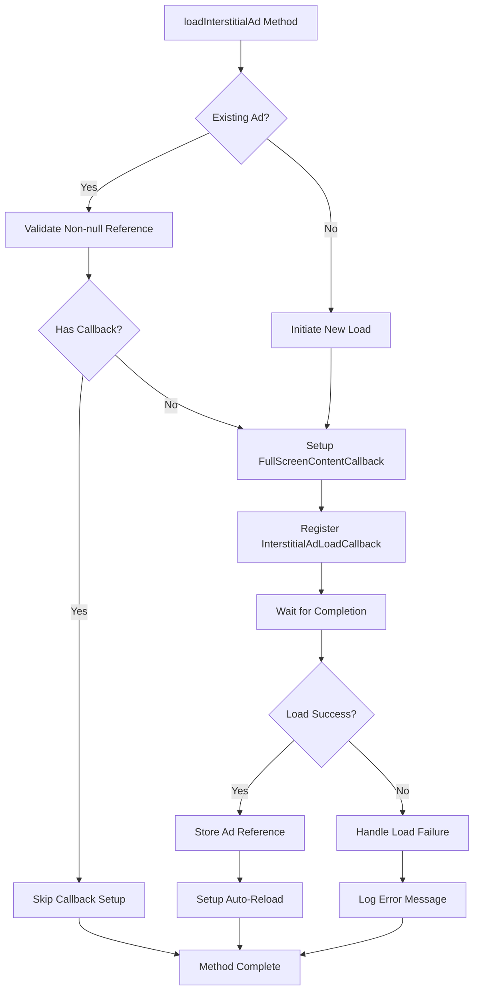
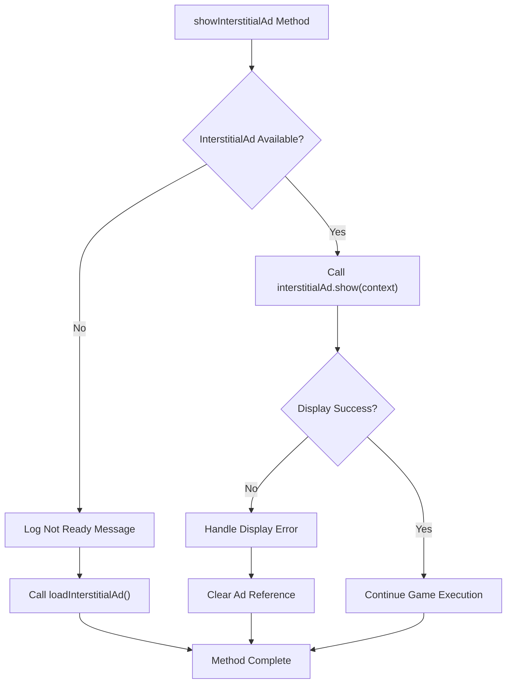
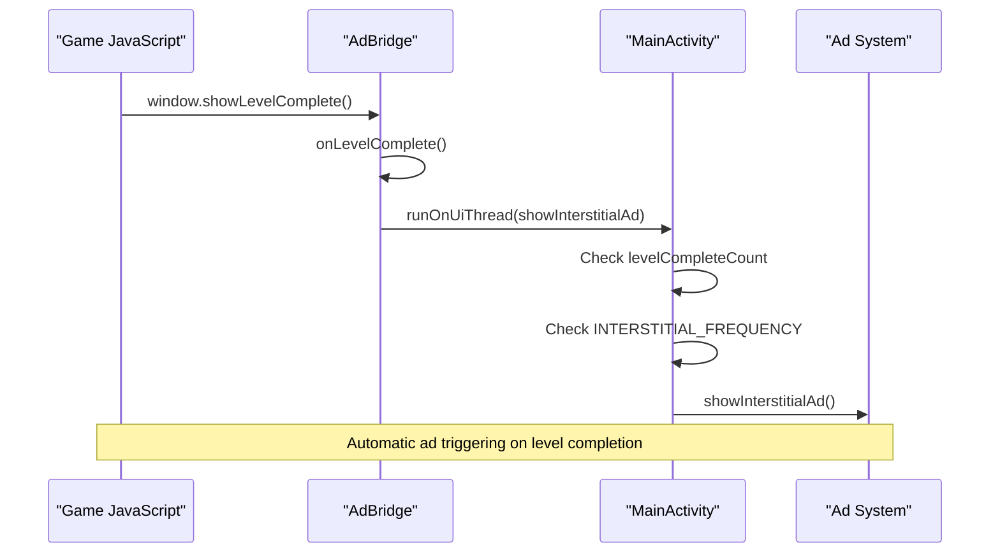
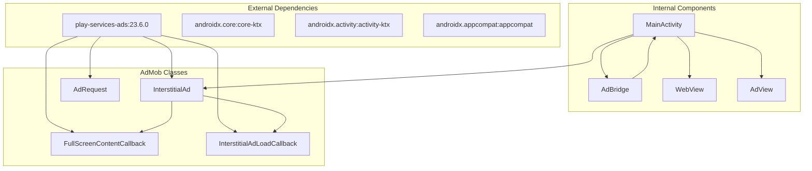

# Interstitial Ad Management

<cite>
**Referenced Files in This Document**
- [MainActivity.kt](file://app/src/main/java/com/cktechhub/games/MainActivity.kt)
- [ADMOB_SETUP.md](file://ADMOB_SETUP.md)
- [AndroidManifest.xml](file://app/src/main/AndroidManifest.xml)
- [build.gradle.kts](file://app/build.gradle.kts)
- [libs.versions.toml](file://gradle/libs.versions.toml)
</cite>

## Table of Contents
1. [Introduction](#introduction)
2. [Project Structure](#project-structure)
3. [Core Components](#core-components)
4. [Architecture Overview](#architecture-overview)
5. [Detailed Component Analysis](#detailed-component-analysis)
6. [Dependency Analysis](#dependency-analysis)
7. [Performance Considerations](#performance-considerations)
8. [Troubleshooting Guide](#troubleshooting-guide)
9. [Conclusion](#conclusion)

## Introduction

This document provides comprehensive coverage of interstitial ad management in the games application, focusing on the complete lifecycle from loading to display. The implementation demonstrates best practices for Google AdMob interstitial advertising integration, including automatic preloading, frequency control, error handling, and memory management.

The system integrates seamlessly with the game's level completion detection through a JavaScript bridge, automatically triggering interstitial advertisements at configurable intervals while maintaining optimal user experience and performance.

## Project Structure

The interstitial ad management system is implemented within the main activity class alongside other application components. The project follows a modular architecture with clear separation between UI components, ad management logic, and configuration settings.



**Diagram sources**
- [MainActivity.kt:42-440](file://app/src/main/java/com/cktechhub/games/MainActivity.kt#L42-L440)
- [AndroidManifest.xml:9-48](file://app/src/main/AndroidManifest.xml#L9-L48)

**Section sources**
- [MainActivity.kt:1-441](file://app/src/main/java/com/cktechhub/games/MainActivity.kt#L1-L441)
- [AndroidManifest.xml:1-51](file://app/src/main/AndroidManifest.xml#L1-L51)

## Core Components

The interstitial ad management system consists of several key components working together to provide seamless advertisement delivery:

### Primary Components

| Component | Purpose | Implementation Location |
|-----------|---------|----------------------|
| **InterstitialAd.load()** | Loads interstitial advertisements asynchronously | [MainActivity.kt:370-400](file://app/src/main/java/com/cktechhub/games/MainActivity.kt#L370-L400) |
| **loadInterstitialAd()** | Manages ad loading lifecycle and callbacks | [MainActivity.kt:370-400](file://app/src/main/java/com/cktechhub/games/MainActivity.kt#L370-L400) |
| **showInterstitialAd()** | Displays interstitial ads with availability checks | [MainActivity.kt:402-409](file://app/src/main/java/com/cktechhub/games/MainActivity.kt#L402-L409) |
| **AdBridge.onLevelComplete()** | Level completion detection and trigger logic | [MainActivity.kt:429-439](file://app/src/main/java/com/cktechhub/games/MainActivity.kt#L429-L439) |
| **FullScreenContentCallback** | Handles ad lifecycle events and automatic reloading | [MainActivity.kt:378-390](file://app/src/main/java/com/cktechhub/games/MainActivity.kt#L378-L390) |

### Configuration Constants

| Constant | Value | Purpose |
|----------|-------|---------|
| **INTERSTITIAL_AD_UNIT_ID** | Test ID: `ca-app-pub-3940256099942544/1033173712` | AdMob interstitial unit identifier |
| **BANNER_AD_UNIT_ID** | Test ID: `ca-app-pub-3940256099942544/6300978111` | AdMob banner unit identifier |
| **INTERSTITIAL_FREQUENCY** | `2` | Show ad every N level completions |
| **TAG** | `"MainActivity"` | Logging identifier |

**Section sources**
- [MainActivity.kt:51-60](file://app/src/main/java/com/cktechhub/games/MainActivity.kt#L51-L60)
- [ADMOB_SETUP.md:42-52](file://ADMOB_SETUP.md#L42-L52)

## Architecture Overview

The interstitial ad management follows a reactive architecture pattern where ad events trigger automatic loading cycles, ensuring continuous availability while minimizing user disruption.



**Diagram sources**
- [MainActivity.kt:429-439](file://app/src/main/java/com/cktechhub/games/MainActivity.kt#L429-L439)
- [MainActivity.kt:402-409](file://app/src/main/java/com/cktechhub/games/MainActivity.kt#L402-L409)
- [MainActivity.kt:370-400](file://app/src/main/java/com/cktechhub/games/MainActivity.kt#L370-L400)

## Detailed Component Analysis

### InterstitialAd.load() Method Implementation

The `loadInterstitialAd()` method implements the core loading mechanism using Google AdMob's asynchronous loading pattern:



**Diagram sources**
- [MainActivity.kt:370-400](file://app/src/main/java/com/cktechhub/games/MainActivity.kt#L370-L400)

#### Key Implementation Details

The loading process follows these critical steps:

1. **Context Validation**: Ensures the activity context is valid before initiating ad requests
2. **Ad Request Building**: Creates an empty `AdRequest.Builder().build()` configuration
3. **Asynchronous Loading**: Uses `InterstitialAd.load()` with callback registration
4. **Memory Management**: Properly handles ad lifecycle and cleanup

**Section sources**
- [MainActivity.kt:370-400](file://app/src/main/java/com/cktechhub/games/MainActivity.kt#L370-L400)

### Ad Loading Callbacks and Error Handling

The implementation provides comprehensive error handling through multiple callback mechanisms:



**Diagram sources**
- [MainActivity.kt:375-390](file://app/src/main/java/com/cktechhub/games/MainActivity.kt#L375-L390)
- [MainActivity.kt:370-400](file://app/src/main/java/com/cktechhub/games/MainActivity.kt#L370-L400)

#### Error Handling Mechanisms

| Error Scenario | Handler | Action Taken |
|---------------|---------|--------------|
| **Ad Load Failure** | `onAdFailedToLoad` | Logs warning, clears reference |
| **Ad Display Failure** | `onAdFailedToShowFullScreenContent` | Clears reference, attempts reload |
| **Ad Dismissal** | `onAdDismissedFullScreenContent` | Clears reference, preloads next ad |
| **Network Issues** | `isInternetAvailable()` | Prevents loading until connectivity restored |

**Section sources**
- [MainActivity.kt:394-397](file://app/src/main/java/com/cktechhub/games/MainActivity.kt#L394-L397)
- [MainActivity.kt:383-386](file://app/src/main/java/com/cktechhub/games/MainActivity.kt#L383-L386)

### loadInterstitialAd() Method Analysis

The `loadInterstitialAd()` method serves as the central orchestrator for interstitial ad lifecycle management:



**Diagram sources**
- [MainActivity.kt:370-400](file://app/src/main/java/com/cktechhub/games/MainActivity.kt#L370-L400)

#### Implementation Features

1. **Automatic Preloading**: After successful display, immediately initiates next ad loading
2. **Error Recovery**: Attempts reload on display failures
3. **Memory Cleanup**: Properly clears ad references on dismissal
4. **Callback Registration**: Sets up comprehensive event handling

**Section sources**
- [MainActivity.kt:370-400](file://app/src/main/java/com/cktechhub/games/MainActivity.kt#L370-L400)

### showInterstitialAd() Method Implementation

The `showInterstitialAd()` method implements conditional display logic with fallback loading:



**Diagram sources**
- [MainActivity.kt:402-409](file://app/src/main/java/com/cktechhub/games/MainActivity.kt#L402-L409)

#### Conditional Logic

The method implements intelligent fallback behavior:
- **Direct Display**: Uses existing ad when available
- **Fallback Loading**: Automatically loads new ad when unavailable
- **Immediate Trigger**: Queues ad display on level completion

**Section sources**
- [MainActivity.kt:402-409](file://app/src/main/java/com/cktechhub/games/MainActivity.kt#L402-L409)

### Ad Frequency Control Mechanism

The frequency control system uses the `INTERSTITIAL_FREQUENCY` constant combined with `levelCompleteCount` tracking:

```mermaid
stateDiagram-v2
[*] --> LevelStart
LevelStart --> LevelComplete : Player completes level
LevelComplete --> IncrementCounter : levelCompleteCount++
IncrementCounter --> CheckFrequency{"levelCompleteCount % INTERSTITIAL_FREQUENCY == 0?"}
CheckFrequency --> |Yes| TriggerAd : Show Interstitial Ad
CheckFrequency --> |No| ContinueGame : Continue Game Play
TriggerAd --> ShowAd : showInterstitialAd()
ShowAd --> AdDisplayed : Ad Shown Successfully
AdDisplayed --> PreloadNext : loadInterstitialAd()
PreloadNext --> LevelStart
ContinueGame --> LevelStart
```

**Diagram sources**
- [MainActivity.kt:429-439](file://app/src/main/java/com/cktechhub/games/MainActivity.kt#L429-L439)
- [MainActivity.kt:59](file://app/src/main/java/com/cktechhub/games/MainActivity.kt#L59)

#### Frequency Configuration Options

| Frequency Value | Behavior | Use Case |
|----------------|----------|----------|
| `1` | Show on every level completion | Maximum monetization |
| `2` | Show every 2nd level completion | Balanced monetization |
| `3` | Show every 3rd level completion | Conservative approach |
| `N` | Show every Nth level completion | Custom monetization strategy |

**Section sources**
- [ADMOB_SETUP.md:84-93](file://ADMOB_SETUP.md#L84-L93)
- [MainActivity.kt:59](file://app/src/main/java/com/cktechhub/games/MainActivity.kt#L59)

### JavaScript Bridge Integration

The `AdBridge` class provides seamless integration between the game engine and ad management system:



**Diagram sources**
- [MainActivity.kt:429-439](file://app/src/main/java/com/cktechhub/games/MainActivity.kt#L429-L439)
- [MainActivity.kt:214-228](file://app/src/main/java/com/cktechhub/games/MainActivity.kt#L214-L228)

#### Bridge Implementation Features

1. **JavaScript Interface**: Exposes native methods to JavaScript environment
2. **Thread Safety**: Uses `runOnUiThread` for UI thread safety
3. **Event Delegation**: Translates game events to ad triggers
4. **Logging Integration**: Provides detailed completion tracking

**Section sources**
- [MainActivity.kt:429-439](file://app/src/main/java/com/cktechhub/games/MainActivity.kt#L429-L439)
- [MainActivity.kt:214-228](file://app/src/main/java/com/cktechhub/games/MainActivity.kt#L214-L228)

## Dependency Analysis

The interstitial ad management system relies on several external dependencies and internal components working together:



**Diagram sources**
- [build.gradle.kts:34-43](file://app/build.gradle.kts#L34-L43)
- [libs.versions.toml:13-21](file://gradle/libs.versions.toml#L13-L21)

### External Dependencies

| Dependency | Version | Purpose |
|------------|---------|---------|
| **play-services-ads** | `23.6.0` | Core AdMob functionality |
| **androidx.core-ktx** | `1.18.0` | Kotlin extensions for Android |
| **androidx.activity-ktx** | `1.13.0` | Activity lifecycle support |
| **androidx.appcompat** | `1.7.0` | AppCompat support library |

### Internal Component Relationships

The system maintains loose coupling between components while ensuring proper coordination:

1. **MainActivity** acts as the central coordinator
2. **AdBridge** provides event bridging between JavaScript and native code
3. **InterstitialAd** manages ad lifecycle independently
4. **FullScreenContentCallback** handles ad-specific events

**Section sources**
- [build.gradle.kts:34-43](file://app/build.gradle.kts#L34-L43)
- [libs.versions.toml:13-21](file://gradle/libs.versions.toml#L13-L21)

## Performance Considerations

The interstitial ad management system implements several performance optimization strategies:

### Memory Management

1. **Proper Cleanup**: Ads are cleared in `onDestroy()` lifecycle method
2. **Reference Management**: Uses nullable references to prevent memory leaks
3. **Automatic Preloading**: Balances availability with resource usage

### Network Optimization

1. **Connectivity Check**: Validates internet availability before loading
2. **Error Recovery**: Implements retry logic for transient failures
3. **Graceful Degradation**: Continues gameplay even without ads

### Resource Management

1. **Background Processing**: Uses asynchronous loading to avoid UI blocking
2. **Thread Safety**: Ensures UI operations occur on main thread
3. **Lifecycle Awareness**: Respects activity lifecycle states

## Troubleshooting Guide

### Common Issues and Solutions

| Issue | Symptoms | Solution |
|-------|----------|----------|
| **Ads Not Loading** | Log shows "failed to load" | Verify AdMob IDs, check network connectivity |
| **Ads Display but Immediately Close** | `onAdFailedToShowFullScreenContent` triggered | Check ad availability, implement retry logic |
| **Missing Ads** | Levels complete but no ads shown | Verify `INTERSTITIAL_FREQUENCY` setting |
| **Memory Leaks** | App crashes with OOM errors | Ensure proper cleanup in `onDestroy()` |

### Debugging Strategies

1. **Enable Logging**: Monitor ad lifecycle events in logcat
2. **Test Connectivity**: Verify internet connection before loading
3. **Check Ad Availability**: Use conditional display logic
4. **Monitor Memory Usage**: Track ad reference lifecycle

### Production Considerations

1. **Replace Test IDs**: Update with production AdMob IDs before release
2. **Configure Frequency**: Adjust `INTERSTITIAL_FREQUENCY` based on user feedback
3. **Monitor Performance**: Track ad load times and user engagement metrics
4. **Handle Edge Cases**: Implement robust error handling for all scenarios

**Section sources**
- [ADMOB_SETUP.md:96-104](file://ADMOB_SETUP.md#L96-L104)
- [MainActivity.kt:394-397](file://app/src/main/java/com/cktechhub/games/MainActivity.kt#L394-L397)

## Conclusion

The interstitial ad management system demonstrates comprehensive implementation of Google AdMob integration within an Android gaming application. The solution provides:

- **Seamless Integration**: Automatic triggering through JavaScript bridge
- **Robust Error Handling**: Comprehensive callback system for all scenarios
- **Performance Optimization**: Asynchronous loading with automatic preloading
- **Flexible Configuration**: Adjustable frequency control for monetization strategy
- **Memory Safety**: Proper lifecycle management and cleanup

The implementation serves as a model for integrating advertising into mobile gaming applications while maintaining user experience and performance standards. The modular design allows for easy customization and extension based on specific monetization requirements.

Key strengths include the automatic preloading mechanism that ensures ad availability, comprehensive error handling that maintains app stability, and flexible frequency control that accommodates various monetization strategies. The system's architecture supports future enhancements while maintaining backward compatibility and performance standards.