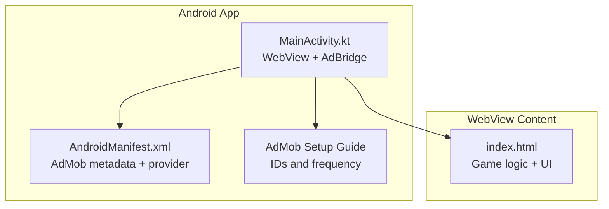
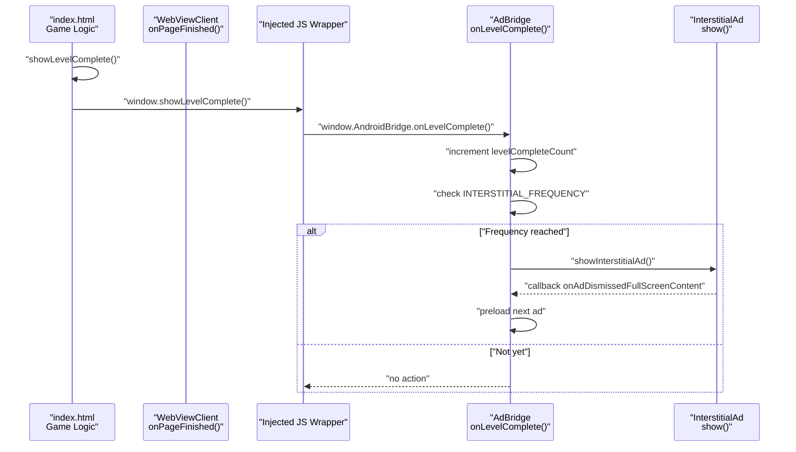
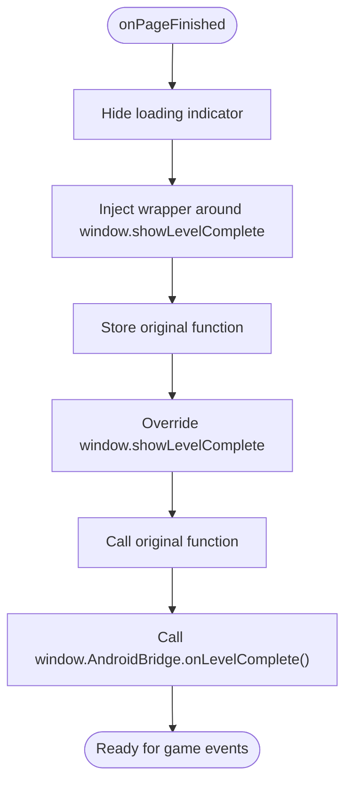
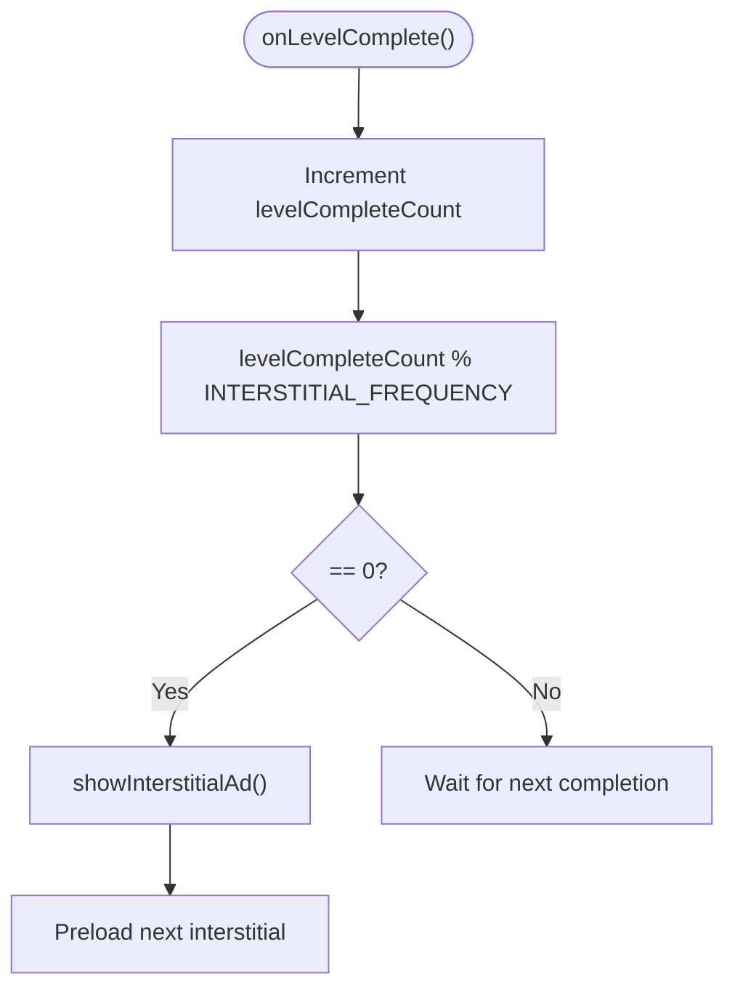
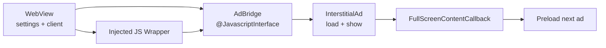

# JavaScript Bridge Integration

<cite>
**Referenced Files in This Document**
- [MainActivity.kt](file://app/src/main/java/com/cktechhub/games/MainActivity.kt)
- [index.html](file://app/src/main/assets/index.html)
- [AndroidManifest.xml](file://app/src/main/AndroidManifest.xml)
- [ADMOB_SETUP.md](file://ADMOB_SETUP.md)
</cite>

## Table of Contents
1. [Introduction](#introduction)
2. [Project Structure](#project-structure)
3. [Core Components](#core-components)
4. [Architecture Overview](#architecture-overview)
5. [Detailed Component Analysis](#detailed-component-analysis)
6. [Dependency Analysis](#dependency-analysis)
7. [Performance Considerations](#performance-considerations)
8. [Troubleshooting Guide](#troubleshooting-guide)
9. [Conclusion](#conclusion)

## Introduction
This document explains the JavaScript bridge implementation that connects a WebView-based HTML5 game to native Android AdMob functionality. It focuses on the AdBridge inner class annotated with @JavascriptInterface, the JavaScript injection mechanism in onPageFinished(), and the bidirectional communication pattern between game logic and Android components. It also covers security considerations, error handling, and the frequency-based ad display logic tied to game events.

## Project Structure
The project consists of:
- An Android activity hosting a WebView that loads a local HTML5 game.
- A JavaScript interface exposed to the WebView to receive game events.
- A WebViewClient that injects JavaScript to wrap the game’s completion callback.
- AdMob SDK integration for banner and interstitial ads.

**Diagram sources**
- [MainActivity.kt:165-263](file://app/src/main/java/com/cktechhub/games/MainActivity.kt#L165-L263)
- [AndroidManifest.xml:9-48](file://app/src/main/AndroidManifest.xml#L9-L48)
- [ADMOB_SETUP.md:1-104](file://ADMOB_SETUP.md#L1-L104)

**Section sources**
- [MainActivity.kt:165-263](file://app/src/main/java/com/cktechhub/games/MainActivity.kt#L165-L263)
- [AndroidManifest.xml:9-48](file://app/src/main/AndroidManifest.xml#L9-L48)
- [ADMOB_SETUP.md:1-104](file://ADMOB_SETUP.md#L1-L104)

## Core Components
- WebView with JavaScript enabled and strict security policies.
- AdBridge inner class exposing onLevelComplete() via @JavascriptInterface.
- JavaScript injection in onPageFinished() that wraps window.showLevelComplete().
- Interstitial ad loading and display logic with frequency control.
- Banner ad at the bottom of the screen.

Key responsibilities:
- Expose a controlled bridge method to the WebView.
- Intercept game completion events and trigger native ad logic.
- Enforce safe navigation and mixed content policies.
- Manage ad lifecycle and preloading.

**Section sources**
- [MainActivity.kt:165-263](file://app/src/main/java/com/cktechhub/games/MainActivity.kt#L165-L263)
- [MainActivity.kt:429-439](file://app/src/main/java/com/cktechhub/games/MainActivity.kt#L429-L439)
- [MainActivity.kt:370-409](file://app/src/main/java/com/cktechhub/games/MainActivity.kt#L370-L409)

## Architecture Overview
The bridge enables the game to signal completion to Android, which then decides whether to show an interstitial ad based on a configurable frequency.

**Diagram sources**
- [MainActivity.kt:209-229](file://app/src/main/java/com/cktechhub/games/MainActivity.kt#L209-L229)
- [MainActivity.kt:429-439](file://app/src/main/java/com/cktechhub/games/MainActivity.kt#L429-L439)
- [MainActivity.kt:402-409](file://app/src/main/java/com/cktechhub/games/MainActivity.kt#L402-L409)
- [index.html:853-881](file://app/src/main/assets/index.html#L853-L881)

## Detailed Component Analysis

### AdBridge Inner Class and @JavascriptInterface
- The AdBridge class is an inner class of MainActivity and exposes a method annotated with @JavascriptInterface.
- The method onLevelComplete() increments a counter and checks if the configured frequency threshold is met to trigger an interstitial ad.
- The bridge is attached to the WebView with a fixed JavaScript object name, enabling the injected script to call it.

Implementation highlights:
- Annotation ensures the method is callable from JavaScript.
- The method runs on the UI thread to safely interact with the interstitial ad.
- Frequency-based logic uses a modulo operation against a constant.

Security note:
- @JavascriptInterface methods are accessible only to the WebView instance they are attached to and are not exposed to arbitrary JavaScript contexts.

**Section sources**
- [MainActivity.kt:429-439](file://app/src/main/java/com/cktechhub/games/MainActivity.kt#L429-L439)

### JavaScript Injection in onPageFinished()
- The WebViewClient’s onPageFinished() removes the loading indicator and injects a small script.
- The injected script wraps window.showLevelComplete() to call the Android bridge method after delegating to the original function.
- This ensures the bridge is notified on every level completion without changing the game’s core logic.

Injection flow:
- Evaluate a self-executing function that stores the original window.showLevelComplete.
- Overrides window.showLevelComplete to call the original and then invoke window.AndroidBridge.onLevelComplete().

**Diagram sources**
- [MainActivity.kt:209-229](file://app/src/main/java/com/cktechhub/games/MainActivity.kt#L209-L229)

**Section sources**
- [MainActivity.kt:209-229](file://app/src/main/java/com/cktechhub/games/MainActivity.kt#L209-L229)

### Game Event Triggering and Ad Display Logic
- The game’s showLevelComplete() function is responsible for displaying the completion overlay and computing scores.
- After the overlay appears, the injected wrapper calls the Android bridge.
- The bridge increments a counter and displays an interstitial ad when the counter reaches the configured frequency.

Frequency control:
- The constant INTERSTITIAL_FREQUENCY determines how often an ad is shown.
- The bridge uses a modulo operation to decide whether to show the ad.

**Diagram sources**
- [MainActivity.kt:429-439](file://app/src/main/java/com/cktechhub/games/MainActivity.kt#L429-L439)
- [MainActivity.kt:370-409](file://app/src/main/java/com/cktechhub/games/MainActivity.kt#L370-L409)

**Section sources**
- [index.html:853-881](file://app/src/main/assets/index.html#L853-L881)
- [MainActivity.kt:429-439](file://app/src/main/java/com/cktechhub/games/MainActivity.kt#L429-L439)
- [ADMOB_SETUP.md:80-93](file://ADMOB_SETUP.md#L80-L93)

### WebView Security Policies and Safe Navigation
- JavaScript is enabled, but DOM storage and mixed content are restricted.
- The WebViewClient overrides shouldOverrideUrlLoading to allow only local asset URLs, blocking external navigation.
- Mixed content is disallowed to prevent insecure resource loading.
- A crash-safe handler is implemented for renderer process gone scenarios.

Security measures:
- Local-only navigation policy prevents deep linking to external sites.
- Mixed content disabled reduces risk of man-in-the-middle attacks.
- Renderer crash handling improves resilience.

**Section sources**
- [MainActivity.kt:172-189](file://app/src/main/java/com/cktechhub/games/MainActivity.kt#L172-L189)
- [MainActivity.kt:194-207](file://app/src/main/java/com/cktechhub/games/MainActivity.kt#L194-L207)
- [MainActivity.kt:231-244](file://app/src/main/java/com/cktechhub/games/MainActivity.kt#L231-L244)

### AdMob Integration and Banner Ad
- Banner ad is initialized with a unit ID and loaded during activity creation.
- The banner is positioned below the WebView in the UI hierarchy.
- AdMob metadata and provider are declared in the manifest for SDK initialization.

**Section sources**
- [MainActivity.kt:265-278](file://app/src/main/java/com/cktechhub/games/MainActivity.kt#L265-L278)
- [AndroidManifest.xml:20-28](file://app/src/main/AndroidManifest.xml#L20-L28)
- [AndroidManifest.xml:44-48](file://app/src/main/AndroidManifest.xml#L44-L48)

## Dependency Analysis
The bridge depends on:
- WebView settings and client configuration.
- Interstitial ad lifecycle callbacks.
- Manifest metadata for AdMob initialization.

**Diagram sources**
- [MainActivity.kt:165-263](file://app/src/main/java/com/cktechhub/games/MainActivity.kt#L165-L263)
- [MainActivity.kt:370-409](file://app/src/main/java/com/cktechhub/games/MainActivity.kt#L370-L409)
- [MainActivity.kt:429-439](file://app/src/main/java/com/cktechhub/games/MainActivity.kt#L429-L439)

**Section sources**
- [MainActivity.kt:165-263](file://app/src/main/java/com/cktechhub/games/MainActivity.kt#L165-L263)
- [MainActivity.kt:370-409](file://app/src/main/java/com/cktechhub/games/MainActivity.kt#L370-L409)
- [MainActivity.kt:429-439](file://app/src/main/java/com/cktechhub/games/MainActivity.kt#L429-L439)

## Performance Considerations
- Keep the injected JavaScript minimal to reduce overhead.
- Avoid heavy computations in onLevelComplete(); delegate UI updates to the main thread.
- Preload interstitial ads to minimize latency when showing them.
- Monitor ad load failures and retry loading as implemented.

[No sources needed since this section provides general guidance]

## Troubleshooting Guide
Common issues and resolutions:
- Bridge method not called:
  - Verify the bridge is attached to the WebView with the expected object name.
  - Confirm onPageFinished() executed and injected script ran.
  - Ensure window.AndroidBridge exists before calling the method.
- Ads not showing:
  - Check interstitial ad load callbacks and logs for failure reasons.
  - Confirm frequency threshold is met and interstitial is ready.
- Security errors:
  - Mixed content disabled blocks insecure resources; ensure all assets are served securely.
  - External navigation blocked by shouldOverrideUrlLoading; only allow local asset URLs.
- Renderer crashes:
  - The WebView handles renderer gone events; consider recreating the WebView if necessary.

**Section sources**
- [MainActivity.kt:194-207](file://app/src/main/java/com/cktechhub/games/MainActivity.kt#L194-L207)
- [MainActivity.kt:231-244](file://app/src/main/java/com/cktechhub/games/MainActivity.kt#L231-L244)
- [MainActivity.kt:370-409](file://app/src/main/java/com/cktechhub/games/MainActivity.kt#L370-L409)

## Conclusion
The JavaScript bridge provides a clean, secure pathway for the WebView game to communicate completion events to Android. By wrapping the game’s completion function and invoking a controlled bridge method, the app maintains separation of concerns while enabling frequency-based interstitial ad delivery. Combined with strict WebView security policies and robust ad lifecycle management, the solution balances user experience with monetization goals.