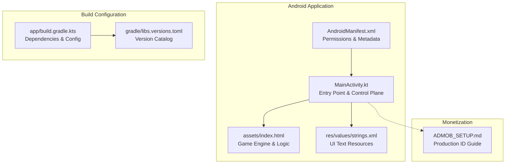
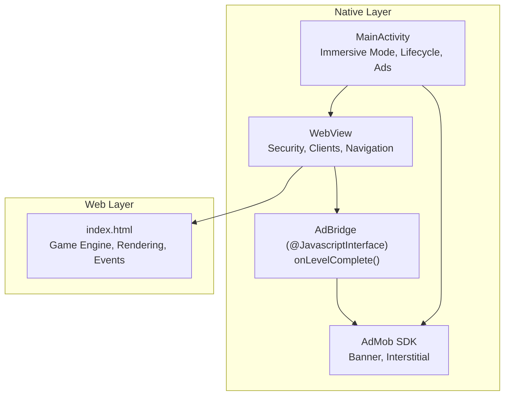
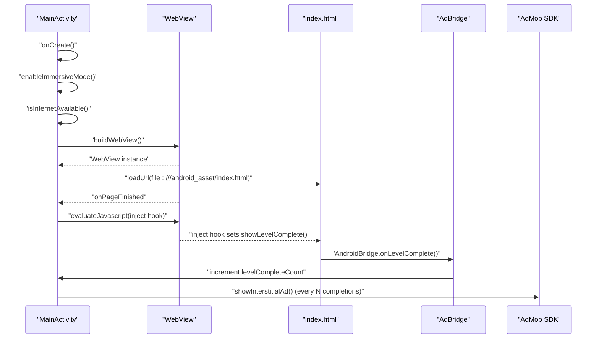
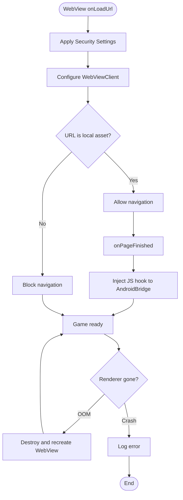
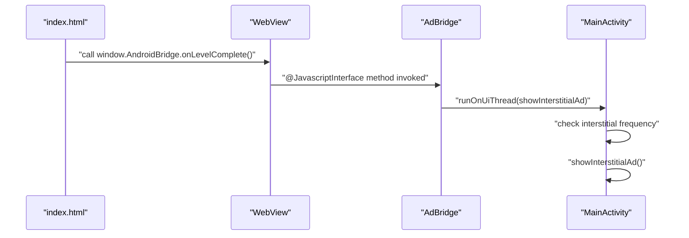
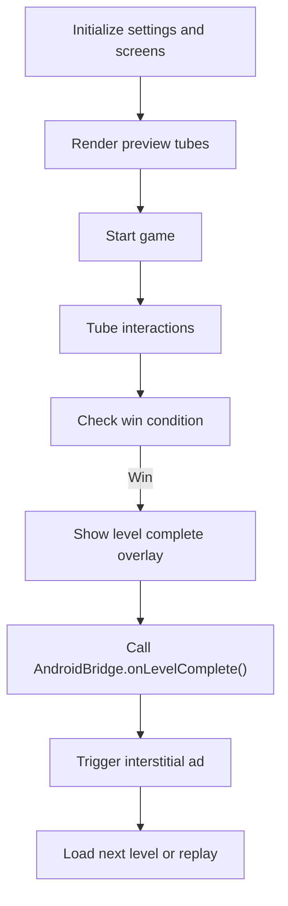
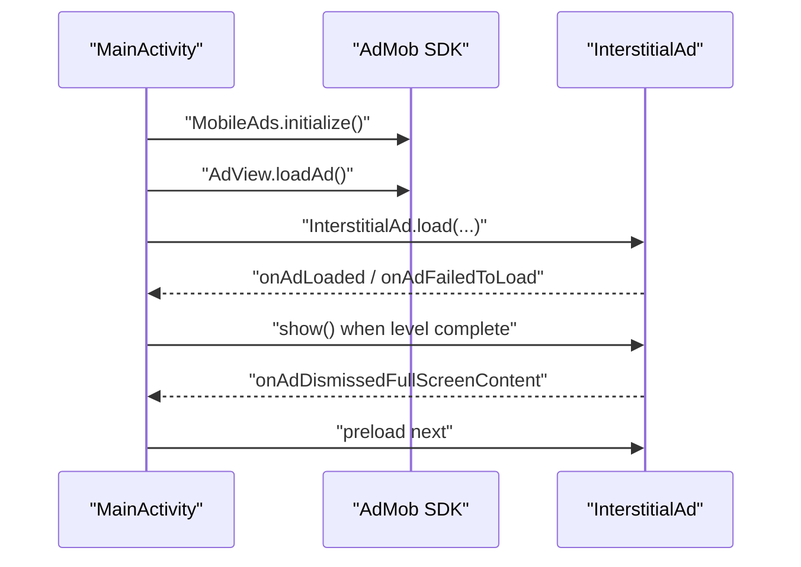
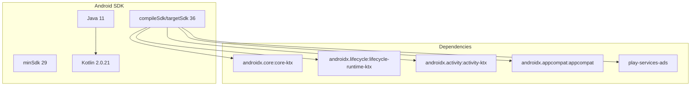
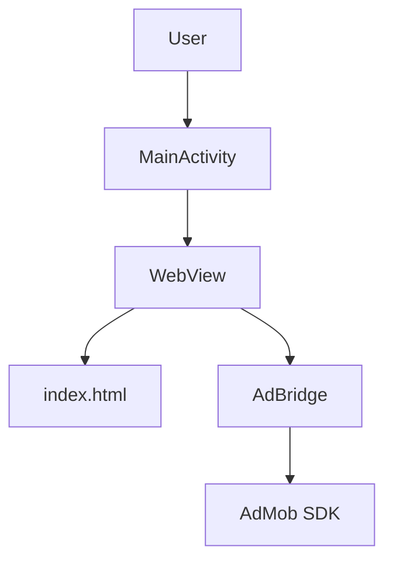
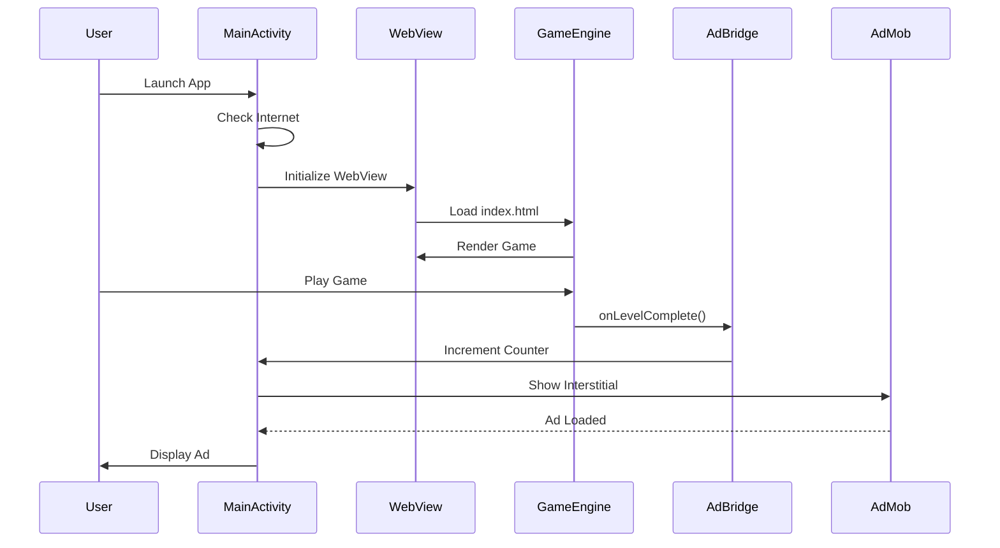

# Architecture & Design

<cite>
**Referenced Files in This Document**
- [MainActivity.kt](file://app/src/main/java/com/cktechhub/games/MainActivity.kt)
- [index.html](file://app/src/main/assets/index.html)
- [AndroidManifest.xml](file://app/src/main/AndroidManifest.xml)
- [build.gradle.kts](file://app/build.gradle.kts)
- [libs.versions.toml](file://gradle/libs.versions.toml)
- [ADMOB_SETUP.md](file://ADMOB_SETUP.md)
- [strings.xml](file://app/src/main/res/values/strings.xml)
</cite>

## Update Summary
**Changes Made**
- Enhanced architecture documentation with detailed visual diagrams
- Added comprehensive component breakdown showing system boundaries
- Expanded coverage of hybrid Android-HTML5 architecture approach
- Improved technical depth on WebView pattern and bridge pattern implementation
- Added detailed analysis of game engine architecture within WebView container
- Enhanced security configurations and offline detection mechanisms documentation

## Table of Contents
1. [Introduction](#introduction)
2. [Project Structure](#project-structure)
3. [Core Components](#core-components)
4. [Architecture Overview](#architecture-overview)
5. [Detailed Component Analysis](#detailed-component-analysis)
6. [Dependency Analysis](#dependency-analysis)
7. [Performance Considerations](#performance-considerations)
8. [Troubleshooting Guide](#troubleshooting-guide)
9. [Conclusion](#conclusion)
10. [Appendices](#appendices)

## Introduction
This document describes the hybrid mobile application architecture that combines native Android components with an embedded web-based game engine. The application uses a WebView to host the game content, enabling a modern HTML5/CSS3/JavaScript experience while leveraging native Android capabilities such as immersive mode, offline detection, and AdMob integration. The design centers around two primary architectural patterns:
- WebView pattern: The game runs inside a WebView container managed by MainActivity
- Bridge pattern: A JavaScript interface enables bidirectional communication between the WebView and Android

System boundaries separate the native Android layer (MainActivity, WebView, AdMob SDK) from the web layer (HTML, CSS, JavaScript game engine). Cross-cutting concerns include immersive mode, crash recovery, memory management, and offline detection.

## Project Structure
The project follows a conventional Android application layout with a focus on embedding a self-contained HTML5 game packaged as Android assets.

**Diagram sources**
- [AndroidManifest.xml:1-51](file://app/src/main/AndroidManifest.xml#L1-L51)
- [MainActivity.kt:1-441](file://app/src/main/java/com/cktechhub/games/MainActivity.kt#L1-L441)
- [index.html:1-1385](file://app/src/main/assets/index.html#L1-L1385)
- [strings.xml:1-6](file://app/src/main/res/values/strings.xml#L1-L6)
- [build.gradle.kts:1-53](file://app/build.gradle.kts#L1-L53)
- [libs.versions.toml:1-28](file://gradle/libs.versions.toml#L1-L28)
- [ADMOB_SETUP.md:1-104](file://ADMOB_SETUP.md#L1-L104)

**Section sources**
- [AndroidManifest.xml:1-51](file://app/src/main/AndroidManifest.xml#L1-L51)
- [MainActivity.kt:1-441](file://app/src/main/java/com/cktechhub/games/MainActivity.kt#L1-L441)
- [index.html:1-1385](file://app/src/main/assets/index.html#L1-L1385)
- [strings.xml:1-6](file://app/src/main/res/values/strings.xml#L1-L6)
- [build.gradle.kts:1-53](file://app/build.gradle.kts#L1-L53)
- [libs.versions.toml:1-28](file://gradle/libs.versions.toml#L1-L28)
- [ADMOB_SETUP.md:1-104](file://ADMOB_SETUP.md#L1-L104)

## Core Components
- **MainActivity**: The Android entry point responsible for:
  - Enabling immersive mode and managing window insets
  - Checking internet connectivity and rendering an offline UI if unavailable
  - Initializing and configuring the WebView, including security settings and clients
  - Exposing a JavaScript bridge (AdBridge) for bidirectional communication
  - Managing AdMob banner and interstitial ads
  - Handling lifecycle events (onResume, onPause, onDestroy) and back navigation
- **WebView**: Hosts the game content from assets and enforces safe navigation and security policies
- **JavaScript bridge (AdBridge)**: Provides a @JavascriptInterface method invoked by the game to trigger native actions (e.g., showing interstitial ads)
- **Game engine (index.html)**: Implements the complete game logic, rendering, animations, and persistence using HTML5, CSS3, and JavaScript

Key architectural decisions:
- Using WebView to host the game ensures portability and rapid iteration of the web layer without rebuilding the native app
- The JavaScript bridge enables the game to signal native events (e.g., level completion) for monetization and analytics
- Offline detection prevents launching the app without network connectivity, ensuring reliable ad loading and user experience
- Security configurations restrict mixed content and enforce safe navigation to protect against malicious URLs

**Section sources**
- [MainActivity.kt:42-154](file://app/src/main/java/com/cktechhub/games/MainActivity.kt#L42-L154)
- [MainActivity.kt:165-263](file://app/src/main/java/com/cktechhub/games/MainActivity.kt#L165-L263)
- [MainActivity.kt:428-439](file://app/src/main/java/com/cktechhub/games/MainActivity.kt#L428-L439)
- [index.html:1-1385](file://app/src/main/assets/index.html#L1-L1385)

## Architecture Overview
The system architecture separates the native Android layer from the web layer while enabling tight integration through the WebView and JavaScript bridge.

**Diagram sources**
- [MainActivity.kt:42-154](file://app/src/main/java/com/cktechhub/games/MainActivity.kt#L42-L154)
- [MainActivity.kt:165-263](file://app/src/main/java/com/cktechhub/games/MainActivity.kt#L165-L263)
- [MainActivity.kt:428-439](file://app/src/main/java/com/cktechhub/games/MainActivity.kt#L428-L439)
- [index.html:1-1385](file://app/src/main/assets/index.html#L1-L1385)

## Detailed Component Analysis

### MainActivity: Native Container and Control Plane
Responsibilities:
- **Lifecycle management**: onCreate initializes immersive mode, internet checks, AdMob, layout, WebView, and loads the game URL. onResume/onPause manage WebView and AdView lifecycle. onDestroy destroys WebView and AdView resources
- **Layout composition**: Builds a vertical LinearLayout with a FrameLayout containing the WebView and a centered ProgressBar overlay, and a bottom-aligned AdView
- **WebView configuration**: Enables JavaScript, DOM storage, file access, and wide viewport. Disables zoom controls and mixed content. Uses a WebViewClient to restrict navigation to local assets and injects a JavaScript hook to notify Android on level completion. Uses a WebChromeClient for console logging
- **JavaScript bridge**: Adds an AdBridge instance named "AndroidBridge" for the game to call into Android
- **Back navigation**: Uses OnBackPressedDispatcher to navigate back in WebView when possible
- **Offline detection**: Checks connectivity before proceeding; otherwise displays a custom offline UI with retry
- **AdMob integration**: Initializes MobileAds, loads a banner ad, and preloads an interstitial ad. Triggers interstitial ads based on level completion frequency

**Diagram sources**
- [MainActivity.kt:66-135](file://app/src/main/java/com/cktechhub/games/MainActivity.kt#L66-L135)
- [MainActivity.kt:194-245](file://app/src/main/java/com/cktechhub/games/MainActivity.kt#L194-L245)
- [MainActivity.kt:214-229](file://app/src/main/java/com/cktechhub/games/MainActivity.kt#L214-L229)
- [MainActivity.kt:428-439](file://app/src/main/java/com/cktechhub/games/MainActivity.kt#L428-L439)
- [MainActivity.kt:402-409](file://app/src/main/java/com/cktechhub/games/MainActivity.kt#L402-L409)

**Section sources**
- [MainActivity.kt:66-135](file://app/src/main/java/com/cktechhub/games/MainActivity.kt#L66-L135)
- [MainActivity.kt:165-263](file://app/src/main/java/com/cktechhub/games/MainActivity.kt#L165-L263)
- [MainActivity.kt:296-364](file://app/src/main/java/com/cktechhub/games/MainActivity.kt#L296-L364)
- [MainActivity.kt:402-409](file://app/src/main/java/com/cktechhub/games/MainActivity.kt#L402-L409)

### WebView Pattern: Safe Hosting and Navigation
- **Security and performance**:
  - JavaScript enabled and DOM storage enabled for game state
  - Mixed content disabled to prevent insecure resource loading
  - Zoom controls disabled and user gesture requirement relaxed for media playback
  - Cache mode set to default; layout algorithm set to NORMAL
- **Navigation safety**:
  - WebViewClient blocks non-local asset URLs, preventing external navigation
  - onPageFinished removes the loading indicator and injects a JavaScript hook to notify Android on level completion
- **Crash recovery**:
  - onRenderProcessGone handles renderer crashes and low-memory termination by destroying and recreating the WebView

**Diagram sources**
- [MainActivity.kt:172-189](file://app/src/main/java/com/cktechhub/games/MainActivity.kt#L172-L189)
- [MainActivity.kt:194-207](file://app/src/main/java/com/cktechhub/games/MainActivity.kt#L194-L207)
- [MainActivity.kt:209-229](file://app/src/main/java/com/cktechhub/games/MainActivity.kt#L209-L229)
- [MainActivity.kt:231-244](file://app/src/main/java/com/cktechhub/games/MainActivity.kt#L231-L244)

**Section sources**
- [MainActivity.kt:172-189](file://app/src/main/java/com/cktechhub/games/MainActivity.kt#L172-L189)
- [MainActivity.kt:194-207](file://app/src/main/java/com/cktechhub/games/MainActivity.kt#L194-L207)
- [MainActivity.kt:209-229](file://app/src/main/java/com/cktechhub/games/MainActivity.kt#L209-L229)
- [MainActivity.kt:231-244](file://app/src/main/java/com/cktechhub/games/MainActivity.kt#L231-L244)

### Bridge Pattern: Bidirectional Communication
- **JavaScript interface**:
  - MainActivity exposes an AdBridge inner class annotated with @JavascriptInterface
  - The game invokes window.AndroidBridge.onLevelComplete() when a level completes
  - MainActivity increments a counter and triggers an interstitial ad based on a configurable frequency
- **Injection mechanism**:
  - During onPageFinished, MainActivity injects a small script that wraps the game's showLevelComplete function to call AndroidBridge.onLevelComplete()

**Diagram sources**
- [MainActivity.kt:214-229](file://app/src/main/java/com/cktechhub/games/MainActivity.kt#L214-L229)
- [MainActivity.kt:428-439](file://app/src/main/java/com/cktechhub/games/MainActivity.kt#L428-L439)

**Section sources**
- [MainActivity.kt:214-229](file://app/src/main/java/com/cktechhub/games/MainActivity.kt#L214-L229)
- [MainActivity.kt:428-439](file://app/src/main/java/com/cktechhub/games/MainActivity.kt#L428-L439)

### Game Engine: HTML5/CSS3/JavaScript Implementation
- **Structure**:
  - Single-page application with screens for home, gameplay, level complete overlay, and settings modal
  - Responsive layout with Tailwind CSS CDN and custom styles
- **Rendering and logic**:
  - Canvas-based particle system for visual effects
  - Tube-based sorting puzzle with drag-and-drop interactions
  - Timer, move counter, and scoring computed dynamically
- **Persistence**:
  - Uses localStorage to persist level progress and settings
- **Events**:
  - Delegated event listeners on the tube area for touch and click interactions
  - Emits level completion events that trigger the bridge to Android

**Diagram sources**
- [index.html:1088-1094](file://app/src/main/assets/index.html#L1088-L1094)
- [index.html:908-935](file://app/src/main/assets/index.html#L908-L935)
- [index.html:749-755](file://app/src/main/assets/index.html#L749-L755)
- [MainActivity.kt:214-229](file://app/src/main/java/com/cktechhub/games/MainActivity.kt#L214-L229)

**Section sources**
- [index.html:1-1385](file://app/src/main/assets/index.html#L1-L1385)

### AdMob Integration: Banner and Interstitial
- **Initialization**:
  - MobileAds initialized during onCreate; banner ad loaded immediately; interstitial ad preloaded
- **Configuration**:
  - Banner ad unit ID and interstitial ad unit ID configured in companion object
  - Frequency of interstitial ad display controlled by a constant
- **Lifecycle**:
  - AdView resumed/paused with activity lifecycle; destroyed on activity destruction
- **Setup guide**:
  - A dedicated document outlines where to update test IDs with production IDs

**Diagram sources**
- [MainActivity.kt:80-81](file://app/src/main/java/com/cktechhub/games/MainActivity.kt#L80-L81)
- [MainActivity.kt:265-278](file://app/src/main/java/com/cktechhub/games/MainActivity.kt#L265-L278)
- [MainActivity.kt:370-400](file://app/src/main/java/com/cktechhub/games/MainActivity.kt#L370-L400)
- [ADMOB_SETUP.md:36-62](file://ADMOB_SETUP.md#L36-L62)

**Section sources**
- [MainActivity.kt:80-81](file://app/src/main/java/com/cktechhub/games/MainActivity.kt#L80-L81)
- [MainActivity.kt:265-278](file://app/src/main/java/com/cktechhub/games/MainActivity.kt#L265-L278)
- [MainActivity.kt:370-400](file://app/src/main/java/com/cktechhub/games/MainActivity.kt#L370-L400)
- [ADMOB_SETUP.md:36-62](file://ADMOB_SETUP.md#L36-L62)

## Dependency Analysis
External dependencies and their roles:
- **Android SDK compatibility**:
  - compileSdk/targetSdk: 36
  - minSdk: 29
  - Java/Kotlin compatibility: Java 11, Kotlin 2.0.21
- **AdMob SDK**:
  - play-services-ads version aligned with libs.versions.toml
- **Core Android libraries**:
  - core-ktx, lifecycle-runtime-ktx, activity-ktx, appcompat

**Diagram sources**
- [build.gradle.kts:5-32](file://app/build.gradle.kts#L5-L32)
- [libs.versions.toml:1-28](file://gradle/libs.versions.toml#L1-L28)

**Section sources**
- [build.gradle.kts:5-32](file://app/build.gradle.kts#L5-L32)
- [libs.versions.toml:1-28](file://gradle/libs.versions.toml#L1-L28)

## Performance Considerations
- **WebView performance**:
  - Wide viewport and overview mode improve perceived performance on various screen sizes
  - Mixed content disabled to avoid performance penalties from blocked resources
  - Renderer crash handling ensures stability under memory pressure
- **Memory management**:
  - Destroy WebView and AdView in onDestroy to free resources
  - Use onRenderProcessGone to recover from renderer termination
- **UI responsiveness**:
  - Loading indicator overlays the WebView to prevent premature interaction
  - Debounced resize handling to avoid excessive re-renders
- **Ad performance**:
  - Preload interstitial ads to minimize latency
  - Resume/pause AdView with activity lifecycle to conserve resources

## Troubleshooting Guide
- **Offline mode**:
  - If no internet is detected, the app shows a custom UI with a retry button. Ensure connectivity before retrying
- **WebView crashes**:
  - The app detects renderer process death and recreates the WebView. If repeated, investigate heavy JavaScript usage or memory leaks
- **AdMob issues**:
  - Verify production IDs are replaced before release. Confirm AdMob initialization and ad unit creation in the console
- **Back navigation**:
  - Back presses are routed to WebView when possible; otherwise, the activity handles the back press

**Section sources**
- [MainActivity.kt:296-364](file://app/src/main/java/com/cktechhub/games/MainActivity.kt#L296-L364)
- [MainActivity.kt:231-244](file://app/src/main/java/com/cktechhub/games/MainActivity.kt#L231-L244)
- [ADMOB_SETUP.md:96-104](file://ADMOB_SETUP.md#L96-L104)

## Conclusion
This hybrid architecture leverages WebView to deliver a feature-rich HTML5/CSS3/JavaScript game while maintaining native control over immersive UI, lifecycle, security, and monetization. The bridge pattern enables seamless communication between the web engine and Android, allowing the game to trigger native actions such as displaying interstitial ads upon level completion. Security configurations and offline detection ensure a robust user experience, while lifecycle-aware management of WebView and AdMob components improves reliability and performance.

## Appendices

### Technology Stack
- **Native**: Kotlin, Android SDK (minSdk 29, targetSdk 36)
- **Web**: HTML5, CSS3, JavaScript
- **Monetization**: AdMob SDK (play-services-ads)
- **UI**: Android Views (LinearLayout, FrameLayout, ProgressBar, AdView)

**Section sources**
- [build.gradle.kts:5-32](file://app/build.gradle.kts#L5-L32)
- [libs.versions.toml:1-28](file://gradle/libs.versions.toml#L1-L28)
- [index.html:1-1385](file://app/src/main/assets/index.html#L1-L1385)

### System Context Diagram

**Diagram sources**
- [MainActivity.kt:42-154](file://app/src/main/java/com/cktechhub/games/MainActivity.kt#L42-L154)
- [MainActivity.kt:165-263](file://app/src/main/java/com/cktechhub/games/MainActivity.kt#L165-L263)
- [MainActivity.kt:428-439](file://app/src/main/java/com/cktechhub/games/MainActivity.kt#L428-L439)
- [index.html:1-1385](file://app/src/main/assets/index.html#L1-L1385)

### Component Interaction Flow

**Diagram sources**
- [MainActivity.kt:66-135](file://app/src/main/java/com/cktechhub/games/MainActivity.kt#L66-L135)
- [MainActivity.kt:214-229](file://app/src/main/java/com/cktechhub/games/MainActivity.kt#L214-L229)
- [MainActivity.kt:402-409](file://app/src/main/java/com/cktechhub/games/MainActivity.kt#L402-L409)
- [index.html:1052-1086](file://app/src/main/assets/index.html#L1052-L1086)