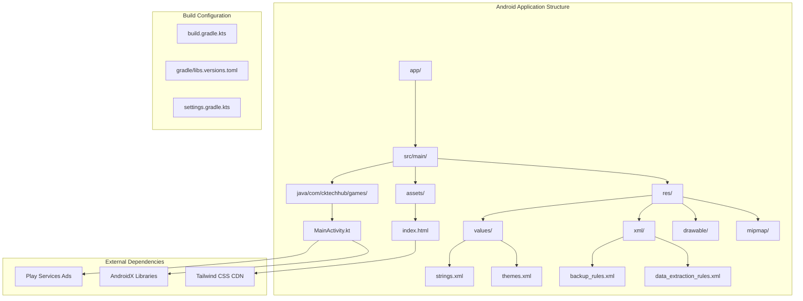
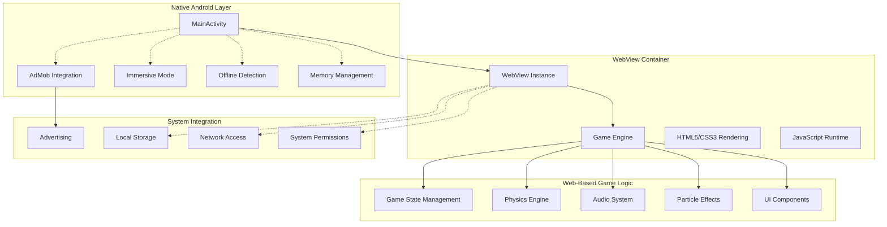
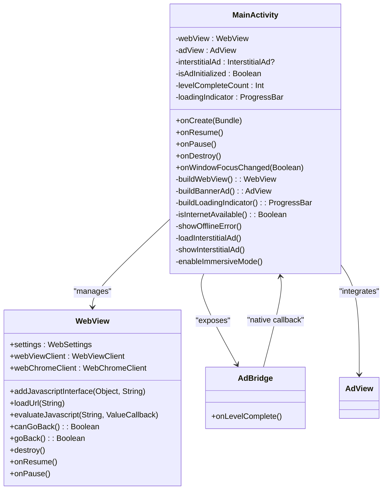
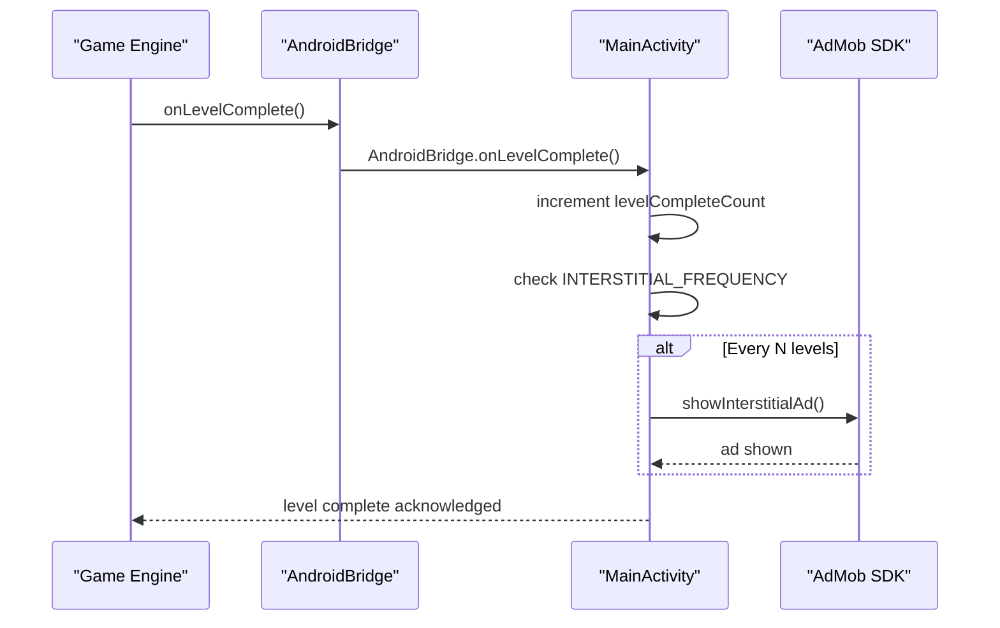
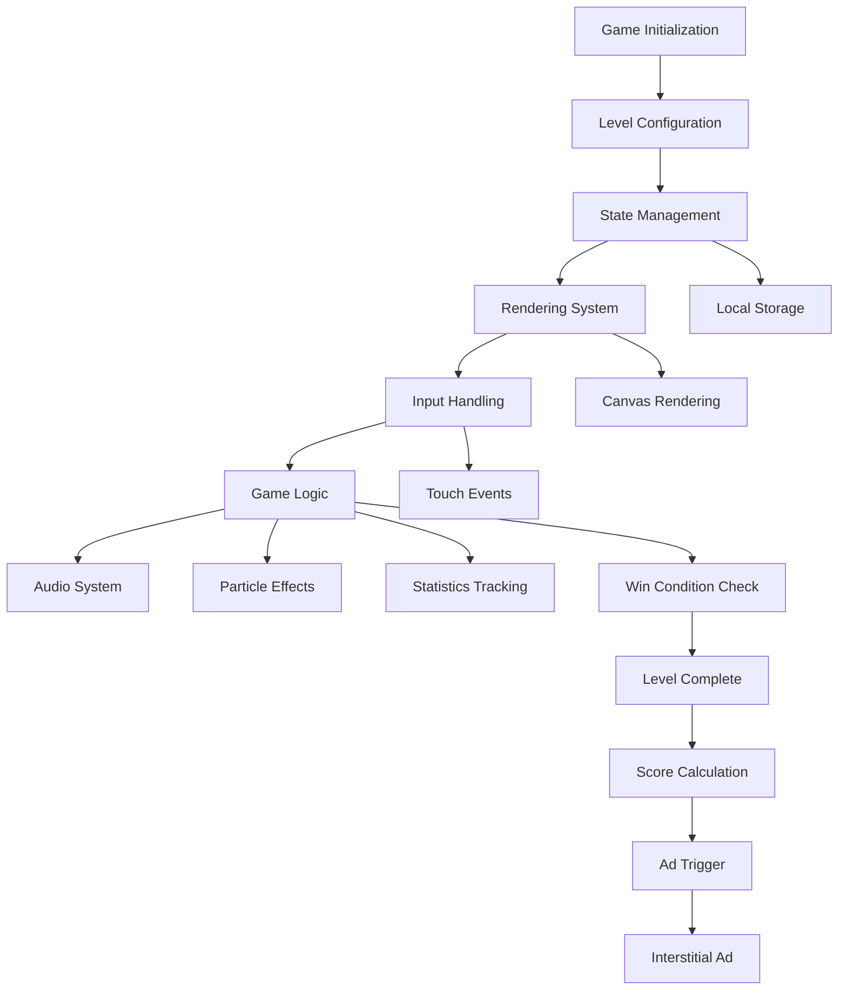
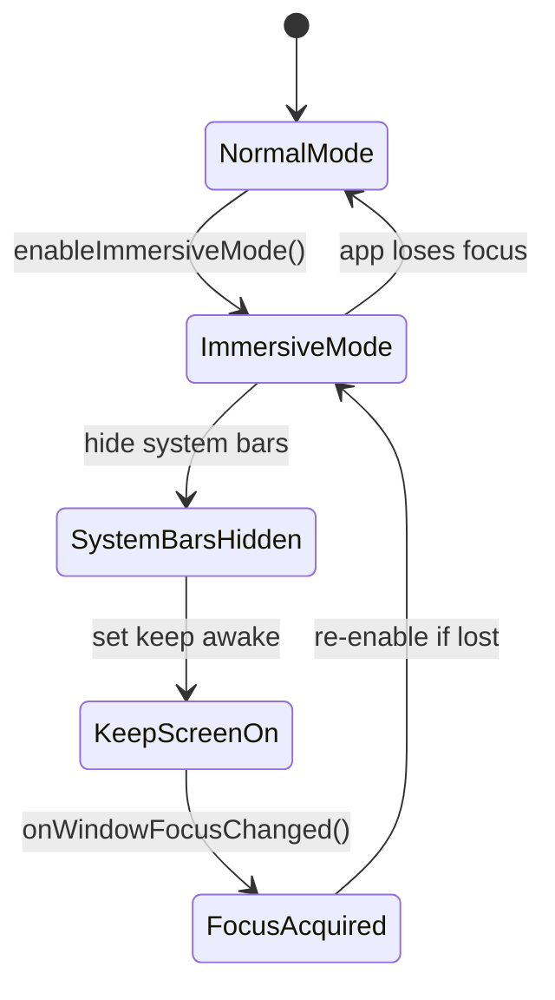
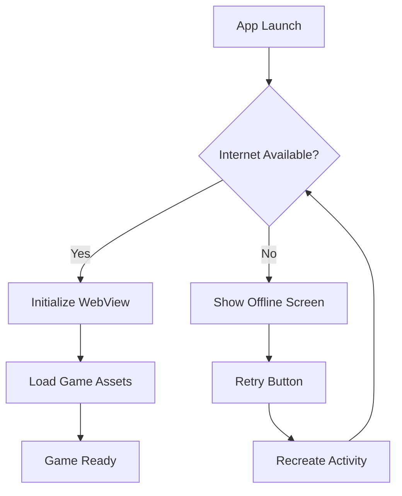
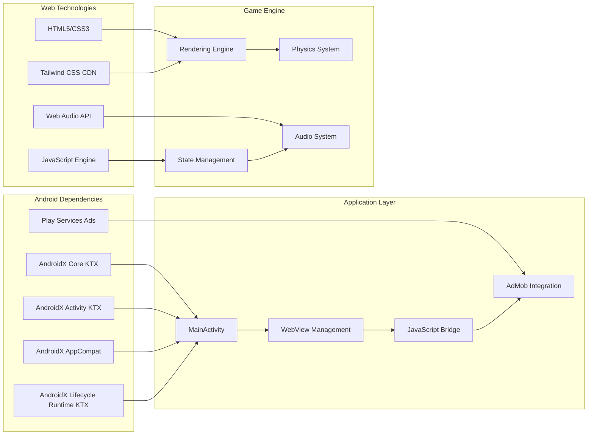

# Hybrid Architecture Overview

<cite>
**Referenced Files in This Document**
- [MainActivity.kt](file://app/src/main/java/com/cktechhub/games/MainActivity.kt)
- [index.html](file://app/src/main/assets/index.html)
- [AndroidManifest.xml](file://app/src/main/AndroidManifest.xml)
- [build.gradle.kts](file://app/build.gradle.kts)
- [strings.xml](file://app/src/main/res/values/strings.xml)
- [themes.xml](file://app/src/main/res/values/themes.xml)
- [libs.versions.toml](file://gradle/libs.versions.toml)
</cite>

## Table of Contents
1. [Introduction](#introduction)
2. [Project Structure](#project-structure)
3. [Core Components](#core-components)
4. [Architecture Overview](#architecture-overview)
5. [Detailed Component Analysis](#detailed-component-analysis)
6. [Dependency Analysis](#dependency-analysis)
7. [Performance Considerations](#performance-considerations)
8. [Troubleshooting Guide](#troubleshooting-guide)
9. [Conclusion](#conclusion)

## Introduction

This document provides a comprehensive overview of the hybrid mobile application architecture that combines native Android components with embedded web technologies. The application implements a WebView pattern where the entire game engine runs within a WebView container, creating a seamless blend of native Android capabilities and web-based game logic.

The architecture follows a clear separation of concerns where the native Android layer (MainActivity) manages the application lifecycle and system integration, while the web-based game logic operates independently within the WebView. This design enables developers to leverage modern web technologies for game development while maintaining native platform capabilities such as advertising integration, system permissions, and device-specific optimizations.

## Project Structure

The project follows a standard Android application structure with a focus on the hybrid architecture pattern:

**Diagram sources**
- [MainActivity.kt:1-441](file://app/src/main/java/com/cktechhub/games/MainActivity.kt#L1-L441)
- [index.html:1-1094](file://app/src/main/assets/index.html#L1-L1094)

**Section sources**
- [MainActivity.kt:1-441](file://app/src/main/java/com/cktechhub/games/MainActivity.kt#L1-L441)
- [AndroidManifest.xml:1-51](file://app/src/main/AndroidManifest.xml#L1-L51)

## Core Components

The hybrid architecture consists of several key components that work together to create a cohesive gaming experience:

### Native Android Layer (MainActivity)

The MainActivity serves as the primary orchestrator for the hybrid architecture, managing the WebView lifecycle and providing native platform integrations. It implements a sophisticated bridge between the native Android environment and the embedded web game.

Key responsibilities include:
- **WebView Management**: Creating, configuring, and controlling the WebView instance
- **Lifecycle Coordination**: Managing WebView lifecycle events during app foreground/background transitions
- **Native Bridge Implementation**: Providing JavaScript interface for bidirectional communication
- **System Integration**: Handling internet connectivity, advertising, and immersive mode
- **Error Recovery**: Implementing crash recovery mechanisms for WebView renderer processes

### WebView Container

The WebView acts as an isolated runtime environment for the complete HTML5/JavaScript game engine. It provides:
- **Complete Game Engine**: Full rendering, physics, and game logic execution
- **Asset Loading**: Access to local HTML, CSS, and JavaScript resources
- **Event Handling**: Touch and gesture processing for mobile gaming
- **Performance Isolation**: Separate process space for game operations

### JavaScript Bridge Interface

The bridge implementation enables seamless communication between native Android and web-based components through the JavaScript interface system.

**Section sources**
- [MainActivity.kt:42-441](file://app/src/main/java/com/cktechhub/games/MainActivity.kt#L42-L441)

## Architecture Overview

The hybrid architecture establishes clear system boundaries between native and web layers while enabling efficient communication:

**Diagram sources**
- [MainActivity.kt:165-263](file://app/src/main/java/com/cktechhub/games/MainActivity.kt#L165-L263)
- [index.html:321-1094](file://app/src/main/assets/index.html#L321-L1094)

The architecture demonstrates a clean separation of concerns where the native layer handles system-level operations while the web layer manages game-specific logic. The JavaScript bridge facilitates controlled communication between these layers.

## Detailed Component Analysis

### MainActivity Architecture

The MainActivity implements a comprehensive hybrid application controller with sophisticated lifecycle management and system integration:

**Diagram sources**
- [MainActivity.kt:42-441](file://app/src/main/java/com/cktechhub/games/MainActivity.kt#L42-L441)

#### WebView Configuration and Security

The WebView implementation demonstrates careful consideration of security and performance:

**Security Measures:**
- **Content Security**: Restricts navigation to local asset files only
- **Mixed Content Control**: Disables mixed content loading
- **JavaScript Interface Protection**: Controlled exposure of native methods
- **Network Access Limitation**: Prevents external resource loading

**Performance Optimizations:**
- **Memory Management**: Proper lifecycle handling for WebView destruction
- **Rendering Optimization**: Configured for optimal game performance
- **Cache Management**: Strategic caching for asset loading

#### JavaScript Bridge Implementation

The bridge system enables bidirectional communication between native and web layers:

**Diagram sources**
- [MainActivity.kt:214-229](file://app/src/main/java/com/cktechhub/games/MainActivity.kt#L214-L229)
- [MainActivity.kt:429-439](file://app/src/main/java/com/cktechhub/games/MainActivity.kt#L429-L439)

The bridge implementation uses the `@JavascriptInterface` annotation to expose native methods to JavaScript, enabling the game engine to trigger native functionality such as advertising integration.

### Game Engine Architecture

The embedded game engine represents a complete HTML5/JavaScript implementation:

**Diagram sources**
- [index.html:321-1094](file://app/src/main/assets/index.html#L321-L1094)

#### Core Game Systems

The game engine implements several sophisticated systems:

**Level Generation System:**
- Dynamic level creation based on configuration arrays
- Randomized ball distribution with collision avoidance
- Progressive difficulty scaling across 15 levels

**Rendering Pipeline:**
- Canvas-based particle system for visual effects
- Responsive layout adaptation to screen sizes
- CSS animations for interactive feedback

**State Management:**
- Comprehensive game state tracking
- Move history for undo functionality
- Persistent storage integration for progress

**Section sources**
- [index.html:321-1094](file://app/src/main/assets/index.html#L321-L1094)

### Cross-Cutting Concerns

The architecture addresses several cross-cutting concerns essential for mobile gaming applications:

#### Immersive Mode Implementation

The application implements full-screen immersive mode to enhance the gaming experience:

**Diagram sources**
- [MainActivity.kt:415-422](file://app/src/main/java/com/cktechhub/games/MainActivity.kt#L415-L422)

#### Offline Detection Mechanism

The application implements robust offline detection to handle network connectivity issues:

**Diagram sources**
- [MainActivity.kt:296-364](file://app/src/main/java/com/cktechhub/games/MainActivity.kt#L296-L364)

#### Crash Recovery and Memory Management

The architecture implements comprehensive crash recovery mechanisms:

**Renderer Process Monitoring:**
- Automatic detection of WebView renderer crashes
- Graceful recovery through WebView recreation
- Memory pressure handling for low-memory conditions

**Resource Management:**
- Proper WebView lifecycle management
- AdView lifecycle coordination
- Memory cleanup during activity destruction

**Section sources**
- [MainActivity.kt:231-245](file://app/src/main/java/com/cktechhub/games/MainActivity.kt#L231-L245)
- [MainActivity.kt:149-154](file://app/src/main/java/com/cktechhub/games/MainActivity.kt#L149-L154)

## Dependency Analysis

The hybrid architecture involves several key dependencies that enable the seamless integration of native and web technologies:

**Diagram sources**
- [build.gradle.kts:34-43](file://app/build.gradle.kts#L34-L43)
- [libs.versions.toml:13-21](file://gradle/libs.versions.toml#L13-L21)

### External Dependencies

The application relies on several external libraries and services:

**AdMob Integration:**
- Play Services Ads for banner and interstitial advertising
- Configurable ad frequency for monetization
- Seamless integration with game completion events

**Web Technology Stack:**
- Tailwind CSS CDN for responsive styling
- Native Web Audio API for sound effects
- Canvas API for particle effects and rendering

**Section sources**
- [build.gradle.kts:34-43](file://app/build.gradle.kts#L34-L43)
- [AndroidManifest.xml:20-28](file://app/src/main/AndroidManifest.xml#L20-L28)

## Performance Considerations

The hybrid architecture incorporates several performance optimization strategies:

### Memory Management

**WebView Lifecycle Optimization:**
- Proper destruction during activity lifecycle
- Resource cleanup to prevent memory leaks
- Renderer process monitoring for crash recovery

**Ad Integration Efficiency:**
- Pre-loading of interstitial ads
- Lazy initialization of advertising components
- Memory-conscious ad view management

### Rendering Performance

**Canvas Optimization:**
- Efficient particle system with lifecycle management
- RequestAnimationFrame for smooth animations
- Responsive layout calculations for various screen sizes

**Asset Loading:**
- Local asset serving for reduced latency
- Strategic caching of static resources
- Progressive loading of game assets

### Network and Connectivity

**Offline Handling:**
- Immediate offline detection and user feedback
- Graceful degradation to offline mode
- Retry mechanism for network restoration

## Troubleshooting Guide

### Common Issues and Solutions

**WebView Crashes:**
- Monitor renderer process for crashes
- Implement automatic recovery through recreation
- Log crash details for debugging

**Ad Integration Problems:**
- Verify AdMob SDK initialization
- Check ad unit ID configuration
- Monitor ad loading callbacks

**Performance Issues:**
- Monitor WebView memory usage
- Optimize particle system for lower-end devices
- Implement frame rate limiting

**Section sources**
- [MainActivity.kt:231-245](file://app/src/main/java/com/cktechhub/games/MainActivity.kt#L231-L245)
- [MainActivity.kt:370-409](file://app/src/main/java/com/cktechhub/games/MainActivity.kt#L370-L409)

## Conclusion

The hybrid mobile application architecture successfully combines native Android capabilities with web-based game development. The WebView pattern implementation provides an elegant solution for embedding a complete HTML5/JavaScript game within an Android application while maintaining clear separation of concerns.

Key architectural strengths include:
- **Clean Separation**: Distinct native and web layers with well-defined boundaries
- **Robust Communication**: Secure JavaScript bridge for controlled native-web interaction
- **Performance Optimization**: Careful resource management and lifecycle handling
- **Cross-Cutting Concerns**: Comprehensive solutions for immersive mode, offline detection, and crash recovery

The architecture demonstrates best practices for hybrid mobile development, enabling developers to leverage modern web technologies for complex game logic while utilizing native platform capabilities for system integration and performance optimization. This approach provides flexibility for future enhancements while maintaining stability and reliability across different Android devices and configurations.