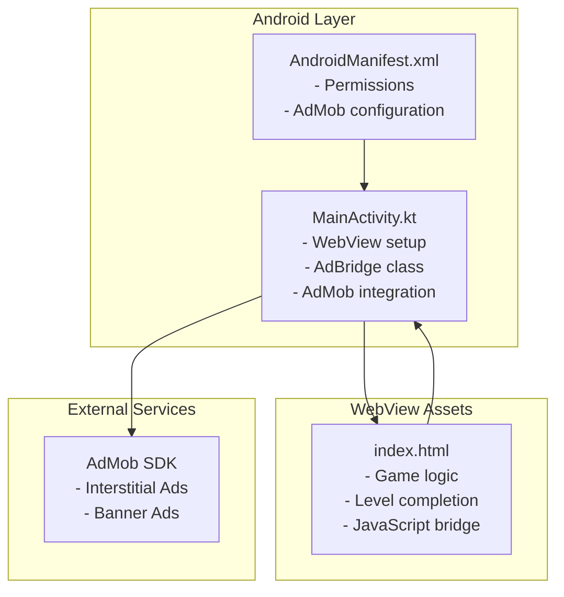
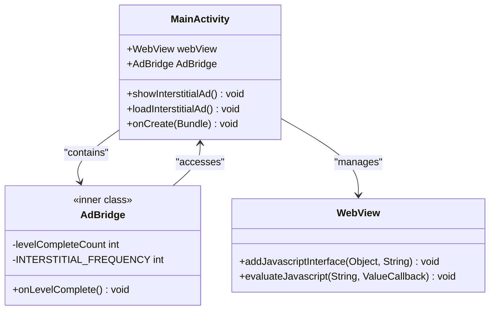
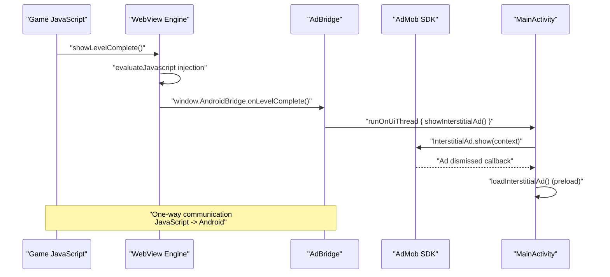
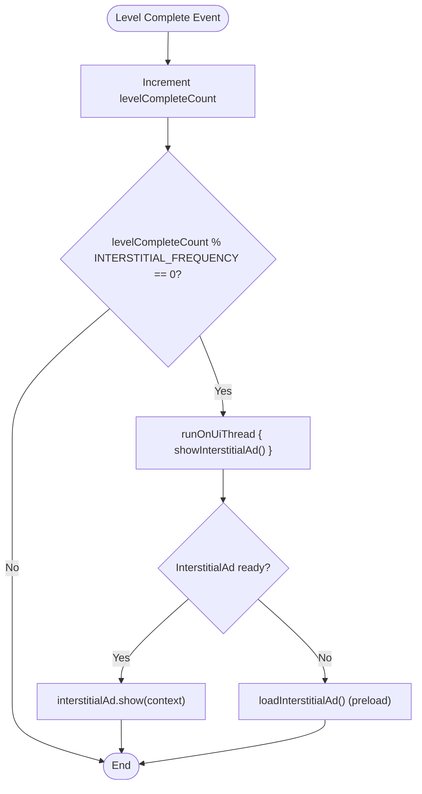

# JavaScript Bridge Implementation

<cite>
**Referenced Files in This Document**
- [MainActivity.kt](file://app/src/main/java/com/cktechhub/games/MainActivity.kt)
- [index.html](file://app/src/main/assets/index.html)
- [AndroidManifest.xml](file://app/src/main/AndroidManifest.xml)
- [ADMOB_SETUP.md](file://ADMOB_SETUP.md)
</cite>

## Table of Contents
1. [Introduction](#introduction)
2. [Project Structure](#project-structure)
3. [Core Components](#core-components)
4. [Architecture Overview](#architecture-overview)
5. [Detailed Component Analysis](#detailed-component-analysis)
6. [Security Considerations](#security-considerations)
7. [Performance Analysis](#performance-analysis)
8. [Extending the Bridge](#extending-the-bridge)
9. [Debugging Guide](#debugging-guide)
10. [Conclusion](#conclusion)

## Introduction

This document provides comprehensive documentation for the JavaScript bridge implementation that enables bidirectional communication between the WebView and Android layer in the Ball Sort Puzzle game. The bridge implementation uses Android's `@JavascriptInterface` annotation to expose native Android functionality to JavaScript running in the WebView, specifically enabling level completion notifications, interstitial ad triggering, and game state synchronization.

The bridge architecture consists of two primary components: the Android-side `AdBridge` class that exposes native methods to JavaScript, and the JavaScript injection mechanism that intercepts game events to trigger Android callbacks. This implementation demonstrates secure and efficient communication patterns between native and web technologies.

## Project Structure

The JavaScript bridge implementation is primarily located in the Android application layer with supporting assets in the WebView:



**Diagram sources**
- [MainActivity.kt:165-263](file://app/src/main/java/com/cktechhub/games/MainActivity.kt#L165-L263)
- [index.html:1-50](file://app/src/main/assets/index.html#L1-L50)

**Section sources**
- [MainActivity.kt:1-135](file://app/src/main/java/com/cktechhub/games/MainActivity.kt#L1-L135)
- [AndroidManifest.xml:1-51](file://app/src/main/AndroidManifest.xml#L1-L51)

## Core Components

### AdBridge Class Implementation

The `AdBridge` class serves as the primary interface between JavaScript and Android, exposing native functionality through the `@JavascriptInterface` annotation. This inner class is designed with security and performance considerations in mind.



**Diagram sources**
- [MainActivity.kt:428-439](file://app/src/main/java/com/cktechhub/games/MainActivity.kt#L428-L439)
- [MainActivity.kt:165-263](file://app/src/main/java/com/cktechhub/games/MainActivity.kt#L165-L263)

### JavaScript Injection Mechanism

The bridge implements a sophisticated JavaScript injection system that intercepts game events without requiring modifications to the core game logic. The injection occurs during the WebView's `onPageFinished` lifecycle event.

**Section sources**
- [MainActivity.kt:428-439](file://app/src/main/java/com/cktechhub/games/MainActivity.kt#L428-L439)
- [MainActivity.kt:214-228](file://app/src/main/java/com/cktechhub/games/MainActivity.kt#L214-L228)

## Architecture Overview

The JavaScript bridge follows a unidirectional communication pattern where JavaScript triggers Android callbacks, while Android can only communicate back to JavaScript through pre-injected methods.



**Diagram sources**
- [MainActivity.kt:214-228](file://app/src/main/java/com/cktechhub/games/MainActivity.kt#L214-L228)
- [MainActivity.kt:402-409](file://app/src/main/java/com/cktechhub/games/MainActivity.kt#L402-L409)
- [MainActivity.kt:428-439](file://app/src/main/java/com/cktechhub/games/MainActivity.kt#L428-L439)

## Detailed Component Analysis

### AdBridge Class Implementation

The `AdBridge` class implements the core bridge functionality with careful consideration for thread safety and performance:

#### Method Exposure and Security

The bridge exposes only the `onLevelComplete()` method through the `@JavascriptInterface` annotation, ensuring minimal surface area for security vulnerabilities. The method is marked as `@Suppress("unused")` to prevent compiler warnings while maintaining clean code structure.

#### Level Completion Tracking

The bridge maintains an internal counter (`levelCompleteCount`) to track game progress and determine when to trigger interstitial advertisements. This counter is incremented each time a level is completed and used to calculate the frequency of ad displays.

#### Interstitial Ad Integration

The bridge integrates seamlessly with the AdMob SDK to display interstitial advertisements at predetermined intervals. The implementation uses `runOnUiThread` to ensure thread-safe UI operations and includes automatic ad preloading for optimal user experience.



**Diagram sources**
- [MainActivity.kt:428-439](file://app/src/main/java/com/cktechhub/games/MainActivity.kt#L428-L439)
- [MainActivity.kt:402-409](file://app/src/main/java/com/cktechhub/games/MainActivity.kt#L402-L409)

**Section sources**
- [MainActivity.kt:428-439](file://app/src/main/java/com/cktechhub/games/MainActivity.kt#L428-L439)
- [MainActivity.kt:402-409](file://app/src/main/java/com/cktechhub/games/MainActivity.kt#L402-L409)

### JavaScript Injection Implementation

The JavaScript injection mechanism provides a clean separation between game logic and bridge functionality:

#### Injection Timing and Safety

The injection occurs in the `onPageFinished` callback of the WebViewClient, ensuring that the page has fully loaded before attempting to modify JavaScript behavior. This timing prevents race conditions and ensures reliable method interception.

#### Method Interception Pattern

The injection uses a wrapper pattern that preserves the original `showLevelComplete` function while adding bridge notification functionality:

```javascript
(function() {
    var orig = window.showLevelComplete;
    window.showLevelComplete = function() {
        if (orig) orig.apply(this, arguments);
        if (window.AndroidBridge) {
            window.AndroidBridge.onLevelComplete();
        }
    };
})();
```

This pattern ensures that:
- Original functionality is preserved
- Bridge calls are only made when the Android interface is available
- No modifications are required to the core game logic

**Section sources**
- [MainActivity.kt:214-228](file://app/src/main/java/com/cktechhub/games/MainActivity.kt#L214-L228)
- [index.html:852-881](file://app/src/main/assets/index.html#L852-L881)

### WebView Configuration and Security

The WebView is configured with multiple security measures to protect against malicious JavaScript attempts:

#### Content Security Measures

- **Local Asset Restriction**: Only allows loading from `file:///android_asset/` URLs
- **Mixed Content Blocking**: Prevents loading of insecure resources
- **JavaScript Interface Naming**: Uses a specific interface name (`AndroidBridge`) for clear identification
- **Console Logging**: Captures and logs JavaScript console messages for debugging

#### Performance Optimizations

- **DOM Storage Enabled**: Supports localStorage for game state persistence
- **Cache Mode**: Configured for optimal performance with `LOAD_DEFAULT`
- **Hardware Acceleration**: Leverages WebView's hardware acceleration capabilities

**Section sources**
- [MainActivity.kt:165-263](file://app/src/main/java/com/cktechhub/games/MainActivity.kt#L165-L263)

## Security Considerations

### JavaScript Interface Security

The bridge implementation employs several security measures to prevent unauthorized access to native functionality:

#### Interface Visibility Control

The `@JavascriptInterface` annotation makes methods visible to JavaScript, but the bridge limits exposure to only essential methods. This minimizes the attack surface while maintaining functionality.

#### Method Parameter Validation

While the current implementation doesn't validate parameters, the design allows for easy addition of parameter validation in future extensions. Methods should validate input parameters and handle invalid data gracefully.

#### Cross-Site Scripting Prevention

The WebView configuration includes multiple protections against XSS attacks:
- Mixed content blocking prevents loading insecure resources
- URL restriction prevents navigation to external sites
- Console logging helps detect suspicious activity

### Potential Attack Vectors

#### Method Hijacking

Attackers could attempt to call bridge methods directly through injected scripts. The current implementation mitigates this risk by:
- Using a specific interface name that isn't commonly used
- Limiting exposed methods to essential functionality
- Implementing proper error handling

#### Memory and Resource Management

Long-running games could potentially exhaust WebView resources through excessive bridge calls. The implementation includes:
- Automatic resource cleanup in lifecycle methods
- Proper ad resource management
- Thread-safe UI operations

**Section sources**
- [MainActivity.kt:191-207](file://app/src/main/java/com/cktechhub/games/MainActivity.kt#L191-L207)
- [MainActivity.kt:428-439](file://app/src/main/java/com/cktechhub/games/MainActivity.kt#L428-L439)

## Performance Analysis

### Bridge Call Performance

The bridge implementation is designed for minimal performance impact:

#### Asynchronous Communication

Bridge calls are processed asynchronously through the WebView's JavaScript engine, preventing UI thread blocking. The `evaluateJavascript` method executes immediately when the page is ready, ensuring responsive user experience.

#### Threading Considerations

The bridge uses `runOnUiThread` for UI operations, ensuring thread safety while maintaining responsiveness. This approach prevents potential crashes from cross-thread UI modifications.

#### Memory Management

The implementation includes proper resource cleanup:
- WebView destruction in `onDestroy`
- Ad resource cleanup
- Reference management to prevent memory leaks

### Ad Loading Optimization

The bridge includes intelligent ad loading strategies:
- **Pre-loading**: Interstitial ads are pre-loaded to reduce latency
- **Automatic Reloading**: Failed ad loads trigger immediate reattempts
- **Resource Recycling**: Ad resources are properly managed and recycled

**Section sources**
- [MainActivity.kt:402-409](file://app/src/main/java/com/cktechhub/games/MainActivity.kt#L402-L409)
- [MainActivity.kt:149-154](file://app/src/main/java/com/cktechhub/games/MainActivity.kt#L149-L154)

## Extending the Bridge

### Adding New Native Methods

To extend the bridge with additional native functionality, follow these steps:

#### Method Definition

Add new methods to the `AdBridge` class with the `@JavascriptInterface` annotation:

```kotlin
@JavascriptInterface
fun onGameStateChanged(newState: String) {
    // Handle game state changes
    Log.d(TAG, "Game state changed: $newState")
}
```

#### JavaScript Exposure

Expose the new method through JavaScript injection:

```javascript
// In the evaluateJavascript injection
if (window.AndroidBridge) {
    window.AndroidBridge.onGameStateChanged(newState);
}
```

#### Parameter Validation

Implement proper parameter validation and error handling:

```kotlin
@JavascriptInterface
fun onScoreUpdated(score: Int) {
    if (score >= 0) {
        // Process valid score updates
    } else {
        Log.w(TAG, "Invalid score received: $score")
    }
}
```

### Advanced Extension Patterns

#### Callback Mechanisms

For complex operations requiring asynchronous responses, implement callback patterns:

```kotlin
@JavascriptInterface
fun requestUserData(callbackId: String) {
    // Process request asynchronously
    val userData = getUserData()
    // Send response back to JavaScript
    webView.post {
        webView.evaluateJavascript(
            "window.handleUserDataResponse('$callbackId', ${userData.toJson()})",
            null
        )
    }
}
```

#### Data Synchronization

Implement bidirectional data synchronization for complex game states:

```kotlin
@JavascriptInterface
fun syncGameState(gameState: String) {
    // Parse JSON gameState
    // Update local state
    // Optionally send back synchronized data
}
```

**Section sources**
- [MainActivity.kt:428-439](file://app/src/main/java/com/cktechhub/games/MainActivity.kt#L428-L439)
- [MainActivity.kt:214-228](file://app/src/main/java/com/cktechhub/games/MainActivity.kt#L214-L228)

## Debugging Guide

### Common Issues and Solutions

#### Bridge Method Not Found

**Problem**: JavaScript cannot find the `AndroidBridge` interface
**Solution**: Verify WebView configuration and injection timing

```kotlin
// Check if interface is properly added
Log.d(TAG, "JavaScript interface added: ${webView.addJavascriptInterface != null}")

// Verify injection executed
webView.evaluateJavascript("typeof window.AndroidBridge", { result ->
    Log.d(TAG, "AndroidBridge availability: $result")
})
```

#### Method Not Called

**Problem**: `onLevelComplete` method not triggered
**Solution**: Check JavaScript injection and method signature

```kotlin
// Add logging to verify injection
webView.evaluateJavascript(
    "(function(){var orig=window.showLevelComplete;window.showLevelComplete=function(){console.log('Intercepted');if(orig)orig.apply(this,arguments);if(window.AndroidBridge){console.log('Calling AndroidBridge');window.AndroidBridge.onLevelComplete();}};})()",
    null
)
```

#### Ad Loading Failures

**Problem**: Interstitial ads not displaying
**Solution**: Monitor ad loading callbacks and implement retry logic

```kotlin
// Enhanced ad loading with better error handling
object : InterstitialAdLoadCallback() {
    override fun onAdLoaded(ad: InterstitialAd) {
        interstitialAd = ad
        Log.d(TAG, "Interstitial ad loaded successfully")
    }
    
    override fun onAdFailedToLoad(adError: LoadAdError) {
        Log.e(TAG, "Interstitial ad failed to load: ${adError.message}")
        // Retry after delay
        Handler(Looper.getMainLooper()).postDelayed({ loadInterstitialAd() }, 5000)
    }
}
```

### Performance Monitoring

#### Bridge Call Timing

Monitor bridge call performance to identify bottlenecks:

```kotlin
@JavascriptInterface
fun onLevelComplete() {
    val startTime = System.currentTimeMillis()
    // Process completion
    val endTime = System.currentTimeMillis()
    Log.d(TAG, "Bridge call took ${endTime - startTime}ms")
}
```

#### Memory Usage Tracking

Monitor memory usage during extended gameplay:

```kotlin
override fun onDestroy() {
    Log.d(TAG, "WebView memory usage: ${getMemoryUsage()}")
    super.onDestroy()
}
```

**Section sources**
- [MainActivity.kt:214-228](file://app/src/main/java/com/cktechhub/games/MainActivity.kt#L214-L228)
- [MainActivity.kt:370-400](file://app/src/main/java/com/cktechhub/games/MainActivity.kt#L370-L400)

## Conclusion

The JavaScript bridge implementation in the Ball Sort Puzzle game demonstrates a robust and secure approach to WebView-to-Android communication. The design successfully balances functionality, security, and performance while maintaining clean separation between game logic and native integration.

Key achievements of this implementation include:

- **Secure Interface Design**: Minimal method exposure with proper security measures
- **Efficient Communication**: Asynchronous bridge calls with proper threading
- **Robust Error Handling**: Comprehensive error handling and recovery mechanisms
- **Performance Optimization**: Intelligent ad loading and resource management
- **Extensible Architecture**: Clean patterns for future bridge method additions

The bridge architecture provides a solid foundation for extending native functionality while maintaining the integrity and security of the WebView environment. Future enhancements can leverage the established patterns to add more sophisticated native features without compromising the user experience or security posture.