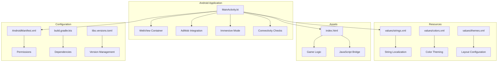
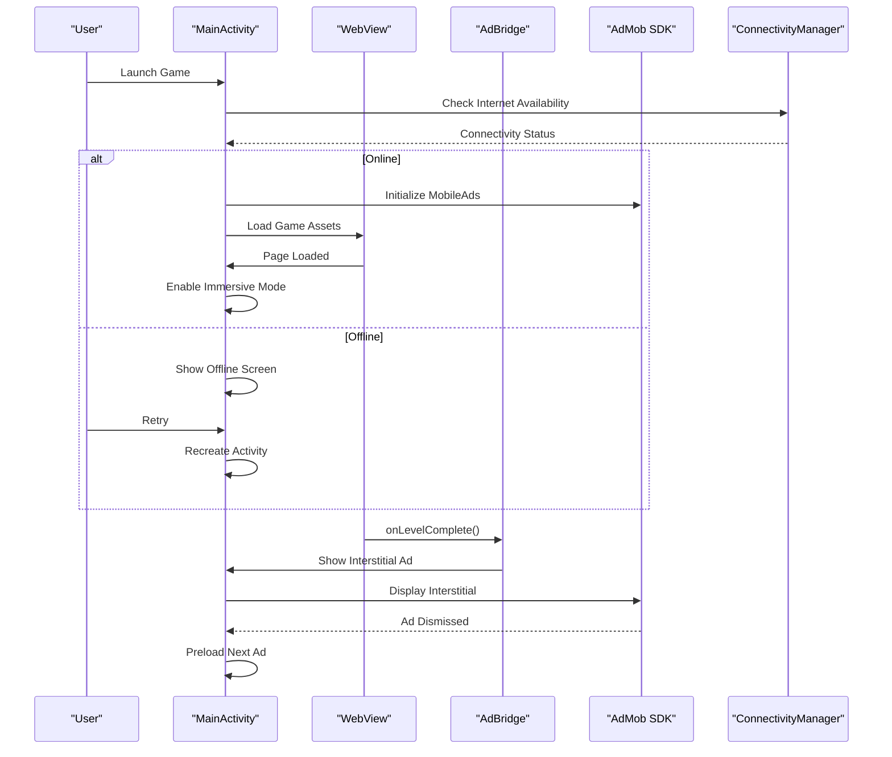
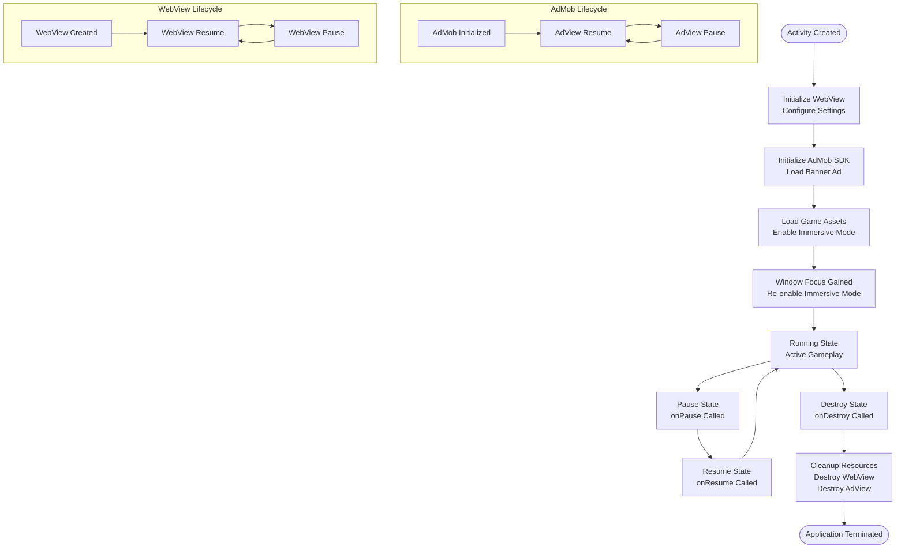
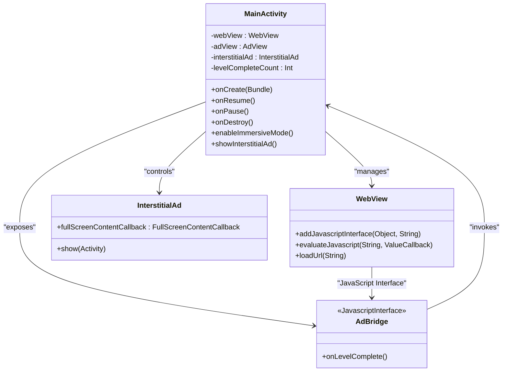
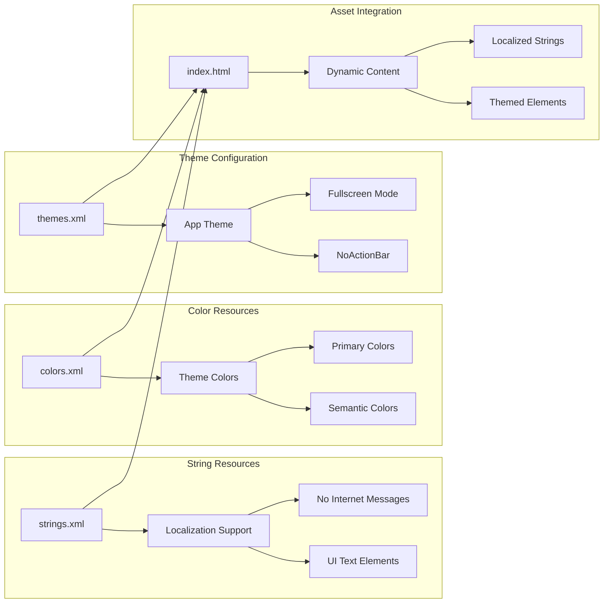
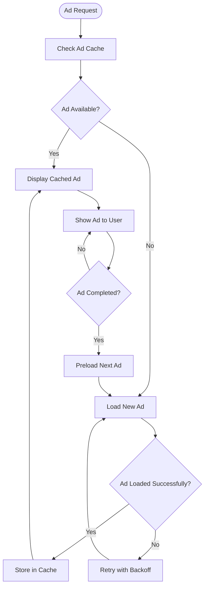
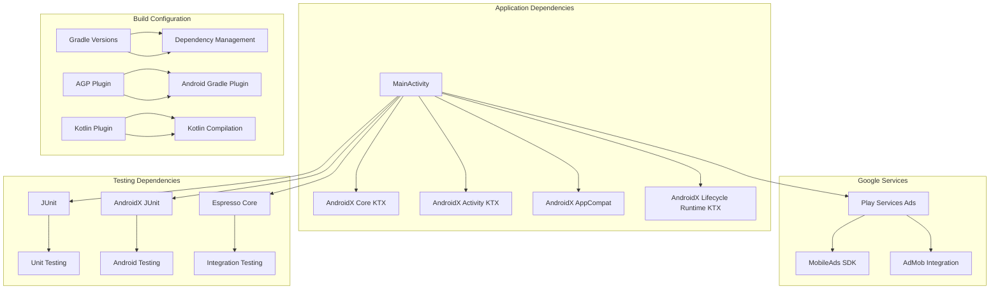

# Native Integration Patterns

<cite>
**Referenced Files in This Document**
- [MainActivity.kt](file://app/src/main/java/com/cktechhub/games/MainActivity.kt)
- [AndroidManifest.xml](file://app/src/main/AndroidManifest.xml)
- [ADMOB_SETUP.md](file://ADMOB_SETUP.md)
- [strings.xml](file://app/src/main/res/values/strings.xml)
- [colors.xml](file://app/src/main/res/values/colors.xml)
- [themes.xml](file://app/src/main/res/values/themes.xml)
- [index.html](file://app/src/main/assets/index.html)
- [build.gradle.kts](file://app/build.gradle.kts)
- [libs.versions.toml](file://gradle/libs.versions.toml)
- [backup_rules.xml](file://app/src/main/res/xml/backup_rules.xml)
- [data_extraction_rules.xml](file://app/src/main/res/xml/data_extraction_rules.xml)
</cite>

## Table of Contents
1. [Introduction](#introduction)
2. [Project Structure](#project-structure)
3. [Core Components](#core-components)
4. [Architecture Overview](#architecture-overview)
5. [Detailed Component Analysis](#detailed-component-analysis)
6. [Dependency Analysis](#dependency-analysis)
7. [Performance Considerations](#performance-considerations)
8. [Troubleshooting Guide](#troubleshooting-guide)
9. [Conclusion](#conclusion)

## Introduction

This document provides comprehensive coverage of native integration patterns implemented in the Android gaming application. The project demonstrates sophisticated native-to-web integration using WebView, monetization through Google AdMob SDK, immersive full-screen gaming experiences, and robust offline detection mechanisms. The implementation showcases modern Android development patterns including lifecycle management, resource management, threading considerations, and architectural patterns such as Observer, Factory, and Singleton.

The application serves as a hybrid HTML5/CSS3/JavaScript game wrapped in an Android native shell, with seamless integration between the web content and native Android components. This architecture enables rich interactive gameplay while leveraging native capabilities for advertising, system integration, and user experience optimization.

## Project Structure

The project follows a standard Android application structure with specialized components for native integration:

**Diagram sources**
- [MainActivity.kt:1-441](file://app/src/main/java/com/cktechhub/games/MainActivity.kt#L1-L441)
- [AndroidManifest.xml:1-51](file://app/src/main/AndroidManifest.xml#L1-L51)

The structure demonstrates a clean separation of concerns with native Android components managing system integration while the game logic remains in the web assets. This hybrid approach optimizes development flexibility while maintaining native performance characteristics.

**Section sources**
- [MainActivity.kt:1-441](file://app/src/main/java/com/cktechhub/games/MainActivity.kt#L1-L441)
- [AndroidManifest.xml:1-51](file://app/src/main/AndroidManifest.xml#L1-L51)

## Core Components

### WebView Integration Layer

The application implements a sophisticated WebView integration that bridges native Android functionality with web-based game logic. The WebView is configured with extensive security and performance optimizations:

- **Security Configuration**: JavaScript enabled only for essential operations, DOM storage enabled for game persistence, file access restrictions, and mixed content policy enforcement
- **Performance Optimization**: Cache mode set to default, zoom controls disabled, and scroll bars configured for optimal gaming experience
- **Navigation Control**: Custom WebViewClient that restricts navigation to local assets only, preventing external link access
- **Bridge Implementation**: JavaScriptInterface exposes native functionality to JavaScript through the AndroidBridge object

### AdMob Monetization System

The application integrates Google AdMob for both banner and interstitial advertising with comprehensive lifecycle management:

- **Initialization**: MobileAds SDK initialized during activity creation with callback-based initialization
- **Banner Advertising**: Bottom-aligned banner ad with responsive sizing and automatic refresh
- **Interstitial Implementation**: Preloaded interstitial ads with automatic re-loading and failure handling
- **Frequency Control**: Configurable ad frequency based on level completion metrics

### Immersive Gaming Experience

Full-screen gaming mode achieved through advanced window management and system integration:

- **System Bar Control**: Automatic hiding of system bars with swipe-to-reveal behavior
- **Keep Screen On**: Prevents screen dimming during gameplay
- **Safe Area Awareness**: Respects device-specific safe areas for modern displays
- **Focus Management**: Dynamic adjustment of immersive mode based on window focus changes

### Offline Detection and Recovery

Robust offline capability detection with graceful degradation:

- **Network Capability Checking**: Comprehensive network validation including internet connectivity and validation status
- **Graceful Degradation**: Dedicated offline screen with retry mechanism
- **Resource Management**: Proper cleanup and recreation of components during offline scenarios

**Section sources**
- [MainActivity.kt:165-263](file://app/src/main/java/com/cktechhub/games/MainActivity.kt#L165-L263)
- [MainActivity.kt:265-278](file://app/src/main/java/com/cktechhub/games/MainActivity.kt#L265-L278)
- [MainActivity.kt:296-302](file://app/src/main/java/com/cktechhub/games/MainActivity.kt#L296-L302)
- [MainActivity.kt:415-422](file://app/src/main/java/com/cktechhub/games/MainActivity.kt#L415-L422)

## Architecture Overview

The application employs a hybrid architecture that seamlessly integrates native Android components with web-based game logic:

**Diagram sources**
- [MainActivity.kt:67-135](file://app/src/main/java/com/cktechhub/games/MainActivity.kt#L67-L135)
- [MainActivity.kt:429-439](file://app/src/main/java/com/cktechhub/games/MainActivity.kt#L429-L439)

The architecture demonstrates clear separation between presentation (WebView), business logic (JavaScript game), and system integration (native Android components). This design enables independent development and testing of each layer while maintaining tight integration for optimal user experience.

**Section sources**
- [MainActivity.kt:42-154](file://app/src/main/java/com/cktechhub/games/MainActivity.kt#L42-L154)

## Detailed Component Analysis

### Lifecycle Management Implementation

The application implements comprehensive lifecycle management for both WebView and AdMob components:

**Diagram sources**
- [MainActivity.kt:137-154](file://app/src/main/java/com/cktechhub/games/MainActivity.kt#L137-L154)

The lifecycle management ensures proper resource allocation and deallocation, preventing memory leaks and maintaining optimal performance throughout the application lifecycle.

**Section sources**
- [MainActivity.kt:137-154](file://app/src/main/java/com/cktechhub/games/MainActivity.kt#L137-L154)

### JavaScript Bridge Implementation

The JavaScript bridge enables seamless communication between the web-based game and native Android components:

**Diagram sources**
- [MainActivity.kt:429-439](file://app/src/main/java/com/cktechhub/games/MainActivity.kt#L429-L439)
- [MainActivity.kt:165-263](file://app/src/main/java/com/cktechhub/games/MainActivity.kt#L165-L263)

The bridge pattern implementation allows the JavaScript game to trigger native Android functionality through the `onLevelComplete()` method, enabling contextual advertising based on game state.

**Section sources**
- [MainActivity.kt:429-439](file://app/src/main/java/com/cktechhub/games/MainActivity.kt#L429-L439)

### Resource Management System

The application implements comprehensive resource management for strings, colors, and themes:

**Diagram sources**
- [strings.xml:1-6](file://app/src/main/res/values/strings.xml#L1-L6)
- [colors.xml:1-10](file://app/src/main/res/values/colors.xml#L1-L10)
- [themes.xml:1-10](file://app/src/main/res/values/themes.xml#L1-L10)

The resource management system ensures consistent theming across the application while supporting localization and dynamic content adaptation.

**Section sources**
- [strings.xml:1-6](file://app/src/main/res/values/strings.xml#L1-L6)
- [colors.xml:1-10](file://app/src/main/res/values/colors.xml#L1-L10)
- [themes.xml:1-10](file://app/src/main/res/values/themes.xml#L1-L10)

### AdMob Integration Patterns

The application implements multiple advertising strategies with sophisticated loading and display management:

**Diagram sources**
- [MainActivity.kt:370-409](file://app/src/main/java/com/cktechhub/games/MainActivity.kt#L370-L409)

The factory pattern implementation for ad loading ensures efficient resource utilization and provides fallback mechanisms for ad availability.

**Section sources**
- [MainActivity.kt:370-409](file://app/src/main/java/com/cktechhub/games/MainActivity.kt#L370-L409)

## Dependency Analysis

The application's dependency structure reflects modern Android development practices with clear separation of concerns:

**Diagram sources**
- [build.gradle.kts:34-43](file://app/build.gradle.kts#L34-L43)
- [libs.versions.toml:13-21](file://gradle/libs.versions.toml#L13-L21)

The dependency graph reveals a well-structured architecture with clear boundaries between application logic, system services, and testing infrastructure.

**Section sources**
- [build.gradle.kts:34-43](file://app/build.gradle.kts#L34-L43)
- [libs.versions.toml:13-21](file://gradle/libs.versions.toml#L13-L21)

## Performance Considerations

### Memory Management and Resource Optimization

The application implements several strategies for optimal memory usage and performance:

- **WebView Lifecycle**: Proper destruction and recreation of WebView instances to prevent memory leaks
- **Ad Resource Management**: Efficient caching and preloading of advertisements with automatic cleanup
- **Thread Safety**: Proper use of runOnUiThread for UI updates from JavaScript callbacks
- **Background Processing**: Asynchronous ad loading and network operations to maintain UI responsiveness

### Rendering and Animation Performance

The hybrid architecture requires careful consideration of rendering performance:

- **Canvas Optimization**: Efficient particle system implementation with requestAnimationFrame
- **CSS Transitions**: Hardware-accelerated animations for smooth user interactions
- **Memory Management**: Proper cleanup of event listeners and timers in JavaScript code

### Network and Connectivity Optimization

The offline-first approach requires robust network handling:

- **Connection Validation**: Comprehensive network capability checking before attempting ad loading
- **Graceful Degradation**: Alternative UI when network connectivity is unavailable
- **Retry Mechanisms**: Intelligent retry logic for failed network operations

## Troubleshooting Guide

### Common Issues and Solutions

**AdMob Integration Problems**
- **Test IDs Still Active**: Ensure production AdMob IDs are properly configured before release
- **Ad Not Loading**: Verify network connectivity and check AdMob console for ad unit status
- **Initialization Failures**: Confirm MobileAds SDK initialization completes successfully

**WebView Issues**
- **JavaScript Bridge Not Working**: Verify JavaScriptInterface annotation and proper method signatures
- **Asset Loading Failures**: Check file paths and ensure assets are properly packaged
- **Memory Crashes**: Monitor WebView memory usage and implement proper cleanup

**Immersive Mode Problems**
- **System Bars Not Hidden**: Verify WindowInsetsControllerCompat usage and system bar permissions
- **Focus Loss Issues**: Implement proper focus change handling for immersive mode restoration

**Section sources**
- [ADMOB_SETUP.md:1-104](file://ADMOB_SETUP.md#L1-L104)
- [MainActivity.kt:296-302](file://app/src/main/java/com/cktechhub/games/MainActivity.kt#L296-L302)

## Conclusion

The native integration patterns demonstrated in this application showcase a sophisticated approach to hybrid mobile development. The implementation successfully bridges native Android capabilities with web-based game logic while maintaining optimal performance and user experience.

Key architectural strengths include:

- **Robust Lifecycle Management**: Comprehensive handling of WebView and AdMob component lifecycles
- **Flexible Resource Management**: Localized strings, themed colors, and responsive layouts
- **Sophisticated Advertising Integration**: Multi-ad strategy with intelligent loading and caching
- **Immersive User Experience**: Full-screen gaming mode with system integration
- **Offline Resilience**: Graceful degradation and recovery mechanisms

The codebase serves as an excellent example of modern Android development practices, demonstrating how native and web technologies can be effectively combined to create engaging mobile applications. The implementation provides a solid foundation for similar hybrid applications requiring native system integration and monetization capabilities.