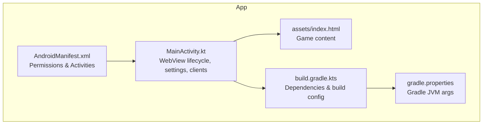
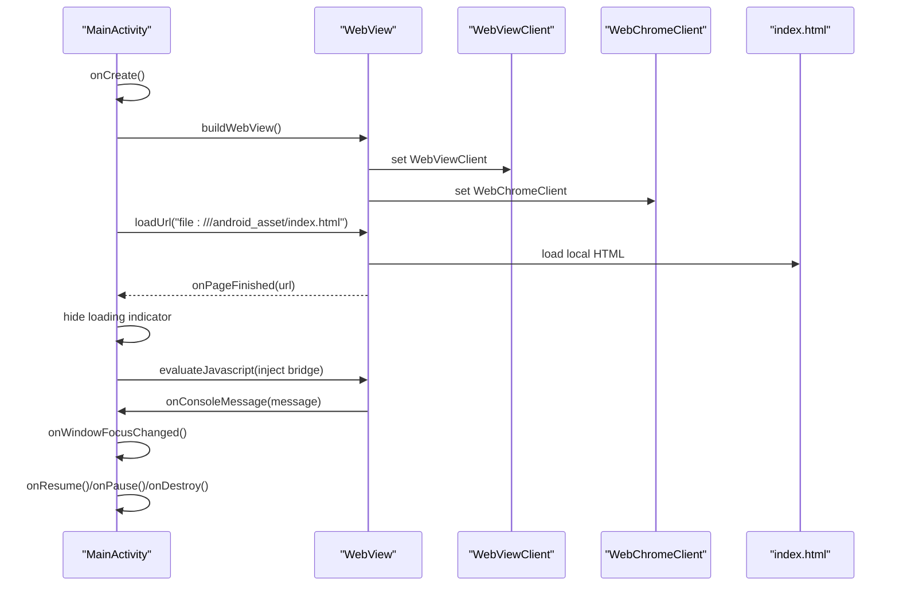
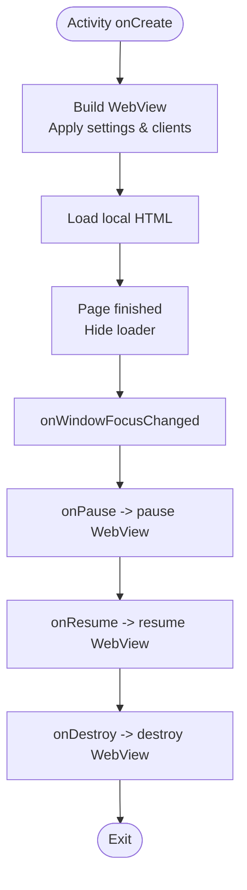
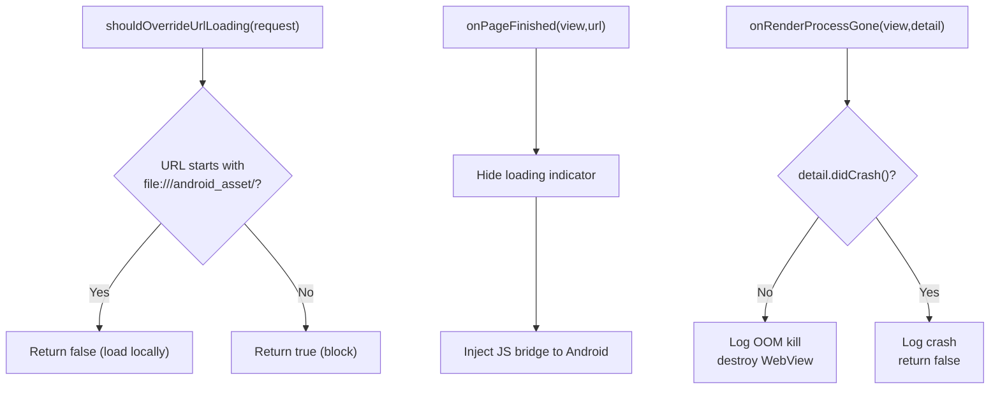
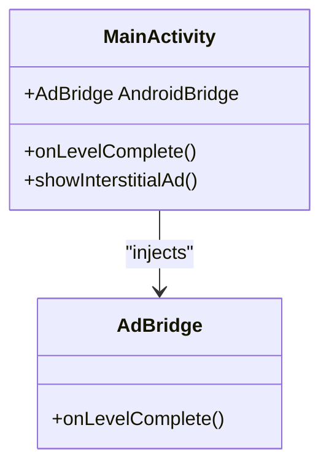
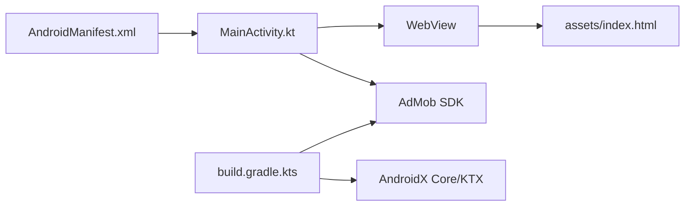

# WebView Management & Configuration

<cite>
**Referenced Files in This Document**
- [MainActivity.kt](file://app/src/main/java/com/cktechhub/games/MainActivity.kt)
- [AndroidManifest.xml](file://app/src/main/AndroidManifest.xml)
- [index.html](file://app/src/main/assets/index.html)
- [build.gradle.kts](file://app/build.gradle.kts)
- [gradle.properties](file://gradle.properties)
</cite>

## Table of Contents
1. [Introduction](#introduction)
2. [Project Structure](#project-structure)
3. [Core Components](#core-components)
4. [Architecture Overview](#architecture-overview)
5. [Detailed Component Analysis](#detailed-component-analysis)
6. [Dependency Analysis](#dependency-analysis)
7. [Performance Considerations](#performance-considerations)
8. [Troubleshooting Guide](#troubleshooting-guide)
9. [Conclusion](#conclusion)

## Introduction
This document explains WebView management and configuration within the MainActivity, focusing on lifecycle management, settings configuration, client-side handlers, render process safety, performance, security, and state management patterns. It synthesizes the actual implementation present in the repository to provide actionable guidance for developers maintaining or extending the WebView integration.

## Project Structure
The WebView integration is centered in the MainActivity, with the game content served from an HTML asset. Supporting infrastructure includes Android permissions, AdMob integration, and basic UI scaffolding.

**Diagram sources**
- [AndroidManifest.xml:1-51](file://app/src/main/AndroidManifest.xml#L1-L51)
- [MainActivity.kt:42-135](file://app/src/main/java/com/cktechhub/games/MainActivity.kt#L42-L135)
- [index.html:1-1094](file://app/src/main/assets/index.html#L1-L1094)
- [build.gradle.kts:1-43](file://app/build.gradle.kts#L1-L43)
- [gradle.properties:1-23](file://gradle.properties#L1-L23)

**Section sources**
- [AndroidManifest.xml:1-51](file://app/src/main/AndroidManifest.xml#L1-L51)
- [MainActivity.kt:42-135](file://app/src/main/java/com/cktechhub/games/MainActivity.kt#L42-L135)
- [index.html:1-1094](file://app/src/main/assets/index.html#L1-L1094)
- [build.gradle.kts:1-43](file://app/build.gradle.kts#L1-L43)
- [gradle.properties:1-23](file://gradle.properties#L1-L23)

## Core Components
- WebView lifecycle: creation, resume/pause, and destruction in activity lifecycle callbacks.
- WebView settings: JavaScript enablement, DOM storage, file/content access, mixed content policy, zoom controls, caching, and layout behavior.
- WebViewClient: safe navigation restricting URLs to local assets and handling page load completion and renderer process gone scenarios.
- WebChromeClient: console logging for debugging.
- JavaScript interface bridge: AndroidBridge enabling communication from WebView to Android.
- Loading indicator overlay and offline handling.
- AdMob integration for banner and interstitial ads.

**Section sources**
- [MainActivity.kt:137-154](file://app/src/main/java/com/cktechhub/games/MainActivity.kt#L137-L154)
- [MainActivity.kt:165-263](file://app/src/main/java/com/cktechhub/games/MainActivity.kt#L165-L263)
- [MainActivity.kt:194-245](file://app/src/main/java/com/cktechhub/games/MainActivity.kt#L194-L245)
- [MainActivity.kt:247-256](file://app/src/main/java/com/cktechhub/games/MainActivity.kt#L247-L256)
- [MainActivity.kt:428-439](file://app/src/main/java/com/cktechhub/games/MainActivity.kt#L428-L439)
- [MainActivity.kt:280-290](file://app/src/main/java/com/cktechhub/games/MainActivity.kt#L280-L290)
- [MainActivity.kt:296-364](file://app/src/main/java/com/cktechhub/games/MainActivity.kt#L296-L364)

## Architecture Overview
The app initializes the WebView in onCreate, loads a local HTML file, and manages it through lifecycle events. Navigation is restricted to local assets, and the renderer process is monitored for crashes and OOM conditions.

**Diagram sources**
- [MainActivity.kt:66-135](file://app/src/main/java/com/cktechhub/games/MainActivity.kt#L66-L135)
- [MainActivity.kt:165-263](file://app/src/main/java/com/cktechhub/games/MainActivity.kt#L165-L263)
- [MainActivity.kt:194-245](file://app/src/main/java/com/cktechhub/games/MainActivity.kt#L194-L245)
- [MainActivity.kt:247-256](file://app/src/main/java/com/cktechhub/games/MainActivity.kt#L247-L256)
- [index.html:1-1094](file://app/src/main/assets/index.html#L1-L1094)

## Detailed Component Analysis

### WebView Lifecycle Management
- Initialization: WebView is constructed and configured in buildWebView().
- Resume/Pause: WebView is resumed and paused in activity lifecycle callbacks.
- Destruction: WebView is destroyed in onDestroy to free resources.

**Diagram sources**
- [MainActivity.kt:137-154](file://app/src/main/java/com/cktechhub/games/MainActivity.kt#L137-L154)
- [MainActivity.kt:165-263](file://app/src/main/java/com/cktechhub/games/MainActivity.kt#L165-L263)

**Section sources**
- [MainActivity.kt:137-154](file://app/src/main/java/com/cktechhub/games/MainActivity.kt#L137-L154)
- [MainActivity.kt:165-263](file://app/src/main/java/com/cktechhub/games/MainActivity.kt#L165-L263)

### WebView Settings Configuration
Key settings applied to WebSettings:
- JavaScript enabled for interactive gameplay.
- DOM storage enabled for persistent state.
- File and content access enabled to load local assets.
- Media playback requires user gesture disabled for autoplay-friendly UX.
- Wide viewport and overview mode for responsive layouts.
- Zoom controls disabled to prevent user scaling.
- Cache mode set to default.
- Mixed content policy set to never allow.
- JavaScript cannot open windows automatically.
- Layout algorithm normal and text zoom at 100%.

These settings are applied inside buildWebView().

**Section sources**
- [MainActivity.kt:172-189](file://app/src/main/java/com/cktechhub/games/MainActivity.kt#L172-L189)

### WebViewClient Implementation
- Safe navigation: Only allows URLs under the local assets scheme; blocks external links and protocols.
- Page finished: Hides the loading indicator and injects a JavaScript bridge to notify Android on level completion.
- Renderer process gone: Handles renderer death gracefully; if killed by system for low memory, destroys and reloads; otherwise logs a crash.

**Diagram sources**
- [MainActivity.kt:194-245](file://app/src/main/java/com/cktechhub/games/MainActivity.kt#L194-L245)

**Section sources**
- [MainActivity.kt:194-245](file://app/src/main/java/com/cktechhub/games/MainActivity.kt#L194-L245)

### WebChromeClient Configuration
- Console logging: Captures console messages from the WebView and logs them for debugging.

**Section sources**
- [MainActivity.kt:247-256](file://app/src/main/java/com/cktechhub/games/MainActivity.kt#L247-L256)

### JavaScript Interface Bridge
- AndroidBridge exposes a method to Android when the game completes a level.
- The bridge is injected into the WebView and used to trigger interstitial ad displays at configured intervals.

**Diagram sources**
- [MainActivity.kt:428-439](file://app/src/main/java/com/cktechhub/games/MainActivity.kt#L428-L439)

**Section sources**
- [MainActivity.kt:428-439](file://app/src/main/java/com/cktechhub/games/MainActivity.kt#L428-L439)

### Loading Indicators and Offline Handling
- Loading indicator: Centered overlay positioned above the WebView.
- Offline screen: If no internet is available, a custom UI is shown with retry button.

**Section sources**
- [MainActivity.kt:280-290](file://app/src/main/java/com/cktechhub/games/MainActivity.kt#L280-L290)
- [MainActivity.kt:296-364](file://app/src/main/java/com/cktechhub/games/MainActivity.kt#L296-L364)

### Security and Mixed Content Policy
- Mixed content is disallowed to prevent insecure resource loading.
- Navigation is restricted to local assets to prevent external link exposure.

**Section sources**
- [MainActivity.kt:185](file://app/src/main/java/com/cktechhub/games/MainActivity.kt#L185)
- [MainActivity.kt:200-207](file://app/src/main/java/com/cktechhub/games/MainActivity.kt#L200-L207)

### Render Process Management and Crash Recovery
- Renderer process gone handler distinguishes between system-initiated kills (OOM) and crashes.
- On OOM, the WebView is destroyed and can be recreated; on crash, the app logs and returns false.

**Section sources**
- [MainActivity.kt:231-244](file://app/src/main/java/com/cktechhub/games/MainActivity.kt#L231-L244)

### Practical Examples from the Codebase
- Local asset loading: The app loads the game from the assets folder.
- URL restriction: Only local asset URLs are permitted.
- JavaScript injection: The bridge is injected after page load completion.
- Back navigation: Uses WebView’s goBack when available.

**Section sources**
- [MainActivity.kt:131](file://app/src/main/java/com/cktechhub/games/MainActivity.kt#L131)
- [MainActivity.kt:196-207](file://app/src/main/java/com/cktechhub/games/MainActivity.kt#L196-L207)
- [MainActivity.kt:214-228](file://app/src/main/java/com/cktechhub/games/MainActivity.kt#L214-L228)
- [MainActivity.kt:84-93](file://app/src/main/java/com/cktechhub/games/MainActivity.kt#L84-L93)

## Dependency Analysis
- AndroidManifest declares INTERNET and network state permissions required for WebView and AdMob.
- MainActivity depends on AndroidX core and Activity APIs for lifecycle and window management.
- AdMob libraries are included via Gradle dependencies.

**Diagram sources**
- [AndroidManifest.xml:5-7](file://app/src/main/AndroidManifest.xml#L5-L7)
- [MainActivity.kt:42-135](file://app/src/main/java/com/cktechhub/games/MainActivity.kt#L42-L135)
- [build.gradle.kts:34-42](file://app/build.gradle.kts#L34-L42)

**Section sources**
- [AndroidManifest.xml:5-7](file://app/src/main/AndroidManifest.xml#L5-L7)
- [build.gradle.kts:34-42](file://app/build.gradle.kts#L34-L42)

## Performance Considerations
- Renderer process monitoring: The onRenderProcessGone handler helps recover from OOM situations by destroying and recreating the WebView.
- Scrolling and overscroll: Scroll bars are disabled and over-scroll behavior is set to never to reduce unnecessary rendering.
- Cache mode: Default cache mode is used; consider tuning for production apps if needed.
- Memory: The app sets Gradle JVM arguments to allocate sufficient heap for builds and testing.

**Section sources**
- [MainActivity.kt:231-244](file://app/src/main/java/com/cktechhub/games/MainActivity.kt#L231-L244)
- [MainActivity.kt:258-261](file://app/src/main/java/com/cktechhub/games/MainActivity.kt#L258-L261)
- [gradle.properties:9](file://gradle.properties#L9)

## Troubleshooting Guide
- No internet connection: The app displays an offline screen and a retry button.
- WebView not loading: Verify local asset path and ensure WebViewClient allows file scheme URLs.
- Renderer crash: Check logs for renderer crash entries; the handler currently returns false for crashes.
- Ads not showing: Confirm AdMob initialization and ad unit IDs; ensure provider metadata is present in the manifest.

**Section sources**
- [MainActivity.kt:296-364](file://app/src/main/java/com/cktechhub/games/MainActivity.kt#L296-L364)
- [MainActivity.kt:231-244](file://app/src/main/java/com/cktechhub/games/MainActivity.kt#L231-L244)
- [AndroidManifest.xml:20-48](file://app/src/main/AndroidManifest.xml#L20-L48)

## Conclusion
The MainActivity demonstrates a robust WebView integration tailored for a local HTML5 game. It enforces strict navigation policies, integrates a JavaScript bridge, monitors renderer health, and manages lifecycle events cleanly. The configuration emphasizes security (mixed content disabled, local-only navigation) and performance (OOM-aware renderer handling, minimal UI overhead). Extending this setup should preserve these safety and performance characteristics while adding features like advanced caching or enhanced error reporting.