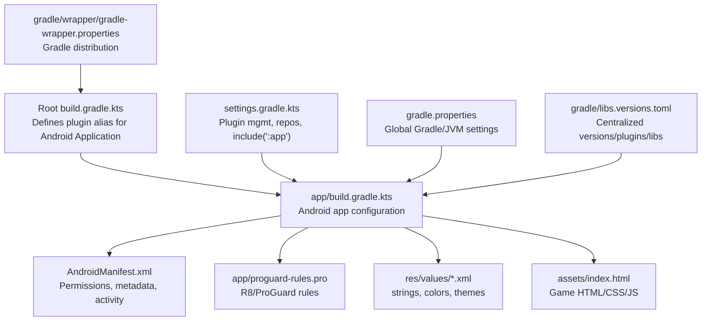
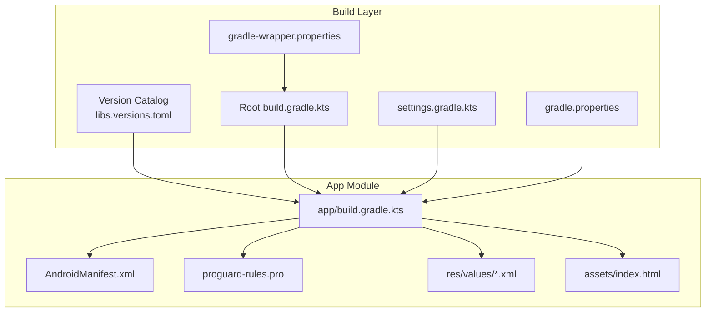
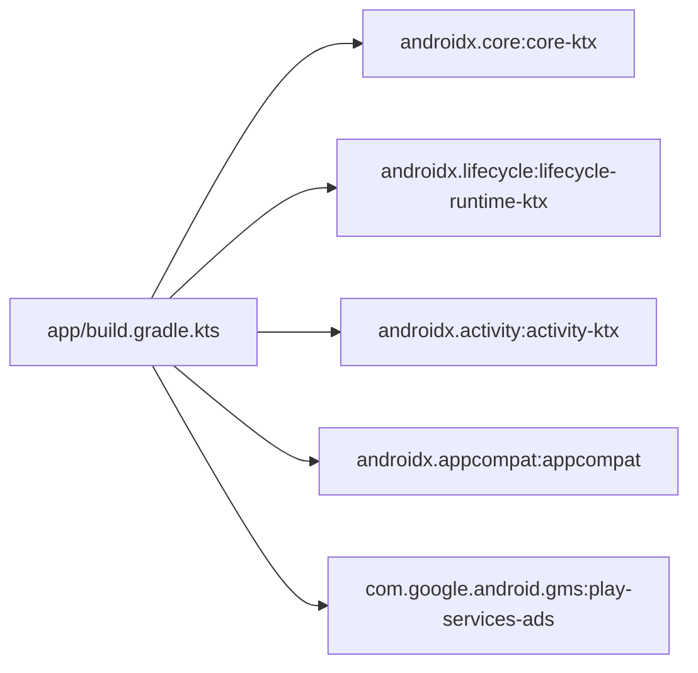

# Configuration & Customization

<cite>
**Referenced Files in This Document**
- [build.gradle.kts](file://build.gradle.kts)
- [settings.gradle.kts](file://settings.gradle.kts)
- [gradle.properties](file://gradle.properties)
- [libs.versions.toml](file://gradle/libs.versions.toml)
- [app/build.gradle.kts](file://app/build.gradle.kts)
- [app/proguard-rules.pro](file://app/proguard-rules.pro)
- [AndroidManifest.xml](file://app/src/main/AndroidManifest.xml)
- [strings.xml](file://app/src/main/res/values/strings.xml)
- [colors.xml](file://app/src/main/res/values/colors.xml)
- [themes.xml](file://app/src/main/res/values/themes.xml)
- [MainActivity.kt](file://app/src/main/java/com/cktechhub/games/MainActivity.kt)
- [index.html](file://app/src/main/assets/index.html)
- [gradle-wrapper.properties](file://gradle/wrapper/gradle-wrapper.properties)
</cite>

## Table of Contents
1. [Introduction](#introduction)
2. [Project Structure](#project-structure)
3. [Core Components](#core-components)
4. [Architecture Overview](#architecture-overview)
5. [Detailed Component Analysis](#detailed-component-analysis)
6. [Dependency Analysis](#dependency-analysis)
7. [Performance Considerations](#performance-considerations)
8. [Troubleshooting Guide](#troubleshooting-guide)
9. [Conclusion](#conclusion)
10. [Appendices](#appendices)

## Introduction
This document explains how to configure and customize the project, focusing on:
- Build configuration management with Gradle and Gradle Version Catalog
- Multi-module setup and repository configuration
- ProGuard/R8 configuration for code shrinking and obfuscation
- Branding, resources, localization, and theme styling
- Practical examples for build script modifications, dependency updates, and configuration changes
- Common customization scenarios such as adding features, modifying build variants, and optimizing for different deployment targets
- Troubleshooting guidance for build issues and configuration conflicts

## Project Structure
The project follows a single-module Android application setup under the app folder, with centralized dependency version management via libs.versions.toml and global Gradle settings. The root build and settings files define plugin and repository policies, while the app module configures Android specifics, dependencies, and ProGuard rules.

**Diagram sources**
- [build.gradle.kts:1-4](file://build.gradle.kts#L1-L4)
- [settings.gradle.kts:1-27](file://settings.gradle.kts#L1-L27)
- [gradle.properties:1-23](file://gradle.properties#L1-L23)
- [libs.versions.toml:1-28](file://gradle/libs.versions.toml#L1-L28)
- [gradle-wrapper.properties:1-10](file://gradle/wrapper/gradle-wrapper.properties#L1-L10)
- [app/build.gradle.kts:1-43](file://app/build.gradle.kts#L1-L43)
- [AndroidManifest.xml:1-51](file://app/src/main/AndroidManifest.xml#L1-L51)
- [app/proguard-rules.pro:1-21](file://app/proguard-rules.pro#L1-L21)
- [strings.xml:1-6](file://app/src/main/res/values/strings.xml#L1-L6)
- [colors.xml:1-10](file://app/src/main/res/values/colors.xml#L1-L10)
- [themes.xml:1-10](file://app/src/main/res/values/themes.xml#L1-L10)
- [index.html:1-1094](file://app/src/main/assets/index.html#L1-L1094)

**Section sources**
- [build.gradle.kts:1-4](file://build.gradle.kts#L1-L4)
- [settings.gradle.kts:1-27](file://settings.gradle.kts#L1-L27)
- [gradle.properties:1-23](file://gradle.properties#L1-L23)
- [gradle/libs.versions.toml:1-28](file://gradle/libs.versions.toml#L1-L28)
- [gradle/wrapper/gradle-wrapper.properties:1-10](file://gradle/wrapper/gradle-wrapper.properties#L1-L10)
- [app/build.gradle.kts:1-43](file://app/build.gradle.kts#L1-L43)

## Core Components
- Root build configuration: Declares the Android Application plugin alias for reuse across modules.
- Settings configuration: Configures plugin management repositories, dependency resolution repositories, and includes the app module.
- Global Gradle properties: Sets JVM arguments, AndroidX usage, Kotlin code style, and non-transitive R class behavior.
- Version catalog: Centralizes versions, libraries, and plugins for consistent dependency management.
- App module build script: Defines Android namespace, SDK versions, default config, build types, compile options, and dependencies.
- ProGuard/R8 rules: Controls minification and code shrinking for release builds.
- Resource management: Strings, colors, themes, and manifest entries define branding and behavior.
- Asset content: Embedded HTML/CSS/JS for the WebView-based game.

Practical customization examples:
- To add a new dependency: declare it in the version catalog and reference it in the app module’s dependencies block.
- To modify build variants: extend the defaultConfig and buildTypes blocks in the app module.
- To optimize for different targets: adjust compileSdk/targetSdk/minSdk and ABI splits or build flavors as needed.

**Section sources**
- [build.gradle.kts:1-4](file://build.gradle.kts#L1-L4)
- [settings.gradle.kts:1-27](file://settings.gradle.kts#L1-L27)
- [gradle.properties:1-23](file://gradle.properties#L1-L23)
- [gradle/libs.versions.toml:1-28](file://gradle/libs.versions.toml#L1-L28)
- [app/build.gradle.kts:1-43](file://app/build.gradle.kts#L1-L43)
- [app/proguard-rules.pro:1-21](file://app/proguard-rules.pro#L1-L21)
- [AndroidManifest.xml:1-51](file://app/src/main/AndroidManifest.xml#L1-L51)
- [strings.xml:1-6](file://app/src/main/res/values/strings.xml#L1-L6)
- [colors.xml:1-10](file://app/src/main/res/values/colors.xml#L1-L10)
- [themes.xml:1-10](file://app/src/main/res/values/themes.xml#L1-L10)
- [index.html:1-1094](file://app/src/main/assets/index.html#L1-L1094)

## Architecture Overview
The build system architecture centers on:
- Centralized version catalog for libraries and plugins
- Root-level plugin and repository policies
- App module Android configuration and dependency declarations
- ProGuard/R8 rules for release builds
- Resource and asset layers for branding and content

**Diagram sources**
- [libs.versions.toml:1-28](file://gradle/libs.versions.toml#L1-L28)
- [build.gradle.kts:1-4](file://build.gradle.kts#L1-L4)
- [settings.gradle.kts:1-27](file://settings.gradle.kts#L1-L27)
- [gradle.properties:1-23](file://gradle.properties#L1-L23)
- [gradle-wrapper.properties:1-10](file://gradle/wrapper/gradle-wrapper.properties#L1-L10)
- [app/build.gradle.kts:1-43](file://app/build.gradle.kts#L1-L43)
- [AndroidManifest.xml:1-51](file://app/src/main/AndroidManifest.xml#L1-L51)
- [app/proguard-rules.pro:1-21](file://app/proguard-rules.pro#L1-L21)
- [strings.xml:1-6](file://app/src/main/res/values/strings.xml#L1-L6)
- [colors.xml:1-10](file://app/src/main/res/values/colors.xml#L1-L10)
- [themes.xml:1-10](file://app/src/main/res/values/themes.xml#L1-L10)
- [index.html:1-1094](file://app/src/main/assets/index.html#L1-L1094)

## Detailed Component Analysis

### Gradle Build Configuration Management
- Root build file defines the Android Application plugin alias to avoid duplication across modules.
- Settings file configures plugin management repositories (Google, Maven Central, Gradle Plugin Portal), enables the toolchain convention plugin, enforces failure on project-specific repositories, and includes the app module.
- Gradle properties centralize JVM arguments, AndroidX usage, Kotlin code style, and non-transitive R class behavior.

Customization tips:
- To add a new module: include it in settings and reference its plugin aliases from the version catalog.
- To change Gradle distribution: update the wrapper properties file.

**Section sources**
- [build.gradle.kts:1-4](file://build.gradle.kts#L1-L4)
- [settings.gradle.kts:1-27](file://settings.gradle.kts#L1-L27)
- [gradle.properties:1-23](file://gradle.properties#L1-L23)
- [gradle-wrapper.properties:1-10](file://gradle/wrapper/gradle-wrapper.properties#L1-L10)

### Version Catalog (libs.versions.toml)
- Declares versions for Android Gradle Plugin, Kotlin, AndroidX libraries, and Google Play Services Ads.
- Defines libraries for core-ktx, lifecycle runtime ktx, activity ktx, appcompat, and play-services-ads.
- Declares plugins for Android Application and Kotlin Android.

Best practices:
- Keep versions centralized to ensure consistent updates across modules.
- Use typed references (e.g., libs.androidx.core.ktx) to reduce duplication and improve readability.

**Section sources**
- [libs.versions.toml:1-28](file://gradle/libs.versions.toml#L1-L28)

### App Module Build Script (app/build.gradle.kts)
- Applies the Android Application plugin via the version catalog alias.
- Configures namespace, compileSdk, defaultConfig (applicationId, minSdk, targetSdk, versionCode/name, test runner).
- Defines buildTypes with release minification disabled and references to default ProGuard rules and project-specific rules.
- Sets Java compatibility to 11 for compilation.
- Declares dependencies using version catalog entries.

Customization examples:
- To enable minification for release builds, set minifyEnabled to true and ensure proguardFiles include the project rules.
- To add a new dependency, declare it in the version catalog and add it to the dependencies block.

**Section sources**
- [app/build.gradle.kts:1-43](file://app/build.gradle.kts#L1-L43)

### ProGuard/R8 Configuration (app/proguard-rules.pro)
- Provides a template for project-specific rules.
- Release build type references default Android ProGuard rules and this file.

Recommendations:
- Enable minifyEnabled in release and add keep rules for WebView JavaScript interfaces and classes required at runtime.
- Preserve line number information for debugging if needed.

**Section sources**
- [app/proguard-rules.pro:1-21](file://app/proguard-rules.pro#L1-L21)
- [app/build.gradle.kts:19-27](file://app/build.gradle.kts#L19-L27)

### Resource Management and Localization
- Strings: Define app name and UI messages; use string resources for internationalization.
- Colors: Centralize palette for consistent theming.
- Themes: Configure window attributes and base theme for the app.

Localization tip:
- Add new language resources under res/values-xx/ for additional locales.

**Section sources**
- [strings.xml:1-6](file://app/src/main/res/values/strings.xml#L1-L6)
- [colors.xml:1-10](file://app/src/main/res/values/colors.xml#L1-L10)
- [themes.xml:1-10](file://app/src/main/res/values/themes.xml#L1-L10)

### Manifest and Branding
- Permissions: INTERNET, ACCESS_NETWORK_STATE, ACCESS_WIFI_STATE.
- Application meta-data: AdMob application ID and provider authorities.
- Activity: Main activity exported with custom theme and configuration changes.

Branding customization:
- Update app icon and round icon under mipmap folders.
- Modify label and theme references to reflect brand identity.

**Section sources**
- [AndroidManifest.xml:1-51](file://app/src/main/AndroidManifest.xml#L1-L51)

### Asset Content and WebView Integration
- The WebView loads content from the embedded HTML/CSS/JS assets.
- JavaScript interface bridges game events to Android (e.g., level completion triggers interstitial ads).

Optimization:
- Minimize asset sizes and bundle assets efficiently.
- Ensure WebView client restrictions align with security requirements.

**Section sources**
- [MainActivity.kt:165-263](file://app/src/main/java/com/cktechhub/games/MainActivity.kt#L165-L263)
- [index.html:1-1094](file://app/src/main/assets/index.html#L1-L1094)

### Build Variants and Feature Flags
Common scenarios:
- Adding a debug-only feature: introduce a product flavor dimension or variant-specific source sets and toggle behavior via buildConfigField or resValue.
- Modifying minSdk/targetSdk: update defaultConfig and ensure dependencies are compatible.
- Enabling minification: set minifyEnabled to true in release and add necessary keep rules.

Note: The current release build type disables minification; enabling it requires updating the build type and adding appropriate ProGuard rules.

**Section sources**
- [app/build.gradle.kts:9-17](file://app/build.gradle.kts#L9-L17)
- [app/build.gradle.kts:19-27](file://app/build.gradle.kts#L19-L27)

## Dependency Analysis
The app module depends on AndroidX core-ktx, lifecycle runtime ktx, activity ktx, appcompat, and Google Play Services Ads. These are resolved via the version catalog.

**Diagram sources**
- [app/build.gradle.kts:34-43](file://app/build.gradle.kts#L34-L43)
- [libs.versions.toml:13-21](file://gradle/libs.versions.toml#L13-L21)

**Section sources**
- [app/build.gradle.kts:34-43](file://app/build.gradle.kts#L34-L43)
- [libs.versions.toml:13-21](file://gradle/libs.versions.toml#L13-L21)

## Performance Considerations
- Keep minification disabled during development for faster iteration; enable it for release builds.
- Use non-transitive R class to reduce R class size when appropriate.
- Optimize WebView settings for performance and security.
- Manage asset sizes and bundling to minimize APK size.

[No sources needed since this section provides general guidance]

## Troubleshooting Guide
Common issues and resolutions:
- Build fails due to missing repositories: ensure pluginManagement and dependencyResolutionManagement are configured in settings and repositories are reachable.
- Dependency resolution errors: verify versions and coordinates in the version catalog match published artifacts.
- ProGuard/R8 warnings: add keep rules for required classes and interfaces (e.g., JavaScript interfaces).
- Manifest merge conflicts: consolidate permissions and meta-data in the app manifest.
- WebView security restrictions: restrict URL loading to local assets and enforce mixed content policies.

**Section sources**
- [settings.gradle.kts:17-23](file://settings.gradle.kts#L17-L23)
- [libs.versions.toml:1-28](file://gradle/libs.versions.toml#L1-L28)
- [app/proguard-rules.pro:1-21](file://app/proguard-rules.pro#L1-L21)
- [AndroidManifest.xml:5-8](file://app/src/main/AndroidManifest.xml#L5-L8)
- [MainActivity.kt:195-207](file://app/src/main/java/com/cktechhub/games/MainActivity.kt#L195-L207)

## Conclusion
This project uses a clean, centralized Gradle configuration with a version catalog for dependency management, a single app module with clear Android settings, and embedded assets for gameplay. By leveraging the version catalog, settings policies, and resource/theme files, you can efficiently customize branding, add features, and optimize builds for different deployment targets while maintaining consistency and clarity.

[No sources needed since this section summarizes without analyzing specific files]

## Appendices

### Practical Examples Index
- Add a new dependency:
  - Declare in [libs.versions.toml:13-21](file://gradle/libs.versions.toml#L13-L21)
  - Reference in [app/build.gradle.kts:34-43](file://app/build.gradle.kts#L34-L43)
- Enable minification for release:
  - Update [app/build.gradle.kts:20-26](file://app/build.gradle.kts#L20-L26)
  - Add keep rules in [app/proguard-rules.pro:1-21](file://app/proguard-rules.pro#L1-L21)
- Customize branding:
  - Update icons under mipmap folders
  - Modify [AndroidManifest.xml:13-17](file://app/src/main/AndroidManifest.xml#L13-L17)
  - Adjust [themes.xml:4-9](file://app/src/main/res/values/themes.xml#L4-L9) and [colors.xml:1-10](file://app/src/main/res/values/colors.xml#L1-L10)
- Localization:
  - Add new language resources under [strings.xml:1-6](file://app/src/main/res/values/strings.xml#L1-L6)

[No sources needed since this section aggregates references without analyzing specific files]