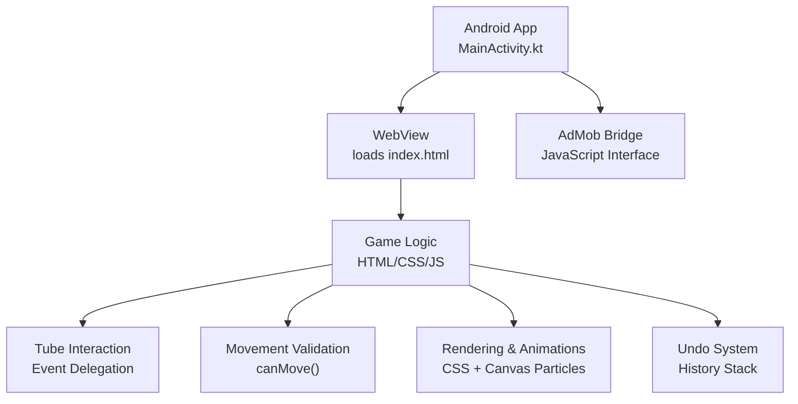
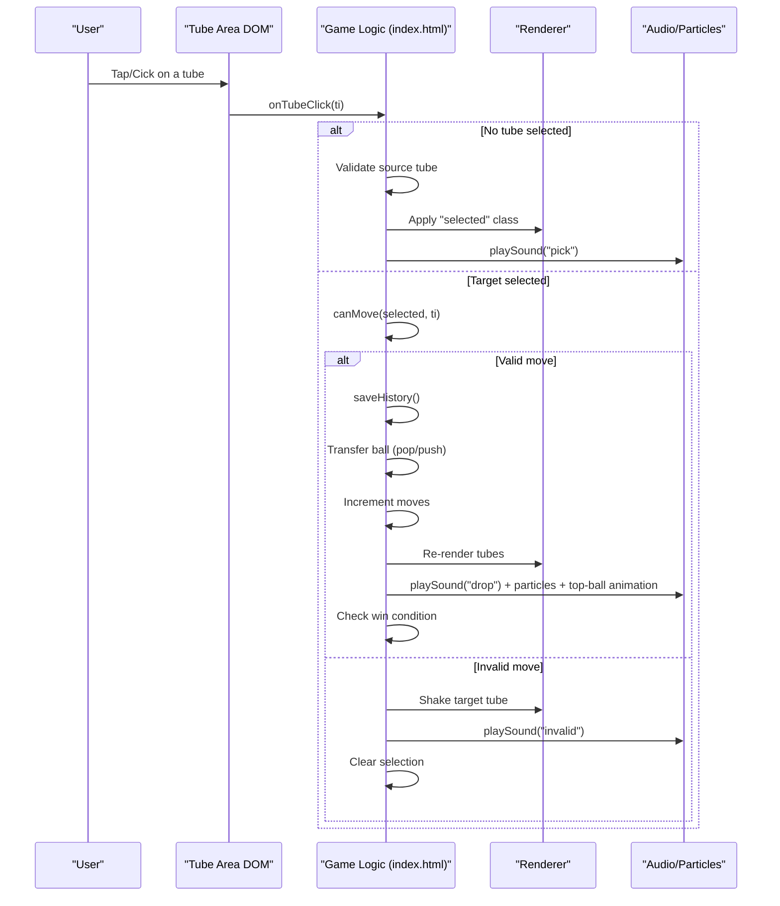
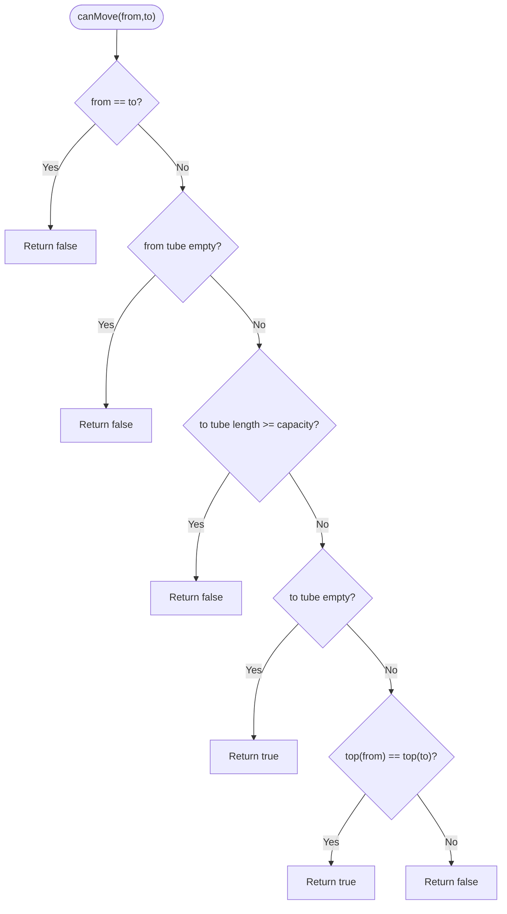
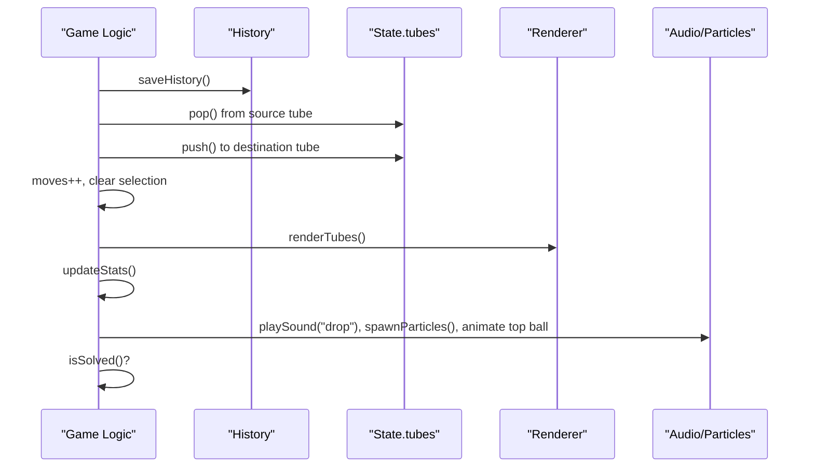
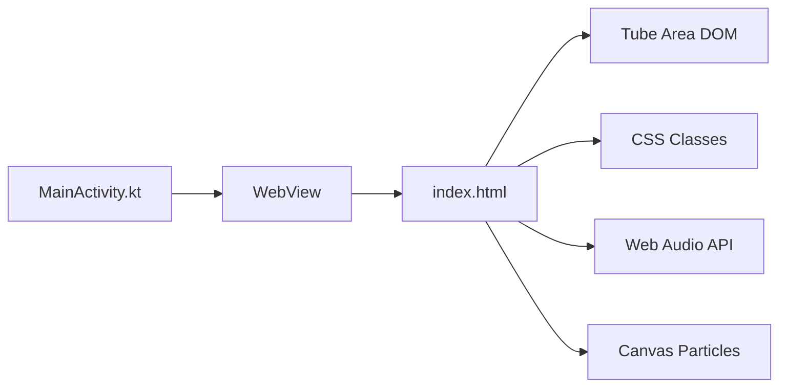

# Ball Physics & Movement

<cite>
**Referenced Files in This Document**
- [index.html](file://app/src/main/assets/index.html)
- [MainActivity.kt](file://app/src/main/java/com/cktechhub/games/MainActivity.kt)
- [AndroidManifest.xml](file://app/src/main/AndroidManifest.xml)
</cite>

## Table of Contents
1. [Introduction](#introduction)
2. [Project Structure](#project-structure)
3. [Core Components](#core-components)
4. [Architecture Overview](#architecture-overview)
5. [Detailed Component Analysis](#detailed-component-analysis)
6. [Dependency Analysis](#dependency-analysis)
7. [Performance Considerations](#performance-considerations)
8. [Troubleshooting Guide](#troubleshooting-guide)
9. [Conclusion](#conclusion)

## Introduction
This document explains the ball physics and movement mechanics for a Ball Sort Puzzle game implemented as a hybrid Android app with a WebView hosting a self-contained HTML/CSS/JavaScript game. It focuses on:
- Tube interaction system and ball transfer algorithms
- Movement validation logic in the canMove() function
- Ball selection/deselection and tube highlighting
- Move tracking and undo system
- Rendering and animation triggers
- Common issues such as invalid move detection, tube overflow prevention, and ball stacking validation

The game runs inside a WebView and exposes a JavaScript interface to Android for analytics and ad triggers. The core gameplay logic resides in the HTML file.

## Project Structure
The project is organized as a minimal Android shell that loads a local HTML page containing the entire game logic. The Android layer handles permissions, WebView configuration, immersive mode, and AdMob integration. The game itself is implemented in a single HTML file with embedded CSS and JavaScript.

**Diagram sources**
- [MainActivity.kt:42-135](file://app/src/main/java/com/cktechhub/games/MainActivity.kt#L42-L135)
- [index.html:321-1094](file://app/src/main/assets/index.html#L321-L1094)

**Section sources**
- [MainActivity.kt:42-135](file://app/src/main/java/com/cktechhub/games/MainActivity.kt#L42-L135)
- [AndroidManifest.xml:1-51](file://app/src/main/AndroidManifest.xml#L1-L51)

## Core Components
- State management: Tracks current level, tubes, selected tube, moves, score, timer, history, and settings.
- Tube system: Each tube is an array of ball indices representing colors.
- Movement validation: Determines whether a ball can be moved from one tube to another.
- Rendering: Builds tube DOM nodes and applies CSS classes for selection, validity, completion, and animations.
- Event handling: Delegated click/touch events on the tube area trigger selection and transfers.
- Undo system: Saves snapshots of tubes and moves to revert state.
- Audio and particles: Web Audio API sounds and canvas-based particle effects.

**Section sources**
- [index.html:361-377](file://app/src/main/assets/index.html#L361-L377)
- [index.html:578-630](file://app/src/main/assets/index.html#L578-L630)
- [index.html:637-645](file://app/src/main/assets/index.html#L637-L645)
- [index.html:694-755](file://app/src/main/assets/index.html#L694-L755)
- [index.html:757-779](file://app/src/main/assets/index.html#L757-L779)

## Architecture Overview
The game uses a client-side architecture:
- Android initializes the WebView and injects a JavaScript bridge for analytics.
- The HTML page manages state, rendering, and game logic.
- CSS classes drive visual feedback (selection, valid targets, completion).
- Animations and particle effects are triggered by game events.

**Diagram sources**
- [index.html:664-689](file://app/src/main/assets/index.html#L664-L689)
- [index.html:694-755](file://app/src/main/assets/index.html#L694-L755)
- [index.html:387-421](file://app/src/main/assets/index.html#L387-L421)
- [index.html:436-469](file://app/src/main/assets/index.html#L436-L469)

## Detailed Component Analysis

### Movement Validation Logic (canMove)
The canMove() function enforces the core rules:
- Cannot move to the same tube.
- Cannot move from an empty tube.
- Cannot move into a full tube.
- If the target tube is empty, the move is allowed.
- Otherwise, the top ball color of the source must match the top ball color of the target.

**Diagram sources**
- [index.html:637-645](file://app/src/main/assets/index.html#L637-L645)

**Section sources**
- [index.html:637-645](file://app/src/main/assets/index.html#L637-L645)

### Ball Selection and Deselection
Selection logic:
- If no tube is selected and the clicked tube is non-empty and not complete, select it and apply the "selected" CSS class.
- If clicking the same tube again, deselect it.
- If clicking a different tube, validate the move using canMove().

Deselection clears the selection and re-renders.

**Section sources**
- [index.html:694-711](file://app/src/main/assets/index.html#L694-L711)
- [index.html:594-596](file://app/src/main/assets/index.html#L594-L596)

### Tube Highlighting Mechanisms
Highlighting is driven by CSS classes applied during rendering:
- "selected": Applied to the currently selected tube.
- "valid-target": Applied to potential destination tubes computed via isValidTarget(ti) which delegates to canMove().
- "complete": Applied to tubes that are full and homogeneous (all balls the same color).

These classes control visual styles such as transform, shadow, and animation.

**Section sources**
- [index.html:594-596](file://app/src/main/assets/index.html#L594-L596)
- [index.html:632-635](file://app/src/main/assets/index.html#L632-L635)
- [index.html:626-630](file://app/src/main/assets/index.html#L626-L630)

### Ball Transfer Operations
Transfer occurs when a move is validated:
- Save current state to history.
- Pop the top ball from the source tube.
- Push it onto the destination tube.
- Increment move counter.
- Clear selection.
- Trigger drop sound, particles, and top-ball animation.
- Re-render and update stats.
- Check win condition.

**Diagram sources**
- [index.html:728-755](file://app/src/main/assets/index.html#L728-L755)
- [index.html:757-763](file://app/src/main/assets/index.html#L757-L763)
- [index.html:387-421](file://app/src/main/assets/index.html#L387-L421)
- [index.html:436-469](file://app/src/main/assets/index.html#L436-L469)

**Section sources**
- [index.html:728-755](file://app/src/main/assets/index.html#L728-L755)
- [index.html:757-763](file://app/src/main/assets/index.html#L757-L763)

### Move Tracking and Undo System
- History snapshot: Each move saves a deep copy of tubes and current move count.
- Undo: Restores previous state, clears selection, updates stats, and optionally animates undo visuals.
- Capacity limit: History keeps at most 100 snapshots.

**Section sources**
- [index.html:757-763](file://app/src/main/assets/index.html#L757-L763)
- [index.html:765-779](file://app/src/main/assets/index.html#L765-L779)

### Rendering System and Animation Triggers
- Rendering builds tube containers and ball slots, applying colors and shadows.
- CSS animations:
  - "ball-drop" for the top ball after a successful drop.
  - "ball-undo" for all balls during undo.
  - "hint-flash" for hint targets.
  - "shake" for invalid moves.
  - "completePulse" for completed tubes.
- Canvas particles: Emitted on drops and level completion.

**Section sources**
- [index.html:578-624](file://app/src/main/assets/index.html#L578-L624)
- [index.html:744-748](file://app/src/main/assets/index.html#L744-L748)
- [index.html:773-778](file://app/src/main/assets/index.html#L773-L778)
- [index.html:805-815](file://app/src/main/assets/index.html#L805-L815)
- [index.html:1069-1071](file://app/src/main/assets/index.html#L1069-L1071)
- [index.html:436-469](file://app/src/main/assets/index.html#L436-L469)

### Tube Capacity Checking, Color Matching, and Empty Tube Handling
- Capacity: Enforced by comparing destination tube length to the level’s balls-per-color capacity.
- Color matching: Compares the top ball index of source and destination.
- Empty tube handling: An empty destination is always a valid target; the top color comparison is skipped.

Concrete references:
- Capacity check: [index.html:642](file://app/src/main/assets/index.html#L642)
- Empty target: [index.html:643](file://app/src/main/assets/index.html#L643)
- Color match: [index.html:644](file://app/src/main/assets/index.html#L644)

**Section sources**
- [index.html:637-645](file://app/src/main/assets/index.html#L637-L645)

### Win Condition and Level Completion
Win condition checks:
- All non-empty tubes must be full (length equals capacity).
- All non-empty tubes must be homogeneous (same color).
- The number of solved colors must equal the level’s color count.

Completion triggers:
- Sound effects and particle bursts.
- Level complete overlay with summary and controls.

**Section sources**
- [index.html:533-543](file://app/src/main/assets/index.html#L533-L543)
- [index.html:853-896](file://app/src/main/assets/index.html#L853-L896)

## Dependency Analysis
High-level dependencies:
- Android MainActivity depends on WebView and AdMob SDK.
- WebView loads the HTML game page.
- Game logic depends on DOM, CSS classes, and Web Audio/Canvas APIs.
- Event delegation binds to the tube area container.

**Diagram sources**
- [MainActivity.kt:165-263](file://app/src/main/java/com/cktechhub/games/MainActivity.kt#L165-L263)
- [index.html:321-1094](file://app/src/main/assets/index.html#L321-L1094)

**Section sources**
- [MainActivity.kt:165-263](file://app/src/main/java/com/cktechhub/games/MainActivity.kt#L165-L263)
- [index.html:321-1094](file://app/src/main/assets/index.html#L321-L1094)

## Performance Considerations
- Rendering cost: Re-rendering all tubes on every interaction is O(n) per frame; acceptable for small n typical in this game.
- Event throttling: A simple flag prevents re-entrancy during interactions.
- History size: Limiting history to 100 snapshots bounds memory usage.
- Animations: Conditional toggles for animations and particles reduce overhead when disabled.

[No sources needed since this section provides general guidance]

## Troubleshooting Guide
Common issues and resolutions:
- Invalid move detected:
  - Symptom: Target tube shakes and selection clears.
  - Cause: canMove() returned false (e.g., wrong color, full tube, or same tube).
  - Resolution: Verify source tube is non-empty and target tube is either empty or matches top color; ensure capacity is not exceeded.

- Tube overflow prevention:
  - Symptom: Move blocked when destination tube is full.
  - Cause: Destination length equals capacity.
  - Resolution: Ensure the destination has space or select a different tube.

- Ball stacking validation:
  - Symptom: Move blocked when colors mismatch.
  - Cause: Top ball color differs between source and destination.
  - Resolution: Only move when top colors match or destination is empty.

- Selection not clearing:
  - Symptom: Selected tube remains highlighted after invalid move.
  - Cause: Selection cleared only on invalid move path.
  - Resolution: Confirm invalid branch executes and re-render is called.

- Undo not working:
  - Symptom: No state change on undo.
  - Cause: History is empty.
  - Resolution: Ensure saveHistory() is called before each move and history is not pruned prematurely.

**Section sources**
- [index.html:713-725](file://app/src/main/assets/index.html#L713-L725)
- [index.html:637-645](file://app/src/main/assets/index.html#L637-L645)
- [index.html:757-763](file://app/src/main/assets/index.html#L757-L763)
- [index.html:765-779](file://app/src/main/assets/index.html#L765-L779)

## Conclusion
The game implements a clean separation between Android shell and HTML game logic. The canMove() function centralizes movement validation, while rendering and CSS classes provide immediate visual feedback. The event delegation model simplifies interaction handling, and the history-based undo system ensures robust replay capabilities. By following the validation rules and leveraging the provided rendering hooks, developers can extend or adapt this architecture for similar physics-based puzzle games.