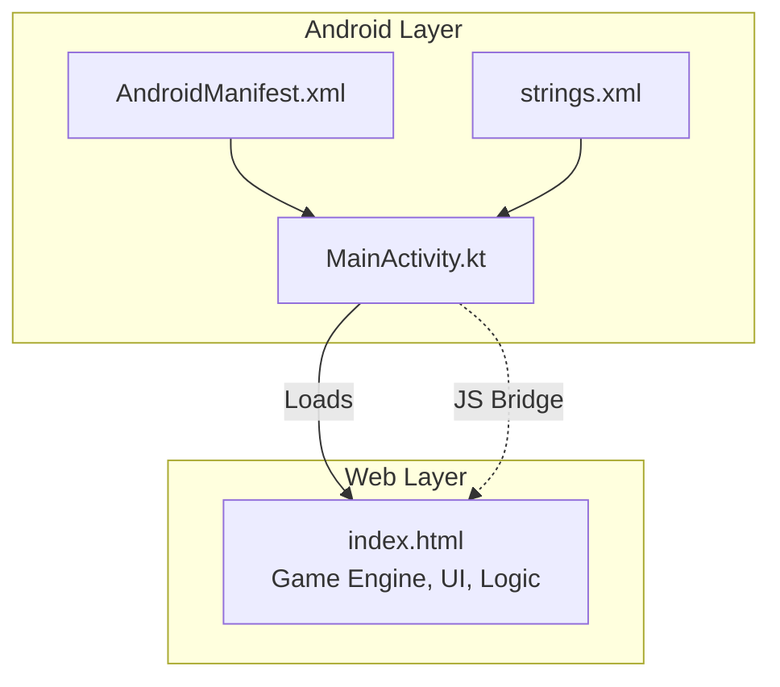
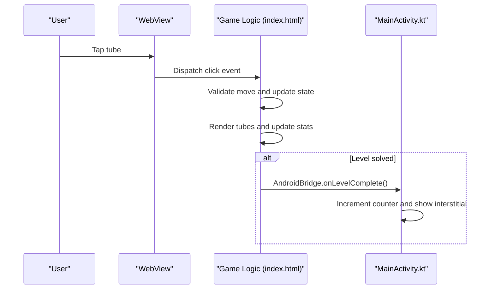
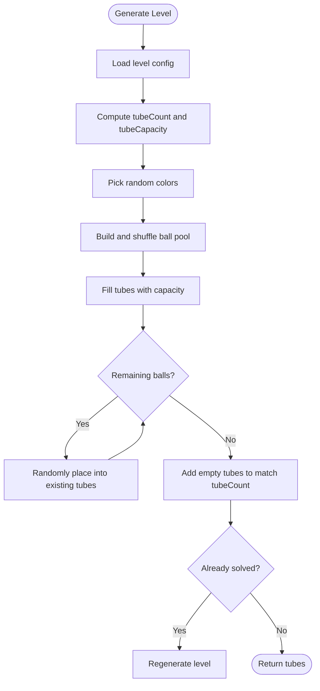
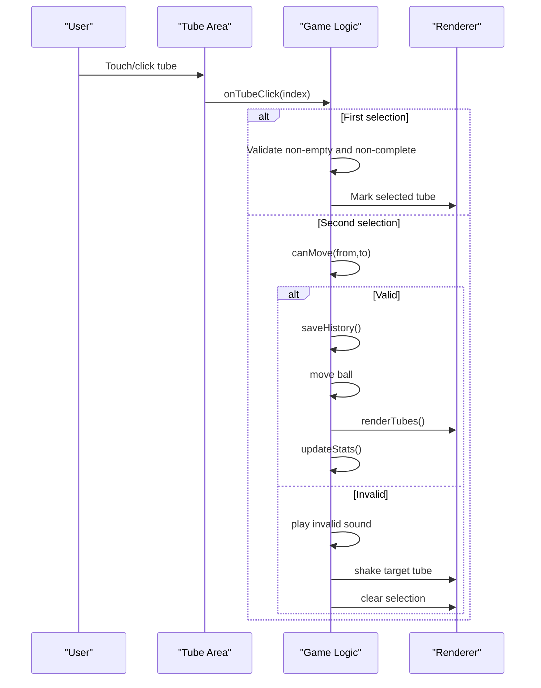
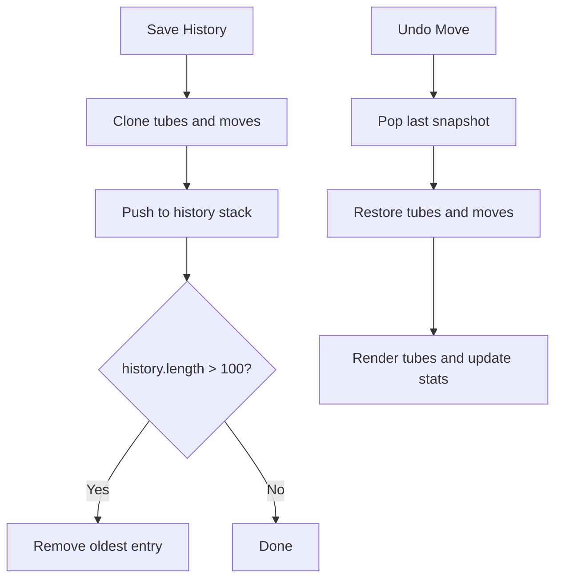
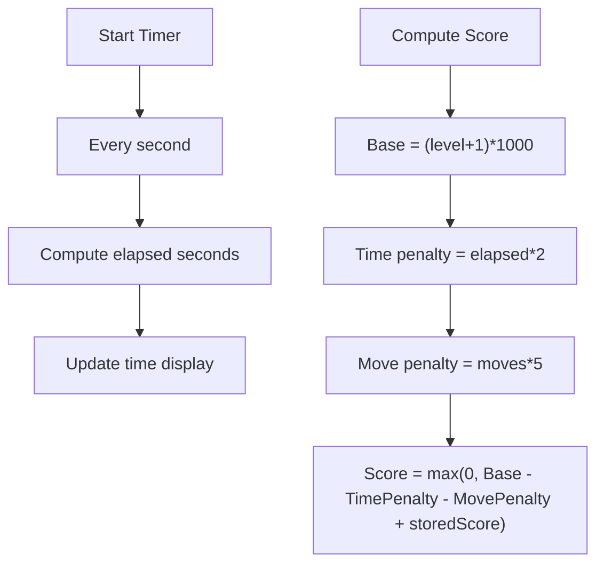
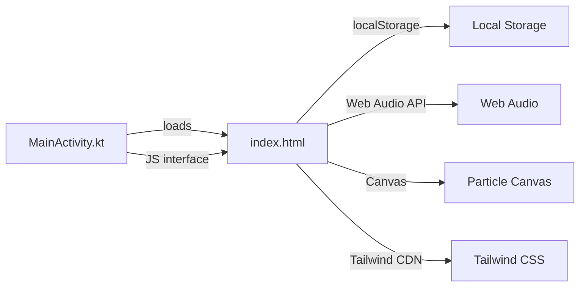

# Game Engine & Logic

<cite>
**Referenced Files in This Document**
- [index.html](file://app/src/main/assets/index.html)
- [MainActivity.kt](file://app/src/main/java/com/cktechhub/games/MainActivity.kt)
- [strings.xml](file://app/src/main/res/values/strings.xml)
- [AndroidManifest.xml](file://app/src/main/AndroidManifest.xml)
- [ADMOB_SETUP.md](file://ADMOB_SETUP.md)
- [build.gradle.kts](file://build.gradle.kts)
- [libs.versions.toml](file://gradle/libs.versions.toml)
</cite>

## Table of Contents
1. [Introduction](#introduction)
2. [Project Structure](#project-structure)
3. [Core Components](#core-components)
4. [Architecture Overview](#architecture-overview)
5. [Detailed Component Analysis](#detailed-component-analysis)
6. [Dependency Analysis](#dependency-analysis)
7. [Performance Considerations](#performance-considerations)
8. [Troubleshooting Guide](#troubleshooting-guide)
9. [Conclusion](#conclusion)
10. [Appendices](#appendices)

## Introduction
This document explains the JavaScript-based game engine powering the Ball Sort Puzzle, including the level system with 15 progressive difficulty levels, ball sorting mechanics, tube interaction system, and the Android WebView bridge. It covers configuration options, scoring and timing mechanics, move tracking, and how the native Android layer integrates with the web-based game via a JavaScript interface. The content is designed to be accessible to beginners while providing sufficient technical depth for developers implementing similar games.

## Project Structure
The project consists of:
- A WebView-based Android app that loads a local HTML page containing the entire game logic.
- The game logic is implemented in a single HTML file with embedded JavaScript, CSS, and minimal DOM manipulation.
- The Android layer initializes the WebView, injects a JavaScript bridge, and handles AdMob integration and lifecycle events.



**Diagram sources**
- [MainActivity.kt:66-135](file://app/src/main/java/com/cktechhub/games/MainActivity.kt#L66-L135)
- [AndroidManifest.xml:9-48](file://app/src/main/AndroidManifest.xml#L9-L48)
- [index.html:1-1094](file://app/src/main/assets/index.html#L1-L1094)

**Section sources**
- [MainActivity.kt:66-135](file://app/src/main/java/com/cktechhub/games/MainActivity.kt#L66-L135)
- [AndroidManifest.xml:9-48](file://app/src/main/AndroidManifest.xml#L9-L48)
- [index.html:1-1094](file://app/src/main/assets/index.html#L1-L1094)

## Core Components
- Level configuration and generation: Defines 15 levels with increasing tube count, color count, and balls per color. Generates valid puzzles and ensures they are not pre-solved.
- Tube rendering and interaction: Renders tubes and balls, manages selection, validates moves, and applies animations.
- Move tracking and history: Saves state snapshots for undo and limits history length.
- Scoring and timing: Tracks moves and elapsed time, computes score with penalties.
- Settings and persistence: Stores user preferences and progress in local storage.
- Audio and particle effects: Web Audio API sounds and canvas-based particle system.
- Android bridge: Injects a JavaScript interface to trigger native actions (e.g., interstitial ads) on level completion.

**Section sources**
- [index.html:325-341](file://app/src/main/assets/index.html#L325-L341)
- [index.html:482-531](file://app/src/main/assets/index.html#L482-L531)
- [index.html:578-645](file://app/src/main/assets/index.html#L578-L645)
- [index.html:727-779](file://app/src/main/assets/index.html#L727-L779)
- [index.html:841-848](file://app/src/main/assets/index.html#L841-L848)
- [index.html:1076-1083](file://app/src/main/assets/index.html#L1076-L1083)
- [index.html:382-421](file://app/src/main/assets/index.html#L382-L421)
- [index.html:426-469](file://app/src/main/assets/index.html#L426-L469)
- [MainActivity.kt:191-228](file://app/src/main/java/com/cktechhub/games/MainActivity.kt#L191-L228)

## Architecture Overview
The game runs inside a WebView. The Android layer sets up the WebView, injects a JavaScript bridge, and intercepts level completion to trigger interstitial ads. The web layer implements the entire game: level generation, tube rendering, move validation, scoring, and UI.



**Diagram sources**
- [index.html:694-755](file://app/src/main/assets/index.html#L694-L755)
- [index.html:853-881](file://app/src/main/assets/index.html#L853-L881)
- [MainActivity.kt:214-228](file://app/src/main/java/com/cktechhub/games/MainActivity.kt#L214-L228)
- [MainActivity.kt:429-439](file://app/src/main/java/com/cktechhub/games/MainActivity.kt#L429-L439)

## Detailed Component Analysis

### Level System and Generation
- Level configuration: 15 levels define tube count, color count, and balls per color. These drive puzzle complexity and capacity.
- Generation algorithm:
  - Compute total balls and required tube capacity.
  - Ensure enough tubes to accommodate all balls plus at least one empty tube.
  - Randomly select colors and construct a shuffled ball pool.
  - Distribute balls into tubes, refill existing tubes if needed, and pad with empty tubes.
  - Reject puzzles that are already solved and regenerate until valid.
- Validation: A puzzle is solved if every non-empty tube is full and contains a single color.



**Diagram sources**
- [index.html:482-531](file://app/src/main/assets/index.html#L482-L531)
- [index.html:533-543](file://app/src/main/assets/index.html#L533-L543)

**Section sources**
- [index.html:325-341](file://app/src/main/assets/index.html#L325-L341)
- [index.html:482-531](file://app/src/main/assets/index.html#L482-L531)
- [index.html:533-543](file://app/src/main/assets/index.html#L533-L543)

### Tube Interaction and Sorting Mechanics
- Rendering:
  - Calculates tube dimensions based on screen size and number of tubes.
  - Renders each tube with balls stacked from bottom to top.
  - Applies visual states: selected, valid target, complete.
- Interaction:
  - Selecting a non-empty, non-complete tube highlights it.
  - Clicking a valid target tube performs a move; invalid targets shake.
  - Move validation checks source tube non-empty, target capacity, and color compatibility.
- Animations and effects:
  - Drop animation for the top ball on insertion.
  - Undo animation for reverting moves.
  - Particle bursts on successful drops and level completion.



**Diagram sources**
- [index.html:694-755](file://app/src/main/assets/index.html#L694-L755)
- [index.html:632-645](file://app/src/main/assets/index.html#L632-L645)
- [index.html:727-779](file://app/src/main/assets/index.html#L727-L779)
- [index.html:578-624](file://app/src/main/assets/index.html#L578-L624)

**Section sources**
- [index.html:578-624](file://app/src/main/assets/index.html#L578-L624)
- [index.html:632-645](file://app/src/main/assets/index.html#L632-L645)
- [index.html:694-755](file://app/src/main/assets/index.html#L694-L755)
- [index.html:727-779](file://app/src/main/assets/index.html#L727-L779)

### Move Tracking and History
- History snapshot: Each move saves a deep copy of the current tubes and move count.
- Capacity limit: History is capped at 100 entries to prevent memory growth.
- Undo: Restores previous state and re-applies animations.



**Diagram sources**
- [index.html:757-779](file://app/src/main/assets/index.html#L757-L779)

**Section sources**
- [index.html:757-779](file://app/src/main/assets/index.html#L757-L779)

### Scoring, Timing, and Stats
- Timer: Starts on level load, updates every second.
- Score computation: Base score increases with level, minus penalties for time and moves.
- Stats display: Moves, time, and score are shown during gameplay.



**Diagram sources**
- [index.html:820-848](file://app/src/main/assets/index.html#L820-L848)

**Section sources**
- [index.html:820-848](file://app/src/main/assets/index.html#L820-L848)

### Settings, Persistence, and UI
- Settings modal toggles sound, animations, and particles; persists to local storage.
- Progress persistence: Saves current level and cumulative score across sessions.
- Home screen preview: Shows a static preview of tubes to entice players.

**Section sources**
- [index.html:1028-1046](file://app/src/main/assets/index.html#L1028-L1046)
- [index.html:1076-1083](file://app/src/main/assets/index.html#L1076-L1083)
- [index.html:908-935](file://app/src/main/assets/index.html#L908-L935)
- [index.html:940-961](file://app/src/main/assets/index.html#L940-L961)

### Android Bridge and AdMob Integration
- JavaScript bridge: Exposes a native interface to the web layer.
- Injection: On page finished, wraps the level completion handler to notify Android.
- Interstitial frequency: Every N level completions, Android shows an interstitial ad.

```mermaid
sequenceDiagram
participant JS as "Game Logic"
participant WB as "WebView"
participant AND as "MainActivity"
JS->>WB : evaluateJavascript(inject bridge)
WB->>AND : AndroidBridge.onLevelComplete()
AND->>AND : Increment counter
AND->>AND : Show interstitial if threshold met
```

**Diagram sources**
- [MainActivity.kt:214-228](file://app/src/main/java/com/cktechhub/games/MainActivity.kt#L214-L228)
- [MainActivity.kt:429-439](file://app/src/main/java/com/cktechhub/games/MainActivity.kt#L429-L439)

**Section sources**
- [MainActivity.kt:191-228](file://app/src/main/java/com/cktechhub/games/MainActivity.kt#L191-L228)
- [MainActivity.kt:429-439](file://app/src/main/java/com/cktechhub/games/MainActivity.kt#L429-L439)

## Dependency Analysis
- Android WebView depends on:
  - Local assets (index.html).
  - JavaScript-enabled settings.
  - JavaScript interface registration.
- Web layer depends on:
  - Local storage for settings and progress.
  - Web Audio API for sound.
  - Canvas for particle effects.
  - Tailwind CSS for styling (loaded via CDN).



**Diagram sources**
- [MainActivity.kt:165-263](file://app/src/main/java/com/cktechhub/games/MainActivity.kt#L165-L263)
- [index.html:7,321-1094](file://app/src/main/assets/index.html#L7,L321-L1094)

**Section sources**
- [MainActivity.kt:165-263](file://app/src/main/java/com/cktechhub/games/MainActivity.kt#L165-L263)
- [index.html:7,321-1094](file://app/src/main/assets/index.html#L7,L321-L1094)

## Performance Considerations
- Rendering:
  - Minimize DOM updates by batching renders and using efficient selectors.
  - Use CSS transforms for animations rather than layout-affecting properties.
- Memory:
  - Limit history size to reduce memory footprint.
  - Avoid frequent deep cloning; reuse arrays where possible.
- Audio:
  - Reuse oscillator nodes and avoid creating new contexts frequently.
- Particles:
  - Clear dead particles and throttle spawn rate for mobile devices.
- Network:
  - Ensure WebView is configured to avoid mixed content and unnecessary caching overhead.

[No sources needed since this section provides general guidance]

## Troubleshooting Guide
- Level validation fails repeatedly:
  - Ensure generated puzzles are not already solved; the generator rejects such cases and regenerates.
  - Verify tube capacity and color counts match the intended level configuration.
- Move not accepted:
  - Confirm source tube is not empty and target tube is either empty or matches the top ball’s color.
  - Check that target tube is not full.
- Undo not working:
  - Ensure history is not empty and snapshots are recent.
  - Verify that the renderer restores the exact previous state.
- Sound or particles disabled:
  - Check settings toggles and local storage flags.
- Ads not showing:
  - Confirm AdMob IDs are replaced with production values before release.
  - Ensure internet connectivity and AdMob initialization completes.

**Section sources**
- [index.html:525-531](file://app/src/main/assets/index.html#L525-L531)
- [index.html:632-645](file://app/src/main/assets/index.html#L632-L645)
- [index.html:757-779](file://app/src/main/assets/index.html#L757-L779)
- [index.html:1028-1046](file://app/src/main/assets/index.html#L1028-L1046)
- [ADMOB_SETUP.md:36-104](file://ADMOB_SETUP.md#L36-L104)

## Conclusion
The Ball Sort Puzzle game engine is a compact, self-contained solution implemented in a single HTML file with embedded JavaScript. It cleanly separates concerns across level generation, rendering, interaction, scoring, and persistence. The Android layer integrates via a lightweight JavaScript bridge to trigger native features like interstitial ads. With clear configuration for 15 levels and robust move validation, the system is suitable for both casual players and developers seeking a reference implementation of a tube-sorting puzzle.

[No sources needed since this section summarizes without analyzing specific files]

## Appendices

### Configuration Options and Parameters
- Level configuration:
  - Tubes per level, color count, and balls per color define difficulty progression.
- Ball colors:
  - Predefined palette with background and glow colors.
- Physics and visuals:
  - Ball drop and bounce animations, particle effects, and sound toggles.
- Scoring:
  - Base score scales with level; penalties apply for time and moves.
- Settings persistence:
  - Sound, animations, and particles flags stored in local storage.
- Progress persistence:
  - Current level and cumulative score stored in local storage.

**Section sources**
- [index.html:325-356](file://app/src/main/assets/index.html#L325-L356)
- [index.html:841-848](file://app/src/main/assets/index.html#L841-L848)
- [index.html:1028-1046](file://app/src/main/assets/index.html#L1028-L1046)
- [index.html:1076-1083](file://app/src/main/assets/index.html#L1076-L1083)

### Android Integration Details
- WebView setup:
  - JavaScript enabled, DOM storage enabled, file access allowed.
  - Safe navigation restricts external URLs except local assets.
- JavaScript bridge:
  - Adds a named interface for native callbacks.
  - Injects a wrapper around the level completion handler to notify Android.
- AdMob:
  - Banner ad at the bottom; interstitial ad shown periodically after level completions.
  - Test IDs included; production IDs must be replaced before release.

**Section sources**
- [MainActivity.kt:165-263](file://app/src/main/java/com/cktechhub/games/MainActivity.kt#L165-L263)
- [MainActivity.kt:214-228](file://app/src/main/java/com/cktechhub/games/MainActivity.kt#L214-L228)
- [MainActivity.kt:429-439](file://app/src/main/java/com/cktechhub/games/MainActivity.kt#L429-L439)
- [AndroidManifest.xml:9-48](file://app/src/main/AndroidManifest.xml#L9-L48)
- [ADMOB_SETUP.md:36-104](file://ADMOB_SETUP.md#L36-L104)