# Game State & History

<cite>
**Referenced Files in This Document**
- [index.html](file://app/src/main/assets/index.html)
- [MainActivity.kt](file://app/src/main/java/com/cktechhub/games/MainActivity.kt)
- [AndroidManifest.xml](file://app/src/main/AndroidManifest.xml)
- [strings.xml](file://app/src/main/res/values/strings.xml)
</cite>

## Update Summary
**Changes Made**
- Updated scoring system documentation to reflect new `computeLevelScore()` function
- Removed references to complex time-based scoring calculations
- Added documentation for simplified state-based scoring mechanism
- Updated score calculation algorithm section with new implementation
- Revised progress persistence section to match new scoring approach

## Table of Contents
1. [Introduction](#introduction)
2. [Project Structure](#project-structure)
3. [Core Components](#core-components)
4. [Architecture Overview](#architecture-overview)
5. [Detailed Component Analysis](#detailed-component-analysis)
6. [Dependency Analysis](#dependency-analysis)
7. [Performance Considerations](#performance-considerations)
8. [Troubleshooting Guide](#troubleshooting-guide)
9. [Conclusion](#conclusion)
10. [Appendices](#appendices)

## Introduction
This document explains the game state management and history system for a Ball Sort Puzzle game embedded inside an Android app via a WebView. It focuses on:
- The state object structure and how it tracks game progress
- Move tracking and history buffer management
- Undo functionality using saveHistory() and undoMove()
- Timer and simplified score computation using computeLevelScore()
- Progress persistence using localStorage
- Integration with the UI rendering system and user interactions
- Best practices for preventing state corruption, managing memory for large histories, and optimizing performance

## Project Structure
The game is implemented as a single-page HTML application packaged in the Android app's assets. The Android activity hosts a WebView that loads the game page and bridges JavaScript events to native Android for analytics and ads.

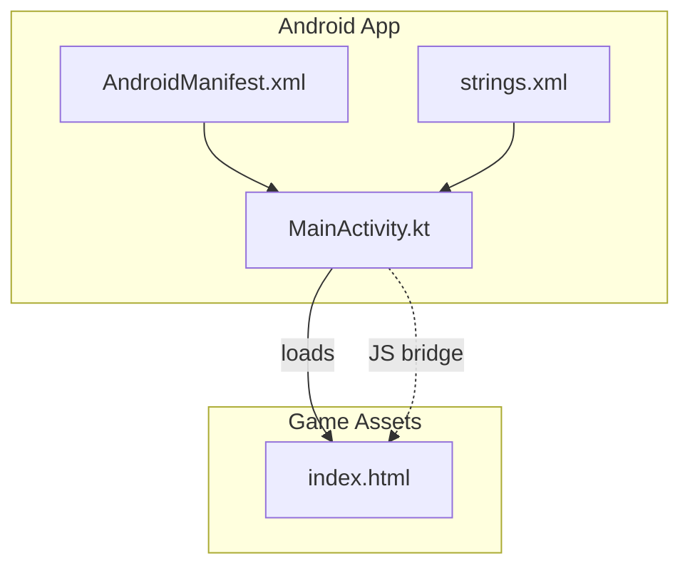

**Diagram sources**
- [MainActivity.kt:66-135](file://app/src/main/java/com/cktechhub/games/MainActivity.kt#L66-L135)
- [AndroidManifest.xml:30-41](file://app/src/main/AndroidManifest.xml#L30-L41)
- [index.html:131](file://app/src/main/assets/index.html#L131)

**Section sources**
- [MainActivity.kt:66-135](file://app/src/main/java/com/cktechhub/games/MainActivity.kt#L66-L135)
- [AndroidManifest.xml:30-41](file://app/src/main/AndroidManifest.xml#L30-L41)
- [index.html:131](file://app/src/main/assets/index.html#L131)

## Core Components
- State object: central runtime state for the current game session
- History buffer: stores previous states to support undo
- Timer and stats: tracks elapsed time, moves, and computed score
- Persistence: saves progress and settings to localStorage
- UI rendering: renders tubes, balls, and stats; handles user interactions

Key responsibilities:
- State object holds currentLevel, tubes, selectedTube, moves, score, startTime, timerInterval, history, initialTubes, levelColors, ballsPerColor, solved, and settings flags
- saveHistory() serializes the current state snapshot into history
- undoMove() restores the last state from history
- Timer and computeScore() update UI stats using simplified scoring
- localStorage persists progress across sessions

**Section sources**
- [index.html:361-377](file://app/src/main/assets/index.html#L361-L377)
- [index.html:757-779](file://app/src/main/assets/index.html#L757-L779)
- [index.html:820-848](file://app/src/main/assets/index.html#L820-L848)
- [index.html:908-935](file://app/src/main/assets/index.html#L908-L935)

## Architecture Overview
The Android activity initializes a WebView, loads the game HTML, and injects a JavaScript interface to receive notifications from the game. The game runs entirely in the browser engine, with JavaScript managing state, rendering, and persistence.

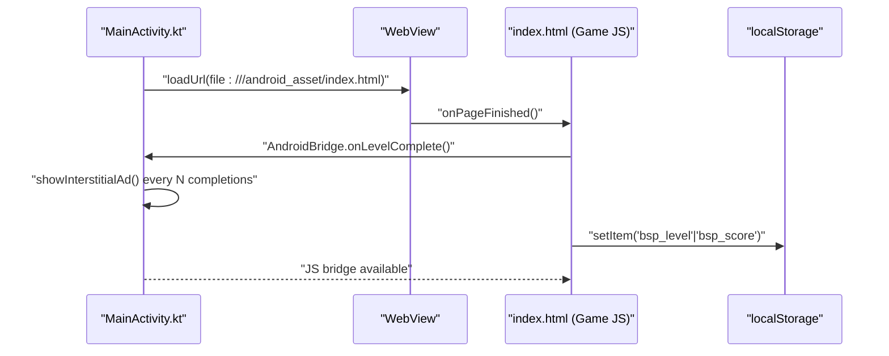

**Diagram sources**
- [MainActivity.kt:106-131](file://app/src/main/java/com/cktechhub/games/MainActivity.kt#L106-L131)
- [MainActivity.kt:209-228](file://app/src/main/java/com/cktechhub/games/MainActivity.kt#L209-L228)
- [MainActivity.kt:429-439](file://app/src/main/java/com/cktechhub/games/MainActivity.kt#L429-L439)
- [index.html:1005-1014](file://app/src/main/assets/index.html#L1005-L1014)

## Detailed Component Analysis

### State Object Structure
The state object encapsulates all runtime data for a game session. It includes:
- Game identity: currentLevel, solved
- Tubes: tubes, initialTubes, selectedTube, ballsPerColor, levelColors
- Moves and scoring: moves, score, startTime, timerInterval
- History: history
- Settings: soundEnabled, animEnabled, particleEnabled

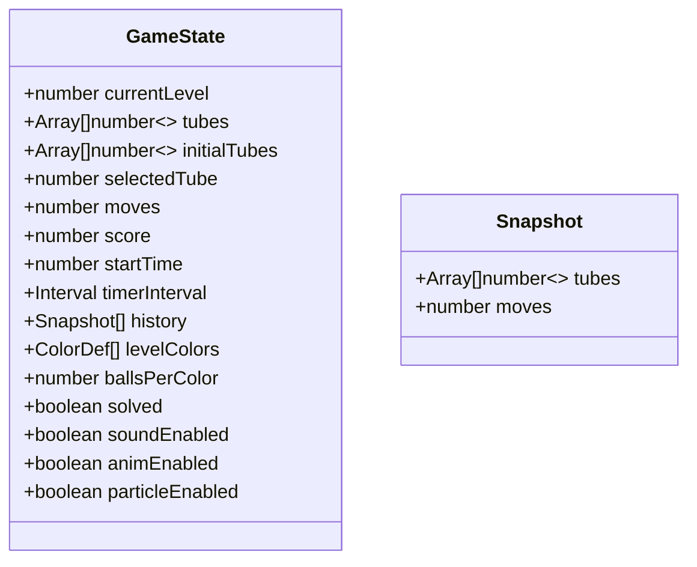

**Diagram sources**
- [index.html:361-377](file://app/src/main/assets/index.html#L361-L377)
- [index.html:757-763](file://app/src/main/assets/index.html#L757-L763)

**Section sources**
- [index.html:361-377](file://app/src/main/assets/index.html#L361-L377)
- [index.html:757-763](file://app/src/main/assets/index.html#L757-L763)

### Move Tracking Mechanism
- When a player selects a tube and clicks a destination tube, the game validates the move using canMove().
- On a valid move, saveHistory() pushes a deep copy of the current state into history.
- The move is executed by popping from the source tube and pushing into the destination tube.
- Moves counter increments and UI stats update.

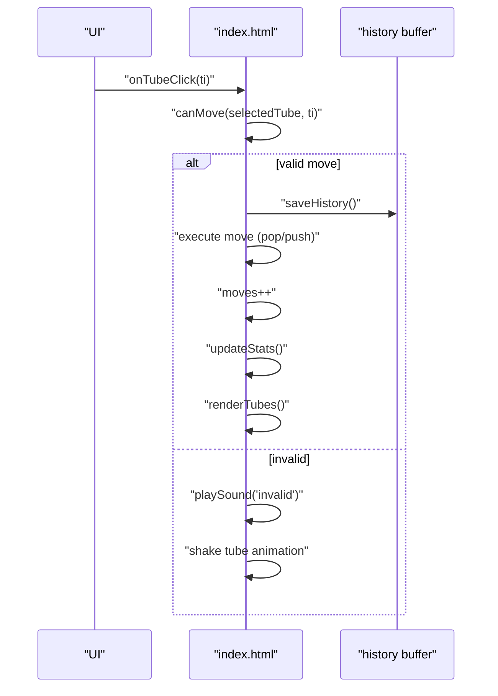

**Diagram sources**
- [index.html:694-755](file://app/src/main/assets/index.html#L694-L755)
- [index.html:757-763](file://app/src/main/assets/index.html#L757-L763)
- [index.html:836-840](file://app/src/main/assets/index.html#L836-L840)

**Section sources**
- [index.html:694-755](file://app/src/main/assets/index.html#L694-L755)
- [index.html:757-763](file://app/src/main/assets/index.html#L757-L763)
- [index.html:836-840](file://app/src/main/assets/index.html#L836-L840)

### Undo Functionality
- undoMove() pops the last snapshot from history and restores tubes and moves.
- The selection state is cleared, stats are refreshed, and the UI re-renders.
- Optional animations are applied to balls to indicate undo.

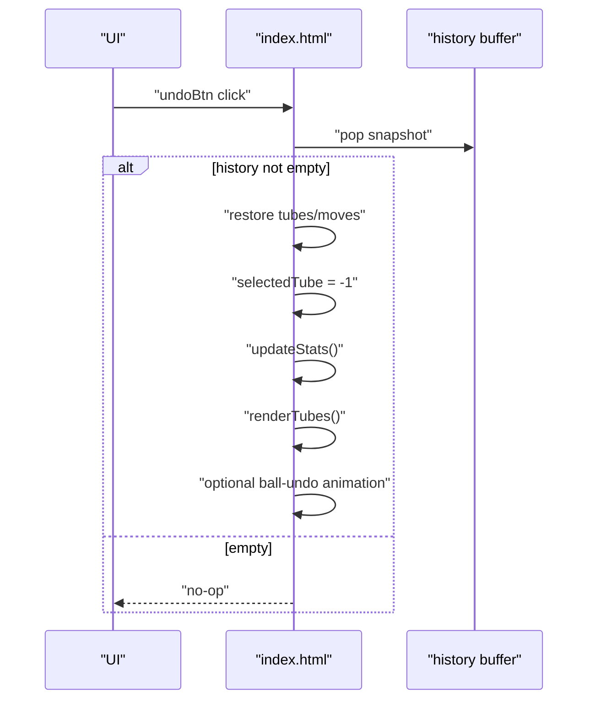

**Diagram sources**
- [index.html:978-981](file://app/src/main/assets/index.html#L978-L981)
- [index.html:765-779](file://app/src/main/assets/index.html#L765-L779)

**Section sources**
- [index.html:978-981](file://app/src/main/assets/index.html#L978-L981)
- [index.html:765-779](file://app/src/main/assets/index.html#L765-L779)

### State Serialization and History Buffer Management
- saveHistory() creates a deep copy of state.tubes and records the current moves.
- The history buffer is capped at 100 snapshots; older entries are removed via shift() to prevent unbounded growth.
- This ensures undo remains responsive even during long sessions.

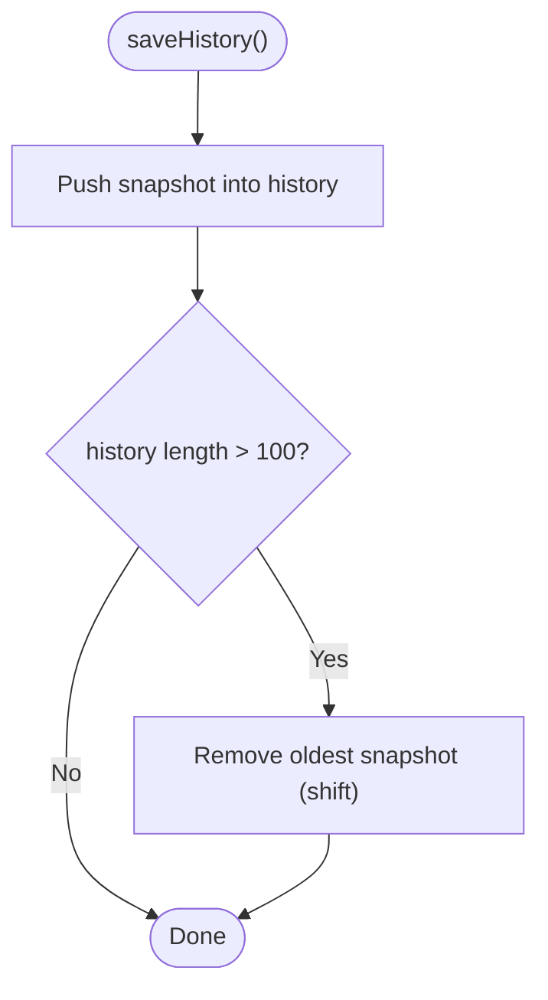

**Diagram sources**
- [index.html:757-763](file://app/src/main/assets/index.html#L757-L763)

**Section sources**
- [index.html:757-763](file://app/src/main/assets/index.html#L757-L763)

### Timer Implementation
- startTimer() sets startTime and starts a 1-second interval to update the UI.
- stopTimer() clears the interval and resets state.
- updateTimer() computes elapsed minutes and seconds and updates the time display.

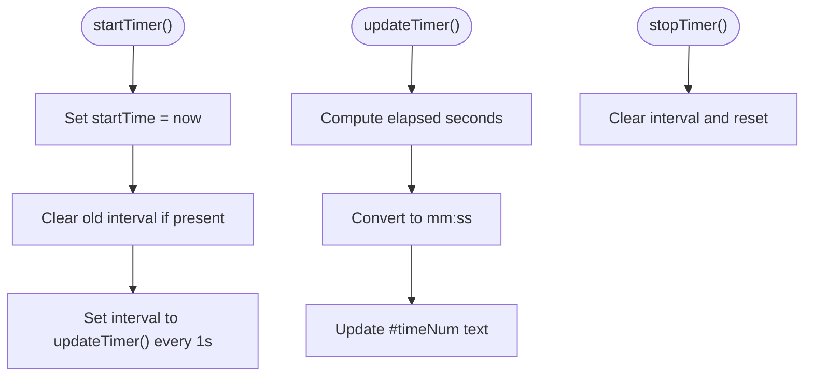

**Diagram sources**
- [index.html:820-835](file://app/src/main/assets/index.html#L820-L835)

**Section sources**
- [index.html:820-835](file://app/src/main/assets/index.html#L820-L835)

### Score Calculation Algorithm
**Updated** The scoring system has been simplified to use a state-based approach:

- computeLevelScore() returns a fixed 10 points for each level completion
- computeScore() adds the level score to the current accumulated score
- No more time-based penalties or move-based deductions
- Score is persisted across levels and sessions

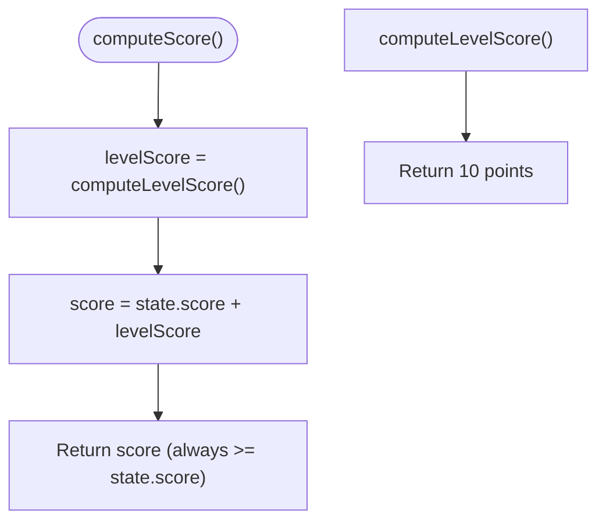

**Diagram sources**
- [index.html:866-872](file://app/src/main/assets/index.html#L866-L872)

**Section sources**
- [index.html:866-872](file://app/src/main/assets/index.html#L866-L872)

### Progress Persistence Mechanisms
- Progress persistence uses localStorage:
  - bsp_level: current level index
  - bsp_score: accumulated score across levels (updated with 10 points per level)
- On continue, the game adds 10 points (computeLevelScore()) to the stored score and advances to the next level or restarts at level 0 when reaching the end.
- Settings toggles (sound, animations, particles) are persisted under bsp_sound, bsp_anim, bsp_particle.

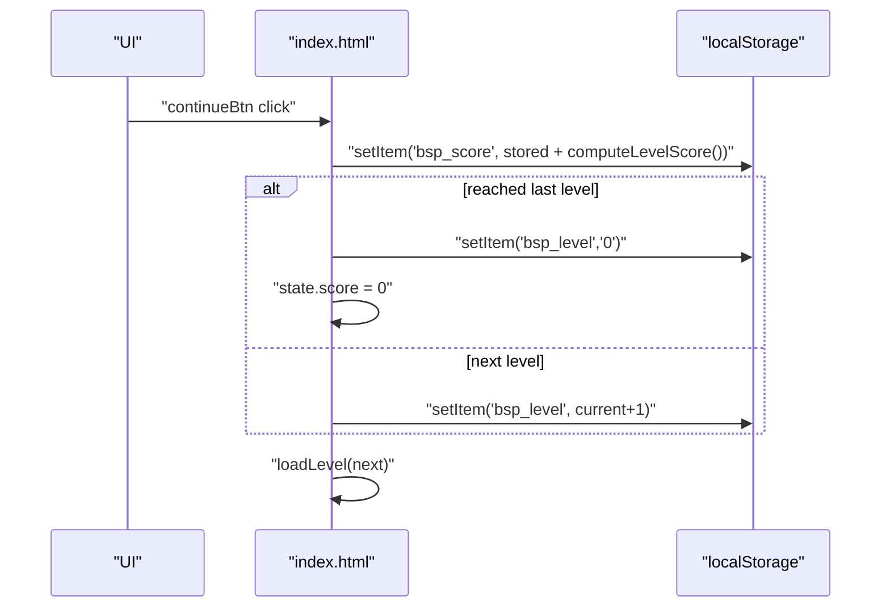

**Diagram sources**
- [index.html:1002-1015](file://app/src/main/assets/index.html#L1002-L1015)

**Section sources**
- [index.html:1002-1015](file://app/src/main/assets/index.html#L1002-L1015)
- [index.html:1076-1083](file://app/src/main/assets/index.html#L1076-L1083)

### UI Rendering System and User Interaction Handling
- renderTubes() builds the DOM for tubes and balls based on current state and viewport.
- Event delegation listens for tube clicks/touches; invalid moves trigger a shake animation.
- Settings modal toggles persist to localStorage and immediately apply to state.
- Back button and screen transitions manage visibility of home/game screens and level-complete overlay.

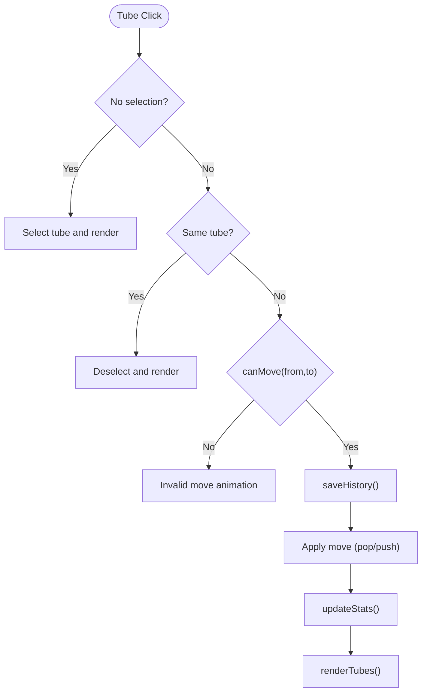

**Diagram sources**
- [index.html:694-755](file://app/src/main/assets/index.html#L694-L755)
- [index.html:578-624](file://app/src/main/assets/index.html#L578-L624)

**Section sources**
- [index.html:694-755](file://app/src/main/assets/index.html#L694-L755)
- [index.html:578-624](file://app/src/main/assets/index.html#L578-L624)

## Dependency Analysis
- Android activity depends on WebView to host the game.
- The game uses localStorage for persistence and Tailwind CSS for styling.
- The JS bridge enables Android to react to level completion events.

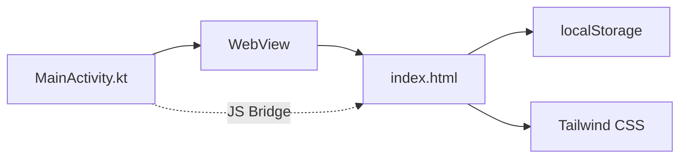

**Diagram sources**
- [MainActivity.kt:106-131](file://app/src/main/java/com/cktechhub/games/MainActivity.kt#L106-L131)
- [index.html:131](file://app/src/main/assets/index.html#L131)

**Section sources**
- [MainActivity.kt:106-131](file://app/src/main/java/com/cktechhub/games/MainActivity.kt#L106-L131)
- [index.html:131](file://app/src/main/assets/index.html#L131)

## Performance Considerations
- History buffer size: capped at 100 snapshots to limit memory usage and keep undo responsive.
- Shallow vs deep copies: saveHistory() clones tubes arrays to avoid accidental mutation of shared references.
- Rendering throttling: tube rendering is debounced on window resize to avoid excessive reflows.
- Timer precision: 1-second intervals minimize CPU overhead while keeping time display smooth.
- Animations: animations are toggled via settings to reduce GPU/CPU load on lower-end devices.
- Simplified scoring: computeLevelScore() is constant-time and lightweight compared to previous time-based calculations.

## Troubleshooting Guide
Common issues and mitigations:
- State corruption prevention
  - Always push a deep copy of state.tubes into history to avoid shared-array mutations.
  - Avoid mutating state.tubes directly outside of saveHistory() and undoMove().
- Memory management for large histories
  - The 100-snapshot cap prevents memory bloat; if you increase capacity, monitor memory usage on low-end devices.
- Undo edge cases
  - Ensure history is not empty before popping; guard against undefined snapshots.
  - After undo, clear selection and re-render to reflect restored state.
- Timer lifecycle
  - Always stop timers on screen transitions and activity lifecycle events to prevent leaks.
- Persistence pitfalls
  - Validate localStorage values before parsing; fallback to defaults if missing.
  - Reset score to zero when restarting from the beginning.
- Scoring system issues
  - computeLevelScore() always returns 10 points; verify score accumulation logic.
  - Ensure localStorage persistence works correctly for score updates.

**Section sources**
- [index.html:757-763](file://app/src/main/assets/index.html#L757-L763)
- [index.html:765-779](file://app/src/main/assets/index.html#L765-L779)
- [index.html:820-835](file://app/src/main/assets/index.html#L820-L835)
- [index.html:1005-1014](file://app/src/main/assets/index.html#L1005-L1014)

## Conclusion
The game employs a clean separation between Android hosting and JavaScript-driven gameplay. The state object, combined with a bounded history buffer, provides robust undo capabilities. The simplified scoring system offers predictable point accumulation with minimal computational overhead, while localStorage ensures progress persistence across sessions. Following the outlined patterns and best practices helps maintain reliability and performance across diverse devices.

## Appendices

### Example References
- State object definition: [index.html:361-377](file://app/src/main/assets/index.html#L361-L377)
- Save history operation: [index.html:757-763](file://app/src/main/assets/index.html#L757-L763)
- Undo operation: [index.html:765-779](file://app/src/main/assets/index.html#L765-L779)
- Timer functions: [index.html:820-835](file://app/src/main/assets/index.html#L820-L835)
- Score calculation: [index.html:866-872](file://app/src/main/assets/index.html#L866-L872)
- Progress persistence: [index.html:1005-1014](file://app/src/main/assets/index.html#L1005-L1014)
- WebView setup and JS bridge: [MainActivity.kt:165-262](file://app/src/main/java/com/cktechhub/games/MainActivity.kt#L165-L262), [MainActivity.kt:209-228](file://app/src/main/java/com/cktechhub/games/MainActivity.kt#L209-L228), [MainActivity.kt:429-439](file://app/src/main/java/com/cktechhub/games/MainActivity.kt#L429-L439)