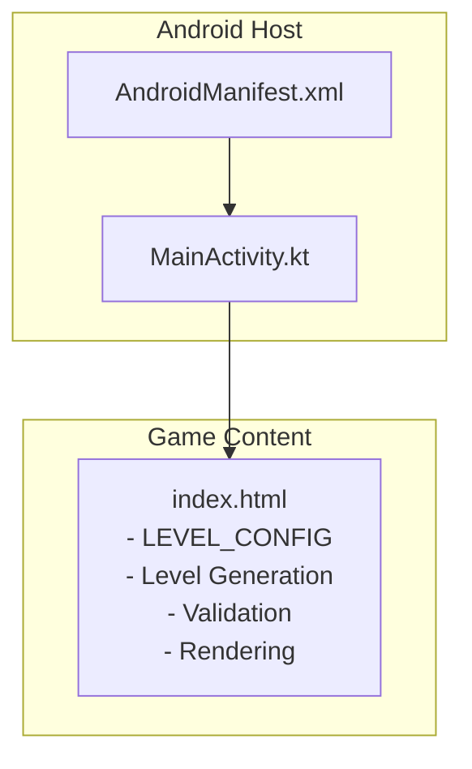
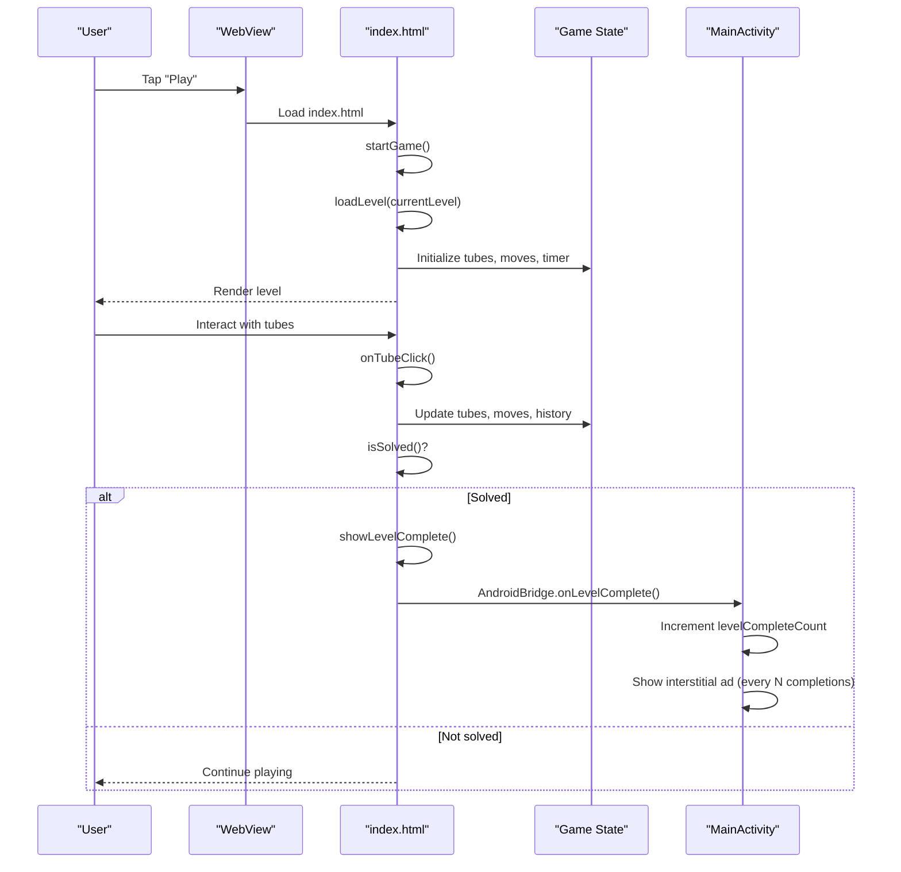
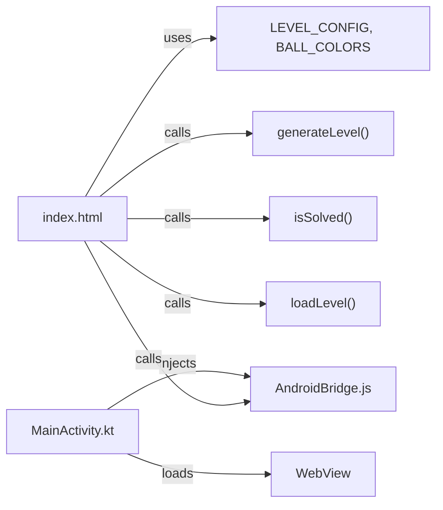

# Level System & Configuration

<cite>
**Referenced Files in This Document**
- [index.html](file://app/src/main/assets/index.html)
- [MainActivity.kt](file://app/src/main/java/com/cktechhub/games/MainActivity.kt)
- [AndroidManifest.xml](file://app/src/main/AndroidManifest.xml)
</cite>

## Table of Contents
1. [Introduction](#introduction)
2. [Project Structure](#project-structure)
3. [Core Components](#core-components)
4. [Architecture Overview](#architecture-overview)
5. [Detailed Component Analysis](#detailed-component-analysis)
6. [Dependency Analysis](#dependency-analysis)
7. [Performance Considerations](#performance-considerations)
8. [Troubleshooting Guide](#troubleshooting-guide)
9. [Conclusion](#conclusion)

## Introduction
This document explains the level system and configuration implementation for the Ball Sort Puzzle game. It focuses on the 15 progressive difficulty levels defined in the LEVEL_CONFIG array, detailing tube count calculations, color distribution algorithms, ball capacity management, and level generation/validation logic. It also covers how levels are loaded and validated, how game state integrates with level progression, and practical guidance for ensuring solvability and fair color distribution.

## Project Structure
The game is a hybrid Android app that hosts a self-contained HTML/JS/CSS game inside a WebView. The level system and gameplay logic live in the HTML file, while the Android host manages WebView lifecycle, permissions, and AdMob integration.

**Diagram sources**
- [MainActivity.kt:42-135](file://app/src/main/java/com/cktechhub/games/MainActivity.kt#L42-L135)
- [AndroidManifest.xml:1-51](file://app/src/main/AndroidManifest.xml#L1-L51)
- [index.html:321-543](file://app/src/main/assets/index.html#L321-L543)

**Section sources**
- [MainActivity.kt:42-135](file://app/src/main/java/com/cktechhub/games/MainActivity.kt#L42-L135)
- [AndroidManifest.xml:1-51](file://app/src/main/AndroidManifest.xml#L1-L51)
- [index.html:321-543](file://app/src/main/assets/index.html#L321-L543)

## Core Components
- LEVEL_CONFIG: Defines 15 levels with explicit tube counts, color counts, and balls per color. These parameters drive tube capacity and total ball counts.
- generateLevel(levelIdx): Builds a level from LEVEL_CONFIG by computing tube capacity, ensuring enough empty tubes, selecting colors, building a shuffled ball pool, filling tubes, and guaranteeing unsolved state.
- isSolved(tubes, tubeCapacity, colors): Validates whether all non-empty tubes are full and monochromatic.
- loadLevel(idx): Loads a level into state, initializes timers, and renders the game board.
- Game state and rendering: Tracks current level, tubes, selected tube, moves, score, and UI updates.

Key implementation references:
- Level configuration and constants: [LEVEL_CONFIG:325-341](file://app/src/main/assets/index.html#L325-L341)
- Level generation and validation: [generateLevel:482-531](file://app/src/main/assets/index.html#L482-L531), [isSolved:533-543](file://app/src/main/assets/index.html#L533-L543)
- Level loading and state: [loadLevel:908-927](file://app/src/main/assets/index.html#L908-L927)

**Section sources**
- [index.html:325-341](file://app/src/main/assets/index.html#L325-L341)
- [index.html:482-531](file://app/src/main/assets/index.html#L482-L531)
- [index.html:533-543](file://app/src/main/assets/index.html#L533-L543)
- [index.html:908-927](file://app/src/main/assets/index.html#L908-L927)

## Architecture Overview
The level system is embedded in the HTML/JS game logic. The Android MainActivity loads the game page into a WebView and bridges JavaScript events to Android (e.g., level completion triggers interstitial ads). The game’s own logic handles level progression, generation, and validation.

**Diagram sources**
- [index.html:929-935](file://app/src/main/assets/index.html#L929-L935)
- [index.html:908-927](file://app/src/main/assets/index.html#L908-L927)
- [index.html:694-755](file://app/src/main/assets/index.html#L694-L755)
- [index.html:853-881](file://app/src/main/assets/index.html#L853-L881)
- [MainActivity.kt:428-439](file://app/src/main/java/com/cktechhub/games/MainActivity.kt#L428-L439)

**Section sources**
- [index.html:929-935](file://app/src/main/assets/index.html#L929-L935)
- [index.html:908-927](file://app/src/main/assets/index.html#L908-L927)
- [index.html:694-755](file://app/src/main/assets/index.html#L694-L755)
- [index.html:853-881](file://app/src/main/assets/index.html#L853-L881)
- [MainActivity.kt:428-439](file://app/src/main/java/com/cktechhub/games/MainActivity.kt#L428-L439)

## Detailed Component Analysis

### Level Configuration: LEVEL_CONFIG
- Purpose: Define 15 levels with explicit parameters:
  - tubes: Initial tube count for the level
  - colors: Number of distinct colors used
  - ballsPerColor: Tube capacity (and balls per color)
- How it drives difficulty:
  - Tubes increase progressively (3–8)
  - Colors increase progressively (2–8)
  - Balls per color increases progressively (3–8)
- Notes:
  - Some entries indicate “empty” adjustments in comments (e.g., “+1 empty”), which are handled programmatically during generation.

Implementation references:
- [LEVEL_CONFIG array:325-341](file://app/src/main/assets/index.html#L325-L341)

**Section sources**
- [index.html:325-341](file://app/src/main/assets/index.html#L325-L341)

### Tube Count Calculations and Capacity Management
- Tube capacity: Derived from ballsPerColor for each level.
- Minimum tube count: Ensures enough tubes to hold all balls plus at least 1–2 extra empty tubes.
- Occupied vs. total tubes:
  - occupiedTubes = ceil(totalBalls / tubeCapacity)
  - tubeCount = max(tubeCountFromConfig, occupiedTubes + 1)

Implementation references:
- [Tube capacity and count calculation:482-494](file://app/src/main/assets/index.html#L482-L494)

**Section sources**
- [index.html:482-494](file://app/src/main/assets/index.html#L482-L494)

### Color Distribution Algorithm
- Select colors:
  - Randomly pick colors from BALL_COLORS equal to the level’s colors.
- Fairness:
  - Each color appears exactly ballsPerColor times.
  - The ball pool is shuffled to distribute colors randomly across tubes.

Implementation references:
- [Color selection and ball pool creation:495-505](file://app/src/main/assets/index.html#L495-L505)

**Section sources**
- [index.html:495-505](file://app/src/main/assets/index.html#L495-L505)

### Ball Pool Generation and Tube Filling
- Ball pool construction:
  - Repeat each color index ballsPerColor times.
  - Shuffle the pool.
- Tube filling:
  - Fill tubes sequentially up to tubeCapacity.
  - Distribute remaining balls into existing tubes (up to capacity).
  - Add empty tubes to meet tubeCount.

Implementation references:
- [Ball pool and tube filling:500-524](file://app/src/main/assets/index.html#L500-L524)

**Section sources**
- [index.html:500-524](file://app/src/main/assets/index.html#L500-L524)

### Solvability Check and Validation Mechanisms
- isSolved():
  - Skips empty tubes.
  - Requires all non-empty tubes to be full (length equals tubeCapacity).
  - Requires each non-empty tube to be monochromatic.
  - Requires exactly as many solved colors as the level’s colors.
- Safety:
  - If generated level is already solved, regenerate the level to ensure solvability.

Implementation references:
- [isSolved validation:533-543](file://app/src/main/assets/index.html#L533-L543)
- [Safety guard against pre-solved levels:525-528](file://app/src/main/assets/index.html#L525-L528)

**Section sources**
- [index.html:533-543](file://app/src/main/assets/index.html#L533-L543)
- [index.html:525-528](file://app/src/main/assets/index.html#L525-L528)

### Level Progression Logic and Game State Integration
- loadLevel(idx):
  - Resets state (current level, moves, history, selected tube, solved flag).
  - Generates a new level and stores initial state for restarts.
  - Starts the timer and updates UI.
- Level progression:
  - After completing a level, the player can continue to the next level or replay.
  - Progress is persisted in localStorage (level index and score).

Implementation references:
- [loadLevel and state reset:908-927](file://app/src/main/assets/index.html#L908-L927)

**Section sources**
- [index.html:908-927](file://app/src/main/assets/index.html#L908-L927)

### Rendering and Move Validation
- Rendering:
  - Computes tube dimensions based on screen size and tube count.
  - Renders balls bottom-to-top and applies visual states (selected, valid target, complete).
- Move validation:
  - isValidTarget(ti): Checks if a tube can receive the selected ball.
  - canMove(from, to): Enforces capacity, emptiness, and color match rules.

Implementation references:
- [Rendering and dimensions:548-576](file://app/src/main/assets/index.html#L548-L576)
- [Validation helpers:626-645](file://app/src/main/assets/index.html#L626-L645)

**Section sources**
- [index.html:548-576](file://app/src/main/assets/index.html#L548-L576)
- [index.html:626-645](file://app/src/main/assets/index.html#L626-L645)

### Android Bridge and Ads on Level Completion
- JavaScript-to-Android bridge:
  - The game injects a function that wraps showLevelComplete to notify Android.
  - MainActivity receives onLevelComplete and increments a counter to trigger interstitial ads periodically.

Implementation references:
- [JS bridge injection:214-228](file://app/src/main/assets/index.html#L214-L228)
- [AdBridge.onLevelComplete:428-439](file://app/src/main/java/com/cktechhub/games/MainActivity.kt#L428-L439)

**Section sources**
- [index.html:214-228](file://app/src/main/assets/index.html#L214-L228)
- [MainActivity.kt:428-439](file://app/src/main/java/com/cktechhub/games/MainActivity.kt#L428-L439)

## Dependency Analysis
- index.html depends on:
  - Its own constants (LEVEL_CONFIG, BALL_COLORS)
  - Internal functions (shuffle, generateLevel, isSolved, loadLevel)
  - DOM/UI for rendering and event handling
- MainActivity depends on:
  - WebView to host index.html
  - AdMob SDK for banner and interstitial ads
  - AndroidBridge to receive level completion signals

**Diagram sources**
- [index.html:325-356](file://app/src/main/assets/index.html#L325-L356)
- [index.html:482-531](file://app/src/main/assets/index.html#L482-L531)
- [index.html:533-543](file://app/src/main/assets/index.html#L533-L543)
- [index.html:908-927](file://app/src/main/assets/index.html#L908-L927)
- [MainActivity.kt:165-263](file://app/src/main/java/com/cktechhub/games/MainActivity.kt#L165-L263)

**Section sources**
- [index.html:325-356](file://app/src/main/assets/index.html#L325-L356)
- [index.html:482-531](file://app/src/main/assets/index.html#L482-L531)
- [index.html:533-543](file://app/src/main/assets/index.html#L533-L543)
- [index.html:908-927](file://app/src/main/assets/index.html#L908-L927)
- [MainActivity.kt:165-263](file://app/src/main/java/com/cktechhub/games/MainActivity.kt#L165-L263)

## Performance Considerations
- Level generation:
  - Shuffle operations are O(n) per array.
  - Tube filling loops are O(totalBalls).
  - isSolved scans all tubes once; complexity is O(totalBalls).
- Rendering:
  - getTubeDimensions computes sizes based on screen metrics and tube count; complexity is O(1) per call.
  - renderTubes rebuilds DOM nodes each frame; keep re-render calls minimal.
- Recommendations:
  - Avoid unnecessary re-renders by batching state updates.
  - Cache computed dimensions when screen size is stable.
  - Consider lazy initialization of expensive UI elements.

[No sources needed since this section provides general guidance]

## Troubleshooting Guide
Common issues and resolutions:
- Level appears already solved:
  - Cause: Generated configuration yields a trivial solution.
  - Fix: The generator regenerates the level if isSolved returns true.
  - References: [Safety guard:525-528](file://app/src/main/assets/index.html#L525-L528)
- Empty tube requirement not met:
  - Cause: tubeCountFromConfig does not account for required empty tubes.
  - Fix: The generator ensures tubeCount ≥ occupiedTubes + 1.
  - References: [Tube count adjustment:492-494](file://app/src/main/assets/index.html#L492-L494)
- Color distribution unfair:
  - Cause: Misconfigured ballsPerColor or color count.
  - Fix: Ensure ballsPerColor equals tubeCapacity and colors matches the intended palette.
  - References: [Color selection:495-498](file://app/src/main/assets/index.html#L495-L498)
- Move validation errors:
  - Cause: Attempting to move to a full tube or mismatched color.
  - Fix: Use canMove to validate; ensure tubeCapacity is consistent with ballsPerColor.
  - References: [canMove:637-645](file://app/src/main/assets/index.html#L637-L645)
- Ads not triggering:
  - Cause: Missing bridge injection or incorrect callback wrapping.
  - Fix: Verify the injected script and AndroidBridge.onLevelComplete.
  - References: [JS bridge injection:214-228](file://app/src/main/assets/index.html#L214-L228), [AdBridge:428-439](file://app/src/main/java/com/cktechhub/games/MainActivity.kt#L428-L439)

**Section sources**
- [index.html:525-528](file://app/src/main/assets/index.html#L525-L528)
- [index.html:492-494](file://app/src/main/assets/index.html#L492-L494)
- [index.html:495-498](file://app/src/main/assets/index.html#L495-L498)
- [index.html:637-645](file://app/src/main/assets/index.html#L637-L645)
- [index.html:214-228](file://app/src/main/assets/index.html#L214-L228)
- [MainActivity.kt:428-439](file://app/src/main/java/com/cktechhub/games/MainActivity.kt#L428-L439)

## Conclusion
The level system is a compact, deterministic engine driven by LEVEL_CONFIG. It calculates tube capacity and counts, constructs a balanced ball pool, fills tubes fairly, and guarantees solvability. The Android host integrates seamlessly with the game via a lightweight JavaScript bridge for analytics and monetization. This design offers a clear path for extending difficulty, adding new levels, and maintaining fairness and solvability.