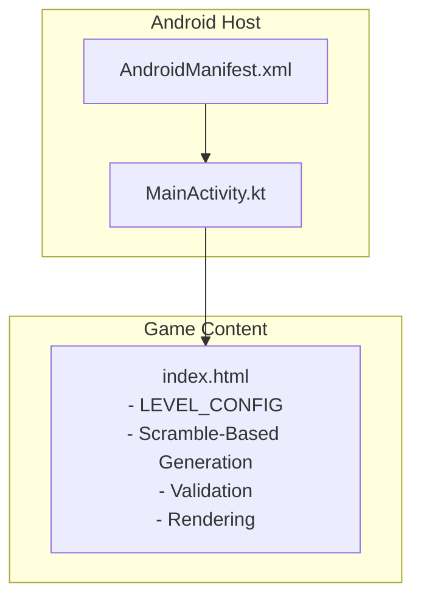
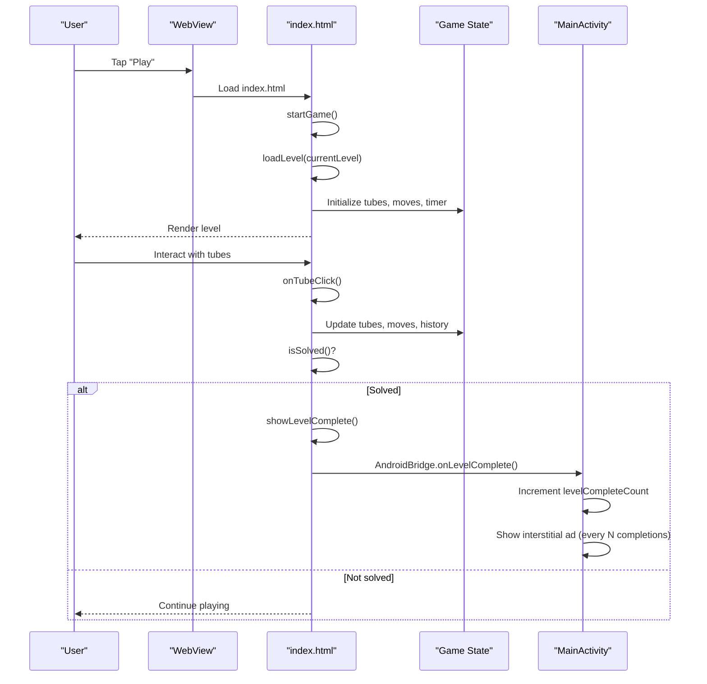
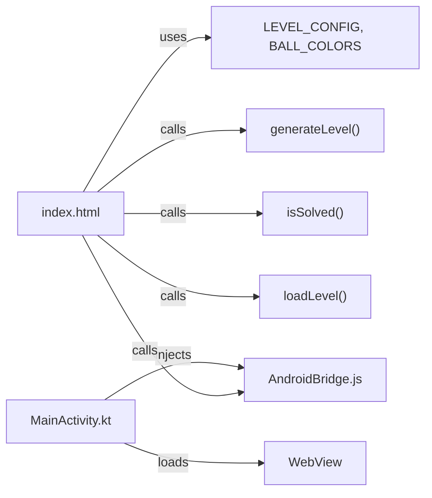

# Level System & Configuration

<cite>
**Referenced Files in This Document**
- [index.html](file://app/src/main/assets/index.html)
- [MainActivity.kt](file://app/src/main/java/com/cktechhub/games/MainActivity.kt)
- [AndroidManifest.xml](file://app/src/main/AndroidManifest.xml)
</cite>

## Update Summary
**Changes Made**
- Updated Level Configuration section to reflect new explicit empty tube management
- Enhanced Level Generation Algorithm section with scramble-based approach
- Added Difficulty Scaling section explaining level progression mechanics
- Updated Tube Management section with explicit empty tube counting
- Revised Level Progression Logic to include scramble-based difficulty scaling

## Table of Contents
1. [Introduction](#introduction)
2. [Project Structure](#project-structure)
3. [Core Components](#core-components)
4. [Architecture Overview](#architecture-overview)
5. [Detailed Component Analysis](#detailed-component-analysis)
6. [Dependency Analysis](#dependency-analysis)
7. [Performance Considerations](#performance-considerations)
8. [Troubleshooting Guide](#troubleshooting-guide)
9. [Conclusion](#conclusion)

## Introduction
This document explains the level system and configuration implementation for the Ball Sort Puzzle game. It focuses on the 15 progressive difficulty levels defined in the LEVEL_CONFIG array, detailing tube count calculations, color distribution algorithms, ball capacity management, and level generation/validation logic. The system now features an enhanced scramble-based generation algorithm with explicit empty tube management and progressive difficulty scaling based on level progression.

## Project Structure
The game is a hybrid Android app that hosts a self-contained HTML/JS/CSS game inside a WebView. The level system and gameplay logic live in the HTML file, while the Android host manages WebView lifecycle, permissions, and AdMob integration.

**Diagram sources**
- [MainActivity.kt:42-135](file://app/src/main/java/com/cktechhub/games/MainActivity.kt#L42-L135)
- [AndroidManifest.xml:1-51](file://app/src/main/AndroidManifest.xml#L1-L51)
- [index.html:321-543](file://app/src/main/assets/index.html#L321-L543)

**Section sources**
- [MainActivity.kt:42-135](file://app/src/main/java/com/cktechhub/games/MainActivity.kt#L42-L135)
- [AndroidManifest.xml:1-51](file://app/src/main/AndroidManifest.xml#L1-L51)
- [index.html:321-543](file://app/src/main/assets/index.html#L321-L543)

## Core Components
- LEVEL_CONFIG: Defines 15 levels with explicit tube counts, color counts, balls per color, and empty tube management. These parameters drive tube capacity, total ball counts, and difficulty progression.
- generateLevel(levelIdx): Builds a level from LEVEL_CONFIG by computing tube capacity, ensuring explicit empty tubes, scrambling from solved state, and guaranteeing unsolved state.
- isSolved(tubes, tubeCapacity, colors): Validates whether all non-empty tubes are full and monochromatic.
- loadLevel(idx): Loads a level into state, initializes timers, and renders the game board.
- Game state and rendering: Tracks current level, tubes, selected tube, moves, score, and UI updates.

Key implementation references:
- Level configuration and constants: [LEVEL_CONFIG:377-393](file://app/src/main/assets/index.html#L377-L393)
- Level generation and validation: [generateLevel:613-690](file://app/src/main/assets/index.html#L613-L690), [isSolved:692-702](file://app/src/main/assets/index.html#L692-L702)
- Level loading and state: [loadLevel:1089-1108](file://app/src/main/assets/index.html#L1089-L1108)

**Section sources**
- [index.html:377-393](file://app/src/main/assets/index.html#L377-L393)
- [index.html:613-690](file://app/src/main/assets/index.html#L613-L690)
- [index.html:692-702](file://app/src/main/assets/index.html#L692-L702)
- [index.html:1089-1108](file://app/src/main/assets/index.html#L1089-L1108)

## Architecture Overview
The level system is embedded in the HTML/JS game logic. The Android MainActivity loads the game page into a WebView and bridges JavaScript events to Android (e.g., level completion triggers interstitial ads). The game's own logic handles level progression, generation, and validation with enhanced scramble-based algorithms.

**Diagram sources**
- [index.html:1187-1208](file://app/src/main/assets/index.html#L1187-L1208)
- [index.html:1089-1108](file://app/src/main/assets/index.html#L1089-L1108)
- [index.html:869-930](file://app/src/main/assets/index.html#L869-L930)
- [index.html:1027-1061](file://app/src/main/assets/index.html#L1027-L1061)
- [MainActivity.kt:428-439](file://app/src/main/java/com/cktechhub/games/MainActivity.kt#L428-L439)

**Section sources**
- [index.html:1187-1208](file://app/src/main/assets/index.html#L1187-L1208)
- [index.html:1089-1108](file://app/src/main/assets/index.html#L1089-L1108)
- [index.html:869-930](file://app/src/main/assets/index.html#L869-L930)
- [index.html:1027-1061](file://app/src/main/assets/index.html#L1027-L1061)
- [MainActivity.kt:428-439](file://app/src/main/java/com/cktechhub/games/MainActivity.kt#L428-L439)

## Detailed Component Analysis

### Level Configuration: LEVEL_CONFIG
- Purpose: Define 15 levels with explicit parameters:
  - colors: Number of distinct colors used
  - ballsPerColor: Tube capacity (and balls per color)
  - emptyTubes: Explicit count of empty tubes for each level
- How it drives difficulty:
  - Colors increase progressively (2–8)
  - Balls per color increases progressively (3–5)
  - Empty tubes remain constant at 2 for all levels
  - Explicit empty tube management ensures consistent difficulty scaling
- Notes:
  - Levels 4, 9, and 12 include "harder scramble" comments indicating increased difficulty through more complex scrambling

Implementation references:
- [LEVEL_CONFIG array:377-393](file://app/src/main/assets/index.html#L377-L393)

**Section sources**
- [index.html:377-393](file://app/src/main/assets/index.html#L377-L393)

### Enhanced Level Generation Algorithm with Scramble-Based Approach
- Scramble-based generation:
  - Start from a solved state with each color in its own tube
  - Generate explicit empty tubes based on configuration
  - Apply random valid moves from the solved state to create scrambled puzzles
  - Scale scramble complexity based on level progression
- Scramble complexity scaling:
  - Base scramble moves: 50 + (levelIdx × 30)
  - Higher levels generate more random moves for increased difficulty
  - Ensures puzzle is solvable while providing appropriate challenge
- Safety mechanisms:
  - Regenerate if puzzle becomes solved prematurely
  - Prevent completion of tubes during scrambling phase

Implementation references:
- [Scramble-based generation:613-690](file://app/src/main/assets/index.html#L613-L690)

**Updated** Enhanced with explicit empty tube management and progressive scramble complexity

**Section sources**
- [index.html:613-690](file://app/src/main/assets/index.html#L613-L690)

### Tube Management with Explicit Empty Tube Counts
- Tube capacity: Derived from ballsPerColor for each level
- Tube count calculation: tubeCount = colors + emptyTubes (explicit configuration)
- Empty tube management:
  - Explicit empty tube count per level (constant 2 for all levels)
  - Ensures consistent difficulty progression
  - Provides predictable puzzle structure
- Tube distribution:
  - Colors are placed in separate tubes initially
  - Empty tubes are added to meet configured tubeCount
  - Scrambling occurs across all tubes including empty ones

Implementation references:
- [Tube management:613-641](file://app/src/main/assets/index.html#L613-L641)

**Updated** Now includes explicit empty tube management with configurable counts

**Section sources**
- [index.html:613-641](file://app/src/main/assets/index.html#L613-L641)

### Color Distribution Algorithm
- Select colors:
  - Randomly pick colors from BALL_COLORS equal to the level's colors
  - Use harmonized order with level-based offset for variety
  - Store both color objects and indices for theme switching
- Fairness:
  - Each color appears exactly ballsPerColor times
  - Ball pool is created from solved state and then scrambled
  - Theme-based color selection maintains visual consistency

Implementation references:
- [Color selection:619-631](file://app/src/main/assets/index.html#L619-L631)

**Section sources**
- [index.html:619-631](file://app/src/main/assets/index.html#L619-L631)

### Ball Pool Generation and Tube Filling
- Ball pool construction:
  - Create solved state with ballsPerColor balls of each color
  - Explicitly add empty tubes based on configuration
  - Scramble by applying random valid moves from solved state
- Tube filling:
  - Start with solved state (colors in separate tubes)
  - Apply scramble moves to distribute balls randomly
  - Maintain tubeCapacity constraints throughout process
  - Ensure final state meets level requirements

Implementation references:
- [Ball pool and tube filling:633-672](file://app/src/main/assets/index.html#L633-L672)

**Section sources**
- [index.html:633-672](file://app/src/main/assets/index.html#L633-L672)

### Solvability Check and Validation Mechanisms
- isSolved():
  - Skips empty tubes
  - Requires all non-empty tubes to be full (length equals tubeCapacity)
  - Requires each non-empty tube to be monochromatic
  - Requires exactly as many solved colors as the level's colors
- Safety:
  - Regenerate level if already solved after scrambling
  - Prevent completion of tubes during scrambling phase
  - Ensure puzzle remains solvable throughout generation

Implementation references:
- [isSolved validation:692-702](file://app/src/main/assets/index.html#L692-L702)
- [Safety guards:674-687](file://app/src/main/assets/index.html#L674-L687)

**Section sources**
- [index.html:692-702](file://app/src/main/assets/index.html#L692-L702)
- [index.html:674-687](file://app/src/main/assets/index.html#L674-L687)

### Level Progression Logic and Game State Integration
- loadLevel(idx):
  - Resets state (current level, moves, history, selected tube, solved flag)
  - Generates new level with scramble-based algorithm
  - Stores initial state for restart functionality
  - Starts timer and updates UI
- Level progression:
  - Progress tracked via localStorage (level index and score)
  - Automatic progression to next level after completion
  - Reset to level 0 after completing final level
  - Score accumulation with level completion bonuses

Implementation references:
- [loadLevel and state reset:1089-1108](file://app/src/main/assets/index.html#L1089-L1108)

**Section sources**
- [index.html:1089-1108](file://app/src/main/assets/index.html#L1089-L1108)

### Rendering and Move Validation
- Rendering:
  - Computes tube dimensions based on screen size and tube count
  - Renders balls bottom-to-top with visual effects
  - Applies theme styling and animations
- Move validation:
  - isValidTarget(ti): Checks if tube can receive selected ball
  - canMove(from, to): Enforces capacity, emptiness, and color match rules
  - Supports undo functionality with history tracking

Implementation references:
- [Rendering and dimensions:707-799](file://app/src/main/assets/index.html#L707-L799)
- [Validation helpers:807-820](file://app/src/main/assets/index.html#L807-L820)

**Section sources**
- [index.html:707-799](file://app/src/main/assets/index.html#L707-L799)
- [index.html:807-820](file://app/src/main/assets/index.html#L807-L820)

### Android Bridge and Ads on Level Completion
- JavaScript-to-Android bridge:
  - Game injects function to wrap showLevelComplete for Android notification
  - MainActivity receives onLevelComplete and increments completion counter
  - Interstitial ads shown based on configurable frequency
- Ad frequency control:
  - Default frequency: every 2 level completions
  - Configurable via INTERSTITIAL_FREQUENCY constant
  - Automatic ad pre-loading for seamless experience

Implementation references:
- [JS bridge injection:215-229](file://app/src/main/assets/index.html#L215-L229)
- [AdBridge.onLevelComplete:428-439](file://app/src/main/java/com/cktechhub/games/MainActivity.kt#L428-L439)

**Section sources**
- [index.html:215-229](file://app/src/main/assets/index.html#L215-L229)
- [MainActivity.kt:428-439](file://app/src/main/java/com/cktechhub/games/MainActivity.kt#L428-L439)

## Dependency Analysis
- index.html depends on:
  - Its own constants (LEVEL_CONFIG, BALL_COLORS)
  - Internal functions (shuffle, generateLevel, isSolved, loadLevel)
  - DOM/UI for rendering and event handling
- MainActivity depends on:
  - WebView to host index.html
  - AdMob SDK for banner and interstitial ads
  - AndroidBridge to receive level completion signals

**Diagram sources**
- [index.html:377-485](file://app/src/main/assets/index.html#L377-L485)
- [index.html:613-690](file://app/src/main/assets/index.html#L613-L690)
- [index.html:692-702](file://app/src/main/assets/index.html#L692-L702)
- [index.html:1089-1108](file://app/src/main/assets/index.html#L1089-L1108)
- [MainActivity.kt:165-263](file://app/src/main/java/com/cktechhub/games/MainActivity.kt#L165-L263)

**Section sources**
- [index.html:377-485](file://app/src/main/assets/index.html#L377-L485)
- [index.html:613-690](file://app/src/main/assets/index.html#L613-L690)
- [index.html:692-702](file://app/src/main/assets/index.html#L692-L702)
- [index.html:1089-1108](file://app/src/main/assets/index.html#L1089-L1108)
- [MainActivity.kt:165-263](file://app/src/main/java/com/cktechhub/games/MainActivity.kt#L165-L263)

## Performance Considerations
- Level generation:
  - Scramble-based algorithm: O(scrambleMoves × tubes) complexity
  - Base scramble moves: 50 + (levelIdx × 30) per level
  - Tube filling loops: O(totalBalls) with explicit empty tube management
  - isSolved scans all tubes once; complexity is O(totalBalls)
- Rendering:
  - getTubeDimensions computes sizes based on screen metrics and tube count
  - renderTubes rebuilds DOM nodes each frame; complexity O(tubes × ballsPerColor)
- Recommendations:
  - Scramble complexity scales linearly with level progression
  - Empty tube management reduces generation overhead
  - Consider caching computed dimensions for performance optimization

## Troubleshooting Guide
Common issues and resolutions:
- Level appears already solved:
  - Cause: Generated configuration yields trivial solution
  - Fix: Scramble-based algorithm prevents immediate solution
  - References: [Safety guards:674-687](file://app/src/main/assets/index.html#L674-L687)
- Empty tube requirement not met:
  - Cause: Incorrect tubeCount calculation
  - Fix: Explicit empty tube management ensures correct count
  - References: [Tube management:617-641](file://app/src/main/assets/index.html#L617-L641)
- Color distribution unfair:
  - Cause: Misconfigured ballsPerColor or color count
  - Fix: Ensure ballsPerColor equals tubeCapacity and colors matches intended palette
  - References: [Color selection:619-631](file://app/src/main/assets/index.html#L619-L631)
- Scramble complexity issues:
  - Cause: Insufficient scramble moves for higher levels
  - Fix: Progressive difficulty scaling with base 50 + (levelIdx × 30) moves
  - References: [Scramble calculation:645](file://app/src/main/assets/index.html#L645)
- Move validation errors:
  - Cause: Attempting to move to full tube or mismatched color
  - Fix: Use canMove validation; ensure tubeCapacity consistent with ballsPerColor
  - References: [canMove:812-820](file://app/src/main/assets/index.html#L812-L820)
- Ads not triggering:
  - Cause: Missing bridge injection or incorrect callback wrapping
  - Fix: Verify injected script and AndroidBridge.onLevelComplete
  - References: [JS bridge injection:215-229](file://app/src/main/assets/index.html#L215-L229), [AdBridge:428-439](file://app/src/main/java/com/cktechhub/games/MainActivity.kt#L428-L439)

**Section sources**
- [index.html:674-687](file://app/src/main/assets/index.html#L674-L687)
- [index.html:617-641](file://app/src/main/assets/index.html#L617-L641)
- [index.html:619-631](file://app/src/main/assets/index.html#L619-L631)
- [index.html:645](file://app/src/main/assets/index.html#L645)
- [index.html:812-820](file://app/src/main/assets/index.html#L812-L820)
- [index.html:215-229](file://app/src/main/assets/index.html#L215-L229)
- [MainActivity.kt:428-439](file://app/src/main/java/com/cktechhub/games/MainActivity.kt#L428-L439)

## Conclusion
The level system is a sophisticated, scramble-based engine driven by LEVEL_CONFIG with explicit empty tube management. It calculates tube capacity and counts, constructs balanced ball pools, scrambles from solved states with progressive difficulty scaling, and guarantees solvability. The enhanced algorithm provides consistent difficulty progression through increased scramble complexity for higher levels while maintaining predictable tube management. The Android host integrates seamlessly with the game via a lightweight JavaScript bridge for analytics and monetization, offering a clear path for extending difficulty, adding new levels, and maintaining fairness and solvability.