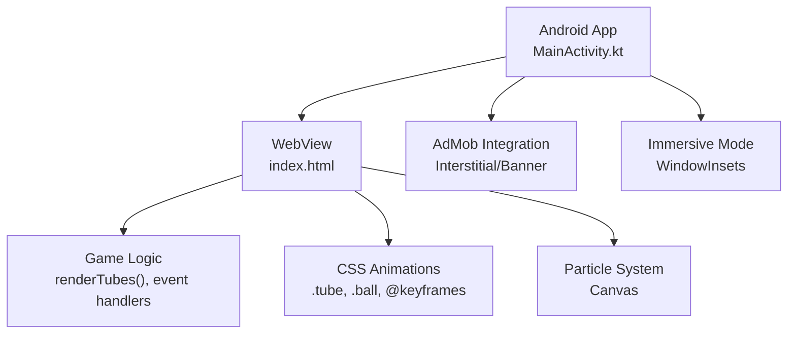
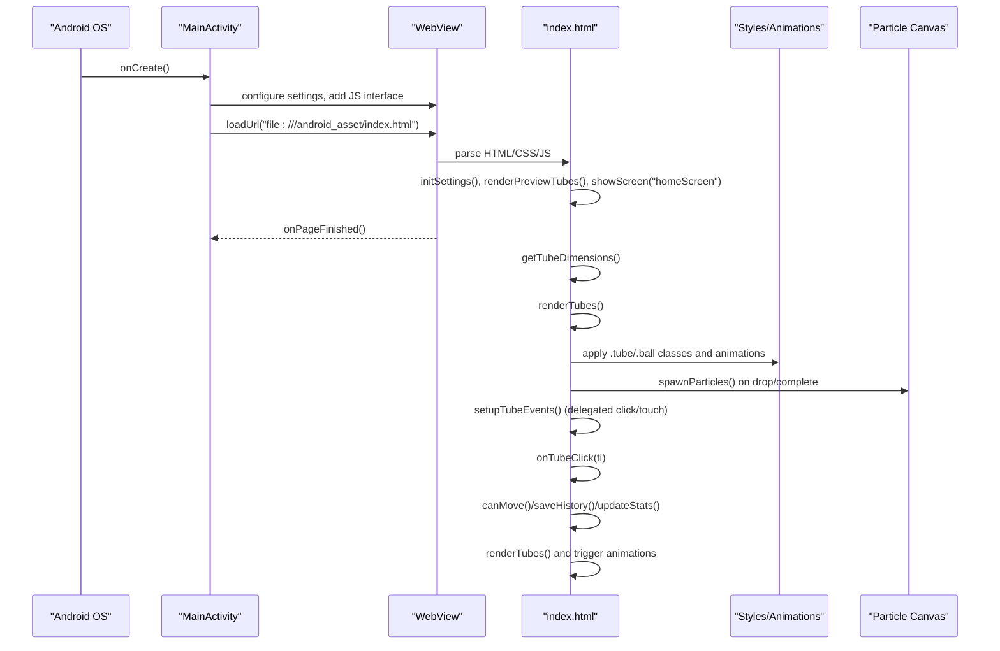
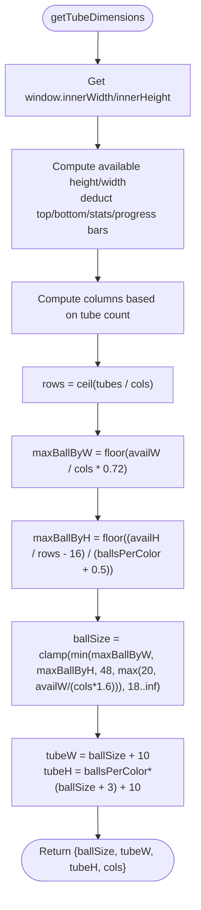
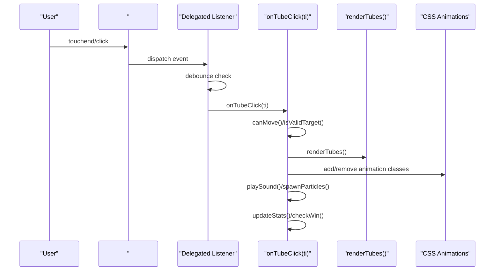
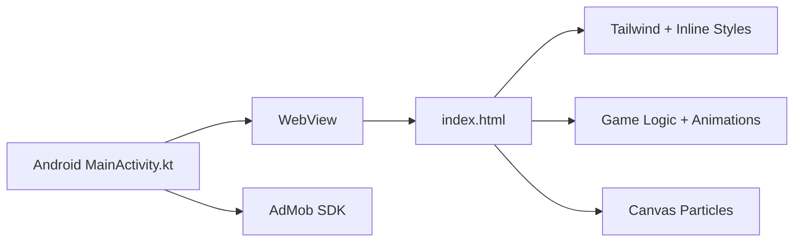

# Rendering & UI System

<cite>
**Referenced Files in This Document**
- [MainActivity.kt](file://app/src/main/java/com/cktechhub/games/MainActivity.kt)
- [index.html](file://app/src/main/assets/index.html)
- [AndroidManifest.xml](file://app/src/main/AndroidManifest.xml)
- [build.gradle.kts](file://app/build.gradle.kts)
- [settings.gradle.kts](file://settings.gradle.kts)
</cite>

## Table of Contents
1. [Introduction](#introduction)
2. [Project Structure](#project-structure)
3. [Core Components](#core-components)
4. [Architecture Overview](#architecture-overview)
5. [Detailed Component Analysis](#detailed-component-analysis)
6. [Dependency Analysis](#dependency-analysis)
7. [Performance Considerations](#performance-considerations)
8. [Troubleshooting Guide](#troubleshooting-guide)
9. [Conclusion](#conclusion)

## Introduction
This document explains the rendering system and UI implementation for a mobile puzzle game embedded in an Android WebView. It focuses on:
- Responsive tube rendering algorithm and dynamic sizing calculations
- Ball positioning logic inside tubes
- Event delegation for tube interactions, touch/click handling, and user feedback
- Integration with CSS animations and visual effect triggers
- Practical guidance for performance optimization, responsive layout adaptation, and cross-device compatibility

The rendering engine is implemented in a single HTML file loaded by the Android app’s WebView. The Android layer handles immersive UI, ad integration, and lifecycle events, while the HTML/CSS/JS layer manages the game logic, rendering, and animations.

## Project Structure
The project consists of:
- An Android app module that hosts a WebView and loads a local HTML page
- A single HTML file containing the entire game logic, rendering, and UI styles
- Minimal native dependencies for ads and window controls

**Diagram sources**
- [MainActivity.kt:66-135](file://app/src/main/java/com/cktechhub/games/MainActivity.kt#L66-L135)
- [index.html:548-624](file://app/src/main/assets/index.html#L548-L624)
- [index.html:8-203](file://app/src/main/assets/index.html#L8-L203)

**Section sources**
- [MainActivity.kt:42-154](file://app/src/main/java/com/cktechhub/games/MainActivity.kt#L42-L154)
- [index.html:1-203](file://app/src/main/assets/index.html#L1-L203)

## Core Components
- Rendering pipeline: calculates tube/ball sizes, lays out tubes, and renders balls with gradients and shadows
- Event delegation: centralized handler for tube clicks/touches with debouncing and feedback
- Animation triggers: CSS animations for selection, completion, invalid moves, undo, and particle effects
- Responsive layout: adaptive columns, gaps, and ball sizes based on viewport and tube count
- Particle system: offscreen canvas for animated particle bursts
- Audio feedback: Web Audio API-generated sounds for pick/drop/invalid/win

Key implementation references:
- [getTubeDimensions():548-576](file://app/src/main/assets/index.html#L548-L576)
- [renderTubes():578-624](file://app/src/main/assets/index.html#L578-L624)
- [Event delegation setup:664-689](file://app/src/main/assets/index.html#L664-L689)
- [onTubeClick():694-755](file://app/src/main/assets/index.html#L694-L755)
- [CSS animations:8-203](file://app/src/main/assets/index.html#L8-L203)
- [Particle system:426-469](file://app/src/main/assets/index.html#L426-L469)

**Section sources**
- [index.html:548-624](file://app/src/main/assets/index.html#L548-L624)
- [index.html:664-755](file://app/src/main/assets/index.html#L664-L755)
- [index.html:8-203](file://app/src/main/assets/index.html#L8-L203)
- [index.html:426-469](file://app/src/main/assets/index.html#L426-L469)

## Architecture Overview
The rendering and UI system is a hybrid of Android and web technologies:
- Android initializes the WebView, sets immersive mode, and injects a JavaScript bridge for ad triggers
- The WebView loads index.html, which defines the game screens, styles, animations, and logic
- The game logic computes dimensions, renders tubes and balls, and triggers animations
- Touch/click events are delegated to a single handler that updates state and re-renders

**Diagram sources**
- [MainActivity.kt:66-135](file://app/src/main/java/com/cktechhub/games/MainActivity.kt#L66-L135)
- [index.html:548-624](file://app/src/main/assets/index.html#L548-L624)
- [index.html:664-755](file://app/src/main/assets/index.html#L664-L755)
- [index.html:426-469](file://app/src/main/assets/index.html#L426-L469)

## Detailed Component Analysis

### Responsive Tube Rendering Algorithm
The algorithm computes tube and ball dimensions based on viewport, tube count, and balls per color. It ensures:
- Tubes fit within available height and width
- Columns adapt to tube count (1–5, 6–8, 9+)
- Ball size constrained by both width and height budgets
- Consistent spacing and minimum sizes

**Diagram sources**
- [index.html:548-576](file://app/src/main/assets/index.html#L548-L576)

**Section sources**
- [index.html:548-576](file://app/src/main/assets/index.html#L548-L576)

### Dynamic Sizing Calculations and Layout
- Gap calculation: dynamically derived from viewport and tube count to prevent overlap
- Column distribution: 1–5 tubes use 1 column, 6–8 use 2, 9+ use 3 columns
- Ball slots: each tube has a fixed number of slots equal to balls per color; empty slots remain transparent
- Flex layout: tubes use flex-direction column with justify-content:flex-end to stack balls from bottom to top

Key references:
- [Gap computation](file://app/src/main/assets/index.html#L582)
- [Column/row logic:563-564](file://app/src/main/assets/index.html#L563-L564)
- [Slot rendering loop:598-620](file://app/src/main/assets/index.html#L598-L620)

**Section sources**
- [index.html:578-624](file://app/src/main/assets/index.html#L578-L624)
- [index.html:582](file://app/src/main/assets/index.html#L582)
- [index.html:563-564](file://app/src/main/assets/index.html#L563-L564)

### Ball Positioning Logic
- Each tube slot is sized to ballSize and styled with radial gradients and shadows
- Transparent slots are rendered for unused capacity
- Ball colors are mapped from levelColors using the color index stored in the tube array

References:
- [Ball slot creation and styling:600-619](file://app/src/main/assets/index.html#L600-L619)
- [Color mapping:608-612](file://app/src/main/assets/index.html#L608-L612)

**Section sources**
- [index.html:600-619](file://app/src/main/assets/index.html#L600-L619)

### Event Delegation System for Tube Interactions
A single delegated listener handles both touch and mouse clicks:
- Prevents rapid duplicate triggers by tracking last touch time and a processing flag
- Uses closest selector to find the tube element and extract its index
- Invokes onTubeClick(ti) to process selection, validation, movement, and feedback

**Diagram sources**
- [index.html:664-689](file://app/src/main/assets/index.html#L664-L689)
- [index.html:694-755](file://app/src/main/assets/index.html#L694-L755)
- [index.html:578-624](file://app/src/main/assets/index.html#L578-L624)

**Section sources**
- [index.html:664-689](file://app/src/main/assets/index.html#L664-L689)
- [index.html:694-755](file://app/src/main/assets/index.html#L694-L755)

### User Feedback Mechanisms and Visual Effects
- Selection: tube.selected adds translateY and scale with glow
- Valid target: tube.valid-target highlights with green glow
- Completion: tube.complete pulses with yellow glow animation
- Invalid move: shake animation triggered via inline style reset
- Undo: ball-undo animation applied to all balls
- Drop: ball-drop animation applied to the newly placed ball
- Particles: spawnParticles() emits directional particles on drop/complete

References:
- [Tube states and animations:40-57](file://app/src/main/assets/index.html#L40-L57)
- [Invalid move shake:716-721](file://app/src/main/assets/index.html#L716-L721)
- [Undo animation:773-778](file://app/src/main/assets/index.html#L773-L778)
- [Drop animation:744-749](file://app/src/main/assets/index.html#L744-L749)
- [Particle spawning:737-749](file://app/src/main/assets/index.html#L737-L749)

**Section sources**
- [index.html:40-57](file://app/src/main/assets/index.html#L40-L57)
- [index.html:716-721](file://app/src/main/assets/index.html#L716-L721)
- [index.html:773-778](file://app/src/main/assets/index.html#L773-L778)
- [index.html:744-749](file://app/src/main/assets/index.html#L744-L749)
- [index.html:737-749](file://app/src/main/assets/index.html#L737-L749)

### CSS Animation System and Triggers
- .tube.selected/.valid-target/.complete define transitions and keyframe-driven pulsing
- .ball-drop/.ball-bounce/.ball-undo control per-ball animations
- Shake animation injected dynamically for invalid moves
- Star burst and particle effects enhance level completion

References:
- [Animation definitions:54-83](file://app/src/main/assets/index.html#L54-L83)
- [Injected shake animation:1069-1071](file://app/src/main/assets/index.html#L1069-L1071)

**Section sources**
- [index.html:54-83](file://app/src/main/assets/index.html#L54-L83)
- [index.html:1069-1071](file://app/src/main/assets/index.html#L1069-L1071)

### Responsive Layout Adaptation and Cross-Device Compatibility
- Viewport meta tag prevents zoom and sets initial scale
- Safe area padding applied to game screen for devices with notches
- Resize throttling: renderTubes() is invoked after a short delay on resize
- Adaptive columns and gaps ensure compact layouts on small screens

References:
- [Viewport and safe area](file://app/src/main/assets/index.html#L5)
- [Safe area padding](file://app/src/main/assets/index.html#L193)
- [Resize handling:1058-1064](file://app/src/main/assets/index.html#L1058-L1064)

**Section sources**
- [index.html:5](file://app/src/main/assets/index.html#L5)
- [index.html:193](file://app/src/main/assets/index.html#L193)
- [index.html:1058-1064](file://app/src/main/assets/index.html#L1058-L1064)

## Dependency Analysis
- Android layer depends on WebView, AdMob SDK, and window insets for immersive UI
- WebView loads index.html and exposes a JavaScript interface to Android
- index.html depends on Tailwind CDN for utility classes and defines all game logic and styles

**Diagram sources**
- [MainActivity.kt:66-135](file://app/src/main/java/com/cktechhub/games/MainActivity.kt#L66-L135)
- [index.html:7](file://app/src/main/assets/index.html#L7)
- [AndroidManifest.xml:20-28](file://app/src/main/AndroidManifest.xml#L20-L28)

**Section sources**
- [MainActivity.kt:66-135](file://app/src/main/java/com/cktechhub/games/MainActivity.kt#L66-L135)
- [index.html:7](file://app/src/main/assets/index.html#L7)
- [AndroidManifest.xml:20-28](file://app/src/main/AndroidManifest.xml#L20-L28)

## Performance Considerations
- Minimize DOM writes: batch updates by calling renderTubes() once per interaction
- Debounce input: the delegated handler prevents rapid duplicate actions
- Resize throttling: a short timeout avoids excessive re-layouts during device rotation
- Limit particle count: particle decay and removal ensure steady-state performance
- CSS transforms and GPU acceleration: animations leverage hardware-accelerated properties
- Avoid heavy JS computations: dimension calculations are O(1) per render pass

Practical tips:
- Disable animations and particles when not needed to reduce overhead
- Keep tube counts reasonable for older devices
- Use requestAnimationFrame for continuous particle updates

[No sources needed since this section provides general guidance]

## Troubleshooting Guide
Common issues and resolutions:
- Overlapping tubes on small screens
  - Cause: insufficient gap or too many columns
  - Fix: verify gap calculation and column logic; ensure minimum ball size constraints
  - References: [gap calc](file://app/src/main/assets/index.html#L582), [columns:563-564](file://app/src/main/assets/index.html#L563-L564)

- Invalid move feedback not triggering
  - Cause: rapid clicks or event timing
  - Fix: confirm debounce logic and processing flag
  - References: [delegation:664-689](file://app/src/main/assets/index.html#L664-L689)

- Animations not playing
  - Cause: disabled animations setting or missing class toggles
  - Fix: check state.animEnabled and verify class additions/removals
  - References: [animations:744-749](file://app/src/main/assets/index.html#L744-L749), [settings:1032-1038](file://app/src/main/assets/index.html#L1032-L1038)

- Particles not visible
  - Cause: particles removed quickly or disabled
  - Fix: verify particleEnabled and decay logic
  - References: [particles:436-469](file://app/src/main/assets/index.html#L436-L469)

- Ads not showing
  - Cause: ad not ready or initialization issues
  - Fix: check interstitial preloading and callbacks
  - References: [AdMob setup:370-409](file://app/src/main/java/com/cktechhub/games/MainActivity.kt#L370-L409)

**Section sources**
- [index.html:582](file://app/src/main/assets/index.html#L582)
- [index.html:563-564](file://app/src/main/assets/index.html#L563-L564)
- [index.html:664-689](file://app/src/main/assets/index.html#L664-L689)
- [index.html:744-749](file://app/src/main/assets/index.html#L744-L749)
- [index.html:1032-1038](file://app/src/main/assets/index.html#L1032-L1038)
- [index.html:436-469](file://app/src/main/assets/index.html#L436-L469)
- [MainActivity.kt:370-409](file://app/src/main/java/com/cktechhub/games/MainActivity.kt#L370-L409)

## Conclusion
The rendering and UI system combines a responsive layout algorithm, efficient event delegation, and a lightweight animation pipeline to deliver smooth gameplay across devices. By leveraging CSS animations, a single delegated event handler, and adaptive sizing, the system remains performant while providing rich visual feedback. For large tube counts or older devices, consider disabling animations and particles, and monitor resize handling to maintain responsiveness.

[No sources needed since this section summarizes without analyzing specific files]