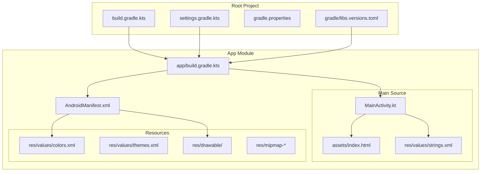
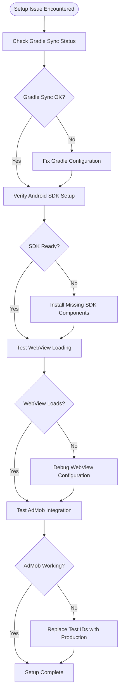

# Getting Started

<cite>
**Referenced Files in This Document**
- [README.md](file://README.md)
- [ADMOB_SETUP.md](file://ADMOB_SETUP.md)
- [build.gradle.kts](file://build.gradle.kts)
- [app/build.gradle.kts](file://app/build.gradle.kts)
- [gradle/libs.versions.toml](file://gradle/libs.versions.toml)
- [settings.gradle.kts](file://settings.gradle.kts)
- [gradle.properties](file://gradle.properties)
- [app/src/main/AndroidManifest.xml](file://app/src/main/AndroidManifest.xml)
- [app/src/main/java/com/cktechhub/games/MainActivity.kt](file://app/src/main/java/com/cktechhub/games/MainActivity.kt)
- [app/src/main/assets/index.html](file://app/src/main/assets/index.html)
- [app/src/main/res/values/strings.xml](file://app/src/main/res/values/strings.xml)
</cite>

## Update Summary
**Changes Made**
- Enhanced project overview with comprehensive features and architecture explanation from README.md
- Added detailed tech stack information and project structure visualization
- Integrated comprehensive getting started guide with prerequisites and build instructions
- Expanded AdMob configuration section with step-by-step setup process
- Added game mechanics and power-up system documentation
- Included practical examples and troubleshooting guidance

## Table of Contents
1. [Introduction](#introduction)
2. [Features](#features)
3. [Architecture](#architecture)
4. [Tech Stack](#tech-stack)
5. [Prerequisites](#prerequisites)
6. [Getting Started](#getting-started)
7. [Installation and Setup](#installation-and-setup)
8. [First Run and Basic Configuration](#first-run-and-basic-configuration)
9. [Project Structure Overview](#project-structure-overview)
10. [Environment Preparation](#environment-preparation)
11. [Running Your First Build](#running-your-first-build)
12. [Game Mechanics](#game-mechanics)
13. [Common Setup Issues and Solutions](#common-setup-issues-and-solutions)
14. [Practical Examples](#practical-examples)
15. [Troubleshooting Guide](#troubleshooting-guide)
16. [Conclusion](#conclusion)

## Introduction

Welcome to the Tube Master Puzzle Android game development guide! This project is a vibrant ball-sort puzzle game that combines native Android development with HTML5/JavaScript gameplay. The game challenges players to sort colorful balls into glass test tubes in this brain-teasing, visually stunning mobile experience.

The application uses a modern hybrid architecture featuring a native Android shell that wraps an HTML5/JavaScript game engine inside a WebView. This approach allows developers to leverage the power of web technologies for complex game logic while maintaining native Android capabilities for monetization, performance, and user experience.

**Section sources**
- [README.md:1-3](file://README.md#L1-L3)

## Features

Tube Master Puzzle offers an engaging and challenging puzzle experience with the following features:

- **Brain-Teasing Puzzles**: Sort colored balls into test tubes until each tube contains only one color
- **Progressive Difficulty**: Levels start simple and scale up with more tubes and colors
- **Power-Ups**: Undo, Hint, Shuffle, and Add Tube to help through tough levels
- **Coin Economy**: Earn coins by completing levels and use them for power-ups
- **Stunning Visuals**: Neon-lit glass tubes, glossy 3D balls, and dark lab-themed backgrounds
- **Ad-Supported**: Banner ads and interstitial ads (every 2 level completions) via AdMob

**Section sources**
- [README.md:21-29](file://README.md#L21-L29)

## Architecture

The app uses a **hybrid architecture** — a native Android shell wrapping an HTML5/JavaScript game engine inside a WebView.

```
Android Native (Kotlin)          HTML5 Game Engine
┌─────────────────────┐          ┌──────────────────┐
│  MainActivity       │          │  index.html       │
│  ├─ WebView         │◄────────►│  ├─ Ball Physics  │
│  ├─ AdMob (Banner)  │  JS      │  ├─ Level System  │
│  ├─ AdMob (Interstitial)│Bridge │  ├─ Rendering     │
│  ├─ Internet Check  │          │  └─ Game State     │
│  └─ Immersive Mode  │          │                    │
└─────────────────────┘          └──────────────────┘
```

### Key Components

| Component | File | Description |
|-----------|------|-------------|
| Native Shell | [MainActivity.kt](app/src/main/java/com/cktechhub/games/MainActivity.kt) | WebView setup, AdMob, immersive mode, internet check |
| Game Engine | [index.html](app/src/main/assets/index.html) | Full HTML5/JS game with Tailwind CSS |
| Marketing Site | [website/index.html](website/index.html) | Privacy policy & app landing page |
| Ad Bridge | `AdBridge` inner class | JavaScript-to-Android bridge for ad triggers |

**Section sources**
- [README.md:32-56](file://README.md#L32-L56)

## Tech Stack

| Layer | Technology |
|-------|-----------|
| Native | Kotlin, Android SDK 36, AppCompat |
| Game Engine | HTML5, JavaScript, CSS3, Tailwind CSS |
| Ads | Google AdMob (Banner + Interstitial) |
| Build | Gradle (Kotlin DSL), AGP 9.0.1 |

**Section sources**
- [README.md:59-67](file://README.md#L59-L67)

## Prerequisites

### Android Studio Setup
Before you begin developing the Tube Master Puzzle game, ensure you have the following development environment configured:

- **Android Studio**: Latest stable version with Android SDK
- **Android SDK**: Minimum SDK 29, Target SDK 36
- **Java/Kotlin**: JDK 11 or higher for compilation
- **Git**: For version control and project cloning
- **Gradle**: Built-in Gradle Wrapper for dependency management

### Development Environment Requirements
- **Android SDK 36**: Required for optimal compatibility
- **Min SDK 29**: Android 10+ requirement for immersive features
- **Kotlin 2.0.21**: Latest stable Kotlin version
- **AGP 9.0.1**: Android Gradle Plugin for modern build system

**Section sources**
- [README.md:103-108](file://README.md#L103-L108)
- [gradle/libs.versions.toml:11](file://gradle/libs.versions.toml#L11)

## Getting Started

### Build & Run

1. **Clone the repository**:
   ```bash
   git clone https://github.com/chetanck03/games
   cd games
   ```

2. **Open in Android Studio**
   - Launch Android Studio
   - Select "Open an Existing Project"
   - Choose the project root directory
   - Allow Android Studio to sync Gradle automatically

3. **Sync Gradle and run**
   - Wait for Gradle sync completion
   - Connect a physical Android device (recommended)
   - Run the app using the Run button or `Shift+F10`

**Section sources**
- [README.md:109-120](file://README.md#L109-L120)

## Installation and Setup

### Cloning the Repository
1. Clone the repository using Git:
```bash
git clone https://github.com/chetanck03/games
cd games
```

2. Verify the repository structure matches the expected project layout with the following directories:
   - `app/` - Main Android application module
   - `gradle/` - Gradle wrapper and configuration
   - `build.gradle.kts` - Root build configuration
   - `settings.gradle.kts` - Multi-module settings

### Dependency Resolution with Gradle
The project uses modern Gradle configuration with version catalogs:

1. **Root Build Configuration**: The top-level `build.gradle.kts` defines plugin management and applies the Android Application plugin with version catalog aliases.

2. **Version Catalog**: The `gradle/libs.versions.toml` file centralizes all dependency versions and plugin configurations, ensuring consistency across the project.

3. **Module Dependencies**: The `app/build.gradle.kts` file specifies all required dependencies including:
   - AndroidX core libraries
   - Kotlin extensions
   - Google Play Services Ads (AdMob)
   - Testing frameworks

### Initial Build Configuration
1. **Gradle Properties**: The `gradle.properties` file configures:
   - AndroidX migration settings
   - JVM memory allocation (-Xmx2048m)
   - Kotlin code style preferences

2. **Repository Management**: The `settings.gradle.kts` file manages:
   - Plugin repositories (Google, Maven Central, Gradle Portal)
   - Dependency resolution strategy
   - Module inclusion for the app

**Section sources**
- [build.gradle.kts:1-4](file://build.gradle.kts#L1-L4)
- [app/build.gradle.kts:1-53](file://app/build.gradle.kts#L1-L53)
- [gradle/libs.versions.toml:1-28](file://gradle/libs.versions.toml#L1-L28)
- [settings.gradle.kts:1-27](file://settings.gradle.kts#L1-L27)
- [gradle.properties:1-23](file://gradle.properties#L1-L23)

## First Run and Basic Configuration

### AdMob Configuration
The app uses test AdMob IDs. Before releasing to production, replace these in [MainActivity.kt](app/src/main/java/com/cktechhub/games/MainActivity.kt):

```kotlin
private const val BANNER_AD_UNIT_ID = "ca-app-pub-XXXXX/YYYYY"
private const val INTERSTITIAL_AD_UNIT_ID = "ca-app-pub-XXXXX/YYYYY"
```

Also update the application ID in [AndroidManifest.xml](app/src/main/AndroidManifest.xml):

```xml
<meta-data
    android:name="com.google.android.gms.ads.APPLICATION_ID"
    android:value="ca-app-pub-XXXXX~YYYYY" />
```

Interstitial ads show every **2 level completions** (configurable via `INTERSTITIAL_FREQUENCY`).

### Configuring Android SDK Versions
The project is configured with specific SDK requirements:

- **minSdk**: 29 (Android 10.0)
- **targetSdk**: 36 (Android 14)
- **compileSdk**: 36
- **Java Compatibility**: 11

These settings ensure compatibility with modern Android features while maintaining broad device support.

### Verifying Hybrid Architecture Setup
The application uses a hybrid architecture combining native Android with WebView-based JavaScript:

1. **WebView Configuration**: The `MainActivity.kt` sets up a WebView with:
   - JavaScript enabled
   - DOM storage enabled
   - Mixed content restrictions
   - Custom JavaScript interface

2. **Asset Loading**: The HTML game loads from `assets/index.html` using `file:///android_asset/` protocol

3. **Bridge Communication**: JavaScript can trigger Android functions through the `AndroidBridge` interface

**Section sources**
- [README.md:123-141](file://README.md#L123-L141)
- [ADMOB_SETUP.md:1-104](file://ADMOB_SETUP.md#L1-L104)
- [app/build.gradle.kts:5-17](file://app/build.gradle.kts#L5-L17)
- [app/src/main/AndroidManifest.xml:9-28](file://app/src/main/AndroidManifest.xml#L9-L28)
- [app/src/main/java/com/cktechhub/games/MainActivity.kt:44-60](file://app/src/main/java/com/cktechhub/games/MainActivity.kt#L44-L60)

## Project Structure Overview

The Tube Master Puzzle project follows a standard Android application structure with hybrid web integration:



**Diagram sources**
- [build.gradle.kts:1-4](file://build.gradle.kts#L1-L4)
- [settings.gradle.kts:25-27](file://settings.gradle.kts#L25-L27)
- [app/build.gradle.kts:1-53](file://app/build.gradle.kts#L1-L53)

### Key Project Components

1. **Application Layer** (`app/src/main/java/com/cktechhub/games/`):
   - `MainActivity.kt`: Main activity with WebView integration and AdMob implementation
   - Theme definitions and UI components

2. **Assets Layer** (`app/src/main/assets/`):
   - `index.html`: Complete HTML5 game implementation with JavaScript logic
   - Canvas-based particle system and responsive design

3. **Configuration Layer**:
   - `AndroidManifest.xml`: Permissions, activities, and AdMob configuration
   - Resource files for strings, colors, and themes

**Section sources**
- [app/src/main/java/com/cktechhub/games/MainActivity.kt:1-50](file://app/src/main/java/com/cktechhub/games/MainActivity.kt#L1-L50)
- [app/src/main/assets/index.html:1-50](file://app/src/main/assets/index.html#L1-L50)
- [app/src/main/AndroidManifest.xml:1-51](file://app/src/main/AndroidManifest.xml#L1-L51)

## Environment Preparation

### Android Studio Configuration
1. **SDK Requirements**:
   - Install Android SDK Platform 36
   - Ensure Android SDK Build-Tools 36.0.1 or later
   - Configure Android Emulator with API 36

2. **Project Import**:
   - Open Android Studio
   - Select "Open an Existing Project"
   - Choose the project root directory
   - Allow Android Studio to sync Gradle automatically

3. **Dependencies Resolution**:
   - Wait for Gradle sync completion
   - Verify all dependencies download successfully
   - Check for any version conflicts in the console

### Development Tools Setup
1. **Git Configuration**:
   ```bash
   git config --global user.name "Your Name"
   git config --global user.email "you@example.com"
   ```

2. **Environment Variables**:
   - Ensure JAVA_HOME points to JDK 11+
   - Configure ANDROID_HOME for SDK location
   - Add Gradle to PATH

3. **Optional Tools**:
   - Chrome DevTools for WebView debugging
   - Android Device Monitor for performance analysis
   - Network Inspector for AdMob testing

## Running Your First Build

### Build Types and Configuration
The project supports multiple build configurations:

1. **Debug Build**:
   - Enabled for development and testing
   - No code minification
   - Full logging enabled

2. **Release Build**:
   - Optimized for distribution
   - Code minification enabled
   - ProGuard rules applied

### Build Commands
Execute builds using Gradle Wrapper:

```bash
# Clean build
./gradlew clean

# Assemble debug APK
./gradlew assembleDebug

# Assemble release APK
./gradlew assembleRelease

# Install on connected device
./gradlew installDebug
```

### Verification Steps
After successful build completion:

1. **APK Location**:
   - Debug: `app/build/outputs/apk/debug/app-debug.apk`
   - Release: `app/build/outputs/apk/release/app-release-unsigned.apk`

2. **Device Testing**:
   - Connect physical Android device (recommended)
   - Enable Developer Options and USB Debugging
   - Install APK manually or use `adb install`

3. **Initial Launch**:
   - Grant internet permissions
   - Verify WebView loads successfully
   - Check AdMob banner appears (if using test IDs)

**Section sources**
- [app/build.gradle.kts:19-27](file://app/build.gradle.kts#L19-L27)
- [gradle.properties:9-13](file://gradle.properties#L9-L13)

## Game Mechanics

### Core Gameplay
1. **Goal** — Sort all balls so each test tube contains balls of only one color
2. **Moves** — Tap a tube to pick up the top ball, then tap another tube to drop it
3. **Rules**:
   - You can only place a ball on top of a ball of the same color, or into an empty tube
   - Tubes have a maximum capacity (typically 4 balls)
4. **Power-Ups**:
   - **Undo** — Reverse the last move
   - **Hint** — Highlights a valid move
   - **Shuffle** — Randomly rearranges the balls
   - **Add Tube** — Adds an extra empty tube for more flexibility

### Progressive Difficulty
The game features 15 progressive levels that increase in complexity:
- **Level 1-4**: 2-3 colors, 3-4 balls per color, 3-4 tubes
- **Level 5-10**: 4-6 colors, 4-5 balls per color, 6-8 tubes  
- **Level 11-15**: 6-8 colors, 4-5 balls per color, 8-10 tubes

**Section sources**
- [README.md:144-156](file://README.md#L144-L156)

## Common Setup Issues and Solutions

### Gradle Sync Failures
**Issue**: Gradle fails to sync with version catalog errors
**Solution**: 
1. Invalidate caches and restart Android Studio
2. Delete `.gradle/caches` folder
3. Run `./gradlew clean` from terminal
4. Check internet connection for dependency downloads

### Android SDK Issues
**Issue**: Missing SDK components or API level errors
**Solution**:
1. Open SDK Manager in Android Studio
2. Install missing SDK platforms and build-tools
3. Update `compileSdk` and `targetSdk` in `build.gradle.kts`
4. Verify SDK path in `local.properties`

### WebView Loading Problems
**Issue**: Game fails to load or shows blank screen
**Solution**:
1. Verify `index.html` exists in `assets/` directory
2. Check WebView settings in `MainActivity.kt`
3. Ensure `javaScriptEnabled` is set to true
4. Test with `file:///android_asset/index.html` URL

### AdMob Integration Issues
**Issue**: Ads not displaying or showing test banners
**Solution**:
1. Confirm AdMob IDs are replaced with production values
2. Verify internet permissions in manifest
3. Check AdMob initialization in `MainActivity.kt`
4. Test on physical device (emulators may not show ads)

### Memory and Performance Issues
**Issue**: App crashes on low-memory devices
**Solution**:
1. Review WebView memory management in `MainActivity.kt`
2. Check particle system performance settings
3. Optimize Canvas rendering in JavaScript
4. Implement proper resource cleanup in lifecycle methods

**Section sources**
- [app/src/main/java/com/cktechhub/games/MainActivity.kt:296-302](file://app/src/main/java/com/cktechhub/games/MainActivity.kt#L296-L302)
- [app/src/main/AndroidManifest.xml:5-7](file://app/src/main/AndroidManifest.xml#L5-L7)

## Practical Examples

### Successful Project Initialization Checklist
Follow this step-by-step verification process:

1. **Repository Setup**:
   - Clone repository successfully
   - Verify all files present in expected locations
   - Check `.gitignore` for proper exclusions

2. **Development Environment**:
   - Android Studio opens project without errors
   - Gradle sync completes successfully
   - All dependencies resolve without conflicts

3. **First Build Execution**:
   - `./gradlew assembleDebug` completes
   - APK generates in `app/build/outputs/apk/debug/`
   - App installs and runs on device/emulator

4. **Hybrid Architecture Validation**:
   - WebView loads `index.html` successfully
   - JavaScript game logic responds to interactions
   - Particle effects render correctly
   - Canvas animations perform smoothly

### Basic Troubleshooting Workflow
When encountering setup issues:



**Diagram sources**
- [app/src/main/java/com/cktechhub/games/MainActivity.kt:165-263](file://app/src/main/java/com/cktechhub/games/MainActivity.kt#L165-L263)
- [ADMOB_SETUP.md:66-76](file://ADMOB_SETUP.md#L66-L76)

### Environment Verification Commands
Run these commands to validate your setup:

```bash
# Verify Android SDK
echo $ANDROID_HOME
ls $ANDROID_HOME/platforms/android-36

# Verify Java
java -version
javac -version

# Verify Gradle
./gradlew --version

# Check Git
git --version
git status

# Test Build
./gradlew clean
./gradlew assembleDebug
```

## Troubleshooting Guide

### Build and Compilation Issues
**Problem**: Compilation errors related to Kotlin or Android plugins
**Diagnostic Steps**:
1. Check Kotlin compiler version compatibility
2. Verify Android Gradle Plugin version
3. Ensure Java 11+ compatibility
4. Clean and rebuild project

**Problem**: Duplicate class errors or conflicting dependencies
**Diagnostic Steps**:
1. Review `libs.versions.toml` for version conflicts
2. Check dependency tree with `./gradlew app:dependencies`
3. Remove unused dependencies
4. Align all library versions

### Runtime and Performance Issues
**Problem**: App crashes during WebView operations
**Diagnostic Steps**:
1. Check WebView lifecycle methods in `MainActivity.kt`
2. Verify proper resource cleanup in `onDestroy()`
3. Monitor memory usage with Android Profiler
4. Implement crash reporting

**Problem**: Slow performance or lag in game animations
**Diagnostic Steps**:
1. Profile Canvas rendering performance
2. Optimize particle system calculations
3. Reduce unnecessary DOM manipulations
4. Implement frame rate limiting

### AdMob and Monetization Issues
**Problem**: AdMob ads not displaying or showing test ads only
**Diagnostic Steps**:
1. Verify production AdMob IDs are configured
2. Check AdMob initialization timing
3. Test on physical devices
4. Verify ad unit creation in AdMob Console

**Problem**: Revenue not appearing in AdMob reports
**Diagnostic Steps**:
1. Confirm production IDs are not test IDs
2. Check AdMob account status
3. Verify app submission to Google Play Store
4. Allow time for ad unit activation (up to 15 minutes)

**Section sources**
- [app/src/main/java/com/cktechhub/games/MainActivity.kt:149-154](file://app/src/main/java/com/cktechhub/games/MainActivity.kt#L149-L154)
- [ADMOB_SETUP.md:96-104](file://ADMOB_SETUP.md#L96-L104)

## Conclusion

The Tube Master Puzzle Android game provides an excellent foundation for hybrid mobile application development. By following this comprehensive setup guide, you'll have a fully functional development environment ready to modify, extend, and deploy your own version of the game.

Key takeaways for successful development:

1. **Hybrid Architecture Mastery**: Understand the WebView-to-JavaScript bridge and Android integration patterns
2. **AdMob Implementation**: Learn proper monetization setup with both test and production configurations
3. **Performance Optimization**: Balance native Android performance with HTML5/JavaScript rendering
4. **Modern Development Practices**: Utilize Kotlin coroutines, modern Android APIs, and responsive web design principles

The project serves as a practical example of how to combine native Android capabilities with web technologies to create engaging mobile experiences. Whether you're modifying the existing game logic, adding new features, or building upon this foundation for your own projects, this setup provides the essential groundwork for success.

Happy coding, and enjoy developing your Tube Master Puzzle game!

**Section sources**
- [README.md:159-162](file://README.md#L159-L162)