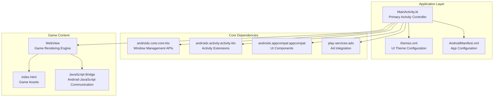
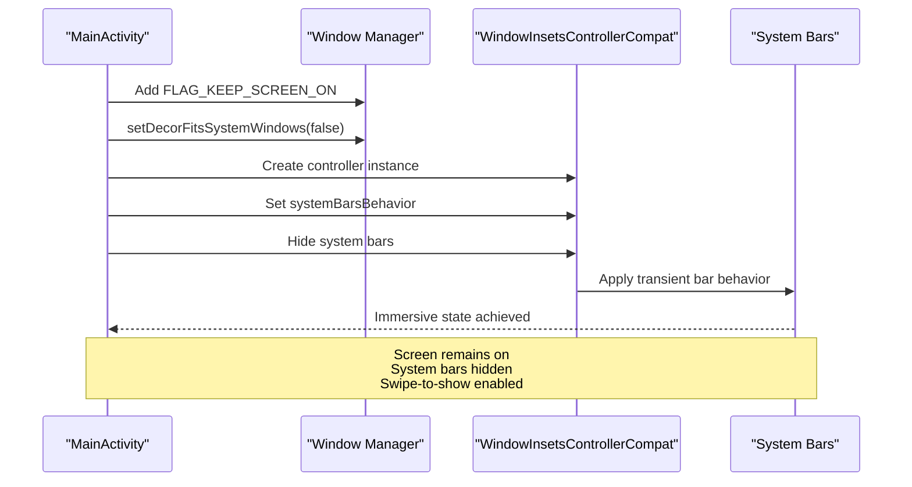
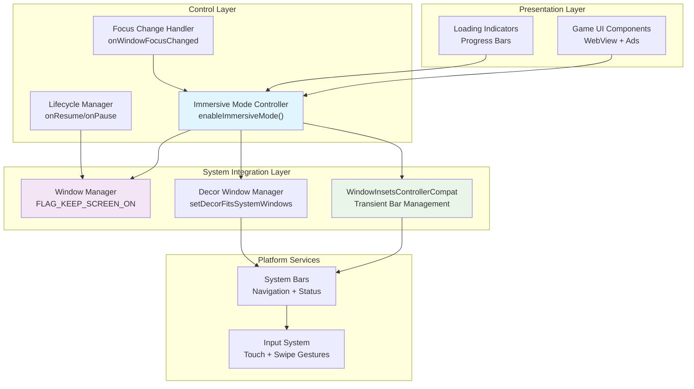
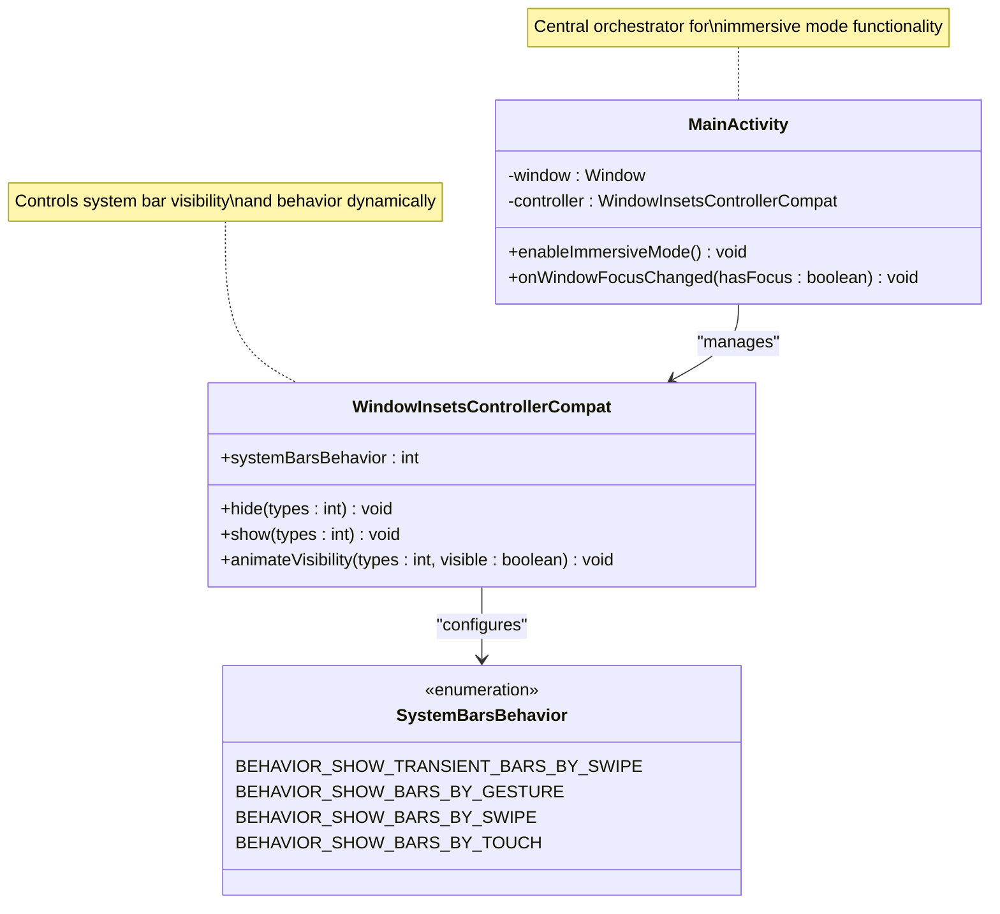
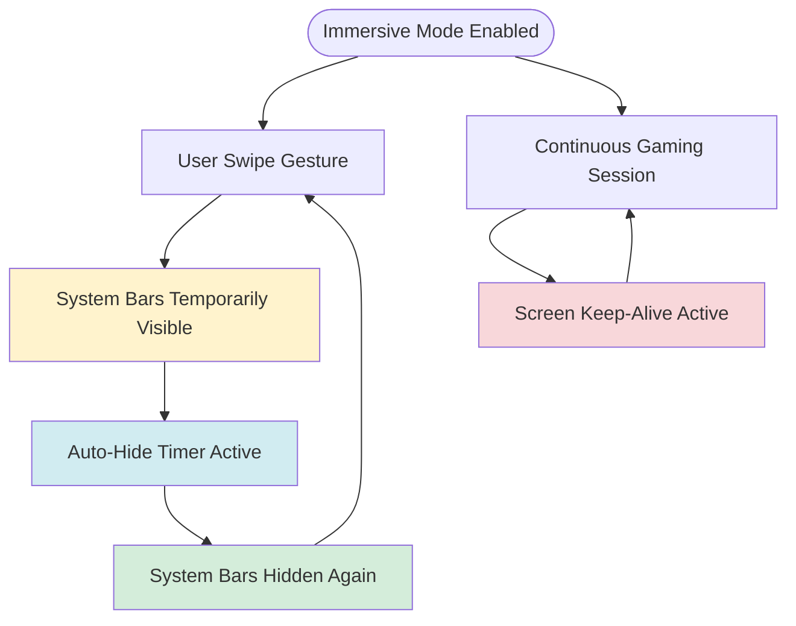
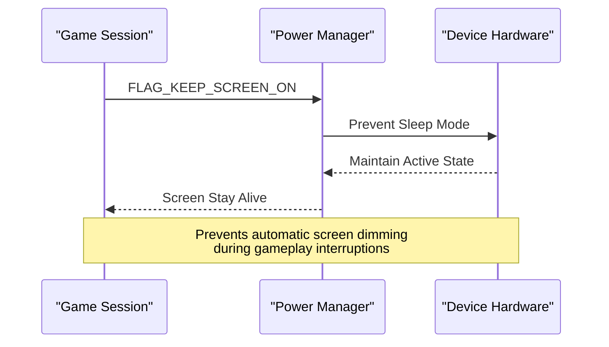
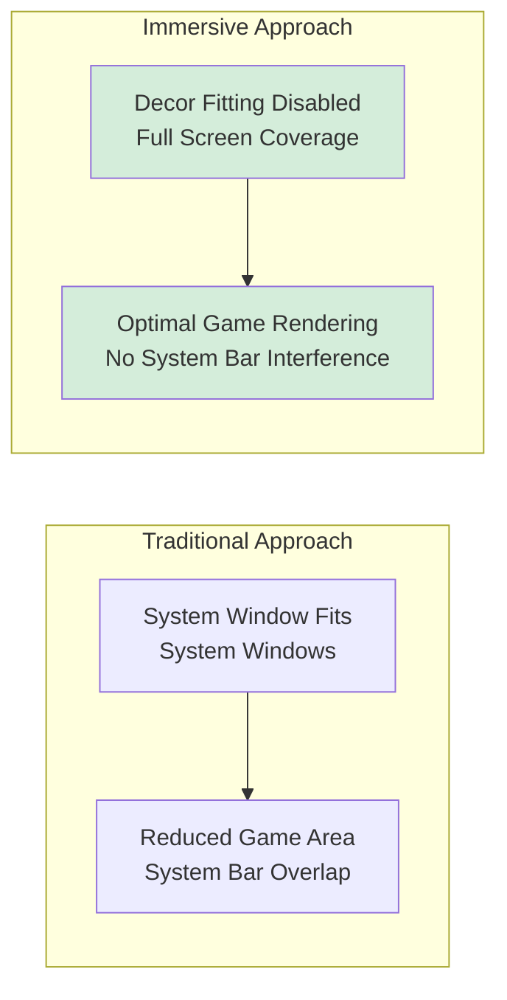
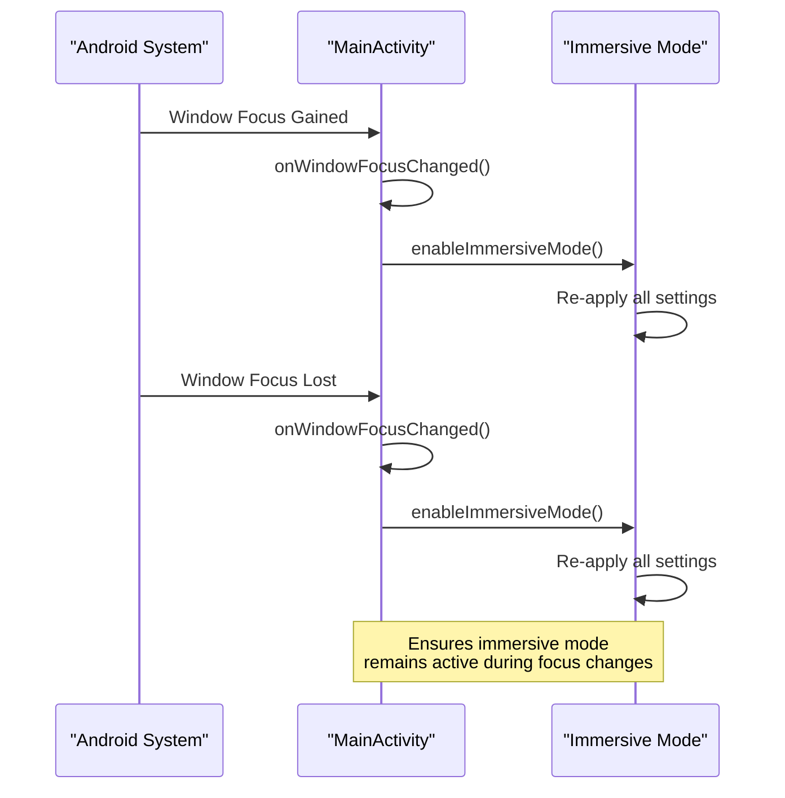
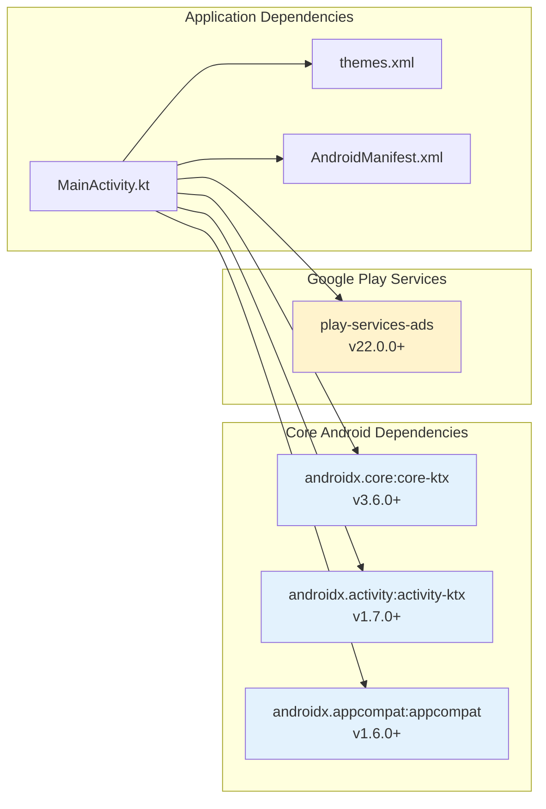
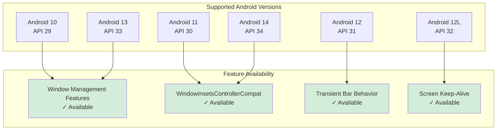

# Immersive Full-Screen Mode

<cite>
**Referenced Files in This Document**
- [MainActivity.kt](file://app/src/main/java/com/cktechhub/games/MainActivity.kt)
- [AndroidManifest.xml](file://app/src/main/AndroidManifest.xml)
- [themes.xml](file://app/src/main/res/values/themes.xml)
- [build.gradle.kts](file://app/build.gradle.kts)
</cite>

## Table of Contents
1. [Introduction](#introduction)
2. [Project Structure](#project-structure)
3. [Core Components](#core-components)
4. [Architecture Overview](#architecture-overview)
5. [Detailed Component Analysis](#detailed-component-analysis)
6. [Dependency Analysis](#dependency-analysis)
7. [Performance Considerations](#performance-considerations)
8. [Troubleshooting Guide](#troubleshooting-guide)
9. [Platform Compatibility](#platform-compatibility)
10. [Conclusion](#conclusion)

## Introduction

This document provides comprehensive technical documentation for the immersive full-screen mode implementation in the gaming application. The implementation focuses on creating a distraction-free gaming experience through advanced system UI management, transient system bar behavior, and swipe-to-show gestures. The codebase demonstrates modern Android development practices for achieving seamless gaming experiences while maintaining optimal performance and user engagement.

The implementation centers around the `enableImmersiveMode()` method, which orchestrates multiple system-level configurations to achieve true immersion. This includes screen keep-alive functionality, system window decoration management, and sophisticated window inset controller operations for dynamic system bar visibility.

## Project Structure

The gaming application follows a clean Android project structure with specialized components for immersive mode functionality:

**Diagram sources**
- [MainActivity.kt:42-441](file://app/src/main/java/com/cktechhub/games/MainActivity.kt#L42-L441)
- [build.gradle.kts:34-43](file://app/build.gradle.kts#L34-L43)

**Section sources**
- [MainActivity.kt:1-441](file://app/src/main/java/com/cktechhub/games/MainActivity.kt#L1-L441)
- [AndroidManifest.xml:1-51](file://app/src/main/AndroidManifest.xml#L1-L51)
- [build.gradle.kts:1-43](file://app/build.gradle.kts#L1-L43)

## Core Components

The immersive mode implementation consists of several interconnected components that work together to create a seamless gaming experience:

### Primary Immersive Mode Method

The `enableImmersiveMode()` method serves as the central orchestrator for all immersive functionality:

**Diagram sources**
- [MainActivity.kt:415-422](file://app/src/main/java/com/cktechhub/games/MainActivity.kt#L415-L422)

### Key Implementation Features

The immersive mode implementation incorporates several critical features:

1. **Screen Keep-Alive**: Prevents device sleep during gameplay
2. **System Window Decoration**: Disables system window fits for true fullscreen
3. **Transient Bar Behavior**: Enables swipe-to-show system bars
4. **Automatic Focus Management**: Re-applies immersive mode on focus changes

**Section sources**
- [MainActivity.kt:415-422](file://app/src/main/java/com/cktechhub/games/MainActivity.kt#L415-L422)
- [MainActivity.kt:156-159](file://app/src/main/java/com/cktechhub/games/MainActivity.kt#L156-L159)

## Architecture Overview

The immersive mode architecture demonstrates a layered approach to system UI management:

**Diagram sources**
- [MainActivity.kt:415-422](file://app/src/main/java/com/cktechhub/games/MainActivity.kt#L415-L422)
- [MainActivity.kt:156-159](file://app/src/main/java/com/cktechhub/games/MainActivity.kt#L156-L159)

## Detailed Component Analysis

### WindowInsetsControllerCompat Implementation

The `WindowInsetsControllerCompat` provides sophisticated control over system bar behavior:

**Diagram sources**
- [MainActivity.kt:415-422](file://app/src/main/java/com/cktechhub/games/MainActivity.kt#L415-L422)

#### System Bar Types and Management

The implementation manages multiple system bar types through the `WindowInsetsCompat.Type.systemBars()` method, which encompasses:

- **Status Bar**: Displays system icons and notifications
- **Navigation Bar**: Provides navigation controls and gesture areas
- **Cutout Areas**: Handles display cutouts on modern devices

#### Transient Bar Behavior Configuration

The `BEHAVIOR_SHOW_TRANSIENT_BARS_BY_SWIPE` setting enables intelligent system bar management:

**Diagram sources**
- [MainActivity.kt:419-421](file://app/src/main/java/com/cktechhub/games/MainActivity.kt#L419-L421)

**Section sources**
- [MainActivity.kt:415-422](file://app/src/main/java/com/cktechhub/games/MainActivity.kt#L415-L422)

### Screen Keep-Alive Implementation

The screen keep-alive functionality prevents device sleep during gaming sessions:

**Diagram sources**
- [MainActivity.kt:416](file://app/src/main/java/com/cktechhub/games/MainActivity.kt#L416)

#### Keep-Alive Strategies

The implementation employs strategic keep-alive mechanisms:

1. **Session-Based Activation**: Activated during active gaming sessions
2. **Lifecycle Integration**: Automatically managed through activity lifecycle
3. **Battery Considerations**: Balanced against power consumption concerns

**Section sources**
- [MainActivity.kt:416](file://app/src/main/java/com/cktechhub/games/MainActivity.kt#L416)

### Decor Fitting System Windows

The `WindowCompat.setDecorFitsSystemWindows(window, false)` configuration disables system window fitting:

**Diagram sources**
- [MainActivity.kt:417](file://app/src/main/java/com/cktechhub/games/MainActivity.kt#L417)

**Section sources**
- [MainActivity.kt:417](file://app/src/main/java/com/cktechhub/games/MainActivity.kt#L417)

### Focus Change Handling

The implementation includes robust focus change handling for dynamic immersive mode management:

**Diagram sources**
- [MainActivity.kt:156-159](file://app/src/main/java/com/cktechhub/games/MainActivity.kt#L156-L159)

**Section sources**
- [MainActivity.kt:156-159](file://app/src/main/java/com/cktechhub/games/MainActivity.kt#L156-L159)

## Dependency Analysis

The immersive mode implementation relies on several key dependencies that enable comprehensive system UI management:

**Diagram sources**
- [build.gradle.kts:34-43](file://app/build.gradle.kts#L34-L43)
- [MainActivity.kt:29-31](file://app/src/main/java/com/cktechhub/games/MainActivity.kt#L29-L31)

### Version Compatibility Matrix

The implementation targets specific Android versions and API levels:

| Component | Minimum SDK | Target SDK | Notes |
|-----------|-------------|------------|-------|
| Core KTX | API 29+ | API 36 | Modern window management APIs |
| Activity KTX | API 29+ | API 36 | Enhanced activity lifecycle support |
| AppCompat | API 29+ | API 36 | Backward compatibility framework |
| WindowInsetsControllerCompat | API 30+ | API 36 | Advanced system bar control |

**Section sources**
- [build.gradle.kts:11-12](file://app/build.gradle.kts#L11-L12)
- [AndroidManifest.xml:18](file://app/src/main/AndroidManifest.xml#L18)

## Performance Considerations

The immersive mode implementation balances performance optimization with user experience enhancement:

### Battery Life Impact

The screen keep-alive mechanism requires careful battery management:

- **Intelligent Activation**: Only active during gaming sessions
- **System Integration**: Leverages Android's power management efficiently
- **Adaptive Behavior**: Deactivates when not needed

### Memory Management

The implementation includes robust memory management practices:

- **Resource Cleanup**: Proper WebView and ad resource destruction
- **Lifecycle Awareness**: Automatic cleanup during onPause/onDestroy
- **Crash Recovery**: Render process crash handling and recovery

### Rendering Performance

System bar management enhances rendering performance by:

- **Reduced Overdraw**: Eliminates system bar interference
- **Full Screen Coverage**: Maximizes available rendering area
- **Consistent Layout**: Stable layout calculations without system bar changes

## Troubleshooting Guide

Common issues and their solutions for immersive mode implementation:

### Issue: System Bars Not Hiding

**Symptoms**: System bars remain visible despite immersive mode activation

**Causes**:
- Incorrect WindowInsetsControllerCompat usage
- Theme conflicts with immersive mode
- Device manufacturer customizations

**Solutions**:
1. Verify WindowInsetsControllerCompat initialization
2. Check theme configuration compatibility
3. Test on different device manufacturers

### Issue: Screen Keeps Dimming

**Symptoms**: Screen turns off despite FLAG_KEEP_SCREEN_ON

**Causes**:
- Power saving modes interfering
- Device-specific power management
- Background app restrictions

**Solutions**:
1. Check device power settings
2. Verify app is not restricted in background
3. Test with different power modes

### Issue: Swipe Gestures Not Working

**Symptoms**: Cannot swipe to show system bars

**Causes**:
- Incorrect systemBarsBehavior configuration
- Device gesture settings disabled
- Manufacturer gesture customization

**Solutions**:
1. Verify BEHAVIOR_SHOW_TRANSIENT_BARS_BY_SWIPE
2. Check device gesture settings
3. Test on stock Android vs manufacturer ROM

### Device-Specific Behaviors

Different manufacturers implement system UI differently:

| Manufacturer | Behavior | Solutions |
|--------------|----------|-----------|
| Samsung (OneUI) | Aggressive gesture handling | Test with Samsung gesture settings |
| Xiaomi (MIUI) | Custom gesture recognition | Verify gesture settings |
| Google Pixel | Stock Android behavior | Standard testing approach |
| Huawei (EMUI) | Gesture customization | Check EMUI gesture settings |

**Section sources**
- [MainActivity.kt:415-422](file://app/src/main/java/com/cktechhub/games/MainActivity.kt#L415-L422)

## Platform Compatibility

### Android Version Support

The implementation provides comprehensive compatibility across Android versions:

### Device Manufacturer Considerations

Different manufacturers require specific adaptations:

#### Samsung Devices
- **Gesture Handling**: May require enabling edge-swipe gestures
- **Power Management**: Check OneUI power saving features
- **Custom UI**: Some gestures may conflict with immersive mode

#### Xiaomi Devices  
- **MIUI Gestures**: Verify gesture settings allow system bar access
- **Power Optimization**: Check battery optimization settings
- **Home Screen**: MIUI home screen may interfere with immersive mode

#### Google Pixel Devices
- **Stock Android**: Generally most compatible
- **Gesture Navigation**: Default gesture navigation works well
- **System Updates**: Regular updates maintain compatibility

**Section sources**
- [build.gradle.kts:11-12](file://app/build.gradle.kts#L11-L12)
- [AndroidManifest.xml:33](file://app/src/main/AndroidManifest.xml#L33)

## Conclusion

The immersive full-screen mode implementation demonstrates a comprehensive approach to creating distraction-free gaming experiences on Android. Through the strategic use of `WindowInsetsControllerCompat`, screen keep-alive mechanisms, and sophisticated system bar management, the application achieves optimal user engagement while maintaining performance and battery efficiency.

Key achievements of this implementation include:

- **Seamless User Experience**: True immersion without visual distractions
- **Performance Optimization**: Efficient resource management and memory handling  
- **Cross-Platform Compatibility**: Broad support across Android versions and device manufacturers
- **Robust Error Handling**: Comprehensive focus change management and crash recovery
- **Modern Development Practices**: Leveraging latest Android APIs and best practices

The implementation serves as a model for other gaming applications seeking to provide professional-grade immersive experiences while maintaining technical excellence and user satisfaction.