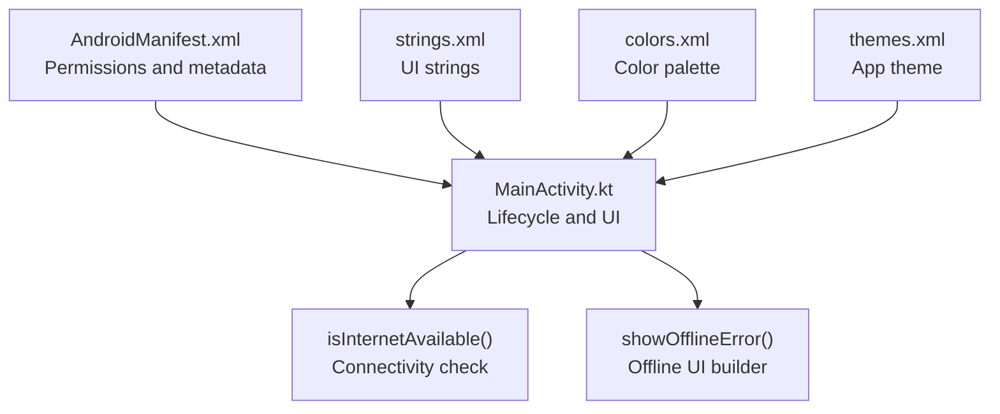
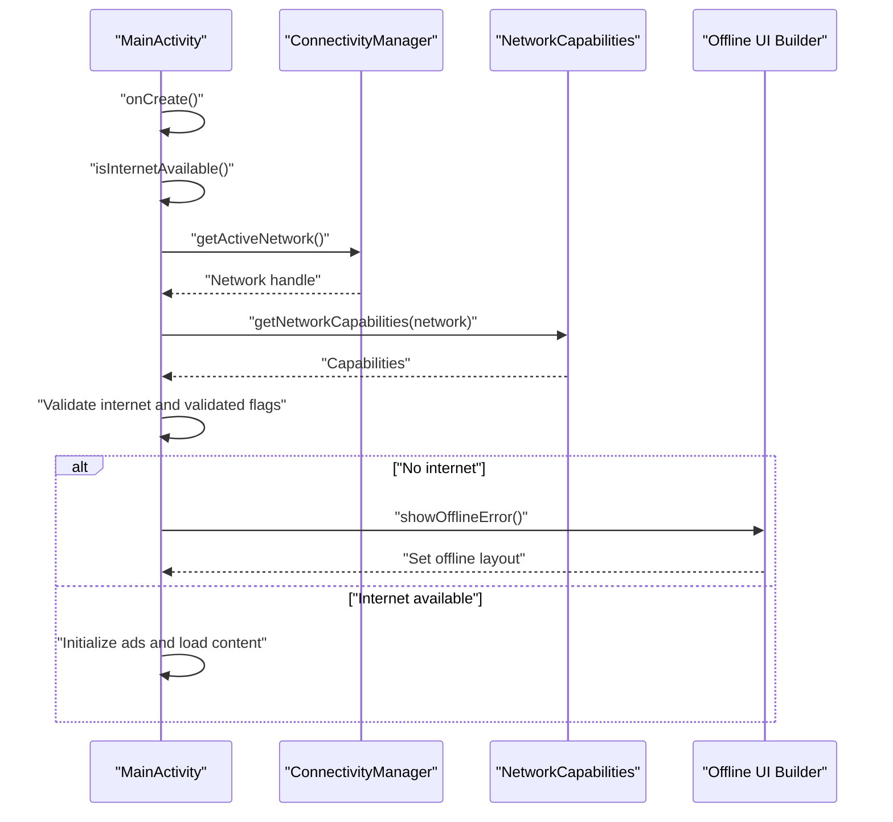
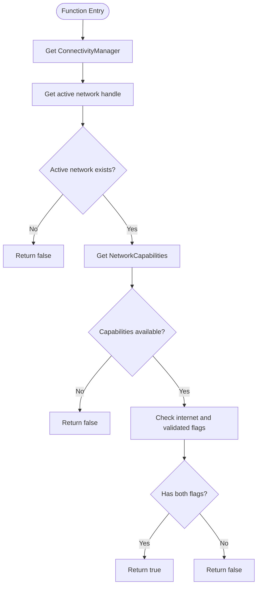
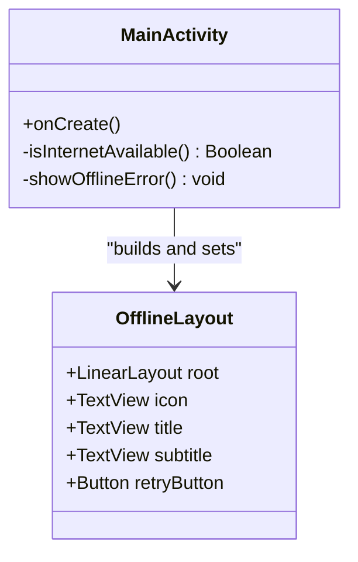
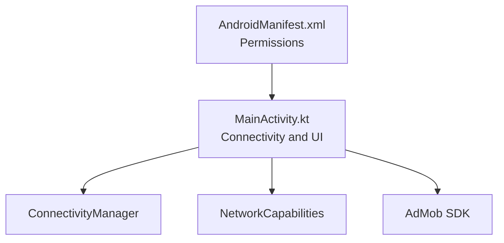

# Internet Connectivity & Offline Handling

<cite>
**Referenced Files in This Document**
- [MainActivity.kt](file://app/src/main/java/com/cktechhub/games/MainActivity.kt)
- [AndroidManifest.xml](file://app/src/main/AndroidManifest.xml)
- [strings.xml](file://app/src/main/res/values/strings.xml)
- [colors.xml](file://app/src/main/res/values/colors.xml)
- [themes.xml](file://app/src/main/res/values/themes.xml)
</cite>

## Table of Contents
1. [Introduction](#introduction)
2. [Project Structure](#project-structure)
3. [Core Components](#core-components)
4. [Architecture Overview](#architecture-overview)
5. [Detailed Component Analysis](#detailed-component-analysis)
6. [Dependency Analysis](#dependency-analysis)
7. [Performance Considerations](#performance-considerations)
8. [Troubleshooting Guide](#troubleshooting-guide)
9. [Conclusion](#conclusion)

## Introduction
This document explains the internet connectivity checking mechanism and offline error handling in the application. It focuses on:
- The isInternetAvailable() method that uses ConnectivityManager and NetworkCapabilities to determine network availability.
- The offline error UI creation via showOfflineError(), including custom layout building, icon display, and retry functionality.
- Practical examples of connectivity detection, network capability validation, and user feedback mechanisms.
- Guidance on improving connectivity detection accuracy, handling edge cases, and designing robust offline experiences.

## Project Structure
The connectivity and offline handling logic resides in the main activity, with supporting resources for strings and themes.

**Diagram sources**
- [AndroidManifest.xml:1-51](file://app/src/main/AndroidManifest.xml#L1-L51)
- [MainActivity.kt:42-135](file://app/src/main/java/com/cktechhub/games/MainActivity.kt#L42-L135)
- [strings.xml:1-6](file://app/src/main/res/values/strings.xml#L1-L6)
- [colors.xml:1-10](file://app/src/main/res/values/colors.xml#L1-L10)
- [themes.xml:1-10](file://app/src/main/res/values/themes.xml#L1-L10)

**Section sources**
- [AndroidManifest.xml:1-51](file://app/src/main/AndroidManifest.xml#L1-L51)
- [MainActivity.kt:42-135](file://app/src/main/java/com/cktechhub/games/MainActivity.kt#L42-L135)
- [strings.xml:1-6](file://app/src/main/res/values/strings.xml#L1-L6)
- [colors.xml:1-10](file://app/src/main/res/values/colors.xml#L1-L10)
- [themes.xml:1-10](file://app/src/main/res/values/themes.xml#L1-L10)

## Core Components
- Connectivity check: isInternetAvailable() validates whether the device has internet access using ConnectivityManager and NetworkCapabilities.
- Offline UI: showOfflineError() builds a custom dark-themed layout with an icon, title, subtitle, and a retry button.
- Resource-backed strings: UI messages and labels are defined in strings.xml and referenced in the offline UI.
- Theme and colors: The app uses a black background theme and purple accent color for the retry button.

Key implementation references:
- Connectivity check: [isInternetAvailable():296-302](file://app/src/main/java/com/cktechhub/games/MainActivity.kt#L296-L302)
- Offline UI builder: [showOfflineError():304-364](file://app/src/main/java/com/cktechhub/games/MainActivity.kt#L304-L364)
- Strings: [strings.xml:1-6](file://app/src/main/res/values/strings.xml#L1-L6)
- Theme: [themes.xml:1-10](file://app/src/main/res/values/themes.xml#L1-L10)

**Section sources**
- [MainActivity.kt:296-302](file://app/src/main/java/com/cktechhub/games/MainActivity.kt#L296-L302)
- [MainActivity.kt:304-364](file://app/src/main/java/com/cktechhub/games/MainActivity.kt#L304-L364)
- [strings.xml:1-6](file://app/src/main/res/values/strings.xml#L1-L6)
- [themes.xml:1-10](file://app/src/main/res/values/themes.xml#L1-L10)

## Architecture Overview
The connectivity check occurs during activity initialization. If no internet is detected, the app displays a dedicated offline screen instead of launching the main content.

**Diagram sources**
- [MainActivity.kt:66-80](file://app/src/main/java/com/cktechhub/games/MainActivity.kt#L66-L80)
- [MainActivity.kt:296-302](file://app/src/main/java/com/cktechhub/games/MainActivity.kt#L296-L302)
- [MainActivity.kt:304-364](file://app/src/main/java/com/cktechhub/games/MainActivity.kt#L304-L364)

## Detailed Component Analysis

### Connectivity Detection: isInternetAvailable()
Purpose:
- Determine if the device has a validated internet connection suitable for app usage.

Implementation highlights:
- Retrieves the active network handle from ConnectivityManager.
- Obtains NetworkCapabilities for the active network.
- Validates two capabilities:
  - NET_CAPABILITY_INTERNET: confirms the network can reach the internet.
  - NET_CAPABILITY_VALIDATED: confirms the network has been validated (e.g., captive portal check passed).
- Returns false if any of the above conditions fail.

**Diagram sources**
- [MainActivity.kt:296-302](file://app/src/main/java/com/cktechhub/games/MainActivity.kt#L296-L302)

**Section sources**
- [MainActivity.kt:296-302](file://app/src/main/java/com/cktechhub/games/MainActivity.kt#L296-L302)

### Offline Error UI: showOfflineError()
Purpose:
- Present a user-friendly offline screen with a centered dark-themed layout, an icon, title, subtitle, and a retry button.

UI composition:
- Root layout: A vertical LinearLayout with center alignment, padding, and a dark background.
- Icon: A large TextView displaying a mobile signal emoji.
- Title: Bold white text using a localized string resource.
- Subtitle: Medium light gray text using a localized string resource.
- Retry button: White text on a purple background with bold typeface and padding; clicking triggers activity recreation.

**Diagram sources**
- [MainActivity.kt:304-364](file://app/src/main/java/com/cktechhub/games/MainActivity.kt#L304-L364)

**Section sources**
- [MainActivity.kt:304-364](file://app/src/main/java/com/cktechhub/games/MainActivity.kt#L304-L364)
- [strings.xml:1-6](file://app/src/main/res/values/strings.xml#L1-L6)
- [themes.xml:1-10](file://app/src/main/res/values/themes.xml#L1-L10)

### Resource-backed UI Elements
- Strings:
  - no_internet_title: Used as the headline in the offline screen.
  - no_internet_subtitle: Used as the explanatory message.
  - retry_button: Used as the retry button label.
- Colors:
  - Background color for the offline screen uses a dark blue tone.
  - Text colors use white and light blue-gray for contrast.
  - Button background uses a purple accent color.
- Theme:
  - The app uses a black background theme, complementing the dark offline screen.

**Section sources**
- [strings.xml:1-6](file://app/src/main/res/values/strings.xml#L1-L6)
- [colors.xml:1-10](file://app/src/main/res/values/colors.xml#L1-L10)
- [themes.xml:1-10](file://app/src/main/res/values/themes.xml#L1-L10)

### Lifecycle Integration
- During onCreate(), the app checks connectivity immediately after immersive mode setup.
- If no internet is available, the offline screen is shown and the activity exits early.
- If internet is available, the app proceeds to initialize AdMob, set up the WebView, and load the game content.

**Section sources**
- [MainActivity.kt:66-80](file://app/src/main/java/com/cktechhub/games/MainActivity.kt#L66-L80)

## Dependency Analysis
External dependencies and permissions:
- AndroidManifest declares INTERNET, ACCESS_NETWORK_STATE, and ACCESS_WIFI_STATE permissions required for connectivity checks.
- The app initializes AdMob and loads banner ads after confirming connectivity.

**Diagram sources**
- [AndroidManifest.xml:5-7](file://app/src/main/AndroidManifest.xml#L5-L7)
- [MainActivity.kt:6-29](file://app/src/main/java/com/cktechhub/games/MainActivity.kt#L6-L29)

**Section sources**
- [AndroidManifest.xml:5-7](file://app/src/main/AndroidManifest.xml#L5-L7)
- [MainActivity.kt:6-29](file://app/src/main/java/com/cktechhub/games/MainActivity.kt#L6-L29)

## Performance Considerations
- Early termination: The connectivity check runs before expensive operations (e.g., ad initialization), reducing wasted resources when offline.
- Lightweight UI: The offline screen uses minimal views and simple layout parameters, minimizing rendering overhead.
- Immediate feedback: Users receive instant guidance instead of waiting for timeouts or errors.

[No sources needed since this section provides general guidance]

## Troubleshooting Guide
Common connectivity issues and resolutions:
- No internet flag present:
  - Cause: Device reports network without internet capability.
  - Resolution: Verify carrier settings and network selection.
- Validated flag missing:
  - Cause: Network requires captive portal validation.
  - Resolution: Complete captive portal sign-in or switch networks.
- Permission denied:
  - Cause: Missing ACCESS_NETWORK_STATE or ACCESS_WIFI_STATE.
  - Resolution: Confirm permissions in AndroidManifest.xml.
- Edge cases:
  - VPN or proxy networks: Validate that the VPN/proxy allows internet traffic.
  - Metered networks: The check does not depend on metered vs. unmetered; ensure the network can reach the internet.
  - Network switching: After returning online, trigger a manual retry by pressing the retry button.

User feedback mechanisms:
- Retry button triggers activity recreation, allowing the connectivity check to run again.
- The offline screen clearly communicates the issue and provides actionable steps.

**Section sources**
- [MainActivity.kt:296-302](file://app/src/main/java/com/cktechhub/games/MainActivity.kt#L296-L302)
- [MainActivity.kt:304-364](file://app/src/main/java/com/cktechhub/games/MainActivity.kt#L304-L364)
- [AndroidManifest.xml:5-7](file://app/src/main/AndroidManifest.xml#L5-L7)

## Conclusion
The application implements a robust and user-friendly approach to detecting internet connectivity and handling offline scenarios:
- A precise connectivity check using ConnectivityManager and NetworkCapabilities ensures reliable detection.
- A clean, dark-themed offline screen provides clear messaging and a straightforward retry action.
- Early lifecycle integration prevents unnecessary initialization when offline.
- The design supports common edge cases and offers practical guidance for users to resolve connectivity issues.

[No sources needed since this section summarizes without analyzing specific files]