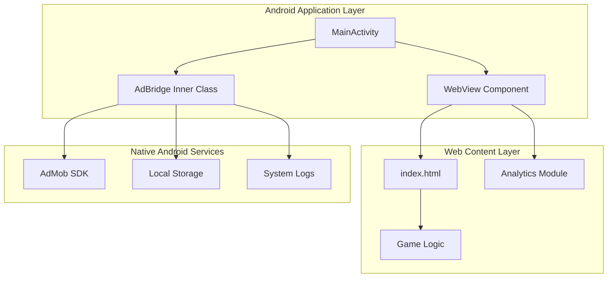
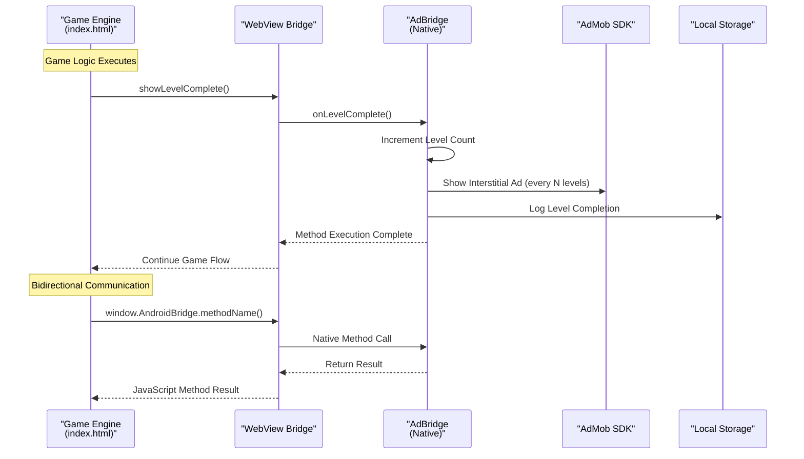
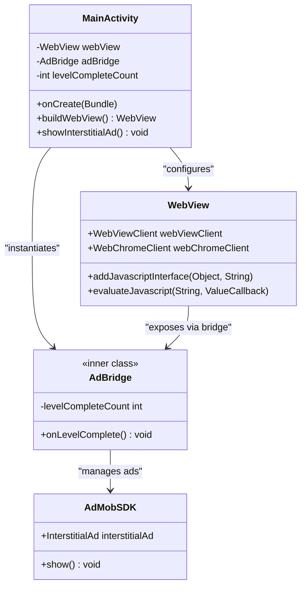
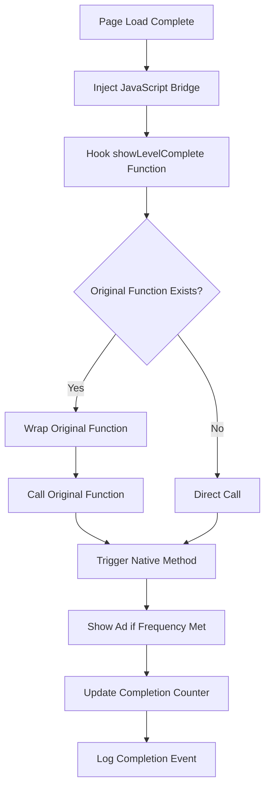
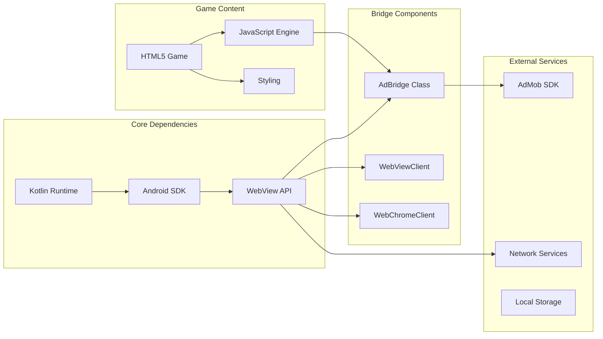

# JavaScript Bridge Interface

<cite>
**Referenced Files in This Document**
- [MainActivity.kt](file://app/src/main/java/com/cktechhub/games/MainActivity.kt)
- [index.html](file://app/src/main/assets/index.html)
- [AndroidManifest.xml](file://app/src/main/AndroidManifest.xml)
</cite>

## Table of Contents
1. [Introduction](#introduction)
2. [Project Structure](#project-structure)
3. [Core Components](#core-components)
4. [Architecture Overview](#architecture-overview)
5. [Detailed Component Analysis](#detailed-component-analysis)
6. [Dependency Analysis](#dependency-analysis)
7. [Performance Considerations](#performance-considerations)
8. [Troubleshooting Guide](#troubleshooting-guide)
9. [Security Considerations](#security-considerations)
10. [Extending the Bridge](#extending-the-bridge)
11. [Conclusion](#conclusion)

## Introduction

This document provides comprehensive coverage of the JavaScript bridge interface implementation in the Android WebView-based game application. The bridge enables bidirectional communication between the web-based game engine and the Android native layer, facilitating seamless integration of native Android features like AdMob advertising with the HTML5/JavaScript game logic.

The implementation follows the bridge pattern to extend functionality beyond simple level completion tracking, providing a foundation for analytics integration, settings management, and additional game event handling.

## Project Structure

The JavaScript bridge implementation is centered around the MainActivity class and utilizes a WebView to host the HTML5 game. The project structure demonstrates a clean separation between the Android native layer and the web-based game logic.



**Diagram sources**
- [MainActivity.kt:42-135](file://app/src/main/java/com/cktechhub/games/MainActivity.kt#L42-L135)
- [index.html:1-50](file://app/src/main/assets/index.html#L1-L50)

**Section sources**
- [MainActivity.kt:42-135](file://app/src/main/java/com/cktechhub/games/MainActivity.kt#L42-L135)
- [AndroidManifest.xml:1-51](file://app/src/main/AndroidManifest.xml#L1-L51)

## Core Components

The JavaScript bridge interface consists of several key components that work together to enable seamless communication between the WebView and Android native layer.

### WebView Configuration and Security

The WebView is configured with strict security policies to prevent unauthorized access and potential security vulnerabilities:

- JavaScript is enabled for interactive gameplay
- DOM storage is enabled for game state persistence
- Mixed content is blocked to prevent insecure connections
- File access is restricted to local assets only
- External URL navigation is blocked to prevent malicious redirects

### JavaScript Interface Registration

The bridge interface is registered using the `addJavascriptInterface()` method with the identifier "AndroidBridge", making the native methods available to JavaScript code as `window.AndroidBridge.methodName()`.

### Bidirectional Communication Pattern

The implementation establishes bidirectional communication where:
- Native Android code can call JavaScript functions
- JavaScript code can call native Android methods
- Both directions use the established bridge interface

**Section sources**
- [MainActivity.kt:165-263](file://app/src/main/java/com/cktechhub/games/MainActivity.kt#L165-L263)
- [MainActivity.kt:191-193](file://app/src/main/java/com/cktechhub/games/MainActivity.kt#L191-L193)

## Architecture Overview

The JavaScript bridge architecture implements a sophisticated communication layer between the web-based game engine and Android native services.



**Diagram sources**
- [MainActivity.kt:214-228](file://app/src/main/java/com/cktechhub/games/MainActivity.kt#L214-L228)
- [MainActivity.kt:429-439](file://app/src/main/java/com/cktechhub/games/MainActivity.kt#L429-L439)

The architecture ensures that the game logic remains in the web layer while leveraging native Android capabilities for enhanced functionality.

**Section sources**
- [MainActivity.kt:214-228](file://app/src/main/java/com/cktechhub/games/MainActivity.kt#L214-L228)
- [MainActivity.kt:429-439](file://app/src/main/java/com/cktechhub/games/MainActivity.kt#L429-L439)

## Detailed Component Analysis

### AdBridge Inner Class Implementation

The `AdBridge` inner class serves as the primary bridge between the WebView and Android native layer. It implements the bridge pattern to extend functionality beyond basic level completion tracking.



**Diagram sources**
- [MainActivity.kt:429-439](file://app/src/main/java/com/cktechhub/games/MainActivity.kt#L429-L439)
- [MainActivity.kt:165-263](file://app/src/main/java/com/cktechhub/games/MainActivity.kt#L165-L263)

#### Method Exposure and Security

The `@JavascriptInterface` annotation is crucial for exposing native methods to JavaScript. This annotation explicitly marks methods that can be accessed from JavaScript, preventing arbitrary reflection-based access to all public methods.

#### Level Completion Tracking

The `onLevelComplete()` method implements sophisticated level completion tracking with the following features:

- **Counter Management**: Tracks consecutive level completions to trigger specific actions
- **Frequency Control**: Implements configurable frequency for ad displays (every N levels)
- **Thread Safety**: Uses `runOnUiThread()` for UI-related operations
- **Logging**: Provides comprehensive logging for debugging and analytics

**Section sources**
- [MainActivity.kt:429-439](file://app/src/main/java/com/cktechhub/games/MainActivity.kt#L429-L439)

### JavaScript Injection Mechanism

The implementation uses JavaScript injection to hook into game functions and trigger native actions. This mechanism ensures that native functionality is seamlessly integrated with the game logic.



**Diagram sources**
- [MainActivity.kt:214-228](file://app/src/main/java/com/cktechhub/games/MainActivity.kt#L214-L228)

#### Function Hooking Strategy

The JavaScript injection creates a wrapper around the original `showLevelComplete` function to preserve existing functionality while adding bridge integration:

- **Preserves Original Behavior**: Calls the original function before native processing
- **Conditional Bridge Calls**: Only calls native methods if the bridge interface is available
- **Error Resilience**: Continues game flow even if bridge calls fail

**Section sources**
- [MainActivity.kt:214-228](file://app/src/main/java/com/cktechhub/games/MainActivity.kt#L214-L228)

### WebView Client Configuration

The WebView client implements comprehensive security measures and lifecycle management:

#### Navigation Security
- **Asset File Restriction**: Only allows loading from `file:///android_asset/` URLs
- **External Link Blocking**: Prevents navigation to external websites
- **Protocol Filtering**: Blocks potentially dangerous protocols (tel:, mailto:, etc.)

#### Error Handling and Recovery
- **Render Process Monitoring**: Detects and recovers from WebView crashes
- **Memory Management**: Handles out-of-memory scenarios gracefully
- **Logging Integration**: Provides detailed console logging for debugging

**Section sources**
- [MainActivity.kt:195-245](file://app/src/main/java/com/cktechhub/games/MainActivity.kt#L195-L245)

## Dependency Analysis

The JavaScript bridge implementation has well-defined dependencies that support its functionality and security requirements.



**Diagram sources**
- [MainActivity.kt:165-263](file://app/src/main/java/com/cktechhub/games/MainActivity.kt#L165-L263)
- [AndroidManifest.xml:5-8](file://app/src/main/AndroidManifest.xml#L5-L8)

### Security Dependencies

The implementation relies on several security mechanisms:

- **Permission Model**: Requires internet and network state permissions
- **Content Security**: Restricts WebView content to local assets
- **Method Exposure Control**: Uses explicit annotations for method exposure
- **Error Isolation**: Prevents JavaScript errors from affecting native code

**Section sources**
- [AndroidManifest.xml:5-8](file://app/src/main/AndroidManifest.xml#L5-L8)
- [MainActivity.kt:173-189](file://app/src/main/java/com/cktechhub/games/MainActivity.kt#L173-L189)

## Performance Considerations

The JavaScript bridge implementation incorporates several performance optimization strategies:

### Memory Management
- **WebView Lifecycle**: Properly manages WebView creation, reuse, and destruction
- **Resource Cleanup**: Ensures proper cleanup of native resources during activity lifecycle
- **Garbage Collection**: Minimizes memory leaks through proper object lifecycle management

### Network Optimization
- **Ad Loading Strategy**: Preloads interstitial ads to reduce latency
- **Connection Validation**: Checks for internet availability before attempting ad requests
- **Error Recovery**: Implements retry mechanisms for failed ad loads

### Rendering Performance
- **Render Process Monitoring**: Detects and recovers from renderer crashes
- **UI Thread Management**: Uses appropriate threading for UI updates
- **Animation Coordination**: Synchronizes native animations with web-based animations

## Troubleshooting Guide

### Common Issues and Solutions

#### Bridge Method Not Found
**Symptom**: JavaScript calls to `window.AndroidBridge.methodName()` fail
**Causes**: 
- Bridge not properly registered
- Method not annotated with `@JavascriptInterface`
- WebView not fully initialized

**Solutions**:
- Verify `addJavascriptInterface()` call occurs before page load
- Ensure methods are properly annotated
- Check for WebView initialization before bridge usage

#### JavaScript Injection Failures
**Symptom**: Game functions not triggering native methods
**Causes**:
- JavaScript injection timing issues
- Original function not found
- Bridge interface not available

**Solutions**:
- Implement proper page load detection
- Use fallback mechanisms for missing functions
- Verify bridge registration before injection

#### AdMob Integration Issues
**Symptom**: Ads not displaying or failing to load
**Causes**:
- Network connectivity problems
- AdMob SDK initialization failures
- Incorrect ad unit configuration

**Solutions**:
- Implement network availability checks
- Verify AdMob SDK initialization
- Use test ad unit IDs during development

### Debugging Techniques

#### WebView Debugging
- Enable WebView debugging in developer options
- Use Chrome DevTools for remote debugging
- Monitor console messages for JavaScript errors

#### Native Debugging
- Utilize Logcat for bridge method calls
- Implement detailed logging for bridge operations
- Monitor WebView lifecycle events

#### Performance Monitoring
- Track bridge method execution times
- Monitor memory usage during bridge operations
- Profile JavaScript injection performance

**Section sources**
- [MainActivity.kt:231-244](file://app/src/main/java/com/cktechhub/games/MainActivity.kt#L231-L244)
- [MainActivity.kt:248-256](file://app/src/main/java/com/cktechhub/games/MainActivity.kt#L248-L256)

## Security Considerations

### JavaScript Interface Security

The `@JavascriptInterface` annotation is fundamental to secure bridge implementation:

#### Method Exposure Control
- **Explicit Annotation**: Only methods with `@JavascriptInterface` are exposed
- **No Automatic Reflection**: Prevents unintended method exposure
- **Type Safety**: Maintains type safety across bridge boundaries

#### Cross-Site Scripting Prevention
- **Content Restriction**: Limits WebView content to trusted local assets
- **URL Validation**: Implements strict URL filtering for navigation
- **Protocol Whitelisting**: Allows only safe protocols

### WebView Security Hardening

#### Content Security
- **Mixed Content Blocking**: Prevents loading of insecure resources
- **File Access Restrictions**: Limits file system access to local assets
- **DOM Storage Control**: Manages persistent storage access

#### Navigation Security
- **External Link Blocking**: Prevents navigation to external domains
- **Protocol Filtering**: Blocks potentially dangerous protocols
- **Custom URL Handling**: Implements custom logic for URL decisions

### Permission Management

The application requires specific permissions for proper functionality:

- **Internet Permission**: Enables network connectivity for ads
- **Network State Access**: Allows checking connection status
- **WiFi State Access**: Supports network optimization

**Section sources**
- [MainActivity.kt:173-189](file://app/src/main/java/com/cktechhub/games/MainActivity.kt#L173-L189)
- [AndroidManifest.xml:5-8](file://app/src/main/AndroidManifest.xml#L5-L8)

## Extending the Bridge

### Additional Game Events

The bridge can be extended to handle various game events beyond level completion:

#### Analytics Integration
```javascript
// Example: Track game session events
window.AndroidBridge.trackEvent("game_start", {level: 1, timestamp: Date.now()});
window.AndroidBridge.trackEvent("move_made", {moves: state.moves, level: state.currentLevel});
window.AndroidBridge.trackEvent("game_won", {level: state.currentLevel, score: computeScore()});
```

#### Settings Management
```javascript
// Example: Retrieve user preferences
const settings = window.AndroidBridge.getUserSettings();
state.soundEnabled = settings.soundEnabled;
state.animEnabled = settings.animEnabled;
```

#### Achievement System
```javascript
// Example: Unlock achievements
window.AndroidBridge.unlockAchievement("first_win");
window.AndroidBridge.unlockAchievement("level_master", {level: 15});
```

### Bridge Pattern Implementation

The current implementation demonstrates the bridge pattern by:

1. **Defining Abstraction**: The `AdBridge` class defines the bridge interface
2. **Implementing Platform**: The Android native layer implements the bridge functionality
3. **Enabling Decoupling**: Game logic remains independent of platform-specific features
4. **Supporting Extension**: Easy addition of new bridge methods without modifying game logic

### Future Enhancement Opportunities

#### Multi-Bridge Architecture
Consider implementing separate bridge classes for different functional areas:
- `AnalyticsBridge`: Analytics and tracking methods
- `SettingsBridge`: User preference management
- `AchievementBridge`: Achievement and progress tracking

#### Async Bridge Methods
Implement asynchronous bridge methods for long-running operations:
- Non-blocking ad loading operations
- Background analytics processing
- Async settings synchronization

#### Parameterized Bridge Methods
Extend bridge methods to accept parameters for richer functionality:
- Event data with timestamps and metadata
- User preferences with validation
- Analytics parameters with filtering

**Section sources**
- [MainActivity.kt:429-439](file://app/src/main/java/com/cktechhub/games/MainActivity.kt#L429-L439)

## Conclusion

The JavaScript bridge interface implementation provides a robust foundation for integrating Android native functionality with web-based game logic. The implementation successfully demonstrates:

- **Secure Bridge Pattern**: Proper use of `@JavascriptInterface` and security annotations
- **Bidirectional Communication**: Seamless integration between WebView and Android layer
- **Extensible Architecture**: Foundation for adding analytics, settings, and achievement systems
- **Performance Optimization**: Efficient resource management and error handling
- **Security Best Practices**: Comprehensive security measures and permission management

The bridge enables sophisticated features like AdMob integration while maintaining clean separation between game logic and platform-specific functionality. The implementation serves as an excellent example of effective cross-platform communication patterns and can be extended to support additional native features as the application evolves.