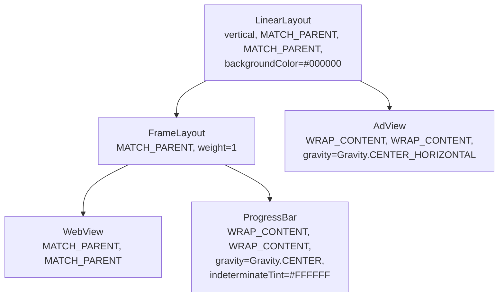
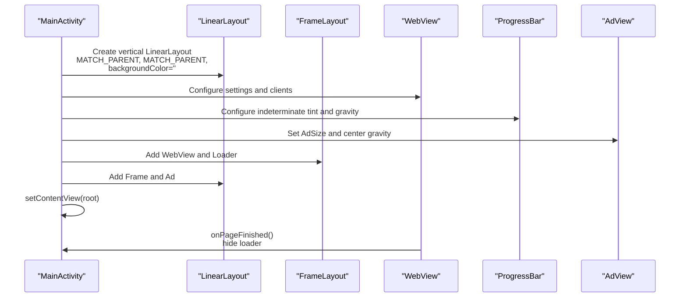
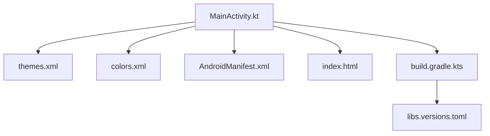

# Layout Builders & UI Components

<cite>
**Referenced Files in This Document**
- [MainActivity.kt](file://app/src/main/java/com/cktechhub/games/MainActivity.kt)
- [AndroidManifest.xml](file://app/src/main/AndroidManifest.xml)
- [themes.xml](file://app/src/main/res/values/themes.xml)
- [colors.xml](file://app/src/main/res/values/colors.xml)
- [strings.xml](file://app/src/main/res/values/strings.xml)
- [index.html](file://app/src/main/assets/index.html)
- [build.gradle.kts](file://app/build.gradle.kts)
- [libs.versions.toml](file://gradle/libs.versions.toml)
- [ADMOB_SETUP.md](file://ADMOB_SETUP.md)
</cite>

## Table of Contents
1. [Introduction](#introduction)
2. [Project Structure](#project-structure)
3. [Core Components](#core-components)
4. [Architecture Overview](#architecture-overview)
5. [Detailed Component Analysis](#detailed-component-analysis)
6. [Dependency Analysis](#dependency-analysis)
7. [Performance Considerations](#performance-considerations)
8. [Troubleshooting Guide](#troubleshooting-guide)
9. [Conclusion](#conclusion)
10. [Appendices](#appendices)

## Introduction
This document explains how the application builds its UI and manages layout components. It focuses on:
- The root LinearLayout with vertical orientation and black background
- The WebView construction with sizing and positioning
- The loading indicator implemented with a ProgressBar and centered overlay
- The banner AdView placed at the bottom with horizontal centering
- The FrameLayout wrapper used to overlay the loading indicator on the WebView
- Styling, color management, and responsive layout considerations
- Performance optimization, memory management, and lifecycle coordination
- Theming, customization, and accessibility guidance

## Project Structure
The UI is constructed programmatically inside the main activity. The root container is a vertical LinearLayout. The WebView fills most of the screen, overlaid by a centered ProgressBar. A banner AdView is placed below the WebView within the same vertical LinearLayout.

**Diagram sources**
- [MainActivity.kt:95-128](file://app/src/main/java/com/cktechhub/games/MainActivity.kt#L95-L128)
- [MainActivity.kt:165-263](file://app/src/main/java/com/cktechhub/games/MainActivity.kt#L165-L263)
- [MainActivity.kt:265-278](file://app/src/main/java/com/cktechhub/games/MainActivity.kt#L265-L278)
- [MainActivity.kt:280-290](file://app/src/main/java/com/cktechhub/games/MainActivity.kt#L280-L290)

**Section sources**
- [MainActivity.kt:95-128](file://app/src/main/java/com/cktechhub/games/MainActivity.kt#L95-L128)
- [MainActivity.kt:165-263](file://app/src/main/java/com/cktechhub/games/MainActivity.kt#L165-L263)
- [MainActivity.kt:265-278](file://app/src/main/java/com/cktechhub/games/MainActivity.kt#L265-L278)
- [MainActivity.kt:280-290](file://app/src/main/java/com/cktechhub/games/MainActivity.kt#L280-L290)

## Core Components
- Root layout: A vertical LinearLayout with full-screen dimensions and a black background.
- WebView: Configured with sensible defaults for performance and security, sized to fill the FrameLayout.
- Loading indicator: A ProgressBar with white tint and centered gravity, overlaid on the WebView.
- Banner AdView: Centered horizontally at the bottom with wrap content sizing.
- FrameLayout wrapper: Ensures the ProgressBar overlays the WebView.

Key implementation references:
- Root layout creation and background color: [MainActivity.kt:95-103](file://app/src/main/java/com/cktechhub/games/MainActivity.kt#L95-L103)
- WebView sizing and settings: [MainActivity.kt:165-263](file://app/src/main/java/com/cktechhub/games/MainActivity.kt#L165-L263)
- Loading indicator styling and centering: [MainActivity.kt:280-290](file://app/src/main/java/com/cktechhub/games/MainActivity.kt#L280-L290)
- Banner AdView centering and sizing: [MainActivity.kt:265-278](file://app/src/main/java/com/cktechhub/games/MainActivity.kt#L265-L278)
- Overlay wrapper and child addition: [MainActivity.kt:114-128](file://app/src/main/java/com/cktechhub/games/MainActivity.kt#L114-L128)

**Section sources**
- [MainActivity.kt:95-103](file://app/src/main/java/com/cktechhub/games/MainActivity.kt#L95-L103)
- [MainActivity.kt:165-263](file://app/src/main/java/com/cktechhub/games/MainActivity.kt#L165-L263)
- [MainActivity.kt:265-278](file://app/src/main/java/com/cktechhub/games/MainActivity.kt#L265-L278)
- [MainActivity.kt:280-290](file://app/src/main/java/com/cktechhub/games/MainActivity.kt#L280-L290)
- [MainActivity.kt:114-128](file://app/src/main/java/com/cktechhub/games/MainActivity.kt#L114-L128)

## Architecture Overview
The UI architecture centers around a single activity that constructs the layout at runtime. The WebView hosts the game content, while the AdView displays a banner ad at the bottom. The loading indicator appears during page load and is removed when the page finishes.

**Diagram sources**
- [MainActivity.kt:95-132](file://app/src/main/java/com/cktechhub/games/MainActivity.kt#L95-L132)
- [MainActivity.kt:165-263](file://app/src/main/java/com/cktechhub/games/MainActivity.kt#L165-L263)
- [MainActivity.kt:265-278](file://app/src/main/java/com/cktechhub/games/MainActivity.kt#L265-L278)
- [MainActivity.kt:280-290](file://app/src/main/java/com/cktechhub/games/MainActivity.kt#L280-L290)

## Detailed Component Analysis

### LinearLayout Root Layout
- Orientation: Vertical
- Dimensions: MATCH_PARENT for width and height
- Background: Black (#000000)
- Purpose: Host the WebView frame above and the banner AdView below

Implementation reference:
- [MainActivity.kt:95-103](file://app/src/main/java/com/cktechhub/games/MainActivity.kt#L95-L103)

Styling and color management:
- The root background uses a hex color converted to an integer.
- The theme sets a black window background for immersive full-screen behavior.

Implementation references:
- [themes.xml:8](file://app/src/main/res/values/themes.xml#L8)
- [AndroidManifest.xml:17](file://app/src/main/AndroidManifest.xml#L17)

Responsive considerations:
- The root layout adapts to device orientation and screen sizes via MATCH_PARENT.

**Section sources**
- [MainActivity.kt:95-103](file://app/src/main/java/com/cktechhub/games/MainActivity.kt#L95-L103)
- [themes.xml:8](file://app/src/main/res/values/themes.xml#L8)
- [AndroidManifest.xml:17](file://app/src/main/AndroidManifest.xml#L17)

### WebView Construction and Sizing
- Sizing: MATCH_PARENT in both directions within the FrameLayout wrapper
- Settings:
  - JavaScript enabled
  - DOM storage enabled
  - File and content access allowed
  - Zoom disabled
  - Mixed content policy restricted
  - Wide viewport and overview mode enabled
  - Cache mode set to default
  - Text zoom fixed at 100%
- Clients:
  - WebViewClient with safe navigation and crash recovery
  - WebChromeClient for console logging
- Scrolling and overscroll disabled for immersive feel

Implementation references:
- [MainActivity.kt:165-263](file://app/src/main/java/com/cktechhub/games/MainActivity.kt#L165-L263)

Game content:
- Loads a local HTML file from assets.

Implementation reference:
- [MainActivity.kt:131](file://app/src/main/java/com/cktechhub/games/MainActivity.kt#L131)

Responsive considerations:
- Uses viewport meta in the HTML to control scaling and responsiveness.
- The game’s CSS and JavaScript adapt to screen size and safe areas.

Implementation reference:
- [index.html:5](file://app/src/main/assets/index.html#L5)
- [index.html:193](file://app/src/main/assets/index.html#L193)

**Section sources**
- [MainActivity.kt:165-263](file://app/src/main/java/com/cktechhub/games/MainActivity.kt#L165-L263)
- [MainActivity.kt:131](file://app/src/main/java/com/cktechhub/games/MainActivity.kt#L131)
- [index.html:5](file://app/src/main/assets/index.html#L5)
- [index.html:193](file://app/src/main/assets/index.html#L193)

### Loading Indicator (ProgressBar)
- Sizing: WRAP_CONTENT for width and height
- Positioning: Centered within the FrameLayout using CENTER gravity
- Tint: White color via indeterminateTintList
- Visibility: Shown during loading and hidden on page finished

Implementation references:
- [MainActivity.kt:280-290](file://app/src/main/java/com/cktechhub/games/MainActivity.kt#L280-L290)
- [MainActivity.kt:209-213](file://app/src/main/java/com/cktechhub/games/MainActivity.kt#L209-L213)

Accessibility considerations:
- The indicator is visually centered and uses a high-contrast white tint against the dark background.

**Section sources**
- [MainActivity.kt:280-290](file://app/src/main/java/com/cktechhub/games/MainActivity.kt#L280-L290)
- [MainActivity.kt:209-213](file://app/src/main/java/com/cktechhub/games/MainActivity.kt#L209-L213)

### Banner AdView Placement
- Ad size: BANNER
- Sizing: WRAP_CONTENT for both width and height
- Alignment: Centered horizontally using CENTER_HORIZONTAL gravity
- Placement: Added as the second child of the vertical LinearLayout, below the WebView frame

Implementation references:
- [MainActivity.kt:265-278](file://app/src/main/java/com/cktechhub/games/MainActivity.kt#L265-L278)
- [MainActivity.kt:125-127](file://app/src/main/java/com/cktechhub/games/MainActivity.kt#L125-L127)

Monetization setup:
- AdMob IDs are configured in the manifest and code; replace test IDs with production IDs before release.

Implementation references:
- [AndroidManifest.xml:20-28](file://app/src/main/AndroidManifest.xml#L20-L28)
- [ADMOB_SETUP.md:46-62](file://ADMOB_SETUP.md#L46-L62)

**Section sources**
- [MainActivity.kt:265-278](file://app/src/main/java/com/cktechhub/games/MainActivity.kt#L265-L278)
- [MainActivity.kt:125-127](file://app/src/main/java/com/cktechhub/games/MainActivity.kt#L125-L127)
- [AndroidManifest.xml:20-28](file://app/src/main/AndroidManifest.xml#L20-L28)
- [ADMOB_SETUP.md:46-62](file://ADMOB_SETUP.md#L46-L62)

### FrameLayout Wrapper for Overlay
- Purpose: Place the ProgressBar on top of the WebView
- Layout params: MATCH_PARENT width and a flexible weight to occupy remaining space
- Children: WebView and ProgressBar added in order (WebView first, ProgressBar on top)

Implementation references:
- [MainActivity.kt:114-123](file://app/src/main/java/com/cktechhub/games/MainActivity.kt#L114-L123)
- [MainActivity.kt:165-170](file://app/src/main/java/com/cktechhub/games/MainActivity.kt#L165-L170)
- [MainActivity.kt:280-287](file://app/src/main/java/com/cktechhub/games/MainActivity.kt#L280-L287)

**Section sources**
- [MainActivity.kt:114-123](file://app/src/main/java/com/cktechhub/games/MainActivity.kt#L114-L123)
- [MainActivity.kt:165-170](file://app/src/main/java/com/cktechhub/games/MainActivity.kt#L165-L170)
- [MainActivity.kt:280-287](file://app/src/main/java/com/cktechhub/games/MainActivity.kt#L280-L287)

### Offline Error UI (Alternative Layout)
When internet is unavailable, the app switches to a full-screen offline layout with:
- Vertical LinearLayout with centered content
- Dark background color
- Title, subtitle, and retry button styled with colors and paddings

Implementation references:
- [MainActivity.kt:304-364](file://app/src/main/java/com/cktechhub/games/MainActivity.kt#L304-L364)
- [strings.xml:3-6](file://app/src/main/res/values/strings.xml#L3-L6)
- [colors.xml:8-9](file://app/src/main/res/values/colors.xml#L8-L9)

**Section sources**
- [MainActivity.kt:304-364](file://app/src/main/java/com/cktechhub/games/MainActivity.kt#L304-L364)
- [strings.xml:3-6](file://app/src/main/res/values/strings.xml#L3-L6)
- [colors.xml:8-9](file://app/src/main/res/values/colors.xml#L8-L9)

## Dependency Analysis
External libraries and services:
- AndroidX AppCompat for activity and theming
- Play Services Ads for AdMob integration
- Kotlin coroutines utilities for color conversion

Implementation references:
- [build.gradle.kts:34-43](file://app/build.gradle.kts#L34-L43)
- [libs.versions.toml:13-21](file://gradle/libs.versions.toml#L13-L21)

AdMob configuration:
- Application ID and provider declared in the manifest
- Ad unit IDs configured in code

Implementation references:
- [AndroidManifest.xml:20-48](file://app/src/main/AndroidManifest.xml#L20-L48)
- [ADMOB_SETUP.md:46-62](file://ADMOB_SETUP.md#L46-L62)

**Diagram sources**
- [MainActivity.kt:95-132](file://app/src/main/java/com/cktechhub/games/MainActivity.kt#L95-L132)
- [themes.xml:4-9](file://app/src/main/res/values/themes.xml#L4-L9)
- [colors.xml:1-10](file://app/src/main/res/values/colors.xml#L1-L10)
- [AndroidManifest.xml:17-48](file://app/src/main/AndroidManifest.xml#L17-L48)
- [index.html:1-203](file://app/src/main/assets/index.html#L1-L203)
- [build.gradle.kts:34-43](file://app/build.gradle.kts#L34-L43)
- [libs.versions.toml:13-21](file://gradle/libs.versions.toml#L13-L21)

**Section sources**
- [build.gradle.kts:34-43](file://app/build.gradle.kts#L34-L43)
- [libs.versions.toml:13-21](file://gradle/libs.versions.toml#L13-L21)
- [AndroidManifest.xml:20-48](file://app/src/main/AndroidManifest.xml#L20-L48)
- [ADMOB_SETUP.md:46-62](file://ADMOB_SETUP.md#L46-L62)

## Performance Considerations
- WebView settings:
  - Mixed content disabled to prevent insecure loads
  - Cache mode set to default to balance performance and freshness
  - Zoom controls disabled to reduce unnecessary UI overhead
- Scrolling and overscroll disabled to minimize layout churn
- Render process crash handling: destroys and recreates the WebView on renderer gone events
- Lifecycle management:
  - Resume/pause calls forwarded to WebView and AdView
  - Destroy called in onDestroy to free native resources

Implementation references:
- [MainActivity.kt:173-189](file://app/src/main/java/com/cktechhub/games/MainActivity.kt#L173-L189)
- [MainActivity.kt:231-244](file://app/src/main/java/com/cktechhub/games/MainActivity.kt#L231-L244)
- [MainActivity.kt:137-154](file://app/src/main/java/com/cktechhub/games/MainActivity.kt#L137-L154)

Memory management:
- Explicitly destroy WebView and AdView in onDestroy
- Clear interstitial reference to prevent leaks

Implementation references:
- [MainActivity.kt:149-153](file://app/src/main/java/com/cktechhub/games/MainActivity.kt#L149-L153)

Responsive layout:
- The HTML viewport meta and CSS ensure the game scales appropriately across devices
- Safe area padding is applied in the game styles

Implementation references:
- [index.html:5](file://app/src/main/assets/index.html#L5)
- [index.html:193](file://app/src/main/assets/index.html#L193)

**Section sources**
- [MainActivity.kt:173-189](file://app/src/main/java/com/cktechhub/games/MainActivity.kt#L173-L189)
- [MainActivity.kt:231-244](file://app/src/main/java/com/cktechhub/games/MainActivity.kt#L231-L244)
- [MainActivity.kt:137-154](file://app/src/main/java/com/cktechhub/games/MainActivity.kt#L137-L154)
- [MainActivity.kt:149-153](file://app/src/main/java/com/cktechhub/games/MainActivity.kt#L149-L153)
- [index.html:5](file://app/src/main/assets/index.html#L5)
- [index.html:193](file://app/src/main/assets/index.html#L193)

## Troubleshooting Guide
Common issues and remedies:
- No internet connection:
  - The app checks connectivity and shows an offline layout with retry button
  - Ensure permissions are present in the manifest

Implementation references:
- [MainActivity.kt:296-302](file://app/src/main/java/com/cktechhub/games/MainActivity.kt#L296-L302)
- [MainActivity.kt:304-364](file://app/src/main/java/com/cktechhub/games/MainActivity.kt#L304-L364)
- [AndroidManifest.xml:5-7](file://app/src/main/AndroidManifest.xml#L5-L7)

- AdMob not showing:
  - Verify production AdMob IDs are configured in both manifest and code
  - Confirm the provider declaration is present

Implementation references:
- [AndroidManifest.xml:20-48](file://app/src/main/AndroidManifest.xml#L20-L48)
- [ADMOB_SETUP.md:46-62](file://ADMOB_SETUP.md#L46-L62)

- WebView crashes or slow rendering:
  - Renderer gone handling destroys and recreates the WebView
  - Review WebView settings for mixed content and cache modes

Implementation references:
- [MainActivity.kt:231-244](file://app/src/main/java/com/cktechhub/games/MainActivity.kt#L231-L244)
- [MainActivity.kt:173-189](file://app/src/main/java/com/cktechhub/games/MainActivity.kt#L173-L189)

**Section sources**
- [MainActivity.kt:296-302](file://app/src/main/java/com/cktechhub/games/MainActivity.kt#L296-L302)
- [MainActivity.kt:304-364](file://app/src/main/java/com/cktechhub/games/MainActivity.kt#L304-L364)
- [AndroidManifest.xml:20-48](file://app/src/main/AndroidManifest.xml#L20-L48)
- [ADMOB_SETUP.md:46-62](file://ADMOB_SETUP.md#L46-L62)
- [MainActivity.kt:231-244](file://app/src/main/java/com/cktechhub/games/MainActivity.kt#L231-L244)
- [MainActivity.kt:173-189](file://app/src/main/java/com/cktechhub/games/MainActivity.kt#L173-L189)

## Conclusion
The application constructs a clean, performance-conscious UI with a dark-themed root layout, a full-screen WebView, and a centered loading indicator overlay. A banner AdView is positioned at the bottom with horizontal centering. The implementation emphasizes lifecycle safety, memory management, and responsive behavior, while providing clear hooks for monetization and theming.

## Appendices

### Theming and Customization
- Root background color:
  - Defined via backgroundColor on the LinearLayout and enforced by the theme’s window background item.
- Color palette:
  - Standard named colors include black and white for consistent theming.
- Typography and accents:
  - The game’s HTML/CSS defines gradients and typography; ensure contrast remains readable against the dark background.

Implementation references:
- [MainActivity.kt:102](file://app/src/main/java/com/cktechhub/games/MainActivity.kt#L102)
- [themes.xml:8](file://app/src/main/res/values/themes.xml#L8)
- [colors.xml:8-9](file://app/src/main/res/values/colors.xml#L8-L9)
- [index.html:18-20](file://app/src/main/assets/index.html#L18-L20)

### Accessibility Considerations
- Contrast:
  - The white loading indicator provides sufficient contrast against the black background.
- Focus and immersion:
  - Full-screen immersive mode hides system bars; ensure content remains navigable.
- Touch targets:
  - The game’s UI uses appropriately sized buttons and interactive elements.

Implementation references:
- [MainActivity.kt:288](file://app/src/main/java/com/cktechhub/games/MainActivity.kt#L288)
- [MainActivity.kt:415-422](file://app/src/main/java/com/cktechhub/games/MainActivity.kt#L415-L422)
- [index.html:221-229](file://app/src/main/assets/index.html#L221-L229)

### Lifecycle Coordination
- Resume/pause:
  - Forwarded to WebView and AdView to ensure proper resource management.
- Destroy:
  - Frees WebView and AdView resources and clears interstitial references.

Implementation references:
- [MainActivity.kt:137-154](file://app/src/main/java/com/cktechhub/games/MainActivity.kt#L137-L154)
- [MainActivity.kt:149-153](file://app/src/main/java/com/cktechhub/games/MainActivity.kt#L149-L153)