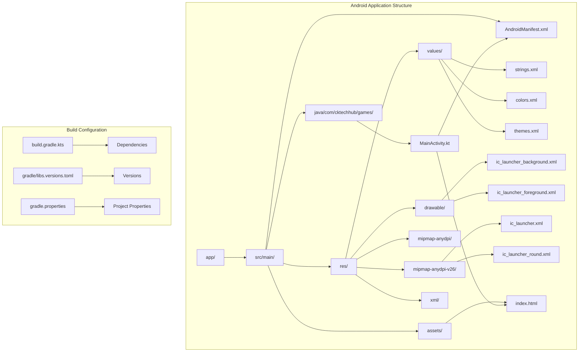
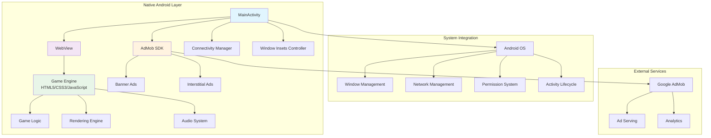
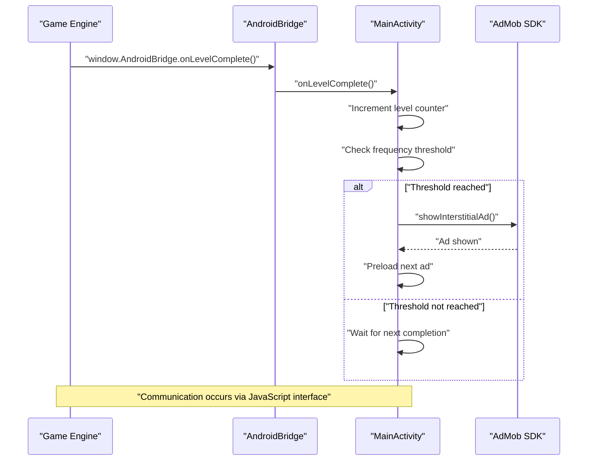
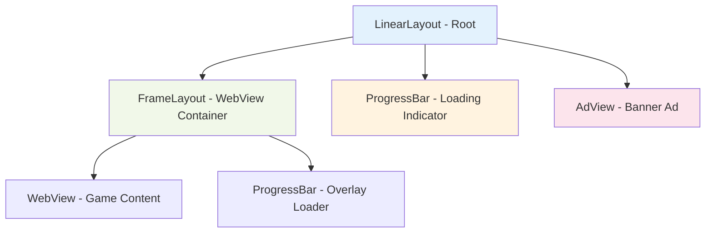
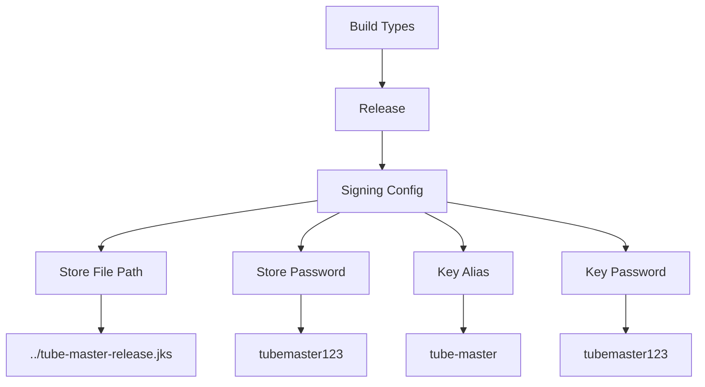

# Native Android Components

<cite>
**Referenced Files in This Document**
- [MainActivity.kt](file://app/src/main/java/com/cktechhub/games/MainActivity.kt)
- [AndroidManifest.xml](file://app/src/main/AndroidManifest.xml)
- [index.html](file://app/src/main/assets/index.html)
- [strings.xml](file://app/src/main/res/values/strings.xml)
- [themes.xml](file://app/src/main/res/values/themes.xml)
- [colors.xml](file://app/src/main/res/values/colors.xml)
- [ic_launcher.xml](file://app/src/main/res/mipmap-anydpi-v26/ic_launcher.xml)
- [ic_launcher_round.xml](file://app/src/main/res/mipmap-anydpi-v26/ic_launcher_round.xml)
- [ic_launcher_background.xml](file://app/src/main/res/drawable/ic_launcher_background.xml)
- [ic_launcher_foreground.xml](file://app/src/main/res/drawable/ic_launcher_foreground.xml)
- [build.gradle.kts](file://app/build.gradle.kts)
- [gradle.properties](file://gradle.properties)
- [libs.versions.toml](file://gradle/libs.versions.toml)
</cite>

## Update Summary
**Changes Made**
- Updated build configuration section to reflect new release signing setup
- Added production deployment documentation for code signing
- Enhanced build security documentation with keystore management
- Updated build configuration examples with signing configuration details

## Table of Contents
1. [Introduction](#introduction)
2. [Project Structure](#project-structure)
3. [Core Components](#core-components)
4. [Architecture Overview](#architecture-overview)
5. [Detailed Component Analysis](#detailed-component-analysis)
6. [Build Configuration and Deployment](#build-configuration-and-deployment)
7. [Dependency Analysis](#dependency-analysis)
8. [Performance Considerations](#performance-considerations)
9. [Troubleshooting Guide](#troubleshooting-guide)
10. [Conclusion](#conclusion)

## Introduction

This document provides comprehensive technical documentation for the native Android components and system integration of the games application. The implementation demonstrates modern Android development practices with a WebView-based game engine integration, featuring immersive mode support, robust internet connectivity checking, loading indicator management, and seamless AdMob advertising integration.

The application follows a clean separation of concerns where the native Android layer handles system integration, lifecycle management, and advertising, while the game engine runs within a WebView containing HTML5/CSS3/JavaScript code. This architecture enables efficient cross-platform development while maintaining native performance characteristics.

**Updated** Application branding has been refreshed with the new name 'Tube Master Puzzle' and includes enhanced adaptive icon system support for modern Android devices. The project now features comprehensive release signing configuration for secure production deployments.

## Project Structure

The project follows standard Android Gradle Project structure with clear separation between native Android components and web assets:



**Diagram sources**
- [MainActivity.kt:1-441](file://app/src/main/java/com/cktechhub/games/MainActivity.kt#L1-L441)
- [AndroidManifest.xml:1-51](file://app/src/main/AndroidManifest.xml#L1-L51)

**Section sources**
- [MainActivity.kt:1-441](file://app/src/main/java/com/cktechhub/games/MainActivity.kt#L1-L441)
- [AndroidManifest.xml:1-51](file://app/src/main/AndroidManifest.xml#L1-L51)

## Core Components

### MainActivity Implementation

The `MainActivity` serves as the central orchestrator for the entire application, implementing multiple critical Android system integrations:

#### WebView Lifecycle Management
The application implements comprehensive WebView lifecycle management through dedicated lifecycle callbacks:

- **onCreate**: Initializes immersive mode, performs internet connectivity checks, sets up the WebView with security configurations, builds the loading indicator, and loads the game assets
- **onResume**: Resumes WebView and AdMob components when the activity regains focus
- **onPause**: Pauses WebView and AdMob components to conserve resources
- **onDestroy**: Properly destroys WebView and AdMob instances to prevent memory leaks

#### Immersive Mode Implementation
The application achieves true immersive experience through WindowInsetsControllerCompat:

- Disables system UI decorations during runtime
- Maintains persistent screen-on behavior
- Supports transient bar appearance via swipe gestures
- Integrates with the game's responsive design through safe area insets

#### Internet Connectivity Checking
Robust network availability verification using ConnectivityManager:

- Checks for active network connections
- Validates network capabilities including internet access
- Provides graceful offline user experience with retry mechanism
- Implements immediate reconnection attempts

#### Loading Indicator Management
Sophisticated loading state management:

- Overlay progress indicator positioned over WebView
- Automatic visibility control based on page load completion
- Custom styling with white tint color matching the dark theme
- Centered positioning using FrameLayout gravity

**Section sources**
- [MainActivity.kt:42-154](file://app/src/main/java/com/cktechhub/games/MainActivity.kt#L42-L154)
- [MainActivity.kt:415-422](file://app/src/main/java/com/cktechhub/games/MainActivity.kt#L415-L422)
- [MainActivity.kt:296-302](file://app/src/main/java/com/cktechhub/games/MainActivity.kt#L296-L302)
- [MainActivity.kt:280-290](file://app/src/main/java/com/cktechhub/games/MainActivity.kt#L280-L290)

### WebView Configuration and Security

The WebView implementation prioritizes security and performance:

#### Security Settings
- JavaScript enabled for game functionality
- DOM storage enabled for game state persistence
- File access restricted to local assets only
- Mixed content policy set to never allow
- User gesture requirements disabled for autoplay

#### Navigation Control
Custom WebViewClient implementation blocks external navigation attempts:
- Allows only file:///android_asset/ URLs
- Blocks external links, tel:, mailto:, and other protocols
- Prevents potential security vulnerabilities

#### Performance Optimizations
- Disabled zoom controls to maintain consistent gameplay
- Optimized cache mode for default behavior
- Scroll bars disabled to reduce visual clutter
- Over-scroll mode set to never

**Section sources**
- [MainActivity.kt:165-263](file://app/src/main/java/com/cktechhub/games/MainActivity.kt#L165-L263)

### AdMob Integration

The application integrates Google AdMob for monetization:

#### Banner Ad Implementation
- Positioned at the bottom of the interface
- Uses standard banner ad size
- Centered horizontally using gravity
- Automatic loading with AdRequest

#### Interstitial Ad Management
- Configured to show every N level completions
- Preloaded during initialization
- Automatic retry on failure
- Proper cleanup and lifecycle management

#### Ad Bridge Interface
Bidirectional communication between WebView and Android:
- JavaScript interface named "AndroidBridge"
- Level completion tracking
- Conditional interstitial ad triggering
- Thread-safe UI updates

**Section sources**
- [MainActivity.kt:265-278](file://app/src/main/java/com/cktechhub/games/MainActivity.kt#L265-L278)
- [MainActivity.kt:370-409](file://app/src/main/java/com/cktechhub/games/MainActivity.kt#L370-L409)
- [MainActivity.kt:428-439](file://app/src/main/java/com/cktechhub/games/MainActivity.kt#L428-L439)

### Launcher Configuration and Adaptive Icons

**Updated** The application now features a modern adaptive icon system designed for contemporary Android devices:

#### Adaptive Icon Architecture
The launcher configuration utilizes Android's adaptive icon system with layered design:

- **Background Layer**: Vector-based geometric pattern with gradient effects
- **Foreground Layer**: Application-specific icon graphics with shadow effects
- **Rounded Corners**: Circular launcher icons for round device displays
- **Safe Area**: Proper padding to prevent clipping on different device shapes

#### Icon File Structure
The adaptive icon system consists of multiple XML configuration files:

- **ic_launcher.xml**: Square-shaped adaptive icon for standard launcher displays
- **ic_launcher_round.xml**: Round-shaped adaptive icon for circular launcher displays
- **Background Elements**: Shared vector backgrounds across both icon variants
- **Foreground Graphics**: Distinct foreground elements for visual identity

#### Icon Design Specifications
- **Viewport Dimensions**: 108x108 dp for scalable vector graphics
- **Color Palette**: Modern gradient backgrounds with transparent foreground elements
- **Stroke Details**: Subtle grid patterns creating visual texture
- **Shadow Effects**: Linear gradients for depth perception

**Section sources**
- [ic_launcher.xml:1-5](file://app/src/main/res/mipmap-anydpi-v26/ic_launcher.xml#L1-L5)
- [ic_launcher_round.xml:1-5](file://app/src/main/res/mipmap-anydpi-v26/ic_launcher_round.xml#L1-L5)
- [ic_launcher_background.xml:1-75](file://app/src/main/res/drawable/ic_launcher_background.xml#L1-L75)
- [ic_launcher_foreground.xml:1-30](file://app/src/main/res/drawable/ic_launcher_foreground.xml#L1-L30)

## Architecture Overview

The application follows a hybrid architecture combining native Android components with a WebView-based game engine:



**Diagram sources**
- [MainActivity.kt:42-154](file://app/src/main/java/com/cktechhub/games/MainActivity.kt#L42-L154)
- [MainActivity.kt:165-263](file://app/src/main/java/com/cktechhub/games/MainActivity.kt#L165-L263)

### WebView-Android Communication Flow

The bidirectional communication between the WebView and native Android layer follows a structured pattern:



**Diagram sources**
- [MainActivity.kt:428-439](file://app/src/main/java/com/cktechhub/games/MainActivity.kt#L428-L439)
- [index.html:853-881](file://app/src/main/assets/index.html#L853-L881)

## Detailed Component Analysis

### Layout Construction System

The application implements a sophisticated layout construction system using Android's ViewGroup hierarchy:

#### Root Layout Architecture
The main layout consists of a vertical LinearLayout containing three primary components:



**Diagram sources**
- [MainActivity.kt:95-128](file://app/src/main/java/com/cktechhub/games/MainActivity.kt#L95-L128)

#### FrameLayout Overlay Pattern
The WebView and loading indicator use a FrameLayout overlay pattern:

- WebView occupies the majority of available space
- Loading indicator positioned absolutely centered
- Both components share the same container bounds
- Automatic visibility management based on loading state

#### Component-Specific Builders

Each UI component is constructed using dedicated builder methods:

**WebView Builder Features:**
- Custom WebViewClient for secure navigation
- WebChromeClient for console logging
- JavaScript interface registration
- Performance-optimized settings

**Loading Indicator Builder Features:**
- Centered positioning using gravity
- White tint color matching dark theme
- Determinate progress indication
- Automatic hiding on page load completion

**Banner Ad Builder Features:**
- Standard banner ad size configuration
- Horizontal centering
- Automatic ad loading
- Proper lifecycle management

**Section sources**
- [MainActivity.kt:165-290](file://app/src/main/java/com/cktechhub/games/MainActivity.kt#L165-L290)

### Permission Handling System

The application implements comprehensive permission handling for network connectivity:

#### Manifest Permissions
The AndroidManifest.xml declares essential permissions:

- **INTERNET**: Enables network access for game assets and ads
- **ACCESS_NETWORK_STATE**: Monitors network connectivity changes
- **ACCESS_WIFI_STATE**: Provides WiFi-specific network information

#### Runtime Network Validation
The connectivity checking system uses modern Android APIs:

```mermaid
flowchart TD
A[Application Startup] --> B[Get ConnectivityManager]
B --> C[Get Active Network]
C --> D{Network Exists?}
D --> |No| E[Show Offline UI]
D --> |Yes| F[Get Network Capabilities]
F --> G{Has Internet Capability?}
G --> |No| E
G --> |Yes| H{Validated Connection?}
H --> |No| E
H --> |Yes| I[Initialize Components]
E --> J[Display Offline Message]
J --> K[Provide Retry Button]
K --> L[Call recreate() on Retry]
```

**Diagram sources**
- [MainActivity.kt:296-302](file://app/src/main/java/com/cktechhub/games/MainActivity.kt#L296-L302)
- [MainActivity.kt:304-364](file://app/src/main/java/com/cktechhub/games/MainActivity.kt#L304-L364)

**Section sources**
- [AndroidManifest.xml:5-7](file://app/src/main/AndroidManifest.xml#L5-L7)
- [MainActivity.kt:296-364](file://app/src/main/java/com/cktechhub/games/MainActivity.kt#L296-L364)

### System UI Customization

The application implements advanced system UI customization for immersive gaming:

#### Immersive Mode Implementation
The immersive mode system uses modern Android APIs:

- **WindowInsetsControllerCompat**: Modern replacement for deprecated system UI flags
- **BEHAVIOR_SHOW_TRANSIENT_BARS_BY_SWIPE**: Allows temporary system bar visibility
- **WindowCompat.setDecorFitsSystemWindows**: Ensures proper window fitting
- **FLAG_KEEP_SCREEN_ON**: Prevents screen dimming during gameplay

#### Theme Integration
The application theme supports immersive mode:

- **Theme.AppCompat.NoActionBar**: Removes default action bar
- **windowFullscreen**: Sets fullscreen display mode
- **windowBackground**: Black background for optimal game presentation
- **windowContentOverlay**: Removes default content overlay

#### System Window Fitting Support
**Updated** Enhanced system window fitting capabilities:

- **fitsSystemWindows Property**: Enables proper system window handling
- **Safe Area Insets**: Automatic adaptation to device cutouts and notches
- **Responsive Layout**: Dynamic adjustment to different screen configurations
- **Legacy Compatibility**: Maintains backward compatibility with older Android versions

**Section sources**
- [MainActivity.kt:415-422](file://app/src/main/java/com/cktechhub/games/MainActivity.kt#L415-L422)
- [themes.xml:4-9](file://app/src/main/res/values/themes.xml#L4-L9)
- [MainActivity.kt:103](file://app/src/main/java/com/cktechhub/games/MainActivity.kt#L103)

### Memory Management and Crash Recovery

The application implements robust memory management and crash recovery mechanisms:

#### WebView Renderer Crash Handling
The WebViewClient implements specialized crash detection:

- **onRenderProcessGone**: Detects renderer process crashes
- **Memory Killer Detection**: Differentiates between OOM kills and crashes
- **Automatic Recreation**: Destroys and recreates WebView on renderer death
- **Graceful Degradation**: Continues operation after recovery

#### Resource Lifecycle Management
Proper resource cleanup during activity lifecycle:

- **onDestroy**: Explicit WebView and AdView destruction
- **onPause**: Pauses WebView and AdMob to conserve resources
- **onResume**: Resumes paused components
- **Null Safety**: Comprehensive null checks before resource operations

**Section sources**
- [MainActivity.kt:231-245](file://app/src/main/java/com/cktechhub/games/MainActivity.kt#L231-L245)
- [MainActivity.kt:149-154](file://app/src/main/java/com/cktechhub/games/MainActivity.kt#L149-L154)

### Application Branding and Identity

**Updated** The application now features refreshed branding with the new name 'Tube Master Puzzle':

#### Brand Identity
The application maintains a cohesive brand identity through:

- **Application Name**: 'Tube Master Puzzle' in strings.xml
- **Consistent Color Scheme**: Dark theme with accent colors
- **Modern Iconography**: Adaptive icon system with geometric patterns
- **Professional Presentation**: Clean, minimalist design language

#### Branding Elements
- **Primary Color**: Dark background (#000000) for optimal game presentation
- **Accent Colors**: Orange (#F59E0B) for interactive elements
- **Typography**: Bold, readable fonts for user interface elements
- **Visual Hierarchy**: Clear distinction between content and controls

**Section sources**
- [strings.xml:2](file://app/src/main/res/values/strings.xml#L2)
- [MainActivity.kt:102](file://app/src/main/java/com/cktechhub/games/MainActivity.kt#L102)

## Build Configuration and Deployment

**Updated** The application now includes comprehensive release signing configuration for secure production deployments:

### Release Signing Configuration

The project implements proper code signing setup for production builds:

#### Keystore Management
- **Keystore File**: `tube-master-release.jks` located in project root
- **Store Password**: `tubemaster123` (stored in build configuration)
- **Key Alias**: `tube-master`
- **Key Password**: `tubemaster123`

#### Build Type Configuration
The release build type includes comprehensive signing configuration:



**Diagram sources**
- [build.gradle.kts:19-36](file://app/build.gradle.kts#L19-L36)

#### Security Features
The signing configuration provides multiple security benefits:

- **APK Integrity**: Ensures application authenticity and integrity
- **Version Management**: Enables proper update mechanisms
- **Developer Identification**: Links builds to authorized developers
- **Production Security**: Required for Google Play Store deployment

#### Build Process Integration
The signing configuration integrates seamlessly with the build process:

- **Automatic Signing**: Release builds automatically apply signing configuration
- **Debug Builds**: Unaffected by release signing (debuggable builds)
- **Build Variants**: Properly configured for different distribution channels
- **Security Best Practices**: Follows Android security guidelines

**Section sources**
- [build.gradle.kts:19-36](file://app/build.gradle.kts#L19-L36)

### Build Configuration Overview

The application uses modern Gradle configuration with comprehensive dependency management:

#### Project Properties
The gradle.properties file contains essential project-wide settings:

- **AndroidX Migration**: `android.useAndroidX=true` for modern Android libraries
- **Kotlin Configuration**: `kotlin.code.style=official` for consistent code style
- **R Class Optimization**: `android.nonTransitiveRClass=true` for reduced R class size
- **Memory Management**: JVM arguments for optimal Gradle performance

#### Version Catalog Integration
The project utilizes version catalogs for dependency management:

- **libs.versions.toml**: Centralized version management
- **Plugin Aliases**: Consistent plugin versioning
- **Library Versions**: Unified dependency version control
- **Build Optimization**: Streamlined build configuration

**Section sources**
- [gradle.properties:17-23](file://gradle.properties#L17-L23)
- [build.gradle.kts:34-43](file://app/build.gradle.kts#L34-L43)

## Dependency Analysis

The application's dependency structure follows modern Android development practices:

```mermaid
graph TB
subgraph "Application Dependencies"
A[MainActivity] --> B[AndroidX Core KTX]
A --> C[AndroidX AppCompat]
A --> D[AndroidX Activity KTX]
A --> E[AndroidX Lifecycle Runtime KTX]
A --> F[Play Services Ads]
end
subgraph "Build Configuration"
G[build.gradle.kts] --> H[libs.versions.toml]
H --> I[Version Catalog]
J[gradle.properties] --> K[Project Properties]
end
subgraph "Target Platform"
L[Android 10+ (API 29+)]
M[Java 11 Compatible]
N[Gradle 9.0+]
O[AndroidX Libraries]
end
A --> L
B --> M
F --> N
G --> O
```

**Diagram sources**
- [build.gradle.kts:34-43](file://app/build.gradle.kts#L34-L43)
- [libs.versions.toml:1-28](file://gradle/libs.versions.toml#L1-L28)

### External Dependencies

The application relies on several key external libraries:

#### Google Play Services Ads
- **Version**: 23.6.0
- **Purpose**: AdMob integration for monetization
- **Features**: Banner ads, interstitial ads, reward systems
- **Initialization**: Automatic SDK initialization

#### AndroidX Libraries
- **Core KTX**: Kotlin extensions for Android
- **AppCompat**: Backward compatibility
- **Activity KTX**: Enhanced activity lifecycle
- **Lifecycle Runtime KTX**: Reactive lifecycle management

#### Testing Dependencies
- **JUnit**: Unit testing framework
- **AndroidX JUnit**: Android-specific testing
- **Espresso**: UI testing framework

**Section sources**
- [build.gradle.kts:34-43](file://app/build.gradle.kts#L34-L43)
- [libs.versions.toml:13-21](file://gradle/libs.versions.toml#L13-L21)

## Performance Considerations

### Memory Optimization Strategies

The application implements multiple memory optimization techniques:

#### WebView Memory Management
- **Renderer Isolation**: Separate process for WebView rendering
- **Automatic Cleanup**: Proper resource destruction on lifecycle events
- **Cache Optimization**: Balanced cache settings for performance vs. memory
- **Resource Pooling**: Efficient reuse of WebView instances

#### AdMob Memory Management
- **Lazy Loading**: Ads loaded only when needed
- **Resource Recycling**: Proper cleanup of ad resources
- **Background Processing**: Ad operations performed off main thread
- **Memory Monitoring**: Regular ad resource health checks

#### UI Performance Optimization
- **FrameLayout Overlay**: Minimal view hierarchy complexity
- **Hardware Acceleration**: Enabled by default for WebView
- **Smooth Animations**: Optimized CSS animations in game engine
- **Responsive Design**: Adaptive layouts for different screen sizes

### Performance Monitoring

The application includes built-in performance monitoring:

#### Logging Infrastructure
- **WebView Console Messages**: Debug output from game engine
- **AdMob Events**: Advertising performance metrics
- **Lifecycle Events**: Component state changes
- **Error Tracking**: Crash and exception reporting

#### Optimization Opportunities
- **WebView Caching**: Implement persistent caching strategies
- **Asset Compression**: Optimize game asset delivery
- **Ad Timing**: Strategic ad placement timing
- **Memory Profiling**: Regular performance benchmarking

## Troubleshooting Guide

### Common Issues and Solutions

#### WebView Rendering Problems
**Issue**: WebView fails to render game content
**Solution**: Verify asset path accessibility and network connectivity
**Diagnostic Steps**:
1. Check file:///android_asset/index.html accessibility
2. Verify INTERNET permission in manifest
3. Monitor WebView console logs for errors

#### AdMob Integration Issues
**Issue**: Ads fail to load or display
**Solution**: Validate AdMob configuration and network connectivity
**Diagnostic Steps**:
1. Verify AdMob application ID in manifest
2. Check interstitial ad unit ID configuration
3. Monitor AdMob SDK initialization logs

#### Immersive Mode Problems
**Issue**: System UI not properly hidden
**Solution**: Ensure proper WindowInsetsControllerCompat usage
**Diagnostic Steps**:
1. Verify API level compatibility (Android 10+)
2. Check WindowCompat.setDecorFitsSystemWindows usage
3. Validate system bar behavior configuration

#### Memory Leak Detection
**Issue**: Application consumes excessive memory
**Solution**: Implement proper resource cleanup
**Diagnostic Steps**:
1. Monitor WebView and AdView lifecycle events
2. Verify onDestroy method execution
3. Check for retained context references

#### Adaptive Icon Issues
**Updated** **Issue**: Adaptive icons not displaying correctly
**Solution**: Verify proper icon configuration and device compatibility
**Diagnostic Steps**:
1. Check mipmap-anydpi-v26 directory structure
2. Verify ic_launcher.xml and ic_launcher_round.xml files
3. Test on different device types and Android versions

#### Release Signing Issues
**Updated** **Issue**: Release builds fail with signing errors
**Solution**: Verify keystore configuration and credentials
**Diagnostic Steps**:
1. Check keystore file path and existence
2. Verify store password and key alias configuration
3. Ensure keystore file has proper read permissions
4. Validate signing configuration in build.gradle.kts

**Section sources**
- [MainActivity.kt:296-302](file://app/src/main/java/com/cktechhub/games/MainActivity.kt#L296-L302)
- [MainActivity.kt:415-422](file://app/src/main/java/com/cktechhub/games/MainActivity.kt#L415-L422)
- [build.gradle.kts:19-36](file://app/build.gradle.kts#L19-L36)

### Error Handling Strategies

The application implements comprehensive error handling:

#### Graceful Degradation
- **Offline Mode**: Provides retry mechanism for network failures
- **Ad Failure Handling**: Continues gameplay without advertisements
- **WebView Crashes**: Automatic recovery from renderer failures
- **Resource Unavailability**: Fallback to minimal functionality

#### User Experience Considerations
- **Clear Error Messages**: Descriptive offline connection messages
- **Visual Feedback**: Loading indicators and progress states
- **Recovery Options**: Retry buttons and automatic reconnection
- **Accessibility**: Screen reader support and keyboard navigation

## Conclusion

The native Android components implementation demonstrates modern Android development best practices with a sophisticated WebView-based architecture. The application successfully balances native system integration with web-based game functionality, providing an immersive gaming experience while maintaining robust performance and reliability.

Key achievements include:

- **Seamless System Integration**: Advanced immersive mode implementation with proper lifecycle management and enhanced system window fitting support
- **Robust Security Model**: Comprehensive WebView security configuration and navigation control
- **Monetization Strategy**: Integrated AdMob solution with strategic ad placement
- **Performance Optimization**: Memory-efficient architecture with crash recovery mechanisms
- **Modern Brand Identity**: Refreshed application branding with 'Tube Master Puzzle' and adaptive icon system
- **Production Readiness**: Comprehensive release signing configuration for secure deployments
- **User Experience**: Responsive design with graceful degradation and clear error handling

The modular architecture allows for easy maintenance and future enhancements, while the clear separation between native components and web assets enables efficient cross-platform development. The enhanced adaptive icon system ensures proper presentation across diverse Android device ecosystems, and the system window fitting support provides optimal layout behavior on modern devices with varying screen configurations.

**Updated** The addition of comprehensive release signing configuration makes this application production-ready for distribution on the Google Play Store and other Android app stores. The keystore management and signing configuration follow industry best practices for secure application distribution.

This implementation serves as an excellent foundation for similar hybrid applications requiring native system integration alongside web-based content delivery, with particular strength in modern Android compatibility, user experience optimization, and production deployment readiness.