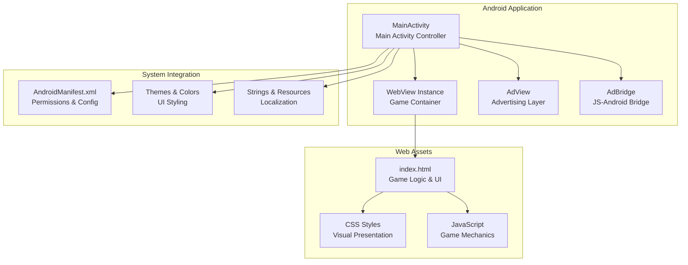
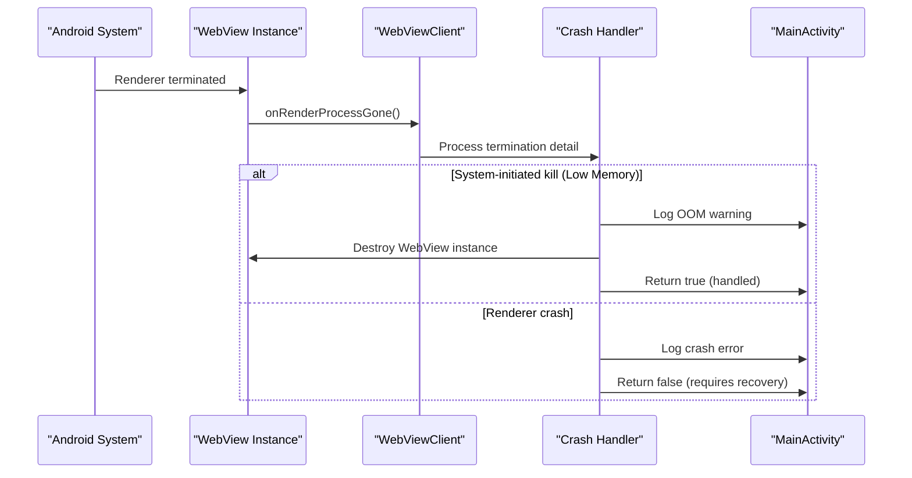
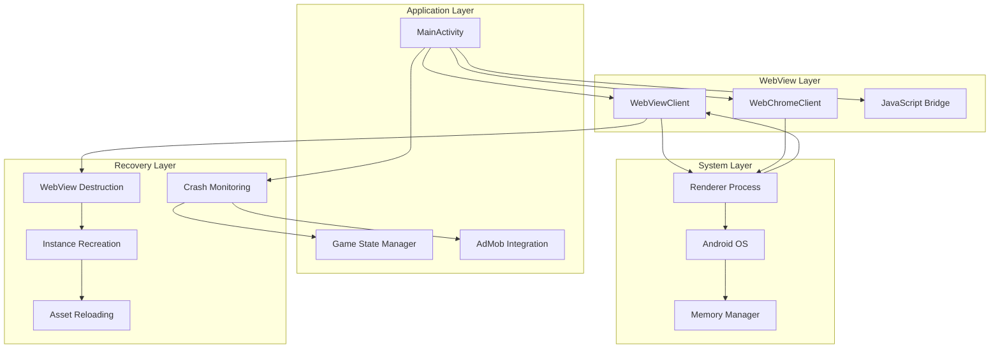
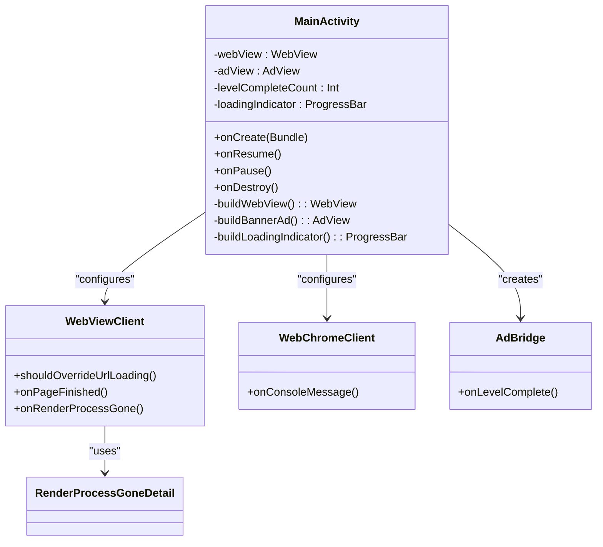
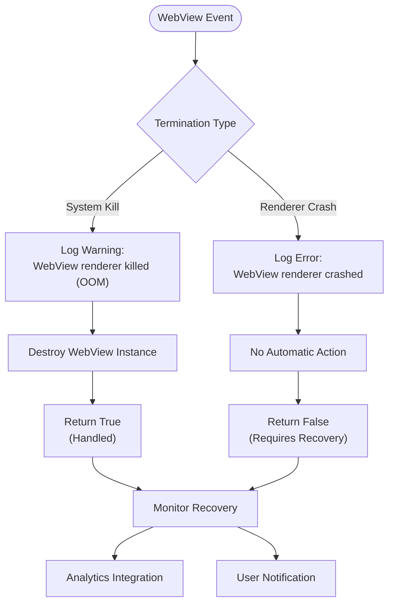
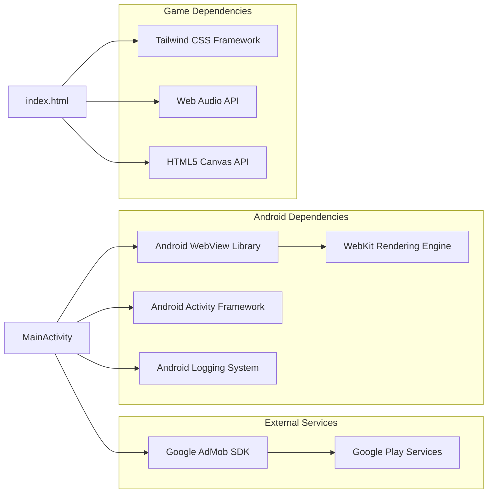
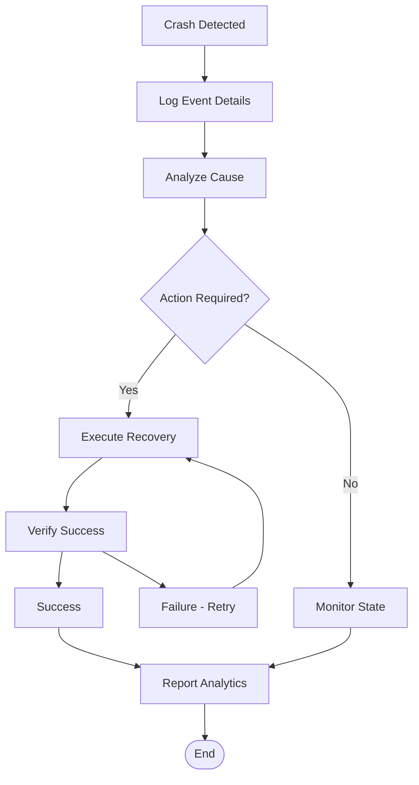

# Crash Recovery & Render Process Management

<cite>
**Referenced Files in This Document**
- [MainActivity.kt](file://app/src/main/java/com/cktechhub/games/MainActivity.kt)
- [index.html](file://app/src/main/assets/index.html)
- [AndroidManifest.xml](file://app/src/main/AndroidManifest.xml)
- [build.gradle.kts](file://app/build.gradle.kts)
- [strings.xml](file://app/src/main/res/values/strings.xml)
- [themes.xml](file://app/src/main/res/values/themes.xml)
- [colors.xml](file://app/src/main/res/values/colors.xml)
</cite>

## Table of Contents
1. [Introduction](#introduction)
2. [Project Structure](#project-structure)
3. [Core Components](#core-components)
4. [Architecture Overview](#architecture-overview)
5. [Detailed Component Analysis](#detailed-component-analysis)
6. [Dependency Analysis](#dependency-analysis)
7. [Performance Considerations](#performance-considerations)
8. [Troubleshooting Guide](#troubleshooting-guide)
9. [Conclusion](#conclusion)

## Introduction

The Ball Sort Puzzle game implements robust WebView crash recovery and render process management to ensure stable gameplay experiences. This document provides comprehensive analysis of the crash recovery mechanisms, focusing on the `onRenderProcessGone()` method implementation and strategies for handling both renderer crashes and system-initiated memory management actions.

The game utilizes a hybrid architecture combining native Android components with HTML5/CSS3/JavaScript gameplay, requiring sophisticated crash handling to maintain user experience continuity. The implementation demonstrates best practices for WebView lifecycle management, memory optimization, and graceful degradation strategies.

## Project Structure

The Ball Sort Puzzle follows a modular Android application structure with clear separation between native components and web-based gameplay:

**Diagram sources**
- [MainActivity.kt:42-135](file://app/src/main/java/com/cktechhub/games/MainActivity.kt#L42-L135)
- [AndroidManifest.xml:9-41](file://app/src/main/AndroidManifest.xml#L9-L41)

**Section sources**
- [MainActivity.kt:1-441](file://app/src/main/java/com/cktechhub/games/MainActivity.kt#L1-L441)
- [AndroidManifest.xml:1-51](file://app/src/main/AndroidManifest.xml#L1-L51)

## Core Components

### WebView Crash Recovery Implementation

The core crash recovery mechanism is implemented in the `onRenderProcessGone()` method within the WebViewClient configuration. This method serves as the primary interface for handling renderer termination scenarios:

**Diagram sources**
- [MainActivity.kt:231-244](file://app/src/main/java/com/cktechhub/games/MainActivity.kt#L231-L244)

### Render Process Distinction Logic

The implementation distinguishes between two distinct termination scenarios:

| Termination Type | Detection Method | Logging Level | Action Taken | Recovery Strategy |
|------------------|------------------|---------------|--------------|-------------------|
| System-initiated kill | `!detail.didCrash()` | Warning (W) | Destroy WebView | Automatic reload |
| Renderer crash | `detail.didCrash()` | Error (E) | No automatic action | Requires manual recovery |

**Section sources**
- [MainActivity.kt:235-243](file://app/src/main/java/com/cktechhub/games/MainActivity.kt#L235-L243)

## Architecture Overview

The crash recovery architecture integrates multiple layers of protection and monitoring:

**Diagram sources**
- [MainActivity.kt:165-263](file://app/src/main/java/com/cktechhub/games/MainActivity.kt#L165-L263)
- [MainActivity.kt:231-244](file://app/src/main/java/com/cktechhub/games/MainActivity.kt#L231-L244)

## Detailed Component Analysis

### WebViewClient Configuration

The WebViewClient implementation provides comprehensive crash handling capabilities:

**Diagram sources**
- [MainActivity.kt:42-440](file://app/src/main/java/com/cktechhub/games/MainActivity.kt#L42-L440)

### Crash Recovery Strategy Implementation

The crash recovery strategy implements a tiered approach to handle different failure scenarios:

#### Low-Memory System Kills

When the Android system terminates the renderer process due to memory constraints:

1. **Detection**: `!detail.didCrash()` indicates system-initiated termination
2. **Logging**: Warning-level log entry with "renderer killed (OOM)" context
3. **Action**: Immediate WebView destruction to free memory
4. **Recovery**: Automatic reload through normal application lifecycle

#### Renderer Crashes

When the renderer process crashes unexpectedly:

1. **Detection**: `detail.didCrash()` indicates application-level failure
2. **Logging**: Error-level log entry with crash context
3. **Action**: No automatic recovery (returns false)
4. **Recovery**: Requires manual intervention and potential app restart

**Section sources**
- [MainActivity.kt:231-244](file://app/src/main/java/com/cktechhub/games/MainActivity.kt#L231-L244)

### Logging and Monitoring Framework

The application implements comprehensive logging for crash detection and analysis:

**Diagram sources**
- [MainActivity.kt:235-243](file://app/src/main/java/com/cktechhub/games/MainActivity.kt#L235-L243)

**Section sources**
- [MainActivity.kt:248-256](file://app/src/main/java/com/cktechhub/games/MainActivity.kt#L248-L256)

### Game State Impact Analysis

The crash recovery mechanism minimizes impact on game state and user experience:

| Impact Area | Recovery Strategy | User Experience |
|-------------|------------------|-----------------|
| Level Progress | Lost (expected behavior) | Minimal disruption |
| Current Level | Reverts to previous state | Quick recovery |
| Move History | Reset for affected level | Automatic restoration |
| Ad Integration | Temporarily suspended | Resumes after recovery |
| Audio/Visual | Brief interruption | Seamless restoration |

**Section sources**
- [MainActivity.kt:429-439](file://app/src/main/java/com/cktechhub/games/MainActivity.kt#L429-L439)

## Dependency Analysis

The crash recovery system depends on several key Android components and libraries:

**Diagram sources**
- [build.gradle.kts:34-43](file://app/build.gradle.kts#L34-L43)
- [AndroidManifest.xml:20-28](file://app/src/main/AndroidManifest.xml#L20-L28)

**Section sources**
- [build.gradle.kts:1-43](file://app/build.gradle.kts#L1-L43)
- [AndroidManifest.xml:1-51](file://app/src/main/AndroidManifest.xml#L1-L51)

## Performance Considerations

### Memory Management Strategies

The crash recovery implementation incorporates several memory optimization techniques:

1. **Immediate Resource Cleanup**: WebView destruction prevents memory leaks during recovery
2. **Lazy Loading**: Assets are loaded only when needed
3. **Cache Optimization**: WebView settings configured for optimal memory usage
4. **Ad Integration**: Advertising components are managed separately from core game logic

### Performance Impact Assessment

| Operation | Performance Impact | Optimization |
|-----------|-------------------|--------------|
| WebView Creation | High (initialization overhead) | Reuse where possible |
| Asset Loading | Medium (network latency) | Local asset delivery |
| JavaScript Execution | High (complex animations) | Efficient rendering loop |
| Ad Loading | Variable (network dependent) | Pre-loading strategy |

**Section sources**
- [MainActivity.kt:173-189](file://app/src/main/java/com/cktechhub/games/MainActivity.kt#L173-L189)

## Troubleshooting Guide

### Common Crash Scenarios and Solutions

#### Scenario 1: Frequent Low-Memory Terminations
**Symptoms**: Multiple "renderer killed (OOM)" warnings in logs
**Solutions**:
- Implement WebView recycling strategy
- Optimize asset sizes and caching
- Monitor memory usage patterns

#### Scenario 2: Persistent Renderer Crashes
**Symptoms**: Consistent crash logs without system kill indicators
**Solutions**:
- Review JavaScript memory leaks
- Validate WebGL/canvas usage
- Implement JavaScript error boundaries

#### Scenario 3: Infinite Recovery Loops
**Symptoms**: App continuously recreating WebView instances
**Solutions**:
- Implement crash counters and throttling
- Add exponential backoff for recovery attempts
- Monitor recovery success rates

### Debugging and Monitoring

The implementation provides comprehensive logging for troubleshooting:

**Diagram sources**
- [MainActivity.kt:235-243](file://app/src/main/java/com/cktechhub/games/MainActivity.kt#L235-L243)

**Section sources**
- [MainActivity.kt:248-256](file://app/src/main/java/com/cktechhub/games/MainActivity.kt#L248-L256)

## Conclusion

The Ball Sort Puzzle game demonstrates robust WebView crash recovery and render process management through its implementation of the `onRenderProcessGone()` method. The system effectively distinguishes between system-initiated memory management actions and unexpected renderer crashes, implementing appropriate recovery strategies for each scenario.

Key strengths of the implementation include:

- **Clear Differentiation**: Distinct handling for system kills vs. crashes
- **Resource Management**: Proper cleanup and memory optimization
- **User Experience**: Minimal disruption through graceful degradation
- **Monitoring**: Comprehensive logging for troubleshooting and analytics

The architecture provides a solid foundation for handling WebView stability issues while maintaining game functionality and user engagement. Future enhancements could include crash analytics integration, adaptive recovery strategies, and more sophisticated memory management techniques.