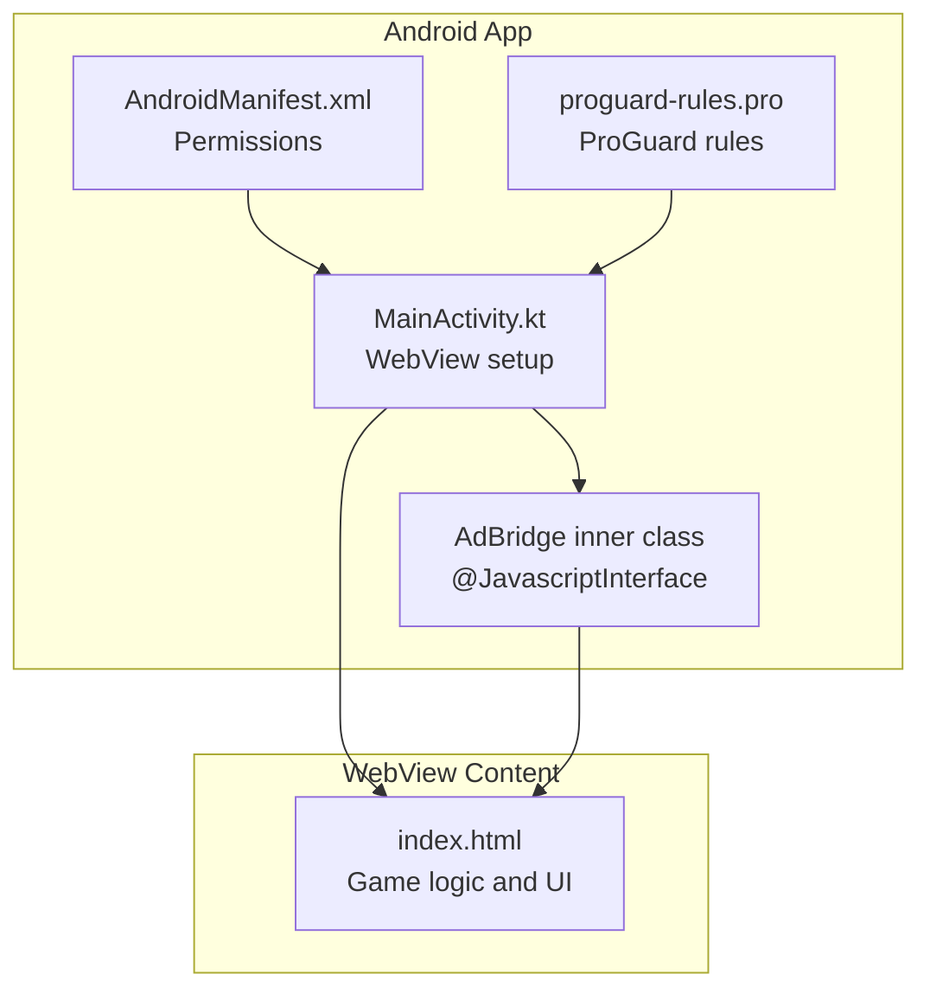
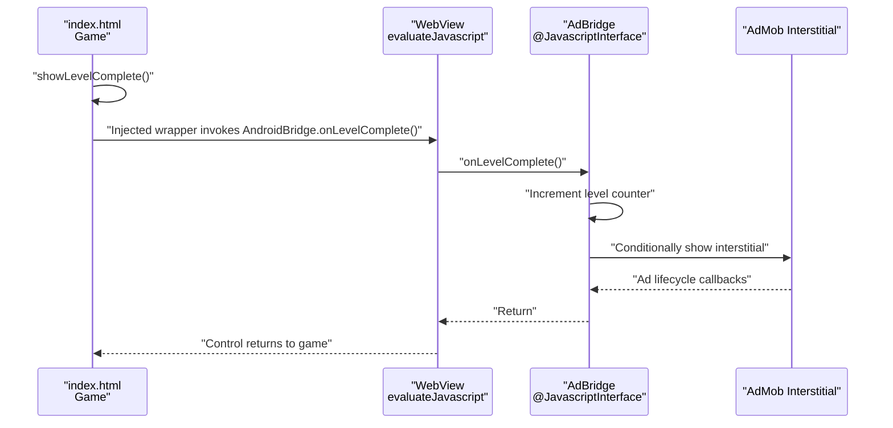
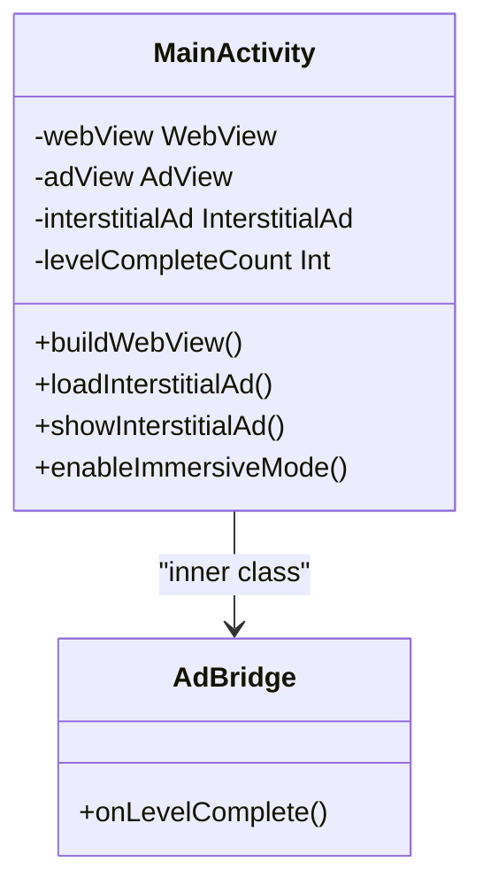
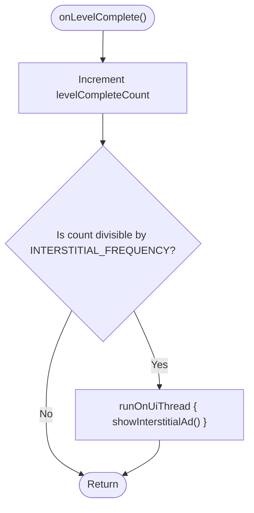
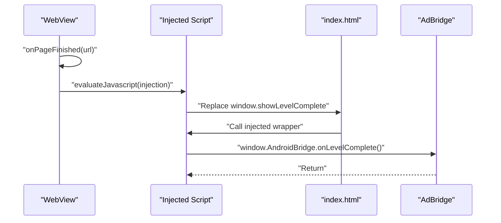
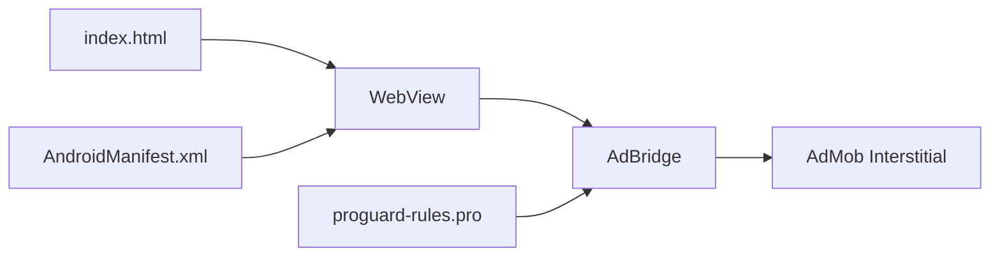

# JavaScript Interface & Bridge Implementation

<cite>
**Referenced Files in This Document**
- [MainActivity.kt](file://app/src/main/java/com/cktechhub/games/MainActivity.kt)
- [index.html](file://app/src/main/assets/index.html)
- [AndroidManifest.xml](file://app/src/main/AndroidManifest.xml)
- [proguard-rules.pro](file://app/proguard-rules.pro)
</cite>

## Table of Contents
1. [Introduction](#introduction)
2. [Project Structure](#project-structure)
3. [Core Components](#core-components)
4. [Architecture Overview](#architecture-overview)
5. [Detailed Component Analysis](#detailed-component-analysis)
6. [Dependency Analysis](#dependency-analysis)
7. [Performance Considerations](#performance-considerations)
8. [Troubleshooting Guide](#troubleshooting-guide)
9. [Conclusion](#conclusion)

## Introduction
This document explains the JavaScript interface and bridge implementation that enables bidirectional communication between a WebView-hosted HTML5 game and the Android application. It focuses on the AdBridge class, the @JavascriptInterface annotation, the onLevelComplete() method, and the evaluateJavascript() injection technique used to wrap game functions with Android callbacks. It also covers security considerations, extension patterns, and practical examples for adding new native functionality.

## Project Structure
The WebView-to-Native bridge is implemented in a single activity that hosts a WebView and loads a local HTML game. The bridge is exposed to JavaScript under the name “AndroidBridge”.

**Diagram sources**
- [MainActivity.kt:165-263](file://app/src/main/java/com/cktechhub/games/MainActivity.kt#L165-L263)
- [MainActivity.kt:428-439](file://app/src/main/java/com/cktechhub/games/MainActivity.kt#L428-L439)
- [AndroidManifest.xml:1-51](file://app/src/main/AndroidManifest.xml#L1-L51)
- [proguard-rules.pro:1-21](file://app/proguard-rules.pro#L1-L21)
- [index.html:1-1094](file://app/src/main/assets/index.html#L1-L1094)

**Section sources**
- [MainActivity.kt:165-263](file://app/src/main/java/com/cktechhub/games/MainActivity.kt#L165-L263)
- [MainActivity.kt:428-439](file://app/src/main/java/com/cktechhub/games/MainActivity.kt#L428-L439)
- [AndroidManifest.xml:1-51](file://app/src/main/AndroidManifest.xml#L1-L51)
- [proguard-rules.pro:1-21](file://app/proguard-rules.pro#L1-L21)
- [index.html:1-1094](file://app/src/main/assets/index.html#L1-L1094)

## Core Components
- WebView and settings: JavaScript enabled, DOM storage enabled, mixed content disabled, and safe navigation enforced.
- JavaScript interface registration: The AdBridge instance is registered with the name “AndroidBridge”.
- Injection mechanism: evaluateJavascript wraps the game’s showLevelComplete function to notify Android on level completion.
- AdMob integration: Interstitial ads are shown conditionally based on level completion events.

Key implementation references:
- WebView setup and security: [MainActivity.kt:172-189](file://app/src/main/java/com/cktechhub/games/MainActivity.kt#L172-L189)
- Interface registration: [MainActivity.kt:191-192](file://app/src/main/java/com/cktechhub/games/MainActivity.kt#L191-L192)
- Injection of Android callback: [MainActivity.kt:214-228](file://app/src/main/java/com/cktechhub/games/MainActivity.kt#L214-L228)
- AdMob interstitial loading: [MainActivity.kt:370-400](file://app/src/main/java/com/cktechhub/games/MainActivity.kt#L370-L400)
- AdMob interstitial display: [MainActivity.kt:402-409](file://app/src/main/java/com/cktechhub/games/MainActivity.kt#L402-L409)

**Section sources**
- [MainActivity.kt:172-189](file://app/src/main/java/com/cktechhub/games/MainActivity.kt#L172-L189)
- [MainActivity.kt:191-192](file://app/src/main/java/com/cktechhub/games/MainActivity.kt#L191-L192)
- [MainActivity.kt:214-228](file://app/src/main/java/com/cktechhub/games/MainActivity.kt#L214-L228)
- [MainActivity.kt:370-400](file://app/src/main/java/com/cktechhub/games/MainActivity.kt#L370-L400)
- [MainActivity.kt:402-409](file://app/src/main/java/com/cktechhub/games/MainActivity.kt#L402-L409)

## Architecture Overview
The bridge follows a unidirectional notification pattern from JavaScript to Android, with Android initiating the injection and Android controlling downstream actions (e.g., showing ads). While the current implementation is one-way, the same pattern can be extended to support two-way calls.

**Diagram sources**
- [MainActivity.kt:214-228](file://app/src/main/java/com/cktechhub/games/MainActivity.kt#L214-L228)
- [MainActivity.kt:428-439](file://app/src/main/java/com/cktechhub/games/MainActivity.kt#L428-L439)
- [MainActivity.kt:370-400](file://app/src/main/java/com/cktechhub/games/MainActivity.kt#L370-L400)
- [MainActivity.kt:402-409](file://app/src/main/java/com/cktechhub/games/MainActivity.kt#L402-L409)
- [index.html:852-881](file://app/src/main/assets/index.html#L852-L881)

## Detailed Component Analysis

### AdBridge Class and @JavascriptInterface Annotation
The AdBridge is an inner class of MainActivity that exposes a single method to JavaScript. The @JavascriptInterface annotation makes the method callable from web content.

- Method exposure: The onLevelComplete() method is annotated with @JavascriptInterface and is callable from JavaScript via window.AndroidBridge.onLevelComplete().
- Visibility: The method is declared public and marked @JavascriptInterface, enabling JavaScript access.
- Security: Only methods explicitly annotated with @JavascriptInterface are exposed; other members remain private.

Practical references:
- Class declaration and annotation: [MainActivity.kt:428-439](file://app/src/main/java/com/cktechhub/games/MainActivity.kt#L428-L439)

**Diagram sources**
- [MainActivity.kt:428-439](file://app/src/main/java/com/cktechhub/games/MainActivity.kt#L428-L439)

**Section sources**
- [MainActivity.kt:428-439](file://app/src/main/java/com/cktechhub/games/MainActivity.kt#L428-L439)

### onLevelComplete() Method Behavior
The onLevelComplete() method increments a counter and conditionally triggers an interstitial ad. It runs on the UI thread to safely interact with the AdMob SDK.

- Counting logic: Tracks how many levels were completed to decide when to show an ad.
- Conditional ad display: Uses a frequency threshold to limit ad prompts.
- Thread safety: Uses runOnUiThread to ensure UI operations occur on the main thread.

References:
- Method implementation: [MainActivity.kt:431-438](file://app/src/main/java/com/cktechhub/games/MainActivity.kt#L431-L438)
- Frequency constant: [MainActivity.kt:58-59](file://app/src/main/java/com/cktechhub/games/MainActivity.kt#L58-L59)
- AdMob integration: [MainActivity.kt:402-409](file://app/src/main/java/com/cktechhub/games/MainActivity.kt#L402-L409)

**Diagram sources**
- [MainActivity.kt:431-438](file://app/src/main/java/com/cktechhub/games/MainActivity.kt#L431-L438)
- [MainActivity.kt:58-59](file://app/src/main/java/com/cktechhub/games/MainActivity.kt#L58-L59)
- [MainActivity.kt:402-409](file://app/src/main/java/com/cktechhub/games/MainActivity.kt#L402-L409)

**Section sources**
- [MainActivity.kt:431-438](file://app/src/main/java/com/cktechhub/games/MainActivity.kt#L431-L438)
- [MainActivity.kt:58-59](file://app/src/main/java/com/cktechhub/games/MainActivity.kt#L58-L59)
- [MainActivity.kt:402-409](file://app/src/main/java/com/cktechhub/games/MainActivity.kt#L402-L409)

### Bidirectional Communication Pattern
The current implementation is unidirectional: JavaScript notifies Android when a level completes. To extend to bidirectional communication, you can:
- Expose additional methods on AdBridge for JavaScript to call (e.g., request ad data, toggle settings).
- Use evaluateJavascript to inject wrappers that forward responses back to JavaScript.
- Implement a message bus or event system to coordinate callbacks.

Current injection pattern:
- The game’s showLevelComplete is wrapped to call AndroidBridge.onLevelComplete.
- References: [MainActivity.kt:214-228](file://app/src/main/java/com/cktechhub/games/MainActivity.kt#L214-L228), [index.html:852-881](file://app/src/main/assets/index.html#L852-L881)

References:
- Injection site: [MainActivity.kt:214-228](file://app/src/main/java/com/cktechhub/games/MainActivity.kt#L214-L228)
- Game function: [index.html:852-881](file://app/src/main/assets/index.html#L852-L881)

**Section sources**
- [MainActivity.kt:214-228](file://app/src/main/java/com/cktechhub/games/MainActivity.kt#L214-L228)
- [index.html:852-881](file://app/src/main/assets/index.html#L852-L881)

### evaluateJavascript Injection Technique
The app injects a small script during onPageFinished to wrap the game’s showLevelComplete function. This ensures that every time the game finishes a level, Android is notified.

- Injection timing: Occurs after the page finishes loading.
- Wrapper behavior: Preserves the original function and adds AndroidBridge.onLevelComplete invocation.
- References: [MainActivity.kt:214-228](file://app/src/main/java/com/cktechhub/games/MainActivity.kt#L214-L228)

**Diagram sources**
- [MainActivity.kt:214-228](file://app/src/main/java/com/cktechhub/games/MainActivity.kt#L214-L228)

**Section sources**
- [MainActivity.kt:214-228](file://app/src/main/java/com/cktechhub/games/MainActivity.kt#L214-L228)

### Practical Examples of Extending the Bridge
- Adding a new method on AdBridge for JavaScript to request data or trigger actions.
- Using evaluateJavascript to inject wrappers that forward responses to JavaScript callbacks.
- Implementing a lightweight message protocol to serialize parameters and responses.

Example references:
- Current bridge registration: [MainActivity.kt:191-192](file://app/src/main/java/com/cktechhub/games/MainActivity.kt#L191-L192)
- Injection pattern: [MainActivity.kt:214-228](file://app/src/main/java/com/cktechhub/games/MainActivity.kt#L214-L228)

**Section sources**
- [MainActivity.kt:191-192](file://app/src/main/java/com/cktechhub/games/MainActivity.kt#L191-L192)
- [MainActivity.kt:214-228](file://app/src/main/java/com/cktechhub/games/MainActivity.kt#L214-L228)

## Dependency Analysis
The bridge depends on WebView settings, manifest permissions, and ProGuard rules. The following diagram shows the relationships among components.

- WebView settings: Enable JavaScript and restrict mixed content.
- Permissions: INTERNET and ACCESS_NETWORK_STATE for ad loading.
- ProGuard: Keeps the interface class members if obfuscation is enabled.

**Diagram sources**
- [MainActivity.kt:172-189](file://app/src/main/java/com/cktechhub/games/MainActivity.kt#L172-L189)
- [AndroidManifest.xml:5-7](file://app/src/main/AndroidManifest.xml#L5-L7)
- [proguard-rules.pro:8-13](file://app/proguard-rules.pro#L8-L13)

**Section sources**
- [MainActivity.kt:172-189](file://app/src/main/java/com/cktechhub/games/MainActivity.kt#L172-L189)
- [AndroidManifest.xml:5-7](file://app/src/main/AndroidManifest.xml#L5-L7)
- [proguard-rules.pro:8-13](file://app/proguard-rules.pro#L8-L13)

## Performance Considerations
- Injection cost: evaluateJavascript executes once per page load; keep injected scripts minimal.
- Ad frequency: Use INTERSTITIAL_FREQUENCY to balance engagement and user experience.
- UI thread: Ensure all UI-related operations (e.g., showing ads) are dispatched on the main thread.
- WebView lifecycle: Properly pause/resume and destroy the WebView to prevent leaks.

[No sources needed since this section provides general guidance]

## Troubleshooting Guide
Common issues and resolutions:
- JavaScript cannot access AndroidBridge:
  - Verify the interface is registered with addJavascriptInterface and named “AndroidBridge”.
  - Confirm evaluateJavascript injection occurs after page load.
  - References: [MainActivity.kt:191-192](file://app/src/main/java/com/cktechhub/games/MainActivity.kt#L191-L192), [MainActivity.kt:214-228](file://app/src/main/java/com/cktechhub/games/MainActivity.kt#L214-L228)
- Ads not showing:
  - Ensure AdMob initialization succeeds and interstitial is preloaded.
  - Check frequency threshold and ad availability.
  - References: [MainActivity.kt:370-400](file://app/src/main/java/com/cktechhub/games/MainActivity.kt#L370-L400), [MainActivity.kt:402-409](file://app/src/main/java/com/cktechhub/games/MainActivity.kt#L402-L409)
- WebView crashes:
  - Handle onRenderProcessGone by recreating the WebView.
  - References: [MainActivity.kt:231-244](file://app/src/main/java/com/cktechhub/games/MainActivity.kt#L231-L244)
- Mixed content errors:
  - Mixed content is disabled; ensure all resources are served securely.
  - References: [MainActivity.kt:184-186](file://app/src/main/java/com/cktechhub/games/MainActivity.kt#L184-L186)

**Section sources**
- [MainActivity.kt:191-192](file://app/src/main/java/com/cktechhub/games/MainActivity.kt#L191-L192)
- [MainActivity.kt:214-228](file://app/src/main/java/com/cktechhub/games/MainActivity.kt#L214-L228)
- [MainActivity.kt:370-400](file://app/src/main/java/com/cktechhub/games/MainActivity.kt#L370-L400)
- [MainActivity.kt:402-409](file://app/src/main/java/com/cktechhub/games/MainActivity.kt#L402-L409)
- [MainActivity.kt:231-244](file://app/src/main/java/com/cktechhub/games/MainActivity.kt#L231-L244)
- [MainActivity.kt:184-186](file://app/src/main/java/com/cktechhub/games/MainActivity.kt#L184-L186)

## Conclusion
The WebView-to-Native bridge in this project demonstrates a clean, minimal pattern for notifying Android from JavaScript. The AdBridge class, exposed via @JavascriptInterface, integrates with AdMob to deliver contextual interstitial ads. The evaluateJavascript injection technique ensures reliable delivery of level completion events. For future enhancements, extend the bridge with additional methods and implement a robust message protocol to support bidirectional communication while maintaining security and performance.