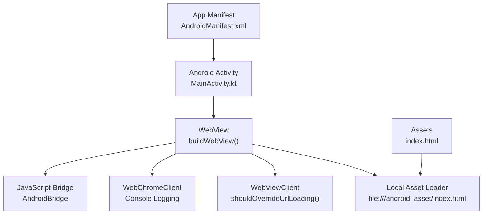
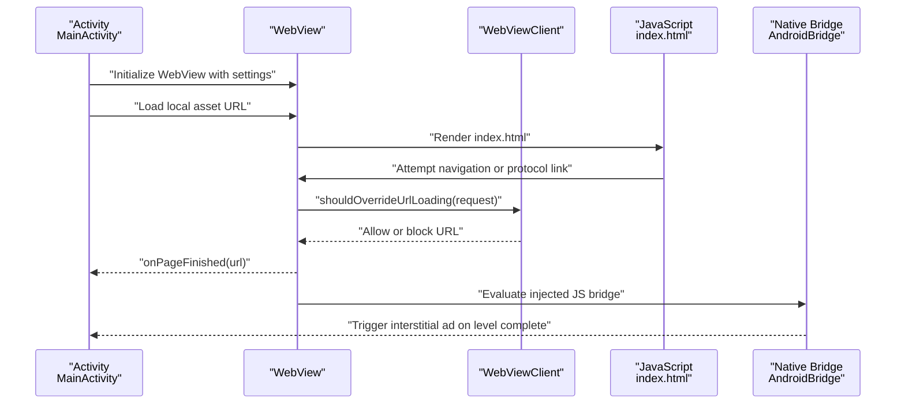
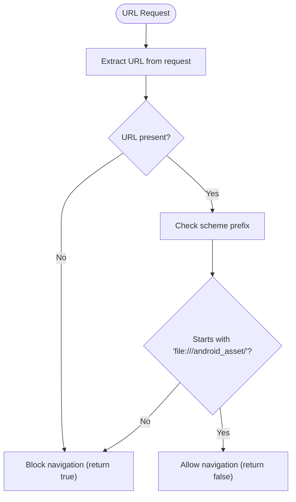
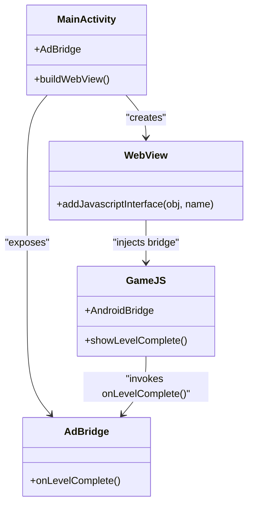
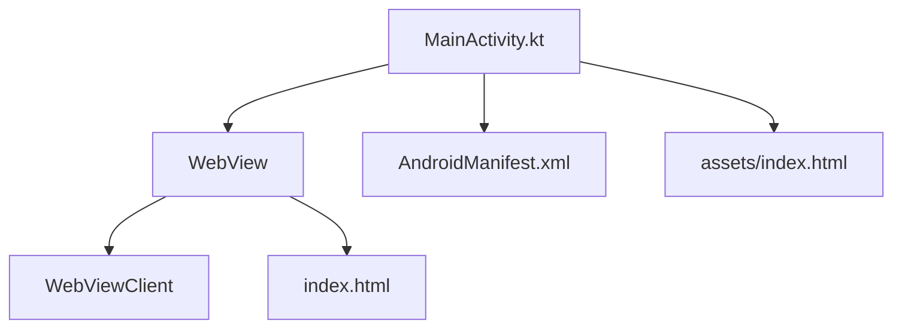

# Security Configuration & Navigation Control

<cite>
**Referenced Files in This Document**
- [MainActivity.kt](file://app/src/main/java/com/cktechhub/games/MainActivity.kt)
- [index.html](file://app/src/main/assets/index.html)
- [AndroidManifest.xml](file://app/src/main/AndroidManifest.xml)
- [backup_rules.xml](file://app/src/main/res/xml/backup_rules.xml)
- [data_extraction_rules.xml](file://app/src/main/res/xml/data_extraction_rules.xml)
</cite>

## Table of Contents
1. [Introduction](#introduction)
2. [Project Structure](#project-structure)
3. [Core Components](#core-components)
4. [Architecture Overview](#architecture-overview)
5. [Detailed Component Analysis](#detailed-component-analysis)
6. [Dependency Analysis](#dependency-analysis)
7. [Performance Considerations](#performance-considerations)
8. [Troubleshooting Guide](#troubleshooting-guide)
9. [Conclusion](#conclusion)

## Introduction
This document explains the WebView security configuration and navigation control in the Ball Sort Puzzle game. It focuses on the WebViewClient implementation, URL filtering, external link blocking, safe navigation handling, and the security implications of allowing file access versus restricting external content. It also covers the rationale behind blocking external protocols (tel:, mailto:, etc.), the security considerations for embedded web content, and practical examples of secure navigation patterns.

## Project Structure
The game loads a local HTML/CSS/JavaScript application packaged inside the app’s assets and renders it in a WebView. The Android activity initializes the WebView, applies strict security settings, and enforces a restrictive URL policy via a custom WebViewClient.

**Diagram sources**
- [MainActivity.kt:165-263](file://app/src/main/java/com/cktechhub/games/MainActivity.kt#L165-L263)
- [index.html:1-20](file://app/src/main/assets/index.html#L1-L20)
- [AndroidManifest.xml:30-41](file://app/src/main/AndroidManifest.xml#L30-L41)

**Section sources**
- [MainActivity.kt:131](file://app/src/main/java/com/cktechhub/games/MainActivity.kt#L131)
- [AndroidManifest.xml:5-8](file://app/src/main/AndroidManifest.xml#L5-L8)

## Core Components
- WebView initialization and security settings
- WebViewClient with URL filtering logic
- JavaScript interface bridge for native integration
- Local asset loading strategy
- Mixed content policy enforcement

Key implementation references:
- WebView settings and security flags: [MainActivity.kt:173-189](file://app/src/main/java/com/cktechhub/games/MainActivity.kt#L173-L189)
- WebViewClient with shouldOverrideUrlLoading: [MainActivity.kt:195-207](file://app/src/main/java/com/cktechhub/games/MainActivity.kt#L195-L207)
- Local asset loading: [MainActivity.kt:131](file://app/src/main/java/com/cktechhub/games/MainActivity.kt#L131)
- JavaScript bridge: [MainActivity.kt:192](file://app/src/main/java/com/cktechhub/games/MainActivity.kt#L192), [MainActivity.kt:429-439](file://app/src/main/java/com/cktechhub/games/MainActivity.kt#L429-L439)

**Section sources**
- [MainActivity.kt:173-207](file://app/src/main/java/com/cktechhub/games/MainActivity.kt#L173-L207)
- [MainActivity.kt:131](file://app/src/main/java/com/cktechhub/games/MainActivity.kt#L131)
- [MainActivity.kt:429-439](file://app/src/main/java/com/cktechhub/games/MainActivity.kt#L429-L439)

## Architecture Overview
The app uses a WebView to host a self-contained HTML5 game. The Android layer enforces strict navigation controls and security policies to prevent loading external content or launching unintended protocols.

**Diagram sources**
- [MainActivity.kt:165-263](file://app/src/main/java/com/cktechhub/games/MainActivity.kt#L165-L263)
- [MainActivity.kt:195-229](file://app/src/main/java/com/cktechhub/games/MainActivity.kt#L195-L229)
- [index.html:1088-1094](file://app/src/main/assets/index.html#L1088-L1094)

## Detailed Component Analysis

### WebViewClient Implementation and URL Filtering
The WebViewClient enforces a strict allowlist policy:
- Allow only local asset files under the Android assets scheme
- Block all other URLs, including external links, tel:, mailto:, sms:, and other protocols

**Diagram sources**
- [MainActivity.kt:196-207](file://app/src/main/java/com/cktechhub/games/MainActivity.kt#L196-L207)

Practical examples of URL validation logic:
- Local asset allowlist: [MainActivity.kt:202](file://app/src/main/java/com/cktechhub/games/MainActivity.kt#L202)
- External protocol blocking: [MainActivity.kt:205](file://app/src/main/java/com/cktechhub/games/MainActivity.kt#L205)

Edge cases handled:
- Malformed or missing URL: [MainActivity.kt:200](file://app/src/main/java/com/cktechhub/games/MainActivity.kt#L200)
- Renderer crash recovery: [MainActivity.kt:231-244](file://app/src/main/java/com/cktechhub/games/MainActivity.kt#L231-L244)

**Section sources**
- [MainActivity.kt:195-207](file://app/src/main/java/com/cktechhub/games/MainActivity.kt#L195-L207)
- [MainActivity.kt:231-244](file://app/src/main/java/com/cktechhub/games/MainActivity.kt#L231-L244)

### Security Implications of File Access vs External Content
- Enabling file access and content access allows the WebView to load local assets safely, but still requires explicit allowlisting in WebViewClient.
- Mixed content is strictly disallowed to prevent insecure resource loading over HTTPS contexts.
- External protocols (tel:, mailto:, sms:, intent:) are blocked to prevent unauthorized actions or deep linking outside the app.

References:
- File/content access flags: [MainActivity.kt:176-177](file://app/src/main/java/com/cktechhub/games/MainActivity.kt#L176-L177)
- Mixed content policy: [MainActivity.kt:185](file://app/src/main/java/com/cktechhub/games/MainActivity.kt#L185)
- Protocol blocking rationale: [MainActivity.kt:205](file://app/src/main/java/com/cktechhub/games/MainActivity.kt#L205)

**Section sources**
- [MainActivity.kt:176-185](file://app/src/main/java/com/cktechhub/games/MainActivity.kt#L176-L185)
- [MainActivity.kt:205](file://app/src/main/java/com/cktechhub/games/MainActivity.kt#L205)

### JavaScript Interface Bridge and Native Integration
The JavaScript bridge enables the web game to trigger native actions (e.g., showing interstitial ads) when specific events occur in the game (e.g., level completion). The bridge is exposed to JavaScript with a controlled interface.

**Diagram sources**
- [MainActivity.kt:192](file://app/src/main/java/com/cktechhub/games/MainActivity.kt#L192)
- [MainActivity.kt:429-439](file://app/src/main/java/com/cktechhub/games/MainActivity.kt#L429-L439)
- [index.html:1088-1094](file://app/src/main/assets/index.html#L1088-L1094)

Security considerations:
- The bridge is annotated to be accessible from JavaScript: [MainActivity.kt:430](file://app/src/main/java/com/cktechhub/games/MainActivity.kt#L430)
- Only intended methods are exposed; no sensitive operations are performed in the bridge.

**Section sources**
- [MainActivity.kt:192](file://app/src/main/java/com/cktechhub/games/MainActivity.kt#L192)
- [MainActivity.kt:429-439](file://app/src/main/java/com/cktechhub/games/MainActivity.kt#L429-L439)
- [index.html:1088-1094](file://app/src/main/assets/index.html#L1088-L1094)

### Embedded Web Content and XSS Considerations
- The game is fully self-contained in local assets, minimizing exposure to external scripts.
- No external CDN resources are loaded except for analytics/ad libraries configured at the app level.
- The WebViewClient prevents navigation to external URLs, reducing the risk of malicious redirection.

References:
- Local asset loading: [MainActivity.kt:131](file://app/src/main/java/com/cktechhub/games/MainActivity.kt#L131)
- External navigation blocking: [MainActivity.kt:205](file://app/src/main/java/com/cktechhub/games/MainActivity.kt#L205)

**Section sources**
- [MainActivity.kt:131](file://app/src/main/java/com/cktechhub/games/MainActivity.kt#L131)
- [MainActivity.kt:205](file://app/src/main/java/com/cktechhub/games/MainActivity.kt#L205)

### Practical Secure Navigation Patterns
- Use a strict allowlist in WebViewClient for URLs.
- Avoid enabling file access unless necessary and always pair with a restrictive URL policy.
- Disallow mixed content to prevent insecure resource loading.
- Inject minimal JavaScript bridges and restrict their capabilities.

References:
- Allowlist pattern: [MainActivity.kt:202](file://app/src/main/java/com/cktechhub/games/MainActivity.kt#L202)
- Mixed content policy: [MainActivity.kt:185](file://app/src/main/java/com/cktechhub/games/MainActivity.kt#L185)
- File access flags: [MainActivity.kt:176-177](file://app/src/main/java/com/cktechhub/games/MainActivity.kt#L176-L177)

**Section sources**
- [MainActivity.kt:202](file://app/src/main/java/com/cktechhub/games/MainActivity.kt#L202)
- [MainActivity.kt:185](file://app/src/main/java/com/cktechhub/games/MainActivity.kt#L185)
- [MainActivity.kt:176-177](file://app/src/main/java/com/cktechhub/games/MainActivity.kt#L176-L177)

## Dependency Analysis
The WebView depends on the Android activity lifecycle and security settings. The game’s HTML/CSS/JavaScript is bundled locally and accessed via a file URL. The WebViewClient acts as a gatekeeper for all navigation attempts.

**Diagram sources**
- [MainActivity.kt:165-263](file://app/src/main/java/com/cktechhub/games/MainActivity.kt#L165-L263)
- [AndroidManifest.xml:5-8](file://app/src/main/AndroidManifest.xml#L5-L8)
- [index.html:1-20](file://app/src/main/assets/index.html#L1-L20)

**Section sources**
- [MainActivity.kt:165-263](file://app/src/main/java/com/cktechhub/games/MainActivity.kt#L165-L263)
- [AndroidManifest.xml:5-8](file://app/src/main/AndroidManifest.xml#L5-L8)
- [index.html:1-20](file://app/src/main/assets/index.html#L1-L20)

## Performance Considerations
- Mixed content disabled to avoid network overhead and potential failures.
- JavaScript and DOM storage enabled to support smooth gameplay and persistent settings.
- Renderer crash handling ensures stability and graceful recovery.

[No sources needed since this section provides general guidance]

## Troubleshooting Guide
Common issues and resolutions:
- External navigation attempts: The WebViewClient blocks them; verify the URL scheme and ensure only local assets are used.
- Mixed content errors: Ensure all resources are served over HTTPS or local assets.
- Renderer crashes: The implementation detects renderer process death and handles recovery.

References:
- URL filtering: [MainActivity.kt:196-207](file://app/src/main/java/com/cktechhub/games/MainActivity.kt#L196-L207)
- Renderer crash handling: [MainActivity.kt:231-244](file://app/src/main/java/com/cktechhub/games/MainActivity.kt#L231-L244)

**Section sources**
- [MainActivity.kt:196-207](file://app/src/main/java/com/cktechhub/games/MainActivity.kt#L196-L207)
- [MainActivity.kt:231-244](file://app/src/main/java/com/cktechhub/games/MainActivity.kt#L231-L244)

## Conclusion
The Ball Sort Puzzle game employs a robust WebView security model by:
- Restricting navigation to local assets only
- Blocking external protocols and mixed content
- Exposing a minimal JavaScript bridge for native integration
- Recovering gracefully from renderer issues

These measures protect the app from malicious redirection, unauthorized protocol launches, and insecure content loading while maintaining a seamless gaming experience.