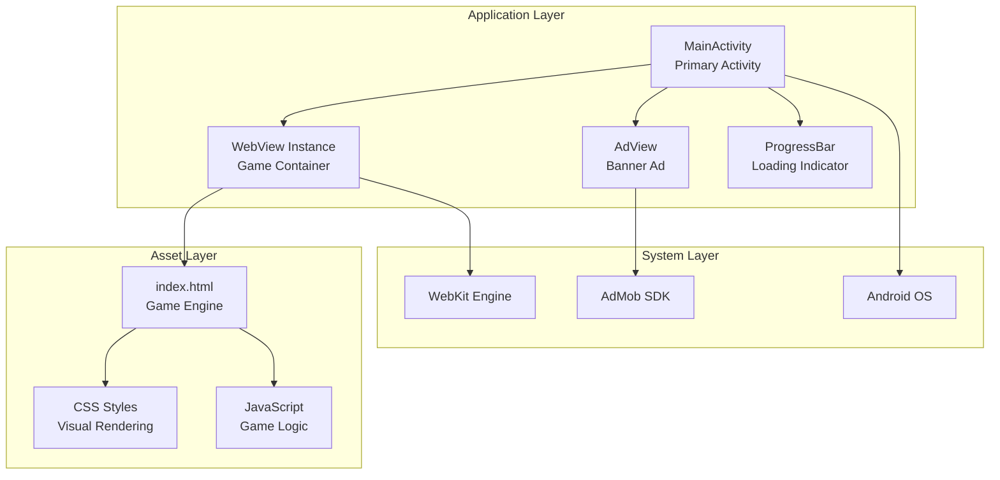
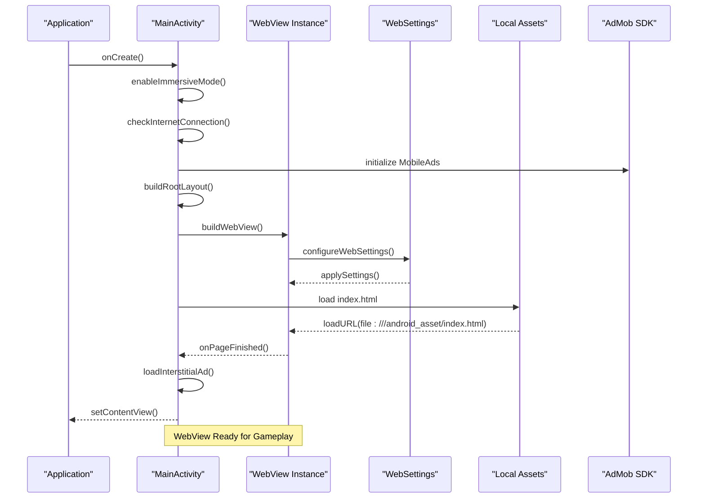
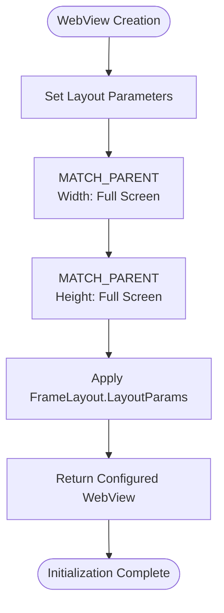
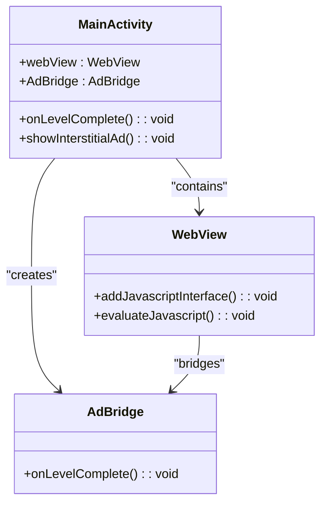
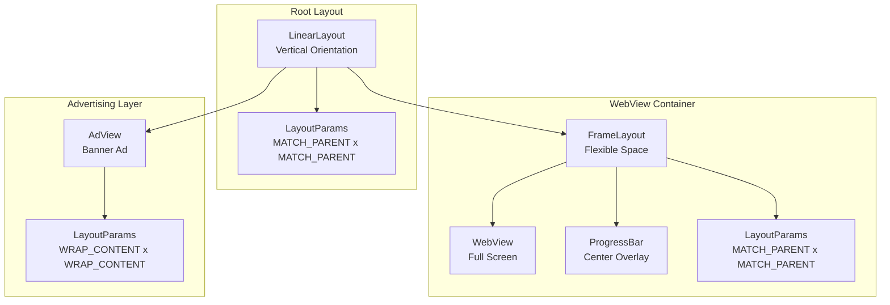
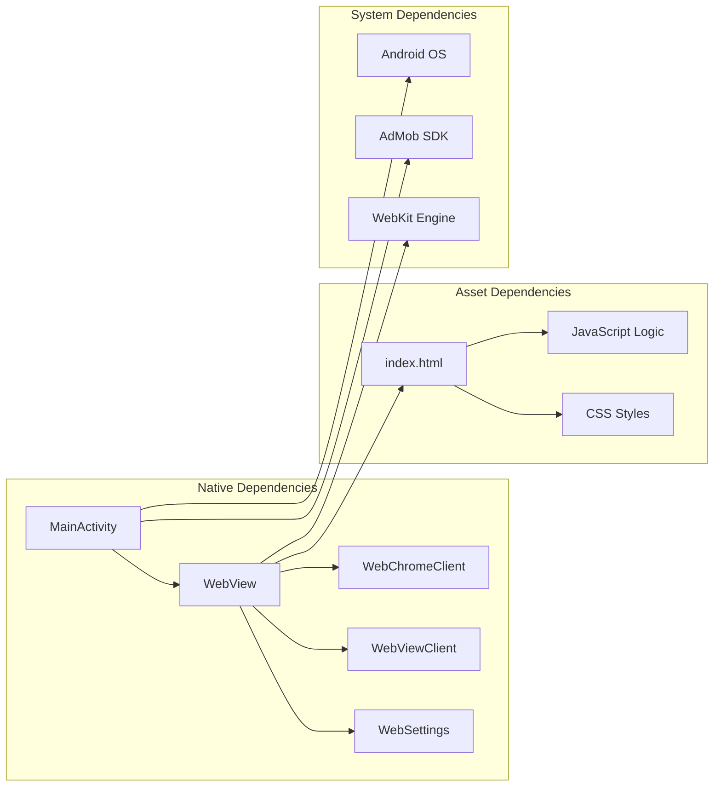

# WebView Initialization & Setup

<cite>
**Referenced Files in This Document**
- [MainActivity.kt](file://app/src/main/java/com/cktechhub/games/MainActivity.kt)
- [index.html](file://app/src/main/assets/index.html)
- [AndroidManifest.xml](file://app/src/main/AndroidManifest.xml)
- [themes.xml](file://app/src/main/res/values/themes.xml)
- [colors.xml](file://app/src/main/res/values/colors.xml)
</cite>

## Table of Contents
1. [Introduction](#introduction)
2. [Project Structure](#project-structure)
3. [Core Components](#core-components)
4. [Architecture Overview](#architecture-overview)
5. [Detailed Component Analysis](#detailed-component-analysis)
6. [Dependency Analysis](#dependency-analysis)
7. [Performance Considerations](#performance-considerations)
8. [Troubleshooting Guide](#troubleshooting-guide)
9. [Conclusion](#conclusion)

## Introduction

The Ball Sort Puzzle game utilizes Android's WebView component to host its HTML5/CSS3/JavaScript game engine. This document provides comprehensive coverage of the WebView initialization process, configuration settings, and integration with the overall application architecture. The implementation demonstrates best practices for WebView setup in mobile gaming applications, including security configurations, performance optimizations, and memory management strategies.

## Project Structure

The WebView implementation is centralized within the MainActivity class, which serves as the primary container for the game interface. The project follows a clean separation of concerns with the game logic residing in HTML/CSS/JavaScript assets while the native Android layer handles lifecycle management, advertising integration, and system-level optimizations.

**Diagram sources**
- [MainActivity.kt:95-135](file://app/src/main/java/com/cktechhub/games/MainActivity.kt#L95-L135)
- [index.html:1-50](file://app/src/main/assets/index.html#L1-L50)

**Section sources**
- [MainActivity.kt:1-441](file://app/src/main/java/com/cktechhub/games/MainActivity.kt#L1-L441)
- [AndroidManifest.xml:1-51](file://app/src/main/AndroidManifest.xml#L1-L51)

## Core Components

The WebView initialization process involves several critical components working together to create a seamless gaming experience:

### WebView Creation and Layout Management

The WebView is created as a full-screen component that occupies the majority of the screen real estate, with advertising content positioned below it. The layout architecture employs a vertical LinearLayout as the root container, ensuring proper z-ordering and responsive behavior across different screen sizes.

### Security Configuration

The WebView implementation enforces strict security policies by limiting navigation to local asset files only, preventing external resource loading and potential security vulnerabilities. JavaScript execution is enabled for game functionality while maintaining controlled access to native Android APIs through a carefully designed bridge interface.

### Performance Optimization

Multiple performance optimizations are implemented including custom scroll behavior configuration, zoom control disabling for touch-based gameplay, and efficient memory management through proper lifecycle handling and renderer crash recovery mechanisms.

**Section sources**
- [MainActivity.kt:165-263](file://app/src/main/java/com/cktechhub/games/MainActivity.kt#L165-L263)
- [MainActivity.kt:95-135](file://app/src/main/java/com/cktechhub/games/MainActivity.kt#L95-L135)

## Architecture Overview

The WebView initialization follows a structured approach that integrates seamlessly with the Android application lifecycle while maintaining optimal performance and security standards.

**Diagram sources**
- [MainActivity.kt:66-135](file://app/src/main/java/com/cktechhub/games/MainActivity.kt#L66-L135)
- [MainActivity.kt:165-263](file://app/src/main/java/com/cktechhub/games/MainActivity.kt#L165-L263)

## Detailed Component Analysis

### WebView Creation Method Implementation

The `buildWebView()` method serves as the central factory for creating and configuring the WebView instance. This method encapsulates all initialization logic and returns a fully configured WebView ready for immediate use.

#### Layout Parameters Configuration

The WebView receives comprehensive layout parameters that ensure optimal screen utilization and responsive behavior:

**Diagram sources**
- [MainActivity.kt:165-170](file://app/src/main/java/com/cktechhub/games/MainActivity.kt#L165-L170)

#### WebView Settings Configuration

The WebSettings configuration establishes the foundation for secure and performant WebView operation:

**JavaScript and Storage Configuration:**
- JavaScript execution is enabled for interactive gameplay functionality
- DOM storage is activated to support game state persistence
- File access permissions are granted for local asset loading
- Content access is permitted for multimedia resources

**Viewport and Zoom Control Settings:**
- Wide viewport mode enables proper mobile rendering
- Overview mode provides initial page scaling control
- Zoom controls are disabled to prevent interference with touch-based gameplay
- Custom scroll behavior prevents unwanted overscroll effects

**Security and Privacy Settings:**
- Mixed content is strictly prohibited to prevent insecure resource loading
- Automatic window opening is disabled to prevent popup abuse
- Media playback requires user gesture for security compliance

**Performance and Caching:**
- Default cache mode balances performance with memory usage
- Layout algorithm is set to normal for predictable rendering
- Text zoom is maintained at 100% for consistent UI scaling

#### JavaScript Bridge Implementation

The JavaScript bridge creates a secure communication channel between the WebView and Android native code:

**Diagram sources**
- [MainActivity.kt:428-439](file://app/src/main/java/com/cktechhub/games/MainActivity.kt#L428-L439)
- [MainActivity.kt:191-192](file://app/src/main/java/com/cktechhub/games/MainActivity.kt#L191-L192)

#### WebViewClient Configuration

The WebViewClient implementation ensures secure navigation and proper game state management:

**Navigation Control:**
- Local asset file access is permitted for game resources
- External navigation attempts are blocked to prevent security risks
- Back navigation is handled through the Android back stack

**Lifecycle Integration:**
- Page loading completion triggers loading indicator removal
- JavaScript injection occurs after page load for bridge establishment
- Renderer crash detection enables automatic recovery

**Renderer Crash Recovery:**
- Memory-related renderer termination triggers WebView destruction
- Automatic recreation ensures uninterrupted gameplay
- Proper logging facilitates debugging and monitoring

#### WebChromeClient Implementation

The WebChromeClient provides essential debugging and user experience enhancements:

**Console Logging:**
- JavaScript console messages are captured and logged
- Source identification enables precise debugging
- Message formatting provides contextual information

**Progress Indication:**
- Loading state is managed through overlay indicators
- Visual feedback improves user experience
- Smooth transitions enhance perceived performance

**Section sources**
- [MainActivity.kt:165-263](file://app/src/main/java/com/cktechhub/games/MainActivity.kt#L165-L263)
- [MainActivity.kt:194-245](file://app/src/main/java/com/cktechhub/games/MainActivity.kt#L194-L245)
- [MainActivity.kt:247-256](file://app/src/main/java/com/cktechhub/games/MainActivity.kt#L247-L256)

### Layout Integration and Sizing Strategy

The WebView integration follows a sophisticated layout architecture that optimizes screen utilization and maintains proper component hierarchy:

**Diagram sources**
- [MainActivity.kt:95-135](file://app/src/main/java/com/cktechhub/games/MainActivity.kt#L95-L135)
- [MainActivity.kt:114-126](file://app/src/main/java/com/cktechhub/games/MainActivity.kt#L114-L126)

#### Dimension Configuration Strategy

The sizing strategy employs flexible layout parameters that adapt to different screen sizes and orientations:

**Flexible Space Allocation:**
- WebView container receives weight-based layout parameters
- Dynamic height allocation maximizes available screen space
- Proportional sizing ensures consistent aspect ratios

**Responsive Design Integration:**
- Asset-based HTML content adapts to screen dimensions
- CSS media queries provide additional responsive behavior
- Touch-friendly interface scales appropriately across devices

**Section sources**
- [MainActivity.kt:95-135](file://app/src/main/java/com/cktechhub/games/MainActivity.kt#L95-L135)
- [MainActivity.kt:114-126](file://app/src/main/java/com/cktechhub/games/MainActivity.kt#L114-L126)

### Security and Privacy Configuration

The WebView implementation prioritizes security through comprehensive configuration and controlled access policies:

#### Mixed Content Policy

Mixed content is strictly prohibited using `MIXED_CONTENT_NEVER_ALLOW`, preventing insecure HTTP resources from loading alongside HTTPS pages. This policy protects user data and maintains security compliance.

#### Navigation Restrictions

The WebViewClient enforces strict navigation policies by allowing only local asset file URLs (`file:///android_asset/`). All external navigation attempts are blocked, preventing potential security vulnerabilities and unauthorized resource access.

#### JavaScript Interface Security

The JavaScript bridge interface is carefully scoped and secured:
- Interface name is explicitly defined for clear boundaries
- Only designated methods are exposed to JavaScript
- Type safety is maintained through Kotlin's type system

**Section sources**
- [MainActivity.kt:184-185](file://app/src/main/java/com/cktechhub/games/MainActivity.kt#L184-L185)
- [MainActivity.kt:199-207](file://app/src/main/java/com/cktechhub/games/MainActivity.kt#L199-L207)
- [MainActivity.kt:191-192](file://app/src/main/java/com/cktechhub/games/MainActivity.kt#L191-L192)

## Dependency Analysis

The WebView initialization process involves multiple interconnected dependencies that must be coordinated for optimal performance:

**Diagram sources**
- [MainActivity.kt:165-263](file://app/src/main/java/com/cktechhub/games/MainActivity.kt#L165-L263)
- [index.html:1-50](file://app/src/main/assets/index.html#L1-L50)

### External Dependencies and Permissions

The application requires specific Android permissions for proper WebView operation and advertising functionality:

**Network Permissions:**
- INTERNET permission enables web resource loading
- ACCESS_NETWORK_STATE allows connectivity monitoring
- ACCESS_WIFI_STATE supports network capability detection

**Advertising Integration:**
- AdMob SDK integration requires proper configuration
- MobileAdsInitProvider enables advertising initialization
- Application ID metadata configures AdMob settings

**Section sources**
- [AndroidManifest.xml:5-8](file://app/src/main/AndroidManifest.xml#L5-L8)
- [AndroidManifest.xml:20-28](file://app/src/main/AndroidManifest.xml#L20-L28)
- [AndroidManifest.xml:43-48](file://app/src/main/AndroidManifest.xml#L43-L48)

## Performance Considerations

The WebView implementation incorporates multiple performance optimization strategies to ensure smooth gameplay and efficient resource utilization:

### Memory Management Best Practices

**Renderer Crash Recovery:**
- Automatic detection of renderer process failures
- Graceful WebView destruction and recreation
- Memory pressure handling for low-memory conditions

**Lifecycle Integration:**
- Proper WebView lifecycle management in activity callbacks
- Resource cleanup during onPause and onDestroy
- Efficient resume/pause operations for background/foreground transitions

**Resource Optimization:**
- Default cache mode balances performance with memory usage
- Disabled zoom controls prevent unnecessary rendering overhead
- Custom scroll behavior reduces unnecessary layout calculations

### Rendering Performance Optimizations

**Hardware Acceleration:**
- WebView inherits hardware acceleration from parent context
- CSS transforms and animations leverage GPU acceleration
- Canvas rendering optimized for mobile devices

**Content Loading Strategies:**
- Asset-based loading eliminates network latency
- Progressive loading with visual feedback
- JavaScript injection timing optimized for performance

### Touch Interaction Optimization

**Event Handling:**
- Custom event listeners prevent default browser behaviors
- Touch event delegation minimizes overhead
- Gesture recognition optimized for gaming scenarios

**Section sources**
- [MainActivity.kt:231-244](file://app/src/main/java/com/cktechhub/games/MainActivity.kt#L231-L244)
- [MainActivity.kt:137-154](file://app/src/main/java/com/cktechhub/games/MainActivity.kt#L137-L154)
- [MainActivity.kt:258-261](file://app/src/main/java/com/cktechhub/games/MainActivity.kt#L258-L261)

## Troubleshooting Guide

Common issues and their solutions during WebView initialization and operation:

### WebView Loading Issues

**Problem:** WebView fails to load local assets
**Solution:** Verify asset file paths and ensure proper MIME type handling

**Problem:** JavaScript bridge not functioning
**Solution:** Check interface registration and method visibility requirements

**Problem:** Mixed content errors in development
**Solution:** Configure appropriate mixed content policies for testing environments

### Performance Issues

**Problem:** Slow initial load times
**Solution:** Optimize asset compression and implement lazy loading strategies

**Problem:** Memory leaks during rotation
**Solution:** Properly manage WebView lifecycle and resource cleanup

**Problem:** Renderer crashes under memory pressure
**Solution:** Implement crash recovery mechanisms and monitor memory usage

### Security Concerns

**Problem:** External navigation attempts
**Solution:** Review WebViewClient configuration and URL filtering logic

**Problem:** JavaScript injection vulnerabilities
**Solution:** Validate all JavaScript interface parameters and implement input sanitization

**Section sources**
- [MainActivity.kt:194-245](file://app/src/main/java/com/cktechhub/games/MainActivity.kt#L194-L245)
- [MainActivity.kt:231-244](file://app/src/main/java/com/cktechhub/games/MainActivity.kt#L231-L244)

## Conclusion

The WebView initialization and setup in the Ball Sort Puzzle game demonstrates comprehensive implementation of modern mobile web technologies within an Android application framework. The architecture successfully balances performance, security, and user experience through careful configuration of WebView settings, robust security policies, and efficient memory management strategies.

Key achievements include:
- Secure WebView configuration with strict navigation controls
- Optimized performance settings for mobile gaming scenarios
- Comprehensive error handling and recovery mechanisms
- Seamless integration with Android application lifecycle
- Effective advertising integration without compromising user experience

The implementation serves as a model for other mobile gaming applications requiring WebView integration, providing a solid foundation for HTML5 games on Android platforms while maintaining security standards and performance expectations.