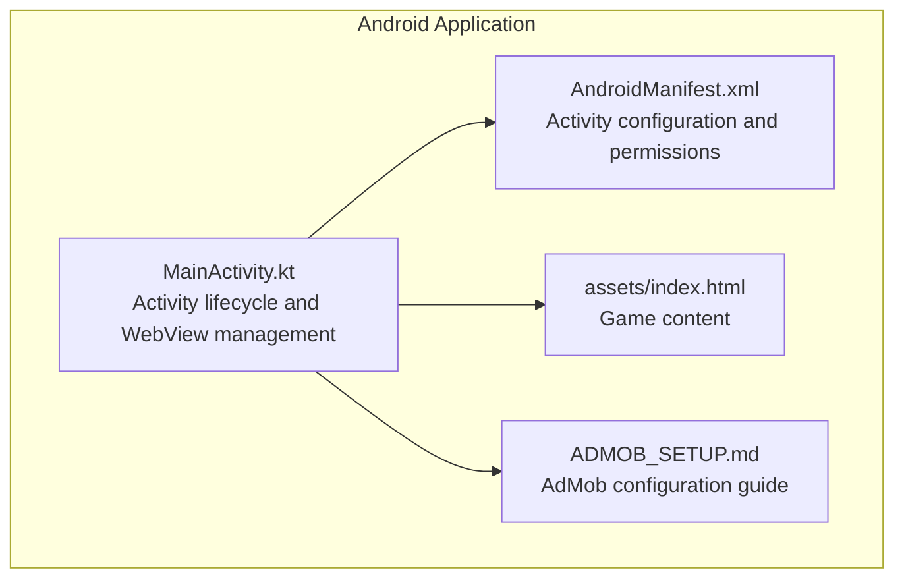
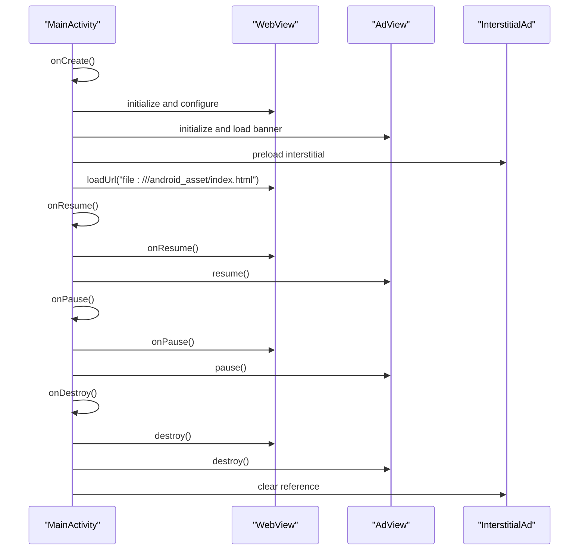
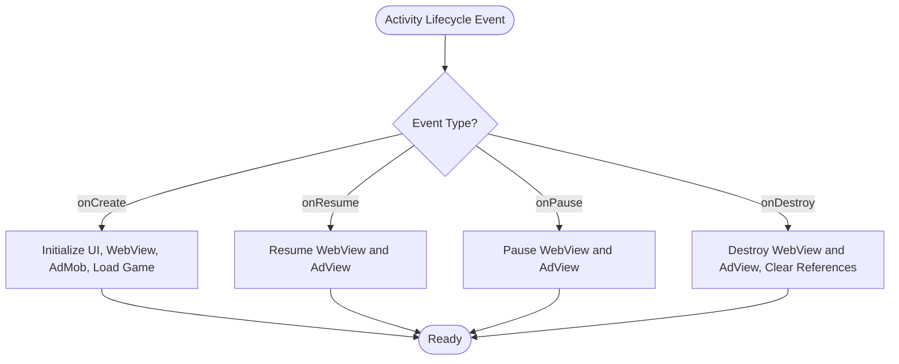
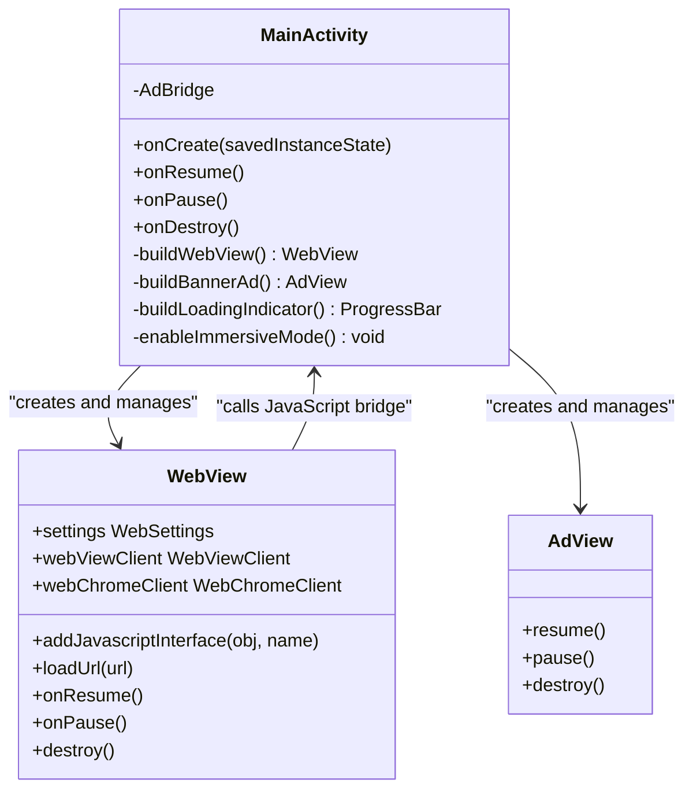
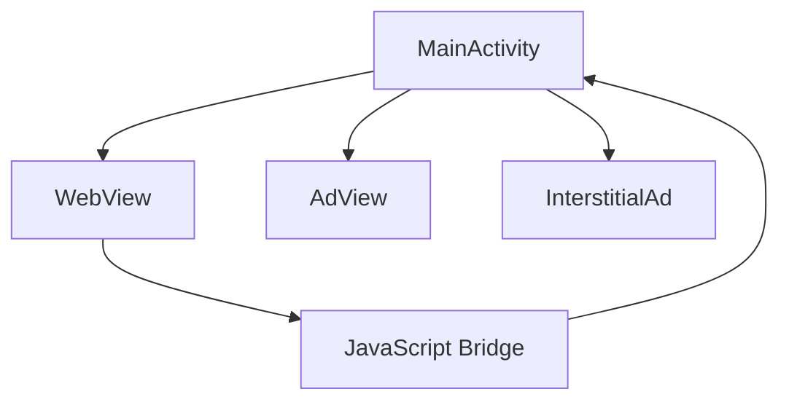

# WebView Lifecycle Management

<cite>
**Referenced Files in This Document**
- [MainActivity.kt](file://app/src/main/java/com/cktechhub/games/MainActivity.kt)
- [AndroidManifest.xml](file://app/src/main/AndroidManifest.xml)
- [index.html](file://app/src/main/assets/index.html)
- [ADMOB_SETUP.md](file://ADMOB_SETUP.md)
</cite>

## Table of Contents
1. [Introduction](#introduction)
2. [Project Structure](#project-structure)
3. [Core Components](#core-components)
4. [Architecture Overview](#architecture-overview)
5. [Detailed Component Analysis](#detailed-component-analysis)
6. [Dependency Analysis](#dependency-analysis)
7. [Performance Considerations](#performance-considerations)
8. [Troubleshooting Guide](#troubleshooting-guide)
9. [Conclusion](#conclusion)

## Introduction
This document provides comprehensive guidance for managing WebView lifecycle in Android applications, focusing on the onCreate, onResume, onPause, and onDestroy methods. It explains how to properly pause and resume WebView processes and ad views during activity lifecycle transitions, how to destroy WebView instances safely, and how to prevent memory leaks. It also covers performance implications, background processing considerations, state preservation and restoration challenges, configuration change handling, and process death scenarios.

## Project Structure
The project is a Kotlin Android application that integrates a WebView hosting a local HTML5 game with AdMob banner and interstitial advertisements. The main activity initializes the WebView, sets up the UI, loads the game content, and manages ad lifecycle.

**Diagram sources**
- [MainActivity.kt:66-154](file://app/src/main/java/com/cktechhub/games/MainActivity.kt#L66-L154)
- [AndroidManifest.xml:30-41](file://app/src/main/AndroidManifest.xml#L30-L41)
- [index.html](file://app/src/main/assets/index.html)

**Section sources**
- [MainActivity.kt:66-154](file://app/src/main/java/com/cktechhub/games/MainActivity.kt#L66-L154)
- [AndroidManifest.xml:30-41](file://app/src/main/AndroidManifest.xml#L30-L41)

## Core Components
- MainActivity: Hosts the WebView, handles lifecycle events, manages ad views, and coordinates game content.
- WebView: Renders the HTML5 game from the app’s assets.
- AdMob AdView: Displays banner ads; interstitial ads are preloaded and shown based on game progress.
- Configuration: Activity configuration includes flags for handling configuration changes and permissions for network access.

Key lifecycle methods:
- onCreate: Initializes immersive UI, checks internet availability, sets up the WebView and ad views, builds the layout, loads the game, and preloads interstitial ads.
- onResume: Resumes WebView and ad view operations.
- onPause: Pauses WebView and ad view operations.
- onDestroy: Destroys WebView and ad view resources and clears references.

**Section sources**
- [MainActivity.kt:66-154](file://app/src/main/java/com/cktechhub/games/MainActivity.kt#L66-L154)
- [MainActivity.kt:165-263](file://app/src/main/java/com/cktechhub/games/MainActivity.kt#L165-L263)
- [MainActivity.kt:265-278](file://app/src/main/java/com/cktechhub/games/MainActivity.kt#L265-L278)
- [AndroidManifest.xml:30-41](file://app/src/main/AndroidManifest.xml#L30-L41)

## Architecture Overview
The activity orchestrates WebView and AdMob components. The WebView loads local HTML content and communicates with Android via a JavaScript interface. AdMob banner and interstitial ads are managed alongside the WebView lifecycle.

**Diagram sources**
- [MainActivity.kt:66-154](file://app/src/main/java/com/cktechhub/games/MainActivity.kt#L66-L154)
- [MainActivity.kt:165-263](file://app/src/main/java/com/cktechhub/games/MainActivity.kt#L165-L263)
- [MainActivity.kt:265-278](file://app/src/main/java/com/cktechhub/games/MainActivity.kt#L265-L278)

## Detailed Component Analysis

### Lifecycle Methods Implementation
- onCreate
  - Enables immersive mode and checks internet connectivity.
  - Initializes the AdMob SDK.
  - Sets up the back press callback to navigate WebView history.
  - Builds the root layout with a vertical LinearLayout containing a WebView frame and an AdView.
  - Creates a loading indicator overlay.
  - Loads the game content from the app’s assets.
  - Preloads an interstitial ad.
  - References: [MainActivity.kt:66-135](file://app/src/main/java/com/cktechhub/games/MainActivity.kt#L66-L135)

- onResume
  - Resumes WebView and AdView operations.
  - References: [MainActivity.kt:137-141](file://app/src/main/java/com/cktechhub/games/MainActivity.kt#L137-L141)

- onPause
  - Pauses WebView and AdView operations.
  - References: [MainActivity.kt:143-147](file://app/src/main/java/com/cktechhub/games/MainActivity.kt#L143-L147)

- onDestroy
  - Destroys WebView and AdView resources and clears interstitial ad references.
  - References: [MainActivity.kt:149-154](file://app/src/main/java/com/cktechhub/games/MainActivity.kt#L149-L154)

**Diagram sources**
- [MainActivity.kt:66-154](file://app/src/main/java/com/cktechhub/games/MainActivity.kt#L66-L154)

**Section sources**
- [MainActivity.kt:66-154](file://app/src/main/java/com/cktechhub/games/MainActivity.kt#L66-L154)

### WebView Initialization and Settings
- WebView creation and configuration include enabling JavaScript, DOM storage, file access, content access, mixed content policy, zoom controls, cache mode, and layout algorithm.
- A JavaScript interface is added to bridge communication between the WebView and Android.
- A WebViewClient enforces safe navigation by allowing only local asset URLs and injecting a JavaScript bridge to notify Android on level completion.
- A WebChromeClient logs console messages for debugging.
- References: [MainActivity.kt:165-263](file://app/src/main/java/com/cktechhub/games/MainActivity.kt#L165-L263)

**Diagram sources**
- [MainActivity.kt:42-60](file://app/src/main/java/com/cktechhub/games/MainActivity.kt#L42-L60)
- [MainActivity.kt:165-263](file://app/src/main/java/com/cktechhub/games/MainActivity.kt#L165-L263)
- [MainActivity.kt:265-278](file://app/src/main/java/com/cktechhub/games/MainActivity.kt#L265-L278)

**Section sources**
- [MainActivity.kt:165-263](file://app/src/main/java/com/cktechhub/games/MainActivity.kt#L165-L263)
- [MainActivity.kt:265-278](file://app/src/main/java/com/cktechhub/games/MainActivity.kt#L265-L278)

### AdMob Integration
- Banner ad initialization and loading occur during onCreate.
- Interstitial ad preloading and full-screen content callbacks are handled separately.
- References: [MainActivity.kt:265-278](file://app/src/main/java/com/cktechhub/games/MainActivity.kt#L265-L278), [MainActivity.kt:370-409](file://app/src/main/java/com/cktechhub/games/MainActivity.kt#L370-L409)

**Section sources**
- [MainActivity.kt:265-278](file://app/src/main/java/com/cktechhub/games/MainActivity.kt#L265-L278)
- [MainActivity.kt:370-409](file://app/src/main/java/com/cktechhub/games/MainActivity.kt#L370-L409)

### Configuration Changes and Process Death
- The activity declares configuration changes it handles, including orientation, screen size, keyboard, and smallest screen size.
- References: [AndroidManifest.xml:33](file://app/src/main/AndroidManifest.xml#L33)

**Section sources**
- [AndroidManifest.xml:33](file://app/src/main/AndroidManifest.xml#L33)

### Background Processing and Rendering
- The WebView client includes a renderer gone handler to detect low-memory termination and reload the WebView accordingly.
- References: [MainActivity.kt:231-244](file://app/src/main/java/com/cktechhub/games/MainActivity.kt#L231-L244)

**Section sources**
- [MainActivity.kt:231-244](file://app/src/main/java/com/cktechhub/games/MainActivity.kt#L231-L244)

## Dependency Analysis
The activity depends on the WebView and AdMob components for rendering game content and displaying advertisements. The WebView interacts with the JavaScript bridge to trigger ad events based on game progress.

**Diagram sources**
- [MainActivity.kt:42-60](file://app/src/main/java/com/cktechhub/games/MainActivity.kt#L42-L60)
- [MainActivity.kt:165-263](file://app/src/main/java/com/cktechhub/games/MainActivity.kt#L165-L263)
- [MainActivity.kt:265-278](file://app/src/main/java/com/cktechhub/games/MainActivity.kt#L265-L278)

**Section sources**
- [MainActivity.kt:42-60](file://app/src/main/java/com/cktechhub/games/MainActivity.kt#L42-L60)
- [MainActivity.kt:165-263](file://app/src/main/java/com/cktechhub/games/MainActivity.kt#L165-L263)
- [MainActivity.kt:265-278](file://app/src/main/java/com/cktechhub/games/MainActivity.kt#L265-L278)

## Performance Considerations
- Lifecycle alignment: Resuming and pausing WebView and AdView ensures smooth transitions and reduces unnecessary background processing.
- Renderer resilience: Detecting and recovering from renderer process termination improves stability under memory pressure.
- Resource cleanup: Properly destroying WebView and AdView instances prevents memory leaks and frees native resources.
- References: [MainActivity.kt:137-154](file://app/src/main/java/com/cktechhub/games/MainActivity.kt#L137-L154), [MainActivity.kt:231-244](file://app/src/main/java/com/cktechhub/games/MainActivity.kt#L231-L244)

**Section sources**
- [MainActivity.kt:137-154](file://app/src/main/java/com/cktechhub/games/MainActivity.kt#L137-L154)
- [MainActivity.kt:231-244](file://app/src/main/java/com/cktechhub/games/MainActivity.kt#L231-L244)

## Troubleshooting Guide
Common issues and resolutions:
- WebView not resuming after backgrounding: Ensure onPause and onResume are correctly paired and that the activity focus is restored.
- Ads not functioning after configuration changes: Verify that AdView resume/pause are called in lifecycle methods and that configuration changes are declared in the manifest.
- Memory leaks after activity destruction: Confirm that WebView and AdView are destroyed in onDestroy and that references are cleared.
- Renderer crashes or OOM kills: Use the renderer gone handler to detect low-memory termination and reload the WebView.
- References: [MainActivity.kt:137-154](file://app/src/main/java/com/cktechhub/games/MainActivity.kt#L137-L154), [MainActivity.kt:231-244](file://app/src/main/java/com/cktechhub/games/MainActivity.kt#L231-L244), [AndroidManifest.xml:33](file://app/src/main/AndroidManifest.xml#L33)

**Section sources**
- [MainActivity.kt:137-154](file://app/src/main/java/com/cktechhub/games/MainActivity.kt#L137-L154)
- [MainActivity.kt:231-244](file://app/src/main/java/com/cktechhub/games/MainActivity.kt#L231-L244)
- [AndroidManifest.xml:33](file://app/src/main/AndroidManifest.xml#L33)

## Conclusion
Proper WebView lifecycle management is essential for maintaining performance, stability, and resource efficiency. By aligning WebView and AdView operations with activity lifecycle events, handling renderer issues gracefully, and cleaning up resources upon destruction, developers can ensure robust behavior across configuration changes and process death scenarios. The provided implementation demonstrates best practices for integrating WebView with AdMob while preserving a responsive and efficient user experience.