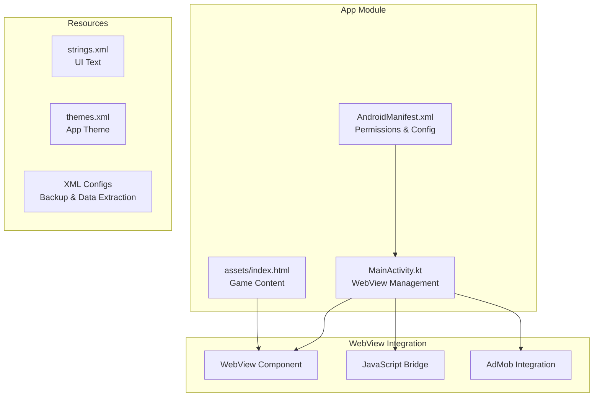
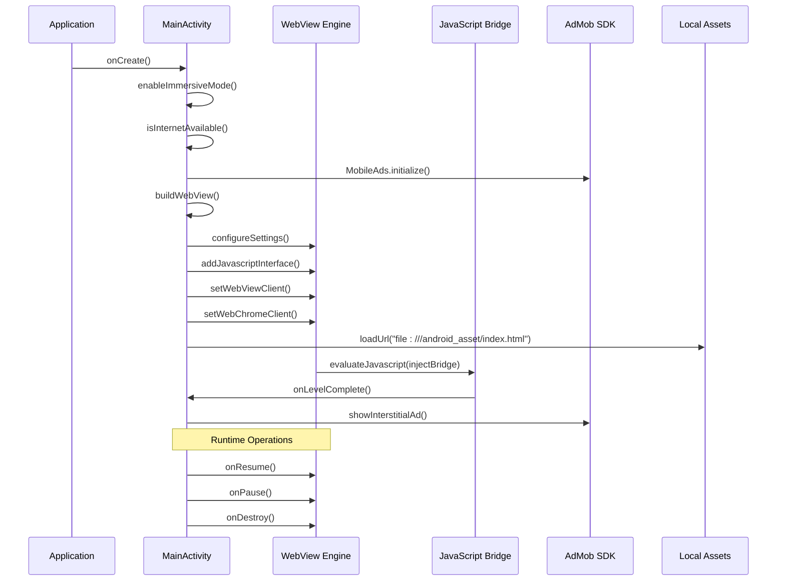
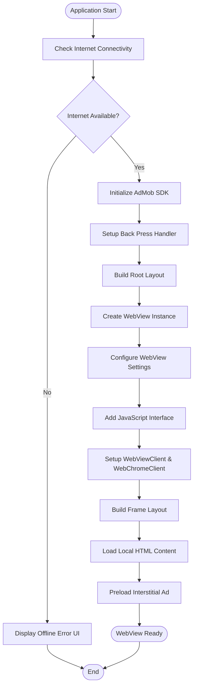
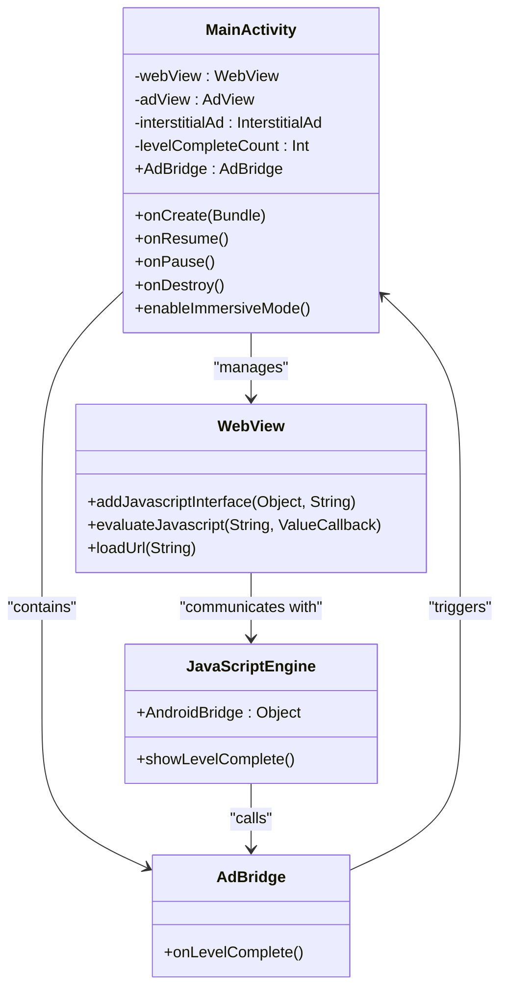

# WebView Management & Configuration

<cite>
**Referenced Files in This Document**
- [MainActivity.kt](file://app/src/main/java/com/cktechhub/games/MainActivity.kt)
- [index.html](file://app/src/main/assets/index.html)
- [AndroidManifest.xml](file://app/src/main/AndroidManifest.xml)
- [strings.xml](file://app/src/main/res/values/strings.xml)
- [themes.xml](file://app/src/main/res/values/themes.xml)
</cite>

## Table of Contents
1. [Introduction](#introduction)
2. [Project Structure](#project-structure)
3. [Core Components](#core-components)
4. [Architecture Overview](#architecture-overview)
5. [Detailed Component Analysis](#detailed-component-analysis)
6. [WebView Initialization Process](#webview-initialization-process)
7. [Security Configuration](#security-configuration)
8. [JavaScript Interface Implementation](#javascript-interface-implementation)
9. [WebViewClient Configuration](#webviewclient-configuration)
10. [WebChromeClient Setup](#webchromeclient-setup)
11. [WebView Lifecycle Management](#webview-lifecycle-management)
12. [Layout Building & Frame Management](#layout-building--frame-management)
13. [Performance Optimization](#performance-optimization)
14. [Security Considerations](#security-considerations)
15. [Troubleshooting Guide](#troubleshooting-guide)
16. [Conclusion](#conclusion)

## Introduction

The Ball Sort Puzzle game utilizes Android's WebView component to host its HTML5/JavaScript game engine. This comprehensive documentation covers the WebView management and configuration implementation, including initialization processes, security settings, JavaScript interfaces, client configurations, lifecycle management, and performance optimizations.

The implementation demonstrates best practices for embedding web content in Android applications while maintaining security, performance, and user experience standards.

## Project Structure

The WebView implementation is primarily contained within the MainActivity class, with supporting assets and configuration files:

**Diagram sources**
- [MainActivity.kt:1-441](file://app/src/main/java/com/cktechhub/games/MainActivity.kt#L1-L441)
- [AndroidManifest.xml:1-51](file://app/src/main/AndroidManifest.xml#L1-L51)

**Section sources**
- [MainActivity.kt:1-441](file://app/src/main/java/com/cktechhub/games/MainActivity.kt#L1-L441)
- [AndroidManifest.xml:1-51](file://app/src/main/AndroidManifest.xml#L1-L51)

## Core Components

The WebView management system consists of several key components working together:

### Main Activity Architecture
The MainActivity serves as the central coordinator for WebView lifecycle, layout management, and integration with native Android features.

### WebView Configuration
The WebView is configured with strict security policies and optimized performance settings tailored for the game's requirements.

### JavaScript Bridge
A bidirectional communication channel enables seamless interaction between the web-based game logic and native Android functionality.

### AdMob Integration
Native advertising integration through Google AdMob SDK with WebView-based content delivery.

**Section sources**
- [MainActivity.kt:42-60](file://app/src/main/java/com/cktechhub/games/MainActivity.kt#L42-L60)
- [MainActivity.kt:165-263](file://app/src/main/java/com/cktechhub/games/MainActivity.kt#L165-L263)

## Architecture Overview

The WebView architecture follows a layered approach with clear separation of concerns:

**Diagram sources**
- [MainActivity.kt:66-135](file://app/src/main/java/com/cktechhub/games/MainActivity.kt#L66-L135)
- [MainActivity.kt:165-263](file://app/src/main/java/com/cktechhub/games/MainActivity.kt#L165-L263)

## Detailed Component Analysis

### WebView Initialization Process

The WebView initialization follows a structured approach ensuring optimal setup and configuration:

**Diagram sources**
- [MainActivity.kt:66-135](file://app/src/main/java/com/cktechhub/games/MainActivity.kt#L66-L135)

**Section sources**
- [MainActivity.kt:66-135](file://app/src/main/java/com/cktechhub/games/MainActivity.kt#L66-L135)

### Security Configuration

The WebView implements comprehensive security measures to protect against various attack vectors:

#### Mixed Content Policy
The implementation uses `MIXED_CONTENT_NEVER_ALLOW` to prevent loading of insecure HTTP resources when the page is HTTPS.

#### URL Filtering
Strict URL validation ensures only local asset files can be loaded, blocking external links and potentially malicious URLs.

#### JavaScript Interface Security
The JavaScript bridge is carefully scoped and validated to prevent unauthorized access to native functionality.

**Section sources**
- [MainActivity.kt:172-189](file://app/src/main/java/com/cktechhub/games/MainActivity.kt#L172-L189)
- [MainActivity.kt:194-207](file://app/src/main/java/com/cktechhub/games/MainActivity.kt#L194-L207)

### JavaScript Interface Implementation

The JavaScript bridge enables bidirectional communication between the web game and Android native code:

**Diagram sources**
- [MainActivity.kt:428-439](file://app/src/main/java/com/cktechhub/games/MainActivity.kt#L428-L439)
- [MainActivity.kt:191-192](file://app/src/main/java/com/cktechhub/games/MainActivity.kt#L191-L192)

**Section sources**
- [MainActivity.kt:428-439](file://app/src/main/java/com/cktechhub/games/MainActivity.kt#L428-L439)

## WebView Initialization Process

The WebView initialization process involves multiple stages ensuring proper setup and configuration:

### Stage 1: Environment Preparation
- Immersive mode activation for fullscreen gaming experience
- Internet connectivity verification before proceeding
- AdMob SDK initialization for monetization support

### Stage 2: Layout Construction
- Root LinearLayout with vertical orientation
- FrameLayout container for WebView and loading overlay
- AdView banner positioned at the bottom

### Stage 3: WebView Configuration
- Comprehensive WebSettings configuration
- JavaScript interface registration
- Client configuration for navigation and debugging

### Stage 4: Content Loading
- Loading local HTML content from assets
- JavaScript bridge injection for level completion events
- Initial rendering and display

**Section sources**
- [MainActivity.kt:66-135](file://app/src/main/java/com/cktechhub/games/MainActivity.kt#L66-L135)
- [MainActivity.kt:165-263](file://app/src/main/java/com/cktechhub/games/MainActivity.kt#L165-L263)

## Security Configuration

The WebView security implementation follows defense-in-depth principles:

### Network Security
- Mixed content disabled entirely (`MIXED_CONTENT_NEVER_ALLOW`)
- Strict URL validation in WebViewClient
- No external resource loading permitted

### JavaScript Security
- Controlled JavaScript interface exposure
- Method-level security through `@JavascriptInterface`
- Minimal interface surface area

### Content Security
- Local asset-only loading policy
- No file system access beyond assets
- Restricted media playback requirements

**Section sources**
- [MainActivity.kt:172-189](file://app/src/main/java/com/cktechhub/games/MainActivity.kt#L172-L189)
- [MainActivity.kt:194-207](file://app/src/main/java/com/cktechhub/games/MainActivity.kt#L194-L207)

## JavaScript Interface Implementation

The JavaScript bridge provides seamless communication between the web game and Android native code:

### Bridge Design Pattern
The `AdBridge` inner class implements a controlled interface for level completion notifications.

### Event-Driven Communication
Level completion events trigger interstitial ad displays through the bridge mechanism.

### Thread Safety
All bridge operations are executed on the UI thread to ensure thread safety.

**Section sources**
- [MainActivity.kt:428-439](file://app/src/main/java/com/cktechhub/games/MainActivity.kt#L428-L439)

## WebViewClient Configuration

The WebViewClient handles navigation and security enforcement:

### URL Filtering Logic
Only URLs starting with `file:///android_asset/` are permitted, blocking all external links and protocols.

### Safe Navigation Handling
External link attempts are intercepted and blocked, preventing unwanted navigation outside the game.

### Render Process Monitoring
Automatic detection and recovery from WebView renderer crashes and out-of-memory situations.

**Section sources**
- [MainActivity.kt:194-245](file://app/src/main/java/com/cktechhub/games/MainActivity.kt#L194-L245)

## WebChromeClient Setup

The WebChromeClient provides debugging and monitoring capabilities:

### Console Logging
JavaScript console messages are captured and logged to Android's logging system.

### Debugging Support
Real-time visibility into JavaScript execution and potential errors during development.

### Message Processing
Structured logging with source identification and line numbers for debugging purposes.

**Section sources**
- [MainActivity.kt:247-256](file://app/src/main/java/com/cktechhub/games/MainActivity.kt#L247-L256)

## WebView Lifecycle Management

The WebView lifecycle follows Android activity lifecycle patterns:

### onCreate() Phase
- Fullscreen immersive mode activation
- Internet connectivity verification
- WebView creation and configuration
- Layout construction and content loading

### onResume() Phase
- WebView resume for continued operation
- AdView resume for continued advertising

### onPause() Phase
- WebView pause to conserve resources
- AdView pause to stop ad-related operations

### onDestroy() Phase
- WebView destruction for memory cleanup
- AdView destruction and reference clearing

**Section sources**
- [MainActivity.kt:137-154](file://app/src/main/java/com/cktechhub/games/MainActivity.kt#L137-L154)

## Layout Building & Frame Management

The layout system uses a hierarchical approach for optimal content presentation:

### Root Layout Structure
- LinearLayout with vertical orientation
- Black background for immersive gaming experience
- Proper sizing for fullscreen operation

### Frame Layout Overlay System
- WebView as primary content container
- Loading ProgressBar as centered overlay
- Z-order management for proper layering

### Responsive Design Integration
- Flexible sizing with weight distribution
- Proper aspect ratio maintenance
- Safe area consideration for modern devices

**Section sources**
- [MainActivity.kt:95-128](file://app/src/main/java/com/cktechhub/games/MainActivity.kt#L95-L128)
- [MainActivity.kt:280-290](file://app/src/main/java/com/cktechhub/games/MainActivity.kt#L280-L290)

## Performance Optimization

Several performance optimizations are implemented:

### Memory Management
- Proper WebView destruction in onDestroy()
- Resource cleanup for ads and other components
- Efficient garbage collection practices

### Rendering Optimization
- Hardware acceleration enabled through proper configuration
- Smooth scrolling and touch response
- Optimized canvas rendering for game elements

### Network Efficiency
- Local asset loading eliminates network overhead
- Preloading of interstitial ads reduces latency
- Caching strategy for improved load times

**Section sources**
- [MainActivity.kt:172-189](file://app/src/main/java/com/cktechhub/games/MainActivity.kt#L172-L189)
- [MainActivity.kt:137-154](file://app/src/main/java/com/cktechhub/games/MainActivity.kt#L137-L154)

## Security Considerations

The implementation addresses multiple security aspects:

### Content Security
- Local-only asset loading prevents XSS attacks
- Strict URL filtering blocks malicious navigation
- JavaScript interface limitations reduce attack surface

### Privacy Protection
- No unnecessary permissions requested
- Local-only data processing
- Minimal data transmission requirements

### Runtime Security
- WebView renderer crash detection and recovery
- Memory pressure handling for stability
- Secure communication channels only

**Section sources**
- [MainActivity.kt:194-245](file://app/src/main/java/com/cktechhub/games/MainActivity.kt#L194-L245)
- [AndroidManifest.xml:5-8](file://app/src/main/AndroidManifest.xml#L5-L8)

## Troubleshooting Guide

Common issues and their solutions:

### WebView Not Loading
- Verify internet connectivity before initialization
- Check asset file accessibility
- Review WebViewClient URL filtering configuration

### JavaScript Bridge Issues
- Ensure `@JavascriptInterface` annotation is present
- Verify JavaScript interface registration
- Check for proper method signatures

### Memory Issues
- Monitor WebView renderer process
- Implement proper lifecycle management
- Consider WebView recreation on OOM events

### AdMob Integration Problems
- Verify AdMob SDK initialization
- Check ad unit IDs configuration
- Review network connectivity requirements

**Section sources**
- [MainActivity.kt:231-244](file://app/src/main/java/com/cktechhub/games/MainActivity.kt#L231-L244)
- [MainActivity.kt:296-302](file://app/src/main/java/com/cktechhub/games/MainActivity.kt#L296-L302)

## Conclusion

The Ball Sort Puzzle game demonstrates comprehensive WebView management and configuration best practices. The implementation successfully balances security, performance, and user experience while providing robust functionality for embedded web content.

Key achievements include:
- Secure WebView configuration with strict content policies
- Efficient JavaScript bridge implementation
- Comprehensive lifecycle management
- Performance optimizations for mobile devices
- Robust error handling and recovery mechanisms

This implementation serves as a model for other applications requiring embedded web content while maintaining high security standards and optimal performance.