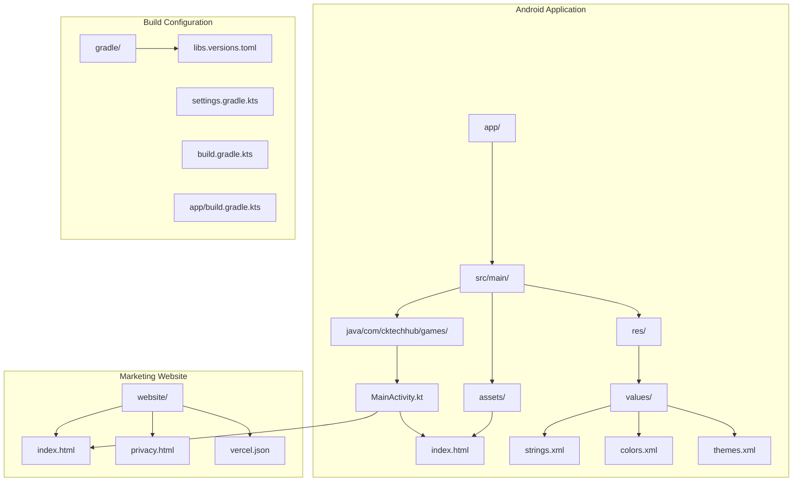
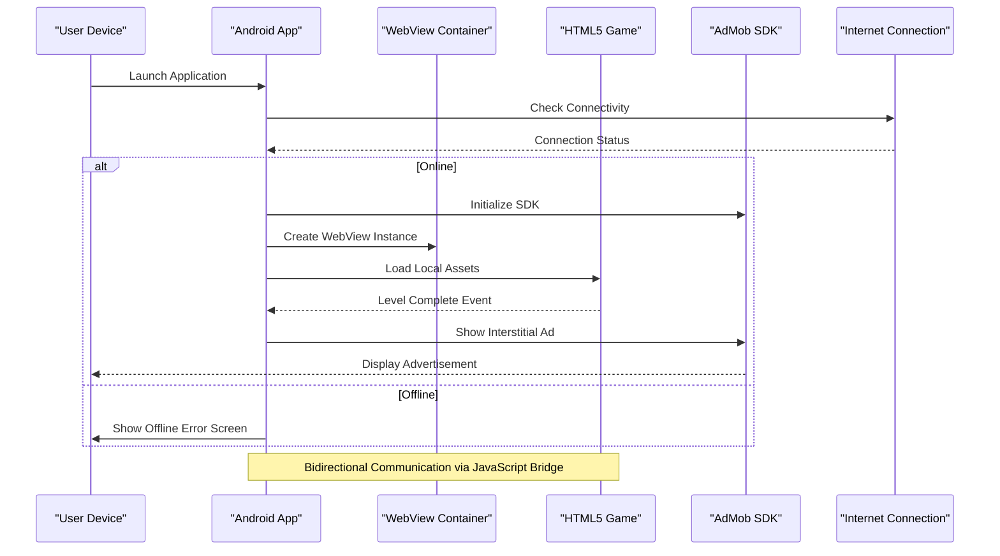
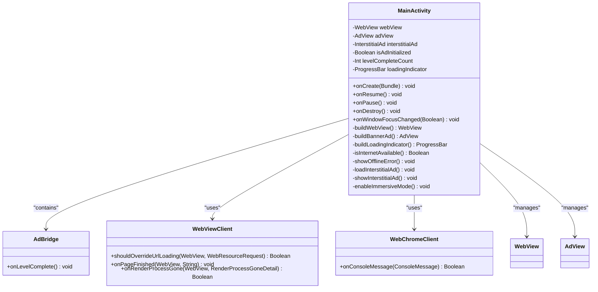
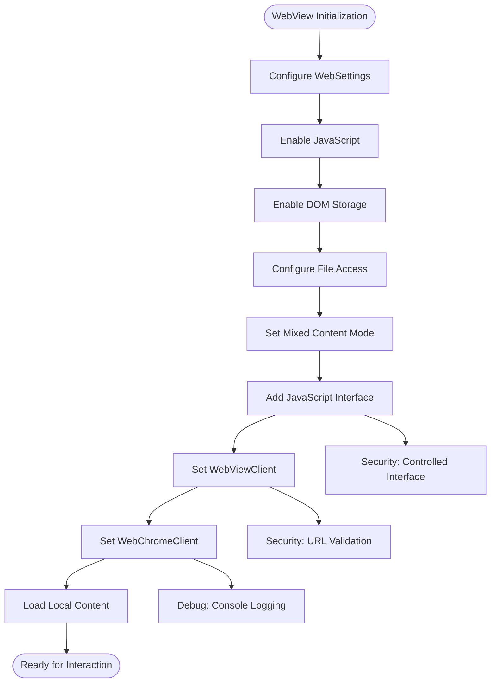
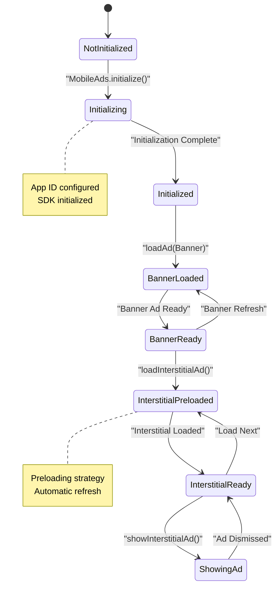
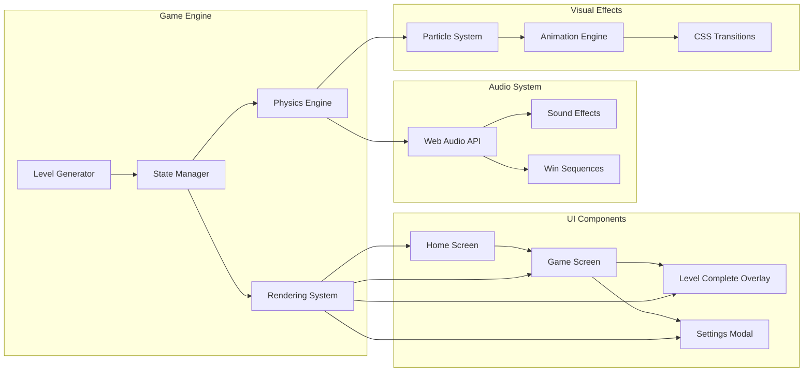
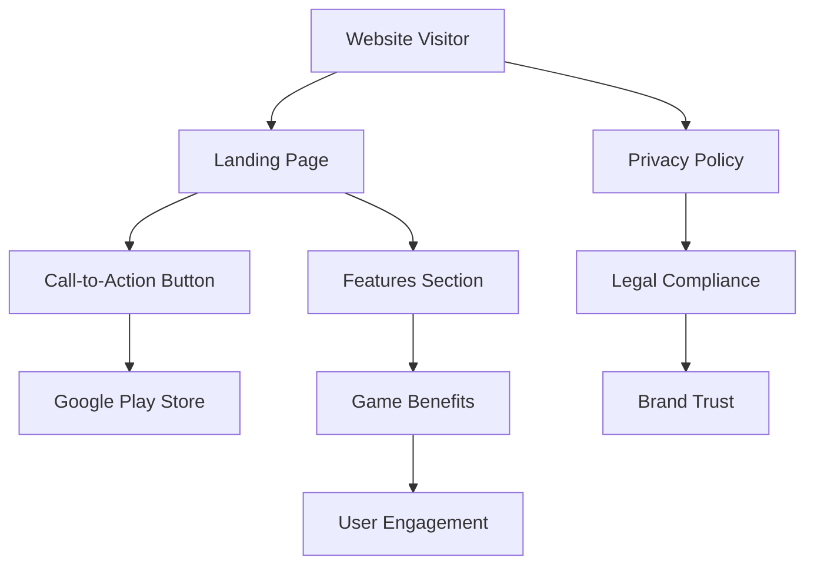
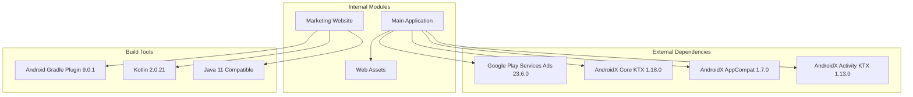

# Website Marketing Platform

<cite>
**Referenced Files in This Document**
- [AndroidManifest.xml](file://app/src/main/AndroidManifest.xml)
- [MainActivity.kt](file://app/src/main/java/com/cktechhub/games/MainActivity.kt)
- [index.html](file://app/src/main/assets/index.html)
- [website/index.html](file://website/index.html)
- [website/privacy.html](file://website/privacy.html)
- [settings.gradle.kts](file://settings.gradle.kts)
- [build.gradle.kts](file://build.gradle.kts)
- [app/build.gradle.kts](file://app/build.gradle.kts)
- [gradle/libs.versions.toml](file://gradle/libs.versions.toml)
- [strings.xml](file://app/src/main/res/values/strings.xml)
- [colors.xml](file://app/src/main/res/values/colors.xml)
- [themes.xml](file://app/src/main/res/values/themes.xml)
- [ADMOB_SETUP.md](file://ADMOB_SETUP.md)
</cite>

## Table of Contents
1. [Introduction](#introduction)
2. [Project Structure](#project-structure)
3. [Core Components](#core-components)
4. [Architecture Overview](#architecture-overview)
5. [Detailed Component Analysis](#detailed-component-analysis)
6. [Dependency Analysis](#dependency-analysis)
7. [Performance Considerations](#performance-considerations)
8. [Troubleshooting Guide](#troubleshooting-guide)
9. [Conclusion](#conclusion)

## Introduction
This project is a cross-platform marketing solution combining a native Android application with a static marketing website. The Android app serves as a game wrapper that loads HTML5 content from the local assets directory while integrating Google AdMob for monetization. The marketing website provides promotional content and legal compliance pages. Together, they form a complete digital presence for the "Tube Master Puzzle" game, designed to drive downloads and engagement through seamless integration of native capabilities and web technologies.

## Project Structure
The project follows a modular Android application structure with integrated web assets and separate marketing website content:

**Diagram sources**
- [AndroidManifest.xml:1-51](file://app/src/main/AndroidManifest.xml#L1-L51)
- [MainActivity.kt:1-441](file://app/src/main/java/com/cktechhub/games/MainActivity.kt#L1-L441)
- [index.html:1-1131](file://app/src/main/assets/index.html#L1-L1131)
- [website/index.html:1-81](file://website/index.html#L1-L81)

**Section sources**
- [AndroidManifest.xml:1-51](file://app/src/main/AndroidManifest.xml#L1-L51)
- [settings.gradle.kts:1-27](file://settings.gradle.kts#L1-L27)
- [build.gradle.kts:1-4](file://build.gradle.kts#L1-L4)

## Core Components
The platform consists of three primary components working in harmony:

### Android Application Layer
The native Android application provides the foundation for game delivery and monetization integration. Key responsibilities include:
- WebView management for HTML5 game content
- AdMob integration for banner and interstitial advertising
- Offline connectivity detection and error handling
- Immersive fullscreen experience configuration
- JavaScript bridge for game-to-native communication

### Web Content Layer
The HTML5 game content delivered through the WebView provides:
- Complete puzzle game mechanics and rendering
- Responsive design for various screen sizes
- Interactive elements and animations
- Local storage for game progress persistence
- Progressive enhancement with modern web APIs

### Marketing Website Layer
Static marketing pages supporting user acquisition:
- Landing page with game showcase and Google Play integration
- Privacy policy compliance documentation
- SEO-friendly structure for discoverability

**Section sources**
- [MainActivity.kt:42-136](file://app/src/main/java/com/cktechhub/games/MainActivity.kt#L42-L136)
- [index.html:1-1131](file://app/src/main/assets/index.html#L1-L1131)
- [website/index.html:1-81](file://website/index.html#L1-L81)

## Architecture Overview
The system employs a hybrid architecture that seamlessly integrates native Android capabilities with web technologies:

**Diagram sources**
- [MainActivity.kt:66-136](file://app/src/main/java/com/cktechhub/games/MainActivity.kt#L66-L136)
- [MainActivity.kt:428-440](file://app/src/main/java/com/cktechhub/games/MainActivity.kt#L428-L440)
- [AndroidManifest.xml:20-48](file://app/src/main/AndroidManifest.xml#L20-L48)

The architecture implements several key design patterns:

1. **WebView Pattern**: Native container manages web content with controlled access
2. **JavaScript Bridge Pattern**: Secure communication channel between native and web layers
3. **AdMob Integration Pattern**: Monetization through standardized advertising SDK
4. **Offline Detection Pattern**: Graceful degradation for connectivity issues

**Section sources**
- [MainActivity.kt:166-264](file://app/src/main/java/com/cktechhub/games/MainActivity.kt#L166-L264)
- [MainActivity.kt:370-409](file://app/src/main/java/com/cktechhub/games/MainActivity.kt#L370-L409)

## Detailed Component Analysis

### Android Activity Implementation
The MainActivity serves as the central orchestrator managing the complete application lifecycle:

**Diagram sources**
- [MainActivity.kt:42-440](file://app/src/main/java/com/cktechhub/games/MainActivity.kt#L42-L440)

The activity implements comprehensive error handling and lifecycle management:

**Section sources**
- [MainActivity.kt:66-155](file://app/src/main/java/com/cktechhub/games/MainActivity.kt#L66-L155)
- [MainActivity.kt:296-364](file://app/src/main/java/com/cktechhub/games/MainActivity.kt#L296-L364)

### WebView Configuration and Security
The WebView implementation prioritizes security and performance:

**Diagram sources**
- [MainActivity.kt:166-264](file://app/src/main/java/com/cktechhub/games/MainActivity.kt#L166-L264)

Key security configurations include:
- JavaScript interface restricted to specific methods
- URL filtering preventing external resource loading
- Mixed content blocking for HTTPS security
- Render process crash recovery mechanisms

**Section sources**
- [MainActivity.kt:174-190](file://app/src/main/java/com/cktechhub/games/MainActivity.kt#L174-L190)
- [MainActivity.kt:196-246](file://app/src/main/java/com/cktechhub/games/MainActivity.kt#L196-L246)

### AdMob Integration Architecture
The monetization system integrates multiple ad formats with sophisticated lifecycle management:

**Diagram sources**
- [MainActivity.kt:370-409](file://app/src/main/java/com/cktechhub/games/MainActivity.kt#L370-L409)
- [AndroidManifest.xml:20-28](file://app/src/main/AndroidManifest.xml#L20-L28)

The system implements intelligent ad frequency control and automatic recovery mechanisms for ad failures.

**Section sources**
- [MainActivity.kt:370-409](file://app/src/main/java/com/cktechhub/games/MainActivity.kt#L370-L409)
- [ADMOB_SETUP.md:80-93](file://ADMOB_SETUP.md#L80-L93)

### Game Content Management
The HTML5 game content provides a complete puzzle experience with advanced features:

**Diagram sources**
- [index.html:350-800](file://app/src/main/assets/index.html#L350-L800)

The game engine supports progressive difficulty scaling from 15 handcrafted levels with sophisticated physics and visual feedback systems.

**Section sources**
- [index.html:354-370](file://app/src/main/assets/index.html#L354-L370)
- [index.html:416-450](file://app/src/main/assets/index.html#L416-L450)

### Marketing Website Implementation
The marketing website provides essential business content with responsive design:

**Diagram sources**
- [website/index.html:48-78](file://website/index.html#L48-L78)
- [website/privacy.html:40-85](file://website/privacy.html#L40-L85)

The website emphasizes conversion-focused design with clear value propositions and trust-building elements.

**Section sources**
- [website/index.html:1-81](file://website/index.html#L1-L81)
- [website/privacy.html:1-92](file://website/privacy.html#L1-L92)

## Dependency Analysis
The project maintains clean separation of concerns through well-defined dependencies:

**Diagram sources**
- [gradle/libs.versions.toml:13-21](file://gradle/libs.versions.toml#L13-L21)
- [app/build.gradle.kts:34-43](file://app/build.gradle.kts#L34-L43)

**Section sources**
- [gradle/libs.versions.toml:1-28](file://gradle/libs.versions.toml#L1-L28)
- [app/build.gradle.kts:1-43](file://app/build.gradle.kts#L1-L43)

## Performance Considerations
The platform implements several optimization strategies:

### Memory Management
- WebView lifecycle management with proper cleanup
- Interstitial ad preloading with automatic refresh
- Particle system with efficient cleanup mechanisms
- Progressive loading of game assets

### Network Optimization
- Offline detection and graceful degradation
- Local asset loading for reduced bandwidth usage
- Ad request optimization with exponential backoff
- Connection state monitoring

### Rendering Performance
- Hardware-accelerated WebView configuration
- Efficient CSS animations and transforms
- Canvas-based particle rendering
- Responsive design with viewport optimization

## Troubleshooting Guide

### Common Issues and Solutions

**AdMob Integration Problems**
- Verify AdMob IDs are correctly configured in both manifest and code
- Check ad unit availability in AdMob console
- Ensure proper initialization sequence
- Monitor ad load failure logs

**WebView Content Loading Issues**
- Confirm asset paths are correct
- Verify JavaScript interface permissions
- Check mixed content policies
- Review console logs for errors

**Offline Mode Problems**
- Validate internet permission configuration
- Test connectivity detection logic
- Ensure fallback UI displays correctly
- Verify retry mechanism functionality

**Section sources**
- [ADMOB_SETUP.md:96-104](file://ADMOB_SETUP.md#L96-L104)
- [MainActivity.kt:296-364](file://app/src/main/java/com/cktechhub/games/MainActivity.kt#L296-L364)

## Conclusion
This website marketing platform demonstrates a sophisticated approach to mobile game distribution through the integration of native Android capabilities with modern web technologies. The hybrid architecture successfully combines the strengths of both ecosystems: the native layer's performance and system integration with the web layer's portability and rapid development cycle.

Key achievements include:
- Seamless monetization through AdMob integration
- Robust offline handling and error management
- Comprehensive security through WebView hardening
- Professional marketing website with legal compliance
- Optimized performance through careful resource management

The platform provides an excellent foundation for mobile game marketing, offering both immediate monetization opportunities and long-term scalability for content updates and feature enhancements.