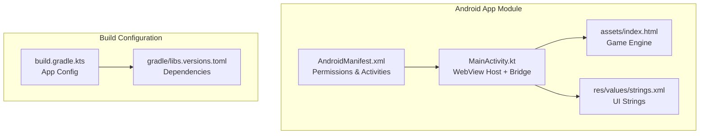
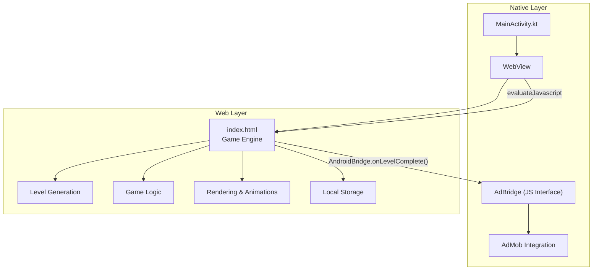
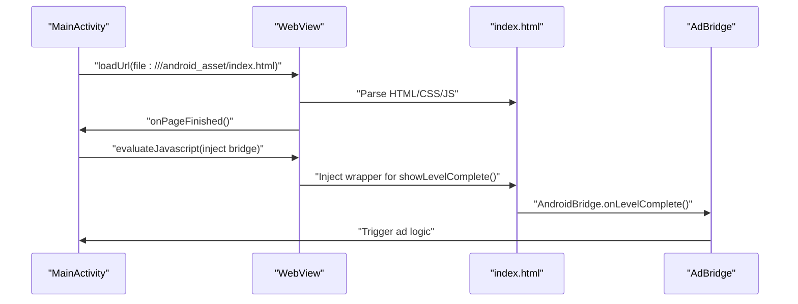
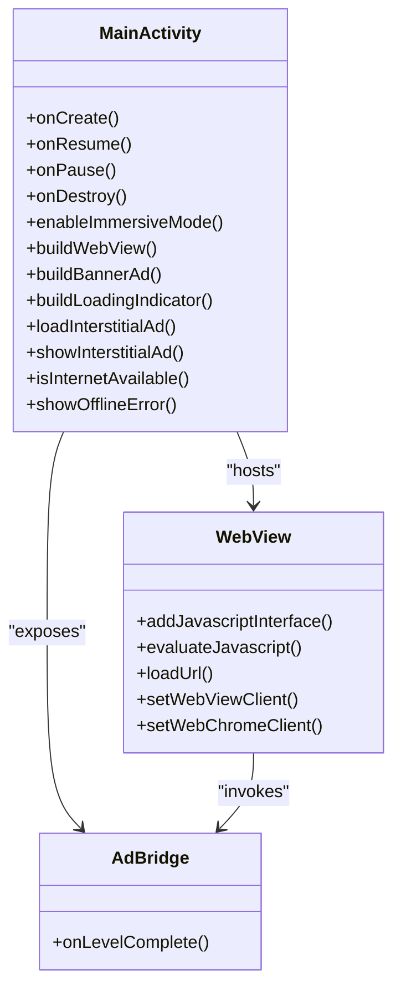
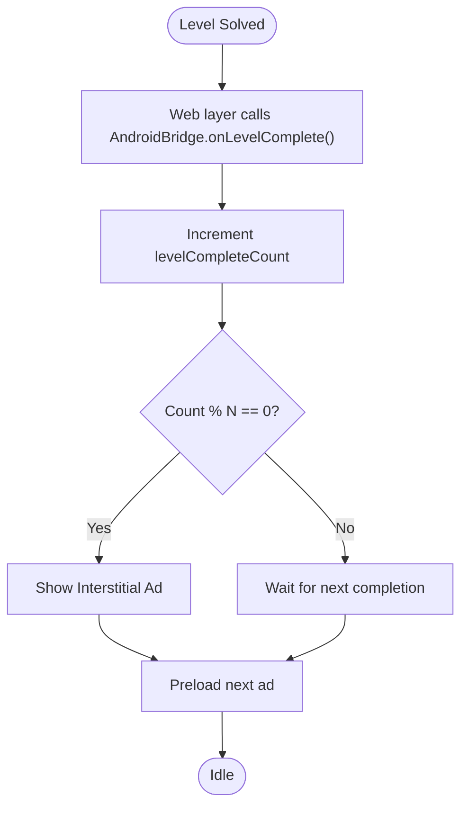
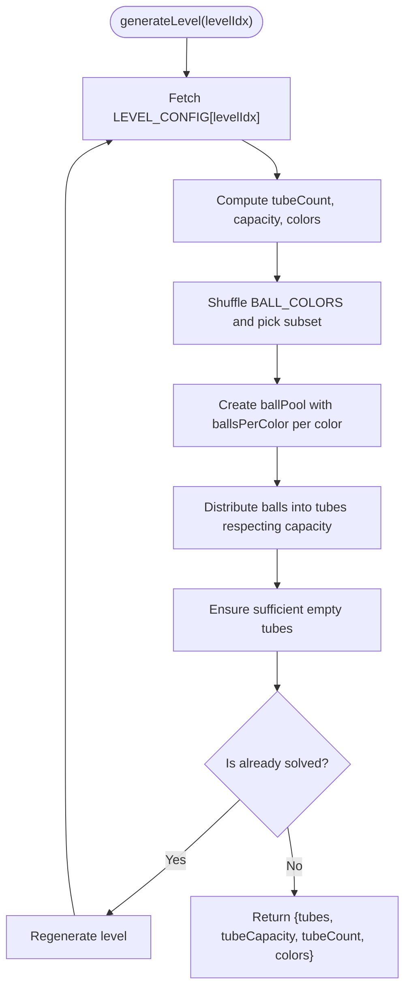
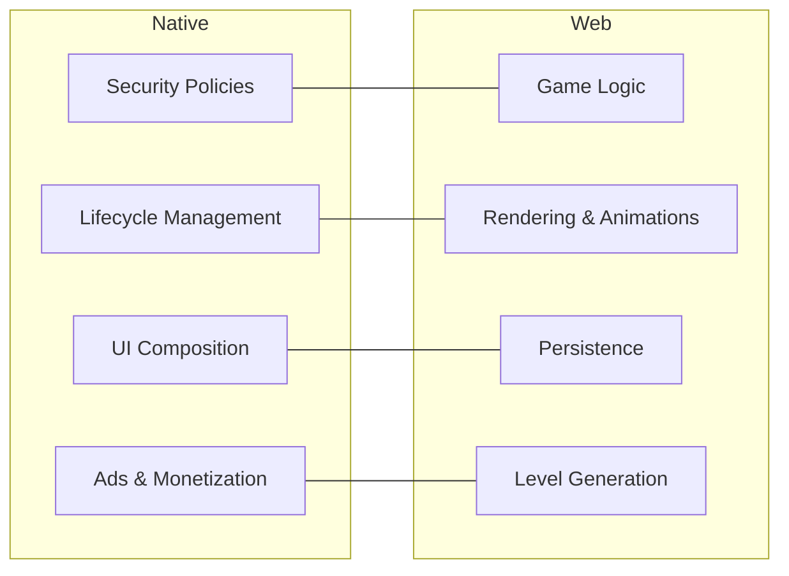
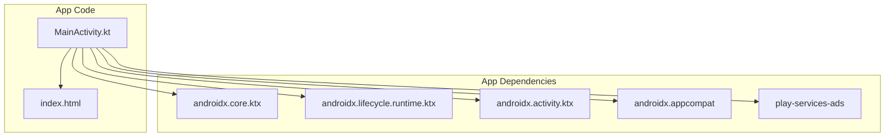

# Architecture Overview

<cite>
**Referenced Files in This Document**
- [MainActivity.kt](file://app/src/main/java/com/cktechhub/games/MainActivity.kt)
- [index.html](file://app/src/main/assets/index.html)
- [AndroidManifest.xml](file://app/src/main/AndroidManifest.xml)
- [build.gradle.kts](file://app/build.gradle.kts)
- [libs.versions.toml](file://gradle/libs.versions.toml)
- [strings.xml](file://app/src/main/res/values/strings.xml)
</cite>

## Table of Contents
1. [Introduction](#introduction)
2. [Project Structure](#project-structure)
3. [Core Components](#core-components)
4. [Architecture Overview](#architecture-overview)
5. [Detailed Component Analysis](#detailed-component-analysis)
6. [Dependency Analysis](#dependency-analysis)
7. [Performance Considerations](#performance-considerations)
8. [Security Considerations](#security-considerations)
9. [Troubleshooting Guide](#troubleshooting-guide)
10. [Conclusion](#conclusion)

## Introduction
This document describes the hybrid mobile application architecture for a ball-sort puzzle game. The application follows a clear separation of concerns:
- Native Android layer (MainActivity) controls lifecycle, UI composition, WebView hosting, and monetization.
- Web-based game engine (index.html) handles gameplay logic, rendering, animations, and persistence.

The architecture employs several design patterns:
- WebView Pattern for hosting the HTML/CSS/JS game inside a secure WebView.
- Bridge Pattern for JavaScript-to-Native communication via a JavaScript interface.
- Observer Pattern for game state notifications (e.g., level completion triggering ad events).
- Factory Pattern for level generation (dynamic creation of tube configurations and ball arrangements).

## Project Structure
The project is organized into Android app modules with a single activity hosting a WebView that loads the game from assets.

**Diagram sources**
- [AndroidManifest.xml:1-51](file://app/src/main/AndroidManifest.xml#L1-L51)
- [MainActivity.kt:1-441](file://app/src/main/java/com/cktechhub/games/MainActivity.kt#L1-L441)
- [index.html:1-1094](file://app/src/main/assets/index.html#L1-L1094)
- [strings.xml:1-6](file://app/src/main/res/values/strings.xml#L1-L6)
- [build.gradle.kts:1-43](file://app/build.gradle.kts#L1-L43)
- [libs.versions.toml:1-28](file://gradle/libs.versions.toml#L1-L28)

**Section sources**
- [AndroidManifest.xml:1-51](file://app/src/main/AndroidManifest.xml#L1-L51)
- [MainActivity.kt:66-135](file://app/src/main/java/com/cktechhub/games/MainActivity.kt#L66-L135)
- [index.html:1-1094](file://app/src/main/assets/index.html#L1-L1094)
- [build.gradle.kts:1-43](file://app/build.gradle.kts#L1-L43)
- [libs.versions.toml:1-28](file://gradle/libs.versions.toml#L1-L28)

## Core Components
- MainActivity: Android controller responsible for initializing the WebView, injecting the JavaScript bridge, enforcing safe navigation, managing ads, and handling lifecycle events.
- WebView: Secure host for the game, configured with strict security policies and JavaScript interface exposure.
- JavaScript Bridge: A native object exposed to the web layer enabling controlled communication (e.g., level completion triggers).
- Game Engine (index.html): Implements game logic, rendering, animations, persistence, and level generation.

Key architectural decisions:
- WebView Pattern: The game is packaged as assets and loaded locally for performance and offline readiness.
- Bridge Pattern: Controlled native-to-web communication via a dedicated JavaScript interface.
- Observer Pattern: The web layer notifies the native layer on significant events (e.g., level completion), which triggers ad logic.
- Factory Pattern: Level generation constructs tube configurations and ball arrangements dynamically based on predefined rules.

**Section sources**
- [MainActivity.kt:165-263](file://app/src/main/java/com/cktechhub/games/MainActivity.kt#L165-L263)
- [MainActivity.kt:428-440](file://app/src/main/java/com/cktechhub/games/MainActivity.kt#L428-L440)
- [index.html:321-544](file://app/src/main/assets/index.html#L321-L544)

## Architecture Overview
The system separates native and web responsibilities clearly:
- Native layer manages UI composition, security, ads, and device integrations.
- Web layer manages gameplay, rendering, and persistence.

**Diagram sources**
- [MainActivity.kt:165-263](file://app/src/main/java/com/cktechhub/games/MainActivity.kt#L165-L263)
- [MainActivity.kt:428-440](file://app/src/main/java/com/cktechhub/games/MainActivity.kt#L428-L440)
- [index.html:321-544](file://app/src/main/assets/index.html#L321-L544)

## Detailed Component Analysis

### WebView Pattern: Hosting the Game
- The game is loaded from local assets using a file URL scheme to ensure fast startup and offline availability.
- WebView settings enforce strict security policies:
  - JavaScript enabled for game logic.
  - DOM storage enabled for persistence.
  - Mixed content disabled to prevent insecure resource loading.
  - Safe navigation enforced via a WebViewClient that blocks external URLs except local assets.
- The page load lifecycle injects a JavaScript wrapper around the level-complete notification to trigger the native bridge.

**Diagram sources**
- [MainActivity.kt:131](file://app/src/main/java/com/cktechhub/games/MainActivity.kt#L131)
- [MainActivity.kt:209-229](file://app/src/main/java/com/cktechhub/games/MainActivity.kt#L209-L229)
- [MainActivity.kt:428-440](file://app/src/main/java/com/cktechhub/games/MainActivity.kt#L428-L440)

**Section sources**
- [MainActivity.kt:131](file://app/src/main/java/com/cktechhub/games/MainActivity.kt#L131)
- [MainActivity.kt:195-245](file://app/src/main/java/com/cktechhub/games/MainActivity.kt#L195-L245)

### Bridge Pattern: JavaScript Interface Communication
- A native object is exposed to the web layer under a specific interface name.
- The web layer invokes methods on this interface to notify the native layer of game events.
- The bridge encapsulates ad logic and maintains counters for event-driven monetization.

**Diagram sources**
- [MainActivity.kt:428-440](file://app/src/main/java/com/cktechhub/games/MainActivity.kt#L428-L440)
- [MainActivity.kt:165-263](file://app/src/main/java/com/cktechhub/games/MainActivity.kt#L165-L263)

**Section sources**
- [MainActivity.kt:192](file://app/src/main/java/com/cktechhub/games/MainActivity.kt#L192)
- [MainActivity.kt:214-228](file://app/src/main/java/com/cktechhub/games/MainActivity.kt#L214-L228)
- [MainActivity.kt:428-440](file://app/src/main/java/com/cktechhub/games/MainActivity.kt#L428-L440)

### Observer Pattern: Game State Notifications
- The web layer emits a level-complete signal when the player solves a level.
- The native layer intercepts this signal and reacts by incrementing a counter and conditionally showing an interstitial ad.
- This decouples the web layer’s game logic from the native ad logic.

**Diagram sources**
- [MainActivity.kt:431-438](file://app/src/main/java/com/cktechhub/games/MainActivity.kt#L431-L438)
- [index.html:853-881](file://app/src/main/assets/index.html#L853-L881)

**Section sources**
- [MainActivity.kt:431-438](file://app/src/main/java/com/cktechhub/games/MainActivity.kt#L431-L438)
- [index.html:853-881](file://app/src/main/assets/index.html#L853-L881)

### Factory Pattern: Level Generation
- The web layer defines level configurations and generates tube layouts and ball arrangements dynamically.
- The generator ensures valid puzzles by shuffling colors and distributing balls, adding empty tubes as needed, and avoiding pre-solved states.

**Diagram sources**
- [index.html:482-531](file://app/src/main/assets/index.html#L482-L531)

**Section sources**
- [index.html:325-341](file://app/src/main/assets/index.html#L325-L341)
- [index.html:482-531](file://app/src/main/assets/index.html#L482-L531)

### System Context: Separation of Concerns
- Native layer: Security, lifecycle, UI composition, ads, and device integrations.
- Web layer: Gameplay, rendering, animations, persistence, and level generation.

[No sources needed since this diagram shows conceptual workflow, not actual code structure]

## Dependency Analysis
- Android app module depends on AndroidX libraries and Google Play Services Ads.
- MainActivity depends on WebView APIs, AdMob SDK, and Android UI frameworks.
- The game engine depends on browser APIs (DOM, Canvas, LocalStorage) and Tailwind CSS CDN.

**Diagram sources**
- [build.gradle.kts:34-43](file://app/build.gradle.kts#L34-L43)
- [libs.versions.toml:13-21](file://gradle/libs.versions.toml#L13-L21)

**Section sources**
- [build.gradle.kts:34-43](file://app/build.gradle.kts#L34-L43)
- [libs.versions.toml:13-21](file://gradle/libs.versions.toml#L13-L21)

## Performance Considerations
- WebView caching and mixed content policy reduce network overhead and improve load times.
- Local asset loading eliminates remote dependencies for the game core.
- Rendering is handled by the browser engine; ensure animations and particle systems are toggled via settings to balance performance and UX.
- Memory management: The WebView lifecycle is explicitly managed in native code to prevent leaks during pause/resume and destruction.

[No sources needed since this section provides general guidance]

## Security Considerations
- Mixed content is disabled to prevent insecure resource loading.
- External URL navigation is blocked; only local assets are allowed.
- JavaScript interface exposure is scoped and minimal, reducing attack surface.
- Network permissions are declared for ad functionality; ensure runtime checks are performed before loading remote resources.

**Section sources**
- [MainActivity.kt:185](file://app/src/main/java/com/cktechhub/games/MainActivity.kt#L185)
- [MainActivity.kt:200-207](file://app/src/main/java/com/cktechhub/games/MainActivity.kt#L200-L207)
- [AndroidManifest.xml:5-8](file://app/src/main/AndroidManifest.xml#L5-L8)

## Troubleshooting Guide
- Offline mode: If no internet is available, the app displays an offline screen with a retry button.
- WebView crashes: The WebView client detects renderer process death and logs warnings; the app recovers by destroying and reloading the WebView.
- Ads not showing: Verify ad initialization and preloading logic; ensure the ad unit IDs are configured and the device has network connectivity.

**Section sources**
- [MainActivity.kt:296-364](file://app/src/main/java/com/cktechhub/games/MainActivity.kt#L296-L364)
- [MainActivity.kt:231-244](file://app/src/main/java/com/cktechhub/games/MainActivity.kt#L231-L244)
- [MainActivity.kt:370-409](file://app/src/main/java/com/cktechhub/games/MainActivity.kt#L370-L409)

## Conclusion
This hybrid architecture cleanly separates native and web responsibilities, leveraging the WebView Pattern for hosting, the Bridge Pattern for controlled communication, the Observer Pattern for event-driven behavior, and the Factory Pattern for dynamic level generation. The design balances performance, security, and maintainability while enabling monetization through native integrations.