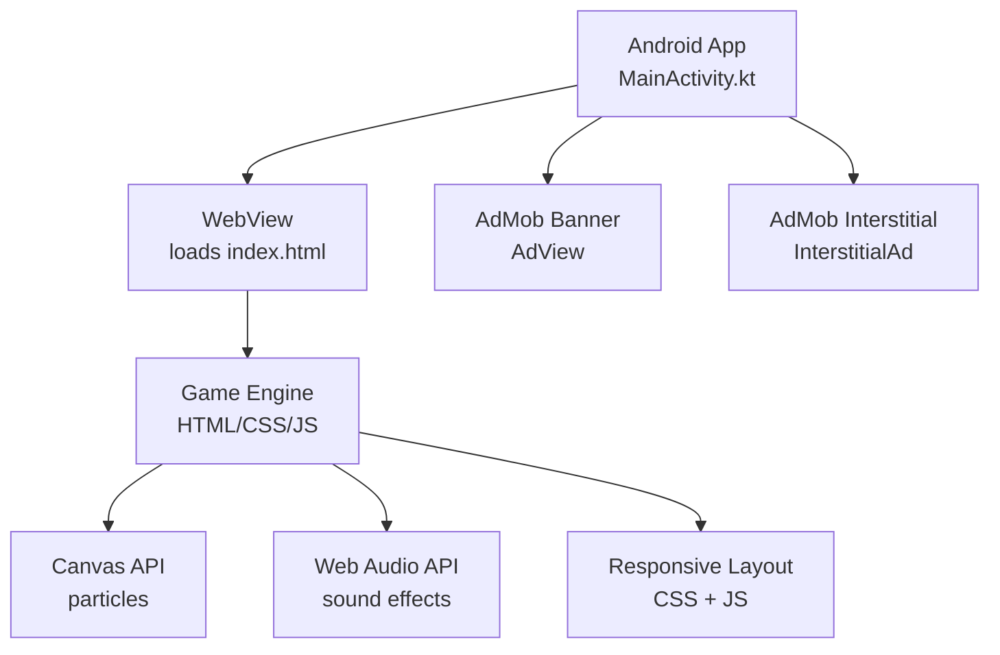
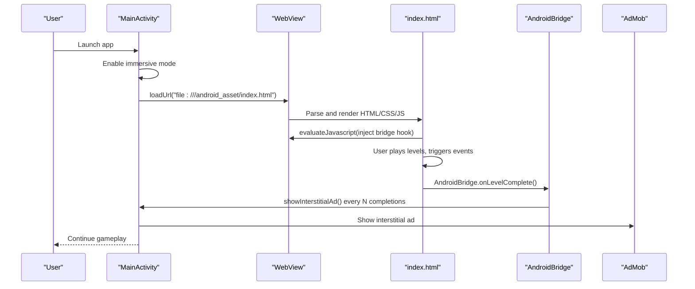
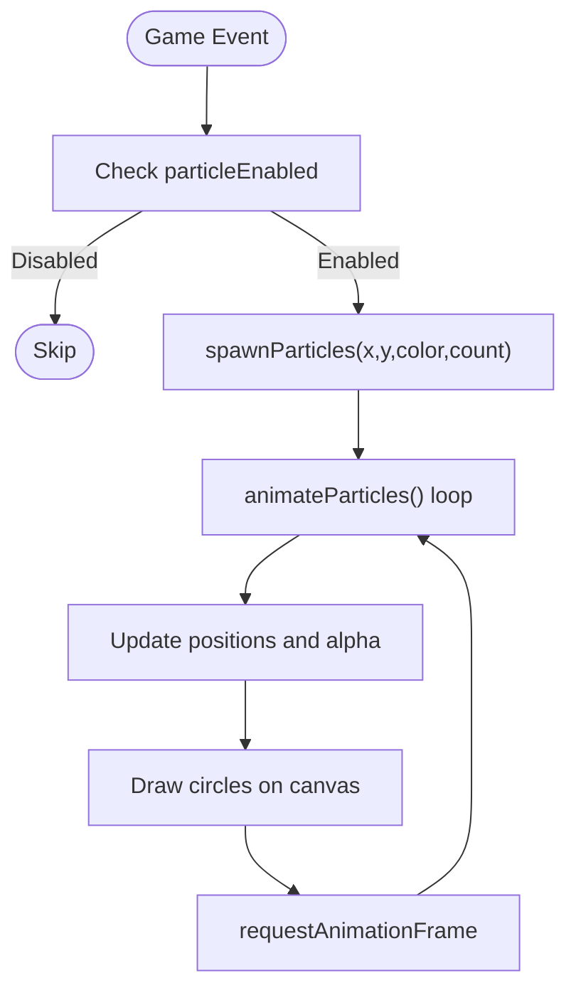
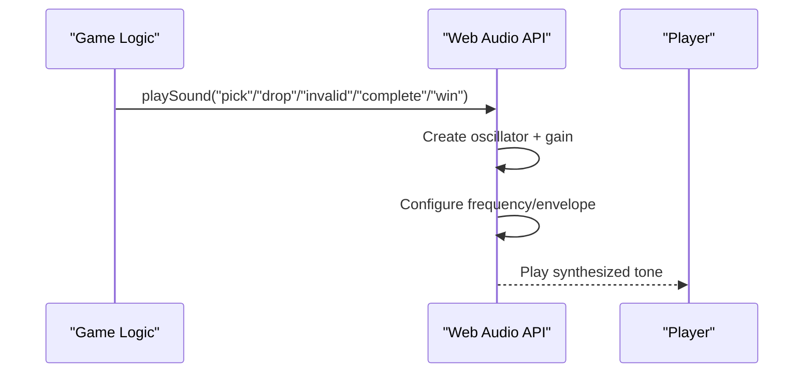
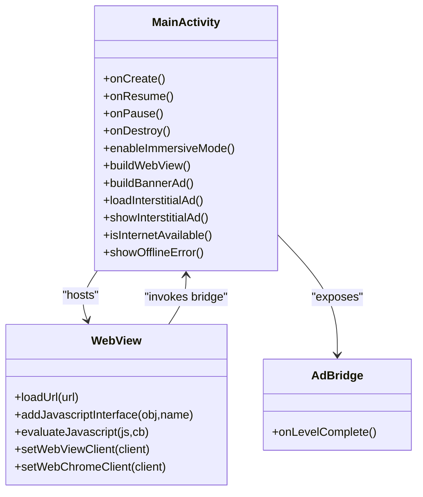
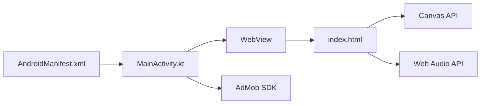

# Core Features

<cite>
**Referenced Files in This Document**
- [MainActivity.kt](file://app/src/main/java/com/cktechhub/games/MainActivity.kt)
- [index.html](file://app/src/main/assets/index.html)
- [AndroidManifest.xml](file://app/src/main/AndroidManifest.xml)
- [strings.xml](file://app/src/main/res/values/strings.xml)
</cite>

## Table of Contents
1. [Introduction](#introduction)
2. [Project Structure](#project-structure)
3. [Core Components](#core-components)
4. [Architecture Overview](#architecture-overview)
5. [Detailed Component Analysis](#detailed-component-analysis)
6. [Dependency Analysis](#dependency-analysis)
7. [Performance Considerations](#performance-considerations)
8. [Troubleshooting Guide](#troubleshooting-guide)
9. [Conclusion](#conclusion)

## Introduction
This document explains the core features of the Ball Sort Puzzle Android game, focusing on:
- 15 progressive difficulty levels with increasing complexity
- Real-time particle effects system using the HTML5 Canvas API
- Web Audio API-generated sound effects
- Immersive gaming experience with full-screen mode
- Responsive design adapting to various screen sizes
- WebView-based game hosting with a custom JavaScript bridge

It describes how each feature contributes to the user experience and how the hybrid architecture—combining native Android components with a web-based game engine—enhances gameplay.

## Project Structure
The app is structured as a minimal Android shell that hosts a self-contained HTML/CSS/JS game inside a WebView. Native Android handles immersive UI, ad integration, and lifecycle, while the game runs in the browser.

**Diagram sources**
- [MainActivity.kt:165-263](file://app/src/main/java/com/cktechhub/games/MainActivity.kt#L165-L263)
- [index.html:1-200](file://app/src/main/assets/index.html#L1-L200)

**Section sources**
- [MainActivity.kt:66-135](file://app/src/main/java/com/cktechhub/games/MainActivity.kt#L66-L135)
- [AndroidManifest.xml:30-41](file://app/src/main/AndroidManifest.xml#L30-L41)

## Core Components
- Hybrid hosting via WebView: The game is packaged as a static HTML page and loaded locally in the app.
- JavaScript bridge: A native interface exposes Android functionality to the game.
- Progressive levels: 15 configurations define increasing complexity.
- Particle effects: Canvas-based particle system with physics and blending.
- Sound effects: Web Audio API generates tones without external assets.
- Immersive UI: Full-screen mode hides system bars and keeps the screen on.
- Responsive layout: CSS and JS adapt to device size and orientation.

**Section sources**
- [MainActivity.kt:165-263](file://app/src/main/java/com/cktechhub/games/MainActivity.kt#L165-L263)
- [index.html:324-341](file://app/src/main/assets/index.html#L324-L341)
- [index.html:423-469](file://app/src/main/assets/index.html#L423-L469)
- [index.html:379-421](file://app/src/main/assets/index.html#L379-L421)
- [MainActivity.kt:415-422](file://app/src/main/java/com/cktechhub/games/MainActivity.kt#L415-L422)
- [index.html:1055-1064](file://app/src/main/assets/index.html#L1055-L1064)

## Architecture Overview
The app uses a hybrid architecture:
- Native Android manages immersive UI, ads, and lifecycle.
- WebView loads the game’s HTML/CSS/JS and injects a bridge to trigger native events.
- The game engine controls rendering, gameplay, and user interactions.

**Diagram sources**
- [MainActivity.kt:130-135](file://app/src/main/java/com/cktechhub/games/MainActivity.kt#L130-L135)
- [MainActivity.kt:214-229](file://app/src/main/java/com/cktechhub/games/MainActivity.kt#L214-L229)
- [MainActivity.kt:428-439](file://app/src/main/java/com/cktechhub/games/MainActivity.kt#L428-L439)
- [MainActivity.kt:402-409](file://app/src/main/java/com/cktechhub/games/MainActivity.kt#L402-L409)

## Detailed Component Analysis

### 15 Progressive Difficulty Levels
- Levels are defined by a configuration array specifying tubes, colors, and balls per color.
- As the player progresses, the number of tubes, colors, and balls increases, raising complexity.
- The game enforces a minimum number of empty tubes to ensure solvability and introduces edge cases (e.g., forcing an extra empty tube when needed).
- The UI tracks progress across all 15 levels and persists the highest level reached.

Practical example:
- Level 1: 3 tubes, 2 colors, 3 balls per color
- Level 15: 8 tubes, 8 colors, 8 balls per color

How it contributes to UX:
- Provides a clear learning curve and long-term engagement.
- Encourages persistence and mastery of mechanics.

Technical implementation highlights:
- Level configuration and generation logic
- Progress tracking and persistence
- Win detection and scoring

**Section sources**
- [index.html:324-341](file://app/src/main/assets/index.html#L324-L341)
- [index.html:482-531](file://app/src/main/assets/index.html#L482-L531)
- [index.html:853-881](file://app/src/main/assets/index.html#L853-L881)
- [index.html:908-935](file://app/src/main/assets/index.html#L908-L935)
- [index.html:1002-1015](file://app/src/main/assets/index.html#L1002-L1015)

### Real-Time Particle Effects System (Canvas API)
- A full-screen canvas renders floating particles with physics (gravity, decay).
- Particles spawn on interactions (e.g., tube drops) and on level completion.
- The system respects user settings to disable particles when desired.

How it contributes to UX:
- Adds visual polish and feedback during gameplay.
- Enhances the celebratory feel on level completion.

Technical implementation highlights:
- Canvas sizing and resize handling
- Particle creation, update loop, and cleanup
- Animation loop using requestAnimationFrame

**Diagram sources**
- [index.html:423-469](file://app/src/main/assets/index.html#L423-L469)

**Section sources**
- [index.html:423-469](file://app/src/main/assets/index.html#L423-L469)

### Web Audio API Sound Effects
- Generates short synthesized sounds for pick/drop/invalid actions and level completion/win.
- Uses oscillators and gain envelopes to produce distinct tones.
- Respects user settings to disable sound.

How it contributes to UX:
- Reinforces feedback for actions and milestones.
- Keeps audio lightweight and offline-friendly.

Technical implementation highlights:
- Audio context creation and reuse
- Oscillator/gain nodes for each effect
- Settings persistence and toggling

**Diagram sources**
- [index.html:379-421](file://app/src/main/assets/index.html#L379-L421)

**Section sources**
- [index.html:379-421](file://app/src/main/assets/index.html#L379-L421)

### Immersive Gaming Experience (Full-Screen Mode)
- The app keeps the screen on and hides system bars for uninterrupted gameplay.
- Uses modern window insets APIs to achieve immersive behavior.

How it contributes to UX:
- Reduces distractions and enhances focus.
- Improves the “game-like” feel.

Technical implementation highlights:
- Window flags and insets controller
- Behavior to swipe-show transient bars

**Section sources**
- [MainActivity.kt:415-422](file://app/src/main/java/com/cktechhub/games/MainActivity.kt#L415-L422)

### Responsive Design (Adapting to Various Screen Sizes)
- CSS defines flexible layouts and gradients.
- JavaScript calculates tube dimensions and spacing based on viewport and content.
- A debounced resize handler re-renders tubes on orientation change or device rotation.

How it contributes to UX:
- Ensures consistent gameplay across phones, tablets, and orientations.

Technical implementation highlights:
- CSS flex/grid and viewport meta tag
- Dynamic tube sizing and gap calculation
- Debounced resize handling

**Section sources**
- [index.html:1055-1064](file://app/src/main/assets/index.html#L1055-L1064)
- [index.html:548-576](file://app/src/main/assets/index.html#L548-L576)

### WebView-Based Game Hosting with Custom JavaScript Bridge
- The app loads the game from local assets and injects a bridge to receive level-complete events.
- The bridge triggers interstitial ads at configured intervals.
- WebView settings enable DOM storage, file access, and disables zoom for stability.

How it contributes to UX:
- Enables rapid iteration on the game logic while leveraging native infrastructure (ads, lifecycle).
- Keeps the game portable and easy to update.

Technical implementation highlights:
- Local asset loading and URL override
- JavaScript injection to hook completion
- Native bridge interface and interstitial scheduling

**Diagram sources**
- [MainActivity.kt:165-263](file://app/src/main/java/com/cktechhub/games/MainActivity.kt#L165-L263)
- [MainActivity.kt:428-439](file://app/src/main/java/com/cktechhub/games/MainActivity.kt#L428-L439)

**Section sources**
- [MainActivity.kt:165-263](file://app/src/main/java/com/cktechhub/games/MainActivity.kt#L165-L263)
- [MainActivity.kt:214-229](file://app/src/main/java/com/cktechhub/games/MainActivity.kt#L214-L229)
- [MainActivity.kt:428-439](file://app/src/main/java/com/cktechhub/games/MainActivity.kt#L428-L439)

## Dependency Analysis
- Android permissions and metadata enable internet access and AdMob initialization.
- MainActivity depends on WebView for hosting and AdMob SDK for advertising.
- The game engine depends on Canvas and Web Audio APIs for visuals and audio.
- The bridge couples the game to native ad behavior.

**Diagram sources**
- [AndroidManifest.xml:5-8](file://app/src/main/AndroidManifest.xml#L5-L8)
- [AndroidManifest.xml:20-28](file://app/src/main/AndroidManifest.xml#L20-L28)
- [MainActivity.kt:165-263](file://app/src/main/java/com/cktechhub/games/MainActivity.kt#L165-L263)
- [index.html:423-469](file://app/src/main/assets/index.html#L423-L469)
- [index.html:379-421](file://app/src/main/assets/index.html#L379-L421)

**Section sources**
- [AndroidManifest.xml:5-8](file://app/src/main/AndroidManifest.xml#L5-L8)
- [AndroidManifest.xml:20-28](file://app/src/main/AndroidManifest.xml#L20-L28)
- [MainActivity.kt:165-263](file://app/src/main/java/com/cktechhub/games/MainActivity.kt#L165-L263)

## Performance Considerations
- Particle system: Keep particle counts reasonable; disable particles when performance-sensitive.
- Web Audio: Reuse a single audio context; avoid creating oscillators per event.
- WebView: Keep JavaScript minimal; avoid heavy DOM manipulation on every frame.
- Responsive rendering: Debounce resize handlers to prevent excessive reflows.
- Ads: Preload interstitials to reduce latency; handle failures gracefully.

## Troubleshooting Guide
- No internet connection: The app displays an offline screen with retry.
- WebView crashes: The client handles renderer gone events and reloads the page.
- Ads not showing: Verify AdMob IDs and initialization metadata; ensure network availability.
- Immersive mode not hiding bars: Confirm insets controller usage and flags.

**Section sources**
- [MainActivity.kt:296-364](file://app/src/main/java/com/cktechhub/games/MainActivity.kt#L296-L364)
- [MainActivity.kt:231-245](file://app/src/main/java/com/cktechhub/games/MainActivity.kt#L231-L245)
- [AndroidManifest.xml:20-28](file://app/src/main/AndroidManifest.xml#L20-L28)
- [MainActivity.kt:415-422](file://app/src/main/java/com/cktechhub/games/MainActivity.kt#L415-L422)

## Conclusion
The Ball Sort Puzzle app combines a polished web-based game engine with robust native Android infrastructure. The hybrid architecture delivers:
- A smooth, immersive experience through full-screen mode and responsive design
- Rich feedback via Canvas particle effects and Web Audio
- Scalable monetization with AdMob integration
- A clear, engaging progression path across 15 levels

Together, these features create a cohesive, cross-platform-ready solution that balances developer productivity with strong user experience.