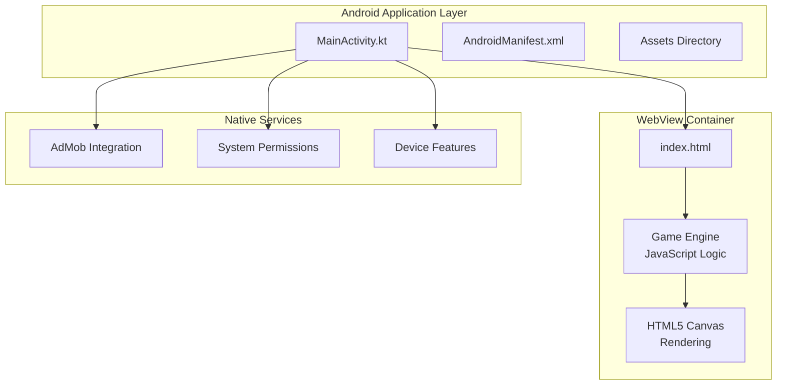
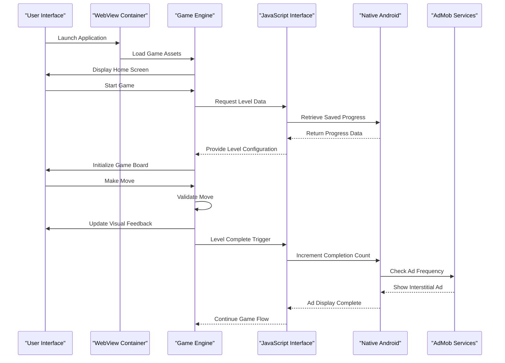
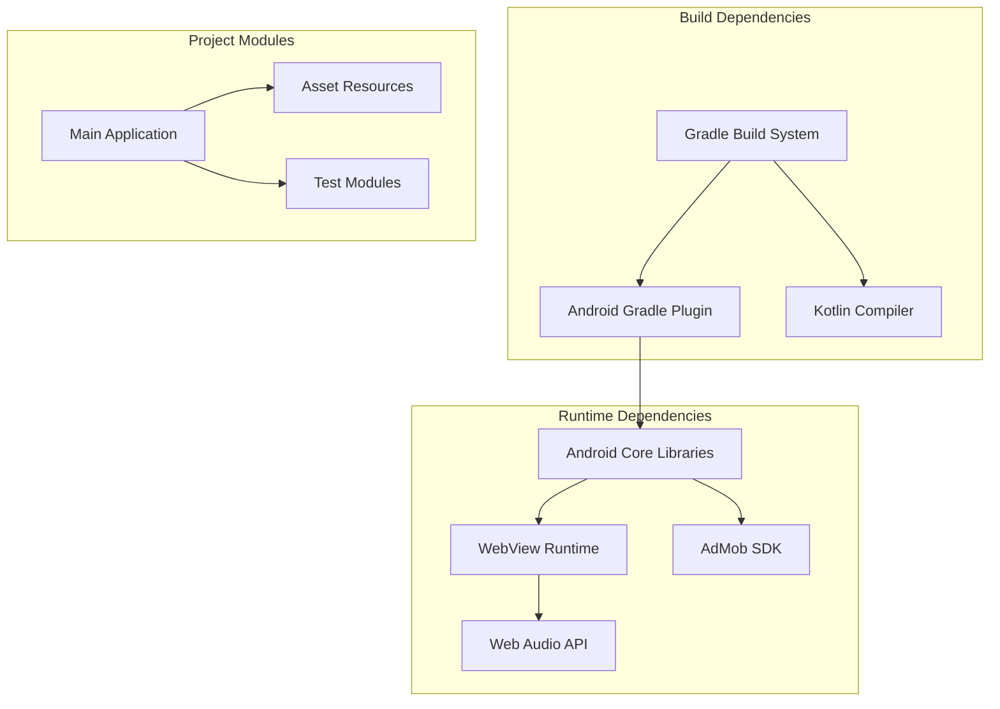

# Introduction

<cite>
**Referenced Files in This Document**
- [MainActivity.kt](file://app/src/main/java/com/cktechhub/games/MainActivity.kt)
- [index.html](file://app/src/main/assets/index.html)
- [AndroidManifest.xml](file://app/src/main/AndroidManifest.xml)
- [ADMOB_SETUP.md](file://ADMOB_SETUP.md)
- [libs.versions.toml](file://gradle/libs.versions.toml)
- [settings.gradle.kts](file://settings.gradle.kts)
</cite>

## Table of Contents
1. [Introduction](#introduction)
2. [Project Structure](#project-structure)
3. [Core Components](#core-components)
4. [Architecture Overview](#architecture-overview)
5. [Detailed Component Analysis](#detailed-component-analysis)
6. [Dependency Analysis](#dependency-analysis)
7. [Performance Considerations](#performance-considerations)
8. [Troubleshooting Guide](#troubleshooting-guide)
9. [Conclusion](#conclusion)

## Introduction

The Ball Sort Puzzle Android game project represents a sophisticated hybrid mobile application architecture that seamlessly blends native Android development with embedded web technologies. This innovative approach leverages a WebView container to host an HTML5/JavaScript game engine, creating a powerful yet flexible foundation for mobile gaming development.

### Purpose and Vision

The primary objective of this hybrid architecture is to demonstrate how modern mobile applications can benefit from the separation of concerns between native Android components and web-based game logic. By isolating the game engine within a WebView container, the project achieves several strategic advantages:

- **Development Flexibility**: JavaScript-based game logic allows rapid iteration and experimentation
- **Platform Independence**: The same game engine can potentially support multiple platforms
- **Native Integration**: Kotlin-based Android components handle platform-specific features
- **Performance Optimization**: Native components manage resource-intensive operations

### Hybrid Approach Benefits

The hybrid architecture provides a compelling solution for mobile game development by combining the strengths of both ecosystems:

**For Beginners:**
- Simplified game logic development using familiar web technologies
- Rapid prototyping capabilities with immediate feedback loops
- Reduced learning curve for game mechanics implementation
- Access to extensive JavaScript libraries and frameworks

**For Experienced Developers:**
- Clear separation of concerns between presentation, business logic, and platform integration
- Optimized performance through native component management
- Advanced monetization capabilities through integrated advertising SDKs
- Enhanced user experience through native UI controls and system integration

### Core Architecture Concepts

The application follows a well-defined separation of concerns model where the WebView container serves as the primary host for the HTML5/JavaScript game engine. This container manages the game's visual presentation, user interactions, and core gameplay mechanics while maintaining seamless communication with native Android components through a JavaScript interface bridge.

The JavaScript interface enables bidirectional communication between the web-based game engine and native Android services, facilitating features like advertising integration, user progress tracking, and system-level functionality. This bridge acts as a communication layer that preserves the isolation of game logic while enabling access to native capabilities.

## Project Structure

The project follows a clean, modular structure that reflects the hybrid architecture approach:

**Diagram sources**
- [MainActivity.kt:66-135](file://app/src/main/java/com/cktechhub/games/MainActivity.kt#L66-L135)
- [AndroidManifest.xml:30-41](file://app/src/main/AndroidManifest.xml#L30-L41)

The structure demonstrates a clear separation between the native Android entry point and the web-based game engine, with the WebView serving as the central coordination point for both layers.

**Section sources**
- [MainActivity.kt:165-263](file://app/src/main/java/com/cktechhub/games/MainActivity.kt#L165-L263)
- [AndroidManifest.xml:1-51](file://app/src/main/AndroidManifest.xml#L1-L51)

## Core Components

### WebView Container Implementation

The WebView container serves as the foundational element of this hybrid architecture, providing a secure and feature-rich environment for the HTML5/JavaScript game engine. The implementation includes comprehensive configuration for optimal performance and security:

**Security Configuration:**
- Strict Content Security Policy enforcement
- Mixed content policy management
- File access restrictions to prevent unauthorized resource loading
- JavaScript interface registration for controlled native communication

**Performance Optimization:**
- Hardware acceleration enablement
- Memory management settings for resource conservation
- Rendering optimization configurations
- Cache management for improved load times

**User Experience Features:**
- Immersive full-screen mode activation
- Responsive design support for various screen sizes
- Touch event handling optimization
- Back button navigation management

### JavaScript Interface Bridge

The JavaScript interface bridge represents the critical communication pathway between the native Android layer and the web-based game engine. This bridge enables seamless interaction between the two environments:

**Communication Mechanisms:**
- Bidirectional message passing between native and web layers
- Event-driven architecture for asynchronous operations
- Callback system for native service responses
- Error handling and recovery mechanisms

**Integration Capabilities:**
- Advertising trigger notifications
- User progress synchronization
- Device capability detection
- System-level feature access

### Game Engine Architecture

The embedded HTML5/JavaScript game engine provides a complete puzzle-solving experience with sophisticated rendering and interaction systems:

**Core Game Systems:**
- Level generation algorithms with configurable parameters
- Physics simulation for ball movement and collision
- Animation system for smooth visual transitions
- Audio synthesis for sound effects without external resources

**User Interface Components:**
- Responsive layout system for various screen sizes
- Touch gesture recognition and handling
- Visual feedback systems for user interactions
- Progress tracking and statistics display

**Persistence and State Management:**
- Local storage integration for progress saving
- Configuration management for game settings
- State serialization for game continuity
- Cross-session data persistence

**Section sources**
- [MainActivity.kt:191-245](file://app/src/main/java/com/cktechhub/games/MainActivity.kt#L191-L245)
- [MainActivity.kt:428-440](file://app/src/main/java/com/cktechhub/games/MainActivity.kt#L428-L440)
- [index.html:321-421](file://app/src/main/assets/index.html#L321-L421)

## Architecture Overview

The hybrid architecture establishes a clear separation between native Android components and web-based game logic, creating a robust foundation for mobile game development:

**Diagram sources**
- [MainActivity.kt:130-135](file://app/src/main/java/com/cktechhub/games/MainActivity.kt#L130-L135)
- [MainActivity.kt:430-438](file://app/src/main/java/com/cktechhub/games/MainActivity.kt#L430-L438)
- [index.html:853-881](file://app/src/main/assets/index.html#L853-L881)

This architecture demonstrates the practical advantages of the hybrid approach:

**Benefits for Mobile Game Development:**
- **Rapid Prototyping**: JavaScript-based game logic enables quick iteration and testing
- **Cross-Platform Potential**: The same game engine can potentially support multiple platforms
- **Performance Optimization**: Native components handle resource-intensive operations efficiently
- **Monetization Integration**: Seamless advertising integration through native services
- **User Experience Enhancement**: Native UI controls and system integration for superior UX

**Technical Advantages:**
- **Separation of Concerns**: Clear boundaries between presentation, business logic, and platform integration
- **Maintainability**: Isolated game logic simplifies updates and bug fixes
- **Scalability**: Modular architecture supports future feature additions
- **Testing Flexibility**: Independent testing of native and web components

## Detailed Component Analysis

### MainActivity Implementation

The MainActivity serves as the primary coordinator for the hybrid architecture, managing the WebView container and native Android services:

**Lifecycle Management:**
- Comprehensive lifecycle handling for optimal resource management
- Immersive mode activation for enhanced user experience
- Network connectivity monitoring for offline scenarios
- AdMob SDK initialization and management

**Layout Construction:**
- Dynamic layout building with LinearLayout and FrameLayout
- WebView container configuration with proper sizing
- Loading indicator overlay for improved user feedback
- Banner ad placement at the bottom of the screen

**Security and Performance:**
- Strict WebView security policies implementation
- JavaScript interface registration with @JavascriptInterface annotation
- Memory management through proper lifecycle callbacks
- Performance optimization through hardware acceleration

### WebView Configuration Details

The WebView configuration demonstrates advanced security and performance considerations:

**Security Settings:**
- Mixed content policy set to NEVER_ALLOW for HTTPS compliance
- DOM storage enabled for game state persistence
- File access restrictions to prevent unauthorized resource loading
- JavaScript interface registration with explicit security boundaries

**Performance Optimizations:**
- Hardware acceleration enablement for smooth animations
- Cache management for improved load times
- Memory optimization through proper resource cleanup
- Rendering optimization for touch interactions

**Navigation Control:**
- Custom WebViewClient implementation for safe navigation
- URL filtering to prevent external resource loading
- Render process monitoring for crash recovery
- Back button handling for proper navigation flow

### JavaScript Interface Implementation

The JavaScript interface bridge provides controlled communication between native and web layers:

**Bridge Design:**
- Inner class implementation with @JavascriptInterface annotation
- Method exposure control through explicit interface definition
- Thread-safe operation through Android UI thread management
- Error handling and logging for debugging support

**Communication Patterns:**
- Event-driven architecture for asynchronous operations
- Callback mechanism for native service responses
- Parameter validation and type safety
- Graceful degradation for unsupported operations

### Game Engine Architecture

The embedded HTML5/JavaScript game engine provides comprehensive puzzle-solving functionality:

**Game Logic Systems:**
- Level generation algorithms with configurable difficulty parameters
- Physics simulation for realistic ball movement and collision detection
- Animation system with CSS transitions and JavaScript timing
- Audio synthesis using Web Audio API for sound effects

**User Interaction Handling:**
- Touch event delegation for mobile device compatibility
- Gesture recognition for swipe and tap interactions
- Visual feedback systems for user actions
- Responsive design for various screen orientations

**State Management:**
- Local storage integration for progress persistence
- Configuration management through localStorage
- State serialization for cross-session continuity
- Error recovery mechanisms for unexpected conditions

**Section sources**
- [MainActivity.kt:42-154](file://app/src/main/java/com/cktechhub/games/MainActivity.kt#L42-L154)
- [MainActivity.kt:165-263](file://app/src/main/java/com/cktechhub/games/MainActivity.kt#L165-L263)
- [index.html:321-1094](file://app/src/main/assets/index.html#L321-L1094)

## Dependency Analysis

The project demonstrates a well-structured dependency hierarchy that supports the hybrid architecture:

**Diagram sources**
- [settings.gradle.kts:1-27](file://settings.gradle.kts#L1-L27)
- [libs.versions.toml:13-21](file://gradle/libs.versions.toml#L13-L21)

The dependency structure supports the hybrid approach by providing:

**Native Dependencies:**
- Android framework integration for system-level functionality
- WebView runtime for HTML5/JavaScript execution
- AdMob SDK for monetization capabilities
- Core KTX extensions for Kotlin interoperability

**Web Dependencies:**
- TailwindCSS for responsive styling
- Web Audio API for sound synthesis
- Canvas API for graphics rendering
- LocalStorage for data persistence

**Build System Dependencies:**
- Android Gradle Plugin for APK generation
- Kotlin compiler for native code compilation
- Version catalogs for dependency management
- Gradle toolchain resolution for build consistency

**Section sources**
- [settings.gradle.kts:17-27](file://settings.gradle.kts#L17-L27)
- [libs.versions.toml:1-28](file://gradle/libs.versions.toml#L1-L28)

## Performance Considerations

The hybrid architecture incorporates several performance optimization strategies:

**Memory Management:**
- Proper WebView lifecycle management to prevent memory leaks
- Resource cleanup during onPause/onDestroy callbacks
- Efficient garbage collection through proper object disposal
- Memory monitoring for low-memory device compatibility

**Rendering Optimization:**
- Hardware acceleration enablement for smooth animations
- Canvas optimization for particle systems and graphics
- CSS transition optimization for UI animations
- Touch event debouncing for responsive interactions

**Network Performance:**
- Asset bundling to minimize network requests
- Cache management for improved load times
- Offline capability implementation for connectivity issues
- Progressive loading for large asset files

**Battery Optimization:**
- Screen wake lock management for continuous gameplay
- Background processing limitations for battery conservation
- Efficient timer management for minimal CPU usage
- Adaptive rendering for power-sensitive devices

## Troubleshooting Guide

Common issues and solutions for the hybrid architecture:

**WebView Issues:**
- Render process crashes: Automatic recovery through onRenderProcessGone callback
- JavaScript errors: Console logging through WebChromeClient implementation
- Memory leaks: Proper WebView destruction in onDestroy lifecycle
- Security violations: Strict Content Security Policy enforcement

**Native Integration Problems:**
- JavaScript interface not working: Verify @JavascriptInterface annotation presence
- AdMob integration failures: Check AdMob IDs and network connectivity
- Permission issues: Review AndroidManifest.xml permissions configuration
- Back button conflicts: Custom onBackPressed handling implementation

**Performance Troubleshooting:**
- Slow loading times: Optimize asset bundling and caching strategies
- Memory pressure: Monitor WebView memory usage and implement cleanup
- Animation stuttering: Hardware acceleration verification and optimization
- Battery drain: Power-efficient rendering and timer management

**Section sources**
- [MainActivity.kt:231-244](file://app/src/main/java/com/cktechhub/games/MainActivity.kt#L231-L244)
- [MainActivity.kt:296-302](file://app/src/main/java/com/cktechhub/games/MainActivity.kt#L296-L302)
- [ADMOB_SETUP.md:96-104](file://ADMOB_SETUP.md#L96-L104)

## Conclusion

The Ball Sort Puzzle Android game project exemplifies the successful implementation of a hybrid mobile application architecture that effectively combines native Android development with embedded web technologies. This approach demonstrates how modern mobile applications can leverage the strengths of both ecosystems to create compelling user experiences.

The hybrid architecture provides a robust foundation for mobile game development by establishing clear separation of concerns between native Android components and web-based game logic. The WebView container serves as an effective host for the HTML5/JavaScript game engine while maintaining seamless communication through a carefully designed JavaScript interface bridge.

**Key Achievements:**
- Demonstrated successful integration of native and web technologies
- Implemented comprehensive security measures for WebView container
- Created efficient communication pathways between native and web layers
- Developed scalable architecture supporting future feature expansion
- Established performance optimization strategies for mobile environments

**Practical Applications:**
- Rapid prototyping and iterative development cycles
- Cross-platform development potential through web-based game engines
- Advanced monetization capabilities through native advertising integration
- Enhanced user experience through native UI controls and system integration
- Maintained codebase organization through clear separation of concerns

This project serves as a comprehensive example of how hybrid mobile application development can deliver both technical excellence and user satisfaction, providing valuable insights for developers considering similar architectural approaches in their own mobile game projects.