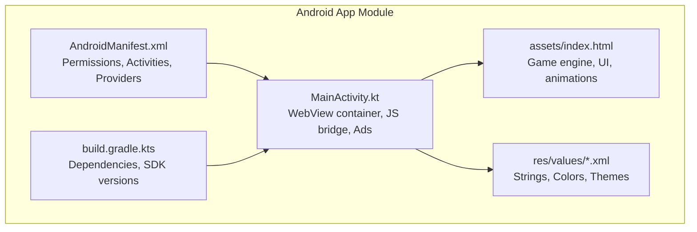
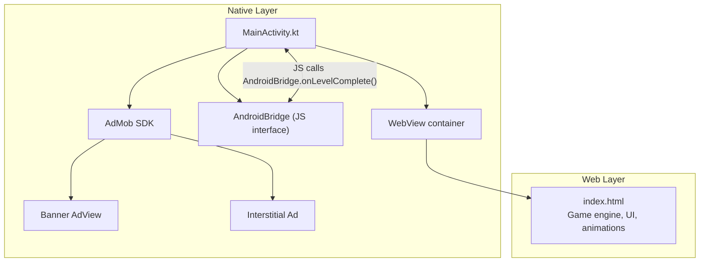
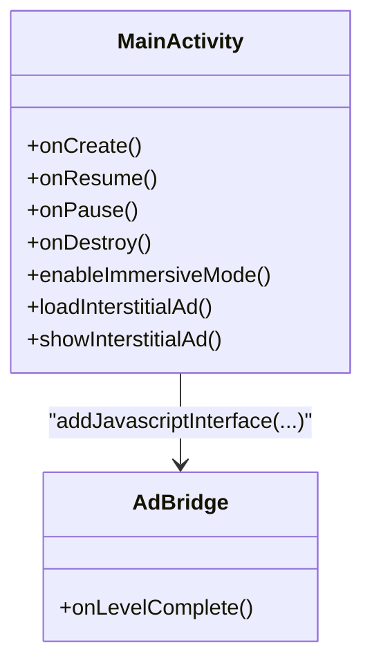
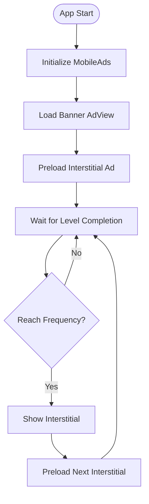
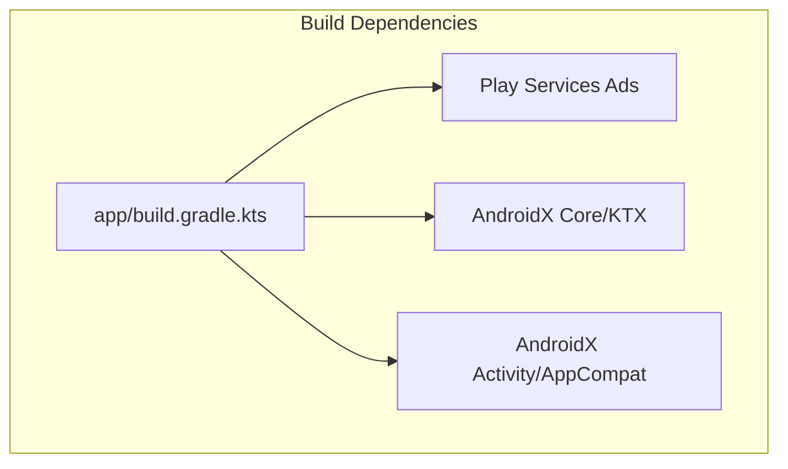

# Project Overview

<cite>
**Referenced Files in This Document**
- [MainActivity.kt](file://app/src/main/java/com/cktechhub/games/MainActivity.kt)
- [index.html](file://app/src/main/assets/index.html)
- [AndroidManifest.xml](file://app/src/main/AndroidManifest.xml)
- [ADMOB_SETUP.md](file://ADMOB_SETUP.md)
- [app/build.gradle.kts](file://app/build.gradle.kts)
- [settings.gradle.kts](file://settings.gradle.kts)
- [strings.xml](file://app/src/main/res/values/strings.xml)
- [colors.xml](file://app/src/main/res/values/colors.xml)
- [themes.xml](file://app/src/main/res/values/themes.xml)
</cite>

## Table of Contents
1. [Introduction](#introduction)
2. [Project Structure](#project-structure)
3. [Core Components](#core-components)
4. [Architecture Overview](#architecture-overview)
5. [Detailed Component Analysis](#detailed-component-analysis)
6. [Dependency Analysis](#dependency-analysis)
7. [Performance Considerations](#performance-considerations)
8. [Troubleshooting Guide](#troubleshooting-guide)
9. [Conclusion](#conclusion)

## Introduction
This document provides a comprehensive overview of the Ball Sort Puzzle Android game project. It is a hybrid mobile application that combines native Android development with embedded web technologies. The native Android layer hosts the game inside a WebView container and manages system-level features such as immersive UI, offline checks, and AdMob integration. The game engine and UI are implemented in HTML, CSS, and JavaScript within the WebView, enabling rapid iteration and cross-platform compatibility for the gameplay logic.

Key goals of the hybrid approach:
- Rapid prototyping and iteration of the game engine and UI using web technologies.
- Consistent rendering and animations across devices through a modern browser engine.
- Native control over system UX (immersive mode, back navigation) and monetization (AdMob).
- Clear separation of concerns: the native layer handles OS integration and ads; the web layer handles game logic, rendering, and user interactions.

## Project Structure
The project follows a conventional Android module layout with a single app module. The game assets are bundled as a static HTML page under the app’s assets folder. The native entry point is MainActivity, which builds the UI, initializes WebView, loads the game, and integrates AdMob.

**Diagram sources**
- [AndroidManifest.xml:1-51](file://app/src/main/AndroidManifest.xml#L1-L51)
- [MainActivity.kt:1-441](file://app/src/main/java/com/cktechhub/games/MainActivity.kt#L1-L441)
- [index.html:1-1094](file://app/src/main/assets/index.html#L1-L1094)
- [app/build.gradle.kts:1-43](file://app/build.gradle.kts#L1-L43)
- [strings.xml:1-6](file://app/src/main/res/values/strings.xml#L1-L6)
- [colors.xml:1-10](file://app/src/main/res/values/colors.xml#L1-L10)
- [themes.xml:1-10](file://app/src/main/res/values/themes.xml#L1-L10)

**Section sources**
- [AndroidManifest.xml:1-51](file://app/src/main/AndroidManifest.xml#L1-L51)
- [MainActivity.kt:1-441](file://app/src/main/java/com/cktechhub/games/MainActivity.kt#L1-L441)
- [index.html:1-1094](file://app/src/main/assets/index.html#L1-L1094)
- [app/build.gradle.kts:1-43](file://app/build.gradle.kts#L1-L43)
- [settings.gradle.kts:1-27](file://settings.gradle.kts#L1-L27)
- [strings.xml:1-6](file://app/src/main/res/values/strings.xml#L1-L6)
- [colors.xml:1-10](file://app/src/main/res/values/colors.xml#L1-L10)
- [themes.xml:1-10](file://app/src/main/res/values/themes.xml#L1-L10)

## Core Components
- WebView container: A configured WebView that loads the game from the app’s assets and enforces safe navigation and immersive behavior.
- JavaScript interface (AndroidBridge): A Kotlin class exposed to JavaScript that enables the game to trigger native actions (e.g., showing interstitial ads on level completion).
- AdMob integration: Native banner and interstitial ad support initialized via the MobileAds SDK and managed through Activity lifecycle hooks.
- Game engine (index.html): A self-contained HTML/CSS/JS implementation of the Ball Sort Puzzle logic, UI screens, animations, and settings.

Public interfaces and responsibilities:
- MainActivity
  - onCreate: Initializes immersive UI, internet availability check, AdMob SDK, WebView, loading indicator, banner ad, and loads the game URL.
  - Lifecycle callbacks: onResume, onPause, onDestroy manage WebView and ad lifecycle.
  - Back navigation: Delegates to WebView when possible; otherwise exits.
  - AdMob: Loads and shows interstitial ads; preloads for smooth UX.
  - JavaScript bridge: Exposes AdBridge with a @JavascriptInterface method invoked by the game.
- WebView container
  - Settings: Enables JavaScript, DOM storage, file access, mixed content policy, and zoom controls.
  - Clients: WebViewClient overrides URL loading and handles page finished; WebChromeClient logs console messages.
  - Injection: Evaluates JavaScript to hook into the game’s level-complete callback and notify Android.
- AdMob integration
  - Banner ad: Bottom-aligned AdView with a fixed size.
  - Interstitial: Preloaded and shown based on level completion frequency.
  - Initialization: MobileAds SDK initialized with application ID from manifest metadata.

**Section sources**
- [MainActivity.kt:66-154](file://app/src/main/java/com/cktechhub/games/MainActivity.kt#L66-L154)
- [MainActivity.kt:165-263](file://app/src/main/java/com/cktechhub/games/MainActivity.kt#L165-L263)
- [MainActivity.kt:265-290](file://app/src/main/java/com/cktechhub/games/MainActivity.kt#L265-L290)
- [MainActivity.kt:370-409](file://app/src/main/java/com/cktechhub/games/MainActivity.kt#L370-L409)
- [MainActivity.kt:429-439](file://app/src/main/java/com/cktechhub/games/MainActivity.kt#L429-L439)
- [AndroidManifest.xml:20-28](file://app/src/main/AndroidManifest.xml#L20-L28)

## Architecture Overview
The hybrid architecture separates the native Android layer from the web-based game engine. The native layer manages system UX, security, and monetization, while the web layer focuses on gameplay logic, rendering, and user interactions.

**Diagram sources**
- [MainActivity.kt:105-135](file://app/src/main/java/com/cktechhub/games/MainActivity.kt#L105-L135)
- [MainActivity.kt:191-193](file://app/src/main/java/com/cktechhub/games/MainActivity.kt#L191-L193)
- [MainActivity.kt:214-229](file://app/src/main/java/com/cktechhub/games/MainActivity.kt#L214-L229)
- [MainActivity.kt:265-278](file://app/src/main/java/com/cktechhub/games/MainActivity.kt#L265-L278)
- [MainActivity.kt:370-409](file://app/src/main/java/com/cktechhub/games/MainActivity.kt#L370-L409)
- [index.html:1-1094](file://app/src/main/assets/index.html#L1-L1094)

## Detailed Component Analysis

### WebView Container and Game Hosting
The WebView is configured to:
- Enable JavaScript and DOM storage.
- Allow file access to app assets.
- Enforce safe navigation by blocking non-local URLs.
- Provide immersive UI by hiding system bars and keeping the screen on.
- Inject JavaScript to hook into the game’s level-complete event and notify Android.

**Diagram sources**
- [MainActivity.kt:165-263](file://app/src/main/java/com/cktechhub/games/MainActivity.kt#L165-L263)
- [MainActivity.kt:214-229](file://app/src/main/java/com/cktechhub/games/MainActivity.kt#L214-L229)
- [MainActivity.kt:429-439](file://app/src/main/java/com/cktechhub/games/MainActivity.kt#L429-L439)
- [index.html:1-1094](file://app/src/main/assets/index.html#L1-L1094)

**Section sources**
- [MainActivity.kt:165-263](file://app/src/main/java/com/cktechhub/games/MainActivity.kt#L165-L263)
- [MainActivity.kt:214-229](file://app/src/main/java/com/cktechhub/games/MainActivity.kt#L214-L229)

### JavaScript Bridge (Android-Kotlin Communication)
The JavaScript interface exposes a method that the game invokes to signal level completion. The native layer increments a counter and conditionally displays an interstitial ad.

**Diagram sources**
- [MainActivity.kt:429-439](file://app/src/main/java/com/cktechhub/games/MainActivity.kt#L429-L439)

**Section sources**
- [MainActivity.kt:191-193](file://app/src/main/java/com/cktechhub/games/MainActivity.kt#L191-L193)
- [MainActivity.kt:429-439](file://app/src/main/java/com/cktechhub/games/MainActivity.kt#L429-L439)

### AdMob Integration
The app integrates both banner and interstitial ads:
- Banner ad: Bottom-aligned AdView loaded with a predefined unit ID.
- Interstitial: Preloaded and shown based on a configurable frequency of level completions.
- Initialization: MobileAds SDK initialized with the application ID from manifest metadata.

**Diagram sources**
- [MainActivity.kt:80-81](file://app/src/main/java/com/cktechhub/games/MainActivity.kt#L80-L81)
- [MainActivity.kt:265-278](file://app/src/main/java/com/cktechhub/games/MainActivity.kt#L265-L278)
- [MainActivity.kt:370-409](file://app/src/main/java/com/cktechhub/games/MainActivity.kt#L370-L409)
- [AndroidManifest.xml:20-28](file://app/src/main/AndroidManifest.xml#L20-L28)

**Section sources**
- [MainActivity.kt:80-81](file://app/src/main/java/com/cktechhub/games/MainActivity.kt#L80-L81)
- [MainActivity.kt:265-278](file://app/src/main/java/com/cktechhub/games/MainActivity.kt#L265-L278)
- [MainActivity.kt:370-409](file://app/src/main/java/com/cktechhub/games/MainActivity.kt#L370-L409)
- [AndroidManifest.xml:20-28](file://app/src/main/AndroidManifest.xml#L20-L28)
- [ADMOB_SETUP.md:1-104](file://ADMOB_SETUP.md#L1-L104)

### Game Engine (index.html)
The game engine is a single HTML file containing:
- Configuration and state management for levels and colors.
- Rendering logic for tubes and balls with responsive sizing.
- Event delegation for tube interactions.
- Audio synthesis via Web Audio API.
- Particle effects and animations.
- Screens for home, gameplay, level complete overlay, and settings modal.

Practical example of hybrid architecture benefit:
- The game logic and rendering are implemented in JavaScript for fast iteration and testing.
- Native Android handles immersive UI and ad placement, ensuring consistent system UX and monetization.

**Section sources**
- [index.html:1-1094](file://app/src/main/assets/index.html#L1-L1094)

## Dependency Analysis
External dependencies and integrations:
- Play Services Ads: Provides AdMob SDK for banner and interstitial ads.
- AndroidX core libraries: Support libraries for lifecycle, activity, and UI.
- Manifest permissions: INTERNET, ACCESS_NETWORK_STATE, ACCESS_WIFI_STATE for ad functionality and connectivity checks.

**Diagram sources**
- [app/build.gradle.kts:34-43](file://app/build.gradle.kts#L34-L43)

**Section sources**
- [app/build.gradle.kts:34-43](file://app/build.gradle.kts#L34-L43)
- [AndroidManifest.xml:5-8](file://app/src/main/AndroidManifest.xml#L5-L8)

## Performance Considerations
- WebView configuration: Mixed content disabled, caching set to default, and zoom controls disabled to optimize rendering and user experience.
- Renderer crash handling: The WebView client detects renderer process death and reloads the page to recover from out-of-memory scenarios.
- Ad preloading: Interstitial ads are preloaded to minimize latency during user engagement.
- Immersive UI: Keeps the screen on and hides system bars to reduce accidental input and improve focus.

**Section sources**
- [MainActivity.kt:172-189](file://app/src/main/java/com/cktechhub/games/MainActivity.kt#L172-L189)
- [MainActivity.kt:231-244](file://app/src/main/java/com/cktechhub/games/MainActivity.kt#L231-L244)
- [MainActivity.kt:370-409](file://app/src/main/java/com/cktechhub/games/MainActivity.kt#L370-L409)

## Troubleshooting Guide
Common issues and resolutions:
- No internet connection: The app checks connectivity and displays an offline screen with a retry button. Ensure device has a working network connection.
- Ads not showing: Verify AdMob IDs are updated in both the manifest (App ID) and MainActivity (Ad Unit IDs). Confirm ad units are created and active in the AdMob console.
- WebView crashes or slow rendering: Check renderer process logs and ensure mixed content is disabled. Consider adjusting cache settings or disabling animations in the game settings.
- Immersive mode not applied: Confirm the activity applies the correct theme and that system bars are hidden on focus change.

**Section sources**
- [MainActivity.kt:296-302](file://app/src/main/java/com/cktechhub/games/MainActivity.kt#L296-L302)
- [MainActivity.kt:304-364](file://app/src/main/java/com/cktechhub/games/MainActivity.kt#L304-L364)
- [ADMOB_SETUP.md:1-104](file://ADMOB_SETUP.md#L1-L104)
- [AndroidManifest.xml:20-28](file://app/src/main/AndroidManifest.xml#L20-L28)

## Conclusion
The Ball Sort Puzzle project demonstrates a clean hybrid architecture where the native Android layer manages system UX and monetization, while the web layer delivers the game engine and UI. This separation allows rapid iteration of gameplay logic and visuals using familiar web technologies, while leveraging native capabilities for immersive experiences and revenue generation. The documented interfaces, lifecycle management, and AdMob integration provide a robust foundation for ongoing development and maintenance.