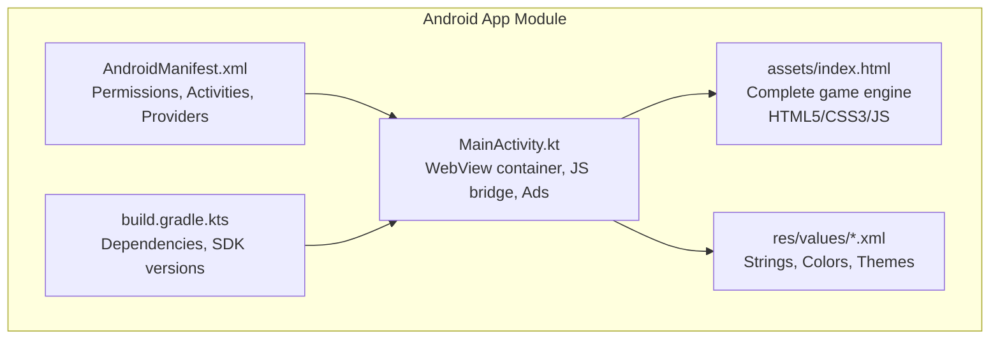
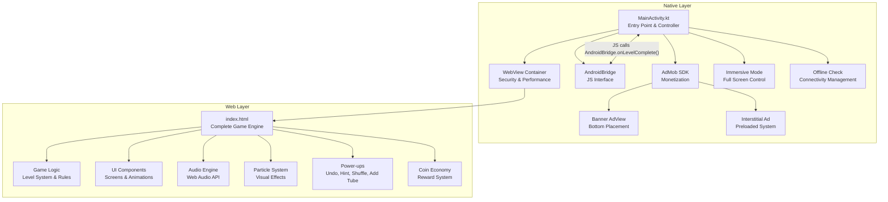
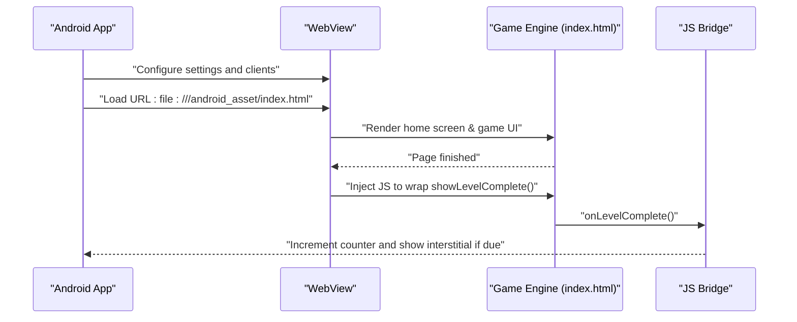
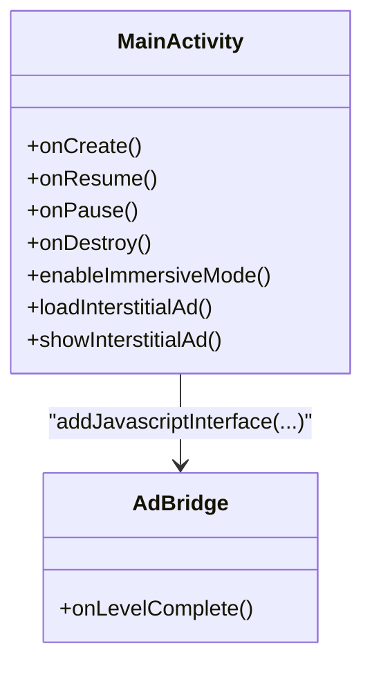
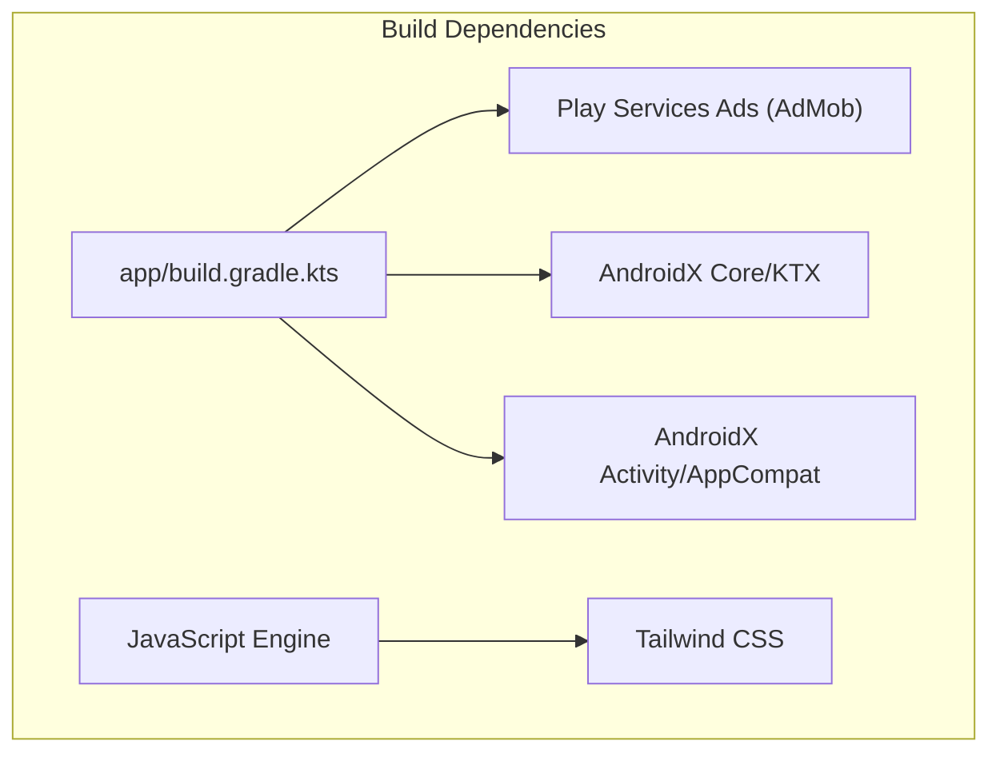

# Project Overview

<cite>
**Referenced Files in This Document**
- [README.md](file://README.md)
- [MainActivity.kt](file://app/src/main/java/com/cktechhub/games/MainActivity.kt)
- [index.html](file://app/src/main/assets/index.html)
- [AndroidManifest.xml](file://app/src/main/AndroidManifest.xml)
- [ADMOB_SETUP.md](file://ADMOB_SETUP.md)
- [app/build.gradle.kts](file://app/build.gradle.kts)
- [settings.gradle.kts](file://settings.gradle.kts)
- [strings.xml](file://app/src/main/res/values/strings.xml)
- [colors.xml](file://app/src/main/res/values/colors.xml)
- [themes.xml](file://app/src/main/res/values/themes.xml)
</cite>

## Update Summary
**Changes Made**
- Enhanced project overview documentation to consolidate information from README.md
- Added comprehensive feature descriptions and game mechanics coverage
- Expanded architecture diagrams with detailed component relationships
- Documented Tube Master Puzzle game mechanics and visual presentation
- Updated technical details for hybrid architecture benefits and implementation

## Table of Contents
1. [Introduction](#introduction)
2. [Project Structure](#project-structure)
3. [Core Components](#core-components)
4. [Architecture Overview](#architecture-overview)
5. [Detailed Component Analysis](#detailed-component-analysis)
6. [Game Mechanics and Features](#game-mechanics-and-features)
7. [Dependency Analysis](#dependency-analysis)
8. [Performance Considerations](#performance-considerations)
9. [Troubleshooting Guide](#troubleshooting-guide)
10. [Conclusion](#conclusion)

## Introduction
This document provides a comprehensive overview of the Tube Master Puzzle (formerly Ball Sort Puzzle) Android game project. It is a sophisticated hybrid mobile application that seamlessly combines native Android development with embedded web technologies. The native Android layer serves as a robust shell that hosts the game engine within a WebView container while managing system-level features including immersive UI, offline connectivity checks, and AdMob integration. The game engine and interactive UI are implemented in HTML, CSS, and JavaScript within the WebView, utilizing modern web technologies like Tailwind CSS for responsive design and Web Audio API for sound effects.

The Tube Master Puzzle is a vibrant ball-sorting puzzle game where players strategically move colored balls between glass test tubes to achieve monochromatic tubes. The game features progressive difficulty levels, power-ups, coin economy system, and stunning visual effects with neon-lit glass tubes, glossy 3D balls, and dark lab-themed backgrounds. This hybrid approach enables rapid iteration of gameplay logic and visual presentation while leveraging native capabilities for system integration and monetization.

**Key Goals of the Hybrid Approach:**
- Rapid prototyping and iteration of game mechanics and visual effects using web technologies
- Consistent rendering and animations across diverse Android devices through modern browser engine
- Native control over system UX (immersive mode, back navigation, screen management) and monetization (AdMob)
- Clear separation of concerns: native layer handles OS integration and ads; web layer manages game logic, rendering, and user interactions
- Progressive enhancement with power-ups (Undo, Hint, Shuffle, Add Tube) and coin economy system

**Section sources**
- [README.md:1-162](file://README.md#L1-L162)
- [MainActivity.kt:1-441](file://app/src/main/java/com/cktechhub/games/MainActivity.kt#L1-L441)
- [index.html:1-1360](file://app/src/main/assets/index.html#L1-L1360)

## Project Structure
The project follows a conventional Android module layout with a single app module. The game assets are packaged as a static HTML page under the app's assets folder, containing the complete game engine with all JavaScript, CSS, and HTML implementations. The native entry point is MainActivity, which constructs the UI, initializes WebView, loads the game engine, and integrates AdMob advertising services.

**Diagram sources**
- [AndroidManifest.xml:1-51](file://app/src/main/AndroidManifest.xml#L1-L51)
- [MainActivity.kt:1-441](file://app/src/main/java/com/cktechhub/games/MainActivity.kt#L1-L441)
- [index.html:1-1360](file://app/src/main/assets/index.html#L1-L1360)
- [app/build.gradle.kts:1-53](file://app/build.gradle.kts#L1-L53)
- [strings.xml:1-6](file://app/src/main/res/values/strings.xml#L1-L6)
- [colors.xml:1-10](file://app/src/main/res/values/colors.xml#L1-L10)
- [themes.xml:1-10](file://app/src/main/res/values/themes.xml#L1-L10)

**Section sources**
- [AndroidManifest.xml:1-51](file://app/src/main/AndroidManifest.xml#L1-L51)
- [MainActivity.kt:1-441](file://app/src/main/java/com/cktechhub/games/MainActivity.kt#L1-L441)
- [index.html:1-1360](file://app/src/main/assets/index.html#L1-L1360)
- [app/build.gradle.kts:1-53](file://app/build.gradle.kts#L1-L53)
- [settings.gradle.kts:1-27](file://settings.gradle.kts#L1-L27)
- [strings.xml:1-6](file://app/src/main/res/values/strings.xml#L1-L6)
- [colors.xml:1-10](file://app/src/main/res/values/colors.xml#L1-L10)
- [themes.xml:1-10](file://app/src/main/res/values/themes.xml#L1-L10)

## Core Components
The Tube Master Puzzle application consists of several interconnected components that work together to deliver a seamless gaming experience:

- **WebView Container**: A fully configured WebView instance that loads the game from app assets, enforces secure navigation policies, and maintains immersive UI behavior
- **JavaScript Interface (AndroidBridge)**: A Kotlin class exposed to JavaScript that enables bidirectional communication, allowing the game to trigger native actions like showing interstitial ads upon level completion
- **AdMob Integration**: Comprehensive native banner and interstitial ad support using Google Play Services Ads SDK, initialized via MobileAds and managed through Activity lifecycle hooks
- **Complete Game Engine**: A self-contained HTML5/JavaScript implementation featuring Tailwind CSS styling, responsive design, particle effects, Web Audio API integration, and complete game state management
- **Immersive UI System**: Native Android controls for full-screen mode, system bar management, and screen-on behavior to prevent accidental sleep during gameplay
- **Offline Connectivity Management**: Intelligent network detection and graceful error handling for offline scenarios with retry mechanisms

**Public Interfaces and Responsibilities:**
- **MainActivity**
  - onCreate: Initializes immersive UI, internet availability check, AdMob SDK, WebView configuration, loading indicator, banner ad, and game engine loading
  - Lifecycle callbacks: onResume, onPause, onDestroy manage WebView and ad lifecycle integration
  - Back navigation: Delegates to WebView when possible; otherwise exits gracefully
  - AdMob management: Loads and shows interstitial ads with preloading optimization; manages banner ad lifecycle
  - JavaScript bridge: Exposes AdBridge with @JavascriptInterface method for game-to-native communication
- **WebView Container**
  - Settings: Enables JavaScript, DOM storage, file access, mixed content policy, and zoom controls with performance optimizations
  - Security: WebViewClient overrides URL loading with strict local asset enforcement; WebChromeClient handles console logging
  - Integration: Evaluates JavaScript to hook into game's level-complete callback and notify Android layer
- **AdMob Integration**
  - Banner ad: Bottom-aligned AdView with fixed size and custom styling
  - Interstitial: Preloaded and shown based on configurable level completion frequency
  - Initialization: MobileAds SDK initialized with application ID from manifest metadata
- **Game Engine (index.html)**
  - Complete HTML5/JavaScript implementation with Tailwind CSS framework
  - Progressive difficulty system with 15 levels and increasing complexity
  - Power-up system including Undo, Hint, Shuffle, and Add Tube functionality
  - Coin economy system with reward-based power-ups
  - Responsive design with touch and click event handling
  - Particle effects system and Web Audio API integration

**Section sources**
- [MainActivity.kt:66-154](file://app/src/main/java/com/cktechhub/games/MainActivity.kt#L66-L154)
- [MainActivity.kt:165-263](file://app/src/main/java/com/cktechhub/games/MainActivity.kt#L165-L263)
- [MainActivity.kt:265-290](file://app/src/main/java/com/cktechhub/games/MainActivity.kt#L265-L290)
- [MainActivity.kt:370-409](file://app/src/main/java/com/cktechhub/games/MainActivity.kt#L370-L409)
- [MainActivity.kt:429-439](file://app/src/main/java/com/cktechhub/games/MainActivity.kt#L429-L439)
- [AndroidManifest.xml:20-28](file://app/src/main/AndroidManifest.xml#L20-L28)

## Architecture Overview
The hybrid architecture of Tube Master Puzzle creates a clean separation between the native Android layer and the web-based game engine. The native layer manages system integration, security, and monetization, while the web layer focuses on gameplay logic, rendering, and user interactions. This design enables rapid iteration of game mechanics and visual effects while leveraging native capabilities for optimal user experience.

**Diagram sources**
- [MainActivity.kt:105-135](file://app/src/main/java/com/cktechhub/games/MainActivity.kt#L105-L135)
- [MainActivity.kt:191-193](file://app/src/main/java/com/cktechhub/games/MainActivity.kt#L191-L193)
- [MainActivity.kt:214-229](file://app/src/main/java/com/cktechhub/games/MainActivity.kt#L214-L229)
- [MainActivity.kt:265-278](file://app/src/main/java/com/cktechhub/games/MainActivity.kt#L265-L278)
- [MainActivity.kt:370-409](file://app/src/main/java/com/cktechhub/games/MainActivity.kt#L370-L409)
- [index.html:1-1360](file://app/src/main/assets/index.html#L1-L1360)

## Detailed Component Analysis

### WebView Container and Game Hosting
The WebView serves as the secure container for the entire game engine, configured with extensive security measures and performance optimizations. The implementation ensures safe navigation by restricting URL loading to local assets only, while providing immersive gameplay through full-screen mode and system bar management.

**Diagram sources**
- [MainActivity.kt:165-263](file://app/src/main/java/com/cktechhub/games/MainActivity.kt#L165-L263)
- [MainActivity.kt:214-229](file://app/src/main/java/com/cktechhub/games/MainActivity.kt#L214-L229)
- [MainActivity.kt:429-439](file://app/src/main/java/com/cktechhub/games/MainActivity.kt#L429-L439)
- [index.html:1-1360](file://app/src/main/assets/index.html#L1-L1360)

**Security and Performance Features:**
- Mixed content disabled to prevent insecure resource loading
- Cache mode set to default for optimal performance
- Zoom controls disabled to maintain consistent UI scaling
- Renderer crash handling with automatic recovery from out-of-memory scenarios
- Strict URL filtering preventing external resource access

**Section sources**
- [MainActivity.kt:165-263](file://app/src/main/java/com/cktechhub/games/MainActivity.kt#L165-L263)
- [MainActivity.kt:214-229](file://app/src/main/java/com/cktechhub/games/MainActivity.kt#L214-L229)

### JavaScript Bridge (Android-Kotlin Communication)
The JavaScript interface creates a seamless communication channel between the web-based game engine and native Android functionality. The AdBridge inner class exposes a method that the game invokes to signal level completion events, enabling the native layer to trigger interstitial ad displays based on configurable frequency.

**Diagram sources**
- [MainActivity.kt:429-439](file://app/src/main/java/com/cktechhub/games/MainActivity.kt#L429-L439)

**Communication Flow:**
- Game engine injects JavaScript wrapper around showLevelComplete function
- When player completes a level, JavaScript calls AndroidBridge.onLevelComplete()
- Native layer increments completion counter and evaluates frequency threshold
- Interstitial ad is displayed if threshold reached, with automatic preloading

**Section sources**
- [MainActivity.kt:191-193](file://app/src/main/java/com/cktechhub/games/MainActivity.kt#L191-L193)
- [MainActivity.kt:429-439](file://app/src/main/java/com/cktechhub/games/MainActivity.kt#L429-L439)

### AdMob Integration
The application implements a comprehensive advertising system using Google AdMob, featuring both banner and interstitial advertisements with intelligent preloading and frequency management. The implementation ensures compliance with AdMob best practices while maintaining optimal user experience.

**Diagram sources**
- [MainActivity.kt:80-81](file://app/src/main/java/com/cktechhub/games/MainActivity.kt#L80-L81)
- [MainActivity.kt:265-278](file://app/src/main/java/com/cktechhub/games/MainActivity.kt#L265-L278)
- [MainActivity.kt:370-409](file://app/src/main/java/com/cktechhub/games/MainActivity.kt#L370-L409)
- [AndroidManifest.xml:20-28](file://app/src/main/AndroidManifest.xml#L20-L28)

**Advertising Features:**
- Banner ad: Fixed bottom placement with custom styling and responsive sizing
- Interstitial: Preloaded and shown every 2 level completions (configurable)
- Test IDs: Provided for development, requires production ID replacement
- Ad provider: MobileAdsInitProvider for proper initialization
- Frequency control: Configurable interstitial appearance rate

**Section sources**
- [MainActivity.kt:80-81](file://app/src/main/java/com/cktechhub/games/MainActivity.kt#L80-L81)
- [MainActivity.kt:265-278](file://app/src/main/java/com/cktechhub/games/MainActivity.kt#L265-L278)
- [MainActivity.kt:370-409](file://app/src/main/java/com/cktechhub/games/MainActivity.kt#L370-L409)
- [AndroidManifest.xml:20-28](file://app/src/main/AndroidManifest.xml#L20-L28)
- [ADMOB_SETUP.md:1-104](file://ADMOB_SETUP.md#L1-L104)

### Game Engine (index.html)
The game engine represents a complete HTML5/JavaScript implementation that rivals native applications in terms of performance and user experience. Built with Tailwind CSS for responsive design and modern JavaScript ES6+ features, it provides a rich gaming experience with sophisticated visual effects and gameplay mechanics.

**Core Game Engine Features:**
- **Progressive Difficulty System**: 15 levels with increasing complexity (colors, tube capacity, scrambling)
- **Ball Physics Simulation**: Realistic ball movement with drop animations and collision detection
- **Visual Effects**: Particle systems, glow effects, animations, and responsive tube rendering
- **Audio System**: Web Audio API integration for sound effects and level completion music
- **Theme System**: Multiple ball themes (Fruits, Veggies, Gems, Candy, Neon) with emoji support
- **Power-up System**: Undo, Hint, Shuffle, and Add Tube functionality with coin economy
- **Save System**: Local storage integration for progress and settings persistence
- **Responsive Design**: Adaptive layouts for various screen sizes and orientations

**Technical Implementation:**
- **State Management**: Centralized game state with history tracking for undo functionality
- **Event Handling**: Delegated event listeners for efficient touch/click interaction
- **Performance Optimization**: RequestAnimationFrame for smooth animations, debounced resize handling
- **Accessibility**: Proper ARIA attributes and keyboard navigation support

**Section sources**
- [index.html:1-1360](file://app/src/main/assets/index.html#L1-L1360)

## Game Mechanics and Features

### Core Gameplay Mechanics
The Tube Master Puzzle follows classic ball-sorting mechanics with strategic depth and progressive challenge:

**Primary Objective**: Sort colored balls so each test tube contains balls of only one color
**Movement Rules**:
- Tap a tube to select the top ball
- Tap another tube to drop the ball
- Valid moves: same color onto same color or into empty tubes
- Tube capacity typically 4 balls maximum

**Progressive Difficulty**:
- Level 1-2: 2 colors, 3-4 balls per color, 1 empty tube
- Level 3-5: 3 colors, 4 balls per color, 2 empty tubes  
- Level 6-10: 4-6 colors, 4-5 balls per color, 2 empty tubes
- Level 11-15: 6-8 colors, 4-5 balls per color, 2 empty tubes

### Power-up System
The game incorporates a comprehensive power-up economy system with coin rewards:

**Power-ups**:
- **Undo**: Reverse the last move (cost: 5 coins)
- **Hint**: Highlight a valid move (cost: 3 coins)
- **Shuffle**: Randomly rearrange all balls (cost: 7 coins)
- **Add Tube**: Add an extra empty tube for flexibility (cost: 10 coins)

**Coin Economy**:
- Earn coins by completing levels (base 10 coins per level)
- Power-ups cost progressively increase with usage
- Save system persists progress and coin balance

### Visual Presentation System
The game features a sophisticated visual design system with multiple themes:

**Theme Categories**:
- **Fruits**: Apple, Blueberry, Lemon, Watermelon, Orange, Grape, Strawberry, Pear, Kiwi, Mango
- **Veggies**: Chili, Cabbage, Corn, Pepper, Carrot, Beetroot, Cucumber, Radish, Lettuce, Onion  
- **Gems**: Ruby, Sapphire, Topaz, Emerald, Amber, Amethyst, Rose Quartz, Jade, Diamond, Onyx
- **Candy**: Cotton Candy, Blue Lolly, Lemon Drop, Mint Chip, Toffee, Lavender, Bubblegum, Sour Apple, Lime Fizz, Caramel
- **Neon**: Colorful neon variants with custom styling

**Visual Effects**:
- Realistic 3D ball rendering with gradient shading
- Glass tube effects with neon borders and glow
- Particle systems for level completion celebrations
- Smooth animations for ball movement and tube interactions
- Responsive design adapting to screen sizes

**Section sources**
- [README.md:144-156](file://README.md#L144-L156)
- [index.html:377-483](file://app/src/main/assets/index.html#L377-L483)
- [index.html:869-930](file://app/src/main/assets/index.html#L869-L930)

## Dependency Analysis
The project utilizes a carefully curated set of dependencies that balance functionality with performance and security considerations:

**External Dependencies**:
- **Play Services Ads**: Google AdMob SDK for banner and interstitial advertisement support
- **AndroidX Core Libraries**: Modern Android support libraries for lifecycle management and UI components
- **Activity/KTX**: Kotlin extensions and activity management for enhanced Android development
- **AppCompat**: Backward compatibility and material design components

**Internal Dependencies**:
- **WebView Configuration**: Custom settings for security, performance, and user experience
- **JavaScript Bridge**: Secure communication interface between native and web layers
- **AdMob Integration**: Comprehensive advertising system with preloading and frequency management
- **Game Engine**: Self-contained HTML5/JavaScript implementation with all game logic

**Diagram sources**
- [app/build.gradle.kts:44-53](file://app/build.gradle.kts#L44-L53)

**Section sources**
- [app/build.gradle.kts:44-53](file://app/build.gradle.kts#L44-L53)
- [AndroidManifest.xml:5-8](file://app/src/main/AndroidManifest.xml#L5-L8)

## Performance Considerations
The Tube Master Puzzle implementation incorporates several performance optimization strategies to ensure smooth gameplay across diverse Android devices:

**WebView Performance Optimizations**:
- Mixed content disabled to prevent security overhead and performance issues
- Default cache mode for optimal resource loading and memory management
- Zoom controls disabled to maintain consistent UI scaling and prevent layout thrashing
- Renderer crash detection and automatic recovery from out-of-memory scenarios
- Efficient JavaScript injection timing to minimize page load impact

**Game Engine Optimizations**:
- Debounced resize handling to prevent excessive re-rendering during orientation changes
- RequestAnimationFrame usage for smooth 60fps animations
- Efficient DOM manipulation through delegated event listeners
- Particle system with automatic cleanup to prevent memory leaks
- Local storage for persistent state management without server overhead

**Ad Integration Performance**:
- Interstitial ads preloaded asynchronously to minimize latency
- Smart frequency management to balance monetization with user experience
- Ad provider initialization optimization to reduce startup time
- Graceful fallback handling for offline scenarios

**Section sources**
- [MainActivity.kt:172-189](file://app/src/main/java/com/cktechhub/games/MainActivity.kt#L172-L189)
- [MainActivity.kt:231-244](file://app/src/main/java/com/cktechhub/games/MainActivity.kt#L231-L244)
- [MainActivity.kt:370-409](file://app/src/main/java/com/cktechhub/games/MainActivity.kt#L370-L409)

## Troubleshooting Guide
Common issues and their solutions for the Tube Master Puzzle application:

**Connectivity Issues**:
- **Problem**: No internet connection detected
- **Solution**: Verify device network settings; app displays offline screen with retry button
- **Prevention**: Implement proper network monitoring and graceful degradation

**AdMob Integration Problems**:
- **Problem**: Ads not displaying or failing to load
- **Solution**: Replace test AdMob IDs with production IDs in both AndroidManifest.xml and MainActivity.kt
- **Verification**: Check AdMob console for active ad units and proper configuration

**WebView Crashes or Performance Issues**:
- **Problem**: WebView crashes or slow rendering
- **Solution**: Monitor renderer process logs; ensure mixed content is disabled
- **Optimization**: Adjust cache settings or disable animations in game settings

**Immersive Mode Not Working**:
- **Problem**: System bars not hidden or screen not kept awake
- **Solution**: Confirm activity applies correct theme and immersive mode is enabled on focus change

**Game State Persistence Issues**:
- **Problem**: Progress not saving or resetting unexpectedly
- **Solution**: Verify local storage availability and proper state serialization
- **Debugging**: Check localStorage keys (bsp_level, bsp_score, bsp_* settings)

**Section sources**
- [MainActivity.kt:296-302](file://app/src/main/java/com/cktechhub/games/MainActivity.kt#L296-L302)
- [MainActivity.kt:304-364](file://app/src/main/java/com/cktechhub/games/MainActivity.kt#L304-L364)
- [ADMOB_SETUP.md:1-104](file://ADMOB_SETUP.md#L1-L104)
- [AndroidManifest.xml:20-28](file://app/src/main/AndroidManifest.xml#L20-L28)

## Conclusion
The Tube Master Puzzle project exemplifies a sophisticated hybrid architecture that successfully combines the strengths of native Android development with modern web technologies. The clean separation between the native Android layer (handling system integration, security, and monetization) and the web-based game engine (delivering rich gameplay mechanics and visual effects) creates a maintainable and scalable foundation for mobile gaming.

This architecture enables rapid iteration of gameplay logic and visual presentation using familiar web technologies while leveraging native capabilities for immersive user experiences and sustainable revenue generation through targeted advertising. The comprehensive implementation of progressive difficulty, power-ups, coin economy, and multiple visual themes demonstrates the versatility of the hybrid approach.

The documented interfaces, lifecycle management, and AdMob integration provide a robust foundation for ongoing development and maintenance, while the performance optimizations and troubleshooting guidance ensure reliable operation across diverse Android devices. This project serves as an excellent example of how hybrid architectures can deliver high-quality mobile gaming experiences while maintaining code organization and development efficiency.

**Section sources**
- [README.md:159-162](file://README.md#L159-L162)
- [MainActivity.kt:1-441](file://app/src/main/java/com/cktechhub/games/MainActivity.kt#L1-L441)
- [index.html:1-1360](file://app/src/main/assets/index.html#L1-L1360)