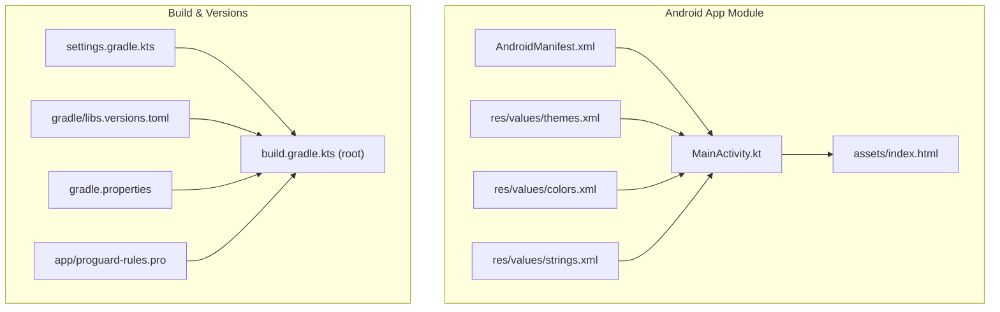
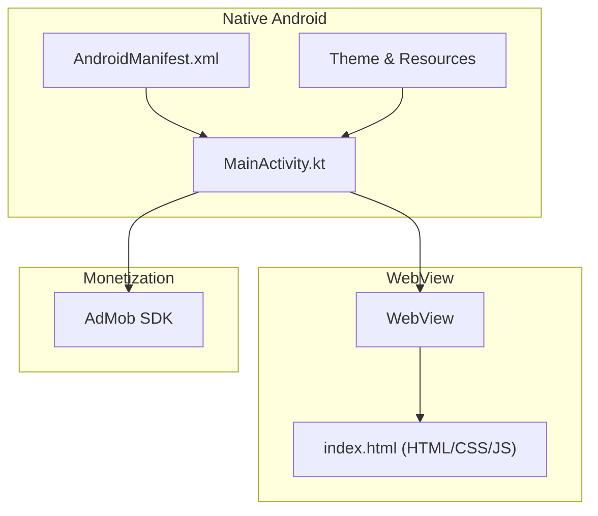
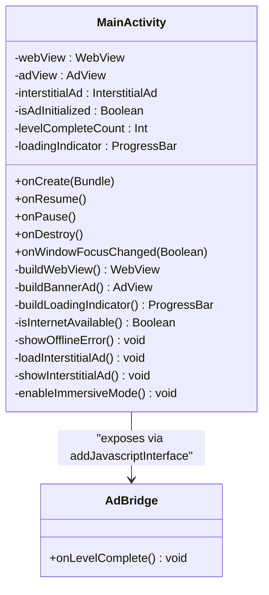
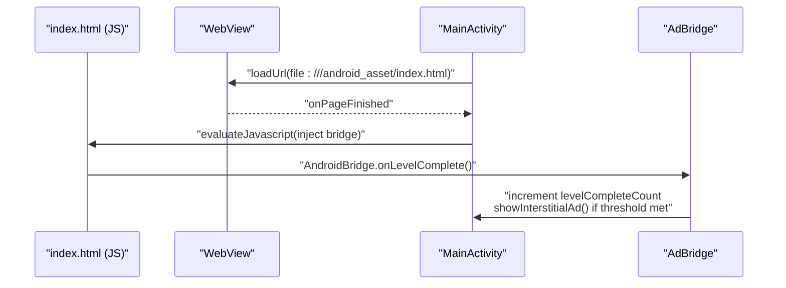
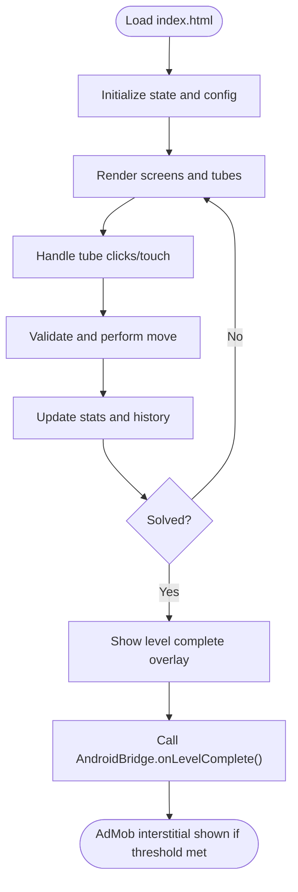
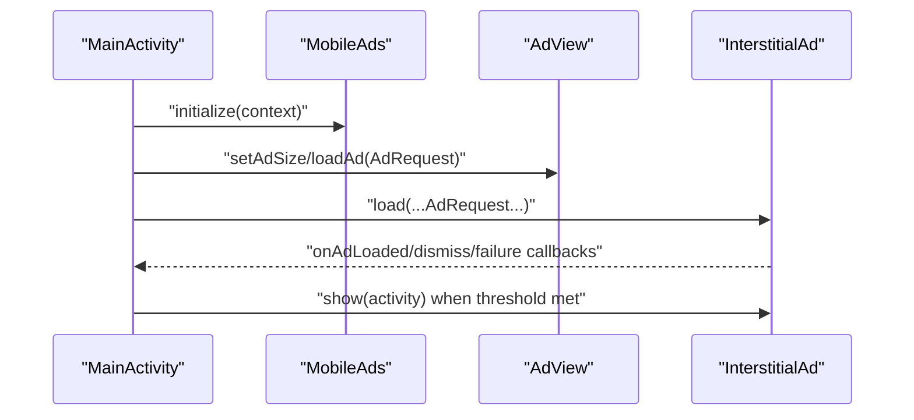
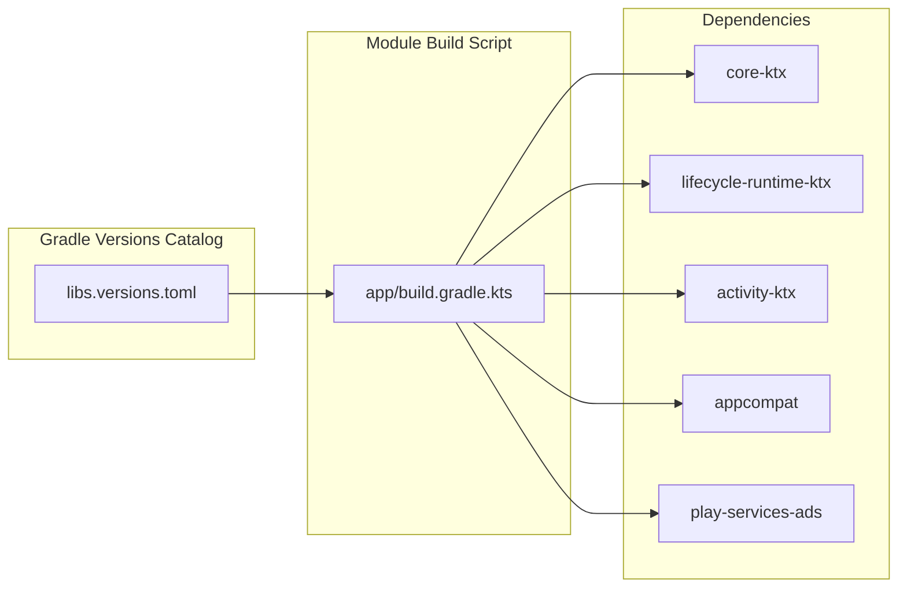

# Technology Stack

<cite>
**Referenced Files in This Document**
- [app/build.gradle.kts](file://app/build.gradle.kts)
- [build.gradle.kts](file://build.gradle.kts)
- [settings.gradle.kts](file://settings.gradle.kts)
- [gradle/libs.versions.toml](file://gradle/libs.versions.toml)
- [gradle.properties](file://gradle.properties)
- [app/src/main/AndroidManifest.xml](file://app/src/main/AndroidManifest.xml)
- [app/src/main/java/com/cktechhub/games/MainActivity.kt](file://app/src/main/java/com/cktechhub/games/MainActivity.kt)
- [app/src/main/assets/index.html](file://app/src/main/assets/index.html)
- [app/src/main/res/values/themes.xml](file://app/src/main/res/values/themes.xml)
- [app/src/main/res/values/colors.xml](file://app/src/main/res/values/colors.xml)
- [app/src/main/res/values/strings.xml](file://app/src/main/res/values/strings.xml)
- [ADMOB_SETUP.md](file://ADMOB_SETUP.md)
- [app/proguard-rules.pro](file://app/proguard-rules.pro)
</cite>

## Table of Contents
1. [Introduction](#introduction)
2. [Project Structure](#project-structure)
3. [Core Components](#core-components)
4. [Architecture Overview](#architecture-overview)
5. [Detailed Component Analysis](#detailed-component-analysis)
6. [Dependency Analysis](#dependency-analysis)
7. [Performance Considerations](#performance-considerations)
8. [Troubleshooting Guide](#troubleshooting-guide)
9. [Conclusion](#conclusion)

## Introduction
This document explains the technology stack powering the Ball Sort Puzzle Android game. It is a hybrid app: the shell is native Android (Kotlin), while the game engine and UI are implemented in HTML5, CSS3, and JavaScript inside a WebView. Monetization is handled by Google AdMob SDK integrated into the native layer. Supporting libraries include Android KTX, AppCompat, and Tailwind CSS (CDN-hosted) for responsive styling.

## Project Structure
The project follows a standard Android module layout with a single app module. The game’s frontend assets live under app/src/main/assets, and the native entry point is MainActivity.kt. Dependencies are centralized in gradle/libs.versions.toml and resolved via Gradle’s dependency resolution management.

**Diagram sources**
- [app/src/main/AndroidManifest.xml:1-51](file://app/src/main/AndroidManifest.xml#L1-L51)
- [app/src/main/java/com/cktechhub/games/MainActivity.kt:1-441](file://app/src/main/java/com/cktechhub/games/MainActivity.kt#L1-L441)
- [app/src/main/assets/index.html:1-1094](file://app/src/main/assets/index.html#L1-L1094)
- [app/src/main/res/values/themes.xml:1-10](file://app/src/main/res/values/themes.xml#L1-L10)
- [app/src/main/res/values/colors.xml:1-10](file://app/src/main/res/values/colors.xml#L1-L10)
- [app/src/main/res/values/strings.xml:1-6](file://app/src/main/res/values/strings.xml#L1-L6)
- [build.gradle.kts:1-4](file://build.gradle.kts#L1-L4)
- [settings.gradle.kts:1-27](file://settings.gradle.kts#L1-L27)
- [gradle/libs.versions.toml:1-28](file://gradle/libs.versions.toml#L1-L28)
- [gradle.properties:1-23](file://gradle.properties#L1-L23)
- [app/proguard-rules.pro:1-21](file://app/proguard-rules.pro#L1-L21)

**Section sources**
- [settings.gradle.kts:1-27](file://settings.gradle.kts#L1-L27)
- [gradle/libs.versions.toml:1-28](file://gradle/libs.versions.toml#L1-L28)
- [gradle.properties:17-23](file://gradle.properties#L17-L23)

## Core Components
- Kotlin and Android Native Layer
  - MainActivity initializes the app, sets immersive fullscreen, checks internet connectivity, builds a WebView, injects a JavaScript bridge, loads the game from assets, and integrates AdMob banners and interstitials.
  - AppCompat theme and resources define the UI base styles and colors.
- WebView Hosting the Web Engine
  - The WebView is configured with JavaScript enabled, DOM storage, file access, and mixed content policy. A JavaScript interface exposes Android events to the web layer.
- HTML5, CSS3, and JavaScript Game Engine
  - The game logic, rendering, animations, and UI are implemented in index.html with embedded CSS and JavaScript. Tailwind CSS is included via CDN for utility-first styling.
- Monetization with Google AdMob SDK
  - AdMob SDK is initialized and used to display banner ads and pre-loaded interstitial ads triggered by gameplay events.

**Section sources**
- [app/src/main/java/com/cktechhub/games/MainActivity.kt:66-135](file://app/src/main/java/com/cktechhub/games/MainActivity.kt#L66-L135)
- [app/src/main/java/com/cktechhub/games/MainActivity.kt:165-263](file://app/src/main/java/com/cktechhub/games/MainActivity.kt#L165-L263)
- [app/src/main/java/com/cktechhub/games/MainActivity.kt:265-278](file://app/src/main/java/com/cktechhub/games/MainActivity.kt#L265-L278)
- [app/src/main/java/com/cktechhub/games/MainActivity.kt:370-409](file://app/src/main/java/com/cktechhub/games/MainActivity.kt#L370-L409)
- [app/src/main/assets/index.html:1-203](file://app/src/main/assets/index.html#L1-L203)
- [app/src/main/assets/index.html:321-800](file://app/src/main/assets/index.html#L321-L800)
- [app/src/main/AndroidManifest.xml:20-48](file://app/src/main/AndroidManifest.xml#L20-L48)

## Architecture Overview
The app uses a hybrid architecture:
- Native Android (Kotlin) controls lifecycle, permissions, immersive UI, WebView configuration, and AdMob integration.
- WebView loads index.html from app assets and runs the game logic written in JavaScript.
- A JavaScript bridge allows the web layer to trigger native actions (e.g., showing interstitial ads on level completion).
- Tailwind CSS (via CDN) provides responsive styling utilities.

**Diagram sources**
- [app/src/main/java/com/cktechhub/games/MainActivity.kt:1-441](file://app/src/main/java/com/cktechhub/games/MainActivity.kt#L1-L441)
- [app/src/main/assets/index.html:1-1094](file://app/src/main/assets/index.html#L1-L1094)
- [app/src/main/AndroidManifest.xml:1-51](file://app/src/main/AndroidManifest.xml#L1-L51)
- [app/src/main/res/values/themes.xml:1-10](file://app/src/main/res/values/themes.xml#L1-L10)

## Detailed Component Analysis

### Android Native Shell (MainActivity)
- Responsibilities
  - Immersive full-screen mode and window insets handling.
  - Internet availability check and offline UI fallback.
  - WebView creation with strict security settings and JavaScript bridge.
  - Banner AdView placement and lifecycle management.
  - Interstitial ad pre-loading and controlled triggering based on level completion.
- Integration Patterns
  - Uses AppCompat for theme compatibility.
  - Uses Android KTX extensions for concise resource and lifecycle operations.
  - Exposes a JavaScriptInterface named AndroidBridge to the web layer.

**Diagram sources**
- [app/src/main/java/com/cktechhub/games/MainActivity.kt:42-441](file://app/src/main/java/com/cktechhub/games/MainActivity.kt#L42-L441)

**Section sources**
- [app/src/main/java/com/cktechhub/games/MainActivity.kt:66-135](file://app/src/main/java/com/cktechhub/games/MainActivity.kt#L66-L135)
- [app/src/main/java/com/cktechhub/games/MainActivity.kt:165-263](file://app/src/main/java/com/cktechhub/games/MainActivity.kt#L165-L263)
- [app/src/main/java/com/cktechhub/games/MainActivity.kt:265-278](file://app/src/main/java/com/cktechhub/games/MainActivity.kt#L265-L278)
- [app/src/main/java/com/cktechhub/games/MainActivity.kt:370-409](file://app/src/main/java/com/cktechhub/games/MainActivity.kt#L370-L409)
- [app/src/main/java/com/cktechhub/games/MainActivity.kt:428-439](file://app/src/main/java/com/cktechhub/games/MainActivity.kt#L428-L439)

### WebView and JavaScript Bridge
- WebView configuration
  - Enables JavaScript, DOM storage, file access, and wide viewport.
  - Mixed content is disallowed for security.
  - Overrides URL loading to restrict navigation to local assets.
  - Adds a WebChromeClient to log console messages.
- JavaScript Bridge
  - The web layer can call AndroidBridge.onLevelComplete().
  - On page load finish, the native layer injects a script to wrap the web’s level-complete callback and forward it to Android.

**Diagram sources**
- [app/src/main/java/com/cktechhub/games/MainActivity.kt:209-229](file://app/src/main/java/com/cktechhub/games/MainActivity.kt#L209-L229)
- [app/src/main/java/com/cktechhub/games/MainActivity.kt:428-439](file://app/src/main/java/com/cktechhub/games/MainActivity.kt#L428-L439)
- [app/src/main/assets/index.html:1-1094](file://app/src/main/assets/index.html#L1-L1094)

**Section sources**
- [app/src/main/java/com/cktechhub/games/MainActivity.kt:165-263](file://app/src/main/java/com/cktechhub/games/MainActivity.kt#L165-L263)
- [app/src/main/java/com/cktechhub/games/MainActivity.kt:209-229](file://app/src/main/java/com/cktechhub/games/MainActivity.kt#L209-L229)
- [app/src/main/java/com/cktechhub/games/MainActivity.kt:428-439](file://app/src/main/java/com/cktechhub/games/MainActivity.kt#L428-L439)

### Game Engine (HTML5/CSS3/JavaScript)
- Structure and UI
  - index.html defines screens (home, game, level complete, settings) and uses Tailwind CSS utilities for responsive layouts.
- Styling and Animations
  - CSS3 animations and transitions power tube selection, ball movement, completion effects, and UI overlays.
- Game Logic
  - JavaScript manages state, level generation, rendering, input handling, hints, undo, and audio via Web Audio API.
- Responsive Design
  - Tailwind CSS (CDN) classes and CSS media queries adapt the layout to various screen sizes.

**Diagram sources**
- [app/src/main/assets/index.html:321-800](file://app/src/main/assets/index.html#L321-L800)
- [app/src/main/assets/index.html:1-203](file://app/src/main/assets/index.html#L1-L203)

**Section sources**
- [app/src/main/assets/index.html:1-203](file://app/src/main/assets/index.html#L1-L203)
- [app/src/main/assets/index.html:321-800](file://app/src/main/assets/index.html#L321-L800)

### Monetization with Google AdMob SDK
- Initialization and Ads
  - MobileAds is initialized during onCreate.
  - Banner AdView is created and loaded with an AdRequest.
  - Interstitial ad is pre-loaded and shown periodically based on level completions.
- Configuration
  - AdMob App ID and provider are declared in AndroidManifest.xml.
  - Ad unit IDs are configured in MainActivity.kt constants.
- Production Setup
  - ADMOB_SETUP.md documents where to update test IDs with production values.

**Diagram sources**
- [app/src/main/java/com/cktechhub/games/MainActivity.kt:80-81](file://app/src/main/java/com/cktechhub/games/MainActivity.kt#L80-L81)
- [app/src/main/java/com/cktechhub/games/MainActivity.kt:265-278](file://app/src/main/java/com/cktechhub/games/MainActivity.kt#L265-L278)
- [app/src/main/java/com/cktechhub/games/MainActivity.kt:370-409](file://app/src/main/java/com/cktechhub/games/MainActivity.kt#L370-L409)
- [app/src/main/AndroidManifest.xml:20-48](file://app/src/main/AndroidManifest.xml#L20-L48)
- [ADMOB_SETUP.md:1-104](file://ADMOB_SETUP.md#L1-L104)

**Section sources**
- [app/src/main/java/com/cktechhub/games/MainActivity.kt:80-81](file://app/src/main/java/com/cktechhub/games/MainActivity.kt#L80-L81)
- [app/src/main/java/com/cktechhub/games/MainActivity.kt:265-278](file://app/src/main/java/com/cktechhub/games/MainActivity.kt#L265-L278)
- [app/src/main/java/com/cktechhub/games/MainActivity.kt:370-409](file://app/src/main/java/com/cktechhub/games/MainActivity.kt#L370-L409)
- [app/src/main/AndroidManifest.xml:20-48](file://app/src/main/AndroidManifest.xml#L20-L48)
- [ADMOB_SETUP.md:1-104](file://ADMOB_SETUP.md#L1-L104)

## Dependency Analysis
External dependencies and their roles:
- Google AdMob SDK (play-services-ads:23.6.0)
  - Provides AdMob initialization, banner ad loading, and interstitial ad lifecycle.
- Android KTX Libraries
  - androidx.core:core-ktx, androidx.lifecycle:lifecycle-runtime-ktx, androidx.activity:activity-ktx
  - Offer idiomatic Kotlin extensions for core Android APIs and lifecycle management.
- AppCompat
  - androidx.appcompat:appcompat
  - Ensures Material Design components and theme compatibility across device versions.
- Tailwind CSS (CDN-hosted)
  - Included in index.html via CDN for utility-first responsive styling.

Version management and compatibility:
- Versions are centralized in gradle/libs.versions.toml and applied via alias in app/build.gradle.kts.
- The project targets compileSdk 36 and minSdk 29, with Java 11 compatibility for compilation.
- AndroidX is enabled globally via gradle.properties.

**Diagram sources**
- [gradle/libs.versions.toml:1-28](file://gradle/libs.versions.toml#L1-L28)
- [app/build.gradle.kts:34-43](file://app/build.gradle.kts#L34-L43)

**Section sources**
- [gradle/libs.versions.toml:1-28](file://gradle/libs.versions.toml#L1-L28)
- [app/build.gradle.kts:34-43](file://app/build.gradle.kts#L34-L43)
- [gradle.properties:17-23](file://gradle.properties#L17-L23)

## Performance Considerations
- WebView Rendering
  - The renderer crash handling in WebViewClient ensures robustness if the render process is terminated.
  - Mixed content is disabled to avoid insecure resource loading.
- Asset Delivery
  - Loading index.html from app assets avoids network latency and supports offline readiness.
- Ad Loading Strategy
  - Pre-loading interstitial ads reduces latency when showing full-screen ads.
- UI Responsiveness
  - Tailwind utilities and CSS3 animations are used judiciously to maintain smooth interactions.

**Section sources**
- [app/src/main/java/com/cktechhub/games/MainActivity.kt:231-244](file://app/src/main/java/com/cktechhub/games/MainActivity.kt#L231-L244)
- [app/src/main/java/com/cktechhub/games/MainActivity.kt:172-189](file://app/src/main/java/com/cktechhub/games/MainActivity.kt#L172-L189)
- [app/src/main/java/com/cktechhub/games/MainActivity.kt:370-409](file://app/src/main/java/com/cktechhub/games/MainActivity.kt#L370-L409)

## Troubleshooting Guide
- No Internet Connection
  - The app detects connectivity and displays an offline screen with a retry button. Ensure INTERNET permission is present in AndroidManifest.xml.
- AdMob Not Showing
  - Verify AdMob App ID and ad unit IDs are correctly set. ADMOB_SETUP.md outlines where to update them.
  - Confirm MobileAds provider is declared and initialization is called.
- WebView Crashes or Blank Screen
  - Renderer gone handling attempts to recover by destroying and reloading the WebView.
  - Ensure local asset URLs are used and external navigation is blocked.
- ProGuard/R8
  - If using obfuscation, keep the JavaScript interface class members to prevent runtime errors.

**Section sources**
- [app/src/main/java/com/cktechhub/games/MainActivity.kt:296-364](file://app/src/main/java/com/cktechhub/games/MainActivity.kt#L296-L364)
- [app/src/main/java/com/cktechhub/games/MainActivity.kt:231-244](file://app/src/main/java/com/cktechhub/games/MainActivity.kt#L231-L244)
- [app/src/main/AndroidManifest.xml:5-8](file://app/src/main/AndroidManifest.xml#L5-L8)
- [app/src/main/AndroidManifest.xml:20-48](file://app/src/main/AndroidManifest.xml#L20-L48)
- [ADMOB_SETUP.md:1-104](file://ADMOB_SETUP.md#L1-L104)
- [app/proguard-rules.pro:8-13](file://app/proguard-rules.pro#L8-L13)

## Conclusion
The Ball Sort Puzzle employs a clean hybrid architecture: Kotlin/Android for native capabilities and lifecycle control, WebView for hosting a feature-rich HTML5/CSS3/JavaScript game engine, and Google AdMob for monetization. Centralized version catalogs and AndroidX ensure modern, compatible dependencies. The combination of robust WebView configuration, a JavaScript bridge, and responsive Tailwind utilities delivers a polished mobile gaming experience.