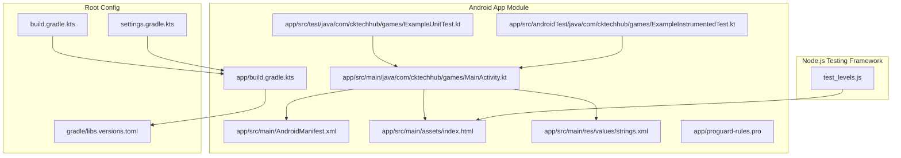
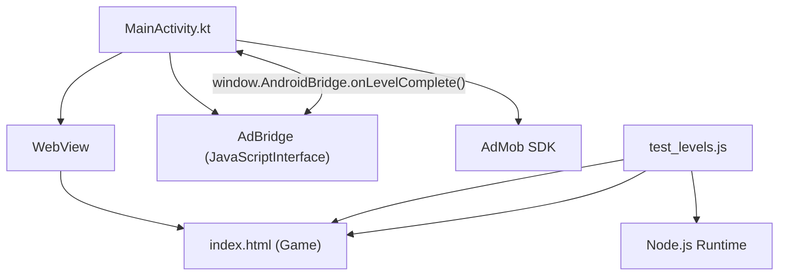
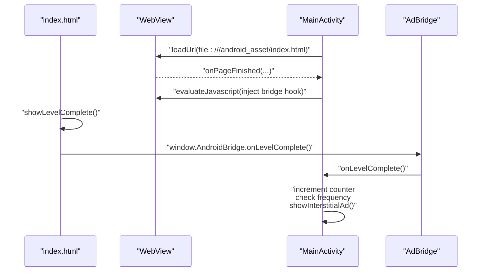
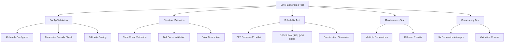
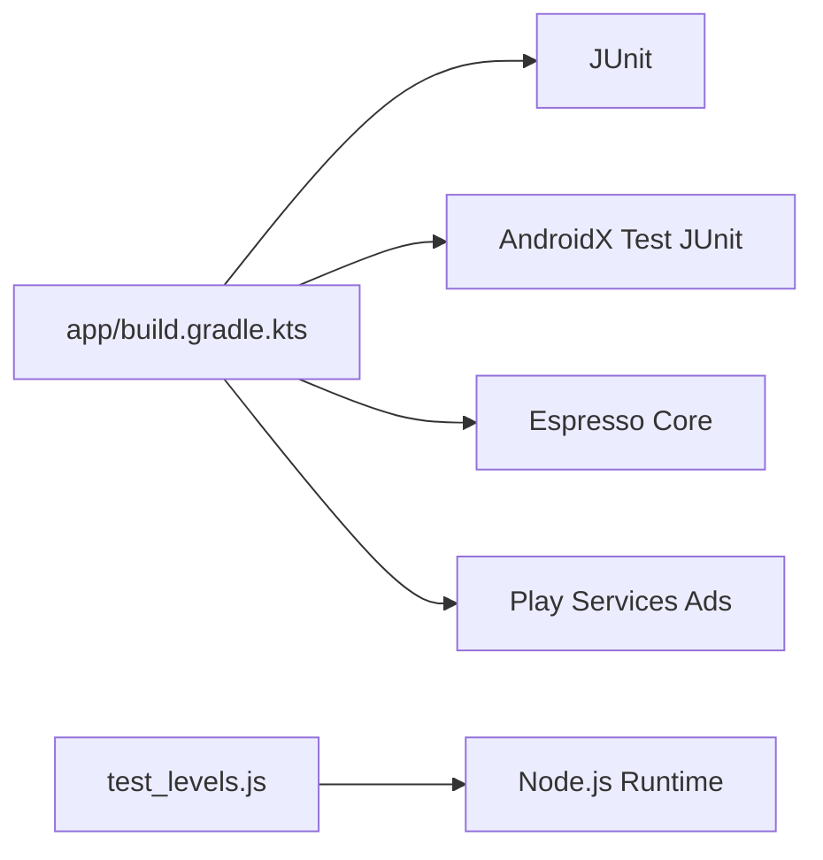

# Testing & Deployment

<cite>
**Referenced Files in This Document**
- [ExampleUnitTest.kt](file://app/src/test/java/com/cktechhub/games/ExampleUnitTest.kt)
- [ExampleInstrumentedTest.kt](file://app/src/androidTest/java/com/cktechhub/games/ExampleInstrumentedTest.kt)
- [MainActivity.kt](file://app/src/main/java/com/cktechhub/games/MainActivity.kt)
- [index.html](file://app/src/main/assets/index.html)
- [test_levels.js](file://test_levels.js)
- [AndroidManifest.xml](file://app/src/main/AndroidManifest.xml)
- [build.gradle.kts](file://app/build.gradle.kts)
- [build.gradle.kts](file://build.gradle.kts)
- [libs.versions.toml](file://gradle/libs.versions.toml)
- [settings.gradle.kts](file://settings.gradle.kts)
- [proguard-rules.pro](file://app/proguard-rules.pro)
- [strings.xml](file://app/src/main/res/values/strings.xml)
- [ADMOB_SETUP.md](file://ADMOB_SETUP.md)
</cite>

## Update Summary
**Changes Made**
- Added comprehensive Ball Sort Puzzle testing framework documentation with Node.js-based validation
- Documented BFS and DFS solvers for puzzle solvability verification
- Enhanced testing strategies with automated validation for all 40 game levels
- Updated quality assurance processes with level generation algorithm validation
- Added Node.js runtime requirements for comprehensive game testing

## Table of Contents
1. [Introduction](#introduction)
2. [Project Structure](#project-structure)
3. [Core Components](#core-components)
4. [Architecture Overview](#architecture-overview)
5. [Detailed Component Analysis](#detailed-component-analysis)
6. [Dependency Analysis](#dependency-analysis)
7. [Performance Considerations](#performance-considerations)
8. [Troubleshooting Guide](#troubleshooting-guide)
9. [Conclusion](#conclusion)
10. [Appendices](#appendices)

## Introduction
This document provides comprehensive guidance for testing and deployment of the Android application that integrates a WebView-based HTML5 game with an Android bridge for AdMob interstitial advertising. It covers:
- Unit testing strategies for Kotlin code
- Integration testing methodologies for WebView–JavaScript communication
- Performance testing for mobile devices
- **New**: Comprehensive Ball Sort Puzzle testing framework with Node.js-based validation
- Implementation details for test case structure, mock setups, and automated workflows
- Configuration options for testing environments and continuous integration
- Quality assurance processes for 40 game levels with BFS/DFS solvability verification
- Practical examples for test execution, debugging, and performance profiling
- Common testing challenges such as WebView automation, JavaScript bridge testing, and cross-platform compatibility
- Deployment procedures including build optimization, release preparation, and distribution channels
- Troubleshooting guidance for testing and deployment issues

## Project Structure
The project follows a standard Android module layout with separate source sets for unit tests and instrumentation tests. The application loads a local HTML5 game via WebView and exposes a JavaScript interface to trigger native behavior (e.g., showing interstitial ads). **New**: Added Node.js-based testing framework for comprehensive game validation.

**Diagram sources**
- [MainActivity.kt:1-441](file://app/src/main/java/com/cktechhub/games/MainActivity.kt#L1-L441)
- [AndroidManifest.xml:1-51](file://app/src/main/AndroidManifest.xml#L1-L51)
- [index.html:1-1380](file://app/src/main/assets/index.html#L1-L1380)
- [test_levels.js:1-504](file://test_levels.js#L1-L504)
- [strings.xml:1-6](file://app/src/main/res/values/strings.xml#L1-L6)
- [ExampleUnitTest.kt:1-17](file://app/src/test/java/com/cktechhub/games/ExampleUnitTest.kt#L1-L17)
- [ExampleInstrumentedTest.kt:1-24](file://app/src/androidTest/java/com/cktechhub/games/ExampleInstrumentedTest.kt#L1-L24)
- [build.gradle.kts:1-53](file://app/build.gradle.kts#L1-L53)
- [proguard-rules.pro:1-21](file://app/proguard-rules.pro#L1-L21)
- [build.gradle.kts:1-4](file://build.gradle.kts#L1-L4)
- [settings.gradle.kts:1-27](file://settings.gradle.kts#L1-L27)
- [libs.versions.toml:1-28](file://gradle/libs.versions.toml#L1-L28)

**Section sources**
- [build.gradle.kts:1-53](file://app/build.gradle.kts#L1-L53)
- [settings.gradle.kts:1-27](file://settings.gradle.kts#L1-L27)
- [libs.versions.toml:1-28](file://gradle/libs.versions.toml#L1-L28)
- [build.gradle.kts:1-4](file://build.gradle.kts#L1-L4)

## Core Components
- MainActivity: Hosts the WebView, configures settings, injects a JavaScript bridge, handles lifecycle events, and manages AdMob banners and interstitials.
- WebView content: Local HTML/CSS/JS game loaded from app assets.
- **New**: test_levels.js: Comprehensive Node.js-based test suite validating level generation algorithms, solvability verification, and quality assurance for all 40 game levels.
- Tests: Basic unit test and instrumentation test scaffolding present; extension points for deeper coverage.
- Dependencies: JUnit, AndroidX Test/JUnit, Espresso, Play Services Ads, and Node.js runtime for level validation.

Key testing-relevant areas:
- WebView client and chrome client configuration
- JavaScript interface exposed to JS
- AdMob integration and interstitial frequency logic
- Network connectivity checks and offline UI
- **New**: Level generation algorithm validation and solvability testing

**Section sources**
- [MainActivity.kt:165-263](file://app/src/main/java/com/cktechhub/games/MainActivity.kt#L165-L263)
- [MainActivity.kt:428-439](file://app/src/main/java/com/cktechhub/games/MainActivity.kt#L428-L439)
- [MainActivity.kt:370-409](file://app/src/main/java/com/cktechhub/games/MainActivity.kt#L370-L409)
- [MainActivity.kt:296-302](file://app/src/main/java/com/cktechhub/games/MainActivity.kt#L296-L302)
- [ExampleUnitTest.kt:12-17](file://app/src/test/java/com/cktechhub/games/ExampleUnitTest.kt#L12-L17)
- [ExampleInstrumentedTest.kt:17-24](file://app/src/androidTest/java/com/cktechhub/games/ExampleInstrumentedTest.kt#L17-L24)
- [test_levels.js:1-504](file://test_levels.js#L1-L504)
- [build.gradle.kts:44-53](file://app/build.gradle.kts#L44-L53)

## Architecture Overview
The app architecture centers around an Activity hosting a WebView that renders a local HTML5 game. The bridge between Android and JavaScript is implemented via a JavaScriptInterface. AdMob is initialized early and interstitials are shown based on game events. **New**: Node.js-based testing framework validates game logic independently of the Android environment.

**Diagram sources**
- [MainActivity.kt:165-263](file://app/src/main/java/com/cktechhub/games/MainActivity.kt#L165-L263)
- [MainActivity.kt:428-439](file://app/src/main/java/com/cktechhub/games/MainActivity.kt#L428-L439)
- [index.html:1-1380](file://app/src/main/assets/index.html#L1-L1380)
- [test_levels.js:1-504](file://test_levels.js#L1-L504)

## Detailed Component Analysis

### WebView and JavaScript Bridge Testing
The WebView is configured with JavaScript enabled and a JavaScriptInterface named AndroidBridge. The bridge exposes a method invoked by the game when a level completes. The Activity injects a small script to wrap the game's level-complete callback and invoke the bridge.

**Diagram sources**
- [MainActivity.kt:131](file://app/src/main/java/com/cktechhub/games/MainActivity.kt#L131)
- [MainActivity.kt:209-229](file://app/src/main/java/com/cktechhub/games/MainActivity.kt#L209-L229)
- [MainActivity.kt:428-439](file://app/src/main/java/com/cktechhub/games/MainActivity.kt#L428-L439)

**Section sources**
- [MainActivity.kt:165-263](file://app/src/main/java/com/cktechhub/games/MainActivity.kt#L165-L263)
- [MainActivity.kt:428-439](file://app/src/main/java/com/cktechhub/games/MainActivity.kt#L428-L439)
- [index.html:1-1380](file://app/src/main/assets/index.html#L1-L1380)

### Ball Sort Puzzle Testing Framework
**New**: The test_levels.js file provides comprehensive validation of the Ball Sort Puzzle game logic, ensuring all 40 levels are generated correctly and remain solvable.

#### Level Generation Validation
The test suite validates:
- **Config Integrity**: All 40 levels have valid parameters (colors: 2-10, balls per color: 3-8, empty tubes: 1-3)
- **Difficulty Progression**: Levels scale appropriately in difficulty
- **Generation Structure**: Generated puzzles meet tube and ball count requirements
- **Solvability Verification**: All puzzles are solvable using BFS solver for smaller puzzles and construction guarantee for larger ones
- **Randomness Testing**: Multiple generations produce different puzzles
- **Consistency Testing**: Repeated generations yield valid results

#### Algorithm Validation
The framework includes two solvers:
- **BFS Solver**: Exhaustive search for puzzles ≤ 30 balls with move limits
- **DFS Solver (IDS)**: Iterative deepening for larger puzzles beyond BFS capabilities

**Diagram sources**
- [test_levels.js:14-55](file://test_levels.js#L14-L55)
- [test_levels.js:97-151](file://test_levels.js#L97-L151)
- [test_levels.js:175-236](file://test_levels.js#L175-L236)
- [test_levels.js:244-294](file://test_levels.js#L244-L294)

**Section sources**
- [test_levels.js:1-504](file://test_levels.js#L1-L504)
- [index.html:638-715](file://app/src/main/assets/index.html#L638-L715)

### Unit Testing Strategies for Kotlin
Current unit test coverage is minimal. Recommended extensions:
- Mock Android dependencies (context, WebView, ConnectivityManager) using a framework like MockK.
- Test logic in isolation:
  - AdMob bridge counting and interstitial scheduling
  - Connectivity checks and offline UI rendering
  - Lifecycle-safe WebView settings and clients
- Use Robolectric for Android framework classes when needed.

Test case structure recommendations:
- Arrange: Prepare mocks and stub Android services.
- Act: Invoke methods under test (e.g., onLevelComplete, isInternetAvailable).
- Assert: Verify interactions with mocks and state transitions.

**Section sources**
- [ExampleUnitTest.kt:12-17](file://app/src/test/java/com/cktechhub/games/ExampleUnitTest.kt#L12-L17)
- [MainActivity.kt:296-302](file://app/src/main/java/com/cktechhub/games/MainActivity.kt#L296-L302)
- [MainActivity.kt:428-439](file://app/src/main/java/com/cktechhub/games/MainActivity.kt#L428-L439)

### Integration Testing Methodologies for WebView–JavaScript Communication
Recommended approaches:
- Instrumentation tests with a local server or asset-based HTML to simulate real JS interactions.
- Use Espresso with Idling Resources to synchronize WebView loading and JS evaluation.
- Validate that evaluateJavascript executes and the bridge method is called without errors.
- Verify UI updates triggered by JS callbacks (e.g., interstitial shown).

Mock implementations:
- Stub WebViewClient and WebChromeClient to intercept navigation and console logs.
- Mock AdMob SDK initialization and interstitial callbacks to avoid network calls during tests.

**Section sources**
- [ExampleInstrumentedTest.kt:17-24](file://app/src/androidTest/java/com/cktechhub/games/ExampleInstrumentedTest.kt#L17-L24)
- [MainActivity.kt:195-245](file://app/src/main/java/com/cktechhub/games/MainActivity.kt#L195-L245)
- [MainActivity.kt:247-256](file://app/src/main/java/com/cktechhub/games/MainActivity.kt#L247-L256)
- [MainActivity.kt:209-229](file://app/src/main/java/com/cktechhub/games/MainActivity.kt#L209-L229)

### Performance Testing for Mobile Devices
Guidance:
- Measure startup time from process launch to first visible frame.
- Profile WebView rendering and JS execution using Android Studio Profiler.
- Monitor memory usage during gameplay and interstitial transitions.
- Validate performance across device categories (entry-level vs flagship) using physical devices.

Common metrics:
- Time to load index.html from assets
- Time to first interstitial after threshold events
- Memory footprint during particle effects and animations

**Section sources**
- [MainActivity.kt:131](file://app/src/main/java/com/cktechhub/games/MainActivity.kt#L131)
- [MainActivity.kt:370-409](file://app/src/main/java/com/cktechhub/games/MainActivity.kt#L370-L409)
- [index.html:1-1380](file://app/src/main/assets/index.html#L1-L1380)

### Automated Testing Workflows
Recommended Gradle tasks and CI configuration:
- Unit tests: ./gradlew test
- Instrumentation tests: ./gradlew connectedAndroidTest
- Combined verification: ./gradlew check
- **New**: Level validation: node test_levels.js

CI pipeline suggestions:
- Trigger on pull requests and pushes to main branch.
- Run unit tests on every commit.
- Run instrumentation tests on emulator farm or cloud device providers.
- **New**: Run Node.js tests on dedicated runners for level validation.
- Upload test reports and artifacts.

**Section sources**
- [build.gradle.kts:16](file://app/build.gradle.kts#L16)
- [build.gradle.kts:44-53](file://app/build.gradle.kts#L44-L53)
- [test_levels.js:498-504](file://test_levels.js#L498-L504)

### Configuration Options for Testing Environments
- Test runner: AndroidJUnitRunner configured in module build script.
- Dependencies: JUnit, AndroidX Test JUnit, Espresso.
- ProGuard/R8: Keep rules for JavaScript interfaces if obfuscation is enabled.
- **New**: Node.js runtime: Required for level validation tests.

**Section sources**
- [build.gradle.kts:16](file://app/build.gradle.kts#L16)
- [build.gradle.kts:44-53](file://app/build.gradle.kts#L44-L53)
- [proguard-rules.pro:8-13](file://app/proguard-rules.pro#L8-L13)
- [test_levels.js:1](file://test_levels.js#L1)

### Quality Assurance Processes
- Code coverage: Integrate a coverage tool (e.g., Jacoco) to track unit test coverage.
- Static analysis: Apply lint checks and custom rules for WebView and AdMob usage.
- Accessibility: Ensure WebView content meets accessibility guidelines.
- Regression testing: Maintain a suite of UI tests covering critical user flows.
- **New**: Level validation: Automated verification of 40 game levels using BFS/DFS solvers.
- **New**: Difficulty progression: Ensures logical level scaling from easy to hard.

**Section sources**
- [build.gradle.kts:44-53](file://app/build.gradle.kts#L44-L53)
- [test_levels.js:328-355](file://test_levels.js#L328-L355)
- [test_levels.js:431-458](file://test_levels.js#L431-L458)

### Practical Examples: Test Execution and Debugging
- Running unit tests locally: ./gradlew testDebugUnitTest
- Running instrumentation tests: ./gradlew connectedDebugAndroidTest
- **New**: Running level validation: node test_levels.js
- Debugging WebView console messages: Observe logs captured by WebChromeClient.
- Verifying bridge invocation: Add assertions in tests that the bridge method increments the internal counter.
- **New**: Validating level generation: Review test_levels.js output for PASS/FAIL/WARN indicators.

**Section sources**
- [MainActivity.kt:247-256](file://app/src/main/java/com/cktechhub/games/MainActivity.kt#L247-L256)
- [MainActivity.kt:428-439](file://app/src/main/java/com/cktechhub/games/MainActivity.kt#L428-L439)
- [test_levels.js:302-322](file://test_levels.js#L302-L322)

### Common Testing Challenges and Resolutions
- WebView automation: Use Espresso WebView matchers and ensure proper synchronization with onPageFinished.
- JavaScript bridge testing: Validate evaluateJavascript execution and confirm the bridge method is reachable from JS.
- Cross-platform compatibility: Test on various Android versions and screen sizes; verify WebView settings and permissions.
- **New**: Level generation validation: Ensure Node.js environment matches Android game logic implementation.
- **New**: Solvability testing: Handle timeouts gracefully for complex puzzles using DFS solver.

**Section sources**
- [MainActivity.kt:173-189](file://app/src/main/java/com/cktechhub/games/MainActivity.kt#L173-L189)
- [AndroidManifest.xml:5-8](file://app/src/main/AndroidManifest.xml#L5-L8)
- [test_levels.js:175-236](file://test_levels.js#L175-L236)

## Dependency Analysis
The app depends on AndroidX libraries, JUnit, and Play Services Ads. The module build script defines test dependencies and the Android test runner. **New**: Node.js-based testing framework adds runtime dependencies for level validation.

**Diagram sources**
- [build.gradle.kts:44-53](file://app/build.gradle.kts#L44-L53)
- [libs.versions.toml:13-21](file://gradle/libs.versions.toml#L13-L21)
- [test_levels.js:1](file://test_levels.js#L1)

**Section sources**
- [build.gradle.kts:44-53](file://app/build.gradle.kts#L44-L53)
- [libs.versions.toml:13-21](file://gradle/libs.versions.toml#L13-L21)

## Performance Considerations
- Minimize WebView overhead by disabling unnecessary features and keeping JavaScript interface methods lightweight.
- Use conservative interstitial frequency to balance engagement and performance.
- Profile GPU and CPU usage during animations and particle effects.
- Optimize image assets and reduce DOM complexity in the HTML game.
- **New**: Consider performance implications of BFS/DFS solvers for level validation in CI environments.

## Troubleshooting Guide
- AdMob IDs still set to test values: Replace both the App ID in AndroidManifest.xml and the ad unit IDs in MainActivity.kt before release.
- Interstitial not showing: Confirm ad readiness and callback handling; verify frequency logic and UI thread usage.
- WebView fails to load local content: Ensure the asset path is correct and permissions are declared.
- Network-related failures: Validate connectivity checks and offline UI flow.
- **New**: Node.js test failures: Verify Node.js installation and ensure test_levels.js has proper execution permissions.
- **New**: Level generation errors: Check that index.html and test_levels.js share identical game logic implementations.

**Section sources**
- [ADMOB_SETUP.md:1-104](file://ADMOB_SETUP.md#L1-L104)
- [AndroidManifest.xml:20-28](file://app/src/main/AndroidManifest.xml#L20-L28)
- [MainActivity.kt:402-409](file://app/src/main/java/com/cktechhub/games/MainActivity.kt#L402-L409)
- [MainActivity.kt:131](file://app/src/main/java/com/cktechhub/games/MainActivity.kt#L131)
- [MainActivity.kt:296-302](file://app/src/main/java/com/cktechhub/games/MainActivity.kt#L296-L302)
- [test_levels.js:498-504](file://test_levels.js#L498-L504)

## Conclusion
This guide outlines a practical roadmap for testing and deploying the WebView-backed Android game with AdMob integration. By extending unit and instrumentation tests, validating the JavaScript bridge, and applying performance profiling, teams can ensure robust functionality and reliable releases. **New**: The comprehensive Ball Sort Puzzle testing framework with BFS/DFS solvers provides confidence that all 40 game levels are valid and solvable. Proper configuration of testing environments and CI pipelines further strengthens quality assurance.

## Appendices

### Appendix A: Test Case Structure Template
- Unit tests:
  - Arrange: Create mocks for Android services and WebView.
  - Act: Call the method under test (e.g., onLevelComplete).
  - Assert: Verify interactions and state changes.
- Instrumentation tests:
  - Launch activity and wait for WebView load.
  - Execute JS to trigger bridge.
  - Assert UI and native behavior.
- **New**: Level validation tests:
  - Arrange: Load test_levels.js with Node.js runtime.
  - Act: Execute level generation and solvability tests.
  - Assert: Verify all 40 levels pass validation criteria.

**Section sources**
- [ExampleUnitTest.kt:12-17](file://app/src/test/java/com/cktechhub/games/ExampleUnitTest.kt#L12-L17)
- [ExampleInstrumentedTest.kt:17-24](file://app/src/androidTest/java/com/cktechhub/games/ExampleInstrumentedTest.kt#L17-L24)
- [test_levels.js:298-322](file://test_levels.js#L298-L322)

### Appendix B: Release Preparation Checklist
- Replace test AdMob IDs with production IDs in both AndroidManifest.xml and MainActivity.kt.
- Enable ProGuard/R8 with appropriate keep rules for JavaScript interfaces.
- Build a release variant with minification disabled initially for stability.
- Validate interstitial flow and offline UI on real devices.
- **New**: Run level validation tests using node test_levels.js to ensure all 40 levels are valid.
- **New**: Verify BFS/DFS solvers can handle edge cases in production environment.
- Publish to distribution channels after QA approval.

**Section sources**
- [ADMOB_SETUP.md:1-104](file://ADMOB_SETUP.md#L1-L104)
- [proguard-rules.pro:8-13](file://app/proguard-rules.pro#L8-L13)
- [build.gradle.kts:28-37](file://app/build.gradle.kts#L28-L37)
- [test_levels.js:431-458](file://test_levels.js#L431-L458)

### Appendix C: Ball Sort Puzzle Testing Framework Details
**New**: Technical specifications for the test_levels.js framework:

#### Core Components
- **LEVEL_CONFIG**: Mirrors game configuration from index.html
- **generateLevel()**: Validates level generation algorithm
- **isSolved()**: Checks puzzle completion state
- **BFS Solver**: Exhaustive search for solvability verification
- **DFS Solver (IDS)**: Iterative deepening for complex puzzles

#### Test Categories
1. **Config Integrity**: Validates 40-level configuration parameters
2. **Difficulty Progression**: Ensures logical level scaling
3. **Generation Structure**: Verifies tube and ball count accuracy
4. **Solvability Verification**: Confirms puzzle solvability using multiple algorithms
5. **Randomness Testing**: Validates unique puzzle generation
6. **Consistency Testing**: Ensures repeatable validation results

#### Algorithm Specifications
- **BFS Solver**: Uses state serialization and visited set optimization
- **DFS Solver**: Implements iterative deepening with move prioritization
- **Move Optimization**: Skips empty-tube moves unless necessary
- **Timeout Handling**: Prevents infinite search with configurable limits

**Section sources**
- [test_levels.js:14-55](file://test_levels.js#L14-L55)
- [test_levels.js:97-151](file://test_levels.js#L97-L151)
- [test_levels.js:153-236](file://test_levels.js#L153-L236)
- [test_levels.js:238-294](file://test_levels.js#L238-L294)