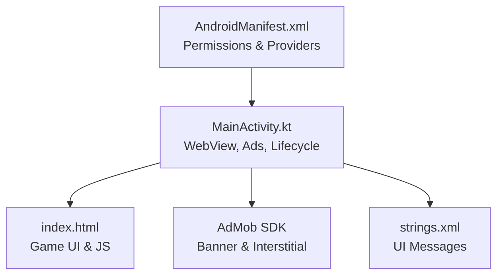
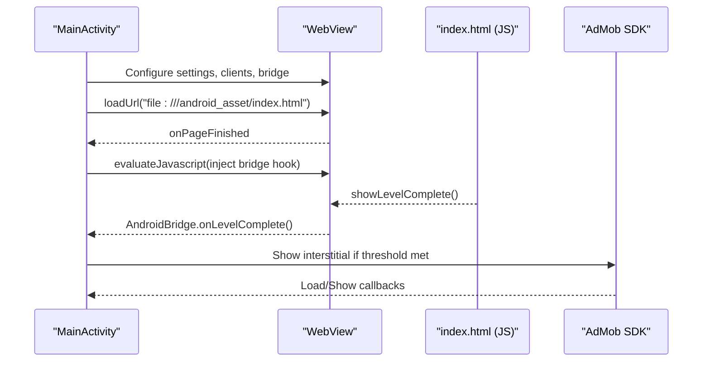
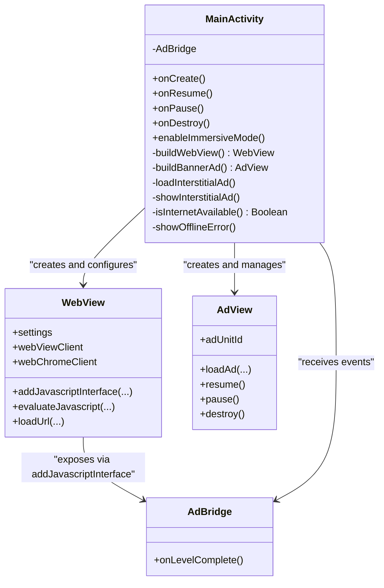
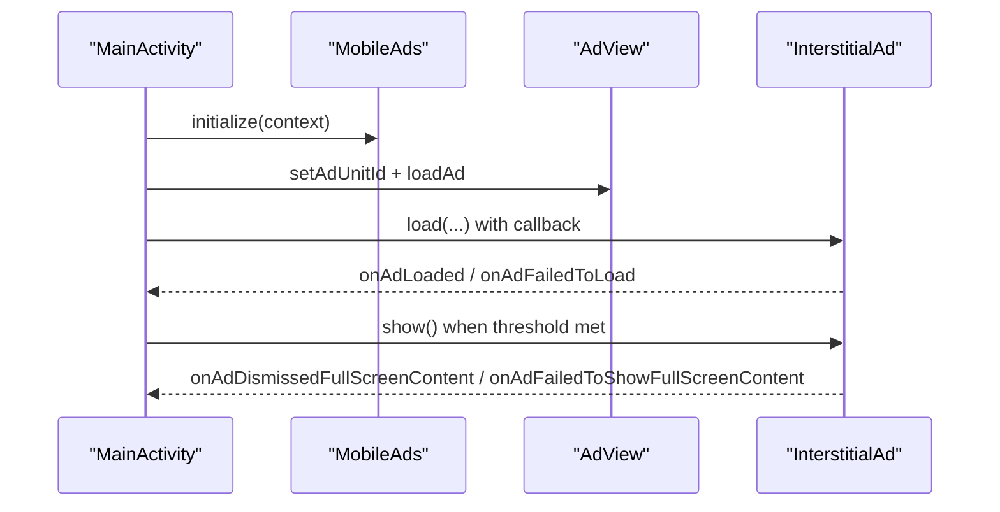
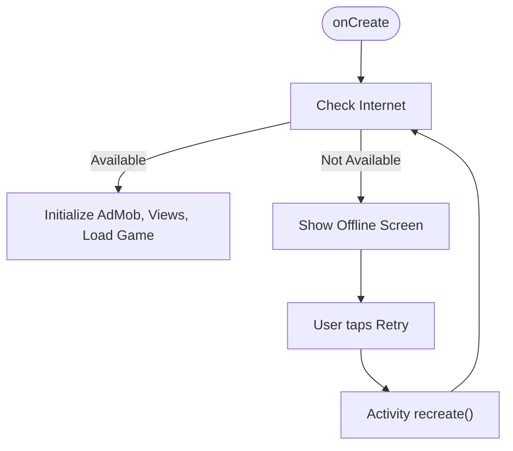
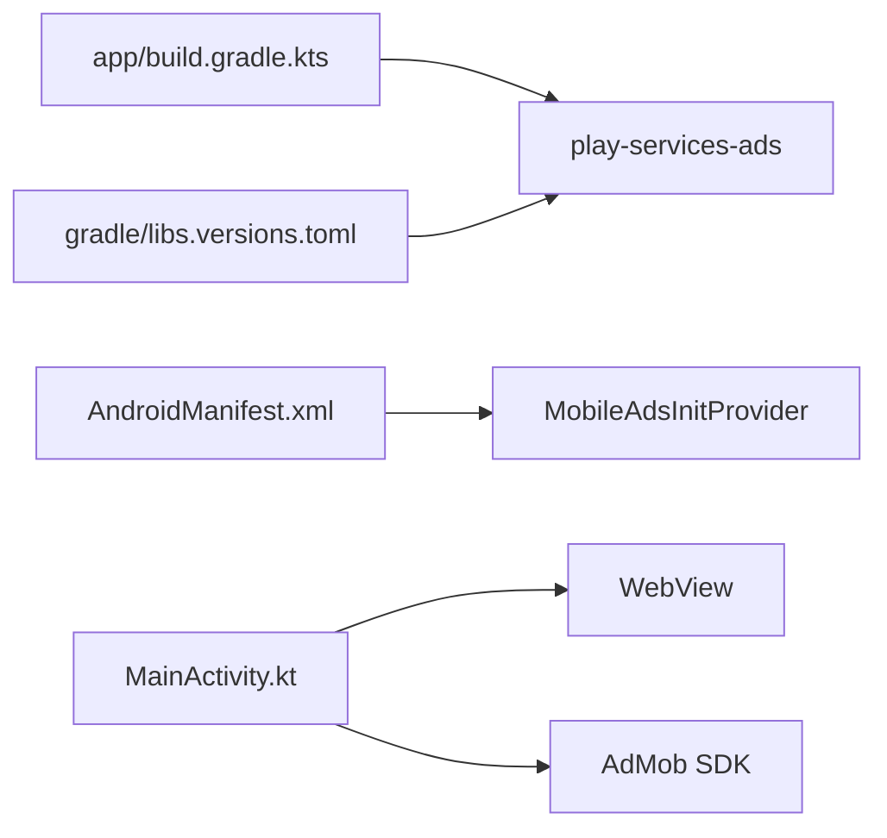

# Troubleshooting & FAQ

<cite>
**Referenced Files in This Document**
- [MainActivity.kt](file://app/src/main/java/com/cktechhub/games/MainActivity.kt)
- [AndroidManifest.xml](file://app/src/main/AndroidManifest.xml)
- [index.html](file://app/src/main/assets/index.html)
- [ADMOB_SETUP.md](file://ADMOB_SETUP.md)
- [build.gradle.kts](file://app/build.gradle.kts)
- [gradle/libs.versions.toml](file://gradle/libs.versions.toml)
- [strings.xml](file://app/src/main/res/values/strings.xml)
</cite>

## Table of Contents
1. [Introduction](#introduction)
2. [Project Structure](#project-structure)
3. [Core Components](#core-components)
4. [Architecture Overview](#architecture-overview)
5. [Detailed Component Analysis](#detailed-component-analysis)
6. [Dependency Analysis](#dependency-analysis)
7. [Performance Considerations](#performance-considerations)
8. [Troubleshooting Guide](#troubleshooting-guide)
9. [Conclusion](#conclusion)
10. [Appendices](#appendices)

## Introduction
This document provides a comprehensive troubleshooting guide and FAQ for the project. It focuses on diagnosing and resolving WebView-related issues, JavaScript bridge communication problems, AdMob integration failures, and performance optimization strategies. It also covers common app crashes, memory leaks, ad loading failures, and game engine errors, with practical diagnostic steps, log analysis techniques, and fixes. Finally, it includes setup, customization, deployment considerations, and preventive best practices.

## Project Structure
The project is an Android application that embeds a self-contained HTML5 game inside a WebView and integrates AdMob for advertising. Key elements:
- Android Activity initializes WebView, AdMob SDK, and UI layout.
- WebView loads a local HTML file from assets and injects a JavaScript bridge to trigger native actions.
- AdMob banner and interstitial ads are configured and preloaded.
- The app enforces safe navigation and logs WebView console messages.

**Diagram sources**
- [AndroidManifest.xml:1-51](file://app/src/main/AndroidManifest.xml#L1-L51)
- [MainActivity.kt:42-135](file://app/src/main/java/com/cktechhub/games/MainActivity.kt#L42-L135)
- [index.html:1-1094](file://app/src/main/assets/index.html#L1-L1094)
- [strings.xml:1-6](file://app/src/main/res/values/strings.xml#L1-L6)

**Section sources**
- [AndroidManifest.xml:1-51](file://app/src/main/AndroidManifest.xml#L1-L51)
- [MainActivity.kt:42-135](file://app/src/main/java/com/cktechhub/games/MainActivity.kt#L42-L135)
- [index.html:1-1094](file://app/src/main/assets/index.html#L1-L1094)
- [strings.xml:1-6](file://app/src/main/res/values/strings.xml#L1-L6)

## Core Components
- WebView and settings: JavaScript enabled, DOM storage, mixed content policy, and safe navigation.
- JavaScript bridge: A named interface exposed to the page to receive events from the game.
- AdMob integration: Banner ad and interstitial ad lifecycle with preloading and callbacks.
- Offline detection: Network availability check and offline UI.
- Logging: WebView console messages and ad load/error logs.

Key implementation references:
- WebView creation and settings: [MainActivity.kt:165-263](file://app/src/main/java/com/cktechhub/games/MainActivity.kt#L165-L263)
- JavaScript bridge registration: [MainActivity.kt:191-192](file://app/src/main/java/com/cktechhub/games/MainActivity.kt#L191-L192)
- Page load and bridge injection: [MainActivity.kt:209-229](file://app/src/main/java/com/cktechhub/games/MainActivity.kt#L209-L229)
- AdMob banner and interstitial setup: [MainActivity.kt:265-409](file://app/src/main/java/com/cktechhub/games/MainActivity.kt#L265-L409)
- Offline UI and retry: [MainActivity.kt:296-364](file://app/src/main/java/com/cktechhub/games/MainActivity.kt#L296-L364)
- WebView crash handling: [MainActivity.kt:231-244](file://app/src/main/java/com/cktechhub/games/MainActivity.kt#L231-L244)

**Section sources**
- [MainActivity.kt:165-263](file://app/src/main/java/com/cktechhub/games/MainActivity.kt#L165-L263)
- [MainActivity.kt:191-192](file://app/src/main/java/com/cktechhub/games/MainActivity.kt#L191-L192)
- [MainActivity.kt:209-229](file://app/src/main/java/com/cktechhub/games/MainActivity.kt#L209-L229)
- [MainActivity.kt:265-409](file://app/src/main/java/com/cktechhub/games/MainActivity.kt#L265-L409)
- [MainActivity.kt:296-364](file://app/src/main/java/com/cktechhub/games/MainActivity.kt#L296-L364)
- [MainActivity.kt:231-244](file://app/src/main/java/com/cktechhub/games/MainActivity.kt#L231-L244)

## Architecture Overview
High-level flow of WebView, JavaScript bridge, and AdMob:

**Diagram sources**
- [MainActivity.kt:130-135](file://app/src/main/java/com/cktechhub/games/MainActivity.kt#L130-L135)
- [MainActivity.kt:209-229](file://app/src/main/java/com/cktechhub/games/MainActivity.kt#L209-L229)
- [MainActivity.kt:428-439](file://app/src/main/java/com/cktechhub/games/MainActivity.kt#L428-L439)
- [MainActivity.kt:370-409](file://app/src/main/java/com/cktechhub/games/MainActivity.kt#L370-L409)

## Detailed Component Analysis

### WebView and JavaScript Bridge
- Purpose: Host the HTML5 game, expose a named bridge for the game to signal completion events, and enforce safe navigation.
- Key behaviors:
  - Only allows loading from local assets.
  - Injects a JavaScript hook to forward level completion to the Android bridge.
  - Logs WebView console messages for diagnostics.
  - Handles renderer process gone events (OOM/system kill) by destroying and reloading the WebView.

**Diagram sources**
- [MainActivity.kt:42-135](file://app/src/main/java/com/cktechhub/games/MainActivity.kt#L42-L135)
- [MainActivity.kt:165-263](file://app/src/main/java/com/cktechhub/games/MainActivity.kt#L165-L263)
- [MainActivity.kt:265-409](file://app/src/main/java/com/cktechhub/games/MainActivity.kt#L265-L409)
- [MainActivity.kt:428-439](file://app/src/main/java/com/cktechhub/games/MainActivity.kt#L428-L439)

**Section sources**
- [MainActivity.kt:165-263](file://app/src/main/java/com/cktechhub/games/MainActivity.kt#L165-L263)
- [MainActivity.kt:209-229](file://app/src/main/java/com/cktechhub/games/MainActivity.kt#L209-L229)
- [MainActivity.kt:231-244](file://app/src/main/java/com/cktechhub/games/MainActivity.kt#L231-L244)
- [MainActivity.kt:428-439](file://app/src/main/java/com/cktechhub/games/MainActivity.kt#L428-L439)

### AdMob Integration
- Banner ad: Created and loaded during activity setup.
- Interstitial ad: Preloaded and shown based on level completion thresholds.
- Initialization: MobileAds initialized early; provider declared in manifest.
- Logging: Successful loads and failures are logged for diagnostics.

**Diagram sources**
- [MainActivity.kt:80-81](file://app/src/main/java/com/cktechhub/games/MainActivity.kt#L80-L81)
- [MainActivity.kt:265-277](file://app/src/main/java/com/cktechhub/games/MainActivity.kt#L265-L277)
- [MainActivity.kt:370-409](file://app/src/main/java/com/cktechhub/games/MainActivity.kt#L370-L409)
- [AndroidManifest.xml:20-28](file://app/src/main/AndroidManifest.xml#L20-L28)

**Section sources**
- [MainActivity.kt:265-277](file://app/src/main/java/com/cktechhub/games/MainActivity.kt#L265-L277)
- [MainActivity.kt:370-409](file://app/src/main/java/com/cktechhub/games/MainActivity.kt#L370-L409)
- [AndroidManifest.xml:20-28](file://app/src/main/AndroidManifest.xml#L20-L28)

### Offline and Connectivity
- The app checks for internet availability before initializing UI.
- If offline, a dedicated screen is shown with a retry button.

**Diagram sources**
- [MainActivity.kt:74-78](file://app/src/main/java/com/cktechhub/games/MainActivity.kt#L74-L78)
- [MainActivity.kt:296-364](file://app/src/main/java/com/cktechhub/games/MainActivity.kt#L296-L364)

**Section sources**
- [MainActivity.kt:74-78](file://app/src/main/java/com/cktechhub/games/MainActivity.kt#L74-L78)
- [MainActivity.kt:296-364](file://app/src/main/java/com/cktechhub/games/MainActivity.kt#L296-L364)
- [strings.xml:1-6](file://app/src/main/res/values/strings.xml#L1-L6)

## Dependency Analysis
- AndroidX and Kotlin versions are defined centrally.
- Play Services Ads dependency is included for AdMob.
- Application-level permissions and providers are declared in the manifest.

**Diagram sources**
- [app/build.gradle.kts:34-43](file://app/build.gradle.kts#L34-L43)
- [gradle/libs.versions.toml:13-21](file://gradle/libs.versions.toml#L13-L21)
- [AndroidManifest.xml:44-48](file://app/src/main/AndroidManifest.xml#L44-L48)
- [MainActivity.kt:42-135](file://app/src/main/java/com/cktechhub/games/MainActivity.kt#L42-L135)

**Section sources**
- [app/build.gradle.kts:34-43](file://app/build.gradle.kts#L34-L43)
- [gradle/libs.versions.toml:13-21](file://gradle/libs.versions.toml#L13-L21)
- [AndroidManifest.xml:44-48](file://app/src/main/AndroidManifest.xml#L44-L48)

## Performance Considerations
- WebView settings:
  - Mixed content disabled to avoid insecure resource loading.
  - JavaScript and DOM storage enabled for game functionality.
  - Zoom controls disabled to prevent accidental zoom.
  - Cache mode set to default; consider enabling caching for repeated gameplay.
- Memory:
  - Renderer process gone handling attempts to recover from OOM/system kills.
  - Proper lifecycle management ensures WebView and AdView are paused/resumed and destroyed appropriately.
- Ads:
  - Interstitial preloading reduces latency.
  - Banner ad is loaded immediately upon creation.

Recommendations:
- Enable appropriate caching policies for static assets.
- Monitor memory usage during extended gameplay sessions.
- Keep WebView and AdMob SDK versions aligned with library updates.

**Section sources**
- [MainActivity.kt:172-189](file://app/src/main/java/com/cktechhub/games/MainActivity.kt#L172-L189)
- [MainActivity.kt:231-244](file://app/src/main/java/com/cktechhub/games/MainActivity.kt#L231-L244)
- [MainActivity.kt:137-154](file://app/src/main/java/com/cktechhub/games/MainActivity.kt#L137-L154)

## Troubleshooting Guide

### WebView-related Problems
Common symptoms:
- Blank screen or white page.
- JavaScript not executing.
- External links opening in browser unexpectedly.
- Console errors in WebView.

Diagnostic steps:
- Verify the game file path is correct and accessible.
  - Reference: [MainActivity.kt:130-131](file://app/src/main/java/com/cktechhub/games/MainActivity.kt#L130-L131)
- Confirm JavaScript is enabled and DOM storage is enabled.
  - Reference: [MainActivity.kt:174-176](file://app/src/main/java/com/cktechhub/games/MainActivity.kt#L174-L176)
- Ensure mixed content is blocked and HTTPS is used for external resources.
  - Reference: [MainActivity.kt:185](file://app/src/main/java/com/cktechhub/games/MainActivity.kt#L185)
- Check that only local asset URLs are allowed.
  - Reference: [MainActivity.kt:200-207](file://app/src/main/java/com/cktechhub/games/MainActivity.kt#L200-L207)
- Review WebView console logs for JS errors.
  - Reference: [MainActivity.kt:248-256](file://app/src/main/java/com/cktechhub/games/MainActivity.kt#L248-L256)
- Investigate renderer process gone events and consider reducing memory-intensive operations.
  - Reference: [MainActivity.kt:231-244](file://app/src/main/java/com/cktechhub/games/MainActivity.kt#L231-L244)

Fix checklist:
- Replace incorrect asset paths with the correct local path.
- Re-enable JavaScript and DOM storage if disabled.
- Update WebView settings to allow mixed content only if necessary and secure.
- Ensure the page does not attempt to navigate outside local assets.
- Clear WebView cache if stale resources cause issues.

**Section sources**
- [MainActivity.kt:130-131](file://app/src/main/java/com/cktechhub/games/MainActivity.kt#L130-L131)
- [MainActivity.kt:174-176](file://app/src/main/java/com/cktechhub/games/MainActivity.kt#L174-L176)
- [MainActivity.kt:185](file://app/src/main/java/com/cktechhub/games/MainActivity.kt#L185)
- [MainActivity.kt:200-207](file://app/src/main/java/com/cktechhub/games/MainActivity.kt#L200-L207)
- [MainActivity.kt:248-256](file://app/src/main/java/com/cktechhub/games/MainActivity.kt#L248-L256)
- [MainActivity.kt:231-244](file://app/src/main/java/com/cktechhub/games/MainActivity.kt#L231-L244)

### JavaScript Bridge Communication Issues
Common symptoms:
- Game completion events not triggering interstitial ads.
- JavaScript cannot call AndroidBridge methods.

Diagnostic steps:
- Confirm the bridge is registered with the correct name.
  - Reference: [MainActivity.kt:192](file://app/src/main/java/com/cktechhub/games/MainActivity.kt#L192)
- Verify the bridge injection occurs after page load.
  - Reference: [MainActivity.kt:214-229](file://app/src/main/java/com/cktechhub/games/MainActivity.kt#L214-L229)
- Check that the game invokes the method on the bridge.
  - Reference: [index.html:752-754](file://app/src/main/assets/index.html#L752-L754)
- Review logs for bridge invocations.
  - Reference: [MainActivity.kt:431-438](file://app/src/main/java/com/cktechhub/games/MainActivity.kt#L431-L438)

Fix checklist:
- Ensure the bridge is attached before evaluating JavaScript hooks.
- Confirm the injected hook wraps the original function and calls the bridge.
- Validate that the game’s completion handler calls the bridge method.

**Section sources**
- [MainActivity.kt:192](file://app/src/main/java/com/cktechhub/games/MainActivity.kt#L192)
- [MainActivity.kt:214-229](file://app/src/main/java/com/cktechhub/games/MainActivity.kt#L214-L229)
- [index.html:752-754](file://app/src/main/assets/index.html#L752-L754)
- [MainActivity.kt:431-438](file://app/src/main/java/com/cktechhub/games/MainActivity.kt#L431-L438)

### AdMob Integration Failures
Common symptoms:
- Banner ad not visible.
- Interstitial ad fails to load or show.
- App ID or Ad Unit ID errors.

Diagnostic steps:
- Confirm AdMob App ID and Ad Unit IDs are present in manifest and code.
  - References: [AndroidManifest.xml:20-23](file://app/src/main/AndroidManifest.xml#L20-L23), [MainActivity.kt:54-56](file://app/src/main/java/com/cktechhub/games/MainActivity.kt#L54-L56)
- Check AdMob initialization and provider configuration.
  - References: [MainActivity.kt:80-81](file://app/src/main/java/com/cktechhub/games/MainActivity.kt#L80-L81), [AndroidManifest.xml:44-48](file://app/src/main/AndroidManifest.xml#L44-L48)
- Review ad load and show callbacks for warnings or errors.
  - References: [MainActivity.kt:376-398](file://app/src/main/java/com/cktechhub/games/MainActivity.kt#L376-L398), [MainActivity.kt:402-409](file://app/src/main/java/com/cktechhub/games/MainActivity.kt#L402-L409)
- Validate interstitial frequency setting.
  - Reference: [MainActivity.kt:58-60](file://app/src/main/java/com/cktechhub/games/MainActivity.kt#L58-L60)

Fix checklist:
- Replace test IDs with production IDs before release.
- Ensure the provider authorities match the application ID.
- Rebuild and test on a physical device.
- Allow time for newly created ad units to become active.

**Section sources**
- [AndroidManifest.xml:20-23](file://app/src/main/AndroidManifest.xml#L20-L23)
- [AndroidManifest.xml:44-48](file://app/src/main/AndroidManifest.xml#L44-L48)
- [MainActivity.kt:54-56](file://app/src/main/java/com/cktechhub/games/MainActivity.kt#L54-L56)
- [MainActivity.kt:80-81](file://app/src/main/java/com/cktechhub/games/MainActivity.kt#L80-L81)
- [MainActivity.kt:376-398](file://app/src/main/java/com/cktechhub/games/MainActivity.kt#L376-L398)
- [MainActivity.kt:402-409](file://app/src/main/java/com/cktechhub/games/MainActivity.kt#L402-L409)
- [MainActivity.kt:58-60](file://app/src/main/java/com/cktechhub/games/MainActivity.kt#L58-L60)

### App Crashes and Memory Leaks
Common symptoms:
- App force closes during gameplay.
- Renderer process gone logs indicating OOM/system kill.
- Memory spikes during animations or particle effects.

Diagnostic steps:
- Review renderer process gone logs and recovery behavior.
  - Reference: [MainActivity.kt:231-244](file://app/src/main/java/com/cktechhub/games/MainActivity.kt#L231-L244)
- Inspect lifecycle methods for proper pause/resume/destroy calls.
  - References: [MainActivity.kt:137-154](file://app/src/main/java/com/cktechhub/games/MainActivity.kt#L137-L154)
- Evaluate heavy operations in the game (particles, timers, frequent DOM updates).
  - Reference: [index.html:426-469](file://app/src/main/assets/index.html#L426-L469)

Fix checklist:
- Reduce memory-intensive operations or optimize rendering.
- Ensure WebView and AdView are destroyed in onDestroy.
- Consider disabling heavy effects in low-memory scenarios.

**Section sources**
- [MainActivity.kt:231-244](file://app/src/main/java/com/cktechhub/games/MainActivity.kt#L231-L244)
- [MainActivity.kt:137-154](file://app/src/main/java/com/cktechhub/games/MainActivity.kt#L137-L154)
- [index.html:426-469](file://app/src/main/assets/index.html#L426-L469)

### Game Engine Errors
Common symptoms:
- Game not responding to clicks/touches.
- Animations not playing or visuals glitching.
- Level completion not detected.

Diagnostic steps:
- Confirm event delegation and touch/click handlers are active.
  - Reference: [index.html:664-689](file://app/src/main/assets/index.html#L664-L689)
- Verify completion detection logic and hook invocation.
  - References: [index.html:751-754](file://app/src/main/assets/index.html#L751-L754), [MainActivity.kt:214-229](file://app/src/main/java/com/cktechhub/games/MainActivity.kt#L214-L229)
- Check for JavaScript errors in WebView console logs.
  - Reference: [MainActivity.kt:248-256](file://app/src/main/java/com/cktechhub/games/MainActivity.kt#L248-L256)

Fix checklist:
- Reinitialize event listeners after page load.
- Ensure the completion hook is injected and wraps the original function.
- Validate game logic correctness and avoid blocking the UI thread.

**Section sources**
- [index.html:664-689](file://app/src/main/assets/index.html#L664-L689)
- [index.html:751-754](file://app/src/main/assets/index.html#L751-L754)
- [MainActivity.kt:214-229](file://app/src/main/java/com/cktechhub/games/MainActivity.kt#L214-L229)
- [MainActivity.kt:248-256](file://app/src/main/java/com/cktechhub/games/MainActivity.kt#L248-L256)

### Build Failures and Runtime Errors
Common symptoms:
- Build errors related to dependencies or versions.
- Runtime errors due to missing permissions or providers.

Diagnostic steps:
- Verify dependency versions and plugin configurations.
  - References: [app/build.gradle.kts:1-43](file://app/build.gradle.kts#L1-L43), [gradle/libs.versions.toml:1-28](file://gradle/libs.versions.toml#L1-L28)
- Confirm required permissions and providers are declared.
  - References: [AndroidManifest.xml:5-7](file://app/src/main/AndroidManifest.xml#L5-L7), [AndroidManifest.xml:44-48](file://app/src/main/AndroidManifest.xml#L44-L48)

Fix checklist:
- Align dependency versions with supported combinations.
- Ensure all required permissions and providers are present.

**Section sources**
- [app/build.gradle.kts:1-43](file://app/build.gradle.kts#L1-L43)
- [gradle/libs.versions.toml:1-28](file://gradle/libs.versions.toml#L1-L28)
- [AndroidManifest.xml:5-7](file://app/src/main/AndroidManifest.xml#L5-L7)
- [AndroidManifest.xml:44-48](file://app/src/main/AndroidManifest.xml#L44-L48)

### Frequently Asked Questions (FAQ)

Q: How do I replace test AdMob IDs with production IDs?
A: Update the App ID in the manifest and the Banner/Interstitial Unit IDs in the Activity. See the setup guide for exact locations and values.
- References: [ADMOB_SETUP.md:13-31](file://ADMOB_SETUP.md#L13-L31), [ADMOB_SETUP.md:36-62](file://ADMOB_SETUP.md#L36-L62), [AndroidManifest.xml:20-23](file://app/src/main/AndroidManifest.xml#L20-L23), [MainActivity.kt:54-56](file://app/src/main/java/com/cktechhub/games/MainActivity.kt#L54-L56)

Q: Why is my interstitial not showing?
A: Ensure the interstitial is loaded and the completion threshold is met. Check logs for load/show failures.
- References: [MainActivity.kt:376-398](file://app/src/main/java/com/cktechhub/games/MainActivity.kt#L376-L398), [MainActivity.kt:402-409](file://app/src/main/java/com/cktechhub/games/MainActivity.kt#L402-L409)

Q: How do I customize the interstitial frequency?
A: Adjust the frequency constant in the Activity.
- Reference: [MainActivity.kt:58-60](file://app/src/main/java/com/cktechhub/games/MainActivity.kt#L58-L60)

Q: Can I use this project on an emulator?
A: Test on a real device; emulators may not render ads properly.
- Reference: [ADMOB_SETUP.md:102-103](file://ADMOB_SETUP.md#L102-L103)

Q: How do I enable offline mode?
A: The app displays an offline screen if no internet is available; retry to reload.
- References: [MainActivity.kt:74-78](file://app/src/main/java/com/cktechhub/games/MainActivity.kt#L74-L78), [MainActivity.kt:296-364](file://app/src/main/java/com/cktechhub/games/MainActivity.kt#L296-L364)

Q: How do I disable the immersive mode?
A: Modify the immersive mode setup in the Activity.
- Reference: [MainActivity.kt:415-422](file://app/src/main/java/com/cktechhub/games/MainActivity.kt#L415-L422)

Q: How do I add more ad units?
A: Create additional ad units in the AdMob console and integrate them similarly to the existing banner/interstitial.
- Reference: [ADMOB_SETUP.md:72-76](file://ADMOB_SETUP.md#L72-L76)

Q: How do I collect logs for debugging?
A: Use the Android logcat output for WebView console logs and AdMob load/error logs.
- References: [MainActivity.kt:248-256](file://app/src/main/java/com/cktechhub/games/MainActivity.kt#L248-L256), [MainActivity.kt:394-397](file://app/src/main/java/com/cktechhub/games/MainActivity.kt#L394-L397)

## Conclusion
This guide consolidates actionable troubleshooting steps for WebView, JavaScript bridge, and AdMob integration issues, along with performance optimization and preventive best practices. Use the references and diagrams to quickly locate relevant code and resolve common problems efficiently.

## Appendices

### Practical Diagnostic Checklist
- WebView
  - Asset path correct: [MainActivity.kt:130-131](file://app/src/main/java/com/cktechhub/games/MainActivity.kt#L130-L131)
  - JavaScript/DOM enabled: [MainActivity.kt:174-176](file://app/src/main/java/com/cktechhub/games/MainActivity.kt#L174-L176)
  - Mixed content policy: [MainActivity.kt:185](file://app/src/main/java/com/cktechhub/games/MainActivity.kt#L185)
  - Safe navigation: [MainActivity.kt:200-207](file://app/src/main/java/com/cktechhub/games/MainActivity.kt#L200-L207)
  - Console logs: [MainActivity.kt:248-256](file://app/src/main/java/com/cktechhub/games/MainActivity.kt#L248-L256)
- JavaScript Bridge
  - Bridge registered: [MainActivity.kt:192](file://app/src/main/java/com/cktechhub/games/MainActivity.kt#L192)
  - Injection after load: [MainActivity.kt:214-229](file://app/src/main/java/com/cktechhub/games/MainActivity.kt#L214-L229)
  - Hook invoked by game: [index.html:752-754](file://app/src/main/assets/index.html#L752-L754)
- AdMob
  - App ID and Unit IDs: [AndroidManifest.xml:20-23](file://app/src/main/AndroidManifest.xml#L20-L23), [MainActivity.kt:54-56](file://app/src/main/java/com/cktechhub/games/MainActivity.kt#L54-L56)
  - Provider configured: [AndroidManifest.xml:44-48](file://app/src/main/AndroidManifest.xml#L44-L48)
  - Load/show callbacks: [MainActivity.kt:376-398](file://app/src/main/java/com/cktechhub/games/MainActivity.kt#L376-L398), [MainActivity.kt:402-409](file://app/src/main/java/com/cktechhub/games/MainActivity.kt#L402-L409)
- Offline and Connectivity
  - Network check: [MainActivity.kt:296-302](file://app/src/main/java/com/cktechhub/games/MainActivity.kt#L296-L302)
  - Offline UI: [MainActivity.kt:304-364](file://app/src/main/java/com/cktechhub/games/MainActivity.kt#L304-L364)
- Lifecycle and Memory
  - Lifecycle methods: [MainActivity.kt:137-154](file://app/src/main/java/com/cktechhub/games/MainActivity.kt#L137-L154)
  - Renderer gone handling: [MainActivity.kt:231-244](file://app/src/main/java/com/cktechhub/games/MainActivity.kt#L231-L244)
  - Game engine: [index.html:426-469](file://app/src/main/assets/index.html#L426-L469)