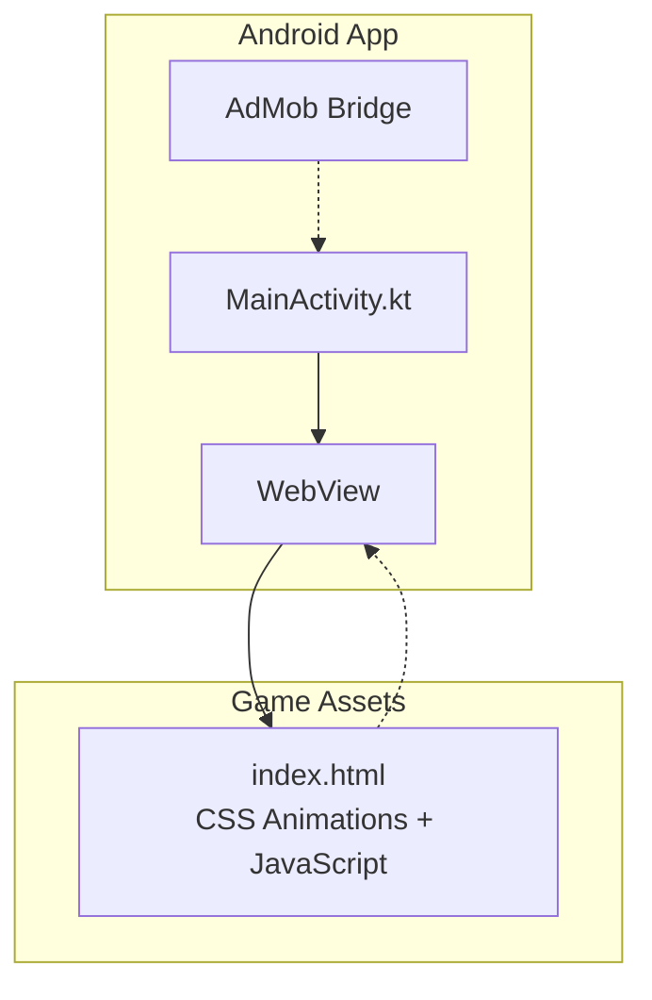
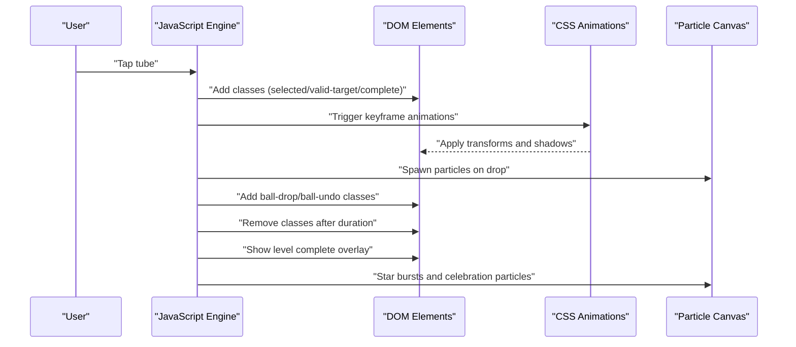
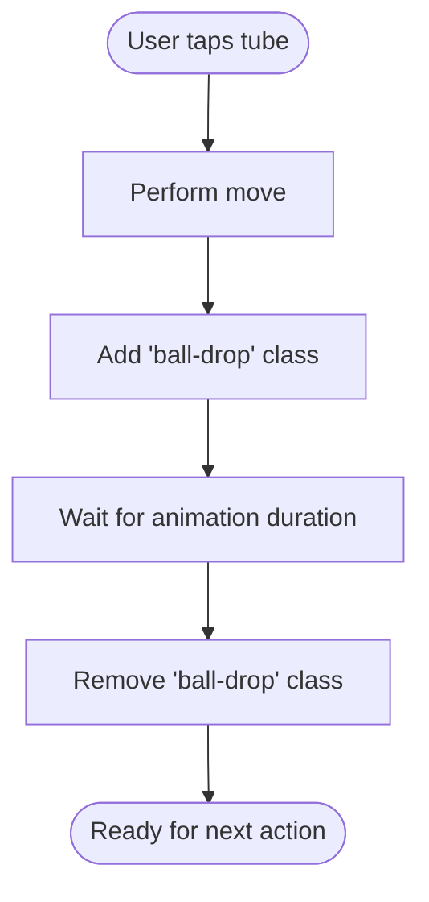
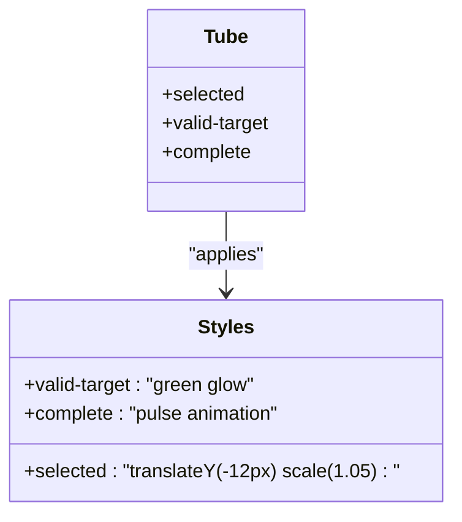
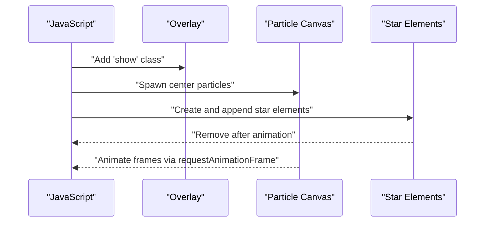
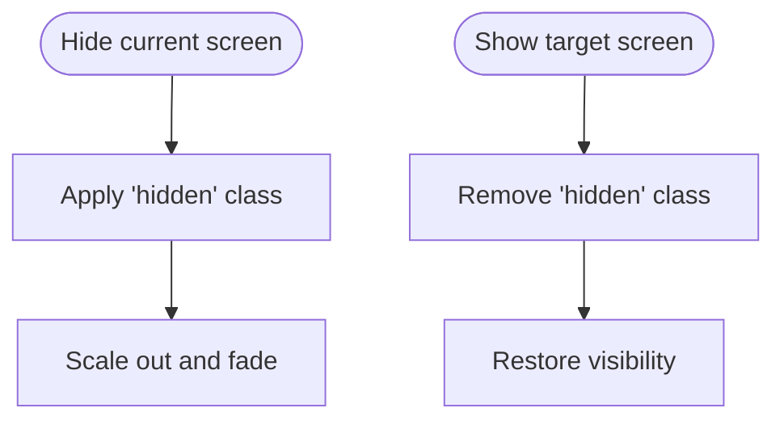
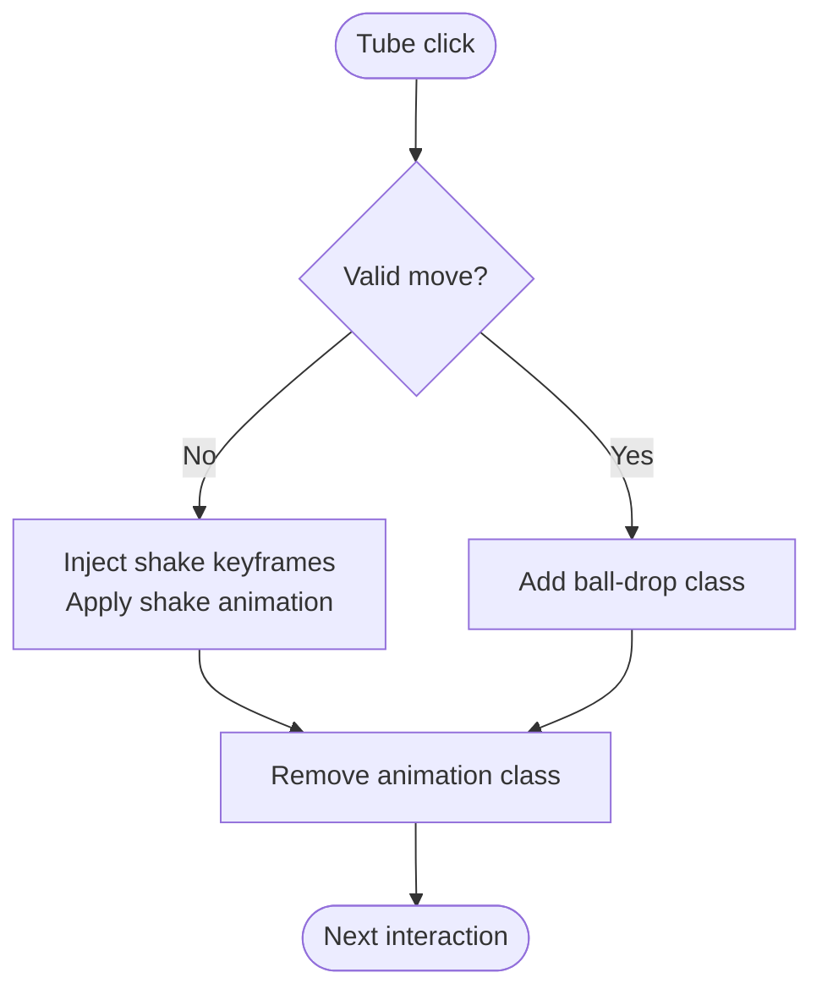
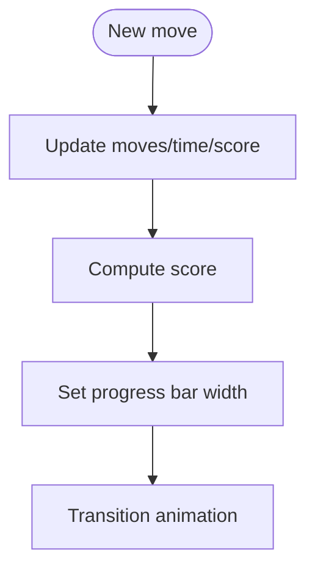
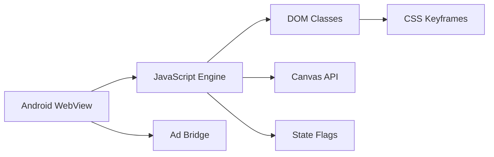

# Animation Framework

<cite>
**Referenced Files in This Document**
- [index.html](file://app/src/main/assets/index.html)
- [MainActivity.kt](file://app/src/main/java/com/cktechhub/games/MainActivity.kt)
- [strings.xml](file://app/src/main/res/values/strings.xml)
- [themes.xml](file://app/src/main/res/values/themes.xml)
</cite>

## Table of Contents
1. [Introduction](#introduction)
2. [Project Structure](#project-structure)
3. [Core Components](#core-components)
4. [Architecture Overview](#architecture-overview)
5. [Detailed Component Analysis](#detailed-component-analysis)
6. [Dependency Analysis](#dependency-analysis)
7. [Performance Considerations](#performance-considerations)
8. [Troubleshooting Guide](#troubleshooting-guide)
9. [Conclusion](#conclusion)

## Introduction
This document describes the CSS and JavaScript animation framework powering the Ball Sort Puzzle game. It covers:
- Ball drop animations and bounce effects
- Tube selection and validation highlights
- Level completion celebrations with particle systems and star bursts
- UI transitions and screen management
- JavaScript-driven animations including undo effects, shake animations, and progress indicators
- Configuration options for animation timing, easing, and performance controls
- Practical examples for triggering animations, controlling timing, and responsive behavior
- Mobile-specific considerations including viewport configuration, hardware acceleration, smooth scrolling, and touch interactions
- Integration between CSS animations and JavaScript state changes

## Project Structure
The animation system is implemented entirely within a single HTML file packaged as an Android asset. The Android app hosts this HTML inside a WebView and injects a JavaScript bridge to coordinate with native advertising features.

**Diagram sources**
- [MainActivity.kt:165-263](file://app/src/main/java/com/cktechhub/games/MainActivity.kt#L165-L263)
- [index.html:1-203](file://app/src/main/assets/index.html#L1-L203)

**Section sources**
- [index.html:1-203](file://app/src/main/assets/index.html#L1-L203)
- [MainActivity.kt:165-263](file://app/src/main/java/com/cktechhub/games/MainActivity.kt#L165-L263)

## Core Components
- CSS keyframes and classes define animations for:
  - Ball drop and bounce
  - Tube selection, validation, and completion pulses
  - Hint flashes and shake animations
  - Undo effects and star bursts
- JavaScript orchestrates:
  - State-driven animation triggers
  - Timing controls and cleanup
  - Particle systems and celebratory effects
  - Responsive rendering and UI transitions
- Android WebView integrates the HTML/CSS/JS and exposes a bridge for native features

Key implementation references:
- CSS animations and keyframes: [index.html:74-179](file://app/src/main/assets/index.html#L74-L179)
- JavaScript-driven triggers and timers: [index.html:745-778](file://app/src/main/assets/index.html#L745-L778)
- Particle system and canvas rendering: [index.html:426-469](file://app/src/main/assets/index.html#L426-L469)
- Screen transitions and overlays: [index.html:13-92](file://app/src/main/assets/index.html#L13-L92)
- Shake animation injection: [index.html:1069-1071](file://app/src/main/assets/index.html#L1069-L1071)

**Section sources**
- [index.html:74-179](file://app/src/main/assets/index.html#L74-L179)
- [index.html:426-469](file://app/src/main/assets/index.html#L426-L469)
- [index.html:13-92](file://app/src/main/assets/index.html#L13-L92)
- [index.html:1069-1071](file://app/src/main/assets/index.html#L1069-L1071)

## Architecture Overview
The animation pipeline combines CSS keyframes with JavaScript state updates. CSS handles motion and timing; JavaScript manages lifecycle, triggers, and cleanup.

**Diagram sources**
- [index.html:694-755](file://app/src/main/assets/index.html#L694-L755)
- [index.html:745-778](file://app/src/main/assets/index.html#L745-L778)
- [index.html:853-896](file://app/src/main/assets/index.html#L853-L896)

## Detailed Component Analysis

### Ball Drop and Bounce Animations
- Ball drop animation applies a short-duration curve to simulate gravity and landing.
- Ball bounce animation emphasizes the impact when a ball settles into a tube.
- Both rely on CSS keyframes and are toggled via class manipulation in JavaScript.

Implementation references:
- Ball drop class and keyframe: [index.html:74-79](file://app/src/main/assets/index.html#L74-L79)
- Ball bounce class and keyframe: [index.html:80-83](file://app/src/main/assets/index.html#L80-L83)
- Triggering drop animation: [index.html:745-747](file://app/src/main/assets/index.html#L745-L747)
- Triggering undo animation: [index.html:774-777](file://app/src/main/assets/index.html#L774-L777)

**Diagram sources**
- [index.html:745-747](file://app/src/main/assets/index.html#L745-L747)

**Section sources**
- [index.html:74-83](file://app/src/main/assets/index.html#L74-L83)
- [index.html:745-747](file://app/src/main/assets/index.html#L745-L747)
- [index.html:774-777](file://app/src/main/assets/index.html#L774-L777)

### Tube Selection and Validation Highlights
- Selected tube: lifted and scaled with a blue glow.
- Valid target tube: green glow indicating a legal move.
- Completed tube: pulsing yellow glow animation.

Implementation references:
- Tube styles and states: [index.html:25-57](file://app/src/main/assets/index.html#L25-L57)
- Applying states during render: [index.html:593-596](file://app/src/main/assets/index.html#L593-L596)

**Diagram sources**
- [index.html:25-57](file://app/src/main/assets/index.html#L25-L57)

**Section sources**
- [index.html:25-57](file://app/src/main/assets/index.html#L25-L57)
- [index.html:593-596](file://app/src/main/assets/index.html#L593-L596)

### Level Completion Celebrations
- Overlay fades in with animated stars and particle bursts.
- Celebration particles originate from the center and reflect level colors.
- Stars are appended dynamically and removed after animation completes.

Implementation references:
- Level complete overlay: [index.html:85-92](file://app/src/main/assets/index.html#L85-L92)
- Overlay trigger and summary: [index.html:853-870](file://app/src/main/assets/index.html#L853-L870)
- Particle burst from center: [index.html:872-877](file://app/src/main/assets/index.html#L872-L877)
- Star burst spawning: [index.html:883-896](file://app/src/main/assets/index.html#L883-L896)

**Diagram sources**
- [index.html:853-896](file://app/src/main/assets/index.html#L853-L896)
- [index.html:426-469](file://app/src/main/assets/index.html#L426-L469)

**Section sources**
- [index.html:85-92](file://app/src/main/assets/index.html#L85-L92)
- [index.html:853-896](file://app/src/main/assets/index.html#L853-L896)
- [index.html:426-469](file://app/src/main/assets/index.html#L426-L469)

### UI Transitions and Screen Management
- Screen transitions use opacity and transform with easing for smooth fade and scale.
- Hidden screens disable pointer events and are visually scaled out.

Implementation references:
- Screen transition styles: [index.html:13-16](file://app/src/main/assets/index.html#L13-L16)
- Showing/hiding screens: [index.html:901-906](file://app/src/main/assets/index.html#L901-L906)

**Diagram sources**
- [index.html:13-16](file://app/src/main/assets/index.html#L13-L16)
- [index.html:901-906](file://app/src/main/assets/index.html#L901-L906)

**Section sources**
- [index.html:13-16](file://app/src/main/assets/index.html#L13-L16)
- [index.html:901-906](file://app/src/main/assets/index.html#L901-L906)

### JavaScript-Driven Animations
- Shake animation: injected via a dynamic style element and triggered on invalid moves.
- Undo animation: scales and rotates balls to indicate reversal.
- Hint flash: temporary highlight for suggested tubes.

Implementation references:
- Shake keyframes injection: [index.html:1069-1071](file://app/src/main/assets/index.html#L1069-L1071)
- Triggering shake on invalid move: [index.html:716-721](file://app/src/main/assets/index.html#L716-L721)
- Undo animation trigger: [index.html:774-777](file://app/src/main/assets/index.html#L774-L777)
- Hint flash trigger: [index.html:810-814](file://app/src/main/assets/index.html#L810-L814)

**Diagram sources**
- [index.html:716-721](file://app/src/main/assets/index.html#L716-L721)
- [index.html:745-747](file://app/src/main/assets/index.html#L745-L747)
- [index.html:1069-1071](file://app/src/main/assets/index.html#L1069-L1071)

**Section sources**
- [index.html:1069-1071](file://app/src/main/assets/index.html#L1069-L1071)
- [index.html:716-721](file://app/src/main/assets/index.html#L716-L721)
- [index.html:774-777](file://app/src/main/assets/index.html#L774-L777)
- [index.html:810-814](file://app/src/main/assets/index.html#L810-L814)

### Progress Indicators and Stats
- Progress bar width transitions smoothly with easing.
- Moves, time, and score update live; score computation factors time and moves.

Implementation references:
- Progress bar transition: [index.html:182](file://app/src/main/assets/index.html#L182)
- Updating stats and progress: [index.html:836-840](file://app/src/main/assets/index.html#L836-L840)
- Score calculation: [index.html:841-848](file://app/src/main/assets/index.html#L841-L848)

**Diagram sources**
- [index.html:836-848](file://app/src/main/assets/index.html#L836-L848)
- [index.html:182](file://app/src/main/assets/index.html#L182)

**Section sources**
- [index.html:182](file://app/src/main/assets/index.html#L182)
- [index.html:836-848](file://app/src/main/assets/index.html#L836-L848)

### Configuration Options
- Animation timing and easing:
  - Ball drop: short duration with custom cubic-bezier
  - Ball bounce: moderate duration with ease
  - Hint flash: repeated 3 times with ease
  - Undo: brief duration with ease
  - Shake: short duration with ease
  - Progress bar: 0.5s ease transition
- Performance controls:
  - Global animation toggle stored in settings
  - Particles toggle for performance-sensitive devices
  - Sound toggle to reduce audio overhead
- Storage-backed settings persistence for sound, animations, and particles

Implementation references:
- Animation timings and easing: [index.html:74-83](file://app/src/main/assets/index.html#L74-L83), [index.html:163-168](file://app/src/main/assets/index.html#L163-L168), [index.html:182](file://app/src/main/assets/index.html#L182)
- Settings toggles and persistence: [index.html:1028-1046](file://app/src/main/assets/index.html#L1028-L1046)
- State flags: [index.html:361-377](file://app/src/main/assets/index.html#L361-L377)

**Section sources**
- [index.html:74-83](file://app/src/main/assets/index.html#L74-L83)
- [index.html:163-168](file://app/src/main/assets/index.html#L163-L168)
- [index.html:182](file://app/src/main/assets/index.html#L182)
- [index.html:1028-1046](file://app/src/main/assets/index.html#L1028-L1046)
- [index.html:361-377](file://app/src/main/assets/index.html#L361-L377)

### Practical Examples
- Triggering a ball drop animation:
  - Add the drop class to the top ball element and remove it after the animation duration.
  - Reference: [index.html:745-747](file://app/src/main/assets/index.html#L745-L747)
- Performing an undo:
  - Apply the undo class to all balls and remove it after the animation duration.
  - Reference: [index.html:774-777](file://app/src/main/assets/index.html#L774-L777)
- Shaking an invalid tube:
  - Dynamically inject shake keyframes and apply the shake class; remove after duration.
  - Reference: [index.html:1069-1071](file://app/src/main/assets/index.html#L1069-L1071), [index.html:716-721](file://app/src/main/assets/index.html#L716-L721)
- Showing a hint:
  - Add the hint-flash class to source and target tubes; remove after duration.
  - Reference: [index.html:810-814](file://app/src/main/assets/index.html#L810-L814)
- Responsive animation behavior:
  - Adjust tube layout and ball sizes on resize; re-render tubes to maintain consistent animations.
  - Reference: [index.html:548-576](file://app/src/main/assets/index.html#L548-L576), [index.html:1058-1064](file://app/src/main/assets/index.html#L1058-L1064)

**Section sources**
- [index.html:745-747](file://app/src/main/assets/index.html#L745-L747)
- [index.html:774-777](file://app/src/main/assets/index.html#L774-L777)
- [index.html:1069-1071](file://app/src/main/assets/index.html#L1069-L1071)
- [index.html:716-721](file://app/src/main/assets/index.html#L716-L721)
- [index.html:810-814](file://app/src/main/assets/index.html#L810-L814)
- [index.html:548-576](file://app/src/main/assets/index.html#L548-L576)
- [index.html:1058-1064](file://app/src/main/assets/index.html#L1058-L1064)

### Mobile-Specific Considerations
- Viewport configuration ensures fixed scaling and disables user zoom to prevent layout shifts during animations.
- Touch handling uses passive/non-passive listeners to avoid blocking the UI thread.
- Hardware acceleration:
  - CSS transforms and opacity changes leverage GPU-accelerated compositing.
  - requestAnimationFrame drives particle animation loops efficiently.
- Smooth scrolling:
  - WebView settings disable overscroll and scrollbar rendering to minimize jank.
- Safe areas:
  - Bottom padding accommodates device notches and home indicators.

Implementation references:
- Viewport meta tag: [index.html:5](file://app/src/main/assets/index.html#L5)
- Touch listener with passive flag: [index.html:678-688](file://app/src/main/assets/index.html#L678-L688)
- requestAnimationFrame loop: [index.html:466-469](file://app/src/main/assets/index.html#L466-L469)
- WebView settings for smoothness: [MainActivity.kt:172-189](file://app/src/main/java/com/cktechhub/games/MainActivity.kt#L172-L189)
- Safe area padding: [index.html:193](file://app/src/main/assets/index.html#L193)

**Section sources**
- [index.html:5](file://app/src/main/assets/index.html#L5)
- [index.html:678-688](file://app/src/main/assets/index.html#L678-L688)
- [index.html:466-469](file://app/src/main/assets/index.html#L466-L469)
- [MainActivity.kt:172-189](file://app/src/main/java/com/cktechhub/games/MainActivity.kt#L172-L189)
- [index.html:193](file://app/src/main/assets/index.html#L193)

### Integration Between CSS Animations and JavaScript State Changes
- JavaScript updates state and renders tubes, applying CSS classes that trigger animations.
- Animations are controlled via class toggling and timed removal to prevent overlap.
- Dynamic style injection allows runtime customization of shake animations.

Implementation references:
- Rendering and class application: [index.html:578-624](file://app/src/main/assets/index.html#L578-L624)
- State-driven triggers: [index.html:694-755](file://app/src/main/assets/index.html#L694-L755)
- Dynamic keyframes injection: [index.html:1069-1071](file://app/src/main/assets/index.html#L1069-L1071)

**Section sources**
- [index.html:578-624](file://app/src/main/assets/index.html#L578-L624)
- [index.html:694-755](file://app/src/main/assets/index.html#L694-L755)
- [index.html:1069-1071](file://app/src/main/assets/index.html#L1069-L1071)

## Dependency Analysis
- CSS animations depend on:
  - Element classes applied by JavaScript
  - Timing durations and easing functions defined in keyframes
- JavaScript depends on:
  - DOM structure and CSS class names
  - State flags for enabling/disabling animations
  - Canvas API for particle rendering
- Android WebView bridges:
  - Exposes a JavaScript interface to native code
  - Ensures safe navigation and page lifecycle integration

**Diagram sources**
- [index.html:578-624](file://app/src/main/assets/index.html#L578-L624)
- [index.html:426-469](file://app/src/main/assets/index.html#L426-L469)
- [MainActivity.kt:165-263](file://app/src/main/java/com/cktechhub/games/MainActivity.kt#L165-L263)

**Section sources**
- [index.html:578-624](file://app/src/main/assets/index.html#L578-L624)
- [index.html:426-469](file://app/src/main/assets/index.html#L426-L469)
- [MainActivity.kt:165-263](file://app/src/main/java/com/cktechhub/games/MainActivity.kt#L165-L263)

## Performance Considerations
- Prefer transform and opacity changes for GPU acceleration.
- Use requestAnimationFrame for smooth particle animation loops.
- Disable animations and particles when performance is constrained via settings.
- Minimize DOM thrashing by batching class additions/removals.
- Keep animation durations short and easing functions efficient.

[No sources needed since this section provides general guidance]

## Troubleshooting Guide
- Animations not playing:
  - Verify global animation toggle is enabled.
  - Confirm classes are applied and removed after duration.
  - Check for conflicting styles or forced reflows.
- Shake animation not triggering:
  - Ensure dynamic keyframes are injected before applying the class.
  - Verify the element exists and is visible.
- Particle system lag:
  - Reduce particle count or disable particles in settings.
  - Monitor requestAnimationFrame frame rate.
- Touch interactions stutter:
  - Confirm passive/non-passive event listeners are configured.
  - Avoid long-running synchronous operations in event handlers.

**Section sources**
- [index.html:1069-1071](file://app/src/main/assets/index.html#L1069-L1071)
- [index.html:1028-1046](file://app/src/main/assets/index.html#L1028-L1046)
- [index.html:466-469](file://app/src/main/assets/index.html#L466-L469)
- [index.html:678-688](file://app/src/main/assets/index.html#L678-L688)

## Conclusion
The animation framework blends CSS keyframes with JavaScript orchestration to deliver responsive, performant visuals across desktop and mobile contexts. By leveraging hardware-accelerated transforms, controlled timing, and dynamic class toggling, the system provides smooth feedback for user actions, celebratory effects on completion, and scalable performance controls tailored to device capabilities.