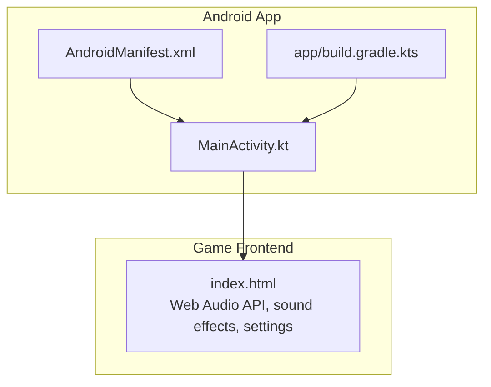
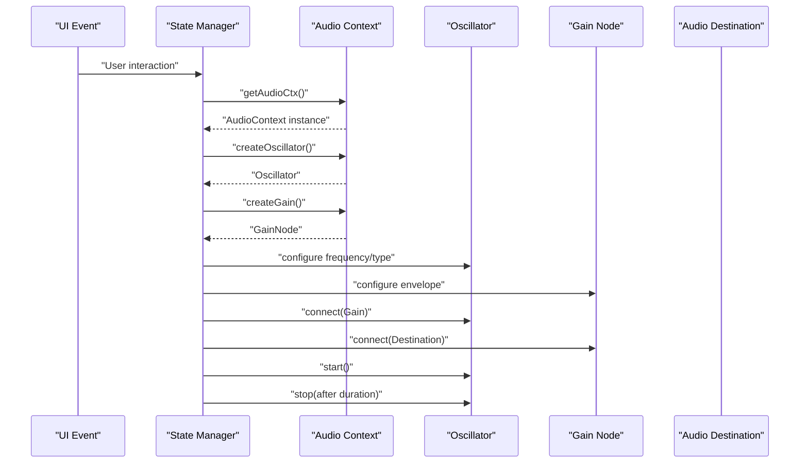
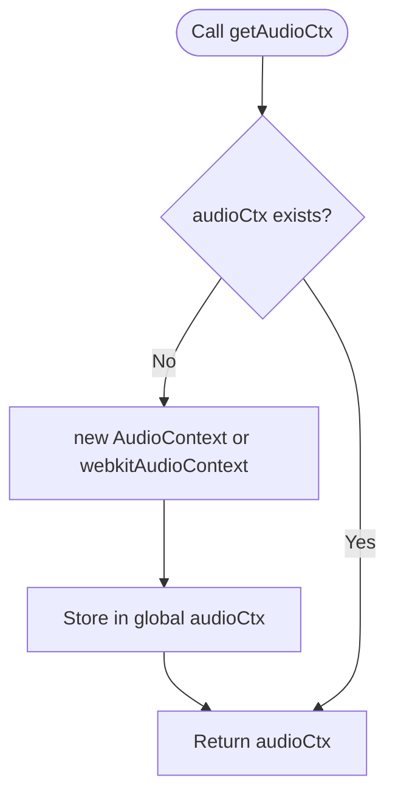
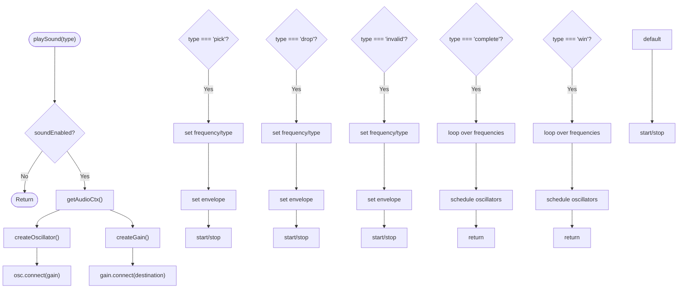
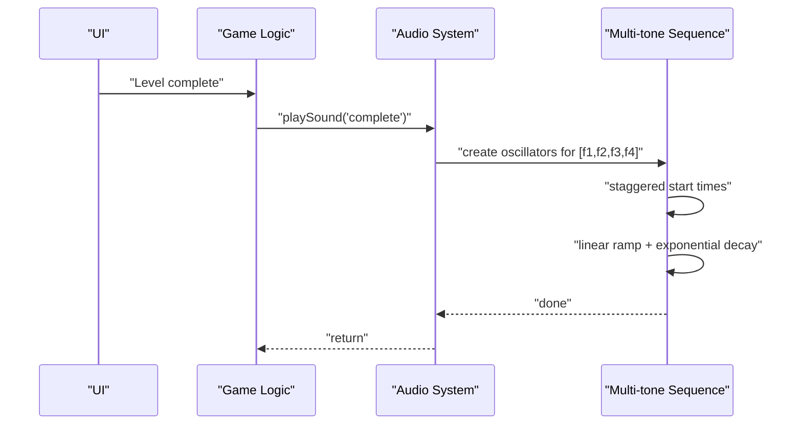
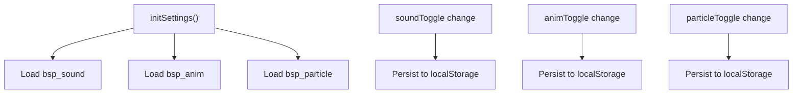
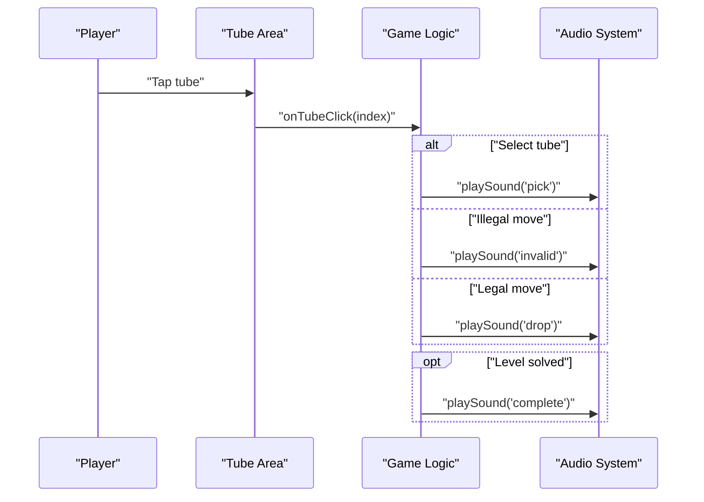
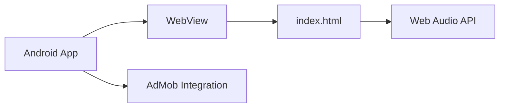

# Audio System

<cite>
**Referenced Files in This Document**
- [index.html](file://app/src/main/assets/index.html)
- [MainActivity.kt](file://app/src/main/java/com/cktechhub/games/MainActivity.kt)
- [AndroidManifest.xml](file://app/src/main/AndroidManifest.xml)
- [build.gradle.kts](file://app/build.gradle.kts)
- [strings.xml](file://app/src/main/res/values/strings.xml)
</cite>

## Table of Contents
1. [Introduction](#introduction)
2. [Project Structure](#project-structure)
3. [Core Components](#core-components)
4. [Architecture Overview](#architecture-overview)
5. [Detailed Component Analysis](#detailed-component-analysis)
6. [Dependency Analysis](#dependency-analysis)
7. [Performance Considerations](#performance-considerations)
8. [Troubleshooting Guide](#troubleshooting-guide)
9. [Conclusion](#conclusion)
10. [Appendices](#appendices)

## Introduction
This document describes the Web Audio API-based sound generation system used in the game. It explains how oscillators are used to synthesize pick sounds, drop sounds, invalid move feedback, level completion celebrations, and victory fanfares. It documents audio context management, initialization, and fallback handling for unsupported browsers. It also covers configuration options for sound effects, animations, and particles, along with practical examples of sound generation algorithms, timing control, and integration with game state changes.

## Project Structure
The audio system is implemented entirely within the single HTML file that serves as the game’s frontend. The Android app hosts this HTML in a WebView and injects a JavaScript bridge to coordinate with native ad events.

**Diagram sources**
- [index.html](file://app/src/main/assets/index.html)
- [MainActivity.kt](file://app/src/main/java/com/cktechhub/games/MainActivity.kt)
- [AndroidManifest.xml](file://app/src/main/AndroidManifest.xml)
- [build.gradle.kts](file://app/build.gradle.kts)

**Section sources**
- [index.html](file://app/src/main/assets/index.html)
- [MainActivity.kt](file://app/src/main/java/com/cktechhub/games/MainActivity.kt)
- [AndroidManifest.xml](file://app/src/main/AndroidManifest.xml)
- [build.gradle.kts](file://app/build.gradle.kts)

## Core Components
- Audio context manager: Lazily initializes a singleton Web Audio context and exposes a getter.
- Sound generator: Creates oscillators and gain nodes, applies envelopes, and schedules playback.
- Sound types:
  - Pick: short sine tone for selecting a tube.
  - Drop: short sine tone for moving a ball.
  - Invalid: short square tone with shake animation for illegal moves.
  - Complete: multi-tone ascending sequence for level completion.
  - Win: multi-tone ascending sequence for victory fanfare.
- Settings integration: toggles sound effects, animations, and particles; persists preferences to localStorage.
- Game-state integration: plays sounds on user interactions and level completion.

**Section sources**
- [index.html](file://app/src/main/assets/index.html)

## Architecture Overview
The audio pipeline is straightforward: a single global audio context is created on demand. Each sound request constructs an oscillator and a gain node, connects them to the destination, sets frequency and envelope, and schedules stop. Multi-tone sequences schedule multiple oscillators with staggered starts and envelopes.

**Diagram sources**
- [index.html](file://app/src/main/assets/index.html)

## Detailed Component Analysis

### Audio Context Management
- Lazy initialization: The audio context is created only when first needed.
- Fallback: Uses either the standard constructor or the prefixed variant for older browsers.
- Singleton: Ensures a single context is reused across all sound requests.

**Diagram sources**
- [index.html](file://app/src/main/assets/index.html)

**Section sources**
- [index.html](file://app/src/main/assets/index.html)

### Sound Generation and Envelopes
- Each sound uses a single oscillator and a gain node.
- Envelope shapes:
  - Exponential ramp to silence for short tones.
  - Linear ramp to peak volume, then exponential ramp to silence for multi-tone sequences.
- Frequency modulation is not implemented; pitch is set statically per sound type.

**Diagram sources**
- [index.html](file://app/src/main/assets/index.html)

**Section sources**
- [index.html](file://app/src/main/assets/index.html)

### Sound Types and Sequences
- Pick: short sine tone for selection.
- Drop: short sine tone for successful placement.
- Invalid: short square tone with a shake animation for illegal moves.
- Complete: ascending multi-tone sequence for level completion.
- Win: ascending multi-tone sequence for victory fanfare.

**Diagram sources**
- [index.html](file://app/src/main/assets/index.html)

**Section sources**
- [index.html](file://app/src/main/assets/index.html)

### Settings and Persistence
- Sound toggle: Controls whether audio is played.
- Animation and particle toggles: Control visual effects.
- Preferences are persisted to localStorage and restored on startup.

**Diagram sources**
- [index.html](file://app/src/main/assets/index.html)

**Section sources**
- [index.html](file://app/src/main/assets/index.html)

### Integration with Game State
- Plays pick/drop/invalid sounds on tube interactions.
- Plays level-complete and win fanfares during level progression.
- Integrates with UI overlays and timers.

**Diagram sources**
- [index.html](file://app/src/main/assets/index.html)

**Section sources**
- [index.html](file://app/src/main/assets/index.html)

## Dependency Analysis
- The Android app loads the HTML file in a WebView and enables JavaScript.
- The WebView client restricts navigation to local assets and injects a JavaScript bridge to trigger native ad events.
- The audio system depends on the browser’s Web Audio API and does not rely on external libraries.

**Diagram sources**
- [MainActivity.kt](file://app/src/main/java/com/cktechhub/games/MainActivity.kt)
- [index.html](file://app/src/main/assets/index.html)
- [AndroidManifest.xml](file://app/src/main/AndroidManifest.xml)

**Section sources**
- [MainActivity.kt](file://app/src/main/java/com/cktechhub/games/MainActivity.kt)
- [AndroidManifest.xml](file://app/src/main/AndroidManifest.xml)

## Performance Considerations
- Single-shot oscillators are efficient for short tones.
- Multi-tone sequences create multiple oscillators; consider limiting concurrent instances if performance becomes an issue.
- Avoid excessive re-creation of audio nodes; reuse where possible.
- Keep envelope durations short to minimize CPU usage.

## Troubleshooting Guide
- No sound on first interaction:
  - Ensure the audio context is initialized on a user gesture. The system creates the context lazily on the first sound request.
- Autoplay blocked on mobile:
  - The game relies on user gestures to initialize audio. Ensure a user interaction occurs before attempting to play sounds.
- Unsupported browsers:
  - The system falls back to the prefixed constructor if the standard one is unavailable.
- Silent invalid move feedback:
  - Verify the sound toggle is enabled and that the invalid sound path executes.

**Section sources**
- [index.html](file://app/src/main/assets/index.html)

## Conclusion
The audio system is a compact, Web Audio API-based implementation that synthesizes short, expressive sounds for core gameplay events. It integrates cleanly with the game’s UI and settings, and it avoids external dependencies. While it currently uses static frequencies and simple envelopes, the structure allows for future enhancements such as frequency modulation, spatial audio, and richer envelope shaping.

## Appendices

### Practical Examples and Algorithms
- Short tone synthesis: Create an oscillator, connect a gain node, set a frequency and type, apply an exponential envelope, and schedule stop.
- Multi-tone sequence: Iterate over a predefined frequency list, create oscillators with staggered start times, and apply linear ramp-up followed by exponential decay.
- Timing control: Use the audio context’s current time to schedule precise start and stop moments for each oscillator.
- Spatial audio considerations: Not implemented in the current code. Consider stereo panning or stereo effects for richer audio.

### Mobile Audio Limitations
- Autoplay policy: Audio contexts must be resumed after a user gesture. The game initializes the context on the first sound request triggered by user interaction.
- Device orientation and battery optimization: Not addressed in the current code. Consider pausing audio when the app loses focus or when the device enters idle modes.

### Integration Notes
- The Android WebView is configured to allow file access and disable media playback requirements for user gestures, enabling local HTML audio playback.
- The JavaScript bridge is used for ad events and does not interfere with the audio system.

**Section sources**
- [index.html](file://app/src/main/assets/index.html)
- [MainActivity.kt](file://app/src/main/java/com/cktechhub/games/MainActivity.kt)
- [AndroidManifest.xml](file://app/src/main/AndroidManifest.xml)
- [build.gradle.kts](file://app/build.gradle.kts)
- [strings.xml](file://app/src/main/res/values/strings.xml)