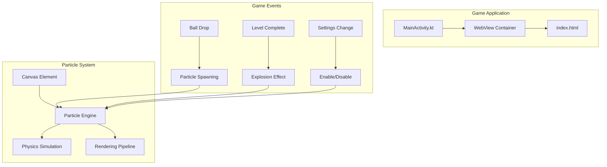
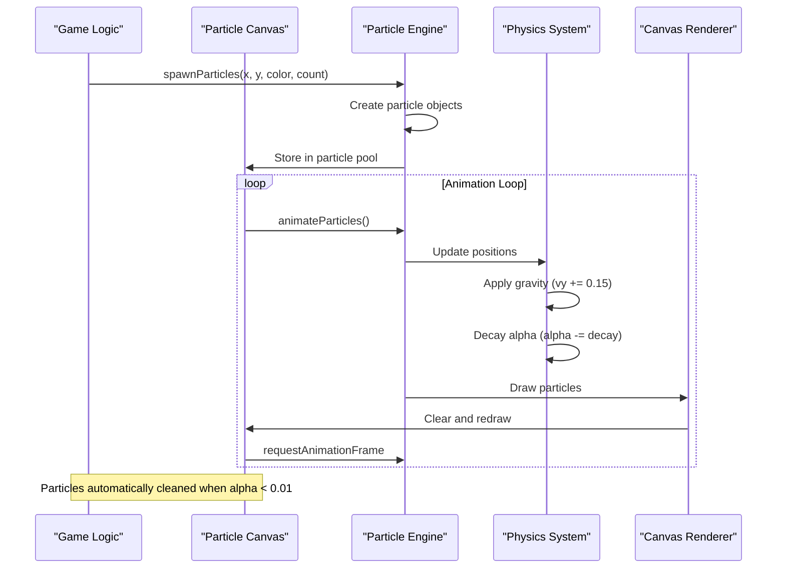
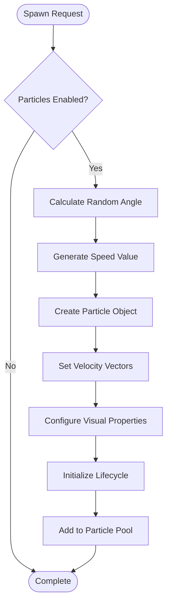
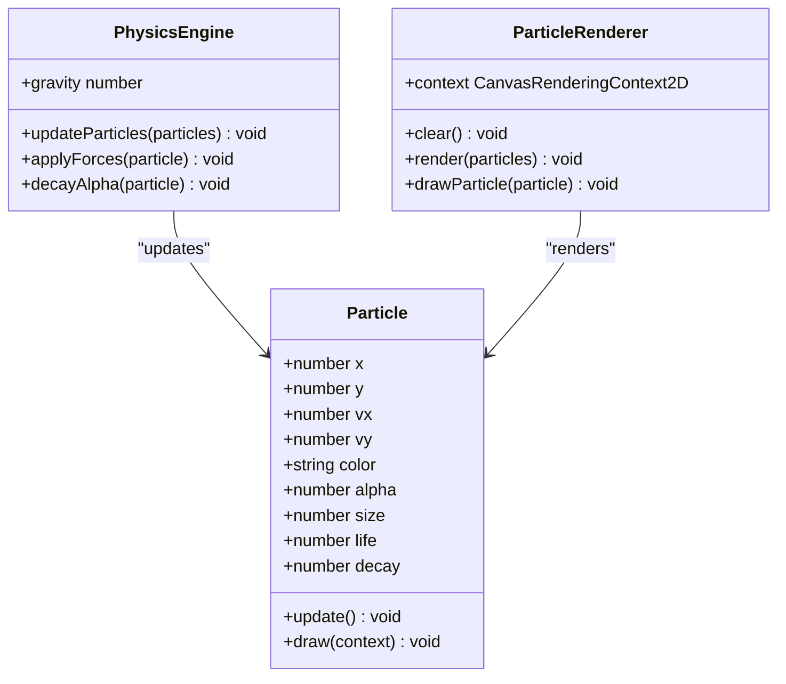
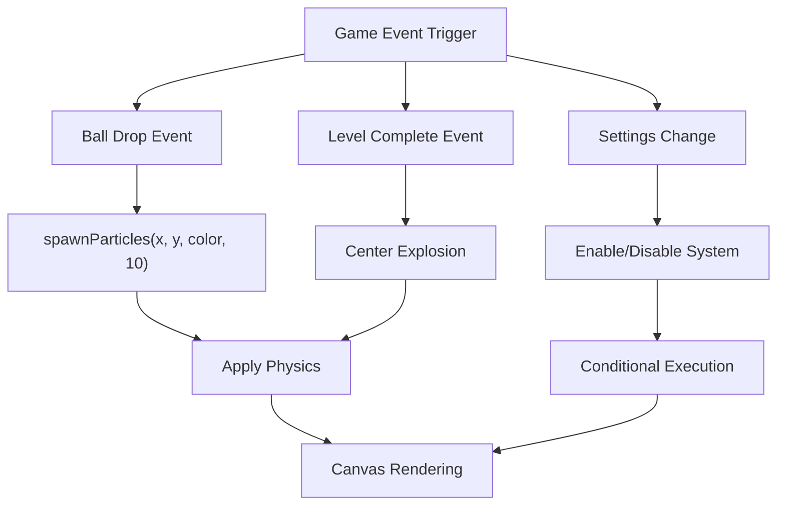
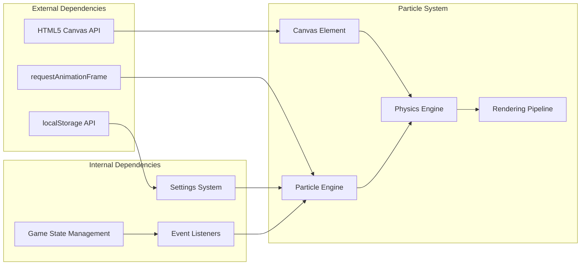

# Particle System

<cite>
**Referenced Files in This Document**
- [index.html](file://app/src/main/assets/index.html)
- [MainActivity.kt](file://app/src/main/java/com/cktechhub/games/MainActivity.kt)
</cite>

## Table of Contents
1. [Introduction](#introduction)
2. [Project Structure](#project-structure)
3. [Core Components](#core-components)
4. [Architecture Overview](#architecture-overview)
5. [Detailed Component Analysis](#detailed-component-analysis)
6. [Dependency Analysis](#dependency-analysis)
7. [Performance Considerations](#performance-considerations)
8. [Troubleshooting Guide](#troubleshooting-guide)
9. [Conclusion](#conclusion)

## Introduction
This document provides comprehensive technical documentation for the Canvas API-based particle rendering system used in the Ball Sort Puzzle game. The particle system creates dynamic visual effects for game events including ball drops, level completions, and interactive animations. It implements realistic physics simulation with gravity effects, alpha decay, and velocity calculations, while maintaining optimal performance across desktop and mobile platforms.

The system consists of a lightweight particle engine that renders thousands of particles efficiently using HTML5 Canvas, with configurable parameters for color, size, and emission rates. It integrates seamlessly with the game's event-driven architecture and provides real-time visual feedback for player actions.

## Project Structure
The particle system is implemented entirely within the main HTML file as a self-contained JavaScript module. The system is embedded within the broader game application structure and interacts with the Android WebView layer for advanced features.



**Diagram sources**
- [index.html:423-469](file://app/src/main/assets/index.html#L423-L469)
- [MainActivity.kt:165-263](file://app/src/main/java/com/cktechhub/games/MainActivity.kt#L165-L263)

**Section sources**
- [index.html:423-469](file://app/src/main/assets/index.html#L423-L469)
- [MainActivity.kt:165-263](file://app/src/main/java/com/cktechhub/games/MainActivity.kt#L165-L263)

## Core Components

### Particle Canvas Infrastructure
The particle system initializes a dedicated HTML5 Canvas element positioned above the main game interface. The canvas automatically resizes to match the viewport dimensions and maintains full-screen coverage during gameplay.

### Particle Pool Management
The system maintains a global particle array that stores all active particles. Each particle is represented as a lightweight object containing position, velocity, visual properties, and lifecycle data. Particles are efficiently managed through filtering and cleanup operations.

### Physics Engine
The physics simulation implements realistic movement with gravity effects, velocity calculations, and alpha decay. Each particle experiences constant downward acceleration while gradually losing opacity over time.

**Section sources**
- [index.html:426-434](file://app/src/main/assets/index.html#L426-L434)
- [index.html:428-452](file://app/src/main/assets/index.html#L428-L452)
- [index.html:453-469](file://app/src/main/assets/index.html#L453-L469)

## Architecture Overview



**Diagram sources**
- [index.html:436-469](file://app/src/main/assets/index.html#L436-L469)
- [index.html:453-469](file://app/src/main/assets/index.html#L453-L469)

The particle system follows a reactive architecture pattern where game events trigger particle spawning, and the animation loop continuously updates and renders particle states. The system operates independently of the main game logic while providing seamless visual feedback.

## Detailed Component Analysis

### Particle Spawning Algorithm
The particle spawning mechanism generates burst effects with configurable parameters for color, size, and emission count. Each spawned particle receives randomized velocity vectors and lifetime properties.



**Diagram sources**
- [index.html:436-452](file://app/src/main/assets/index.html#L436-L452)

The spawning algorithm implements several key features:
- **Randomized Distribution**: Particles emit in all directions from the spawn point
- **Velocity Control**: Initial velocity accounts for upward bias and random spread
- **Visual Customization**: Configurable color, size, and emission counts
- **Performance Optimization**: Efficient object creation with minimal overhead

**Section sources**
- [index.html:436-452](file://app/src/main/assets/index.html#L436-L452)

### Physics Simulation Implementation
The physics engine applies realistic forces to each particle, creating natural movement patterns that enhance visual appeal.



**Diagram sources**
- [index.html:453-469](file://app/src/main/assets/index.html#L453-L469)

The physics simulation includes:
- **Gravity Effect**: Constant downward acceleration (0.15 units per frame)
- **Alpha Decay**: Smooth fade-out effect using configurable decay rates
- **Position Updates**: Velocity-based movement with accumulated displacement
- **Boundary Management**: Automatic cleanup of off-screen or expired particles

**Section sources**
- [index.html:453-469](file://app/src/main/assets/index.html#L453-L469)

### Animation Loop Architecture
The animation system uses requestAnimationFrame for smooth, browser-optimized rendering cycles. The loop implements efficient cleanup and rendering strategies.

```mermaid
sequenceDiagram
participant RAF as "requestAnimationFrame"
participant Loop as "Animation Loop"
participant Cleanup as "Particle Cleanup"
participant Update as "Physics Update"
participant Render as "Canvas Rendering"
RAF->>Loop : animateParticles()
Loop->>Cleanup : Filter dead particles
Cleanup-->>Loop : Return active particles
Loop->>Update : Update positions and alpha
Update-->>Loop : Updated particle states
Loop->>Render : Draw all active particles
Render-->>Loop : Rendering complete
Loop->>RAF : Schedule next frame
```

**Diagram sources**
- [index.html:453-469](file://app/src/main/assets/index.html#L453-L469)

**Section sources**
- [index.html:453-469](file://app/src/main/assets/index.html#L453-L469)

### Game Event Integration
The particle system integrates with game events to provide contextual visual feedback. Different game scenarios trigger specialized particle effects.



**Diagram sources**
- [index.html:737-750](file://app/src/main/assets/index.html#L737-L750)
- [index.html:872-881](file://app/src/main/assets/index.html#L872-L881)

**Section sources**
- [index.html:737-750](file://app/src/main/assets/index.html#L737-L750)
- [index.html:872-881](file://app/src/main/assets/index.html#L872-L881)

## Dependency Analysis

The particle system maintains loose coupling with the main game application while providing essential visual feedback capabilities.



**Diagram sources**
- [index.html:426-434](file://app/src/main/assets/index.html#L426-L434)
- [index.html:1028-1039](file://app/src/main/assets/index.html#L1028-L1039)

The system depends on:
- **Browser APIs**: Canvas 2D rendering and animation timing
- **Game State**: Access to configuration flags and game context
- **Event System**: Integration with user interactions and game events
- **Storage**: Persistent settings for particle enable/disable functionality

**Section sources**
- [index.html:426-434](file://app/src/main/assets/index.html#L426-L434)
- [index.html:1028-1039](file://app/src/main/assets/index.html#L1028-L1039)

## Performance Considerations

### Mobile Optimization Strategies
The particle system implements several optimizations specifically designed for mobile device constraints:

**Canvas Resolution Management**
- Dynamic canvas sizing adapts to device viewport
- Efficient resize handling prevents unnecessary reflows
- Memory-conscious particle lifecycle management

**Frame Rate Optimization**
- Particle cleanup threshold (alpha > 0.01) prevents accumulation
- Minimal object creation in hot loops
- Efficient filtering operations using array methods

**Memory Management**
- Automatic particle removal when alpha decays below threshold
- Single global particle array with periodic cleanup
- No DOM manipulation for particle rendering

### Performance Tuning Parameters
The system provides configurable parameters for performance optimization:

| Parameter | Range | Impact | Default |
|-----------|--------|---------|---------|
| Emission Count | 5-50 particles | CPU usage, visual density | 18 |
| Particle Size | 2-12 pixels | GPU rendering cost | 4-10 |
| Decay Rate | 0.01-0.05 | Fade duration | 0.02-0.04 |
| Gravity Strength | 0.05-0.3 | Movement realism | 0.15 |

### Mobile-Specific Considerations
- **Touch Device Responsiveness**: Optimized for 60fps on modern devices
- **Battery Life**: Minimal CPU usage during idle periods
- **Memory Constraints**: Automatic cleanup prevents memory leaks
- **Performance Degradation**: Graceful fallback when device resources are low

**Section sources**
- [index.html:436-452](file://app/src/main/assets/index.html#L436-L452)
- [index.html:453-469](file://app/src/main/assets/index.html#L453-L469)

## Troubleshooting Guide

### Common Issues and Solutions

**Particles Not Visible**
- Verify canvas element exists and is properly sized
- Check that particleEnabled flag is set to true
- Ensure requestAnimationFrame is functioning correctly

**Performance Issues**
- Reduce emission count during intensive gameplay
- Monitor particle array length during runtime
- Consider disabling particles on lower-end devices

**Physics Anomalies**
- Verify gravity constant consistency across frames
- Check alpha decay calculations for numerical stability
- Ensure velocity updates occur before position updates

### Debugging Tools
The system includes built-in mechanisms for monitoring particle activity:
- Particle count tracking through array length
- Alpha threshold monitoring for cleanup effectiveness
- Frame rate measurement using animation timing

**Section sources**
- [index.html:453-469](file://app/src/main/assets/index.html#L453-L469)

## Conclusion

The Canvas API-based particle rendering system provides an efficient, scalable solution for dynamic visual effects in the Ball Sort Puzzle game. Its architecture balances performance with visual quality, implementing realistic physics simulation while maintaining optimal resource usage across diverse hardware configurations.

Key strengths of the implementation include:
- **Efficient Physics**: Realistic gravity effects with minimal computational overhead
- **Scalable Performance**: Automatic cleanup and adaptive emission rates
- **Seamless Integration**: Clean separation from game logic with event-driven spawning
- **Mobile Optimization**: Comprehensive performance considerations for various device capabilities

The system successfully enhances the gaming experience through contextual visual feedback while maintaining reliability and performance standards essential for mobile applications.