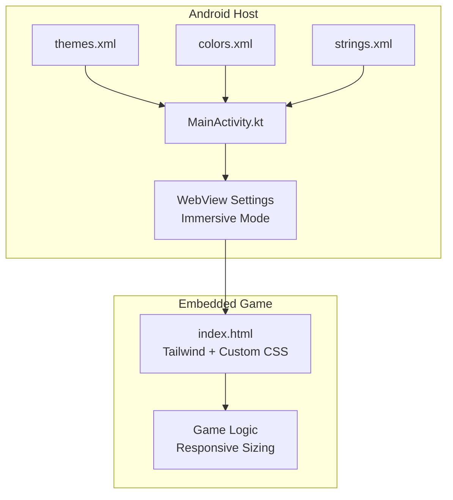
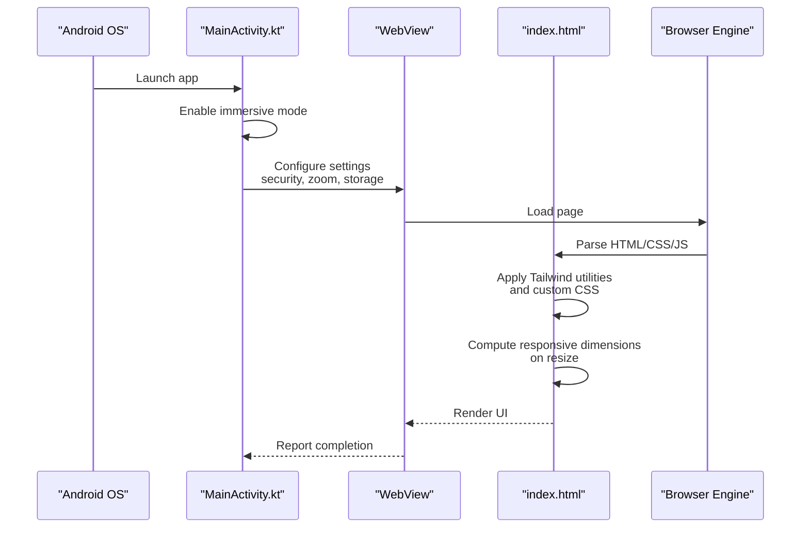
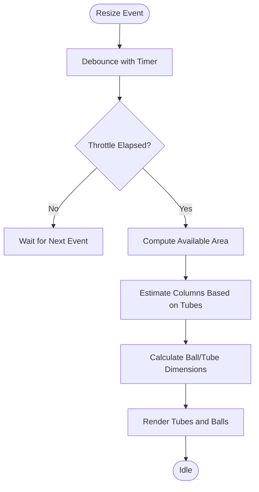
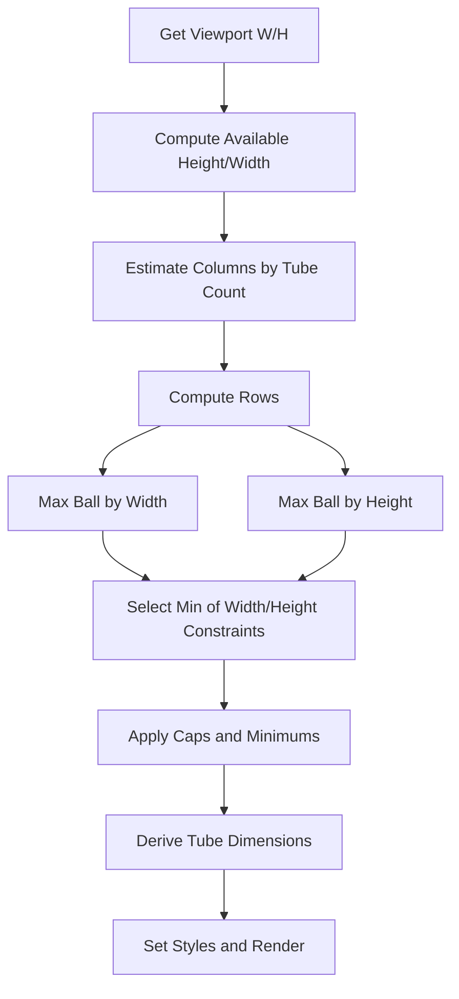
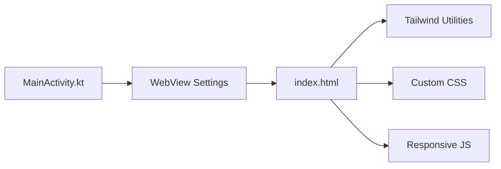

# Responsive Design & Styling

<cite>
**Referenced Files in This Document**
- [index.html](file://app/src/main/assets/index.html)
- [MainActivity.kt](file://app/src/main/java/com/cktechhub/games/MainActivity.kt)
- [themes.xml](file://app/src/main/res/values/themes.xml)
- [colors.xml](file://app/src/main/res/values/colors.xml)
- [strings.xml](file://app/src/main/res/values/strings.xml)
</cite>

## Table of Contents
1. [Introduction](#introduction)
2. [Project Structure](#project-structure)
3. [Core Components](#core-components)
4. [Architecture Overview](#architecture-overview)
5. [Detailed Component Analysis](#detailed-component-analysis)
6. [Dependency Analysis](#dependency-analysis)
7. [Performance Considerations](#performance-considerations)
8. [Troubleshooting Guide](#troubleshooting-guide)
9. [Conclusion](#conclusion)
10. [Appendices](#appendices)

## Introduction
This document explains the responsive design system used in the project, focusing on how the web-based game integrates Tailwind CSS utilities with custom styles to adapt across devices. It covers:
- Adaptive layout system and screen size detection
- Element sizing algorithms and responsive typography
- Styling framework including gradient backgrounds, glass morphism effects, and mobile-safe areas
- Color system with dynamic adjustments and light/dark considerations
- Configuration options for responsive breakpoints, animation timing, and visual effects
- Practical examples of layout adaptation, element scaling, and cross-device compatibility
- Mobile-specific considerations including viewport management, touch targets, and orientation handling
- Integration between Tailwind utilities and custom CSS animations

## Project Structure
The responsive design spans two primary layers:
- Android host activity that embeds a WebView and configures immersive display and security policies
- Embedded HTML/CSS/JS game that uses Tailwind utilities alongside custom CSS for responsive layouts, animations, and visual effects

**Diagram sources**
- [MainActivity.kt:66-135](file://app/src/main/java/com/cktechhub/games/MainActivity.kt#L66-L135)
- [index.html:1-200](file://app/src/main/assets/index.html#L1-L200)

**Section sources**
- [MainActivity.kt:66-135](file://app/src/main/java/com/cktechhub/games/MainActivity.kt#L66-L135)
- [index.html:1-200](file://app/src/main/assets/index.html#L1-L200)

## Core Components
- Responsive viewport and layout foundation
  - The embedded page sets a fixed viewport and uses Tailwind utilities for full-screen containers and flexible layouts.
  - See [index.html:4-12](file://app/src/main/assets/index.html#L4-L12) for viewport meta and [index.html:204-205](file://app/src/main/assets/index.html#L204-L205) for root Tailwind classes.

- Adaptive screen management
  - Screen transitions use opacity and transform with Tailwind positioning and custom transitions.
  - See [index.html:13-16](file://app/src/main/assets/index.html#L13-L16) for screen classes and transition timing.

- Gradient backgrounds and glass morphism
  - Home and game screens use gradient backgrounds; buttons and modals apply backdrop blur and translucent borders for glass-like effects.
  - See [index.html:17-21](file://app/src/main/assets/index.html#L17-L21), [index.html:98-122](file://app/src/main/assets/index.html#L98-L122), [index.html:123-138](file://app/src/main/assets/index.html#L123-L138).

- Mobile-safe areas and bottom padding
  - Safe area insets are applied to the game screen to avoid notches and home indicators.
  - See [index.html:192-194](file://app/src/main/assets/index.html#L192-L194).

- Responsive typography and spacing
  - Tailwind utilities define text sizes, weights, and spacing; custom CSS enforces consistent sizing across breakpoints.
  - See [index.html:210-230](file://app/src/main/assets/index.html#L210-L230) for home screen typography and [index.html:251-266](file://app/src/main/assets/index.html#L251-L266) for stats badges.

- Element sizing algorithms
  - JavaScript computes tube and ball dimensions based on viewport, number of tubes, and balls per color, with min/max bounds and gaps.
  - See [index.html:548-576](file://app/src/main/assets/index.html#L548-L576) for dimension calculation and [index.html:578-624](file://app/src/main/assets/index.html#L578-L624) for rendering logic.

- Animation timing and transitions
  - Transitions and keyframe animations define smooth UI feedback; timing is tuned for responsiveness and performance.
  - See [index.html:14](file://app/src/main/assets/index.html#L14), [index.html:54-57](file://app/src/main/assets/index.html#L54-L57), [index.html:75-83](file://app/src/main/assets/index.html#L75-L83).

- Touch interactions and gesture handling
  - Delegated event listeners manage touch/click with debouncing and animation feedback.
  - See [index.html:664-689](file://app/src/main/assets/index.html#L664-L689).

**Section sources**
- [index.html:4-12](file://app/src/main/assets/index.html#L4-L12)
- [index.html:13-16](file://app/src/main/assets/index.html#L13-L16)
- [index.html:17-21](file://app/src/main/assets/index.html#L17-L21)
- [index.html:98-122](file://app/src/main/assets/index.html#L98-L122)
- [index.html:123-138](file://app/src/main/assets/index.html#L123-L138)
- [index.html:192-194](file://app/src/main/assets/index.html#L192-L194)
- [index.html:210-230](file://app/src/main/assets/index.html#L210-L230)
- [index.html:251-266](file://app/src/main/assets/index.html#L251-L266)
- [index.html:548-576](file://app/src/main/assets/index.html#L548-L576)
- [index.html:578-624](file://app/src/main/assets/index.html#L578-L624)
- [index.html:664-689](file://app/src/main/assets/index.html#L664-L689)

## Architecture Overview
The responsive system combines Android’s immersive display with a WebView hosting a Tailwind-powered UI. The game’s layout adapts dynamically to viewport changes, and custom CSS ensures consistent visuals across devices.

**Diagram sources**
- [MainActivity.kt:66-135](file://app/src/main/java/com/cktechhub/games/MainActivity.kt#L66-L135)
- [index.html:1058-1064](file://app/src/main/assets/index.html#L1058-L1064)

**Section sources**
- [MainActivity.kt:66-135](file://app/src/main/java/com/cktechhub/games/MainActivity.kt#L66-L135)
- [index.html:1058-1064](file://app/src/main/assets/index.html#L1058-L1064)

## Detailed Component Analysis

### Adaptive Layout System and Screen Size Detection
- Fixed viewport ensures consistent device pixel ratios and prevents accidental pinch-zoom.
- Tailwind utilities provide full-screen containers and flex layouts.
- Resize throttling defers expensive re-layouts until the user stops resizing.
- Safe area insets prevent content overlap with device notches and home indicators.

**Diagram sources**
- [index.html:1058-1064](file://app/src/main/assets/index.html#L1058-L1064)
- [index.html:548-576](file://app/src/main/assets/index.html#L548-L576)

**Section sources**
- [index.html:4-12](file://app/src/main/assets/index.html#L4-L12)
- [index.html:1058-1064](file://app/src/main/assets/index.html#L1058-L1064)
- [index.html:548-576](file://app/src/main/assets/index.html#L548-L576)
- [index.html:192-194](file://app/src/main/assets/index.html#L192-L194)

### Element Sizing Algorithms
- Available height and width are computed after subtracting UI chrome (top bar, bottom bar, stats, progress).
- Columns are estimated based on tube count; rows are derived from column count.
- Ball size is constrained by both width and height budgets, capped/minimized for readability and performance.
- Gap sizing scales with viewport and tube density.

**Diagram sources**
- [index.html:548-576](file://app/src/main/assets/index.html#L548-L576)
- [index.html:578-624](file://app/src/main/assets/index.html#L578-L624)

**Section sources**
- [index.html:548-576](file://app/src/main/assets/index.html#L548-L576)
- [index.html:578-624](file://app/src/main/assets/index.html#L578-L624)

### Responsive Typography
- Typography uses Tailwind text utilities for consistent scaling across breakpoints.
- Custom CSS enforces minimum sizes and line-heights for readability.
- Example: logo and headings use large, bold text with tracking for emphasis.

**Section sources**
- [index.html:210-230](file://app/src/main/assets/index.html#L210-L230)
- [index.html:251-266](file://app/src/main/assets/index.html#L251-L266)

### Styling Framework: Gradients, Glass Morphism, and Safe Areas
- Gradients: Home and game screens use angled linear gradients for depth.
- Glass morphism: Buttons and modals apply backdrop blur and translucent borders.
- Safe areas: Bottom padding uses env(safe-area-inset-bottom) to avoid cutouts.

**Section sources**
- [index.html:17-21](file://app/src/main/assets/index.html#L17-L21)
- [index.html:98-122](file://app/src/main/assets/index.html#L98-L122)
- [index.html:123-138](file://app/src/main/assets/index.html#L123-L138)
- [index.html:192-194](file://app/src/main/assets/index.html#L192-L194)

### Color System and Dynamic Adjustments
- Ball colors are defined centrally and adjusted dynamically for highlights and shadows.
- Helper functions lighten/darken hex colors to create layered visuals.
- Theme background colors are defined in Android resources for consistent app-level appearance.

**Section sources**
- [index.html:345-356](file://app/src/main/assets/index.html#L345-L356)
- [index.html:647-659](file://app/src/main/assets/index.html#L647-L659)
- [themes.xml:1-10](file://app/src/main/res/values/themes.xml#L1-L10)
- [colors.xml:1-10](file://app/src/main/res/values/colors.xml#L1-L10)

### Accessibility and Cross-Device Compatibility
- Touch targets: Buttons and interactive elements are sized generously for touch interaction.
- Orientation handling: Resize listener recomputes layouts on orientation change.
- Text contrast: Gradients and translucent overlays maintain sufficient contrast for legibility.

**Section sources**
- [index.html:98-122](file://app/src/main/assets/index.html#L98-L122)
- [index.html:1058-1064](file://app/src/main/assets/index.html#L1058-L1064)

### Integration Between Tailwind Utilities and Custom Animations
- Tailwind classes provide layout scaffolding; custom CSS defines transitions and keyframe animations.
- Examples: screen transitions, tube selection, ball drop/bounce, level-complete pulse, and hint flashes.

**Section sources**
- [index.html:13-16](file://app/src/main/assets/index.html#L13-L16)
- [index.html:54-57](file://app/src/main/assets/index.html#L54-L57)
- [index.html:75-83](file://app/src/main/assets/index.html#L75-L83)
- [index.html:164-168](file://app/src/main/assets/index.html#L164-L168)

## Dependency Analysis
The Android host activity configures the WebView and immersive mode, while the embedded HTML leverages Tailwind utilities and custom CSS for responsive behavior. There are no explicit external dependencies for responsive design beyond Tailwind CDN and browser engine capabilities.

**Diagram sources**
- [MainActivity.kt:66-135](file://app/src/main/java/com/cktechhub/games/MainActivity.kt#L66-L135)
- [index.html:7](file://app/src/main/assets/index.html#L7)
- [index.html:1-200](file://app/src/main/assets/index.html#L1-L200)

**Section sources**
- [MainActivity.kt:66-135](file://app/src/main/java/com/cktechhub/games/MainActivity.kt#L66-L135)
- [index.html:7](file://app/src/main/assets/index.html#L7)
- [index.html:1-200](file://app/src/main/assets/index.html#L1-L200)

## Performance Considerations
- Resize throttling reduces layout thrash during rapid resizes.
- CSS transforms and opacity transitions are hardware-accelerated for smooth animations.
- Backdrop blur and gradients are supported on modern browsers; consider fallbacks for older devices.
- Minimizing DOM updates by batching style changes improves rendering performance.

[No sources needed since this section provides general guidance]

## Troubleshooting Guide
- Content overlaps device notches
  - Ensure safe-area-inset-bottom is applied to the game screen container.
  - Reference: [index.html:192-194](file://app/src/main/assets/index.html#L192-L194)

- Elements misaligned on orientation change
  - Verify resize handler triggers re-rendering of tubes and balls.
  - Reference: [index.html:1058-1064](file://app/src/main/assets/index.html#L1058-L1064), [index.html:578-624](file://app/src/main/assets/index.html#L578-L624)

- Touch events firing twice or inconsistently
  - Confirm delegated event handling avoids passive vs non-passive conflicts and debounces rapid taps.
  - Reference: [index.html:664-689](file://app/src/main/assets/index.html#L664-L689)

- WebView blocking external content
  - Confirm WebViewClient overrides and URL filtering are in place.
  - Reference: [MainActivity.kt:194-207](file://app/src/main/java/com/cktechhub/games/MainActivity.kt#L194-L207)

**Section sources**
- [index.html:192-194](file://app/src/main/assets/index.html#L192-L194)
- [index.html:1058-1064](file://app/src/main/assets/index.html#L1058-L1064)
- [index.html:578-624](file://app/src/main/assets/index.html#L578-L624)
- [index.html:664-689](file://app/src/main/assets/index.html#L664-L689)
- [MainActivity.kt:194-207](file://app/src/main/java/com/cktechhub/games/MainActivity.kt#L194-L207)

## Conclusion
The responsive design system blends Tailwind’s utility-first approach with custom CSS and JavaScript-driven sizing to deliver a consistent, performant experience across devices. The Android host activity ensures immersive presentation and secure content loading, while the embedded game adapts fluidly to viewport changes and user interactions.

[No sources needed since this section summarizes without analyzing specific files]

## Appendices

### Configuration Options Summary
- Responsive breakpoints and spacing
  - Use Tailwind utilities for responsive variants; customize via custom CSS where needed.
  - Reference: [index.html:210-230](file://app/src/main/assets/index.html#L210-L230), [index.html:251-266](file://app/src/main/assets/index.html#L251-L266)

- Animation timing
  - Tune transition durations and keyframe timings for smoothness and performance.
  - Reference: [index.html:14](file://app/src/main/assets/index.html#L14), [index.html:54-57](file://app/src/main/assets/index.html#L54-L57), [index.html:75-83](file://app/src/main/assets/index.html#L75-L83)

- Visual effects
  - Gradients, backdrop blur, and glow effects are defined in custom CSS.
  - Reference: [index.html:17-21](file://app/src/main/assets/index.html#L17-L21), [index.html:98-122](file://app/src/main/assets/index.html#L98-L122), [index.html:123-138](file://app/src/main/assets/index.html#L123-L138)

- Mobile-safe areas
  - Apply env(safe-area-inset-bottom) to avoid notches and home indicators.
  - Reference: [index.html:192-194](file://app/src/main/assets/index.html#L192-L194)

- Touch target sizing
  - Ensure interactive elements meet minimum touch target sizes for accessibility.
  - Reference: [index.html:98-122](file://app/src/main/assets/index.html#L98-L122)

**Section sources**
- [index.html:14](file://app/src/main/assets/index.html#L14)
- [index.html:17-21](file://app/src/main/assets/index.html#L17-L21)
- [index.html:54-57](file://app/src/main/assets/index.html#L54-L57)
- [index.html:75-83](file://app/src/main/assets/index.html#L75-L83)
- [index.html:98-122](file://app/src/main/assets/index.html#L98-L122)
- [index.html:123-138](file://app/src/main/assets/index.html#L123-L138)
- [index.html:192-194](file://app/src/main/assets/index.html#L192-L194)
- [index.html:210-230](file://app/src/main/assets/index.html#L210-L230)
- [index.html:251-266](file://app/src/main/assets/index.html#L251-L266)