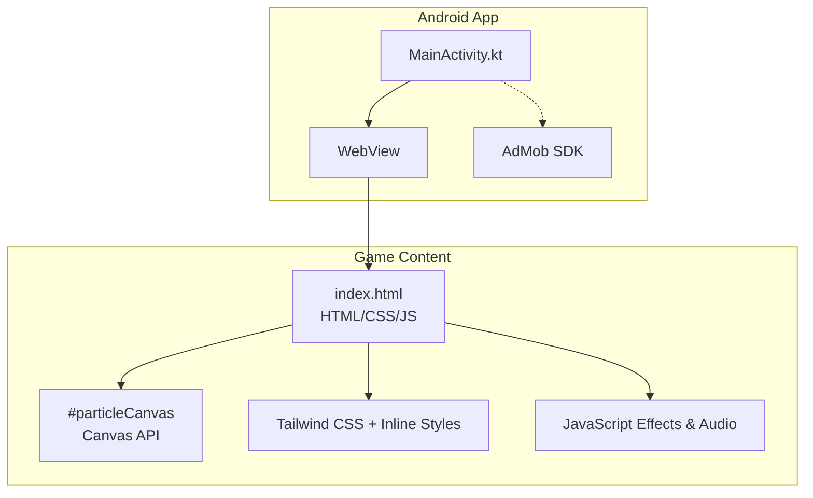
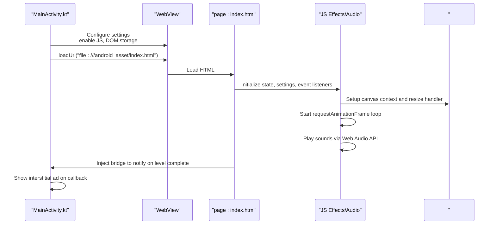
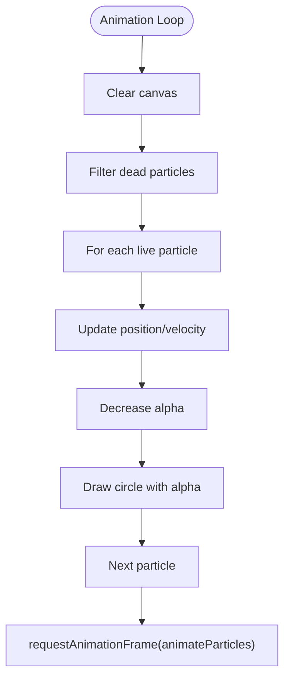
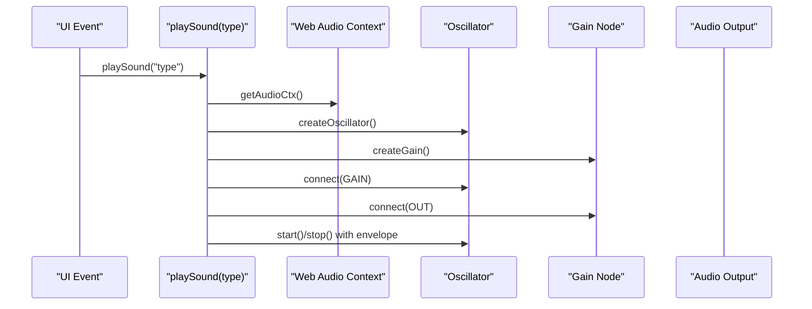
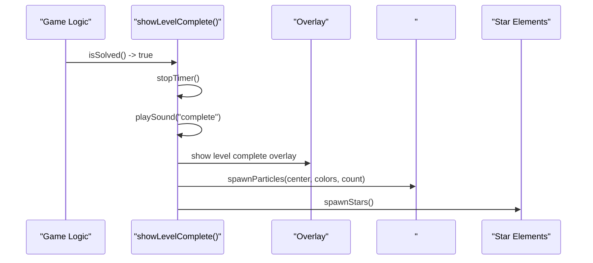
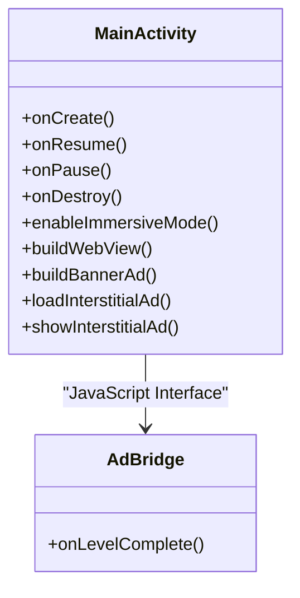
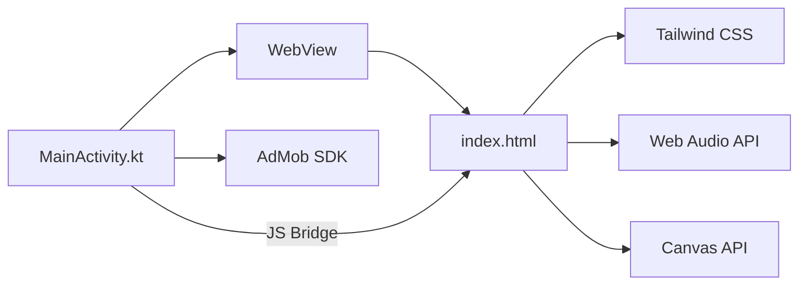

# Visual Effects & Audio

<cite>
**Referenced Files in This Document**
- [index.html](file://app/src/main/assets/index.html)
- [MainActivity.kt](file://app/src/main/java/com/cktechhub/games/MainActivity.kt)
- [strings.xml](file://app/src/main/res/values/strings.xml)
</cite>

## Table of Contents
1. [Introduction](#introduction)
2. [Project Structure](#project-structure)
3. [Core Components](#core-components)
4. [Architecture Overview](#architecture-overview)
5. [Detailed Component Analysis](#detailed-component-analysis)
6. [Dependency Analysis](#dependency-analysis)
7. [Performance Considerations](#performance-considerations)
8. [Troubleshooting Guide](#troubleshooting-guide)
9. [Conclusion](#conclusion)

## Introduction
This document explains the visual effects and audio systems powering the game. It covers:
- Canvas API-based particle rendering system
- Animation framework using requestAnimationFrame and CSS animations
- Responsive design with Tailwind CSS integration
- Web Audio API implementation for procedural sound generation
- Configuration options for visual effects, animation timing, and audio settings
- Practical examples demonstrating canvas drawing operations, animation loops, and sound effect generation
- Performance considerations for mobile devices
- The relationship between JavaScript effects and native Android components

## Project Structure
The game is packaged as an Android app that hosts a self-contained HTML/CSS/JS game inside a WebView. The game’s visuals and audio are implemented in a single HTML file with embedded styles and scripts. The Android activity configures the WebView, injects a JavaScript bridge, and coordinates ads and lifecycle events.

**Diagram sources**
- [index.html](file://app/src/main/assets/index.html)
- [MainActivity.kt](file://app/src/main/java/com/cktechhub/games/MainActivity.kt)

**Section sources**
- [index.html](file://app/src/main/assets/index.html)
- [MainActivity.kt](file://app/src/main/java/com/cktechhub/games/MainActivity.kt)

## Core Components
- Canvas particle system: Dynamically spawns and animates 2D particles with gravity and fade-out.
- Web Audio API: Procedural sound synthesis using oscillators and gain envelopes for pick/drop/invalid/complete/win sounds.
- Animation framework: requestAnimationFrame loop for smooth particle animation and CSS animations for UI feedback (ball drop/bounce, undo, hint flash, star burst).
- Responsive design: Tailwind utilities and inline styles adapt layouts to viewport and device constraints.
- Settings: Persistent toggles for sound, animations, and particles using localStorage.

**Section sources**
- [index.html](file://app/src/main/assets/index.html)

## Architecture Overview
The Android MainActivity loads the game page into a WebView, applies security and performance settings, and injects a JavaScript bridge. The game runs entirely in the browser context, with no external resources required for visuals or audio.

**Diagram sources**
- [MainActivity.kt](file://app/src/main/java/com/cktechhub/games/MainActivity.kt)
- [index.html](file://app/src/main/assets/index.html)

## Detailed Component Analysis

### Canvas Particle Rendering System
The particle system renders colorful, fading circles with gravity-like motion. It uses a global canvas sized to the window, a persistent array of particle objects, and a continuous animation loop.

Key behaviors:
- Resizing the canvas on window resize
- Spawning particles with randomized direction/speed/size/life
- Physics: velocity updates per frame, gravity acceleration, exponential alpha decay
- Rendering: per-particle alpha blending and circle drawing
- Loop: requestAnimationFrame drives continuous updates

**Diagram sources**
- [index.html](file://app/src/main/assets/index.html)

Implementation highlights:
- Canvas setup and resize: [index.html](file://app/src/main/assets/index.html)
- Particle spawn and physics: [index.html](file://app/src/main/assets/index.html)
- Animation loop: [index.html](file://app/src/main/assets/index.html)

Practical example references:
- Canvas drawing operations: [index.html](file://app/src/main/assets/index.html)
- Animation loop: [index.html](file://app/src/main/assets/index.html)

**Section sources**
- [index.html](file://app/src/main/assets/index.html)

### Animation Framework (requestAnimationFrame + CSS)
The game blends two animation layers:
- requestAnimationFrame-driven particle animation
- CSS keyframe animations for UI feedback (ball drop/bounce, undo, hint flash, star burst)

Highlights:
- requestAnimationFrame loop continuously redraws the canvas
- CSS animations trigger on user interactions (e.g., ball placement, invalid move)
- Tailwind utilities and inline styles ensure responsive sizing and layout

Practical example references:
- requestAnimationFrame usage: [index.html](file://app/src/main/assets/index.html)
- CSS animations: [index.html](file://app/src/main/assets/index.html)

**Section sources**
- [index.html](file://app/src/main/assets/index.html)

### Responsive Design with Tailwind CSS Integration
Responsive behavior is achieved through:
- Tailwind utility classes for layout, spacing, and sizing
- Inline styles for dynamic adjustments (e.g., safe-area insets)
- Debounced resize handling to re-render tube layouts efficiently

Key elements:
- Tailwind CDN inclusion and utility classes
- Inline styles for gradients, shadows, and transitions
- Responsive tube grid sizing and ball scaling

Practical example references:
- Tailwind usage and responsive classes: [index.html](file://app/src/main/assets/index.html)
- Resize handling and debouncing: [index.html](file://app/src/main/assets/index.html)

**Section sources**
- [index.html](file://app/src/main/assets/index.html)

### Web Audio API Implementation
The Web Audio API generates procedural sounds without external assets:
- Oscillators and gain nodes for each sound type
- Gain envelopes for shaping volume over time
- Sound types: pick, drop, invalid, complete, win

**Diagram sources**
- [index.html](file://app/src/main/assets/index.html)

Implementation highlights:
- Audio context initialization and reuse: [index.html](file://app/src/main/assets/index.html)
- Sound generation logic: [index.html](file://app/src/main/assets/index.html)

Practical example references:
- Sound effect generation: [index.html](file://app/src/main/assets/index.html)

**Section sources**
- [index.html](file://app/src/main/assets/index.html)

### Level Completion Celebrations
On level completion:
- Stop the timer, play celebratory sound, reveal overlay
- Emit a centered particle burst and spawn floating stars
- Persist score and level state

**Diagram sources**
- [index.html](file://app/src/main/assets/index.html)

Practical example references:
- Level completion flow: [index.html](file://app/src/main/assets/index.html)
- Particle burst and star spawning: [index.html](file://app/src/main/assets/index.html)

**Section sources**
- [index.html](file://app/src/main/assets/index.html)

### Configuration Options
The game exposes runtime configuration via settings toggles stored in localStorage:
- Sound Effects: enable/disable procedural audio
- Animations: enable/disable CSS animations
- Particles: enable/disable particle system

These settings persist across sessions and influence gameplay behavior.

Practical example references:
- Settings toggles and persistence: [index.html](file://app/src/main/assets/index.html)

**Section sources**
- [index.html](file://app/src/main/assets/index.html)

### Relationship Between JavaScript Effects and Native Android Components
The Android MainActivity integrates with the game through:
- WebView configuration for performance and security
- JavaScript interface bridge to receive level completion events
- AdMob integration for banners and interstitials
- Immersive full-screen mode and focus handling

**Diagram sources**
- [MainActivity.kt](file://app/src/main/java/com/cktechhub/games/MainActivity.kt)

Practical example references:
- WebView client and bridge injection: [MainActivity.kt](file://app/src/main/java/com/cktechhub/games/MainActivity.kt)
- JavaScript bridge callback: [index.html](file://app/src/main/assets/index.html)

**Section sources**
- [MainActivity.kt](file://app/src/main/java/com/cktechhub/games/MainActivity.kt)
- [index.html](file://app/src/main/assets/index.html)

## Dependency Analysis
- index.html depends on Tailwind CSS for responsive UI and inline styles for dynamic effects.
- index.html depends on the Web Audio API for sound generation and the Canvas API for particle rendering.
- MainActivity depends on WebView APIs and AdMob SDK to host the game and monetize it.
- The JavaScript bridge enables Android to react to game events (e.g., level completion).

**Diagram sources**
- [index.html](file://app/src/main/assets/index.html)
- [MainActivity.kt](file://app/src/main/java/com/cktechhub/games/MainActivity.kt)

**Section sources**
- [index.html](file://app/src/main/assets/index.html)
- [MainActivity.kt](file://app/src/main/java/com/cktechhub/games/MainActivity.kt)

## Performance Considerations
- Canvas optimization
  - Resize canvas to match device pixel ratio when appropriate to avoid blurry rendering.
  - Limit particle count during heavy sequences (e.g., level complete) and increase gradually if needed.
  - Use alpha blending efficiently; pre-multiply where beneficial.
- Animation frame management
  - requestAnimationFrame is already used; avoid unnecessary DOM reads/writes in the animation loop.
  - Debounce resize handlers to prevent excessive reflows.
- Memory usage
  - Reuse particle objects or pools to reduce allocations.
  - Remove off-screen DOM elements (stars) after animations complete.
- Mobile-specific tips
  - Keep animations lightweight; disable particles/animations when disabled by user settings.
  - Ensure WebView settings minimize overhead (disable zoom, mixed content policy).
  - Use immersive mode to maximize real estate and reduce layout thrashing.

[No sources needed since this section provides general guidance]

## Troubleshooting Guide
- No audio on some Android devices
  - Ensure the Web Audio context is initialized after a user gesture (first interaction).
  - Verify media playback settings in the WebView are configured appropriately.
  - Confirm sound toggle is enabled in settings.
  - References: [index.html](file://app/src/main/assets/index.html), [MainActivity.kt](file://app/src/main/java/com/cktechhub/games/MainActivity.kt)
- Particles not visible or laggy
  - Check canvas resize and ensure width/height match device dimensions.
  - Reduce particle count or disable particles via settings.
  - References: [index.html](file://app/src/main/assets/index.html)
- Animations stutter on older devices
  - Disable animations in settings to improve performance.
  - Simplify CSS animations or reduce frequency of triggering.
  - References: [index.html](file://app/src/main/assets/index.html)
- Ads not showing
  - Confirm internet availability and AdMob initialization.
  - Check interstitial preload and callbacks.
  - References: [MainActivity.kt](file://app/src/main/java/com/cktechhub/games/MainActivity.kt), [strings.xml](file://app/src/main/res/values/strings.xml)
- Offline screen appears unexpectedly
  - The app displays an offline screen if network validation fails.
  - References: [MainActivity.kt](file://app/src/main/java/com/cktechhub/games/MainActivity.kt), [strings.xml](file://app/src/main/res/values/strings.xml)

**Section sources**
- [index.html](file://app/src/main/assets/index.html)
- [MainActivity.kt](file://app/src/main/java/com/cktechhub/games/MainActivity.kt)
- [strings.xml](file://app/src/main/res/values/strings.xml)

## Conclusion
The game combines a compact HTML/CSS/JS implementation with a native Android host to deliver polished visuals and audio. The Canvas particle system, requestAnimationFrame loop, Tailwind-based responsive design, and Web Audio API work together to provide an engaging experience. The Android layer adds robustness through WebView configuration, a JavaScript bridge, and AdMob integration. By tuning settings and following the performance and troubleshooting guidance, developers can maintain quality across diverse Android devices.

[No sources needed since this section summarizes without analyzing specific files]