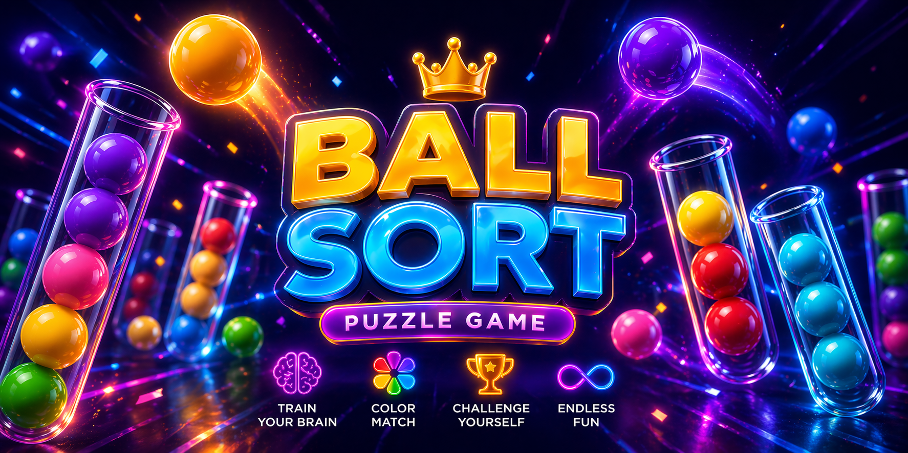
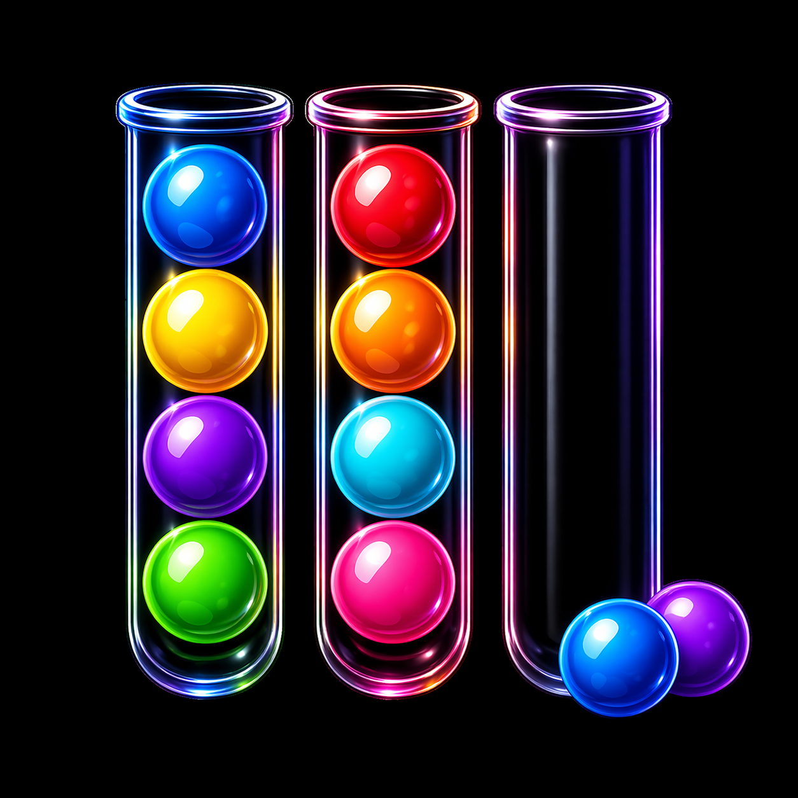
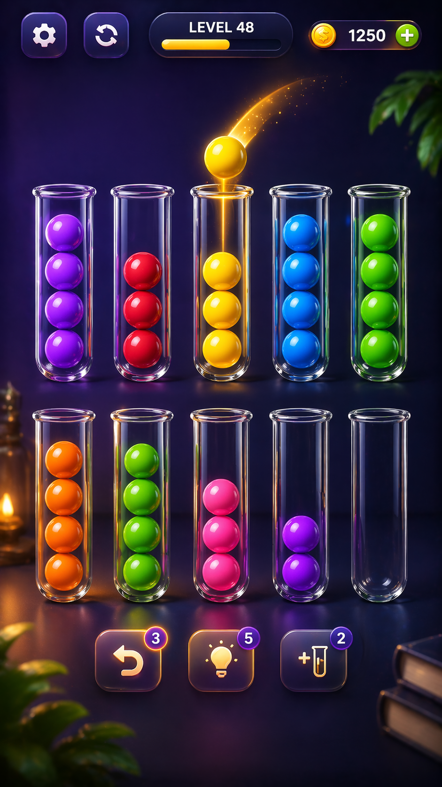
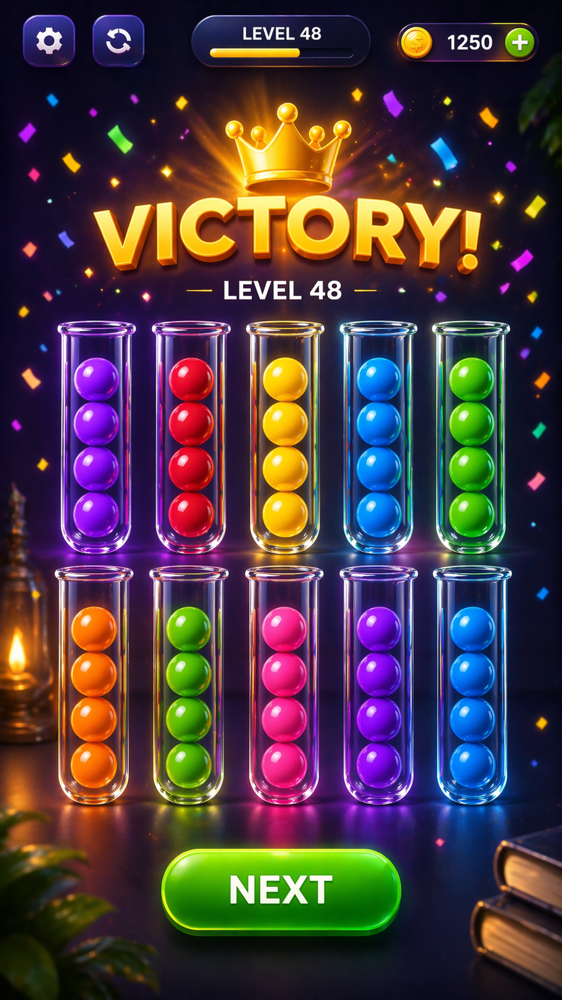
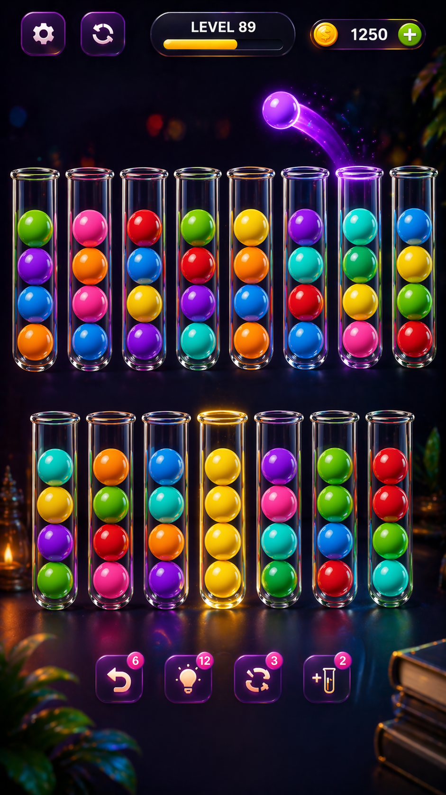
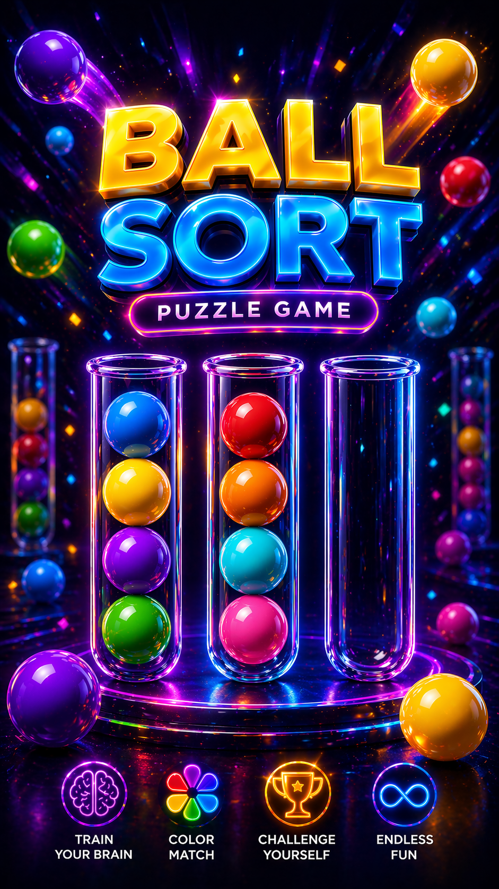
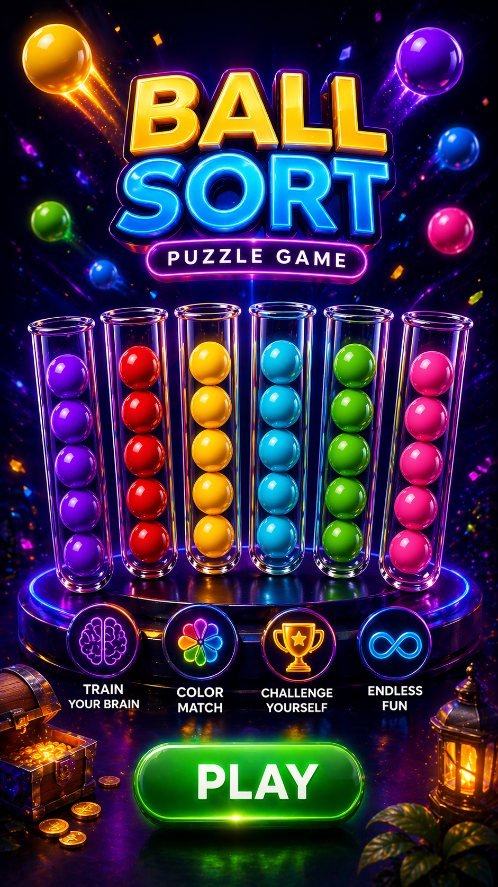

# Tube Master Puzzle

A vibrant ball-sort puzzle game for Android — sort colorful balls into glass test tubes in this brain-teasing, visually stunning mobile experience.



## Screenshots

| Tube Sort Puzzle | Gameplay | Victory |
|:-----------:|:--------:|:-------:|
|  |  |  |

| Advanced Level | Balls & Tubes |
|:--------------:|:-------------:|
|  |  |



---

## Features

- **Brain-Teasing Puzzles** — Sort colored balls into test tubes until each tube contains only one color
- **Progressive Difficulty** — Levels start simple and scale up with more tubes and colors
- **Power-Ups** — Undo, Hint, Shuffle, and Add Tube to help through tough levels
- **Coin Economy** — Earn coins by completing levels and use them for power-ups
- **Stunning Visuals** — Neon-lit glass tubes, glossy 3D balls, and dark lab-themed backgrounds
- **Ad-Supported** — Banner ads and interstitial ads (every 2 level completions) via AdMob

---

## Architecture

The app uses a **hybrid architecture** — a native Android shell wrapping an HTML5/JavaScript game engine inside a WebView.

```
Android Native (Kotlin)          HTML5 Game Engine
┌─────────────────────┐          ┌──────────────────┐
│  MainActivity       │          │  index.html       │
│  ├─ WebView         │◄────────►│  ├─ Ball Physics  │
│  ├─ AdMob (Banner)  │  JS      │  ├─ Level System  │
│  ├─ AdMob (Interstitial)│Bridge │  ├─ Rendering     │
│  ├─ Internet Check  │          │  └─ Game State     │
│  └─ Immersive Mode  │          │                    │
└─────────────────────┘          └──────────────────┘
```

### Key Components

| Component | File | Description |
|-----------|------|-------------|
| Native Shell | [MainActivity.kt](app/src/main/java/com/cktechhub/games/MainActivity.kt) | WebView setup, AdMob, immersive mode, internet check |
| Game Engine | [index.html](app/src/main/assets/index.html) | Full HTML5/JS game with Tailwind CSS |
| Marketing Site | [website/index.html](website/index.html) | Privacy policy & app landing page |
| Ad Bridge | `AdBridge` inner class | JavaScript-to-Android bridge for ad triggers |

---

## Tech Stack

| Layer | Technology |
|-------|-----------|
| Native | Kotlin, Android SDK 36, AppCompat |
| Game Engine | HTML5, JavaScript, CSS3, Tailwind CSS |
| Ads | Google AdMob (Banner + Interstitial) |
| Build | Gradle (Kotlin DSL), AGP 9.0.1 |

---

## Project Structure

```
games/
├── app/
│   ├── src/main/
│   │   ├── assets/
│   │   │   ├── img/                    # Game images & assets
│   │   │   │   ├── ball-banner.png     # Promotional banner
│   │   │   │   ├── balls-sort-logo.png # Home screen logo
│   │   │   │   ├── balls.png           # Balls & tubes graphic
│   │   │   │   ├── pic1.png            # Gameplay screenshot (Level 48)
│   │   │   │   ├── pic2.png            # Victory screen
│   │   │   │   ├── pic3.png            # Advanced level (Level 89)
│   │   │   │   └── play.png            # Play button graphic
│   │   │   └── index.html              # HTML5 game engine
│   │   ├── java/com/cktechhub/games/
│   │   │   └── MainActivity.kt         # Native Android activity
│   │   ├── res/                        # Android resources
│   │   └── AndroidManifest.xml
│   └── build.gradle.kts
├── website/
│   └── index.html                      # Marketing/privacy site
├── gradle/
│   └── libs.versions.toml              # Dependency versions catalog
├── build.gradle.kts
└── settings.gradle.kts
```

---

## Getting Started

### Prerequisites

- Android Studio (latest stable)
- Android SDK 36
- Min SDK 29 (Android 10+)

### Build & Run

1. Clone the repository:
   ```bash
   git clone https://github.com/chetanck03/games
   cd games
   ```

2. Open in Android Studio

3. Sync Gradle and run on a device or emulator

---

## AdMob Configuration

The app uses test AdMob IDs. Before releasing to production, replace these in [MainActivity.kt](app/src/main/java/com/cktechhub/games/MainActivity.kt):

```kotlin
private const val BANNER_AD_UNIT_ID = "ca-app-pub-XXXXX/YYYYY"
private const val INTERSTITIAL_AD_UNIT_ID = "ca-app-pub-XXXXX/YYYYY"
```

Also update the application ID in [AndroidManifest.xml](app/src/main/AndroidManifest.xml):

```xml
<meta-data
    android:name="com.google.android.gms.ads.APPLICATION_ID"
    android:value="ca-app-pub-XXXXX~YYYYY" />
```

Interstitial ads show every **2 level completions** (configurable via `INTERSTITIAL_FREQUENCY`).

---

## Game Mechanics

1. **Goal** — Sort all balls so each test tube contains balls of only one color
2. **Moves** — Tap a tube to pick up the top ball, then tap another tube to drop it
3. **Rules**:
   - You can only place a ball on top of a ball of the same color, or into an empty tube
   - Tubes have a maximum capacity (typically 4 balls)
4. **Power-Ups**:
   - **Undo** — Reverse the last move
   - **Hint** — Highlights a valid move
   - **Shuffle** — Randomly rearranges the balls
   - **Add Tube** — Adds an extra empty tube for more flexibility

---

## License

This project is proprietary. All rights reserved.
