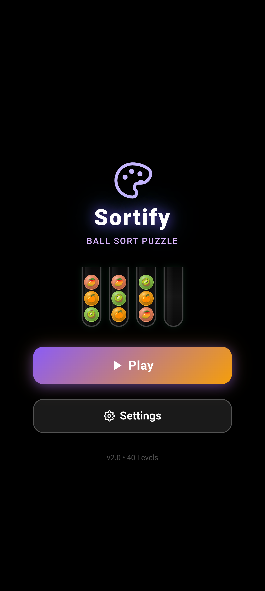
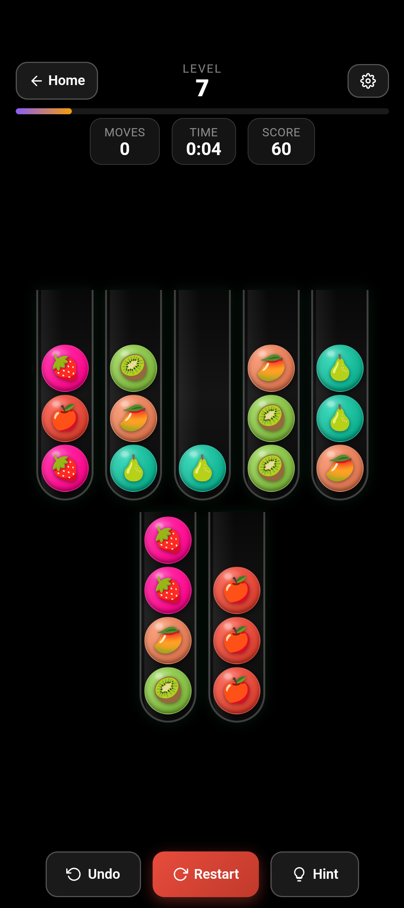
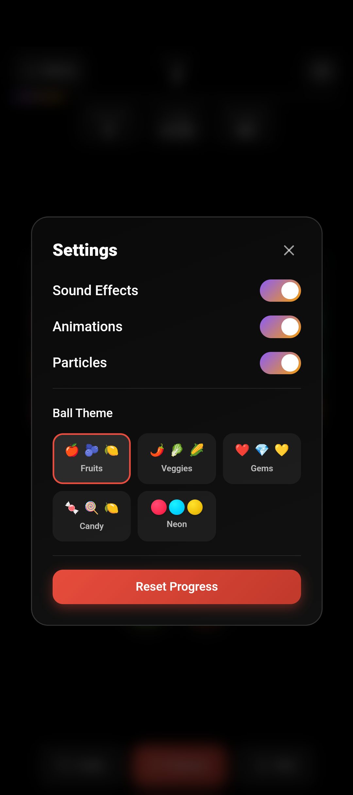
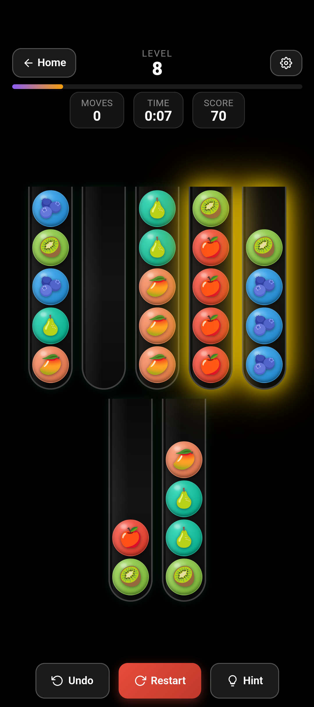
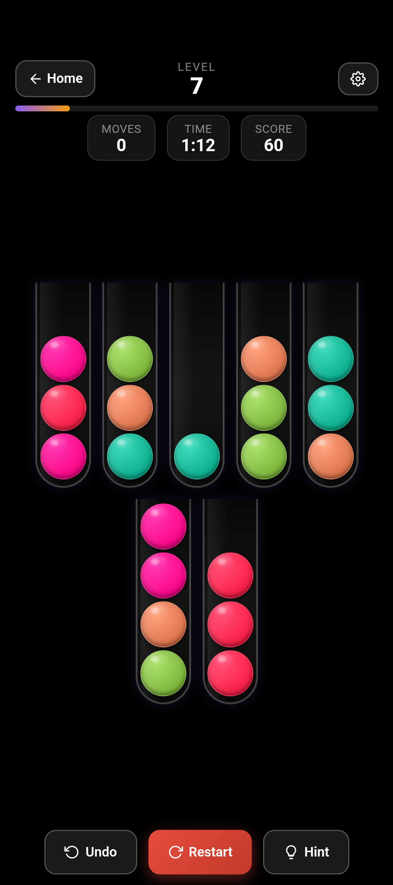
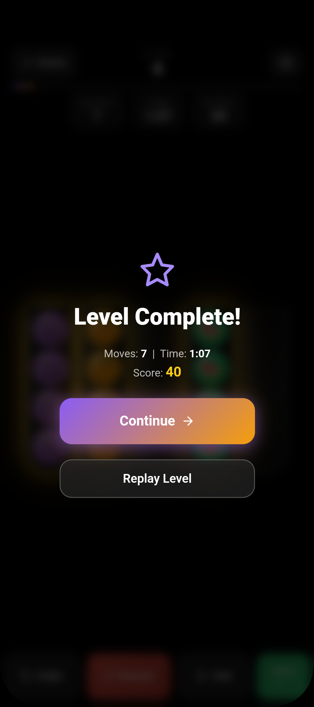
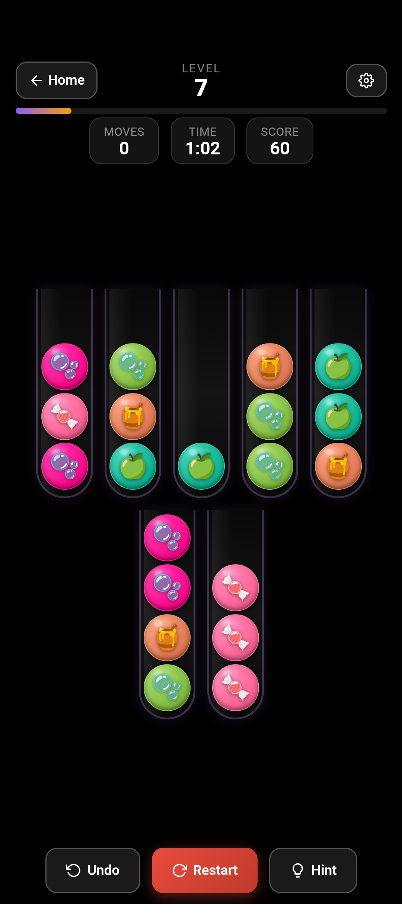
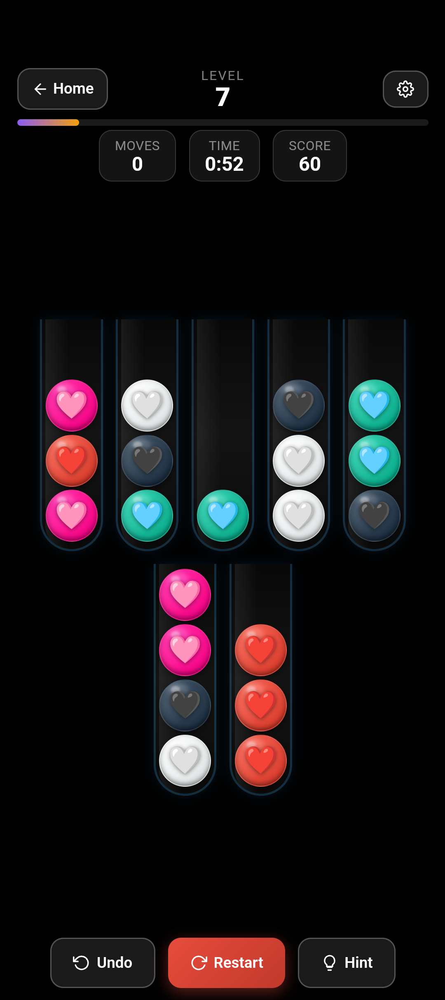

<div align="center">
  
  # Sortify: Ball Sort Puzzle
  
  ### 40 Levels of Brain-Teasing Fun
  
  A vibrant ball-sort puzzle game for Android - sort colorful balls into glass test tubes in this visually stunning mobile experience.
  
  [](https://www.android.com/)
  [](https://developer.android.com/about/versions/10)
  [](https://developer.android.com/)
  [](https://opensource.org/licenses/MIT)
  
</div>

---

## Game Preview

<div align="center">

### Watch Game Trailer

<a href="https://youtu.be/Px2MXnhq6CY">
  
</a>

**[Click to watch the official game trailer on YouTube](https://youtu.be/Px2MXnhq6CY)**

*Experience the addictive gameplay of sorting colorful balls through 40 challenging levels*

---

### Game Banners

<p align="center">
  
  
</p>

</div>

---

## Screenshots

<div align="center">

### Main Screens

| Home Screen | Gameplay | Settings |
|:-----------:|:--------:|:--------------:|
|  |  |  |

### HInt & Preview

| Hint Screen | Game Preview |
|:--------------:|:-------------:|
|  |  |

### Ball Themes

| Level Complete! | Candy Theme | Gems Theme |
|:-----------:|:-----------:|:-----------:|
|  |  |  |

</div>

---

## Features

### 40 Challenging Levels
Progress through 40 carefully crafted puzzle levels that will test your logic and strategy skills. Each level increases in complexity, keeping you engaged from start to finish.

### Core Gameplay
- **Objective**: Sort colored balls into test tubes until each tube contains only one color
- **Progressive Difficulty**: Levels scale from 2 colors to 10 colors with varying tube capacities
- **Strategic Thinking**: Plan your moves carefully to avoid getting stuck

### Visual Customization
- **5 Ball Themes**: Fruits, Veggies, Gems, Candy, and Neon
- **Switch Anytime**: Change themes on-the-fly in Settings
- **Stunning Graphics**: Glass tubes with 3D glossy balls, particle effects, and dark themed backgrounds

### Power-Ups & Tools
- **Undo**: Reverse your last move when you make a mistake
- **Hint**: Get suggestions for valid moves when you're stuck
- **Restart**: Start the current level fresh anytime

### Progress Tracking
- **Scoring System**: Earn +10 points for each level completion
- **Local Save**: Your progress is automatically saved
- **Level Unlocking**: Complete levels to unlock new challenges

### Monetization
- **Banner Ads**: Non-intrusive ads at the bottom of the screen
- **Interstitial Ads**: Full-screen ads every 2 level completions (configurable)
- **AdMob Integration**: Powered by Google AdMob

---

## Architecture

<div align="center">

The app uses a **hybrid architecture** — a native Android shell wrapping an HTML5/JavaScript game engine inside a WebView.

</div>

```
┌──────────────────────────────────────────────────────┐
│            Android Native (Kotlin)                   │
│  ┌────────────────────────────────────────────────┐  │
│  │         MainActivity.kt                        │  │
│  │  ┌──────────┐ ┌──────────┐ ┌──────────────┐    │  │
│  │  │ WebView  │ │  AdMob   │ │Interstitial  │    │  │
│  │  │          │ │  Banner  │ │              │    │  │
│  │  └────┬─────┘ └──────────┘ └──────────────┘    │  │
│  │       │                                        │  │
│  │       │  JavaScript Bridge (AdBridge)          │  │
│  │       │                                        │  │
│  │  ┌────┴─────┐ ┌──────────┐ ┌──────────────┐    │  │
│  │  │ Internet │ │Immersive │ │   Offline    │    │  │
│  │  │  Check   │ │Full-Scrn │ │   Handling   │    │  │
│  │  └──────────┘ └──────────┘ └──────────────┘    │  │
│  └────────────────────────────────────────────────┘  │
└────────────────────┬─────────────────────────────────┘
                     │
                     │ Bidirectional Communication
                     │
┌────────────────────┴─────────────────────────────────┐
│        HTML5 Game Engine (index.html)                │
│  ┌────────────────────────────────────────────────┐  │
│  │  ┌──────────┐ ┌──────────┐ ┌──────────────┐    │  │
│  │  │   Ball   │ │  Level   │ │  Rendering   │    │  │
│  │  │ Physics  │ │  System  │ │              │    │  │
│  │  └──────────┘ └──────────┘ └──────────────┘    │  │
│  │  ┌──────────┐ ┌──────────┐ ┌──────────────┐    │  │
│  │  │   Game   │ │  Theme   │ │  Animations  │    │  │
│  │  │  State   │ │  System  │ │              │    │  │
│  │  └──────────┘ └──────────┘ └──────────────┘    │  │
│  │  ┌──────────┐ ┌──────────┐ ┌──────────────┐    │  │
│  │  │ Scoring  │ │Power-Ups │ │  Particles   │    │  │
│  │  │          │ │          │ │              │    │  │
│  │  └──────────┘ └──────────┘ └──────────────┘    │  │
│  └────────────────────────────────────────────────┘  │
└──────────────────────────────────────────────────────┘
```

### Key Components

| Component | File | Description |
|-----------|------|-------------|
| **Native Shell** | [MainActivity.kt](app/src/main/java/com/cktechhub/games/MainActivity.kt) | WebView setup, AdMob integration, immersive mode, internet connectivity check |
| **Game Engine** | [index.html](app/src/main/assets/index.html) | Complete HTML5/JavaScript game with Tailwind CSS styling |
| **Marketing Site** | [website/index.html](website/index.html) | Privacy policy & app landing page |
| **Ad Bridge** | `AdBridge` inner class | JavaScript-to-Android bridge for triggering ads |
| **Assets** | [app/src/main/assets/](app/src/main/assets/) | Game images, themes, and resources |

---

## Tech Stack

| Layer | Technology | Purpose |
|-------|-----------|---------|
| **Native** | Kotlin | Android application logic |
| **SDK** | Android SDK 36 | Latest Android features |
| **UI Framework** | AppCompat | Backward compatibility |
| **Game Engine** | HTML5 + JavaScript | Core game logic and rendering |
| **Styling** | CSS3 + Tailwind CSS | Responsive design and animations |
| **Monetization** | Google AdMob | Banner and interstitial ads |
| **Build System** | Gradle (Kotlin DSL) | Dependency management |
| **Build Tools** | AGP 9.0.1 | Android Gradle Plugin |

### Dependencies

```kotlin
// Core Android
implementation("androidx.appcompat:appcompat:1.7.0")
implementation("androidx.constraintlayout:constraintlayout:2.2.0")

// Google AdMob
implementation("com.google.android.gms:play-services-ads:23.6.0")

// WebView
implementation("androidx.webkit:webkit:1.12.1")
```

---

## Project Structure

```
games/
├── app/
│   ├── src/main/
│   │   ├── assets/
│   │   │   ├── img/                          # Banner images
│   │   │   │   ├── banner.png
│   │   │   │   ├── banner1.png
│   │   │   │   ├── banner2.png
│   │   │   │   └── sortify.mp4               # Game preview video
│   │   │   ├── sortify/                      # Game screenshots & assets
│   │   │   │   ├── balls-sort-logo.png       # App logo
│   │   │   │   ├── pic0.png                  # Home/Level select
│   │   │   │   ├── pic1.png                  # Gameplay
│   │   │   │   ├── pic2.png                  # Victory screen
│   │   │   │   ├── pic3.png                  # In-progress level
│   │   │   │   ├── pic4.png                  # Fruits theme
│   │   │   │   ├── pic5.png                  # Gems theme
│   │   │   │   ├── pic6.png                  # Neon theme
│   │   │   │   └── pic7.png                  # Game preview
│   │   │   └── index.html                    # HTML5 game engine
│   │   ├── java/com/cktechhub/games/
│   │   │   ├── MainActivity.kt               # Main Android activity
│   │   │   └── ui/                           # UI components
│   │   ├── res/                              # Android resources
│   │   │   ├── drawable/                     # Icons & graphics
│   │   │   ├── layout/                       # XML layouts
│   │   │   ├── mipmap/                       # App icons
│   │   │   └── values/                       # Strings, colors, themes
│   │   └── AndroidManifest.xml               # App configuration
│   └── build.gradle.kts                      # App-level build config
├── website/
│   └── index.html                            # Marketing & privacy page
├── gradle/
│   └── libs.versions.toml                    # Dependency versions catalog
├── build.gradle.kts                          # Project-level build config
├── settings.gradle.kts                       # Gradle settings
├── README.md                                 # This file
└── ADMOB_SETUP.md                            # AdMob configuration guide
```

---

## Getting Started

### Prerequisites

Before you begin, ensure you have the following installed:

- **Android Studio** (latest stable version)
- **Android SDK 36** (Target SDK)
- **Min SDK 29** (Android 10+)
- **JDK 17** or higher
- **Gradle 8.0+** (included with Android Studio)

### Installation & Setup

1. **Clone the repository**
   ```bash
   git clone https://github.com/chetanck03/games.git
   cd games
   ```

2. **Open in Android Studio**
   - Launch Android Studio
   - Select "Open an Existing Project"
   - Navigate to the cloned `games` directory
   - Click "OK"

3. **Sync Gradle**
   - Android Studio will automatically prompt to sync Gradle
   - Wait for the sync to complete
   - Resolve any dependency issues if prompted

4. **Configure AdMob (Optional for Testing)**
   - The app uses test AdMob IDs by default
   - For production, see [AdMob Configuration](#-admob-configuration) section

5. **Run the App**
   - Connect an Android device (API 29+) or start an emulator
   - Click the "Run" button (▶️) in Android Studio
   - Select your target device
   - Wait for the build to complete and app to launch

### Quick Start Commands

```bash
# Build the project
./gradlew build

# Install on connected device
./gradlew installDebug

# Run tests
./gradlew test

# Clean build
./gradlew clean
```

---

## AdMob Configuration

The app comes with test AdMob IDs for development. Before releasing to production, you must replace these with your own AdMob IDs.

### Step 1: Update Ad Unit IDs

Edit [MainActivity.kt](app/src/main/java/com/cktechhub/games/MainActivity.kt):

```kotlin
// Replace with your actual AdMob IDs
private const val BANNER_AD_UNIT_ID = "ca-app-pub-XXXXXXXXXXXXX/YYYYYYYYYY"
private const val INTERSTITIAL_AD_UNIT_ID = "ca-app-pub-XXXXXXXXXXXXX/YYYYYYYYYY"
```

### Step 2: Update Application ID

Edit [AndroidManifest.xml](app/src/main/AndroidManifest.xml):

```xml
<meta-data
    android:name="com.google.android.gms.ads.APPLICATION_ID"
    android:value="ca-app-pub-XXXXXXXXXXXXX~YYYYYYYYYY" />
```

### Step 3: Configure Ad Frequency

Interstitial ads show every **2 level completions** by default. To change this, edit `MainActivity.kt`:

```kotlin
private const val INTERSTITIAL_FREQUENCY = 2  // Show ad every N levels
```

### Getting Your AdMob IDs

1. Create an account at [AdMob](https://admob.google.com/)
2. Create a new app in the AdMob console
3. Create ad units for:
   - Banner ad (320x50)
   - Interstitial ad (Full screen)
4. Copy the generated IDs and replace in the code

### Testing Ads

The app uses test IDs during development:
- **Test Banner ID**: `ca-app-pub-3940256099942544/6300978111`
- **Test Interstitial ID**: `ca-app-pub-3940256099942544/1033173712`

For more details, see [ADMOB_SETUP.md](ADMOB_SETUP.md)

---

## Game Mechanics

### How to Play

1. **Goal**: Sort all balls so each test tube contains balls of only one color
2. **Controls**: 
   - Tap a tube to pick up the top ball
   - Tap another tube to drop the ball
3. **Rules**:
   - You can place a ball on top of another ball of the same color
   - You can place a ball in an empty tube
   - You cannot place a ball on a different colored ball
   - Tubes have a maximum capacity (typically 4 balls)

### Power-Ups

| Power-Up | Description | Usage |
|----------|-------------|-------|
| **Undo** | Reverse the last move | Perfect for correcting mistakes |
| **Hint** | Highlights a valid move | Use when you're stuck |
| **Restart** | Reset the current level | Start fresh with a new strategy |

### Progression System

- **40 Levels Total**: From beginner to expert difficulty
- **Color Complexity**: Start with 2 colors, progress to 10 colors
- **Tube Variations**: Different numbers of tubes and capacities per level
- **Score Tracking**: Earn points and track your progress

---

## License

This project is licensed under the MIT License - see the [LICENSE](LICENSE) file for details.

### MIT License Summary

You are free to:
- Use this project commercially
- Modify and distribute the code
- Use it privately
- Sublicense the code

Under the following conditions:
- Include the original copyright notice and license in any copy
- The software is provided "as is", without warranty

---

## Developer

**Chetan Kumar**
- GitHub: [@chetanck03](https://github.com/chetanck03)
- Project: [Sortify - Ball Sort Puzzle](https://github.com/chetanck03/games)

---

## Contributing

Contributions are welcome! Please feel free to submit a Pull Request. For major changes, please open an issue first to discuss what you would like to change.

### How to Contribute

1. Fork the repository
2. Create your feature branch (`git checkout -b feature/AmazingFeature`)
3. Commit your changes (`git commit -m 'Add some AmazingFeature'`)
4. Push to the branch (`git push origin feature/AmazingFeature`)
5. Open a Pull Request

---

## Support

For issues, questions, or feedback:
- Open an issue on [GitHub Issues](https://github.com/chetanck03/games/issues)
- Contact via GitHub profile

---

<div align="center">
  
  ### Ready to Sort Some Balls?
  
  **Download and start playing through 40 challenging levels!**
  
  Made with love using Kotlin, HTML5, and JavaScript
  
</div>
